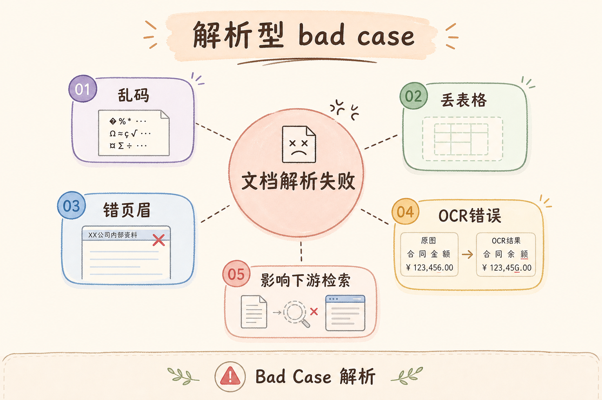
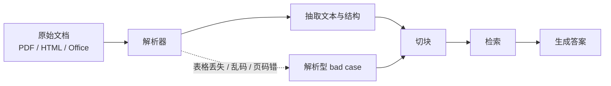
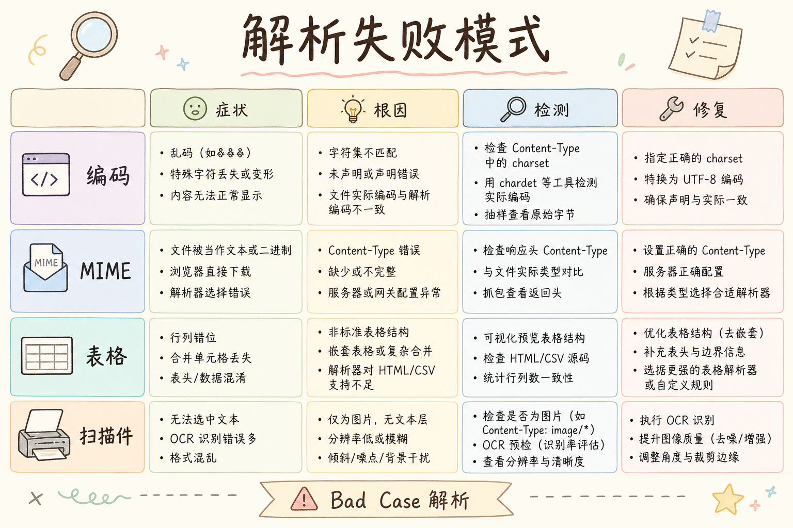
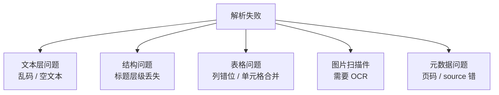
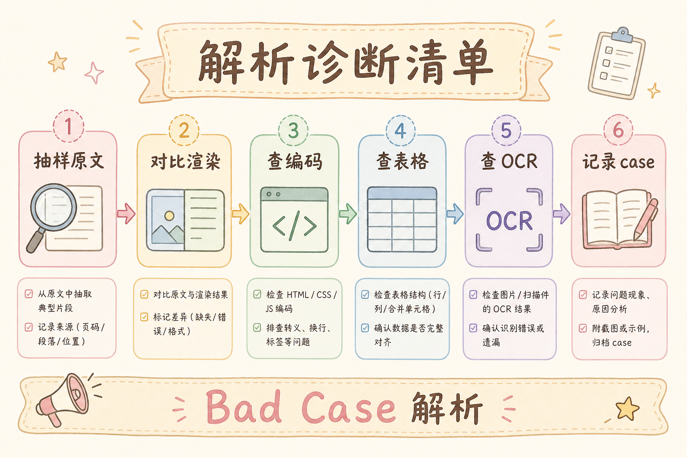
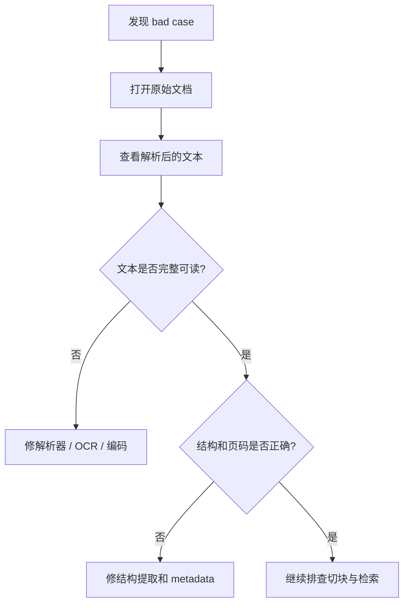
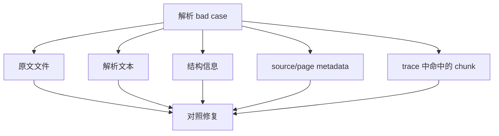

# E 评测与观测（十一）：Bad Case 归因之解析错误完全指南

> 用户问「表格里第三列报销上限是多少」，机器人答「请咨询财务」——你查向量库，发现 **根本没有那条 chunk**。打开源 PDF，肉眼明明有表；再 `get_text()`，表变成 **一行乱序数字**。这不是检索参数问题，是 **ingest 解析错了**。这篇是 [企业 RAG 路线图](ENTERPRISE_RAG_ROADMAP.md) **E 模块地基篇**（路线图第 **166** 条），教你 **从 [147 LangSmith](147.langsmith-tracing-tutorial.md) / [148 Langfuse](148.langfuse-observability-tutorial.md) trace 认出解析型 bad case**，并对照 C1 轨 [36～56 解析系列](36.pdf-text-extraction-tutorial.md) 修。前置：[36 PDF 提取](36.pdf-text-extraction-tutorial.md)、[46 文本清洗](46.text-cleaning-tutorial.md)、[147 追踪](147.langsmith-tracing-tutorial.md)。

---

## 目录

1. [前言：解析错是「无声杀手」](#1-前言解析错是无声杀手)
2. [本文边界与动手路径](#2-本文边界与动手路径)
3. [解析型 bad case 是什么](#3-解析型-bad-case-是什么)
4. [在 trace 上如何识别](#4-在-trace-上如何识别)
5. [失败模式地图：对照 36～56](#5-失败模式地图对照-3656)
6. [PDF 专项：文本层与扫描件](#6-pdf-专项文本层与扫描件)
7. [Office / HTML / Markdown 专项](#7-office--html--markdown-专项)
8. [编码、清洗与元数据](#8-编码清洗与元数据)
9. [诊断清单与抽样验收](#9-诊断清单与抽样验收)
10. [修复 Playbook](#10-修复-playbook)
11. [先错对对：五种典型误判](#11-先错对对五种典型误判)
12. [综合概念地图](#12-综合概念地图)
13. [常见陷阱与 FAQ](#13-常见陷阱与-faq)
14. [总结与系列下一步](#14-总结与系列下一步)

---

## 1. 前言：解析错是「无声杀手」

解析错最难缠之处：**索引「成功」了**——任务状态 `done`，chunk 数量正常，向量也入库了，但 **字是错的、顺序是错的、表是扁的**。检索只能在海里捞 **已经变形的鱼**。

与 [151 检索遗漏](151.bad-case-retrieval-miss-tutorial.md) 区分：

| 类型 | 库里有正确文本吗 | trace 里 retrieval 现象 |
|------|------------------|-------------------------|
| 解析错 | **没有**（或只有残缺） | 即使用正确 query 也 **捞不到** 正确表述 |
| 检索漏 | **有** | hits 不含应命中的 chunk |

与 [150 切块错](150.bad-case-chunking-tutorial.md) 区分：解析错是 **入库前** 文本已坏；切块错是 **文本对但刀口切坏**。

**读完本文，你应该能做到：**

1. 用 trace 判断 bad case 是否 **优先怀疑解析**。  
2. 列出 [36](36.pdf-text-extraction-tutorial.md)～[56](56.multimodal-image-text-tutorial.md) 各篇负责的失败模式。  
3. 完成 §9 十文档抽样验收表。  
4. 写一条解析修复工单（换解析器 / OCR / 清洗规则）。  
5. 修复后用 [161 回归集](144.regression-test-set-tutorial.md) 验证 **同一 query 能检索到正确事实**。

---

## 2. 本文边界与动手路径

**档位：E 地基篇（166）。**

**本文讲：** 解析型 bad case 识别、trace 特征、36～56 对照、诊断清单、修复 Playbook。  
**本文不讲：** 单个解析库 API 大全（见 C1 各工具篇）、OCR 模型训练。

### 2.1 动手路径

| 步骤 | 验收 |
|------|------|
| A | 选 1 条真实 bad case | 有 trace 链接 |
| B | 对源文件人工复制 vs 库内 chunk | 记录差异 |
| C | 填 §9 诊断清单 | 归因「解析」 |
| D | 选 C1 一篇工具升级 | 重跑 ingest |
| E | 回归集同题重测 | 检索命中 |

---

## 3. 解析型 bad case 是什么

读下图时，先看「解析型 bad case」想表达的主线：它把本节的概念关系压缩成一张可对照的图。



下面这张图说明解析型 bad case 在 RAG 链路里的位置。读图时重点看：如果原文解析错了，后面的切块、检索和生成都会建立在错误材料上。



结论：解析错不是小瑕疵，而是数据源头污染。遇到答案离谱时，先确认系统读到的原文是否正确。

**定义**：因 **文档解析 / 提取 / 编码 / 清洗** 阶段错误，导致入库文本与源文档 **语义或结构不一致**，进而使 RAG **无法检索或引用到正确内容**。

常见用户可见症状：

- 答案说「资料未提及」，但 PDF 里 **肉眼可见**；  
- 引用打开后 **空白页** 或 **乱码**；  
- 数字、日期、条款号 **系统性偏差**；  
- 多栏文档 **左右栏串读**。

---

## 4. 在 trace 上如何识别

在 [147 LangSmith](147.langsmith-tracing-tutorial.md) 或 [148 Langfuse](148.langfuse-observability-tutorial.md) 中：

### 4.1 固定三步

解析问题要先确认“库里到底有没有正确文本”。下面三步按证据强弱递进，能把解析错和后面的切块、检索问题分开。

1. **复制用户 query**，在 **检索调试台**（路线图 199）或 trace 的 retriever 输出看 Top-K；  
2. **打开** `metadata.source` / `page`（[52 篇](52.metadata-source-page-tutorial.md)）对照源文件；  
3. 若源文件有、库内 **无对应字面或语义** → **优先解析** 而非先调 `top_k`。

### 4.2 trace 指纹

| 指纹 | 含义 |
|------|------|
| 全库无某 doc 关键词 | 可能解析丢段或 [47 去重](47.doc-dedup-tutorial.md) 误删 |
| 有词但数字错 | [37 表格](37.pdf-layout-tables-tutorial.md)、[43 pdfplumber](43.pdfplumber-tutorial.md) |
| 英文正常中文方块 | [41 编码](41.text-encoding-detection-tutorial.md) |
| 页眉页脚插进正文 | [46 清洗](46.text-cleaning-tutorial.md) |
| 扫描件无字 | [55 OCR](55.ocr-scanned-docs-tutorial.md) |

---

## 5. 失败模式地图：对照 36～56

读下图时，先看「解析失败模式地图」想表达的主线：它把本节的概念关系压缩成一张可对照的图。



下面这张图把常见解析失败分成几类。读图时重点看：不同失败模式对应不同修复手段，不要只靠调 chunk_size。



这张图的用法是：先把坏案例归到具体失败模式，再决定换解析器、加 OCR、补元数据，还是重做清洗规则。

| 路线图 | 文章 | 典型解析问题 | bad case 信号 |
|--------|------|--------------|---------------|
| 43 | [36 PDF 文本](36.pdf-text-extraction-tutorial.md) | 无文本层、乱序 | 复制 PDF 与 chunk 不一致 |
| 44 | [37 PDF 版面](37.pdf-layout-tables-tutorial.md) | 表变空格 | 报销额、税率全错 |
| 45 | [38 Markdown](38.markdown-parsing-tutorial.md) | 标题层级丢 | 条款挂错章 |
| 46 | [39 HTML](39.html-content-extraction-tutorial.md) | 导航菜单入库 | 答案带「首页登录」 |
| 47 | [40 DOCX](40.docx-office-parsing-tutorial.md) | 列表编号乱 | 政策序号错 |
| 48 | [41 编码](41.text-encoding-detection-tutorial.md) | 乱码 | 中文变 `` |
| 49～52 | [42～45 工具](42.pymupdf-tutorial.md) | 工具特化问题 | 换工具后好转 |
| 53 | [46 清洗](46.text-cleaning-tutorial.md) | 过度清洗 | 数字被删 |
| 54 | [47 去重](47.doc-dedup-tutorial.md) | 近重复误并 | 版本混用 |
| 55～56 | [48～49 版本/增量](48.doc-versioning-tutorial.md) | 旧版覆盖 | 答案过期 |
| 57～61 | [50～54 元数据](50.metadata-doc-id-tutorial.md) | id 错 | 引用张冠李戴 |
| 62 | [55 OCR](55.ocr-scanned-docs-tutorial.md) | 扫描未 OCR | 库内无字 |
| 63 | [56 多模态](56.multimodal-image-text-tutorial.md) | 图内字未抽 | 流程图信息丢失 |

**工程原则**：bad case 先 **定位到上表一行**，再打开对应 C1 教程 **深修**，避免在检索层空转。

---

## 6. PDF 专项：文本层与扫描件
PDF 解析先要判断它到底有没有文本层：有文本层可以直接抽取文字，扫描件则必须走 OCR。很多“解析失败”不是代码问题，而是把图片型 PDF 当成文本 PDF 处理了。

### 6.1 文本层 PDF

用 [36 篇](36.pdf-text-extraction-tutorial.md) pypdf 抽一遍，与 [42 PyMuPDF](42.pymupdf-tutorial.md)、[43 pdfplumber](43.pdfplumber-tutorial.md) 对照。若 **仅某一工具** 顺序正常 → 固定该工具为 **主解析器**（[136 可插拔 Parser](136.pluggable-parser-splitter-embedder-tutorial.md)）。

### 6.2 扫描件

库内字符数极少、图片占比高 → [55 OCR](55.ocr-scanned-docs-tutorial.md)。未 OCR 的扫描 PDF **不应标记 ingest done**（路线图 178 状态机应 **blocked**）。

### 6.3 表格

财务、报销类 bad case **高发表格** → 必读 [37](37.pdf-layout-tables-tutorial.md)。trace 显示 chunk 里 **数字没有列标题对应** 时，优先版面恢复而非 chunk 加大。

---

## 7. Office / HTML / Markdown 专项

- **DOCX**：[40 篇](40.docx-office-parsing-tutorial.md)——合同、制度 Word 多；  
- **HTML 帮助中心**：[39 篇](39.html-content-extraction-tutorial.md)——侧边栏污染是常见 bad case；  
- **Markdown 知识库**：[38 篇](38.markdown-parsing-tutorial.md)——代码块、表格语法影响 [63 AST 切块](63.markdown-ast-chunking-tutorial.md) 前置。

---

## 8. 编码、清洗与元数据

[41 编码检测](41.text-encoding-detection-tutorial.md)：GBK/UTF-8 误读会产生 **形似乱码** 的固定替换字。  
[46 清洗](46.text-cleaning-tutorial.md)：正则删页码时勿删 **条款编号**。  
[50 doc_id](50.metadata-doc-id-tutorial.md) + [48 版本](48.doc-versioning-tutorial.md)：解析修完后 **新 doc_id 或 version**，避免旧向量 **幽灵命中**。

---

## 9. 诊断清单与抽样验收

读下图时，先看「解析诊断清单」想表达的主线：它把本节的概念关系压缩成一张可对照的图。



下面这张图给出解析问题的诊断顺序。读图时重点看：诊断要从原文和解析产物开始，而不是直接改检索参数。



按这个顺序排查，可以避免把源头解析问题误判成向量检索问题。

**十文档抽样表**（每周 ingest 质检）：

| # | 文件名 | 人工可读 | 表/图 | 编码 | 入库字数比 | 结论 |
|---|--------|----------|-------|------|------------|------|
| 1 | handbook.pdf | ✓/✗ | | | | |

字数比 = `len(库内正文) / len(人工抽样正文)`，**<0.7 或 >1.3** 标黄。

---

## 10. 修复 Playbook

1. **冻结 bad case**：trace + 源文件 + chunk_id；  
2. **复现提取**：命令行单独跑 Parser，输出 `.txt` diff；  
3. **选型**：按 §5 表换工具或加 OCR；  
4. **重 ingest**：[49 增量](49.incremental-update-tutorial.md) 或 [162 幂等重建](162.idempotent-reindex-tutorial.md)；  
5. **回归**：[161 回归集](144.regression-test-set-tutorial.md) + [141 Faithfulness](141.ragas-faithfulness-tutorial.md)；  
6. **登记**：[171 参数版本](154.param-version-management-tutorial.md) `parser=pymupdf-v2`。

---

## 11. 先错对对：五种典型误判
下面的错法适合当排障清单看：它们不是语法问题，而是会让评估、追踪或坏例分析失去证据链，最后只能靠猜测定位问题。

### 11.1 错：一律加大 chunk_size

**对**：解析乱序时大 chunk **更乱**。

### 11.2 错：先上混合检索

**对**：库内无正确字，[93 Hybrid](93.hybrid-search-tutorial.md) 无效。

### 11.3 错：怪 Embedding 模型

**对**：先 diff 源文与库文。

### 11.4 错：忽略扫描件

**对**：页级检测文本层字符数。

### 11.5 错：修复后不升 doc 版本

**对**：见 [48 版本](48.doc-versioning-tutorial.md)。

---

## 12. 综合概念地图

读下图时，先看「解析 bad case 概念地图」想表达的主线：它把本节的概念关系压缩成一张可对照的图。


下面这张概念地图把解析 bad case 的检查对象串起来。读图时重点看：原文、解析文本、metadata 和 trace 要一起看。



结论：解析归因必须做对照。只看最终答案，无法判断到底是解析、切块、检索还是生成的问题。

---


## 13. 常见陷阱与 FAQ
最后用 FAQ 收束坏例分析的边界。坏例不是为了“证明系统很差”，而是把失败归因到解析、切块、召回、重排或生成中的具体一层。

### 13.1 初学者最常踩的三坑

下面三坑会让解析问题被误判成模型问题。阅读时重点看“证据链”是否完整：原始文件、解析文本、切块输入和最终答案要能连起来。

1. **只看最终答案，不看链路**——解析归因的价值在 **可复现的中间态**。  
2. **没有金标就调参**——没有 [160 Golden Dataset](143.golden-dataset-tutorial.md) 时，A/B 只是 **主观吵架**。  
3. **工具买了不用**——装了 LangSmith/Langfuse 却不给每次请求打 `trace_id`，等于 **黑盒上线**。

### 13.2 FAQ 精选

**Q1：PoC 阶段要不要上观测？**  
要。**最小集**：`request_id` + 检索 Top-5 `chunk_id` + 模型名 + 延迟。完整平台可后补，但 **字段契约** 第一天就定。

**Q2：和 RAGAS 指标怎么配合？**  
RAGAS 回答 **「好不好」**；观测平台回答 **「哪一步坏了」**。建议：金标跑 RAGAS 批次，线上 bad case 用 trace 下钻。

**Q3：成本会不会爆？**  
Trace 存全文 context 很贵。生产用 **采样**（如 5%）+ **摘要字段**（chunk_id、score、前 200 字预览），全文按需拉取。

**Q4：多环境怎么隔离？**  
`project` / `environment` 标签：`dev` / `staging` / `prod` 分开；**禁止** 把 prod trace 当训练数据未经脱敏。

**Q5：谁负责看板？**  
工程搭管道，**产品 + 领域专家** 每周过 bad case；研发负责 **归因到模块**（解析/切块/检索/生成）。

**Q6：失败请求要不要记 trace？**  
**更要记**。超时、空检索、解析异常——没有失败 trace，你永远在猜。

**Q7：和 [147 LangSmith](147.langsmith-tracing-tutorial.md) / [148 Langfuse](148.langfuse-observability-tutorial.md) 二选一？**  
LangChain 深度用 LangSmith 顺手；要 **自托管、开源、多框架** 看 Langfuse。也可 **双写** 过渡期，但统一 `trace_id`。

**Q8：如何证明一次修复有效？**  
回归集 [161](144.regression-test-set-tutorial.md) 上 **同题同参** 对比；再看线上 **7 日 bad case 率**。

**Q9：实习生能维护吗？**  
把 **归因决策树** 贴在 wiki（本篇系列 149～152）；观测 UI 只读权限给全员，写权限限研发。

**Q10：面试怎么讲？**  
30 秒：**「RAG 上线后我用 trace 把 bad case 分到 ingest/retrieve/generate，用金标 + A/B 验证改动，参数版本可回滚。」**

**Q11：解析和切块怎么快速分？**  
同一 chunk 内 **前半句通后半句断** → 切块；**整段与 PDF 复制不一致** → 解析。
## 14. 总结与系列下一步
最后把本篇的关键判断整理成清单，方便你回头复习，也方便继续阅读系列里的下一篇。

### 14.1 本篇要点回顾

本篇是 [企业 RAG 路线图](ENTERPRISE_RAG_ROADMAP.md) **E 模块** 的一环。E 模块主线是：**先有金标与指标 → 再有观测 → 再会归因 bad case → 再用实验与版本管理迭代**。

### 14.2 系列下一步

解析归因读完后，下一步要把它和切块、检索、版本管理串起来。否则你只能知道“解析可能有问题”，还不能形成修复闭环。

| 目标 | 阅读 |
|------|------|
| Bad Case：切块 | [150 切块归因](150.bad-case-chunking-tutorial.md) |
| Bad Case：检索 | [151 检索遗漏](151.bad-case-retrieval-miss-tutorial.md) |
| Langfuse 观测 | [148 Langfuse](148.langfuse-observability-tutorial.md) |
| PDF 提取 | [36 PDF 提取](36.pdf-text-extraction-tutorial.md) |

### 14.3 学习目标自检

这一节用于快速判断你是否真的能处理解析型 bad case，而不是只记住了几个工具名。

- [ ] 能口述本篇在 E 模块中的位置  
- [ ] 能列出至少三个与前序文章的衔接点  
- [ ] 能完成一篇中的「动手路径」验收  
- [ ] 能在观测 UI 或日志里找到一次完整 RAG trace  
- [ ] 能把一个真实 bad case 写到归因树的一叶子上  

### 14.4 面试 30 秒版

见 §12 FAQ Q10。

### 14.5 30 分钟作业

1. 选一条你项目里的 **真实用户问题**；  
2. 在 LangSmith 或 Langfuse（或最小 JSON 日志）里拉出 **完整 trace**；  
3. 用 149～152 决策树写 **归因假设**；  
4. 写一条 **可验证的修复实验**（对接 [170 A/B](153.ab-experiment-rag-tutorial.md)）；  
5. 在 [171 参数版本](154.param-version-management-tutorial.md) 表里登记本次改动的参数。

---

> **初学者可能仍困惑的点**  
> - **观测 ≠ 评测**：前者定位，后者打分。  
> - **了解档** 也要会 **最小集成**，否则面试说不清。  
> - Bad case 系列要 **交叉验证**：解析错会像检索漏，生成胡编有时是检索空。  
> - 任何改动 **必须可回滚**——见参数版本篇。


### 14.6 解析归因深度补充：跨格式抽检

**每周抽检脚本逻辑**：随机 10 个 `doc_id`，对每页执行 (1) 字符数 (2) 可打印字符比例 (3) 表格检测启发式 (4) 与上一版 ingest 字数 diff >20% 告警。对接 [44 unstructured](44.unstructured-io-tutorial.md)、[45 Tika](45.apache-tika-tutorial.md) 时记录 **parser 版本** 到 [171 manifest](154.param-version-management-tutorial.md)。

**与 [56 多模态](56.multimodal-image-text-tutorial.md)**：流程图内文字未 OCR 时，bad case 表现与 **扫描 PDF** 相同——在 149 树归 **解析**，不是 151 检索。修复后重跑 [55 OCR](55.ocr-scanned-docs-tutorial.md) 管线。

**法务合同场景**：脚注、小字号条款解析失败率高——优先 [37 版面](37.pdf-layout-tables-tutorial.md) + 人工 spot check 进 [160 金标](143.golden-dataset-tutorial.md)。


## 15. 解析归因案例精读

解析型 bad case 像 **慢性中毒**：索引成功、条数正常，但字错序错表扁。识别靠 **源文件 diff**，不是看检索分数。trace 里 Top-K 无 gold 句，且库内全文搜索也无，优先怀疑解析。

对照 C1 轨：[36 PDF](36.pdf-text-extraction-tutorial.md) 乱序、[37 表格](37.pdf-layout-tables-tutorial.md) 数字扁、[41 编码](41.text-encoding-detection-tutorial.md) 乱码、[55 OCR](55.ocr-scanned-docs-tutorial.md) 扫描无字、[39 HTML](39.html-content-extraction-tutorial.md) 导航污染。每类失败在 §5 表有信号。

修复后必须 **新 doc 版本或 param_version**（[48 版本](48.doc-versioning-tutorial.md)、[171 篇](154.param-version-management-tutorial.md)），全量重 ingest，[161 回归集](144.regression-test-set-tutorial.md) 验证 gold 句可检索。

在 [147/148](147.langsmith-tracing-tutorial.md) 工单写：源路径、页码、parser 版本、diff 摘要。勿与 [150 切块](150.bad-case-chunking-tutorial.md) 混淆：解析错是整段与源不一致，切块错是源对但刀口断句。

每周十文档抽检：字数比、可打印字符比、表格启发式。超阈值标黄，不进生产索引。


## 16. 练习与自检

动手一：选一 bad case，源 PDF 复制 vs chunk diff。动手二：填十文档抽检表一行。动手三：写解析修复工单。

自检：解析 vs 检索漏 vs 切块 区分？36～56 各举一信号？重 ingest 为何要升版本？

误区：先 hybrid；先加大 chunk；怪 Embedding；扫描件不 OCR 就 done。

trace 来自 [147/148](147.langsmith-tracing-tutorial.md)。修完跑 [161 回归](144.regression-test-set-tutorial.md)。

## 17. 解析归因周课与清单

**每日**： ingest 队列抽一条，人工对照源文件前三页。**每周**：十文档抽检表归档。**每月**： parser 版本与 [171 param_version](154.param-version-management-tutorial.md) 对照，过期策略升级。

双栏 PDF、扫描件、表格、HTML 导航、DOCX 列表、编码错误——六类占解析 bad case **八成以上**。把 [36](36.pdf-text-extraction-tutorial.md)～[56](56.multimodal-image-text-tutorial.md) 各读一篇「失败模式」小节即可覆盖。

与业务方沟通：解析不是「一次性配置」，随文档版式变化 **持续演进**。新产品线接入必须过 **金标十题探针** 再开流量。

修复验证标准：同一用户 query，修复前 trace 无 gold，修复后 Top-3 含 gold 且 [141 Faithfulness](141.ragas-faithfulness-tutorial.md) 升。仅「字数对了」不够，要 **可检索可生成**。

工具选型：[42 PyMuPDF](42.pymupdf-tutorial.md)、[43 pdfplumber](43.pdfplumber-tutorial.md)、[44 unstructured](44.unstructured-io-tutorial.md) 可并行试，选 **diff 最小** 者写进 manifest，而非「名气最大」。

观测：[147 LangSmith](147.langsmith-tracing-tutorial.md) retriever 输出是 **第一现场**；[148 Langfuse](148.langfuse-observability-tutorial.md) preview 字段应能发现乱码 early。

团队口诀：**「源文 diff 不过，别调 top_k。」**

## 18. 综合案例：表格报销全库错

**背景**：所有报销上限问答失败。**抽检** pdfplumber 抽表为一行数字，无列标题。**归因**：[37 版面](37.pdf-layout-tables-tutorial.md)。**修**：[43 pdfplumber](43.pdfplumber-tutorial.md) 结构化表 + 重 ingest。**回归**：[161](144.regression-test-set-tutorial.md) 二十题全过。

**教训**：财务类文档 **默认走表格局部**，非纯文本提取 [36](36.pdf-text-extraction-tutorial.md)。

**trace**（[148 Langfuse](148.langfuse-observability-tutorial.md)）在修前 retrieve 无「五百元」字面。

## 20. E 模块联动与职业素养

企业 RAG 的成熟度不靠「是否用上向量库」，而靠 **能否把一次用户差评还原成可复现链路**。解析型 bad case 是其中一环。你必须熟悉：**金标** [160](143.golden-dataset-tutorial.md)、**回归** [161](144.regression-test-set-tutorial.md)、**RAGAS** [156～159](139.ragas-context-precision-tutorial.md)、**观测** [164 LangSmith](147.langsmith-tracing-tutorial.md) / [165 Langfuse](148.langfuse-observability-tutorial.md)、**归因四步** [166～169](149.bad-case-parsing-tutorial.md)、**实验** [170](153.ab-experiment-rag-tutorial.md)、**版本** [171](154.param-version-management-tutorial.md)。

**ingest 段** 回到 C1：[36 PDF](36.pdf-text-extraction-tutorial.md) 到 [56 多模态](56.multimodal-image-text-tutorial.md)。**chunk 段** 回到 C2：[57](57.fixed-size-chunking-tutorial.md) 到 [65 Parent](65.parent-document-retriever-tutorial.md)。**检索段** 回到 [91 Dense](91.dense-retrieval-tutorial.md)、[92 Sparse](92.sparse-retrieval-rag-tutorial.md)、[93 Hybrid](93.hybrid-search-tutorial.md)、[100 改写](100.query-rewriting-tutorial.md)。**生成段** 回到 [33 幻觉](33.llm-hallucination-tutorial.md)、[110 Prompt](110.rag-prompt-template-tutorial.md)、[112 拒答](112.refusal-strategy-tutorial.md)、[141 Faithfulness](141.ragas-faithfulness-tutorial.md)。

每周五用三十分钟做 **E 模块例会**：一个指标（Faithfulness 或点踩率）、五条 trace、一个实验结论、一个 pv 变更。坚持八周，团队会形成 **共同语言**，不再为「模型笨」争吵。

**面试最后一问**：讲一次你亲历的 bad case，如何从 trace 定位到解析/切块/检索/胡编，如何单变量实验验证，如何 param_version 回滚。能讲清楚者，已超越多数「只会调 top_k」的候选人。

**合规提醒**：trace 与 Record 可能含用户 query 中的个人信息，脱敏与保留周期遵守公司安全政策（路线图 G 轨 PII、审计）。观测不是 **无限记日志**，而是 **记对字段、记够排障、记到合规**。

**下一步学习**：人工评测 [172](155.human-evaluation-rag-tutorial.md)；检索调试台（路线图 199）；全栈看板（路线图 201）。E 模块学完后，你已具备 **生产化迭代闭环**，可进入 F 轨工程交付。

**背诵卡片（可选）**：观测回答「哪一步坏了」；评测回答「好不好」；实验回答「改动是否有效」；版本回答「当时用的啥配置」。四句话覆盖 E 模块面试八十分。动手时永远 **先 trace 后改参**，先 **单变量** 后组合，先 **离线回归** 后线上灰度——三条纪律比任何工具名字都重要。

**交付物检查**：读完本篇后，你应能在自己的 RAG 项目里指出：观测字段是否含 chunk_id 与 param_version；是否能在十五分钟内用 149～152 树归因一条真实差评；是否能为下一次参数变更写出实验假设与回滚条件。三项都能做到，本篇才算 **真正读完**，而非收藏夹吃灰。

## 21. 全系列复盘：E 模块九篇一张图

```text
163 TruLens（了解）── 在线三角抽样
164 LangSmith（主线）─┐
165 Langfuse（主线）──┴─ 观测：trace 下钻
166 解析 bad case ── C1 轨 36～56
167 切块 bad case ── C2 轨 57～65
168 检索遗漏（主线）── 93 hybrid、100 改写
169 生成胡编（主线）── 33 理论、141 Faithfulness
170 A/B 实验 ── 单变量 + 护栏
171 参数版本 ── manifest + 回滚
```

**一周冲刺计划**：周一 147+148 接通 trace；周二 149 源文 diff；周三 150 chunk 边界；周四 151 gold 探针；周五 152 Faithfulness 核验；周末 170+171 写实验与 manifest。第二周用 TruLens 抽样验证三角分桶是否与人工归因一致。

**与 DeepEval、RAGAS 关系**：离线 RAGAS 定基线，DeepEval 挡 CI，TruLens 看尾部，LangSmith/Langfuse 定位链路——五件套各司其职，不是「选一个就够」。

**常见团队分工**：数据工程负责 166～167 与 ingest；算法负责 168～169 与检索生成；平台负责 164～165 与 171；产品负责 170 实验设计与金标维护。单人学习则按文件编号顺序推进。

**质量门禁建议**：新版本 pv 上线前——回归集 Faithfulness 不降超过 1pp；P95 延迟不超旧版 10%；点踩率周环比不升。任一失败则回滚 parent_version。

**引用与溯源**：生成侧见 [113 行内](113.inline-citation-tutorial.md)、[115 导航](115.source-document-navigation-tutorial.md)；流式见 [116 SSE](116.sse-rag-streaming-tutorial.md)。观测与引用结合，用户才能从差评走到可点击证据。

**最后强调**：bad case 不是耻辱，是 **迭代燃料**。没有 trace 的 bad case 是八卦；有 trace 与 param_version 的 bad case 是 **数据集与实验假设来源**。把 166～169 决策树贴在显示器旁，比再买一个向量库更能提升答案质量。

## 22. 实操巩固（必读）

请你现在打开自己的 RAG 项目或教程 PoC，完成三件事：第一，为最近一次问答找到或构造等价于 LangSmith trace 的完整记录，至少包含检索结果列表与最终 prompt。第二，用 166～169 四篇的决策树对一条差评分类，写下证据而不是猜测。第三，在纸上写出当前系统的 param_version 字符串，若写不出，说明版本管理尚未开始，请优先阅读 171 并创建 manifest。

观测平台选型无需纠结：LangChain 为主选 LangSmith，自研或合规选 Langfuse，亦可短期双写。关键是 chunk_id、param_version、experiment_id 字段统一。TruLens 作了解档，适合在 staging 对三角分桶，引导团队讨论「检索坏还是生成坏」。

解析与切块问题常被误当成模型问题。只要 trace 里原文与源文件不一致，或 chunk 语义不完整，就不要调 temperature。检索遗漏时 hybrid 与改写是第一档手段，胡编且 context 含 gold 时才盯 prompt 与拒答。每次改动走 A/B，每次上线记 pv，每次回滚有 parent。

金标与回归集是 **前提**，不是可选项。没有 160 与 161，实验只是争论。RAGAS 指标与线上点踩率应同向变动；若背离，检查评判 prompt、抽样或产品入口变化。

面向面试：用三分钟讲清「一次 bad case 如何从 trace 定位到模块、如何用实验验证、如何回滚」。这比背诵向量库 API 更能体现 E 模块素养。

面向生产：trace 脱敏、保留周期、失败请求必记、客服会贴链接。E 模块不是实验室装饰，是上线后的操作系统。

若你刚学完 163～171，下一步建议 172 人工评测，并把路线图 199 检索调试台列入 backlog。坚持每周例会三十分钟，八周后团队答复质量通常会显著稳定，因为你们不再盲人摸象。

E 模块与 C 轨、D 轨的衔接：ingest 出问题回到 36～56，检索出问题回到 91～103，生成出问题回到 29～34 与 110～112。不要跨模块乱调参。文档版本 48 与参数版本 171 同时维护，避免「内容新、管道旧」或相反。

TruLens 三角、RAGAS 四指标、点踩率、Faithfulness 自动评——指标多时要 **分桶看**，不要合成一个神秘分数。实验 170 只改一把尺，版本 171 记下每一次尺的长度。这是本批九篇最核心的纪律，请写入团队 wiki 首页。

## 23. 术语对照与读者服务

初学者常混淆观测与评测：LangSmith 与 Langfuse 记录「发生了什么」，RAGAS 与 TruLens 评判「好不好」。混淆会导致工具买重复或互相推诿。bad case 四篇是「为什么不好」的归因手册，不是新的工具广告。A/B 与 param_version 是「如何安全地变好」的制度。

阅读顺序建议：先 164 或 165 接通 trace，再 166～169 练归因，再 170～171 做变更。163 TruLens 可插读。每篇动手路径表的验收项务必打勾，否则只读不练等于未学。

感谢你把 E 模块学完。企业 RAG 的护城河往往不是最大模型，而是 **可追溯、可实验、可回滚** 的工程习惯。愿你在真实项目里用 trace 终结扯皮，用金标终结拍脑袋，用 param_version 终结「上周那个配置谁还记得」。


### 附录：E 模块联动速查

本篇属于路线图 **E. 评测、观测与迭代**（163～171）。推荐闭环：**金标（160）→ RAGAS 离线分（156～159）→ 观测 trace（164 LangSmith / 165 Langfuse）→ bad case 四步归因（166～169）→ A/B 验证（170）→ param_version 登记（171）**。解析阶段问题回跳 **C1 轨 [36 PDF](36.pdf-text-extraction-tutorial.md)～[56 多模态](56.multimodal-image-text-tutorial.md)**；切块问题回跳 **[57 固定分块](57.fixed-size-chunking-tutorial.md)～[65 Parent](65.parent-document-retriever-tutorial.md)**；检索遗漏优先 **[93 混合检索](93.hybrid-search-tutorial.md)** 与 **[100 查询改写](100.query-rewriting-tutorial.md)**；生成胡编对照 **[33 幻觉](33.llm-hallucination-tutorial.md)** 与 **[141 Faithfulness](141.ragas-faithfulness-tutorial.md)**。每次线上变更在 trace metadata 写 `param_version`，在 Git 提交 manifest，在回归集留 before/after 分数——三线对齐才称得上工程化 RAG。初学者请把本篇与相邻编号文章串读一周：工具篇（163～165）建立观测，归因篇（166～169）建立排障肌肉记忆，实验与版本篇（170～171）建立变更纪律。缺任何一块，线上都会退回「凭感觉调 top_k」的作坊状态。配图见 `image/bad-case-parsing/prompts/`，风格 hand-drawn-edu、16:9 中文，与全系列一致。

## 附录：工程化 RAG 迭代宣言（系列共用）

我们承诺：每一次线上用户差评都能在七十二小时内对应到一条 trace 或等价日志；每一个 param_version 都能在 Git 找到 manifest；每一次参数变更都有离线回归或 A/B 证据。我们拒绝「感觉好像好了」的上线方式。

解析阶段对照第三十六至五十六篇：PDF、表格、HTML、DOCX、编码、OCR、多模态各有一套失败信号。切块阶段对照第五十七至六十五篇：固定、递归、句子、重叠、结构、Markdown、Parent。检索阶段对照第九十一至一百零三篇：稠密、稀疏、混合、改写、多查询。生成阶段对照第三十三篇幻觉理论与第一百一十至一百一十二篇 prompt 与拒答。

LangSmith 与 Langfuse 是主线观测工具，不是可选项。TruLens 与 RAGAS 是质量尺子，不是装饰品。bad case 四篇是团队共同语言，不是算法私藏。A/B 与 param_version 是变更法律，不是事后补票。

每周例会四问：点踩率变了吗？Faithfulness 变了吗？P95 延迟变了吗？本周实验结论是什么？四问答不清，说明观测或版本管理仍欠债。

单人学习者：用一周接通 trace，一周练四篇归因，一周写第一个 manifest 与实验设计书。三周后你应能独立处理一条真实差评全流程。

多人团队：数据对 ingest，算法对 retrieve 与 generate，平台对观测与版本，产品对金标与实验。边界清晰可减少互相甩锅。

合规：trace 脱敏，保留周期书面化，用户删除权对接会话与日志删除 API。观测数据也是个人数据载体。

图文要求：如本篇加入信息图，图前要说明读图重点，图后要给结论；不要让图片脱离所在小节。

路线图 E 模块完结后，你已进入「能迭代」阶段，而非「能 demo」阶段。下一阶段 F 轨将把能力封装为 API 与界面。请带着 param_version 与 trace 习惯进入全栈篇。

如果你只记住一句话：先 trace，后归因，再实验，终版本。其余工具名都会随生态演变，这条纪律不会过时。

本批九篇对应路线图第一百六十三至一百七十一条，文件编号第一百四十六至一百五十四。档位标注「了解」「主线」「地基」见 batch mapping 文档。初学者按编号顺序阅读，遇到 ingest 疑问跳 C1，遇到检索疑问跳 C4C5，遇到生成疑问跳 C6 与第三十三篇。

动手验收再强调：接通一次 trace，完成一次源文 diff，完成一次 gold 探针，完成一次 Faithfulness 人工核验，写出一份实验设计书，写出一份 manifest YAML。六项齐，E 模块毕业。

与同事协作时，把 trace 链接当作 bad case 第一附件，把 param_version 当作变更第一字段，把回归集 diff 当作上线第一门禁。文化比工具更难，但文化靠重复仪式养成。

祝你在企业 RAG 路上，少踩「黑盒调参」的坑，多建「可复盘」的系统。坚持学习。

再读一遍本篇核心章节摘要，对照你当前项目打勾：我能否在观测 UI 找到检索 Top-K？我能否解释本次问答的 param_version？我能否把最近一条差评归入四步归因之一？我能否在改动前写出 A/B 假设？四问皆能，本篇目标达成；若有否，带着问题重读对应小节，比盲目刷下一篇更有效。请继续阅读系列相关篇章。

最后提醒：生成胡编、检索遗漏、切块错误、解析错误四类问题在用户侧都表现为「机器人胡说」，只有 trace 与归因树能把争论变成工程任务。把第一百六十六至一百六十九篇打印成决策树贴在工位旁，配合第一百六十四或一百六十五篇的观测链接，你的 RAG 团队会少开很多无效会议。版本管理第一百七十一条不是官僚主义，而是事故后十分钟回滚的保险绳。感谢阅读，欢迎反馈改进建议。
