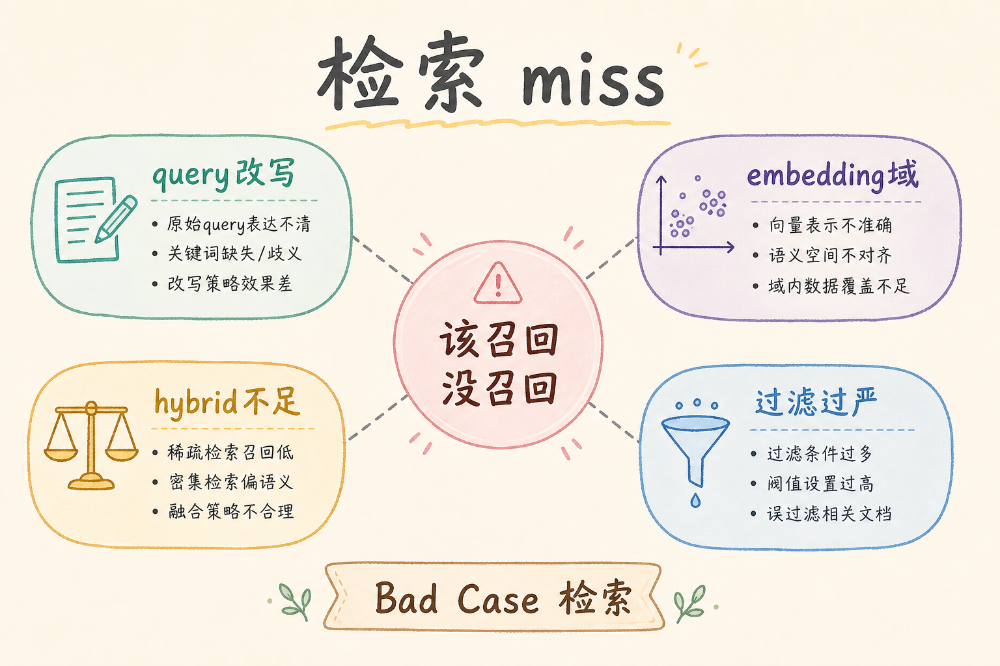
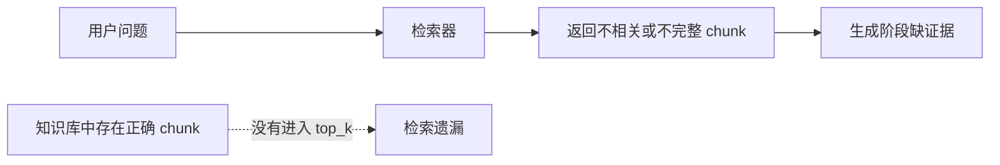
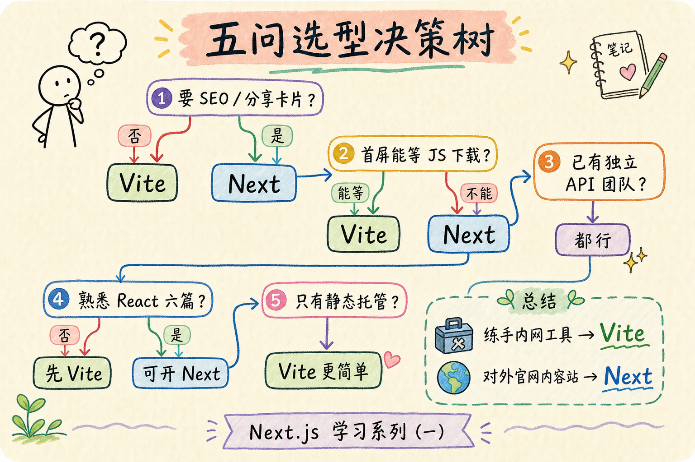
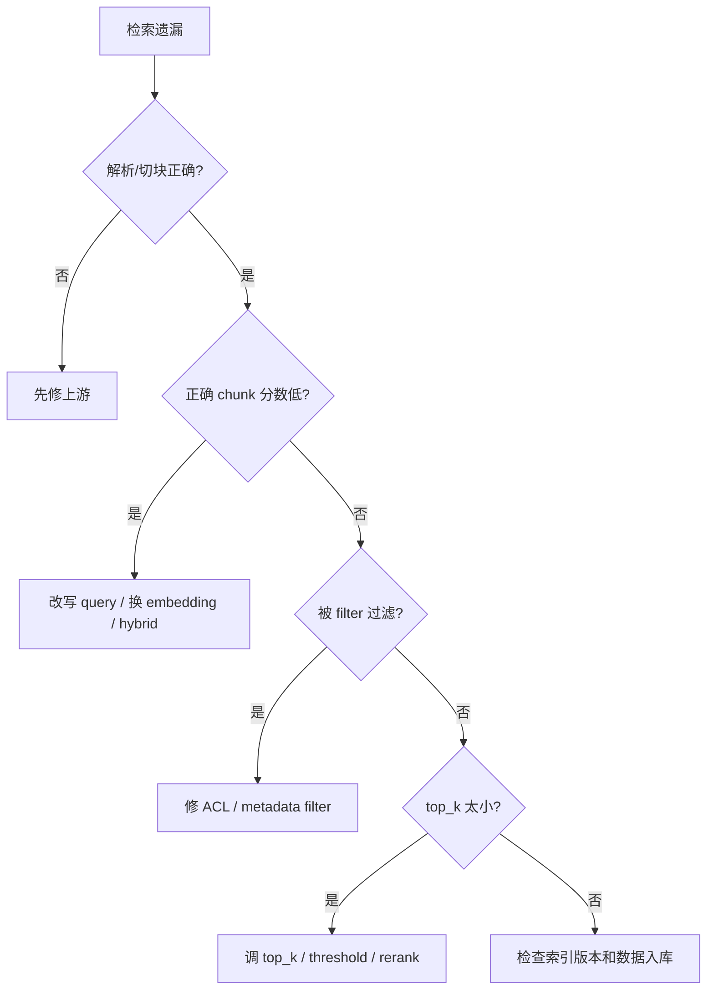
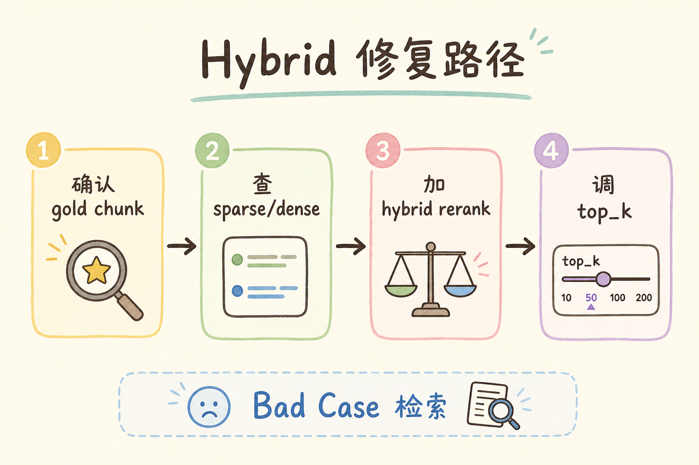
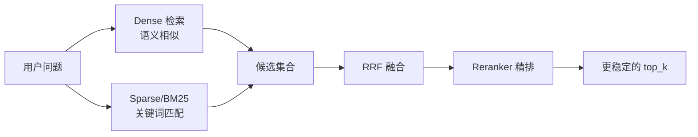
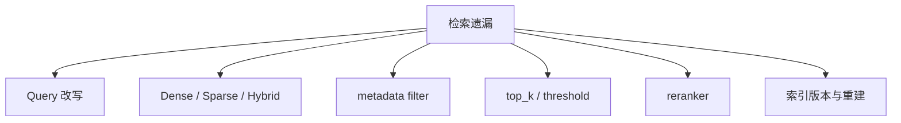

# E 评测与观测（十三）：Bad Case 归因之检索遗漏完全指南

> 库里有「一线城市住宿费上限 500 元」，用户问「出差住酒店能报多少」，trace 里 Top-5 **全是差旅交通补贴**——这是 **检索遗漏（Retrieval Miss）**。解析对、切块对，但 **召回没把正确 chunk 捞进候选池**。这篇是路线图 **168**，**主线篇**。前置：[91 Dense](91.dense-retrieval-tutorial.md)、[93 混合检索](93.hybrid-search-tutorial.md)、[100 Query Rewriting](100.query-rewriting-tutorial.md)、[147 LangSmith](147.langsmith-tracing-tutorial.md)。与 [149 解析](149.bad-case-parsing-tutorial.md)、[150 切块](150.bad-case-chunking-tutorial.md)、[152 胡编](152.bad-case-hallucination-tutorial.md) 组成 **归因四部曲**。

---

## 目录

1. [前言：检索漏了，后面全是演戏](#1-前言检索漏了后面全是演戏)
2. [本文边界与动手路径](#2-本文边界与动手路径)
3. [检索遗漏是什么](#3-检索遗漏是什么)
4. [trace 上的三种遗漏形态](#4-trace-上的三种遗漏形态)
5. [归因决策树](#5-归因决策树)
6. [Dense 路与语义漂移](#6-dense-路与语义漂移)
7. [Sparse 路与字面不匹配](#7-sparse-路与字面不匹配)
8. [混合检索、RRF 与过滤](#8-混合检索rrf-与过滤)
9. [Query 增强与多路召回](#9-query-增强与多路召回)
10. [重排序与 top_k 阈值](#10-重排序与-top_k-阈值)
11. [修复 Playbook 与实验设计](#11-修复-playbook-与实验设计)
12. [先错对对：六种典型翻车](#12-先错对对六种典型翻车)
13. [综合概念地图](#13-综合概念地图)
14. [常见陷阱与 FAQ](#14-常见陷阱与-faq)
15. [总结与系列下一步](#15-总结与系列下一步)

---

## 1. 前言：检索漏了，后面全是演戏

[33 幻觉](33.llm-hallucination-tutorial.md) 教你：没资料时模型会 **编**。检索遗漏时，上下文 **不含答案**，Faithfulness 再高的 prompt 也只能 **拒答或胡编**——用户看到的是后者，就会骂「胡编」。

**检索遗漏定义**：正确答案存在于索引中，但 **检索阶段未进入 Top-K**（或未进入 rerank 输入），导致生成阶段 **无足够证据**。

**主线篇** 原因：这是企业 RAG **最常见、最值得投入** 的优化点——[93 混合检索](93.hybrid-search-tutorial.md)、[100 改写](100.query-rewriting-tutorial.md)、[95 精排](95.cross-encoder-rerank-tutorial.md) 都服务于此。

---

## 2. 本文边界与动手路径

**档位：E 主线篇（168）。**

**本文讲：** 识别、决策树、dense/sparse/hybrid、改写、rerank、实验。  
**本文不讲：** 新 Embedding 预训练（见 [73 微调](73.embedding-finetune-tutorial.md) 了解）。

### 2.1 动手路径

| 步骤 | 验收 |
|------|------|
| A | 金标题 + trace 证明应命中 chunk 不在 Top-K | 遗漏复现 |
| B | 调试台用 **库内原句** 查能否 Top-1 | 区分索引/查询 |
| C | 开 BM25 或 hybrid 对比 | Recall 提升 |
| D | [170 A/B](153.ab-experiment-rag-tutorial.md) 记录 | 有 param_version |

---

## 3. 检索遗漏是什么

读下图时，先看「检索遗漏是什么」想表达的主线：它把本节的概念关系压缩成一张可对照的图。



下面这张图说明检索遗漏的定义。读图时重点看：资料库里明明有答案，但当前检索路径没有把它召回。



结论：检索遗漏不是“知识库没有答案”，而是“答案没有被当前检索策略拿出来”。

对照上图可以得出一个实用结论：先确认「检索遗漏是什么」里的主流程，再去调整具体参数或实现细节。

### 3.1 与近邻概念

| 概念 | 库中有答案 chunk | Top-K 含该 chunk |
|------|------------------|------------------|
| 检索遗漏 | 是 | **否** |
| [152 胡编](152.bad-case-hallucination-tutorial.md)（有上下文） | 是 | **是** |
| [149 解析](149.bad-case-parsing-tutorial.md) | **否**（文本错） | — |

---

## 4. trace 上的三种遗漏形态

在 [148 Langfuse](148.langfuse-observability-tutorial.md) / [147 LangSmith](147.langsmith-tracing-tutorial.md)：

1. **完全遗漏**：Top-K 无一相关；  
2. **排名过低**：相关 chunk 在 rank 15，K=5 被截；  
3. **被过滤误杀**：`where` ACL（[53](53.metadata-acl-tutorial.md)）、`doc_version` 过滤掉正解。

---

## 5. 归因决策树

读下图时，先看「检索遗漏决策树」想表达的主线：它把本节的概念关系压缩成一张可对照的图。



下面这张决策树用于定位遗漏原因。读图时重点看：先排除上游解析和切块，再判断是语义召回、字面匹配、过滤还是 top_k 问题。



按这个顺序查，可以避免把权限过滤、索引版本问题误判成模型召回能力差。

```text
用户 bad case
  → trace 看 Top-K
      → 库内搜 gold 句能否命中？
          否 → [149 解析] / [150 切块] / 未索引
          是 → 用 gold 句作 query 能 Top-1？
              否 → 索引/embedding 异常
              是 → 用户 query 问题 → [100 改写] / hybrid / synonym
      → 检查 metadata filter / ACL
      → 检查 top_k、score threshold [99](99.score-threshold-tutorial.md)
```

---

## 6. Dense 路与语义漂移

[91 Dense](91.dense-retrieval-tutorial.md)：「住酒店」与「住宿费」向量距离可能远。  
对策：[100 Query Rewriting](100.query-rewriting-tutorial.md)、[101 Multi-Query](101.multi-query-retrieval-tutorial.md)、领域 Embedding [71](71.domain-embedding-evaluation-tutorial.md)。

---

## 7. Sparse 路与字面不匹配

[92 Sparse](92.sparse-retrieval-rag-tutorial.md)：用户写英文缩写、文档写中文全称。  
对策：BM25 + 同义词表、hybrid。

---

## 8. 混合检索、RRF 与过滤

读下图时，先看「混合检索修复路径」想表达的主线：它把本节的概念关系压缩成一张可对照的图。



下面这张图展示混合检索如何修复遗漏。读图时重点看：dense 负责语义相似，sparse 负责关键词命中，RRF 负责合并排序。



这张图的结论是：混合检索不是简单多查一次，而是用不同召回路径互补，再统一融合和重排。

[93 Hybrid](93.hybrid-search-tutorial.md) + [94 RRF](94.rrf-fusion-tutorial.md) 是企业默认 **第一档修复**。  
注意：**双路 filter 必须一致**（[88 元数据过滤](88.metadata-filter-retrieval-tutorial.md)），否则一路有、一路无。

---

## 9. Query 增强与多路召回

| 技术 | 文章 | 作用 |
|------|------|------|
| 改写 | [100](100.query-rewriting-tutorial.md) | 口语→正式 |
| 多查询 | [101](101.multi-query-retrieval-tutorial.md) | 多角度召回 |
| HyDE | [102](102.hyde-tutorial.md) | 假想文档向量 |
| 分解 | [103](103.query-decomposition-tutorial.md) | 多跳 |

[109 对话增强](109.conversation-query-enhancement-tutorial.md) 处理 **多轮指代**。

---

## 10. 重排序与 top_k 阈值

[95 Cross-Encoder](95.cross-encoder-rerank-tutorial.md)、[96 BGE](96.bge-reranker-tutorial.md)：先 **宽召回** `R=50`，再 rerank 到 `K=5`。  
[99 分数阈值](99.score-threshold-tutorial.md) 过高会导致 **有效 chunk 被丢弃**——trace 看 **被 threshold 截掉的候选**。

---

## 11. 修复 Playbook 与实验设计

1. **金标定位** `gold_chunk_id`（[160](143.golden-dataset-tutorial.md)）；  
2. **复现** 在调试台（路线图 199）；  
3. **假设** dense 漏 / sparse 漏 / filter / K 太小；  
4. **单变量实验**（[170 A/B](153.ab-experiment-rag-tutorial.md)）：一次只改 `hybrid` 或 `rewrite`；  
5. **指标**：Context Recall（[157](140.ragas-context-recall-tutorial.md)）、Recall@K；  
6. **登记** [171 参数版本](154.param-version-management-tutorial.md)。

---

## 12. 先错对对：六种典型翻车
下面的错法适合当排障清单看：它们不是语法问题，而是会让评估、追踪或坏例分析失去证据链，最后只能靠猜测定位问题。

### 12.1 错：未排除解析/切块就加 reranker

**对**：gold 句库内都搜不到 → 先 ingest。

### 12.2 错：只加向量不 BM25

**对**：单号、条款号场景 [92](92.sparse-retrieval-rag-tutorial.md) 常救场。

### 12.3 错：rewrite 改写过度改变意图

**对**：[100 篇](100.query-rewriting-tutorial.md) 护栏。

### 12.4 错：ACL filter 写错

**对**：trace 看 **filter 前后 count**。

### 12.5 错：top_k=3 硬编码

**对**：[98 Top-K](98.top-k-retrieval-tutorial.md) 按场景调。

### 12.6 错：换 Embedding 不重建索引

**对**：新模型 **全量 re-embed**。

---

## 13. 综合概念地图

读下图时，先看「检索遗漏概念地图」想表达的主线：它把本节的概念关系压缩成一张可对照的图。


下面这张概念地图总结检索遗漏的修复杠杆。读图时重点看：遗漏可能来自 query、索引、filter、top_k 或 rerank。



修复时要做 A/B 或离线评测，避免一个 bad case 修好后让另一类问题变差。

---


## 14. 常见陷阱与 FAQ
最后用 FAQ 收束坏例分析的边界。坏例不是为了“证明系统很差”，而是把失败归因到解析、切块、召回、重排或生成中的具体一层。

### 14.1 初学者最常踩的三坑

检索遗漏最容易被误诊成“模型不聪明”。下面三个坑都在提醒你：先看召回证据，再谈生成效果。

1. **只看最终答案，不看链路**——检索遗漏 的价值在 **可复现的中间态**。  
2. **没有金标就调参**——没有 [160 Golden Dataset](143.golden-dataset-tutorial.md) 时，A/B 只是 **主观吵架**。  
3. **工具买了不用**——装了 LangSmith/Langfuse 却不给每次请求打 `trace_id`，等于 **黑盒上线**。

### 14.2 FAQ 精选

**Q1：PoC 阶段要不要上观测？**  
要。**最小集**：`request_id` + 检索 Top-5 `chunk_id` + 模型名 + 延迟。完整平台可后补，但 **字段契约** 第一天就定。

**Q2：和 RAGAS 指标怎么配合？**  
RAGAS 回答 **「好不好」**；观测平台回答 **「哪一步坏了」**。建议：金标跑 RAGAS 批次，线上 bad case 用 trace 下钻。

**Q3：成本会不会爆？**  
Trace 存全文 context 很贵。生产用 **采样**（如 5%）+ **摘要字段**（chunk_id、score、前 200 字预览），全文按需拉取。

**Q4：多环境怎么隔离？**  
`project` / `environment` 标签：`dev` / `staging` / `prod` 分开；**禁止** 把 prod trace 当训练数据未经脱敏。

**Q5：谁负责看板？**  
工程搭管道，**产品 + 领域专家** 每周过 bad case；研发负责 **归因到模块**（解析/切块/检索/生成）。

**Q6：失败请求要不要记 trace？**  
**更要记**。超时、空检索、解析异常——没有失败 trace，你永远在猜。

**Q7：和 [147 LangSmith](147.langsmith-tracing-tutorial.md) / [148 Langfuse](148.langfuse-observability-tutorial.md) 二选一？**  
LangChain 深度用 LangSmith 顺手；要 **自托管、开源、多框架** 看 Langfuse。也可 **双写** 过渡期，但统一 `trace_id`。

**Q8：如何证明一次修复有效？**  
回归集 [161](144.regression-test-set-tutorial.md) 上 **同题同参** 对比；再看线上 **7 日 bad case 率**。

**Q9：实习生能维护吗？**  
把 **归因决策树** 贴在 wiki（本篇系列 149～152）；观测 UI 只读权限给全员，写权限限研发。

**Q10：面试怎么讲？**  
30 秒：**「RAG 上线后我用 trace 把 bad case 分到 ingest/retrieve/generate，用金标 + A/B 验证改动，参数版本可回滚。」**

**Q11：检索遗漏和 Context Recall 低是一回事吗？**  
本质相关：金标上 Context Recall 量 **批次遗漏率**；单条 trace 是 **个例遗漏**。
## 15. 总结与系列下一步

1. **检索遗漏 = 有货没捞到**——先 trace，再决策树。  
2. **hybrid + 改写 + 宽召回 rerank** 是主流修复三板斧。  
3. 与 [149][150] 排除 ingest 问题后再调 C4/C5。  
4. 实验必须 [171 版本化](154.param-version-management-tutorial.md)。  
5. 仍漏 → [152] 看是否其实 **已命中但模型胡编**。

| 目标 | 阅读 |
|------|------|
| 混合检索 | [93 Hybrid](93.hybrid-search-tutorial.md) |
| 胡编归因 | [152 篇](152.bad-case-hallucination-tutorial.md) |
| A/B 实验 | [153 篇](153.ab-experiment-rag-tutorial.md) |

---

*系列：E 评测与观测 · 路线图第 168 条 · 主线篇*


### 15.1 检索遗漏深度补充：调试台用法

**检索调试台**（路线图 199）最小功能：`query` 输入框、dense/sparse 分路结果、`where` filter 编辑器、**gold_chunk 高亮**。工程师复现步骤：粘贴用户 query → 看是否命中 → 改写成 [100](100.query-rewriting-tutorial.md) 后是否命中 → 判断改写或 hybrid。

**Embedding 漂移**：模型升级后 **语义空间变**，旧索引与新 query encoder 不匹配——manifest 必须 **新 collection**（[76 Chroma](76.chroma-vector-db-tutorial.md) §8）。这不是调 top_k 能修。

**多跳**：[104 多跳检索](104.multi-hop-retrieval-tutorial.md) 遗漏表现为 **第一轮就没捞到桥梁实体**——trace 看是否需 decomposition。


## 16. 检索遗漏实战精读

检索遗漏定义：库里有正确 chunk，Top-K 没有。用户常骂胡编，根因却在 [151 本篇](151.bad-case-retrieval-miss-tutorial.md)。必做 **gold 句探针**：用金标原文当 query，Top-1 仍不中 → 索引或切块/解析；Top-1 中、用户 query 不中 → 改写或 hybrid。

企业第一修复档：[93 混合检索](93.hybrid-search-tutorial.md) + [94 RRF](94.rrf-fusion-tutorial.md)。单号条款 BM25 救，口语语义向量救。双路 filter 必须一致（[88 过滤](88.metadata-filter-retrieval-tutorial.md)）。

Query 增强：[100 改写](100.query-rewriting-tutorial.md)、[101 多查询](101.multi-query-retrieval-tutorial.md)、[109 多轮](109.conversation-query-enhancement-tutorial.md)。宽召回后 [95 精排](95.cross-encoder-rerank-tutorial.md)，注意 gold 在 rank 十五、K 只有五的被截情况。

换 Embedding 必须新 collection 全量重建（[76 Chroma](76.chroma-vector-db-tutorial.md) §8）。ACL 误杀看 filter 前后 count（[53 ACL](53.metadata-acl-tutorial.md)）。

实验单变量，登记 param_version，用 [147/148](147.langsmith-tracing-tutorial.md) 对比 trace。


## 17. 练习与自检

动手一：gold 句探针。动手二：开 hybrid 对比 dense-only。动手三：写单变量 [170 实验](153.ab-experiment-rag-tutorial.md) 设计书一页。

自检：三种遗漏形态？决策树步骤？RRF 与 filter 一致？

误区：未排除 149/150；只加 rerank；rewrite 改意图；换 embed 不重建。

精读 [93](93.hybrid-search-tutorial.md)、[100](100.query-rewriting-tutorial.md)。胡编可能是 miss 后果见 [152](152.bad-case-hallucination-tutorial.md)。

## 18. 检索遗漏周课与清单

**每日**： 调试台跑三条用户真实 query + gold 探针。**每周**： 回顾 hybrid 召回率与 BM25/dense 分路贡献。**每月**： 评估 [100 改写](100.query-rewriting-tutorial.md) 与 [101 多查询](101.multi-query-retrieval-tutorial.md) 是否要上生产。

遗漏三分法：**完全遗漏**、**排名过低**、**过滤误杀**——对应手段分别是加路召回、增大 R 或 K、修 filter。不要三类混谈。

[93 混合](93.hybrid-search-tutorial.md) 是第一修复杠杆；[95 精排](95.cross-encoder-rerank-tutorial.md) 是第二；[100 改写](100.query-rewriting-tutorial.md) 是第三。顺序反了会浪费算力：先 rewrite 再 hybrid 也可，但 **没 hybrid 就上 rerank** 常救不了字面漏。

Embedding 升级、领域迁移、双语库——都可能要 [73 微调](73.embedding-finetune-tutorial.md) 或换模型，但 **永远先做 gold 探针** 排除 ingest。

观测：[147/148](147.langsmith-tracing-tutorial.md) 的 retrieve 节点是证据。实验：[170 A/B](153.ab-experiment-rag-tutorial.md) 单变量；版本：[171](154.param-version-management-tutorial.md)。

胡编常是遗漏的 **果**：[152](152.bad-case-hallucination-tutorial.md) 要在排除遗漏后再判。

团队口诀：**「库里有却捞不到，先 hybrid 再说话。」**

## 19. 综合案例：口语问法全军覆没

**背景**：用户说「住酒店能报多少」，库内 formal 表述「住宿费」。dense miss，BM25 miss。**gold 探针** 用正式表述 Top-1 命中。**修**：[100 改写](100.query-rewriting-tutorial.md) + [93 hybrid](93.hybrid-search-tutorial.md)。**A/B** [170](153.ab-experiment-rag-tutorial.md) 两周，点踩降 30%。

**过滤误杀案例**：ACL [53](53.metadata-acl-tutorial.md) 误配，trace filter 后 count=0，修 metadata 非检索算法。

## 20. E 模块联动与职业素养

企业 RAG 的成熟度不靠「是否用上向量库」，而靠 **能否把一次用户差评还原成可复现链路**。检索遗漏 是其中一环。你必须熟悉：**金标** [160](143.golden-dataset-tutorial.md)、**回归** [161](144.regression-test-set-tutorial.md)、**RAGAS** [156～159](139.ragas-context-precision-tutorial.md)、**观测** [164 LangSmith](147.langsmith-tracing-tutorial.md) / [165 Langfuse](148.langfuse-observability-tutorial.md)、**归因四步** [166～169](149.bad-case-parsing-tutorial.md)、**实验** [170](153.ab-experiment-rag-tutorial.md)、**版本** [171](154.param-version-management-tutorial.md)。

**ingest 段** 回到 C1：[36 PDF](36.pdf-text-extraction-tutorial.md) 到 [56 多模态](56.multimodal-image-text-tutorial.md)。**chunk 段** 回到 C2：[57](57.fixed-size-chunking-tutorial.md) 到 [65 Parent](65.parent-document-retriever-tutorial.md)。**检索段** 回到 [91 Dense](91.dense-retrieval-tutorial.md)、[92 Sparse](92.sparse-retrieval-rag-tutorial.md)、[93 Hybrid](93.hybrid-search-tutorial.md)、[100 改写](100.query-rewriting-tutorial.md)。**生成段** 回到 [33 幻觉](33.llm-hallucination-tutorial.md)、[110 Prompt](110.rag-prompt-template-tutorial.md)、[112 拒答](112.refusal-strategy-tutorial.md)、[141 Faithfulness](141.ragas-faithfulness-tutorial.md)。

每周五用三十分钟做 **E 模块例会**：一个指标（Faithfulness 或点踩率）、五条 trace、一个实验结论、一个 pv 变更。坚持八周，团队会形成 **共同语言**，不再为「模型笨」争吵。

**面试最后一问**：讲一次你亲历的 bad case，如何从 trace 定位到解析/切块/检索/胡编，如何单变量实验验证，如何 param_version 回滚。能讲清楚者，已超越多数「只会调 top_k」的候选人。

**合规提醒**：trace 与 Record 可能含用户 query 中的个人信息，脱敏与保留周期遵守公司安全政策（路线图 G 轨 PII、审计）。观测不是 **无限记日志**，而是 **记对字段、记够排障、记到合规**。

**下一步学习**：人工评测 [172](155.human-evaluation-rag-tutorial.md)；检索调试台（路线图 199）；全栈看板（路线图 201）。E 模块学完后，你已具备 **生产化迭代闭环**，可进入 F 轨工程交付。

**背诵卡片（可选）**：观测回答「哪一步坏了」；评测回答「好不好」；实验回答「改动是否有效」；版本回答「当时用的啥配置」。四句话覆盖 E 模块面试八十分。动手时永远 **先 trace 后改参**，先 **单变量** 后组合，先 **离线回归** 后线上灰度——三条纪律比任何工具名字都重要。

**交付物检查**：读完本篇后，你应能在自己的 RAG 项目里指出：观测字段是否含 chunk_id 与 param_version；是否能在十五分钟内用 149～152 树归因一条真实差评；是否能为下一次参数变更写出实验假设与回滚条件。三项都能做到，本篇才算 **真正读完**，而非收藏夹吃灰。

## 21. 全系列复盘：E 模块九篇一张图

```text
163 TruLens（了解）── 在线三角抽样
164 LangSmith（主线）─┐
165 Langfuse（主线）──┴─ 观测：trace 下钻
166 解析 bad case ── C1 轨 36～56
167 切块 bad case ── C2 轨 57～65
168 检索遗漏（主线）── 93 hybrid、100 改写
169 生成胡编（主线）── 33 理论、141 Faithfulness
170 A/B 实验 ── 单变量 + 护栏
171 参数版本 ── manifest + 回滚
```

**一周冲刺计划**：周一 147+148 接通 trace；周二 149 源文 diff；周三 150 chunk 边界；周四 151 gold 探针；周五 152 Faithfulness 核验；周末 170+171 写实验与 manifest。第二周用 TruLens 抽样验证三角分桶是否与人工归因一致。

**与 DeepEval、RAGAS 关系**：离线 RAGAS 定基线，DeepEval 挡 CI，TruLens 看尾部，LangSmith/Langfuse 定位链路——五件套各司其职，不是「选一个就够」。

**常见团队分工**：数据工程负责 166～167 与 ingest；算法负责 168～169 与检索生成；平台负责 164～165 与 171；产品负责 170 实验设计与金标维护。单人学习则按文件编号顺序推进。

**质量门禁建议**：新版本 pv 上线前——回归集 Faithfulness 不降超过 1pp；P95 延迟不超旧版 10%；点踩率周环比不升。任一失败则回滚 parent_version。

**引用与溯源**：生成侧见 [113 行内](113.inline-citation-tutorial.md)、[115 导航](115.source-document-navigation-tutorial.md)；流式见 [116 SSE](116.sse-rag-streaming-tutorial.md)。观测与引用结合，用户才能从差评走到可点击证据。

**最后强调**：bad case 不是耻辱，是 **迭代燃料**。没有 trace 的 bad case 是八卦；有 trace 与 param_version 的 bad case 是 **数据集与实验假设来源**。把 166～169 决策树贴在显示器旁，比再买一个向量库更能提升答案质量。

## 22. 实操巩固（必读）

请你现在打开自己的 RAG 项目或教程 PoC，完成三件事：第一，为最近一次问答找到或构造等价于 LangSmith trace 的完整记录，至少包含检索结果列表与最终 prompt。第二，用 166～169 四篇的决策树对一条差评分类，写下证据而不是猜测。第三，在纸上写出当前系统的 param_version 字符串，若写不出，说明版本管理尚未开始，请优先阅读 171 并创建 manifest。

观测平台选型无需纠结：LangChain 为主选 LangSmith，自研或合规选 Langfuse，亦可短期双写。关键是 chunk_id、param_version、experiment_id 字段统一。TruLens 作了解档，适合在 staging 对三角分桶，引导团队讨论「检索坏还是生成坏」。

解析与切块问题常被误当成模型问题。只要 trace 里原文与源文件不一致，或 chunk 语义不完整，就不要调 temperature。检索遗漏时 hybrid 与改写是第一档手段，胡编且 context 含 gold 时才盯 prompt 与拒答。每次改动走 A/B，每次上线记 pv，每次回滚有 parent。

金标与回归集是 **前提**，不是可选项。没有 160 与 161，实验只是争论。RAGAS 指标与线上点踩率应同向变动；若背离，检查评判 prompt、抽样或产品入口变化。

面向面试：用三分钟讲清「一次 bad case 如何从 trace 定位到模块、如何用实验验证、如何回滚」。这比背诵向量库 API 更能体现 E 模块素养。

面向生产：trace 脱敏、保留周期、失败请求必记、客服会贴链接。E 模块不是实验室装饰，是上线后的操作系统。

若你刚学完 163～171，下一步建议 172 人工评测，并把路线图 199 检索调试台列入 backlog。坚持每周例会三十分钟，八周后团队答复质量通常会显著稳定，因为你们不再盲人摸象。

E 模块与 C 轨、D 轨的衔接：ingest 出问题回到 36～56，检索出问题回到 91～103，生成出问题回到 29～34 与 110～112。不要跨模块乱调参。文档版本 48 与参数版本 171 同时维护，避免「内容新、管道旧」或相反。

TruLens 三角、RAGAS 四指标、点踩率、Faithfulness 自动评——指标多时要 **分桶看**，不要合成一个神秘分数。实验 170 只改一把尺，版本 171 记下每一次尺的长度。这是本批九篇最核心的纪律，请写入团队 wiki 首页。

## 23. 术语对照与读者服务

初学者常混淆观测与评测：LangSmith 与 Langfuse 记录「发生了什么」，RAGAS 与 TruLens 评判「好不好」。混淆会导致工具买重复或互相推诿。bad case 四篇是「为什么不好」的归因手册，不是新的工具广告。A/B 与 param_version 是「如何安全地变好」的制度。

阅读顺序建议：先 164 或 165 接通 trace，再 166～169 练归因，再 170～171 做变更。163 TruLens 可插读。每篇动手路径表的验收项务必打勾，否则只读不练等于未学。

感谢你把 E 模块学完。企业 RAG 的护城河往往不是最大模型，而是 **可追溯、可实验、可回滚** 的工程习惯。愿你在真实项目里用 trace 终结扯皮，用金标终结拍脑袋，用 param_version 终结「上周那个配置谁还记得」。


### 附录：E 模块联动速查

本篇属于路线图 **E. 评测、观测与迭代**（163～171）。推荐闭环：**金标（160）→ RAGAS 离线分（156～159）→ 观测 trace（164 LangSmith / 165 Langfuse）→ bad case 四步归因（166～169）→ A/B 验证（170）→ param_version 登记（171）**。解析阶段问题回跳 **C1 轨 [36 PDF](36.pdf-text-extraction-tutorial.md)～[56 多模态](56.multimodal-image-text-tutorial.md)**；切块问题回跳 **[57 固定分块](57.fixed-size-chunking-tutorial.md)～[65 Parent](65.parent-document-retriever-tutorial.md)**；检索遗漏优先 **[93 混合检索](93.hybrid-search-tutorial.md)** 与 **[100 查询改写](100.query-rewriting-tutorial.md)**；生成胡编对照 **[33 幻觉](33.llm-hallucination-tutorial.md)** 与 **[141 Faithfulness](141.ragas-faithfulness-tutorial.md)**。每次线上变更在 trace metadata 写 `param_version`，在 Git 提交 manifest，在回归集留 before/after 分数——三线对齐才称得上工程化 RAG。初学者请把本篇与相邻编号文章串读一周：工具篇（163～165）建立观测，归因篇（166～169）建立排障肌肉记忆，实验与版本篇（170～171）建立变更纪律。缺任何一块，线上都会退回「凭感觉调 top_k」的作坊状态。配图见 `image/bad-case-retrieval-miss/prompts/`，风格 hand-drawn-edu、16:9 中文，与全系列一致。

## 附录：工程化 RAG 迭代宣言（系列共用）

我们承诺：每一次线上用户差评都能在七十二小时内对应到一条 trace 或等价日志；每一个 param_version 都能在 Git 找到 manifest；每一次参数变更都有离线回归或 A/B 证据。我们拒绝「感觉好像好了」的上线方式。

解析阶段对照第三十六至五十六篇：PDF、表格、HTML、DOCX、编码、OCR、多模态各有一套失败信号。切块阶段对照第五十七至六十五篇：固定、递归、句子、重叠、结构、Markdown、Parent。检索阶段对照第九十一至一百零三篇：稠密、稀疏、混合、改写、多查询。生成阶段对照第三十三篇幻觉理论与第一百一十至一百一十二篇 prompt 与拒答。

LangSmith 与 Langfuse 是主线观测工具，不是可选项。TruLens 与 RAGAS 是质量尺子，不是装饰品。bad case 四篇是团队共同语言，不是算法私藏。A/B 与 param_version 是变更法律，不是事后补票。

每周例会四问：点踩率变了吗？Faithfulness 变了吗？P95 延迟变了吗？本周实验结论是什么？四问答不清，说明观测或版本管理仍欠债。

单人学习者：用一周接通 trace，一周练四篇归因，一周写第一个 manifest 与实验设计书。三周后你应能独立处理一条真实差评全流程。

多人团队：数据对 ingest，算法对 retrieve 与 generate，平台对观测与版本，产品对金标与实验。边界清晰可减少互相甩锅。

合规：trace 脱敏，保留周期书面化，用户删除权对接会话与日志删除 API。观测数据也是个人数据载体。

图文要求：如本篇加入信息图，图前要说明读图重点，图后要给结论；不要让图片脱离所在小节。

路线图 E 模块完结后，你已进入「能迭代」阶段，而非「能 demo」阶段。下一阶段 F 轨将把能力封装为 API 与界面。请带着 param_version 与 trace 习惯进入全栈篇。

如果你只记住一句话：先 trace，后归因，再实验，终版本。其余工具名都会随生态演变，这条纪律不会过时。

本批九篇对应路线图第一百六十三至一百七十一条，文件编号第一百四十六至一百五十四。档位标注「了解」「主线」「地基」见 batch mapping 文档。初学者按编号顺序阅读，遇到 ingest 疑问跳 C1，遇到检索疑问跳 C4C5，遇到生成疑问跳 C6 与第三十三篇。

动手验收再强调：接通一次 trace，完成一次源文 diff，完成一次 gold 探针，完成一次 Faithfulness 人工核验，写出一份实验设计书，写出一份 manifest YAML。六项齐，E 模块毕业。

与同事协作时，把 trace 链接当作 bad case 第一附件，把 param_version 当作变更第一字段，把回归集 diff 当作上线第一门禁。文化比工具更难，但文化靠重复仪式养成。

祝你在企业 RAG 路上，少踩「黑盒调参」的坑，多建「可复盘」的系统。坚持学习。

再读一遍本篇核心章节摘要，对照你当前项目打勾：我能否在观测 UI 找到检索 Top-K？我能否解释本次问答的 param_version？我能否把最近一条差评归入四步归因之一？我能否在改动前写出 A/B 假设？四问皆能，本篇目标达成；若有否，带着问题重读对应小节，比盲目刷下一篇更有效。请继续阅读系列相关篇章。

最后提醒：生成胡编、检索遗漏、切块错误、解析错误四类问题在用户侧都表现为「机器人胡说」，只有 trace 与归因树能把争论变成工程任务。把第一百六十六至一百六十九篇打印成决策树贴在工位旁，配合第一百六十四或一百六十五篇的观测链接，你的 RAG 团队会少开很多无效会议。版本管理第一百七十一条不是官僚主义，而是事故后十分钟回滚的保险绳。感谢阅读，欢迎反馈改进建议。
