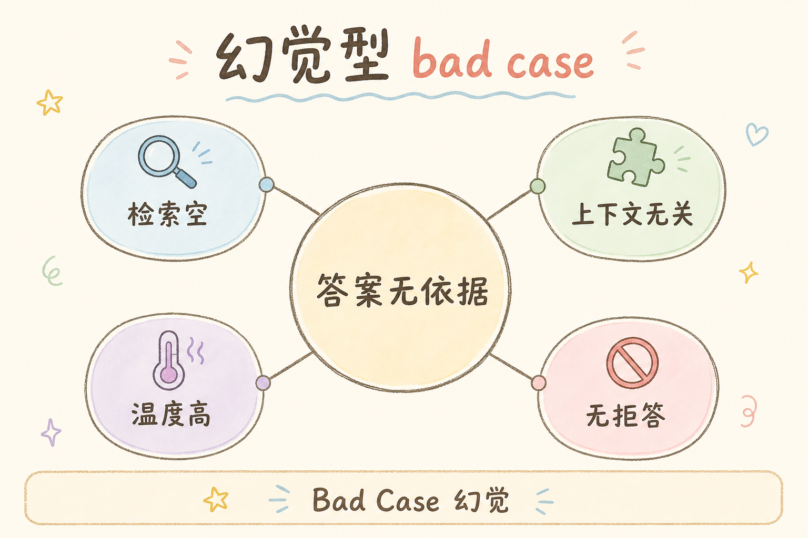
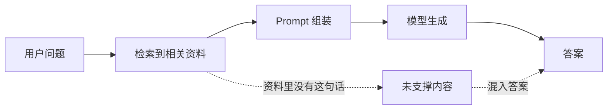
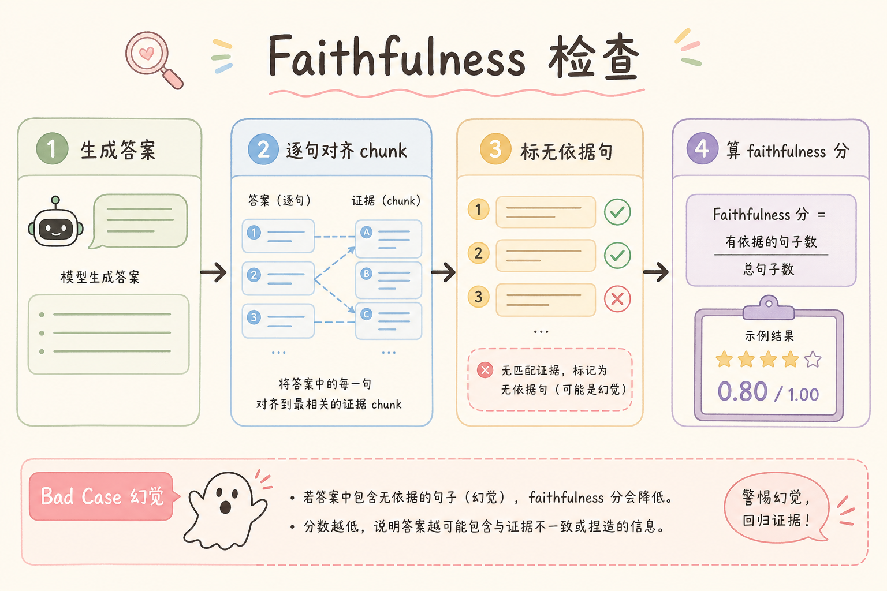
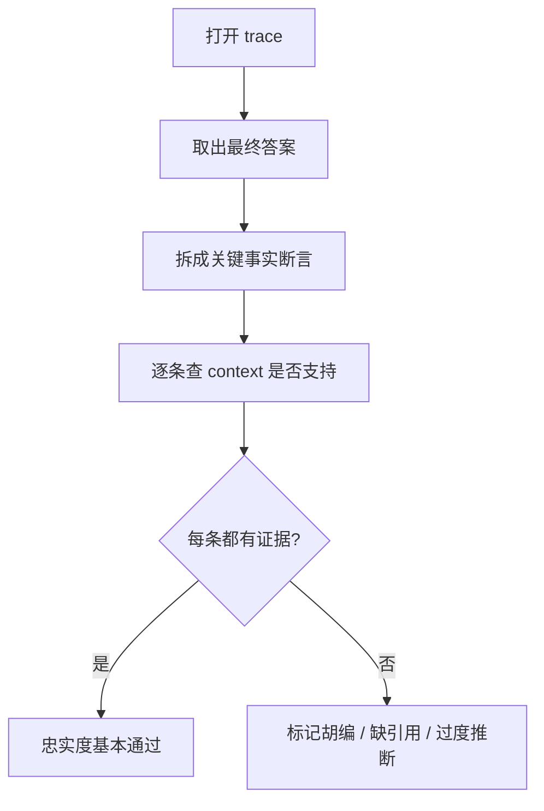
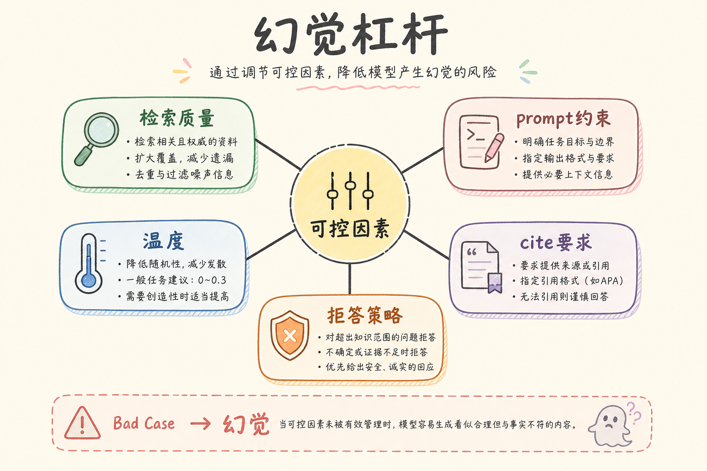
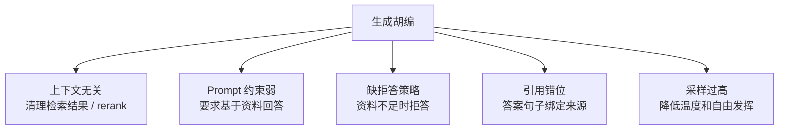
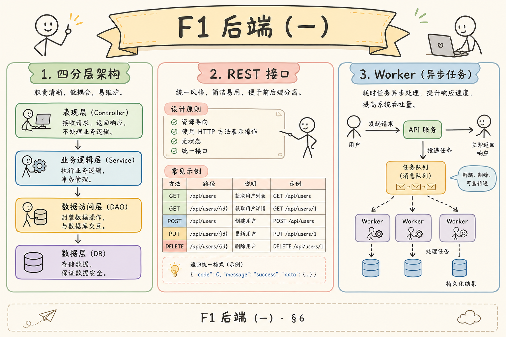
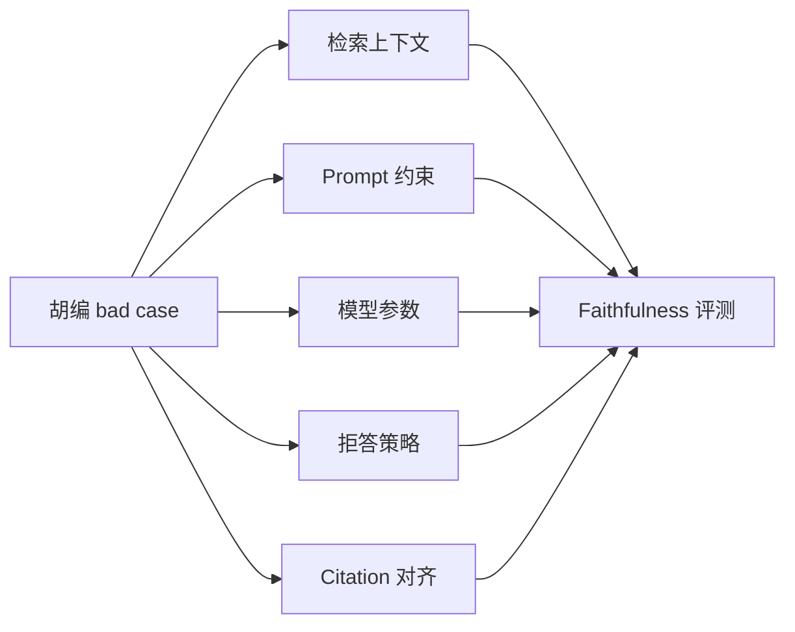

# E 评测与观测（十四）：Bad Case 归因之生成胡编完全指南

> trace 显示 Top-3 **明确含有「年假 10 天」**，答案却写「根据规定为 15 天」——这不是 [151 检索遗漏](151.bad-case-retrieval-miss-tutorial.md)，是 **生成胡编**。用户截图骂幻觉，你若只会换模型，往往 **下周照旧**。这篇是路线图 **169**，主线篇，承接 [33 幻觉成因](33.llm-hallucination-tutorial.md)、[141 Faithfulness](141.ragas-faithfulness-tutorial.md)、[112 拒答](112.refusal-strategy-tutorial.md)。用 [147/148](147.langsmith-tracing-tutorial.md) **对齐上下文与输出**。

---

## 目录

1. [前言：有资料仍胡编，最伤信任](#1-前言有资料仍胡编最伤信任)
2. [本文边界与动手路径](#2-本文边界与动手路径)
3. [生成胡编在 RAG 中的定义](#3-生成胡编在-rag-中的定义)
4. [先排除：空检索与解析/切块](#4-先排除空检索与解析切块)
5. [trace 对齐：Faithfulness 现场核验](#5-trace-对齐faithfulness-现场核验)
6. [胡编分型：事实性 vs 忠实性](#6-胡编分型事实性-vs-忠实性)
7. [成因与杠杆对照 33 篇](#7-成因与杠杆对照-33-篇)
8. [Prompt、拒答与 Grounding](#8-prompt拒答与-grounding)
9. [采样、温度与长上下文](#9-采样温度与长上下文)
10. [Citation 与可核验输出](#10-citation-与可核验输出)
11. [修复 Playbook 与评测闭环](#11-修复-playbook-与评测闭环)
12. [先错对对：六种典型误判](#12-先错对对六种典型误判)
13. [综合概念地图](#13-综合概念地图)
14. [常见陷阱与 FAQ](#14-常见陷阱与-faq)
15. [总结与系列下一步](#15-总结与系列下一步)

---

## 1. 前言：有资料仍胡编，最伤信任

[33 篇](33.llm-hallucination-tutorial.md) 从 **模型续写本能** 讲胡编；RAG 工程师更关心 **可操作的子集**：

1. **无上下文胡编**：检索空或无关——根因常在 [151](151.bad-case-retrieval-miss-tutorial.md)；  
2. **有上下文胡编**：资料在 prompt 里，答案仍 **加数字、改条件、张冠李戴**——本篇重点。

**生成胡编（RAG 语境）**：检索提供的上下文中 **已包含** 可支撑答案的信息，但 LLM 输出与之 **矛盾或无法追溯** 的陈述。

---

## 2. 本文边界与动手路径

**档位：E 主线篇（169）。**

### 2.1 动手路径

| 步骤 | 验收 |
|------|------|
| A | 选一条「有引用仍错」的 trace | 截图归档 |
| B | 人工标注 context 是否含 gold | 是/否 |
| C | 若含 → 调 prompt / 温度 / [112 拒答](112.refusal-strategy-tutorial.md) | Faithfulness↑ |
| D | [141 RAGAS](141.ragas-faithfulness-tutorial.md) 批测 | 可量化 |

---

## 3. 生成胡编在 RAG 中的定义

读下图时，先看「生成胡编是什么」想表达的主线：它把本节的概念关系压缩成一张可对照的图。



下面这张图说明 RAG 里的“生成胡编”发生在哪里。读图时重点看：资料可能已经检索到了，但模型输出仍然没有被资料支撑。



结论：生成胡编不等于“没有检索到资料”。它更常见的表现是：资料在上下文里，但答案加入了资料没有说过的内容。

---

## 4. 先排除：空检索与解析/切块

**固定顺序**（避免冤枉模型）：

1. [149 解析](149.bad-case-parsing-tutorial.md)——库内 gold 句是否存在；  
2. [150 切块](150.bad-case-chunking-tutorial.md)——命中 chunk 是否语义完整；  
3. [151 检索](151.bad-case-retrieval-miss-tutorial.md)——gold 是否在 Top-K；  
4. **本篇**——Top-K 含 gold，答案仍错。

---

## 5. trace 对齐：Faithfulness 现场核验

读下图时，先看「trace 对齐 Faithfulness」想表达的主线：它把本节的概念关系压缩成一张可对照的图。



下面这张图展示如何用 trace 检查 Faithfulness。读图时重点看：不要只看最终答案，要把答案里的关键断言逐条对照上下文。



这张图的结论是：Faithfulness 检查的是“答案是否忠于资料”，不是“答案听起来是否合理”。

在 [148 Langfuse](148.langfuse-observability-tutorial.md)：

1. 展开 **GENERATION** observation 的 **完整 prompt**；  
2. 高亮 gold 句是否在 `context` 块；  
3. 若 **被 [107 预算](107.context-budget-tutorial.md) 截断** → 先修预算/排序 [108](108.long-context-reorder-tutorial.md)；  
4. 若 **完整存在** → 生成胡编坐实。

**人工表**：

| 字段 | 值 |
|------|-----|
| gold_in_context | Y/N |
| answer_contradicts | Y/N |
| faithfulness | 0～1 |

---

## 6. 胡编分型：事实性 vs 忠实性

| 类型 | 上下文 | 例子 |
|------|--------|------|
| 事实性 | 无或无关 | 编造不存在的条款 |
| 忠实性 | 有 gold | 10 天答 15 天 |

RAG 坏案例 **忠实性占比更高**——更应用 [141 Faithfulness](141.ragas-faithfulness-tutorial.md) 与 [34 Grounding](34.grounding-citation-tutorial.md)。

---

## 7. 成因与杠杆对照 33 篇

读下图时，先看「胡编成因杠杆」想表达的主线：它把本节的概念关系压缩成一张可对照的图。



下面这张图把生成胡编的常见成因和修复杠杆放在一起。读图时重点看：不同成因要用不同修复方式。



结论：不要只靠“换更强模型”解决胡编。先确认资料、prompt、拒答和引用约束是否到位。

| [33 篇](33.llm-hallucination-tutorial.md) 成因 | RAG 杠杆 |
|----------------|----------|
| 续写本能 | 强约束 prompt [110](110.rag-prompt-template-tutorial.md) |
| 温度高 | [29 采样](29.llm-sampling-tutorial.md) 降 temperature |
| 上下文太长 | [107 预算](107.context-budget-tutorial.md)、[108 重排](108.long-context-reorder-tutorial.md) |
| 冲突证据 | [106 去重](106.retrieval-dedup-tutorial.md)、[105 MMR](105.mmr-diversity-tutorial.md) |
| 过度自信 | [112 拒答](112.refusal-strategy-tutorial.md) |

---

## 8. Prompt、拒答与 Grounding

[110 RAG Prompt](110.rag-prompt-template-tutorial.md) 必备句：**「仅根据上下文回答；无则明确说不知道」**。  
[112 拒答策略](112.refusal-strategy-tutorial.md)：低相关度 hits 时 **拒答** 优于胡编。  
[34 Grounding](34.grounding-citation-tutorial.md) + [113 行内引用](113.inline-citation-tutorial.md)：要求 **每句关键事实带 [n]**，便于审计。

---

## 9. 采样、温度与长上下文

[29 篇](29.llm-sampling-tutorial.md)：RAG 事实问答 **temperature 0～0.3**；创意场景另路由。  
[28 窗口](28.context-window-tutorial.md)：证据被挤掉 → 模型 **靠 parametric 记忆补**。

---

## 10. Citation 与可核验输出

[113 行内](113.inline-citation-tutorial.md)、[114 脚注](114.footnote-citation-tutorial.md)、[115 导航](115.source-document-navigation-tutorial.md)：**UI 层** 让用户点穿核验。  
若模型 **引用 [1] 但内容来自 [3]** → **引用错位胡编**，查 prompt 编号与 chunk 顺序。

---

## 11. 修复 Playbook 与评测闭环

1. trace 核验 `gold_in_context`；  
2. 若否 → 回 [151](151.bad-case-retrieval-miss-tutorial.md)；  
3. 若是 → 调 prompt / 温度 / 拒答阈值；  
4. [141 Faithfulness](141.ragas-faithfulness-tutorial.md) + [163 TruLens](146.trulens-tutorial.md) Groundedness；  
5. [170 A/B](153.ab-experiment-rag-tutorial.md) 对比 `prompt_v2`；  
6. [171 版本](154.param-version-management-tutorial.md) 登记 `prompt_version`。

---

## 12. 先错对对：六种典型误判
下面的错法适合当排障清单看：它们不是语法问题，而是会让评估、追踪或坏例分析失去证据链，最后只能靠猜测定位问题。

### 12.1 错：检索空仍怪模型

**对**：先 [151](151.bad-case-retrieval-miss-tutorial.md)。

### 12.2 错：换更大模型不治本

**对**：强模型 **更会说谎**。

### 12.3 错：不加拒答

**对**：[112](112.refusal-strategy-tutorial.md)。

### 12.4 错：context 塞满无关 chunk

**对**：[105 MMR](105.mmr-diversity-tutorial.md)、精排 [95](95.cross-encoder-rerank-tutorial.md)。

### 12.5 错：流式未等 citations 就验收

**对**：[116 SSE](116.sse-rag-streaming-tutorial.md)。

### 12.6 错：无 Faithfulness 自动评

**对**：[141](141.ragas-faithfulness-tutorial.md) 批测。

---

## 13. 综合概念地图

读下图时，先看「胡编 bad case 概念地图」想表达的主线：它把本节的概念关系压缩成一张可对照的图。



下面这张概念地图总结胡编归因需要看的对象。读图时重点看：胡编是生成问题，但常常由检索、上下文和引用共同触发。



掌握这张图后，排查顺序会更清楚：先看证据是否存在，再看模型是否忠实使用证据。

---


## 14. 常见陷阱与 FAQ
最后用 FAQ 收束坏例分析的边界。坏例不是为了“证明系统很差”，而是把失败归因到解析、切块、召回、重排或生成中的具体一层。

### 14.1 初学者最常踩的三坑

生成胡编要先确认资料确实已经进了 prompt。下面三个坑都是把“证据没到位”和“模型不忠实”混为一谈导致的。

1. **只看最终答案，不看链路**——生成胡编 的价值在 **可复现的中间态**。  
2. **没有金标就调参**——没有 [160 Golden Dataset](143.golden-dataset-tutorial.md) 时，A/B 只是 **主观吵架**。  
3. **工具买了不用**——装了 LangSmith/Langfuse 却不给每次请求打 `trace_id`，等于 **黑盒上线**。

### 14.2 FAQ 精选

**Q1：PoC 阶段要不要上观测？**  
要。**最小集**：`request_id` + 检索 Top-5 `chunk_id` + 模型名 + 延迟。完整平台可后补，但 **字段契约** 第一天就定。

**Q2：和 RAGAS 指标怎么配合？**  
RAGAS 回答 **「好不好」**；观测平台回答 **「哪一步坏了」**。建议：金标跑 RAGAS 批次，线上 bad case 用 trace 下钻。

**Q3：成本会不会爆？**  
Trace 存全文 context 很贵。生产用 **采样**（如 5%）+ **摘要字段**（chunk_id、score、前 200 字预览），全文按需拉取。

**Q4：多环境怎么隔离？**  
`project` / `environment` 标签：`dev` / `staging` / `prod` 分开；**禁止** 把 prod trace 当训练数据未经脱敏。

**Q5：谁负责看板？**  
工程搭管道，**产品 + 领域专家** 每周过 bad case；研发负责 **归因到模块**（解析/切块/检索/生成）。

**Q6：失败请求要不要记 trace？**  
**更要记**。超时、空检索、解析异常——没有失败 trace，你永远在猜。

**Q7：和 [147 LangSmith](147.langsmith-tracing-tutorial.md) / [148 Langfuse](148.langfuse-observability-tutorial.md) 二选一？**  
LangChain 深度用 LangSmith 顺手；要 **自托管、开源、多框架** 看 Langfuse。也可 **双写** 过渡期，但统一 `trace_id`。

**Q8：如何证明一次修复有效？**  
回归集 [161](144.regression-test-set-tutorial.md) 上 **同题同参** 对比；再看线上 **7 日 bad case 率**。

**Q9：实习生能维护吗？**  
把 **归因决策树** 贴在 wiki（本篇系列 149～152）；观测 UI 只读权限给全员，写权限限研发。

**Q10：面试怎么讲？**  
30 秒：**「RAG 上线后我用 trace 把 bad case 分到 ingest/retrieve/generate，用金标 + A/B 验证改动，参数版本可回滚。」**

## 15. 总结与系列下一步

1. **生成胡编** 须在 **gold 已进 context** 前提下讨论。  
2. **决策树**：149 → 150 → 151 → **本篇**。  
3. **Faithfulness + 拒答 + 低温** 是第一修复组合。  
4. **观测**：[147/148](147.langsmith-tracing-tutorial.md) 对齐 prompt 与输出。  
5. 与 [33 幻觉理论](33.llm-hallucination-tutorial.md) 配合，形成 **理论+工单** 双轨。

| 目标 | 阅读 |
|------|------|
| 幻觉理论 | [33 幻觉](33.llm-hallucination-tutorial.md) |
| 检索遗漏 | [151 篇](151.bad-case-retrieval-miss-tutorial.md) |
| A/B | [153 篇](153.ab-experiment-rag-tutorial.md) |

---

*系列：E 评测与观测 · 路线图第 169 条 · 主线篇*


### 15.1 胡编归因深度补充：Citation 错位表

| 现象 | 可能原因 | 修复 |
|------|----------|------|
| [1] 内容来自 chunk3 | prompt 编号与 chunks 顺序乱 | 固定 [111 注入格式](111.context-injection-format-tutorial.md) |
| 数字错但引用对 | 模型歪曲 | 降 temperature + Faithfulness 评测 |
| 整段无引用 | prompt 未强制 citation | [113 行内](113.inline-citation-tutorial.md) |

**与 [112 拒答](112.refusal-strategy-tutorial.md)**：当 max score < 阈值，**强制拒答** 比低 Faithfulness 胡编更省客服成本。阈值本身也要 [170 A/B](153.ab-experiment-rag-tutorial.md)。

**流式**：[116 SSE](116.sse-rag-streaming-tutorial.md) 先在流结束后用 **完整答案** 跑 Faithfulness 自动评，写入 [148 Score](148.langfuse-observability-tutorial.md)。


## 16. 生成胡编实战精读

生成胡编讨论前提：**gold 已在 context**。否则先 [151 检索](151.bad-case-retrieval-miss-tutorial.md) 或查 [107 预算截断](107.context-budget-tutorial.md)。在 [148 Langfuse](148.langfuse-observability-tutorial.md) 展开完整 prompt 人工搜 gold 句。

忠实性胡编对照 [33 幻觉](33.llm-hallucination-tutorial.md)、[141 Faithfulness](141.ragas-faithfulness-tutorial.md)。修复杠杆：[110 强约束 Prompt](110.rag-prompt-template-tutorial.md)、[29 低温](29.llm-sampling-tutorial.md)、[112 拒答](112.refusal-strategy-tutorial.md)、[106 去重](106.retrieval-dedup-tutorial.md) 减冲突证据。

引用错位：答案标 [1] 内容来自 [3]，改 [111 注入格式](111.context-injection-format-tutorial.md)。流式场景等 [116 SSE](116.sse-rag-streaming-tutorial.md) 结束再评 Faithfulness。

决策顺序固化：149 → 150 → 151 → **本篇**。换更大模型不根治，可能 **更会说谎**。

修复后跑 [170 A/B](153.ab-experiment-rag-tutorial.md) 与回归集，[171 登记 prompt_version](154.param-version-management-tutorial.md)。


## 17. 练习与自检

动手一：展开 prompt 标 gold 是否在 context。动手二：降 temperature 批测 Faithfulness。动手三：配置拒答阈值 [112](112.refusal-strategy-tutorial.md)。

自检：事实性 vs 忠实性胡编？与 [33](33.llm-hallucination-tutorial.md) 关系？引用错位怎么修？

误区：检索空仍怪模型；换大模型；不拒答；context 塞满无关 chunk。

顺序 149→150→151→本篇。观测用 [147/148](147.langsmith-tracing-tutorial.md)。

## 18. 生成胡编周课与清单

**每日**： 抽一条点踩，展开 prompt 标 gold 是否在 context。**每周**： Faithfulness 批测对比 prompt 版本。**每月**： 拒答阈值 [112](112.refusal-strategy-tutorial.md) 与 [170 实验](153.ab-experiment-rag-tutorial.md) 复盘。

无 context 胡编：往 [151 检索](151.bad-case-retrieval-miss-tutorial.md) 查。有 context 胡编：本篇 + [33 理论](33.llm-hallucination-tutorial.md)。截断胡编：往 [107 预算](107.context-budget-tutorial.md)、[108 重排](108.long-context-reorder-tutorial.md) 查。

温度、拒答、强约束 prompt、引用格式——四件套通常先于「换更大模型」。引用错位修 [111 注入](111.context-injection-format-tutorial.md)、[113 行内](113.inline-citation-tutorial.md)。

流式 [116](116.sse-rag-streaming-tutorial.md)：评 Faithfulness 用 **完整答案**，不是中途 delta。

决策树 149→150→151→**本篇** 应贴墙。

团队口诀：**「context 有 gold 仍错，才怪生成。」**

## 19. 综合案例：有依据仍改数字

**背景**：context 写「年假 10 天」，答「15 天」，Faithfulness 0.2。**核验** gold 在 prompt 前半，非截断。**修**：prompt 加「数字必须与上下文一致」+ temperature 0.1 [29](29.llm-sampling-tutorial.md)。**仍失败** 则换更强模型作 **最后手段**。

**拒答案例**：检索最高分 0.42，应 [112 拒答](112.refusal-strategy-tutorial.md) 而非胡编。

## 20. E 模块联动与职业素养

企业 RAG 的成熟度不靠「是否用上向量库」，而靠 **能否把一次用户差评还原成可复现链路**。生成胡编 是其中一环。你必须熟悉：**金标** [160](143.golden-dataset-tutorial.md)、**回归** [161](144.regression-test-set-tutorial.md)、**RAGAS** [156～159](139.ragas-context-precision-tutorial.md)、**观测** [164 LangSmith](147.langsmith-tracing-tutorial.md) / [165 Langfuse](148.langfuse-observability-tutorial.md)、**归因四步** [166～169](149.bad-case-parsing-tutorial.md)、**实验** [170](153.ab-experiment-rag-tutorial.md)、**版本** [171](154.param-version-management-tutorial.md)。

**ingest 段** 回到 C1：[36 PDF](36.pdf-text-extraction-tutorial.md) 到 [56 多模态](56.multimodal-image-text-tutorial.md)。**chunk 段** 回到 C2：[57](57.fixed-size-chunking-tutorial.md) 到 [65 Parent](65.parent-document-retriever-tutorial.md)。**检索段** 回到 [91 Dense](91.dense-retrieval-tutorial.md)、[92 Sparse](92.sparse-retrieval-rag-tutorial.md)、[93 Hybrid](93.hybrid-search-tutorial.md)、[100 改写](100.query-rewriting-tutorial.md)。**生成段** 回到 [33 幻觉](33.llm-hallucination-tutorial.md)、[110 Prompt](110.rag-prompt-template-tutorial.md)、[112 拒答](112.refusal-strategy-tutorial.md)、[141 Faithfulness](141.ragas-faithfulness-tutorial.md)。

每周五用三十分钟做 **E 模块例会**：一个指标（Faithfulness 或点踩率）、五条 trace、一个实验结论、一个 pv 变更。坚持八周，团队会形成 **共同语言**，不再为「模型笨」争吵。

**面试最后一问**：讲一次你亲历的 bad case，如何从 trace 定位到解析/切块/检索/胡编，如何单变量实验验证，如何 param_version 回滚。能讲清楚者，已超越多数「只会调 top_k」的候选人。

**合规提醒**：trace 与 Record 可能含用户 query 中的个人信息，脱敏与保留周期遵守公司安全政策（路线图 G 轨 PII、审计）。观测不是 **无限记日志**，而是 **记对字段、记够排障、记到合规**。

**下一步学习**：人工评测 [172](155.human-evaluation-rag-tutorial.md)；检索调试台（路线图 199）；全栈看板（路线图 201）。E 模块学完后，你已具备 **生产化迭代闭环**，可进入 F 轨工程交付。

**背诵卡片（可选）**：观测回答「哪一步坏了」；评测回答「好不好」；实验回答「改动是否有效」；版本回答「当时用的啥配置」。四句话覆盖 E 模块面试八十分。动手时永远 **先 trace 后改参**，先 **单变量** 后组合，先 **离线回归** 后线上灰度——三条纪律比任何工具名字都重要。

**交付物检查**：读完本篇后，你应能在自己的 RAG 项目里指出：观测字段是否含 chunk_id 与 param_version；是否能在十五分钟内用 149～152 树归因一条真实差评；是否能为下一次参数变更写出实验假设与回滚条件。三项都能做到，本篇才算 **真正读完**，而非收藏夹吃灰。

## 21. 全系列复盘：E 模块九篇一张图

```text
163 TruLens（了解）── 在线三角抽样
164 LangSmith（主线）─┐
165 Langfuse（主线）──┴─ 观测：trace 下钻
166 解析 bad case ── C1 轨 36～56
167 切块 bad case ── C2 轨 57～65
168 检索遗漏（主线）── 93 hybrid、100 改写
169 生成胡编（主线）── 33 理论、141 Faithfulness
170 A/B 实验 ── 单变量 + 护栏
171 参数版本 ── manifest + 回滚
```

**一周冲刺计划**：周一 147+148 接通 trace；周二 149 源文 diff；周三 150 chunk 边界；周四 151 gold 探针；周五 152 Faithfulness 核验；周末 170+171 写实验与 manifest。第二周用 TruLens 抽样验证三角分桶是否与人工归因一致。

**与 DeepEval、RAGAS 关系**：离线 RAGAS 定基线，DeepEval 挡 CI，TruLens 看尾部，LangSmith/Langfuse 定位链路——五件套各司其职，不是「选一个就够」。

**常见团队分工**：数据工程负责 166～167 与 ingest；算法负责 168～169 与检索生成；平台负责 164～165 与 171；产品负责 170 实验设计与金标维护。单人学习则按文件编号顺序推进。

**质量门禁建议**：新版本 pv 上线前——回归集 Faithfulness 不降超过 1pp；P95 延迟不超旧版 10%；点踩率周环比不升。任一失败则回滚 parent_version。

**引用与溯源**：生成侧见 [113 行内](113.inline-citation-tutorial.md)、[115 导航](115.source-document-navigation-tutorial.md)；流式见 [116 SSE](116.sse-rag-streaming-tutorial.md)。观测与引用结合，用户才能从差评走到可点击证据。

**最后强调**：bad case 不是耻辱，是 **迭代燃料**。没有 trace 的 bad case 是八卦；有 trace 与 param_version 的 bad case 是 **数据集与实验假设来源**。把 166～169 决策树贴在显示器旁，比再买一个向量库更能提升答案质量。

## 22. 实操巩固（必读）

请你现在打开自己的 RAG 项目或教程 PoC，完成三件事：第一，为最近一次问答找到或构造等价于 LangSmith trace 的完整记录，至少包含检索结果列表与最终 prompt。第二，用 166～169 四篇的决策树对一条差评分类，写下证据而不是猜测。第三，在纸上写出当前系统的 param_version 字符串，若写不出，说明版本管理尚未开始，请优先阅读 171 并创建 manifest。

观测平台选型无需纠结：LangChain 为主选 LangSmith，自研或合规选 Langfuse，亦可短期双写。关键是 chunk_id、param_version、experiment_id 字段统一。TruLens 作了解档，适合在 staging 对三角分桶，引导团队讨论「检索坏还是生成坏」。

解析与切块问题常被误当成模型问题。只要 trace 里原文与源文件不一致，或 chunk 语义不完整，就不要调 temperature。检索遗漏时 hybrid 与改写是第一档手段，胡编且 context 含 gold 时才盯 prompt 与拒答。每次改动走 A/B，每次上线记 pv，每次回滚有 parent。

金标与回归集是 **前提**，不是可选项。没有 160 与 161，实验只是争论。RAGAS 指标与线上点踩率应同向变动；若背离，检查评判 prompt、抽样或产品入口变化。

面向面试：用三分钟讲清「一次 bad case 如何从 trace 定位到模块、如何用实验验证、如何回滚」。这比背诵向量库 API 更能体现 E 模块素养。

面向生产：trace 脱敏、保留周期、失败请求必记、客服会贴链接。E 模块不是实验室装饰，是上线后的操作系统。

若你刚学完 163～171，下一步建议 172 人工评测，并把路线图 199 检索调试台列入 backlog。坚持每周例会三十分钟，八周后团队答复质量通常会显著稳定，因为你们不再盲人摸象。

E 模块与 C 轨、D 轨的衔接：ingest 出问题回到 36～56，检索出问题回到 91～103，生成出问题回到 29～34 与 110～112。不要跨模块乱调参。文档版本 48 与参数版本 171 同时维护，避免「内容新、管道旧」或相反。

TruLens 三角、RAGAS 四指标、点踩率、Faithfulness 自动评——指标多时要 **分桶看**，不要合成一个神秘分数。实验 170 只改一把尺，版本 171 记下每一次尺的长度。这是本批九篇最核心的纪律，请写入团队 wiki 首页。

## 23. 术语对照与读者服务

初学者常混淆观测与评测：LangSmith 与 Langfuse 记录「发生了什么」，RAGAS 与 TruLens 评判「好不好」。混淆会导致工具买重复或互相推诿。bad case 四篇是「为什么不好」的归因手册，不是新的工具广告。A/B 与 param_version 是「如何安全地变好」的制度。

阅读顺序建议：先 164 或 165 接通 trace，再 166～169 练归因，再 170～171 做变更。163 TruLens 可插读。每篇动手路径表的验收项务必打勾，否则只读不练等于未学。

感谢你把 E 模块学完。企业 RAG 的护城河往往不是最大模型，而是 **可追溯、可实验、可回滚** 的工程习惯。愿你在真实项目里用 trace 终结扯皮，用金标终结拍脑袋，用 param_version 终结「上周那个配置谁还记得」。


### 附录：E 模块联动速查

本篇属于路线图 **E. 评测、观测与迭代**（163～171）。推荐闭环：**金标（160）→ RAGAS 离线分（156～159）→ 观测 trace（164 LangSmith / 165 Langfuse）→ bad case 四步归因（166～169）→ A/B 验证（170）→ param_version 登记（171）**。解析阶段问题回跳 **C1 轨 [36 PDF](36.pdf-text-extraction-tutorial.md)～[56 多模态](56.multimodal-image-text-tutorial.md)**；切块问题回跳 **[57 固定分块](57.fixed-size-chunking-tutorial.md)～[65 Parent](65.parent-document-retriever-tutorial.md)**；检索遗漏优先 **[93 混合检索](93.hybrid-search-tutorial.md)** 与 **[100 查询改写](100.query-rewriting-tutorial.md)**；生成胡编对照 **[33 幻觉](33.llm-hallucination-tutorial.md)** 与 **[141 Faithfulness](141.ragas-faithfulness-tutorial.md)**。每次线上变更在 trace metadata 写 `param_version`，在 Git 提交 manifest，在回归集留 before/after 分数——三线对齐才称得上工程化 RAG。初学者请把本篇与相邻编号文章串读一周：工具篇（163～165）建立观测，归因篇（166～169）建立排障肌肉记忆，实验与版本篇（170～171）建立变更纪律。缺任何一块，线上都会退回「凭感觉调 top_k」的作坊状态。配图见 `image/bad-case-hallucination/prompts/`，风格 hand-drawn-edu、16:9 中文，与全系列一致。

## 附录：工程化 RAG 迭代宣言（系列共用）

我们承诺：每一次线上用户差评都能在七十二小时内对应到一条 trace 或等价日志；每一个 param_version 都能在 Git 找到 manifest；每一次参数变更都有离线回归或 A/B 证据。我们拒绝「感觉好像好了」的上线方式。

解析阶段对照第三十六至五十六篇：PDF、表格、HTML、DOCX、编码、OCR、多模态各有一套失败信号。切块阶段对照第五十七至六十五篇：固定、递归、句子、重叠、结构、Markdown、Parent。检索阶段对照第九十一至一百零三篇：稠密、稀疏、混合、改写、多查询。生成阶段对照第三十三篇幻觉理论与第一百一十至一百一十二篇 prompt 与拒答。

LangSmith 与 Langfuse 是主线观测工具，不是可选项。TruLens 与 RAGAS 是质量尺子，不是装饰品。bad case 四篇是团队共同语言，不是算法私藏。A/B 与 param_version 是变更法律，不是事后补票。

每周例会四问：点踩率变了吗？Faithfulness 变了吗？P95 延迟变了吗？本周实验结论是什么？四问答不清，说明观测或版本管理仍欠债。

单人学习者：用一周接通 trace，一周练四篇归因，一周写第一个 manifest 与实验设计书。三周后你应能独立处理一条真实差评全流程。

多人团队：数据对 ingest，算法对 retrieve 与 generate，平台对观测与版本，产品对金标与实验。边界清晰可减少互相甩锅。

合规：trace 脱敏，保留周期书面化，用户删除权对接会话与日志删除 API。观测数据也是个人数据载体。

图文要求：如本篇加入信息图，图前要说明读图重点，图后要给结论；不要让图片脱离所在小节。

路线图 E 模块完结后，你已进入「能迭代」阶段，而非「能 demo」阶段。下一阶段 F 轨将把能力封装为 API 与界面。请带着 param_version 与 trace 习惯进入全栈篇。

如果你只记住一句话：先 trace，后归因，再实验，终版本。其余工具名都会随生态演变，这条纪律不会过时。

本批九篇对应路线图第一百六十三至一百七十一条，文件编号第一百四十六至一百五十四。档位标注「了解」「主线」「地基」见 batch mapping 文档。初学者按编号顺序阅读，遇到 ingest 疑问跳 C1，遇到检索疑问跳 C4C5，遇到生成疑问跳 C6 与第三十三篇。

动手验收再强调：接通一次 trace，完成一次源文 diff，完成一次 gold 探针，完成一次 Faithfulness 人工核验，写出一份实验设计书，写出一份 manifest YAML。六项齐，E 模块毕业。

与同事协作时，把 trace 链接当作 bad case 第一附件，把 param_version 当作变更第一字段，把回归集 diff 当作上线第一门禁。文化比工具更难，但文化靠重复仪式养成。

祝你在企业 RAG 路上，少踩「黑盒调参」的坑，多建「可复盘」的系统。坚持学习。

再读一遍本篇核心章节摘要，对照你当前项目打勾：我能否在观测 UI 找到检索 Top-K？我能否解释本次问答的 param_version？我能否把最近一条差评归入四步归因之一？我能否在改动前写出 A/B 假设？四问皆能，本篇目标达成；若有否，带着问题重读对应小节，比盲目刷下一篇更有效。请继续阅读系列相关篇章。

最后提醒：生成胡编、检索遗漏、切块错误、解析错误四类问题在用户侧都表现为「机器人胡说」，只有 trace 与归因树能把争论变成工程任务。把第一百六十六至一百六十九篇打印成决策树贴在工位旁，配合第一百六十四或一百六十五篇的观测链接，你的 RAG 团队会少开很多无效会议。版本管理第一百七十一条不是官僚主义，而是事故后十分钟回滚的保险绳。感谢阅读，欢迎反馈改进建议。


请完成本篇动手路径验收并记录学习笔记。
