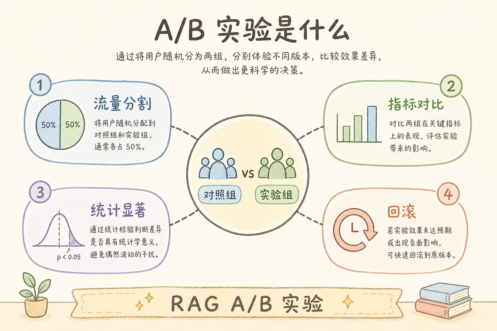
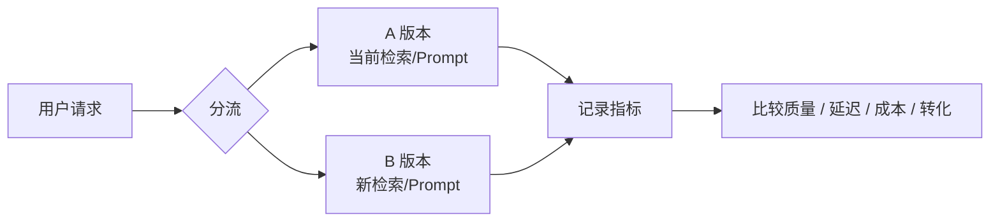
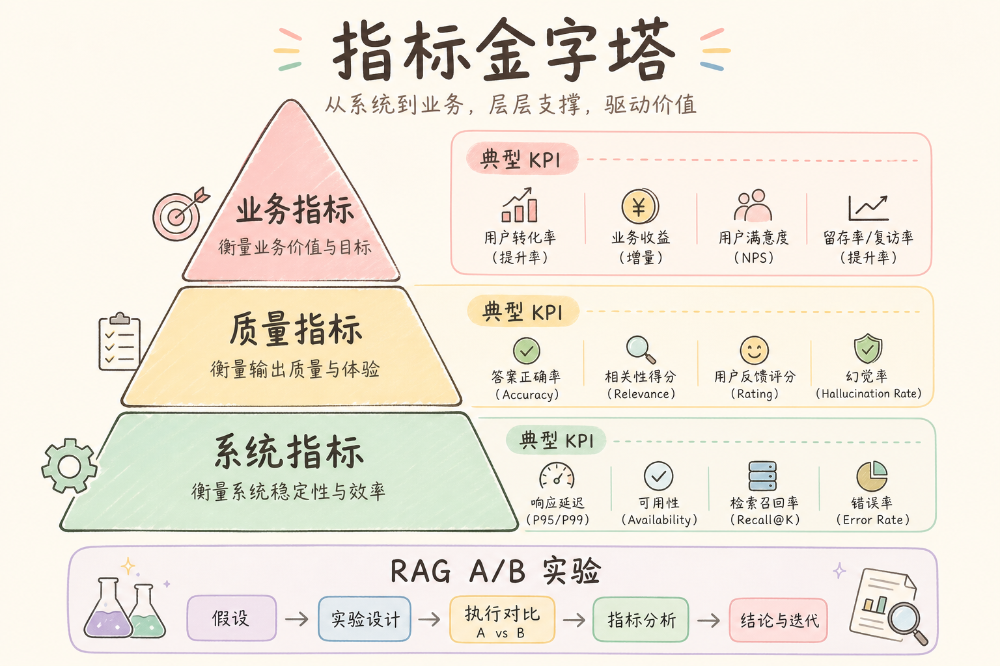
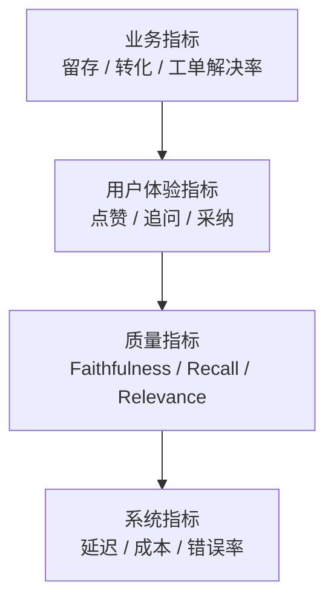
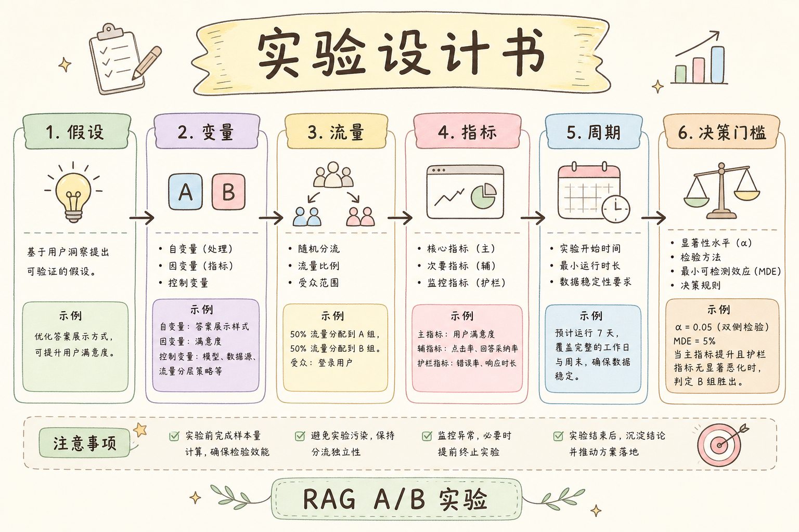
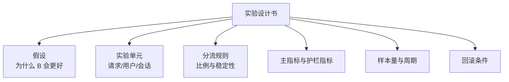
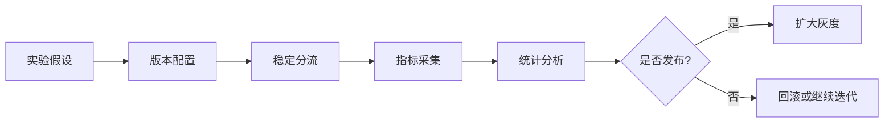

# E 评测与观测（十五）：RAG A/B 实验设计完全指南

> 「我把 top_k 从 5 改成 8，Faithfulness 好了！」——下周你发现 **延迟涨了 40%**，客服却说 **报销类反而更差**。没有 **对照、分流、显著性**，调参全靠感觉。这篇是路线图 **170**，地基篇，教你 **在 RAG 场景设计可信赖的 A/B 实验**：指标选什么、样本量 roughly 多少、如何与 [171 参数版本](154.param-version-management-tutorial.md)、[160 金标](143.golden-dataset-tutorial.md)、[147/148 观测](147.langsmith-tracing-tutorial.md) 联动。前置：[141 Faithfulness](141.ragas-faithfulness-tutorial.md)、[161 回归集](144.regression-test-set-tutorial.md)。

---

## 目录

1. [前言：没有对照的优化都是故事](#1-前言没有对照的优化都是故事)
2. [本文边界与动手路径](#2-本文边界与动手路径)
3. [RAG A/B 实验是什么](#3-rag-ab-实验是什么)
4. [实验单元：请求、用户还是会话](#4-实验单元请求用户还是会话)
5. [指标金字塔](#5-指标金字塔)
6. [离线实验 vs 在线实验](#6-离线实验-vs-在线实验)
7. [单变量与参数隔离](#7-单变量与参数隔离)
8. [样本量与实验周期](#8-样本量与实验周期)
9. [分流、灰度与回滚](#9-分流灰度与回滚)
10. [与 LangSmith / Langfuse Experiments 衔接](#10-与-langsmith--langfuse-experiments-衔接)
11. [先错对对：七种实验谬误](#11-先错对对七种实验谬误)
12. [综合实战：hybrid 开关 A/B 设计书](#12-综合实战hybrid-开关-ab-设计书)
13. [综合概念地图](#13-综合概念地图)
14. [常见陷阱与 FAQ](#14-常见陷阱与-faq)
15. [总结与系列下一步](#15-总结与系列下一步)

---

## 1. 前言：没有对照的优化都是故事

RAG 可调旋钮太多：`chunk_size`、`top_k`、hybrid 权重、reranker、prompt 版本、temperature……  
**A/B 实验**：将流量 **随机分** 到控制组 A 与实验组 B，**除待测因子外其余配置锁定**，用 **预先定义的指标** 判断 B 是否优于 A。

**读完本文，你应该能做到：**

1. 写一份 **单变量** RAG A/B 设计书（§12 模板）。  
2. 选择 **主指标 + 护栏指标** 各至少一个。  
3. 说明离线金标实验与在线分流的 **分工**。  
4. 把实验组映射到 [171 param_version](154.param-version-management-tutorial.md)。  
5. 识别 §11 七种谬误（偷改多参、窥视提前停、忽略延迟等）。

---

## 2. 本文边界与动手路径

**档位：E 地基篇（170）。**

### 2.1 动手路径

| 步骤 | 验收 |
|------|------|
| A | 选一个旋钮（如 `use_hybrid`） | 单变量 |
| B | 写假设与指标 | 设计书 1 页 |
| C | 离线 [161 回归集](144.regression-test-set-tutorial.md) 跑 A/B | 表格式结果 |
| D | 在线 5% 灰度 7 天 | trace 带 `experiment` 标签 |

---

## 3. RAG A/B 实验是什么

读下图时，先看「RAG A/B 实验是什么」想表达的主线：它把本节的概念关系压缩成一张可对照的图。



下面这张图说明 RAG A/B 实验的基本结构。读图时重点看：同一类用户请求被稳定分到不同版本，然后用同一套指标比较。



结论：A/B 实验不是“上线试试”。它要求分流规则、实验指标和回滚条件提前写清。

```text
请求 → 分流器（hash user_id）
  ├─ A: param_version=control
  └─ B: param_version=treatment_hybrid
→ 同一条 RAG 链路
→ 记录 trace + 指标
→ 分析显著性 / 业务决策
```

---

## 4. 实验单元：请求、用户还是会话

| 单元 | 适用 | 注意 |
|------|------|------|
| 请求 | 默认、简单 | 同一用户可能两边都体验 |
| 用户 | 体验一致 | hash `user_id` |
| 会话 | 多轮 [118](118.multi-turn-history-tutorial.md) | 同 session 不切换组 |

---

## 5. 指标金字塔

读下图时，先看「RAG 指标金字塔」想表达的主线：它把本节的概念关系压缩成一张可对照的图。



下面这张图把 RAG A/B 实验的指标分层。读图时重点看：不要只看一个质量分数，线上实验还必须看成本、延迟和用户行为。



这张图的结论是：质量指标只是中间层。真正的实验结论要同时考虑用户是否更满意、系统是否更稳定、成本是否可接受。

| 层级 | 指标 | 来源 |
|------|------|------|
| 北极星 | 用户满意度、点踩率 | [148 Score](148.langfuse-observability-tutorial.md) |
| 质量 | Faithfulness、Context Recall | [141](141.ragas-faithfulness-tutorial.md)、[157](140.ragas-context-recall-tutorial.md) |
| 检索 | Recall@K、MRR | 金标 |
| 护栏 | P95 延迟、token 成本 | trace |
| 安全 | 拒答率、越权 | [121](121.unauthorized-doc-filter-tutorial.md) |

**主指标一个**，护栏 **延迟和成本必看**——否则 Faithfulness 升 **业务不可用**。

---

## 6. 离线实验 vs 在线实验

| 类型 | 数据 | 优点 | 缺点 |
|------|------|------|------|
| 离线 | [160 金标](143.golden-dataset-tutorial.md)、[161 回归](144.regression-test-set-tutorial.md) | 快、便宜 | 覆盖有限 |
| 在线 | 真实流量 | 真实 | 慢、有风险 |

**推荐**：离线 **筛掉明显变差** → 在线 **小流量验证**。

---

## 7. 单变量与参数隔离

[171 篇](154.param-version-management-tutorial.md) 为 A/B **提供命名**：

```yaml
experiments:
  exp-2025-07-hybrid:
    control: pv-2025-06-01
    treatment: pv-2025-07-hybrid-on
```

**禁止**：B 组同时改 `top_k` + prompt + reranker——归因不可能。

---

## 8. 样本量与实验周期

粗略：若点踩率 5%→4%（绝对 1pp），常需 **数千～上万请求** 才稳定（视基线方差）。  
PoC：**离线 50～200 金标** + 在线 **5% 一周** 是务实起点。  
**不要** 第一天看赢就全量—— **窥视偏差**（§11）。

---

## 9. 分流、灰度与回滚

```python
import hashlib

def assign_group(user_id: str, exp: str) -> str:
    h = hashlib.sha256(f"{exp}:{user_id}".encode()).hexdigest()
    return "B" if int(h[:8], 16) % 100 < 10 else "A"  # 10% B
```

**回滚**：`treatment` 的 `param_version` **一键指回 control**；向量索引 **不删**，只切配置。

---

## 10. 与 LangSmith / Langfuse Experiments 衔接

[147 LangSmith](147.langsmith-tracing-tutorial.md) Datasets + Experiments：同一金标跑两 `param_version`。  
[148 Langfuse](148.langfuse-observability-tutorial.md)：trace `metadata.experiment=exp-hybrid`。  
与 [149～152 bad case](149.bad-case-parsing-tutorial.md)：**实验后** 低分 trace 仍走归因树。

---

## 11. 先错对对：七种实验谬误

1. **多变量齐改**  
2. **无护栏看延迟**  
3. **金标过拟合调参**  
4. **偷看中期结果提前停**  
5. **忽略星期/活动流量偏**  
6. **A/B 期间偷偷改 B**  
7. **不登记 param_version**

---

## 12. 综合实战：hybrid 开关 A/B 设计书

读下图时，先看「A/B 设计书模板」想表达的主线：它把本节的概念关系压缩成一张可对照的图。



下面这张图展示一份 A/B 实验设计书应包含的要素。读图时重点看：设计书不是形式主义，它能避免事后挑指标讲故事。



结论：没有实验设计书的 A/B，很容易变成“看哪组数据好就解释哪组”。

| 字段 | 示例 |
|------|------|
| 假设 | hybrid 提升 Context Recall |
| 控制 A | `dense_only`, pv-2025-06-01 |
| 实验 B | `hybrid_rrf`, pv-2025-07-hybrid |
| 主指标 | Context Recall@5 |
| 护栏 | P95 latency < 3s |
| 流量 | 10% × 14 天 |
| 成功 | Recall +5pp 且延迟不超 |

---

## 13. 综合概念地图

读下图时，先看「A/B 实验概念地图」想表达的主线：它把本节的概念关系压缩成一张可对照的图。


下面这张概念地图总结 RAG A/B 实验的核心环节。读图时重点看：实验闭环包含设计、分流、观测、分析和决策。



初学者可以把这张图当作上线前 checklist：少任何一步，实验结论都会不稳。

---


## 14. 常见陷阱与 FAQ
最后用 FAQ 把前面的概念变成自查清单。读完后至少要能说清：这个技术解决什么问题、什么时候不该用、上线后如何验证效果。

### 14.1 初学者最常踩的三坑

A/B 实验的危险在于“看起来很科学”。下面三个坑会让实验结果失去解释力，甚至把坏改动误判成优化。

1. **只看最终答案，不看链路**——A/B 实验 的价值在 **可复现的中间态**。  
2. **没有金标就调参**——没有 [160 Golden Dataset](143.golden-dataset-tutorial.md) 时，A/B 只是 **主观吵架**。  
3. **工具买了不用**——装了 LangSmith/Langfuse 却不给每次请求打 `trace_id`，等于 **黑盒上线**。

### 14.2 FAQ 精选

**Q1：PoC 阶段要不要上观测？**  
要。**最小集**：`request_id` + 检索 Top-5 `chunk_id` + 模型名 + 延迟。完整平台可后补，但 **字段契约** 第一天就定。

**Q2：和 RAGAS 指标怎么配合？**  
RAGAS 回答 **「好不好」**；观测平台回答 **「哪一步坏了」**。建议：金标跑 RAGAS 批次，线上 bad case 用 trace 下钻。

**Q3：成本会不会爆？**  
Trace 存全文 context 很贵。生产用 **采样**（如 5%）+ **摘要字段**（chunk_id、score、前 200 字预览），全文按需拉取。

**Q4：多环境怎么隔离？**  
`project` / `environment` 标签：`dev` / `staging` / `prod` 分开；**禁止** 把 prod trace 当训练数据未经脱敏。

**Q5：谁负责看板？**  
工程搭管道，**产品 + 领域专家** 每周过 bad case；研发负责 **归因到模块**（解析/切块/检索/生成）。

**Q6：失败请求要不要记 trace？**  
**更要记**。超时、空检索、解析异常——没有失败 trace，你永远在猜。

**Q7：和 [147 LangSmith](147.langsmith-tracing-tutorial.md) / [148 Langfuse](148.langfuse-observability-tutorial.md) 二选一？**  
LangChain 深度用 LangSmith 顺手；要 **自托管、开源、多框架** 看 Langfuse。也可 **双写** 过渡期，但统一 `trace_id`。

**Q8：如何证明一次修复有效？**  
回归集 [161](144.regression-test-set-tutorial.md) 上 **同题同参** 对比；再看线上 **7 日 bad case 率**。

**Q9：实习生能维护吗？**  
把 **归因决策树** 贴在 wiki（本篇系列 149～152）；观测 UI 只读权限给全员，写权限限研发。

**Q10：面试怎么讲？**  
30 秒：**「RAG 上线后我用 trace 把 bad case 分到 ingest/retrieve/generate，用金标 + A/B 验证改动，参数版本可回滚。」**

## 15. 总结与系列下一步

1. **单变量 + 双环境指标** 是 RAG A/B 铁律。  
2. **离线筛 + 在线验** 节省成本。  
3. **param_version** 是实验的语言（[171](154.param-version-management-tutorial.md)）。  
4. **观测平台** 记录 `experiment` 标签。  
5. bad case 归因 **不因做实验而跳过**。

| 目标 | 阅读 |
|------|------|
| 参数版本 | [154 篇](154.param-version-management-tutorial.md) |
| 回归集 | [161 篇](144.regression-test-set-tutorial.md) |
| 检索遗漏 | [151 篇](151.bad-case-retrieval-miss-tutorial.md) |

---

*系列：E 评测与观测 · 路线图第 170 条 · 地基篇*


### 15.1 A/B 深度补充：分析检查清单

实验结束前检查：(1) A/B 样本量是否够；(2) 是否同一 [171 pv](154.param-version-management-tutorial.md) 族；(3) 周末流量是否偏；(4) 护栏 latency 是否劣化；(5) 分意图（报销/年假/IT）**分层看**，避免平均数掩盖伤害某一类。

**失败也发布**：B 组显著变差时，写 **postmortem**：假设为何错、下次如何写假设。文档进 wiki，版本号 `exp-xxx-failed` 保留，防后人重复踩坑。


## 16. A/B 实验落地精读

RAG A/B 铁律：**单变量**、**离线先筛**、**线上小流量**、**护栏必看**。主指标一个（如 Context Recall 或点踩率），护栏至少 latency 与 token 成本。

分流用 user_id 哈希，多轮会话 [118](118.multi-turn-history-tutorial.md) 同 session 不跨组。control/treatment 各对应冻结 [171 param_version](154.param-version-management-tutorial.md)，禁止 B 组手改环境变量。

离线用 [161 回归集](144.regression-test-set-tutorial.md) 两百题；明显变差不上线。线上 5%～10% 跑一到两周，防窥视提前停。分意图（报销/年假/IT）看指标，防平均数掩盖单类伤害。

LangSmith Experiments 与 Langfuse metadata.experiment_id 记录实验。失败实验也写 postmortem，版本号 exp-xxx-failed 存档。

与 bad case 系列并行：实验不能替代 149～152 归因，只能验证 **单一假设**。


## 17. 练习与自检

动手一：写 hybrid 开关实验设计书。动手二：回归集离线 A/B。动手三：metadata 加 experiment_id。

自检：单变量？主指标与护栏？离线线上分工？回滚条件？

误区：多参齐改；窥视提前停；无 param_version；忽视分意图。

成功实验登记 [171](154.param-version-management-tutorial.md)。失败写 postmortem。

## 18. A/B 实验周课与清单

**每日**： 检查在跑实验是否单变量、护栏是否正常。**每周**： 归档实验结果与 postmortem。**每月**： 回顾 param_version 族谱，删过期实验配置。

实验设计书十一字段：ID、负责人、假设、control/treatment pv、分流、主指标、护栏、周期、成功标准、回滚条件——缺一项不准上线。

离线 [161 回归](144.regression-test-set-tutorial.md) 是 **安全带**；在线是 **验证**。样本量不够不要宣称显著。

分意图分析避免「平均涨、报销跌」。latency 护栏保护体验。

[147/148](147.langsmith-tracing-tutorial.md) experiment 标签与 [171 pv](154.param-version-management-tutorial.md) 一致。

团队口诀：**「一次只改一把尺。」**

## 19. 综合案例：hybrid 实验全记录

**假设**：RRF hybrid 提升 Context Recall。**control** dense-only pv-06。**treatment** hybrid pv-07。**离线** 回归 180 题 Recall@5 +12pp。**线上** 10% 十四天，点踩降，P95 +80ms 未超护栏。**决策**：全量，archive 设计书。

**失败案例**：同时改 reranker 与 hybrid，指标变差无法归因——违反单变量，回滚。

## 20. E 模块联动与职业素养

企业 RAG 的成熟度不靠「是否用上向量库」，而靠 **能否把一次用户差评还原成可复现链路**。RAG A/B 实验 是其中一环。你必须熟悉：**金标** [160](143.golden-dataset-tutorial.md)、**回归** [161](144.regression-test-set-tutorial.md)、**RAGAS** [156～159](139.ragas-context-precision-tutorial.md)、**观测** [164 LangSmith](147.langsmith-tracing-tutorial.md) / [165 Langfuse](148.langfuse-observability-tutorial.md)、**归因四步** [166～169](149.bad-case-parsing-tutorial.md)、**实验** [170](153.ab-experiment-rag-tutorial.md)、**版本** [171](154.param-version-management-tutorial.md)。

**ingest 段** 回到 C1：[36 PDF](36.pdf-text-extraction-tutorial.md) 到 [56 多模态](56.multimodal-image-text-tutorial.md)。**chunk 段** 回到 C2：[57](57.fixed-size-chunking-tutorial.md) 到 [65 Parent](65.parent-document-retriever-tutorial.md)。**检索段** 回到 [91 Dense](91.dense-retrieval-tutorial.md)、[92 Sparse](92.sparse-retrieval-rag-tutorial.md)、[93 Hybrid](93.hybrid-search-tutorial.md)、[100 改写](100.query-rewriting-tutorial.md)。**生成段** 回到 [33 幻觉](33.llm-hallucination-tutorial.md)、[110 Prompt](110.rag-prompt-template-tutorial.md)、[112 拒答](112.refusal-strategy-tutorial.md)、[141 Faithfulness](141.ragas-faithfulness-tutorial.md)。

每周五用三十分钟做 **E 模块例会**：一个指标（Faithfulness 或点踩率）、五条 trace、一个实验结论、一个 pv 变更。坚持八周，团队会形成 **共同语言**，不再为「模型笨」争吵。

**面试最后一问**：讲一次你亲历的 bad case，如何从 trace 定位到解析/切块/检索/胡编，如何单变量实验验证，如何 param_version 回滚。能讲清楚者，已超越多数「只会调 top_k」的候选人。

**合规提醒**：trace 与 Record 可能含用户 query 中的个人信息，脱敏与保留周期遵守公司安全政策（路线图 G 轨 PII、审计）。观测不是 **无限记日志**，而是 **记对字段、记够排障、记到合规**。

**下一步学习**：人工评测 [172](155.human-evaluation-rag-tutorial.md)；检索调试台（路线图 199）；全栈看板（路线图 201）。E 模块学完后，你已具备 **生产化迭代闭环**，可进入 F 轨工程交付。

**背诵卡片（可选）**：观测回答「哪一步坏了」；评测回答「好不好」；实验回答「改动是否有效」；版本回答「当时用的啥配置」。四句话覆盖 E 模块面试八十分。动手时永远 **先 trace 后改参**，先 **单变量** 后组合，先 **离线回归** 后线上灰度——三条纪律比任何工具名字都重要。

**交付物检查**：读完本篇后，你应能在自己的 RAG 项目里指出：观测字段是否含 chunk_id 与 param_version；是否能在十五分钟内用 149～152 树归因一条真实差评；是否能为下一次参数变更写出实验假设与回滚条件。三项都能做到，本篇才算 **真正读完**，而非收藏夹吃灰。

## 21. 全系列复盘：E 模块九篇一张图

```text
163 TruLens（了解）── 在线三角抽样
164 LangSmith（主线）─┐
165 Langfuse（主线）──┴─ 观测：trace 下钻
166 解析 bad case ── C1 轨 36～56
167 切块 bad case ── C2 轨 57～65
168 检索遗漏（主线）── 93 hybrid、100 改写
169 生成胡编（主线）── 33 理论、141 Faithfulness
170 A/B 实验 ── 单变量 + 护栏
171 参数版本 ── manifest + 回滚
```

**一周冲刺计划**：周一 147+148 接通 trace；周二 149 源文 diff；周三 150 chunk 边界；周四 151 gold 探针；周五 152 Faithfulness 核验；周末 170+171 写实验与 manifest。第二周用 TruLens 抽样验证三角分桶是否与人工归因一致。

**与 DeepEval、RAGAS 关系**：离线 RAGAS 定基线，DeepEval 挡 CI，TruLens 看尾部，LangSmith/Langfuse 定位链路——五件套各司其职，不是「选一个就够」。

**常见团队分工**：数据工程负责 166～167 与 ingest；算法负责 168～169 与检索生成；平台负责 164～165 与 171；产品负责 170 实验设计与金标维护。单人学习则按文件编号顺序推进。

**质量门禁建议**：新版本 pv 上线前——回归集 Faithfulness 不降超过 1pp；P95 延迟不超旧版 10%；点踩率周环比不升。任一失败则回滚 parent_version。

**引用与溯源**：生成侧见 [113 行内](113.inline-citation-tutorial.md)、[115 导航](115.source-document-navigation-tutorial.md)；流式见 [116 SSE](116.sse-rag-streaming-tutorial.md)。观测与引用结合，用户才能从差评走到可点击证据。

**最后强调**：bad case 不是耻辱，是 **迭代燃料**。没有 trace 的 bad case 是八卦；有 trace 与 param_version 的 bad case 是 **数据集与实验假设来源**。把 166～169 决策树贴在显示器旁，比再买一个向量库更能提升答案质量。

## 22. 实操巩固（必读）

请你现在打开自己的 RAG 项目或教程 PoC，完成三件事：第一，为最近一次问答找到或构造等价于 LangSmith trace 的完整记录，至少包含检索结果列表与最终 prompt。第二，用 166～169 四篇的决策树对一条差评分类，写下证据而不是猜测。第三，在纸上写出当前系统的 param_version 字符串，若写不出，说明版本管理尚未开始，请优先阅读 171 并创建 manifest。

观测平台选型无需纠结：LangChain 为主选 LangSmith，自研或合规选 Langfuse，亦可短期双写。关键是 chunk_id、param_version、experiment_id 字段统一。TruLens 作了解档，适合在 staging 对三角分桶，引导团队讨论「检索坏还是生成坏」。

解析与切块问题常被误当成模型问题。只要 trace 里原文与源文件不一致，或 chunk 语义不完整，就不要调 temperature。检索遗漏时 hybrid 与改写是第一档手段，胡编且 context 含 gold 时才盯 prompt 与拒答。每次改动走 A/B，每次上线记 pv，每次回滚有 parent。

金标与回归集是 **前提**，不是可选项。没有 160 与 161，实验只是争论。RAGAS 指标与线上点踩率应同向变动；若背离，检查评判 prompt、抽样或产品入口变化。

面向面试：用三分钟讲清「一次 bad case 如何从 trace 定位到模块、如何用实验验证、如何回滚」。这比背诵向量库 API 更能体现 E 模块素养。

面向生产：trace 脱敏、保留周期、失败请求必记、客服会贴链接。E 模块不是实验室装饰，是上线后的操作系统。

若你刚学完 163～171，下一步建议 172 人工评测，并把路线图 199 检索调试台列入 backlog。坚持每周例会三十分钟，八周后团队答复质量通常会显著稳定，因为你们不再盲人摸象。

E 模块与 C 轨、D 轨的衔接：ingest 出问题回到 36～56，检索出问题回到 91～103，生成出问题回到 29～34 与 110～112。不要跨模块乱调参。文档版本 48 与参数版本 171 同时维护，避免「内容新、管道旧」或相反。

TruLens 三角、RAGAS 四指标、点踩率、Faithfulness 自动评——指标多时要 **分桶看**，不要合成一个神秘分数。实验 170 只改一把尺，版本 171 记下每一次尺的长度。这是本批九篇最核心的纪律，请写入团队 wiki 首页。

## 23. 术语对照与读者服务

初学者常混淆观测与评测：LangSmith 与 Langfuse 记录「发生了什么」，RAGAS 与 TruLens 评判「好不好」。混淆会导致工具买重复或互相推诿。bad case 四篇是「为什么不好」的归因手册，不是新的工具广告。A/B 与 param_version 是「如何安全地变好」的制度。

阅读顺序建议：先 164 或 165 接通 trace，再 166～169 练归因，再 170～171 做变更。163 TruLens 可插读。每篇动手路径表的验收项务必打勾，否则只读不练等于未学。

感谢你把 E 模块学完。企业 RAG 的护城河往往不是最大模型，而是 **可追溯、可实验、可回滚** 的工程习惯。愿你在真实项目里用 trace 终结扯皮，用金标终结拍脑袋，用 param_version 终结「上周那个配置谁还记得」。


### 附录：E 模块联动速查

本篇属于路线图 **E. 评测、观测与迭代**（163～171）。推荐闭环：**金标（160）→ RAGAS 离线分（156～159）→ 观测 trace（164 LangSmith / 165 Langfuse）→ bad case 四步归因（166～169）→ A/B 验证（170）→ param_version 登记（171）**。解析阶段问题回跳 **C1 轨 [36 PDF](36.pdf-text-extraction-tutorial.md)～[56 多模态](56.multimodal-image-text-tutorial.md)**；切块问题回跳 **[57 固定分块](57.fixed-size-chunking-tutorial.md)～[65 Parent](65.parent-document-retriever-tutorial.md)**；检索遗漏优先 **[93 混合检索](93.hybrid-search-tutorial.md)** 与 **[100 查询改写](100.query-rewriting-tutorial.md)**；生成胡编对照 **[33 幻觉](33.llm-hallucination-tutorial.md)** 与 **[141 Faithfulness](141.ragas-faithfulness-tutorial.md)**。每次线上变更在 trace metadata 写 `param_version`，在 Git 提交 manifest，在回归集留 before/after 分数——三线对齐才称得上工程化 RAG。初学者请把本篇与相邻编号文章串读一周：工具篇（163～165）建立观测，归因篇（166～169）建立排障肌肉记忆，实验与版本篇（170～171）建立变更纪律。缺任何一块，线上都会退回「凭感觉调 top_k」的作坊状态。配图见 `image/ab-experiment-rag/prompts/`，风格 hand-drawn-edu、16:9 中文，与全系列一致。

## 附录：工程化 RAG 迭代宣言（系列共用）

我们承诺：每一次线上用户差评都能在七十二小时内对应到一条 trace 或等价日志；每一个 param_version 都能在 Git 找到 manifest；每一次参数变更都有离线回归或 A/B 证据。我们拒绝「感觉好像好了」的上线方式。

解析阶段对照第三十六至五十六篇：PDF、表格、HTML、DOCX、编码、OCR、多模态各有一套失败信号。切块阶段对照第五十七至六十五篇：固定、递归、句子、重叠、结构、Markdown、Parent。检索阶段对照第九十一至一百零三篇：稠密、稀疏、混合、改写、多查询。生成阶段对照第三十三篇幻觉理论与第一百一十至一百一十二篇 prompt 与拒答。

LangSmith 与 Langfuse 是主线观测工具，不是可选项。TruLens 与 RAGAS 是质量尺子，不是装饰品。bad case 四篇是团队共同语言，不是算法私藏。A/B 与 param_version 是变更法律，不是事后补票。

每周例会四问：点踩率变了吗？Faithfulness 变了吗？P95 延迟变了吗？本周实验结论是什么？四问答不清，说明观测或版本管理仍欠债。

单人学习者：用一周接通 trace，一周练四篇归因，一周写第一个 manifest 与实验设计书。三周后你应能独立处理一条真实差评全流程。

多人团队：数据对 ingest，算法对 retrieve 与 generate，平台对观测与版本，产品对金标与实验。边界清晰可减少互相甩锅。

合规：trace 脱敏，保留周期书面化，用户删除权对接会话与日志删除 API。观测数据也是个人数据载体。

图文要求：如本篇加入信息图，图前要说明读图重点，图后要给结论；不要让图片脱离所在小节。

路线图 E 模块完结后，你已进入「能迭代」阶段，而非「能 demo」阶段。下一阶段 F 轨将把能力封装为 API 与界面。请带着 param_version 与 trace 习惯进入全栈篇。

如果你只记住一句话：先 trace，后归因，再实验，终版本。其余工具名都会随生态演变，这条纪律不会过时。

本批九篇对应路线图第一百六十三至一百七十一条，文件编号第一百四十六至一百五十四。档位标注「了解」「主线」「地基」见 batch mapping 文档。初学者按编号顺序阅读，遇到 ingest 疑问跳 C1，遇到检索疑问跳 C4C5，遇到生成疑问跳 C6 与第三十三篇。

动手验收再强调：接通一次 trace，完成一次源文 diff，完成一次 gold 探针，完成一次 Faithfulness 人工核验，写出一份实验设计书，写出一份 manifest YAML。六项齐，E 模块毕业。

与同事协作时，把 trace 链接当作 bad case 第一附件，把 param_version 当作变更第一字段，把回归集 diff 当作上线第一门禁。文化比工具更难，但文化靠重复仪式养成。

祝你在企业 RAG 路上，少踩「黑盒调参」的坑，多建「可复盘」的系统。坚持学习。

再读一遍本篇核心章节摘要，对照你当前项目打勾：我能否在观测 UI 找到检索 Top-K？我能否解释本次问答的 param_version？我能否把最近一条差评归入四步归因之一？我能否在改动前写出 A/B 假设？四问皆能，本篇目标达成；若有否，带着问题重读对应小节，比盲目刷下一篇更有效。请继续阅读系列相关篇章。

最后提醒：生成胡编、检索遗漏、切块错误、解析错误四类问题在用户侧都表现为「机器人胡说」，只有 trace 与归因树能把争论变成工程任务。把第一百六十六至一百六十九篇打印成决策树贴在工位旁，配合第一百六十四或一百六十五篇的观测链接，你的 RAG 团队会少开很多无效会议。版本管理第一百七十一条不是官僚主义，而是事故后十分钟回滚的保险绳。感谢阅读，欢迎反馈改进建议。
