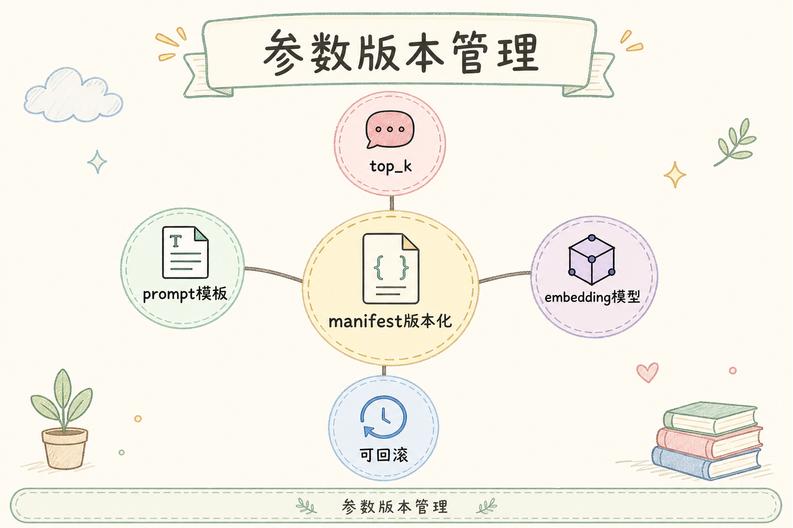
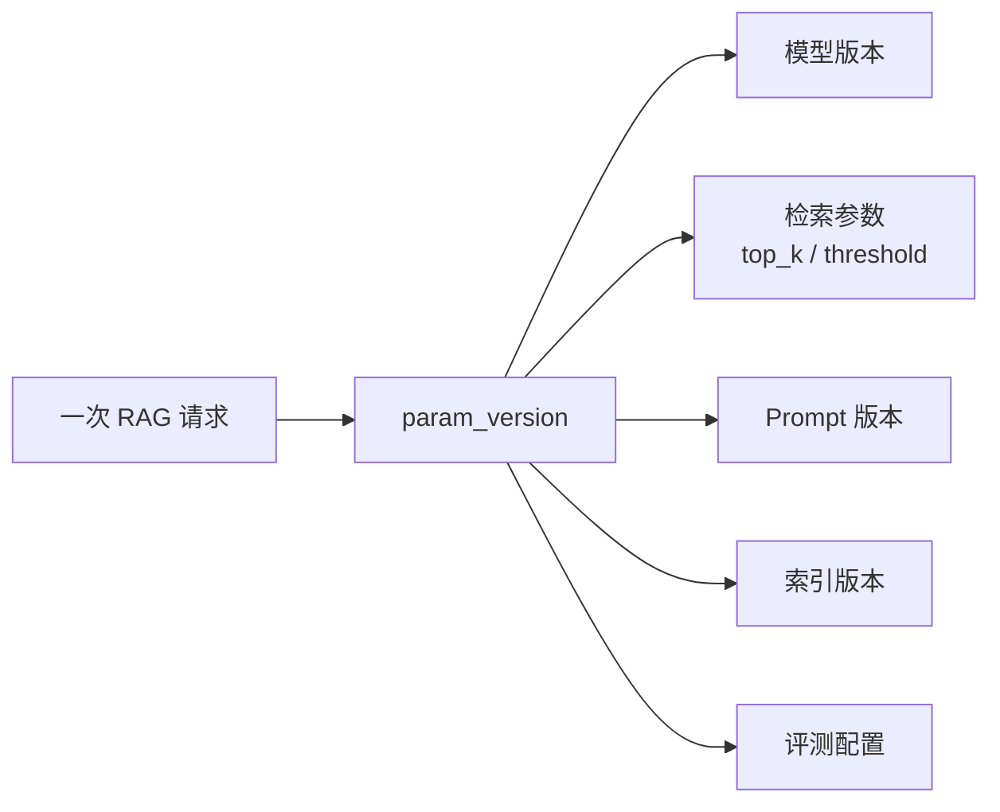
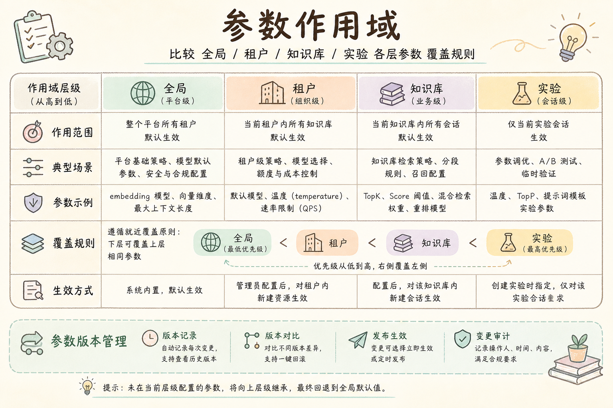
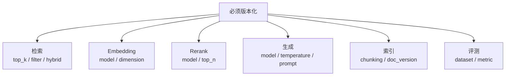
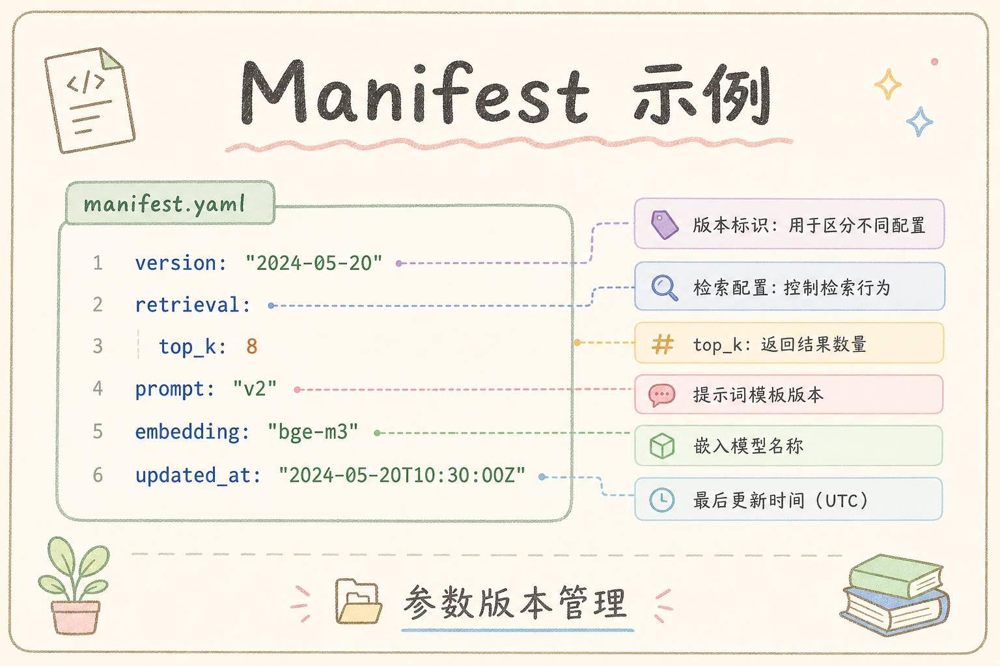
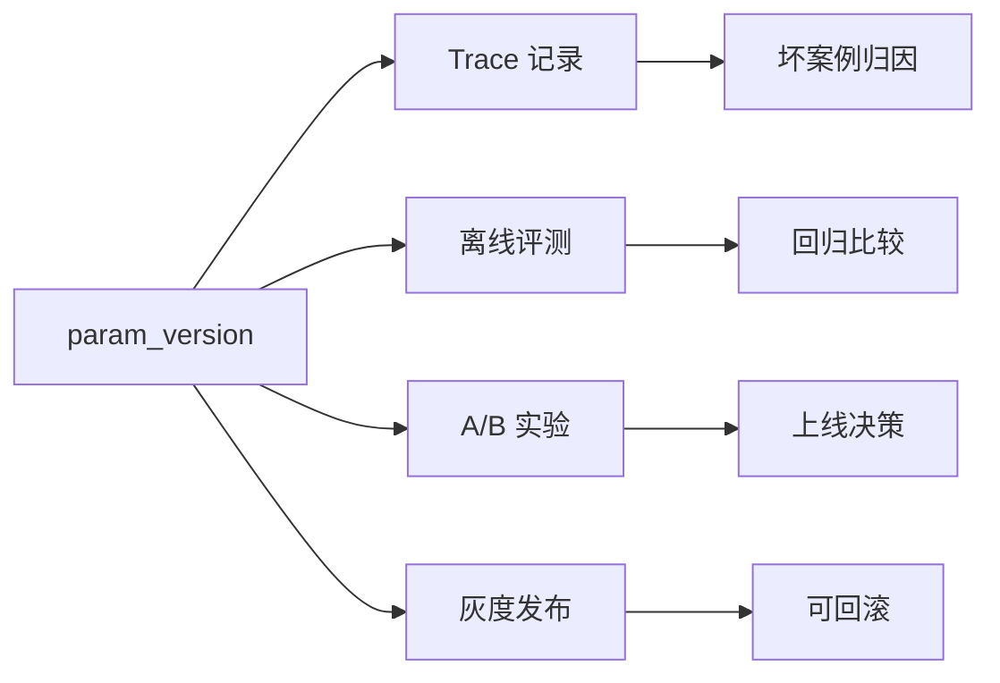

# E 评测与观测（十六）：RAG 参数版本管理完全指南

> 线上 Faithfulness 突然崩了，你翻 git 发现：上周有人改了 `chunk_overlap`、换了 Embedding 模型、还顺手调了 prompt——但 **索引没重建**、**没登记版本**、**A/B 还在跑旧配置**。这篇是路线图 **171**，地基篇，教你 **把 chunk、top_k、reranker、prompt、解析器策略** 收成 **可回滚的 param_version**，并与 [170 A/B](153.ab-experiment-rag-tutorial.md)、[147/148 trace](147.langsmith-tracing-tutorial.md)、[161 回归集](144.regression-test-set-tutorial.md) 对齐。前置：[138 配置驱动管道](138.config-driven-pipeline-tutorial.md)、[48 文档版本](48.doc-versioning-tutorial.md)。

---

## 目录

1. [前言：参数散落等于没有版本](#1-前言参数散落等于没有版本)
2. [本文边界与动手路径](#2-本文边界与动手路径)
3. [参数版本管理是什么](#3-参数版本管理是什么)
4. [哪些参数必须版本化](#4-哪些参数必须版本化)
5. [param_version 命名与清单](#5-param_version-命名与清单)
6. [与索引、Embedding 生命周期](#6-与索引embedding-生命周期)
7. [配置存储：YAML、DB 与 Git](#7-配置存储yamldb-与-git)
8. [trace 与评测绑定](#8-trace-与评测绑定)
9. [发布、灰度与回滚](#9-发布灰度与回滚)
10. [与文档版本 doc_version 的关系](#10-与文档版本-doc_version-的关系)
11. [先错对对：六种版本灾难](#11-先错对对六种版本灾难)
12. [综合实战：param manifest 示例](#12-综合实战param-manifest-示例)
13. [综合概念地图](#13-综合概念地图)
14. [常见陷阱与 FAQ](#14-常见陷阱与-faq)
15. [总结与系列下一步](#15-总结与系列下一步)

---

## 1. 前言：参数散落等于没有版本

RAG 不是「一个模型文件」，而是 **参数笛卡尔积**：

- Parser：`pymupdf` vs `pdfplumber`（[149 解析 bad case](149.bad-case-parsing-tutorial.md)）  
- Splitter：`chunk_size=512, overlap=64`（[150 切块](150.bad-case-chunking-tutorial.md)）  
- Embedder：`bge-m3` vs `text-embedding-3-small`（[25 Embedding](25.embedding-vector-tutorial.md)）  
- Retriever：`top_k=5`, `hybrid=true`（[151 检索](151.bad-case-retrieval-miss-tutorial.md)）  
- Reranker：`bge-reranker-v2`（[96 篇](96.bge-reranker-tutorial.md)）  
- Generator：`prompt_v3`, `temperature=0.1`（[152 胡编](152.bad-case-hallucination-tutorial.md)）

**param_version**：一条 **不可变** 的配置快照 ID，指向上述旋钮的 **完整组合** + **对应索引代数**。  
通俗说：**菜谱版本号**——不是只记「盐多了」，而是 **整道菜配方冻结**。

---

## 2. 本文边界与动手路径

**档位：E 地基篇（171）。**

本文解决的是“怎么让一次 RAG 变更可复现、可比较、可回滚”。读完后，你不需要立刻搭完整平台，但至少要能写出一份 manifest，并让 API、trace、回归报告都指向同一个 `param_version`。

本篇会明确回答：参数版本管理是什么、有什么用、解决了什么问题、怎么用 manifest 落地，以及日常发布和回滚中的具体用法。

### 2.1 动手路径

| 步骤 | 你做什么 | 验收 |
|------|----------|------|
| A | 写 `manifests/pv-2025-07-01.yaml` | parser、chunk、embedding、retrieve、generate 字段齐全 |
| B | API 响应带 `param_version` | 前端或调试台能看到当前配置 |
| C | trace metadata 同步 | LangSmith/Langfuse 可按 pv 筛选 |
| D | 模拟回滚 | production 指针能指回上一 pv |

---

## 3. 参数版本管理是什么

读下图时，先看「参数版本管理是什么」想表达的主线：它把本节的概念关系压缩成一张可对照的图。



下面这张图说明参数版本管理的作用。读图时重点看：一次 RAG 回答要能追溯到当时使用的模型、检索、Prompt 和阈值配置。



结论：没有 param_version，就很难解释“为什么昨天答案和今天不同”。

**目标**：

1. **可复现**：任意历史问答知道 **当时用的哪套参**；  
2. **可对比**：[170 A/B](153.ab-experiment-rag-tutorial.md) 的 control/treatment 有名字；  
3. **可回滚**：新版本变差 **一键切回**；  
4. **可审计**：谁、何时、改了什么。

---

## 4. 哪些参数必须版本化

读下图时，先看「必须版本化的参数」想表达的主线：它把本节的概念关系压缩成一张可对照的图。



下面这张图列出 RAG 中必须纳入版本管理的参数范围。读图时重点看：不只是 Prompt，要把影响答案的关键开关都纳入版本。



这张图的结论是：只记录 Prompt 版本不够。检索参数或索引版本变化，同样会改变最终答案。

| 类别 | 参数 | 变更是否重索引 |
|------|------|----------------|
| Ingest | parser, ocr | 是 |
| Chunk | size, overlap, strategy | 是 |
| Embed | model, dim | 是 |
| Index | collection, metric | 常是 |
| Retrieve | top_k, hybrid, filter | 否 |
| Rerank | model, cutoff | 否 |
| Generate | prompt, temperature | 否 |

**铁律**：改左列 **必须新 pv + 重建**；只改右列可 **热切换**（仍应新 pv 登记）。

---

## 5. param_version 命名与清单

推荐：`pv-YYYY-MM-DD` 或 `pv-YYYY-MM-DD-hybrid`。**禁止** `latest` 作生产 tag。

命名要满足两个条件：人能看出大致发布时间，机器能稳定引用。`latest` 最大的问题是会漂移，今天的 `latest` 和下周的 `latest` 不是同一套配置，事故复盘时无法还原。

初学者可以先不设计复杂命名体系，先做到三件事：每次变更一个新名字、每个名字对应一份不可变清单、清单里能找到上一版 `parent_version`。

**manifest 最小字段**：

```yaml
param_version: pv-2025-07-01
created_at: 2025-07-01T10:00:00Z
author: team-rag
parser: pymupdf-v1.24
chunk:
  policy: markdown-ast-v2
  size: 800
  overlap: 120
embedding:
  model: BAAI/bge-m3
  dimension: 1024
index:
  store: qdrant
  collection: handbook_v7
retrieve:
  top_k: 8
  hybrid: true
  rrf_k: 60
rerank:
  model: bge-reranker-v2-m3
  top_n: 5
generate:
  prompt_name: rag_v3
  temperature: 0.1
notes: "开启 hybrid，修复报销类检索遗漏"
parent_version: pv-2025-06-15
```

这份 YAML 就是一张“配置快照”。上线时不要只把它存在某台机器上，应提交到 Git；运行时数据库只保存当前 production 指针，例如 `prod -> pv-2025-07-01`。

---

## 6. 与索引、Embedding 生命周期

参数版本和索引生命周期必须绑在一起看。只改 `top_k` 通常可以热切换；但只要改了解析器、chunk 规则、Embedding 模型或向量维度，旧索引就不再可信，必须新建索引代际。

换 Embedding 不换 collection 名 = **灾难**（[76 Chroma](76.chroma-vector-db-tutorial.md) §8）。  
**做法**：`collection` 或 `index_generation` 随 pv 递增；旧索引 **保留 N 天** 便于回滚。  
对接 [162 幂等重建](162.idempotent-reindex-tutorial.md)、[178 状态机](161.index-task-state-machine-tutorial.md)。

---

## 7. 配置存储：YAML、DB 与 Git

[138 配置驱动](138.config-driven-pipeline-tutorial.md)：Git 存 manifest **真源**；运行时 DB **当前 production 指针**。  
**环境**：`dev` 可浮动；`prod` **仅通过发布流程改指针**。

---

## 8. trace 与评测绑定

[147 LangSmith](147.langsmith-tracing-tutorial.md) / [148 Langfuse](148.langfuse-observability-tutorial.md)：

每次请求都要把 `param_version` 写进 trace metadata。这样当用户投诉“今天答案变差了”时，你能按版本筛出同一批请求，而不是在所有日志里大海捞针。

这一节的重点是把“配置版本”变成排障字段。只存在 Git 里的版本号不够，线上每一次回答也要把它带出来。

最小落地可以从一个字段开始：无论请求成功、失败、超时，都把当前 `param_version` 写入日志或 trace。

```json
{"metadata": {"param_version": "pv-2025-07-01"}}
```

这段 JSON 的重点不是字段名好看，而是让线上 trace、离线回归和 A/B 实验使用同一个版本锚点。

[161 回归集](144.regression-test-set-tutorial.md) 跑分报告 **表头必含 pv**。  
bad case 工单（[149～152](149.bad-case-parsing-tutorial.md)）字段 **`param_version`**。

---

## 9. 发布、灰度与回滚

发布流程要把“验证”和“切指针”分开：manifest 先通过离线回归，再进小流量灰度，最后才把 production 指针切到新版本。

对初学者来说，灰度不是高级发布花活，而是降低配置错误影响面的基本手段。回滚也不是重新部署代码，而是把 production 指针切回旧 pv。

只要旧索引和旧 manifest 没被删，回滚就可以是分钟级操作；否则所谓回滚只是重新抢修。

```text
draft manifest → 离线回归通过 → 灰度 5%（见 170 A/B）
  → 全量 → 标记 production
回滚：production 指针 ← parent_version（索引仍在）
```

回滚能快，是因为旧 manifest 和旧索引还在。如果上线时覆盖旧 collection，`parent_version` 只剩名字，无法真正恢复。

---

## 10. 与文档版本 doc_version 的关系

[48 文档版本](48.doc-versioning-tutorial.md) 管 **内容**；`param_version` 管 **怎么切与怎么搜**。  
一条 trace 应同时有：`doc_version`（命中 chunk）、`param_version`（管道配置）。

---

## 11. 先错对对：六种版本灾难

下面六种灾难都不是“模型不够聪明”，而是配置没有版本化导致无法复盘。读的时候重点看：每个错法都让某个关键变量从 trace 或 manifest 里消失了。

1. **改 chunk 未重 embed**  
2. **prod 用 latest 标签**  
3. **A/B 两组共用一个 collection**  
4. **manifest 缺 rerank 字段**  
5. **回滚只改 prompt 未改索引指针**  
6. **trace 无 param_version**

正确做法是：任何影响答案的旋钮变化都生成新 pv；任何需要重建索引的变化都生成新 collection 或 index_generation；任何线上回答都能在 trace 里查到当时的 pv。

---

## 12. 综合实战：param manifest 示例

按下面四步把 §5 的 YAML 接到真实链路里：



1. 在仓库中新建 `manifests/pv-2025-07-01.yaml`，内容沿用 §5 字段。
2. 后端启动时读取 production 指针，例如数据库表 `rag_runtime_config.current_param_version`。
3. `/api/rag/ask` 响应中返回 `param_version`，同时写入 Langfuse 或 LangSmith metadata。
4. 回归报告和 bad case 工单都带同一个 pv，便于按版本筛选。

验收方式：调用一次 `/api/rag/ask`，确认响应里有 `param_version`；再打开观测平台，用该 pv 筛出刚才那条 trace。

---

## 13. 综合概念地图

读下图时，先看「参数版本概念地图」想表达的主线：它把本节的概念关系压缩成一张可对照的图。


下面这张概念地图把参数版本与 trace、评测、发布串起来。读图时重点看：param_version 是排障和实验的共同锚点。

如果只记一条线，就记住：manifest 冻结配置，trace 记录运行时版本，回归和 A/B 用同一个版本号对比效果。



结论：参数版本不是文档管理，而是让每次回答、每次实验和每次发布都能追溯。

---


## 14. 常见陷阱与 FAQ
最后用 FAQ 把前面的概念变成自查清单。读完后至少要能说清：这个技术解决什么问题、什么时候不该用、上线后如何验证效果。

### 14.1 初学者最常踩的三坑

1. **只看最终答案，不看链路**——参数版本 的价值在 **可复现的中间态**。  
2. **没有金标就调参**——没有 [160 Golden Dataset](143.golden-dataset-tutorial.md) 时，A/B 只是 **主观吵架**。  
3. **工具买了不用**——装了 LangSmith/Langfuse 却不给每次请求打 `trace_id`，等于 **黑盒上线**。

### 14.2 FAQ 精选

**Q1：PoC 阶段要不要上观测？**  
要。**最小集**：`request_id` + 检索 Top-5 `chunk_id` + 模型名 + 延迟。完整平台可后补，但 **字段契约** 第一天就定。

**Q2：和 RAGAS 指标怎么配合？**  
RAGAS 回答 **「好不好」**；观测平台回答 **「哪一步坏了」**。建议：金标跑 RAGAS 批次，线上 bad case 用 trace 下钻。

**Q3：成本会不会爆？**  
Trace 存全文 context 很贵。生产用 **采样**（如 5%）+ **摘要字段**（chunk_id、score、前 200 字预览），全文按需拉取。

**Q4：多环境怎么隔离？**  
`project` / `environment` 标签：`dev` / `staging` / `prod` 分开；**禁止** 把 prod trace 当训练数据未经脱敏。

**Q5：谁负责看板？**  
工程搭管道，**产品 + 领域专家** 每周过 bad case；研发负责 **归因到模块**（解析/切块/检索/生成）。

**Q6：失败请求要不要记 trace？**  
**更要记**。超时、空检索、解析异常——没有失败 trace，你永远在猜。

**Q7：和 [147 LangSmith](147.langsmith-tracing-tutorial.md) / [148 Langfuse](148.langfuse-observability-tutorial.md) 二选一？**  
LangChain 深度用 LangSmith 顺手；要 **自托管、开源、多框架** 看 Langfuse。也可 **双写** 过渡期，但统一 `trace_id`。

**Q8：如何证明一次修复有效？**  
回归集 [161](144.regression-test-set-tutorial.md) 上 **同题同参** 对比；再看线上 **7 日 bad case 率**。

**Q9：实习生能维护吗？**  
把 **归因决策树** 贴在 wiki（本篇系列 149～152）；观测 UI 只读权限给全员，写权限限研发。

**Q10：面试怎么讲？**  
30 秒：**「RAG 上线后我用 trace 把 bad case 分到 ingest/retrieve/generate，用金标 + A/B 验证改动，参数版本可回滚。」**

## 15. 总结与系列下一步

1. **param_version = 全管道快照 + 索引代数**。  
2. **改 ingest/chunk/embed 必重建**。  
3. **trace / 回归 / A/B** 共用同一版本 ID。  
4. **doc_version** 与 **param_version** 分工明确。  
5. E 模块闭环：**金标 → 观测 → bad case → 实验 → 版本**。

| 目标 | 阅读 |
|------|------|
| A/B 实验 | [153 篇](153.ab-experiment-rag-tutorial.md) |
| 配置驱动 | [138 篇](138.config-driven-pipeline-tutorial.md) |
| 人工评测 | [155 篇](155.human-evaluation-rag-tutorial.md) |

---

*系列：E 评测与观测 · 路线图第 171 条 · 地基篇*


### 15.20 参数版本深度补充：发布检查单

- [ ] manifest 已 commit Git  
- [ ] 需重索引的项已跑完 [178 状态机](161.index-task-state-machine-tutorial.md)  
- [ ] [161 回归集](144.regression-test-set-tutorial.md) 对比 parent_version  
- [ ] [147/148](147.langsmith-tracing-tutorial.md) 可筛新 pv  
- [ ] 回滚演练：staging 切 parent 一次  
- [ ] API 文档更新 `param_version` 字段  

**与多模型路由** [185](168.multi-model-routing-tutorial.md)：`generate.model` 也是 manifest 字段；降级策略 **不隐式改 pv**，应显式 `pv-xxx-degraded`。


## 16. 参数版本运维精读

param_version 是 **整管道快照 ID**：parser、chunk、embed、index、retrieve、rerank、generate 全部冻结。改 ingest/chunk/embed 必重索引；只改 top_k 或 prompt 可热切换但仍应新 pv 登记。

manifest 存 Git，生产指针存 DB。回滚指回 parent_version，旧索引保留 N 天。API 响应必带 param_version 与 trace_id，客服截图可定位。

与 [48 doc_version](48.doc-versioning-tutorial.md) 分工：内容变 bump doc，管道变 bump pv。trace 同时带两者。

灾难案例：只改 prompt 未记 pv，无法复现上周答案——任何旋钮变动都新 pv。A/B 两组禁止共用一个未版本化的 collection。

发布检查单：manifest 评审、索引任务完成、回归对比、回滚演练、观测可筛新 pv。


## 17. 练习与自检

动手一：写 manifests/pv-日期.yaml 完整字段。动手二：API 返回 param_version。动手三：模拟回滚 parent。

自检：哪些改动能热切换？collection 何时递增？doc_version 与 pv 区别？

误区：改 chunk 不重建；prod 用 latest；A/B 共库；回滚只改 prompt。

与 [170 A/B](153.ab-experiment-rag-tutorial.md)、[147/148 trace](147.langsmith-tracing-tutorial.md) 三线对齐。

## 18. 参数版本周课与清单

**每日**： 生产指针与 Git manifest 一致检查。**每周**： 新 pv 是否都跑回归。**每月**： 回滚演练一次。

manifest 字段完整性评审：parser、chunk、embed、index、retrieve、rerank、generate、parent_version、notes——缺一都可能 **无法复现**。

改 chunk/embed 必重索引；改 prompt/top_k 可热切换但 **仍新 pv**。API 必返 param_version。

doc_version 与 pv 分工：[48 文档版本](48.doc-versioning-tutorial.md) 管内容，pv 管管道。

与 [170 A/B](153.ab-experiment-rag-tutorial.md)：control/treatment 各绑 pv。

团队口诀：**「没 version，别上生产。」**

## 19. 综合案例：回滚救命

**背景**：pv-2025-07-02 Faithfulness 暴跌。**查 manifest** 仅改 prompt，但同事误用新 embed collection 未重建。**回滚** production 指针至 pv-2025-07-01，三十分钟恢复。**postmortem**：embed 变更必须新 index 代际，清单加评审项。

**API** 用户可见 param_version，客服告知「已回滚至 7 月 1 日配置」。

## 20. E 模块联动与职业素养

企业 RAG 的成熟度不靠「是否用上向量库」，而靠 **能否把一次用户差评还原成可复现链路**。参数版本 param_version 是其中一环。你必须熟悉：**金标** [160](143.golden-dataset-tutorial.md)、**回归** [161](144.regression-test-set-tutorial.md)、**RAGAS** [156～159](139.ragas-context-precision-tutorial.md)、**观测** [164 LangSmith](147.langsmith-tracing-tutorial.md) / [165 Langfuse](148.langfuse-observability-tutorial.md)、**归因四步** [166～169](149.bad-case-parsing-tutorial.md)、**实验** [170](153.ab-experiment-rag-tutorial.md)、**版本** [171](154.param-version-management-tutorial.md)。

**ingest 段** 回到 C1：[36 PDF](36.pdf-text-extraction-tutorial.md) 到 [56 多模态](56.multimodal-image-text-tutorial.md)。**chunk 段** 回到 C2：[57](57.fixed-size-chunking-tutorial.md) 到 [65 Parent](65.parent-document-retriever-tutorial.md)。**检索段** 回到 [91 Dense](91.dense-retrieval-tutorial.md)、[92 Sparse](92.sparse-retrieval-rag-tutorial.md)、[93 Hybrid](93.hybrid-search-tutorial.md)、[100 改写](100.query-rewriting-tutorial.md)。**生成段** 回到 [33 幻觉](33.llm-hallucination-tutorial.md)、[110 Prompt](110.rag-prompt-template-tutorial.md)、[112 拒答](112.refusal-strategy-tutorial.md)、[141 Faithfulness](141.ragas-faithfulness-tutorial.md)。

每周五用三十分钟做 **E 模块例会**：一个指标（Faithfulness 或点踩率）、五条 trace、一个实验结论、一个 pv 变更。坚持八周，团队会形成 **共同语言**，不再为「模型笨」争吵。

**面试最后一问**：讲一次你亲历的 bad case，如何从 trace 定位到解析/切块/检索/胡编，如何单变量实验验证，如何 param_version 回滚。能讲清楚者，已超越多数「只会调 top_k」的候选人。

**合规提醒**：trace 与 Record 可能含用户 query 中的个人信息，脱敏与保留周期遵守公司安全政策（路线图 G 轨 PII、审计）。观测不是 **无限记日志**，而是 **记对字段、记够排障、记到合规**。

**下一步学习**：人工评测 [172](155.human-evaluation-rag-tutorial.md)；检索调试台（路线图 199）；全栈看板（路线图 201）。E 模块学完后，你已具备 **生产化迭代闭环**，可进入 F 轨工程交付。

**背诵卡片（可选）**：观测回答「哪一步坏了」；评测回答「好不好」；实验回答「改动是否有效」；版本回答「当时用的啥配置」。四句话覆盖 E 模块面试八十分。动手时永远 **先 trace 后改参**，先 **单变量** 后组合，先 **离线回归** 后线上灰度——三条纪律比任何工具名字都重要。

**交付物检查**：读完本篇后，你应能在自己的 RAG 项目里指出：观测字段是否含 chunk_id 与 param_version；是否能在十五分钟内用 149～152 树归因一条真实差评；是否能为下一次参数变更写出实验假设与回滚条件。三项都能做到，本篇才算 **真正读完**，而非收藏夹吃灰。

## 21. 全系列复盘：E 模块九篇一张图

下面这张图把 E 模块九篇放在一条学习路径里。读图时重点看：观测负责记录，bad case 负责归因，A/B 与参数版本负责安全变更。

```text
163 TruLens（了解）── 在线三角抽样
164 LangSmith（主线）─┐
165 Langfuse（主线）──┴─ 观测：trace 下钻
166 解析 bad case ── C1 轨 36～56
167 切块 bad case ── C2 轨 57～65
168 检索遗漏（主线）── 93 hybrid、100 改写
169 生成胡编（主线）── 33 理论、141 Faithfulness
170 A/B 实验 ── 单变量 + 护栏
171 参数版本 ── manifest + 回滚
```

**一周冲刺计划**：周一 147+148 接通 trace；周二 149 源文 diff；周三 150 chunk 边界；周四 151 gold 探针；周五 152 Faithfulness 核验；周末 170+171 写实验与 manifest。第二周用 TruLens 抽样验证三角分桶是否与人工归因一致。

**与 DeepEval、RAGAS 关系**：离线 RAGAS 定基线，DeepEval 挡 CI，TruLens 看尾部，LangSmith/Langfuse 定位链路——五件套各司其职，不是「选一个就够」。

**常见团队分工**：数据工程负责 166～167 与 ingest；算法负责 168～169 与检索生成；平台负责 164～165 与 171；产品负责 170 实验设计与金标维护。单人学习则按文件编号顺序推进。

**质量门禁建议**：新版本 pv 上线前——回归集 Faithfulness 不降超过 1pp；P95 延迟不超旧版 10%；点踩率周环比不升。任一失败则回滚 parent_version。

**引用与溯源**：生成侧见 [113 行内](113.inline-citation-tutorial.md)、[115 导航](115.source-document-navigation-tutorial.md)；流式见 [116 SSE](116.sse-rag-streaming-tutorial.md)。观测与引用结合，用户才能从差评走到可点击证据。

**最后强调**：bad case 不是耻辱，是 **迭代燃料**。没有 trace 的 bad case 是八卦；有 trace 与 param_version 的 bad case 是 **数据集与实验假设来源**。把 166～169 决策树贴在显示器旁，比再买一个向量库更能提升答案质量。

## 22. 实操巩固（必读）

请你现在打开自己的 RAG 项目或教程 PoC，完成三件事：第一，为最近一次问答找到或构造等价于 LangSmith trace 的完整记录，至少包含检索结果列表与最终 prompt。第二，用 166～169 四篇的决策树对一条差评分类，写下证据而不是猜测。第三，在纸上写出当前系统的 param_version 字符串，若写不出，说明版本管理尚未开始，请优先阅读 171 并创建 manifest。

观测平台选型无需纠结：LangChain 为主选 LangSmith，自研或合规选 Langfuse，亦可短期双写。关键是 chunk_id、param_version、experiment_id 字段统一。TruLens 作了解档，适合在 staging 对三角分桶，引导团队讨论「检索坏还是生成坏」。

解析与切块问题常被误当成模型问题。只要 trace 里原文与源文件不一致，或 chunk 语义不完整，就不要调 temperature。检索遗漏时 hybrid 与改写是第一档手段，胡编且 context 含 gold 时才盯 prompt 与拒答。每次改动走 A/B，每次上线记 pv，每次回滚有 parent。

金标与回归集是 **前提**，不是可选项。没有 160 与 161，实验只是争论。RAGAS 指标与线上点踩率应同向变动；若背离，检查评判 prompt、抽样或产品入口变化。

面向面试：用三分钟讲清「一次 bad case 如何从 trace 定位到模块、如何用实验验证、如何回滚」。这比背诵向量库 API 更能体现 E 模块素养。

面向生产：trace 脱敏、保留周期、失败请求必记、客服会贴链接。E 模块不是实验室装饰，是上线后的操作系统。

若你刚学完 163～171，下一步建议 172 人工评测，并把路线图 199 检索调试台列入 backlog。坚持每周例会三十分钟，八周后团队答复质量通常会显著稳定，因为你们不再盲人摸象。

E 模块与 C 轨、D 轨的衔接：ingest 出问题回到 36～56，检索出问题回到 91～103，生成出问题回到 29～34 与 110～112。不要跨模块乱调参。文档版本 48 与参数版本 171 同时维护，避免「内容新、管道旧」或相反。

TruLens 三角、RAGAS 四指标、点踩率、Faithfulness 自动评——指标多时要 **分桶看**，不要合成一个神秘分数。实验 170 只改一把尺，版本 171 记下每一次尺的长度。这是本批九篇最核心的纪律，请写入团队 wiki 首页。

## 23. 术语对照与读者服务

初学者常混淆观测与评测：LangSmith 与 Langfuse 记录「发生了什么」，RAGAS 与 TruLens 评判「好不好」。混淆会导致工具买重复或互相推诿。bad case 四篇是「为什么不好」的归因手册，不是新的工具广告。A/B 与 param_version 是「如何安全地变好」的制度。

阅读顺序建议：先 164 或 165 接通 trace，再 166～169 练归因，再 170～171 做变更。163 TruLens 可插读。每篇动手路径表的验收项务必打勾，否则只读不练等于未学。

感谢你把 E 模块学完。企业 RAG 的护城河往往不是最大模型，而是 **可追溯、可实验、可回滚** 的工程习惯。愿你在真实项目里用 trace 终结扯皮，用金标终结拍脑袋，用 param_version 终结「上周那个配置谁还记得」。


### 附录：E 模块联动速查

本篇属于路线图 **E. 评测、观测与迭代**（163～171）。推荐闭环：**金标（160）→ RAGAS 离线分（156～159）→ 观测 trace（164 LangSmith / 165 Langfuse）→ bad case 四步归因（166～169）→ A/B 验证（170）→ param_version 登记（171）**。解析阶段问题回跳 C1 轨 [36 PDF](36.pdf-text-extraction-tutorial.md)～[56 多模态](56.multimodal-image-text-tutorial.md)；切块问题回跳 [57 固定分块](57.fixed-size-chunking-tutorial.md)～[65 Parent](65.parent-document-retriever-tutorial.md)；检索遗漏优先 [93 混合检索](93.hybrid-search-tutorial.md) 与 [100 查询改写](100.query-rewriting-tutorial.md)；生成胡编对照 [33 幻觉](33.llm-hallucination-tutorial.md) 与 [141 Faithfulness](141.ragas-faithfulness-tutorial.md)。每次线上变更在 trace metadata 写 `param_version`，在 Git 提交 manifest，在回归集留 before/after 分数，三线对齐才称得上工程化 RAG。


## 24. 工程化 RAG 迭代宣言（系列共用）

我们承诺：每一次线上用户差评都能在七十二小时内对应到一条 trace 或等价日志；每一个 param_version 都能在 Git 找到 manifest；每一次参数变更都有离线回归或 A/B 证据。我们拒绝「感觉好像好了」的上线方式。

解析阶段对照第三十六至五十六篇：PDF、表格、HTML、DOCX、编码、OCR、多模态各有一套失败信号。切块阶段对照第五十七至六十五篇：固定、递归、句子、重叠、结构、Markdown、Parent。检索阶段对照第九十一至一百零三篇：稠密、稀疏、混合、改写、多查询。生成阶段对照第三十三篇幻觉理论与第一百一十至一百一十二篇 prompt 与拒答。

LangSmith 与 Langfuse 是主线观测工具，不是可选项。TruLens 与 RAGAS 是质量尺子，不是装饰品。bad case 四篇是团队共同语言，不是算法私藏。A/B 与 param_version 是变更法律，不是事后补票。

每周例会四问：点踩率变了吗？Faithfulness 变了吗？P95 延迟变了吗？本周实验结论是什么？四问答不清，说明观测或版本管理仍欠债。

单人学习者：用一周接通 trace，一周练四篇归因，一周写第一个 manifest 与实验设计书。三周后你应能独立处理一条真实差评全流程。

多人团队：数据对 ingest，算法对 retrieve 与 generate，平台对观测与版本，产品对金标与实验。边界清晰可减少互相甩锅。

合规：trace 脱敏，保留周期书面化，用户删除权对接会话与日志删除 API。观测数据也是个人数据载体。

路线图 E 模块完结后，你已进入「能迭代」阶段，而非「能 demo」阶段。下一阶段 F 轨将把能力封装为 API 与界面。请带着 param_version 与 trace 习惯进入全栈篇。

如果你只记住一句话：先 trace，后归因，再实验，终版本。其余工具名都会随生态演变，这条纪律不会过时。

本批九篇对应路线图第一百六十三至一百七十一条，文件编号第一百四十六至一百五十四。档位标注「了解」「主线」「地基」见 batch mapping 文档。初学者按编号顺序阅读，遇到 ingest 疑问跳 C1，遇到检索疑问跳 C4C5，遇到生成疑问跳 C6 与第三十三篇。

动手验收再强调：接通一次 trace，完成一次源文 diff，完成一次 gold 探针，完成一次 Faithfulness 人工核验，写出一份实验设计书，写出一份 manifest YAML。六项齐，E 模块毕业。

与同事协作时，把 trace 链接当作 bad case 第一附件，把 param_version 当作变更第一字段，把回归集 diff 当作上线第一门禁。文化比工具更难，但文化靠重复仪式养成。

完成本篇后，请把最近一次参数变更补成一份 manifest，并在下一次回归报告里写入 `param_version`。这是把知识变成工程习惯的最小动作。

再读一遍本篇核心章节摘要，对照你当前项目打勾：我能否在观测 UI 找到检索 Top-K？我能否解释本次问答的 param_version？我能否把最近一条差评归入四步归因之一？我能否在改动前写出 A/B 假设？四问皆能，本篇目标达成；若有否，带着问题重读对应小节，比盲目刷下一篇更有效。请继续阅读系列相关篇章。

最后提醒：生成胡编、检索遗漏、切块错误、解析错误四类问题在用户侧都表现为「机器人胡说」，只有 trace 与归因树能把争论变成工程任务。把第一百六十六至一百六十九篇打印成决策树贴在工位旁，配合第一百六十四或一百六十五篇的观测链接，你的 RAG 团队会少开很多无效会议。版本管理第一百七十一条不是官僚主义，而是事故后十分钟回滚的保险绳。感谢阅读，欢迎反馈改进建议。


请完成本篇动手路径验收，并把 manifest、trace 截图或回归报告链接记录到学习笔记中。
