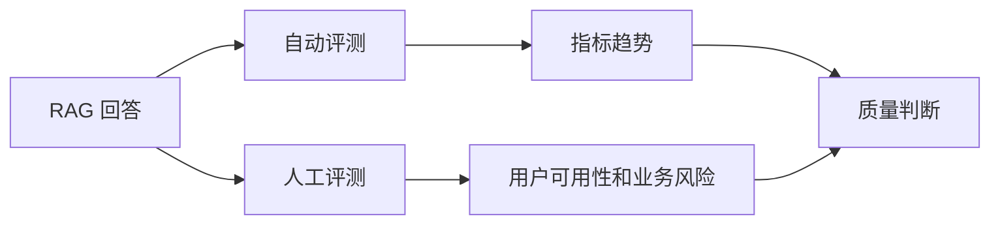
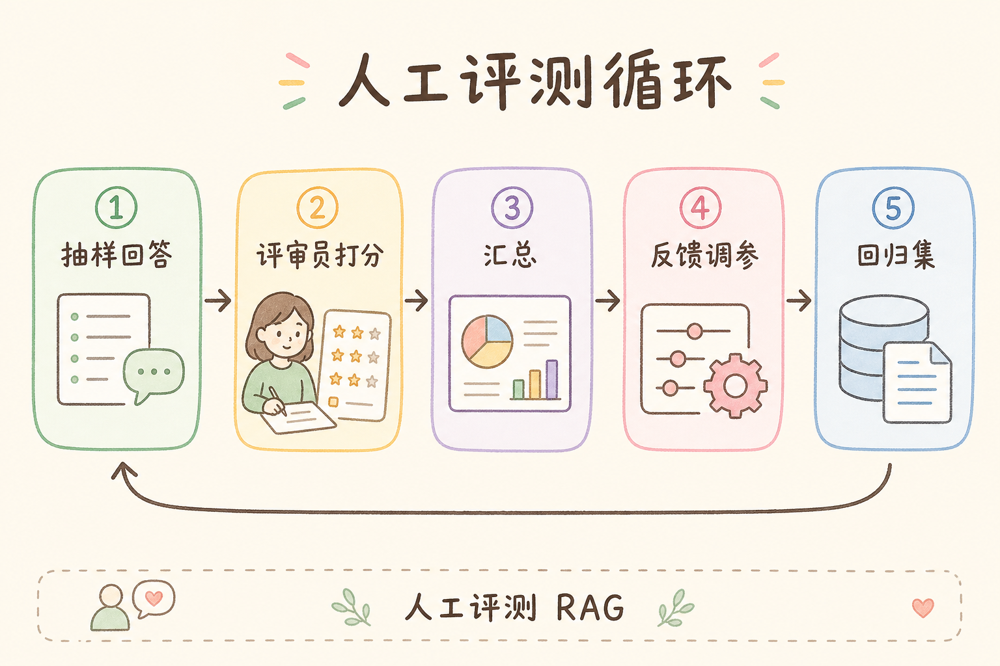
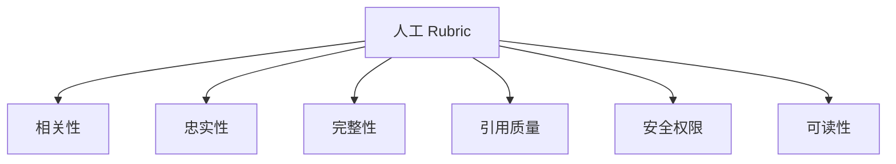
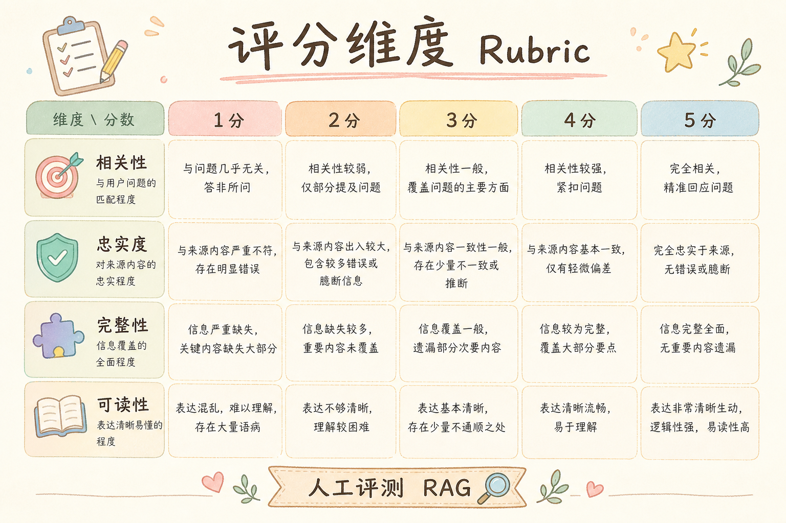
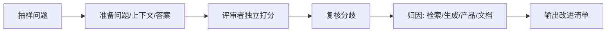
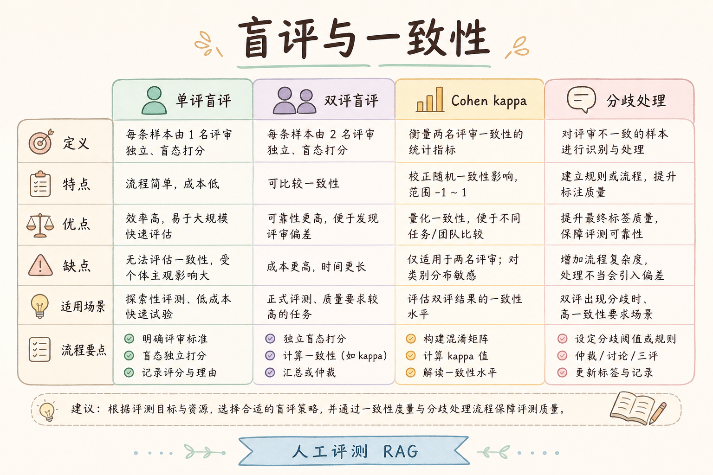
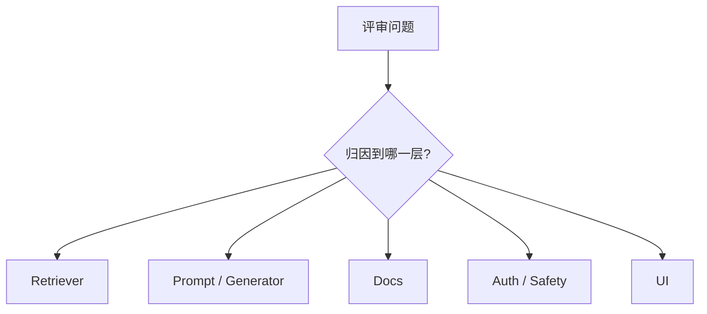

# E 评测与观测（十三）：RAG 人工评测流程入门指南

自动评测能快速发现趋势，但它不能替你完全判断用户体验。一个回答可能指标很高，用户仍然觉得“没答到点上”；也可能指标略低，但人工看起来可接受。**人工评测**要解决的是：用明确 Rubric 和流程，让人稳定地判断 RAG 答案质量，而不是凭感觉打分。

本文面向刚开始做 RAG 质量管理的读者。读完后，你应该能理解人工评测在 RAG 闭环中的位置，如何设计 Rubric，如何抽样、打分、复核，并把评测结论转成可执行改进项。

## 目录

- [1. 为什么自动分高仍可能不好用](#1-为什么自动分高仍可能不好用)
- [2. 人工评测是什么](#2-人工评测是什么)
- [3. Rubric：先定义评分标准](#3-rubric先定义评分标准)
- [4. 一次人工评测流程](#4-一次人工评测流程)
- [5. 最小评分表示例](#5-最小评分表示例)
- [6. 如何抽样和复核](#6-如何抽样和复核)
- [7. 如何把结论变成改进](#7-如何把结论变成改进)
- [8. 常见错误](#8-常见错误)
- [9. FAQ](#9-faq)
- [10. 总结](#10-总结)

## 1. 为什么自动分高仍可能不好用

自动指标通常只能覆盖某些维度，例如上下文是否相关、答案是否忠实、是否回应问题。但用户体验还包括语气、结构、可执行性、是否保留关键限制、是否让用户知道下一步该做什么。

例如用户问“索引失败后怎么办”，系统回答了失败原因，也引用了文档，但没有告诉用户“在哪里重试、如何查看失败原因”。自动分可能不低，用户仍然无法完成任务。

这张图说明：人工评测不是替代自动评测，而是补足自动指标看不到的质量维度。

## 2. 人工评测是什么

**人工评测**：让评审者按照统一评分规则检查问题、上下文、答案和引用。通俗说，就是把“我觉得好不好”改成“按这几个维度逐项判断”。

一次人工评测通常会看这些材料：

| 材料 | 用途 |
|---|---|
| 用户问题 | 判断意图和问题类型 |
| 检索上下文 | 判断资料是否足够 |
| 系统答案 | 判断回答质量 |
| 引用来源 | 判断结论是否可追溯 |
| 评审规则 | 保证多人标准一致 |

人工评测的重点是可复查。评审者不能只写“差”，而要指出差在哪里：漏证据、答偏、结构乱、越权、语气不合适，还是操作步骤不完整。

## 3. Rubric：先定义评分标准

**Rubric** 是评分量表。它规定每个维度看什么、怎么打分。没有 Rubric，评审者很容易按个人偏好打分。

建议从六个维度开始：

| 维度 | 判断问题 |
|---|---|
| 相关性 | 是否直接回答用户问题 |
| 忠实性 | 关键结论是否有上下文支持 |
| 完整性 | 是否覆盖必要步骤和限制 |
| 引用质量 | 引用是否存在、准确、可追溯 |
| 安全与权限 | 是否泄露不可见资料或越权建议 |
| 可读性 | 是否结构清楚、适合目标用户 |

每个维度建议用 1 到 5 分，另加一个“必须修复”标记，用于权限、安全、严重编造等高风险问题。

## 4. 一次人工评测流程

人工评测不要直接打开一堆答案随便看。更稳的流程是：抽样、脱敏、分配评审、独立打分、复核分歧、归因、形成改进项。

归因很重要。一个低分答案可能不是模型问题，而是文档缺失、检索漏召回、Prompt 没拒答、权限过滤错误或 UI 没展示引用。

## 5. 最小评分表示例

初学阶段可以先用表格记录，每行一条样本。

| 字段 | 示例 |
|---|---|
| sample_id | `eval-001` |
| question | “上传后为什么不能马上问答？” |
| relevancy_score | 4 |
| faithfulness_score | 5 |
| completeness_score | 3 |
| citation_score | 4 |
| safety_flag | `ok` |
| issue_type | `缺少用户下一步` |
| comment | “说明了原因，但没有告诉用户如何查看索引状态。” |

评分表要同时保存分数和文字原因。只有分数无法指导修复；只有评论又难以汇总趋势。

## 6. 如何抽样和复核

抽样要覆盖真实风险，而不是只挑容易评的样本。

| 样本类型 | 为什么要覆盖 |
|---|---|
| 高频问题 | 影响最多用户 |
| 低自动分问题 | 找明显问题 |
| 高自动分抽样 | 检查自动指标盲区 |
| 权限和拒答问题 | 防安全事故 |
| 新功能问题 | 验证新链路 |

复核可以用双人评分。若两个评审者分差很大，就把样本拿出来讨论，统一 Rubric。这样评测标准会越来越稳定。

## 7. 如何把结论变成改进

人工评测的最终产物不是报告，而是可执行改进项。建议把问题归因到具体层。

| 归因 | 典型修复 |
|---|---|
| 检索问题 | 调整切分、query rewriting、rerank |
| 生成问题 | 修改 Prompt、引用规则、拒答规则 |
| 文档问题 | 补充缺失资料、更新过期内容 |
| 安全问题 | 加权限过滤、后端校验 |
| UI 问题 | 更清楚展示状态、引用、错误 |

每条严重问题都应该进入回归测试集，避免修好后再次退步。

## 8. 常见错误

第一个错误是没有 Rubric，只让评审者写主观意见。这样结果很难比较，也难以复查。

第二个错误是只评答案，不看上下文。没有上下文就无法判断答案是否忠实，也无法判断问题来自检索还是生成。

第三个错误是只抽低分样本。高自动分样本也要抽查，否则发现不了自动指标盲区。

第四个错误是评完不归因。只知道“这条不好”，不知道该改文档、检索、Prompt 还是 UI。

## 9. FAQ

**Q：人工评测一次需要多少条？**  
初期 30 到 50 条就能发现很多问题。成熟后可以按风险和版本节奏扩大样本。

**Q：是否需要业务专家参与？**  
高风险领域需要。技术评审能看结构和证据，业务专家更能判断答案是否符合真实规则。

**Q：人工评分和自动评分冲突怎么办？**  
先检查样本和上下文。冲突本身很有价值，通常能暴露自动指标盲区或 Rubric 不清。

**Q：人工评测结果如何进入工程流程？**  
把严重问题转成 issue，加入回归集，并记录修复归因和验证方式。

## 10. 总结

人工评测让 RAG 质量判断从主观感觉变成可复查流程。它补足自动指标无法覆盖的用户体验、业务风险和操作可用性。

初学者可以先建立六维 Rubric，抽 30 条真实问题，保存分数和原因，再把严重问题归因到检索、生成、文档、安全或 UI。这样评测才能真正推动系统变好。
