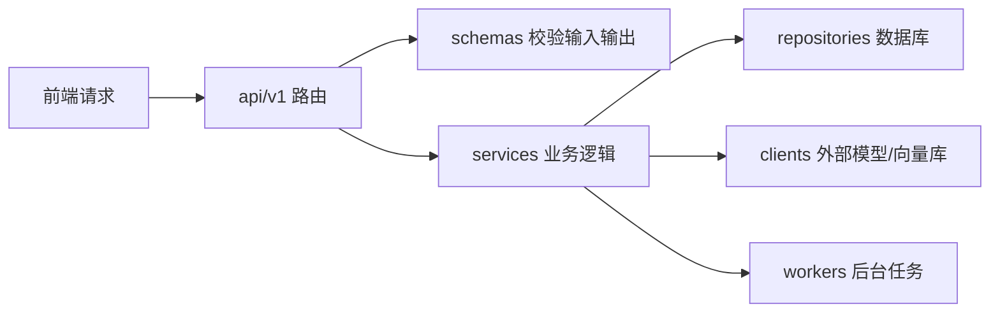
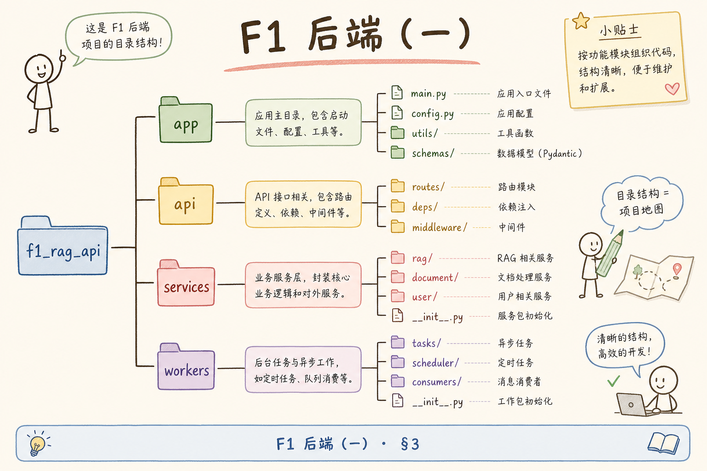
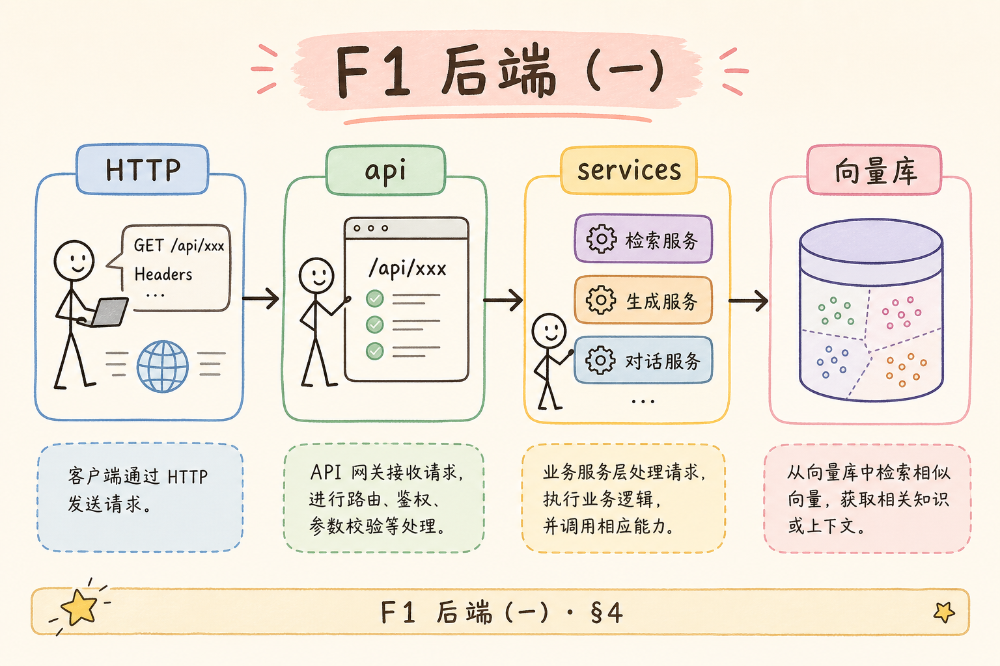
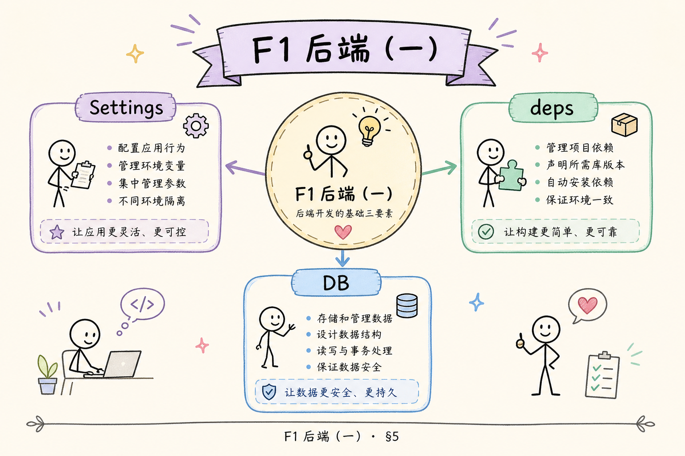
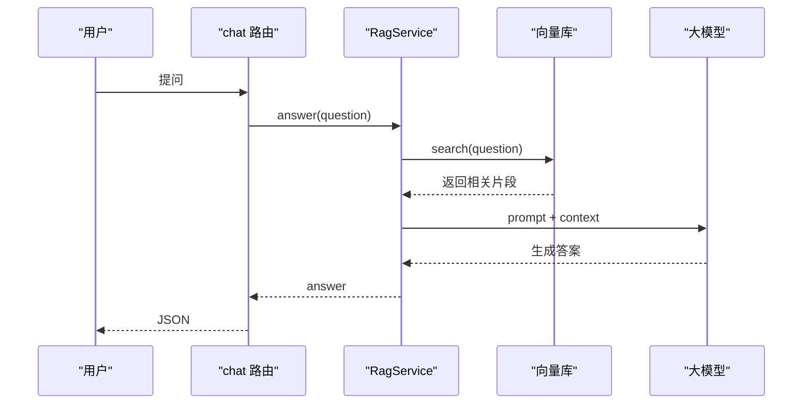
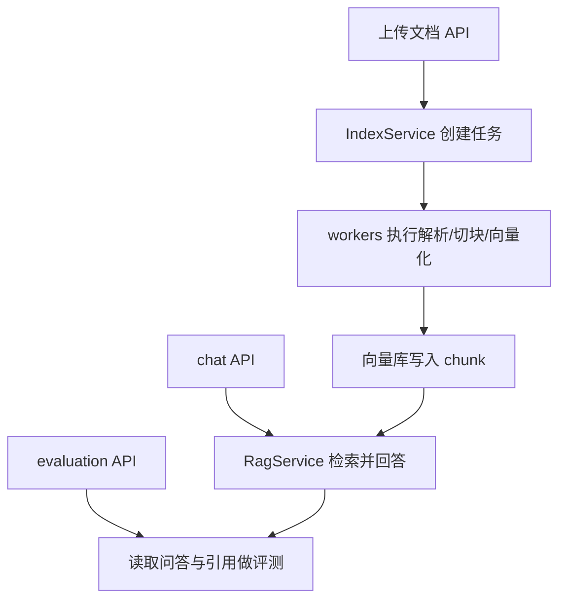

# F1 后端（一）：FastAPI RAG 项目结构完全指南

这篇讲的是：一个 RAG 后端项目应该怎样拆目录、放路由、放配置、放业务逻辑。初学者最容易犯的错，是把上传文件、切块、向量化、检索、生成答案都写进 `main.py`。一开始能跑，三天后就会变成谁也不敢改的“大文件”。

**FastAPI**：一个用 Python 写 Web API 的框架。
通俗说：它负责接收浏览器或前端发来的 HTTP 请求，再把结果用 JSON 返回。

**RAG**（Retrieval-Augmented Generation，检索增强生成）：先从知识库找资料，再让大模型基于资料回答。
通俗说：它不是让模型凭记忆答题，而是先翻资料再开口。

读完本文，你应该能搭出一个可继续扩展的 FastAPI RAG 后端骨架：路由清楚、配置集中、业务逻辑可测试、后续能接上传、索引任务、检索和评测。

## 目录

- [1. 为什么不能只写一个 main.py](#1-为什么不能只写一个-mainpy)
- [2. 本文边界与目标](#2-本文边界与目标)
- [3. 推荐目录结构](#3-推荐目录结构)
- [4. 请求从哪里进来](#4-请求从哪里进来)
- [5. 配置与依赖注入](#5-配置与依赖注入)
- [6. services 放什么](#6-services-放什么)
- [7. 与索引和评测模块如何连接](#7-与索引和评测模块如何连接)
- [8. 最小可运行骨架](#8-最小可运行骨架)
- [9. 常见错误](#9-常见错误)
- [10. FAQ](#10-faq)
- [11. 总结与下一步](#11-总结与下一步)

## 1. 为什么不能只写一个 main.py

RAG 项目的后端通常会同时处理四类事情：对外提供 API、接收上传文件、触发后台索引任务、调用检索与生成服务。把它们写进一个文件，会让每次修改都很危险，因为你无法判断改一个接口会不会影响另一个接口。

下面这张图展示了一个请求在后端里的基本路径。读图时重点看：API 层只负责接请求和返回结果，真正的业务逻辑放在 service 层，外部系统通过 client 或 repository 访问。



这张图的结论很简单：路由不要变成业务仓库。路由越薄，后面做测试、换数据库、换向量库时越轻松。

## 2. 本文边界与目标

本文只讲 FastAPI 后端的项目结构，不展开讲具体的向量库、Embedding 模型、Celery 队列或前端页面。那些模块后续可以接进来，但结构要先留好位置。

| 你要完成的能力 | 本文覆盖方式 |
|---|---|
| 知道文件该放哪里 | 给出推荐目录树 |
| 知道路由和业务如何分离 | 用 `api` 与 `services` 拆层 |
| 知道配置如何管理 | 用 `settings` 集中读取环境变量 |
| 知道怎么继续扩展 RAG | 预留 retriever、index task、evaluation 接口 |

环境要求：Python 3.10+，安装 `fastapi` 与 `uvicorn`。如果只是理解结构，可以先不连接真实数据库和向量库。

## 3. 推荐目录结构

初学者可以先从下面这个结构开始。它不是唯一答案，但足够支撑一个从 PoC 走向真实项目的 RAG 后端。



```text
app/
  main.py
  api/
    v1/
      chat.py
      index_tasks.py
  core/
    config.py
    dependencies.py
  schemas/
    chat.py
    index_task.py
  services/
    rag_service.py
    index_service.py
  repositories/
    document_repository.py
  clients/
    vector_store.py
    llm_client.py
  workers/
    tasks.py
tests/
  test_chat_api.py
```

**schema**：接口输入输出的数据结构。
通俗说：它像表单校验规则，告诉后端“前端必须传什么、后端会回什么”。

**service**：业务逻辑层。
通俗说：它负责真正做事，例如“拿问题去检索资料，再组织 prompt 调模型”。

**repository**：数据访问层。
通俗说：它负责和数据库打交道，让 service 不需要关心 SQL 或 ORM 细节。

## 4. 请求从哪里进来

FastAPI 的入口通常是 `app/main.py`。入口文件只做三件事：创建应用、挂载路由、配置全局中间件。不要在这里写检索逻辑。



下面这段代码演示最小入口。它需要 `fastapi`，运行后会把 `/api/v1/chat` 这类路由挂进应用。

```python
# app/main.py
from fastapi import FastAPI

from app.api.v1 import chat, index_tasks

app = FastAPI(title="RAG Backend")

app.include_router(chat.router, prefix="/api/v1", tags=["chat"])
app.include_router(index_tasks.router, prefix="/api/v1", tags=["index"])


@app.get("/health")
def health():
    return {"status": "ok"}
```

`include_router` 的作用，是把分散在多个文件里的接口统一挂到应用上。这样新增“上传文件”“查询任务状态”时，不需要继续把 `main.py` 写大。

一个聊天路由可以这样写：

```python
# app/api/v1/chat.py
from fastapi import APIRouter, Depends

from app.core.dependencies import get_rag_service
from app.schemas.chat import ChatRequest, ChatResponse
from app.services.rag_service import RagService

router = APIRouter()


@router.post("/chat", response_model=ChatResponse)
def chat(req: ChatRequest, service: RagService = Depends(get_rag_service)):
    answer = service.answer(req.question)
    return ChatResponse(answer=answer)
```

注意这里的路由没有直接连向量库，也没有拼 prompt。它只是把请求交给 `RagService`。这就是“薄路由”的核心。

## 5. 配置与依赖注入

**依赖注入**（Dependency Injection）：把对象的创建交给统一入口，而不是在每个函数里手动创建。


通俗说：别在每个房间都造一个水龙头厂，而是统一接自来水管。

配置建议集中在 `core/config.py`。下面的示例用普通类演示，真实项目可换成 `pydantic-settings`。

```python
# app/core/config.py
import os


class Settings:
    llm_model: str = os.getenv("LLM_MODEL", "gpt-4.1-mini")
    vector_store_url: str = os.getenv("VECTOR_STORE_URL", "http://localhost:6333")


settings = Settings()
```

依赖放在 `core/dependencies.py`：

```python
# app/core/dependencies.py
from app.clients.llm_client import LlmClient
from app.clients.vector_store import VectorStore
from app.core.config import settings
from app.services.rag_service import RagService


def get_rag_service() -> RagService:
    vector_store = VectorStore(settings.vector_store_url)
    llm = LlmClient(settings.llm_model)
    return RagService(vector_store=vector_store, llm=llm)
```

这样做的好处是：测试时可以替换 `RagService`，生产时可以换真实模型，路由代码不用改。

## 6. services 放什么

`services` 放业务规则，不放 HTTP 细节。一个 RAG service 通常做四步：接收问题、检索资料、组装上下文、调用模型。



读这张图时，重点看 `RagService` 是中间调度者。它不应该知道 HTTP Header，也不应该直接读取请求体；这些属于 API 层。

下面是一个最小 service 形状：

```python
# app/services/rag_service.py
class RagService:
    def __init__(self, vector_store, llm):
        self.vector_store = vector_store
        self.llm = llm

    def answer(self, question: str) -> str:
        chunks = self.vector_store.search(question, top_k=5)
        context = "\n\n".join(chunk["text"] for chunk in chunks)
        prompt = f"基于资料回答问题。\n资料：{context}\n问题：{question}"
        return self.llm.complete(prompt)
```

这个示例没有处理鉴权、引用、流式输出和错误重试，但它已经说明了分层方向：API 调 service，service 调 client。

## 7. 与索引和评测模块如何连接

RAG 后端不是只有 `/chat`。真实项目还需要上传文档、查询索引任务、跑评测、看 bad case。项目结构要提前给这些能力留接口。



这张图说明：索引、问答、评测是三条不同路径，但共享同一批文档和 chunk。目录分层清楚之后，后续新增功能不会互相污染。

## 8. 最小可运行骨架

如果你想先跑起来，可以用下面的步骤。代码块前置条件：当前目录存在 `app/`，并已安装依赖。

```bash
pip install fastapi uvicorn
uvicorn app.main:app --reload
```

预期行为：访问 `http://127.0.0.1:8000/health`，返回：

```json
{"status": "ok"}
```

再补两个 schema：

```python
# app/schemas/chat.py
from pydantic import BaseModel


class ChatRequest(BaseModel):
    question: str


class ChatResponse(BaseModel):
    answer: str
```

如果还没有真实向量库和模型，可以先写 fake client。这样初学者能先验证分层，而不是卡在外部服务配置上。

```python
# app/clients/vector_store.py
class VectorStore:
    def __init__(self, url: str):
        self.url = url

    def search(self, question: str, top_k: int):
        return [{"text": "FastAPI 项目应把路由、配置、业务逻辑分开。"}]
```

```python
# app/clients/llm_client.py
class LlmClient:
    def __init__(self, model: str):
        self.model = model

    def complete(self, prompt: str) -> str:
        return "建议使用 api、core、schemas、services、clients 分层。"
```

这套 fake 实现不是生产代码，但能帮助你确认：路由、service、client 的调用链已经通了。

## 9. 常见错误

这一节把初学者最容易踩的结构问题集中列出来。判断标准不是“目录是否看起来专业”，而是改功能、写测试、换外部服务时是否仍然清楚。

### 9.1 把业务写进路由

错误写法是：`chat.py` 里直接查向量库、拼 prompt、调模型。短期看少写文件，长期看所有接口都难测。

正确做法：路由只处理 HTTP 输入输出，业务放 `RagService`。

### 9.2 配置散落在各处

如果每个文件都 `os.getenv("API_KEY")`，将来排查环境变量会很痛苦。配置应该集中读取，再通过依赖传给 service 或 client。

### 9.3 目录拆得太早太碎

分层不是为了显得“企业级”。如果项目只有一个 demo，不需要一开始就拆十几层。本文推荐结构适合会继续扩展的 RAG 产品。

### 9.4 service 直接依赖 FastAPI Request

一旦 service 依赖 `Request`，它就很难脱离 Web 环境测试。业务层应该接收普通参数，例如 `question: str`、`user_id: str`。

## 10. FAQ

**Q1：为什么不把所有接口放在一个 `routes.py`？**


可以，但当接口超过 5-8 个时，按业务拆成 `chat.py`、`index_tasks.py` 更清楚。

**Q2：`services` 和 `clients` 的区别是什么？**

`services` 写你的业务规则；`clients` 负责调用外部系统，例如模型 API、向量数据库、对象存储。

**Q3：什么时候需要 `workers/`？**

当一个任务不能在一次 HTTP 请求里快速完成时，例如解析 200 页 PDF、批量向量化，就应该放到后台 worker。

**Q4：测试从哪里开始？**

先测 service，因为它包含业务规则；再测 API，确认请求和响应格式正确。

## 11. 总结与下一步

FastAPI RAG 后端的关键不是目录名字多漂亮，而是责任边界清楚：`api` 接请求，`schemas` 定格式，`services` 写业务，`clients` 访问外部服务，`workers` 处理耗时任务。

下一篇可以继续接上传接口、后台任务或索引状态机。只要本文的骨架搭好，后续每加一个功能，都能放到相对明确的位置。
