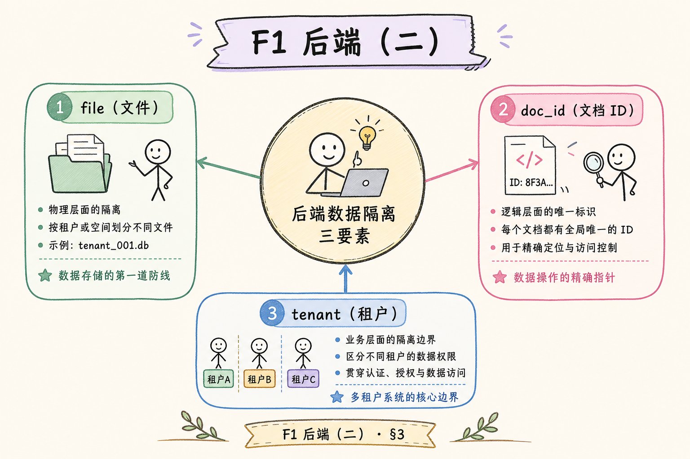
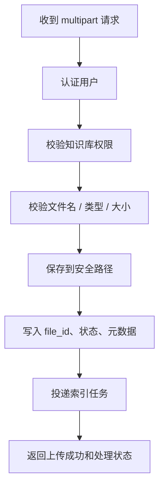
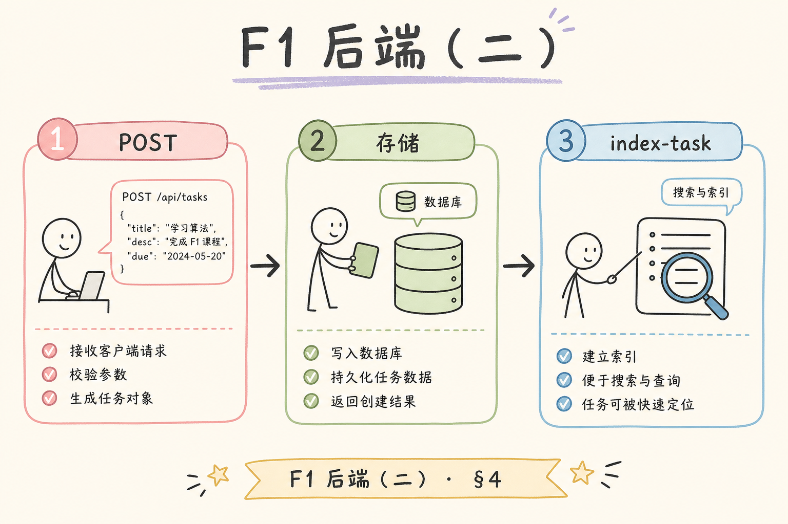
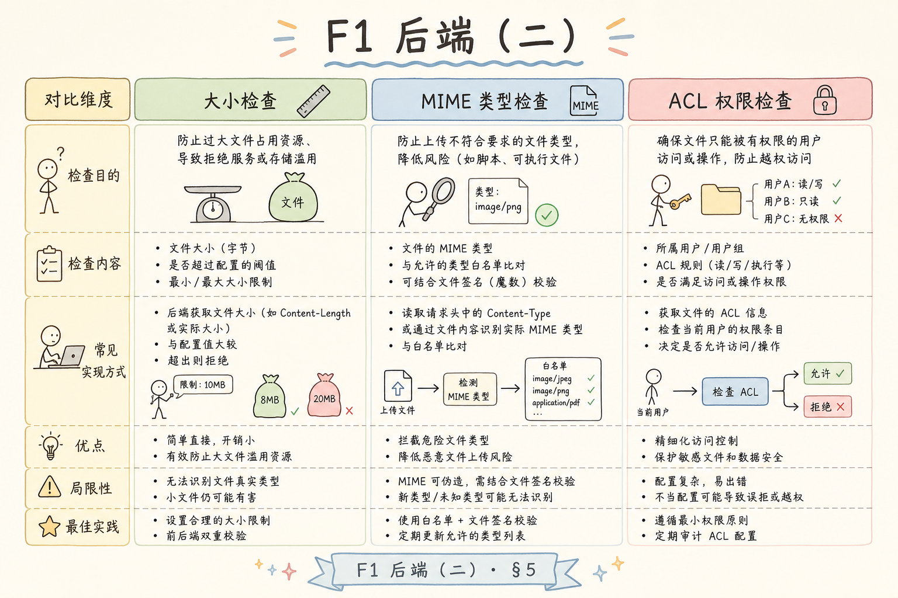
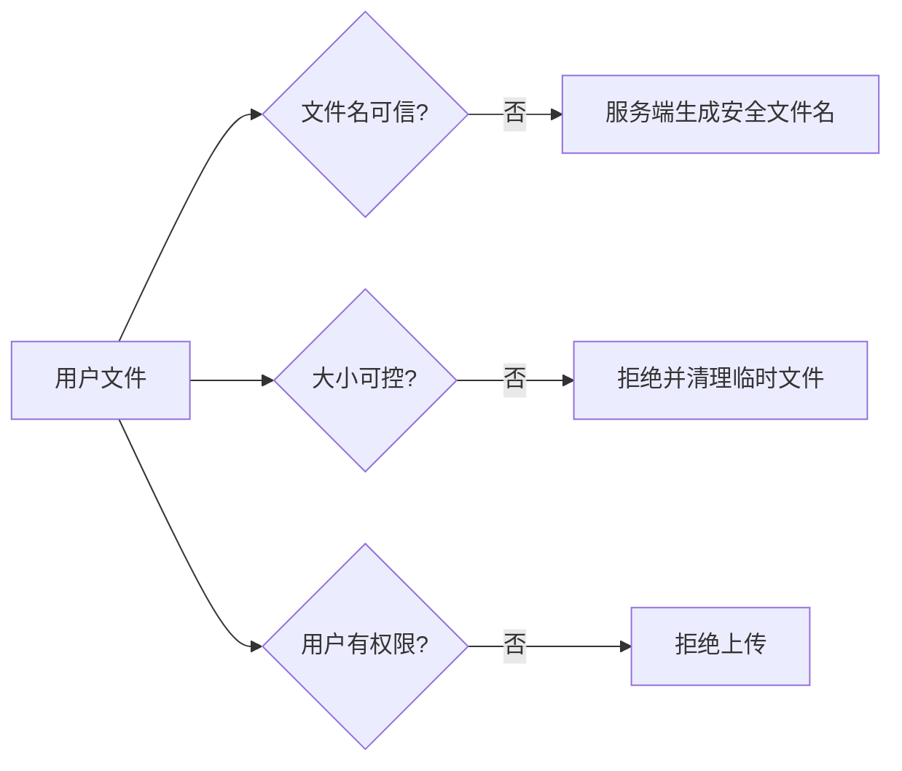
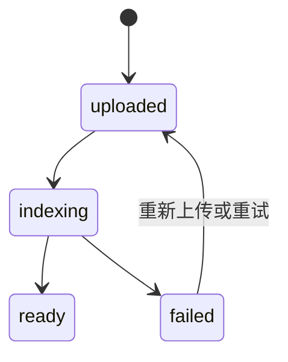
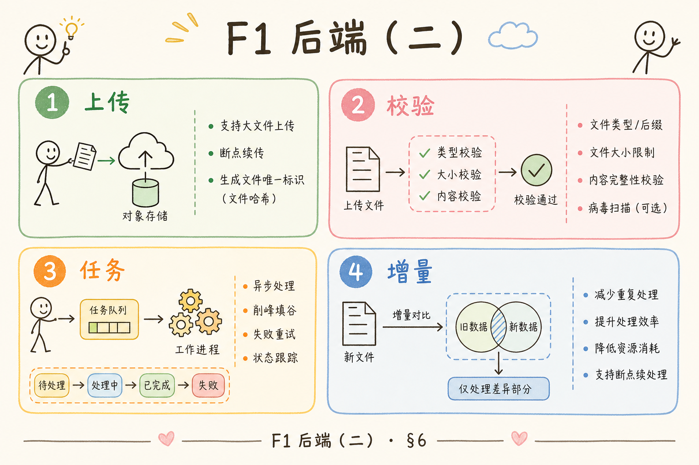

# F1 后端（二）：RAG 文件上传 multipart 入门指南

很多 RAG 产品都有“上传资料”的按钮。初学者容易以为上传就是把文件丢进知识库，但实际流程要分开看：上传只负责安全接收文件，索引负责解析、切分、向量化和入库。把这两件事混在一起，接口会变慢，也更容易留下安全问题。

本文面向刚开始写后端 API 的读者。读完后，你应该能理解 multipart 是什么，FastAPI 里如何接收上传文件，为什么要做大小、类型和文件名校验，并能搭出一个“上传后进入待索引队列”的最小流程。

## 目录

- [1. 上传不是索引](#1-上传不是索引)
- [2. multipart 是什么](#2-multipart-是什么)
- [3. 上传接口的完整流程](#3-上传接口的完整流程)
- [4. FastAPI 最小示例](#4-fastapi-最小示例)
- [5. 文件校验与安全](#5-文件校验与安全)
- [6. 上传后如何进入 RAG 管道](#6-上传后如何进入-rag-管道)
- [7. 错误处理和前端反馈](#7-错误处理和前端反馈)
- [8. 常见错误](#8-常见错误)
- [9. FAQ](#9-faq)
- [10. 总结](#10-总结)

## 1. 上传不是索引

**上传**是把文件从用户浏览器传到后端。**索引**是把文件变成可检索资料：解析文本、清洗、切分、生成向量、写入 VectorStore。这两步应该解耦。

如果上传接口里直接做索引，用户会长时间等待；文件解析失败时也很难恢复；多个大文件同时上传时，接口可能被拖垮。更稳妥的做法是：上传成功后保存文件和元数据，再交给后台任务处理。


这张图的重点是职责分离。上传接口只承诺“安全接收并登记”，不承诺“立刻可问答”。

## 2. multipart 是什么

**multipart/form-data** 是浏览器上传文件时常用的请求格式。通俗说，它把一个表单拆成多个部分：一部分是文件，一部分可以是普通字段，例如知识库 ID、标签、描述。

一个上传请求大致包含这些内容：

| 部分 | 示例 | 用途 |
|---|---|---|
| file | `handbook.pdf` | 用户上传的文件 |
| knowledge_base_id | `kb_123` | 文件要进入哪个知识库 |
| tags | `["policy"]` | 后续过滤或管理 |

后端框架会帮你解析 multipart。你需要关注的是：文件从哪里读、读多少、保存到哪里、哪些字段可信。

## 3. 上传接口的完整流程

一个稳妥的上传流程至少包括身份校验、参数校验、文件校验、保存文件、记录元数据、触发索引任务。





这个流程里，权限校验应该发生在保存前。否则用户可能把文件上传到没有权限的知识库，即使后面索引失败，也已经造成数据污染。

## 4. FastAPI 最小示例

下面是一个最小 FastAPI 上传接口。它演示如何接收 `UploadFile`，限制大小，并保存到本地目录。



运行环境：Python 3.10+，安装依赖：

```bash
pip install fastapi uvicorn python-multipart
```

示例代码：

```python
from pathlib import Path
from uuid import uuid4

from fastapi import FastAPI, File, Form, HTTPException, UploadFile

app = FastAPI()
UPLOAD_DIR = Path("uploads")
UPLOAD_DIR.mkdir(exist_ok=True)
MAX_BYTES = 5 * 1024 * 1024
ALLOWED_SUFFIXES = {".md", ".txt", ".pdf"}


@app.post("/files")
async def upload_file(
    knowledge_base_id: str = Form(...),
    file: UploadFile = File(...),
):
    suffix = Path(file.filename or "").suffix.lower()
    if suffix not in ALLOWED_SUFFIXES:
        raise HTTPException(status_code=400, detail="不支持的文件类型")

    file_id = uuid4().hex
    target = UPLOAD_DIR / f"{file_id}{suffix}"
    size = 0

    with target.open("wb") as out:
        while chunk := await file.read(1024 * 1024):
            size += len(chunk)
            if size > MAX_BYTES:
                target.unlink(missing_ok=True)
                raise HTTPException(status_code=413, detail="文件过大")
            out.write(chunk)

    return {
        "file_id": file_id,
        "knowledge_base_id": knowledge_base_id,
        "status": "uploaded",
    }
```

这段代码有两个关键点：不要一次性把大文件全部读进内存；保存文件时不要直接使用用户提供的原始文件名。

## 5. 文件校验与安全

上传接口是攻击面。即使是内部系统，也不能相信文件名、扩展名和前端传来的大小。

| 风险 | 例子 | 应对 |
|---|---|---|
| 路径穿越 | 文件名包含 `../` | 服务端生成文件名 |
| 超大文件 | 上传占满磁盘 | 流式读取并限制大小 |
| 类型伪装 | `.pdf` 实际是脚本 | 扩展名 + 内容类型 + 解析阶段校验 |
| 越权上传 | 传到别人的知识库 | 检查用户与知识库归属 |
| 重复上传 | 同文件多次入库 | 计算哈希并去重 |





安全校验不要只写在前端。前端限制是体验优化，后端限制才是边界。

## 6. 上传后如何进入 RAG 管道

上传成功后，建议把文件状态记录为 `uploaded`，再由后台任务改成 `indexing`、`ready` 或 `failed`。

| 状态 | 含义 | 用户界面可以显示 |
|---|---|---|
| `uploaded` | 文件已保存，尚未处理 | “已上传，等待处理” |
| `indexing` | 正在解析和入库 | “处理中” |
| `ready` | 可被检索 | “可问答” |
| `failed` | 处理失败 | “处理失败，请查看原因” |



把状态讲清楚，用户就不会误以为“上传成功”等于“马上能问”。这对 RAG 产品体验很重要。

## 7. 错误处理和前端反馈

上传失败时，后端应该返回可理解的错误，而不是只返回 500。常见错误包括文件太大、类型不支持、没有权限、知识库不存在。

| HTTP 状态 | 场景 |
|---|---|
| 400 | 文件类型不支持、参数缺失 |
| 401 | 未登录 |
| 403 | 没有知识库权限 |
| 413 | 文件太大 |
| 500 | 服务端未知错误 |

前端也要区分“上传失败”和“索引失败”。上传失败表示文件没保存成功；索引失败表示文件已保存，但解析或入库出错。

## 8. 常见错误

第一个错误是直接用原始文件名保存。用户文件名可能重复，也可能包含危险路径。服务端应生成唯一安全文件名，原始文件名只作为 metadata 保存。



第二个错误是上传接口里同步跑完整索引。大文件解析、embedding 调用和向量库写入都可能很慢，应该放到后台任务。

第三个错误是只检查扩展名。扩展名可以伪造，解析阶段还要处理格式错误和恶意内容。

第四个错误是没有状态表。没有 `uploaded/indexing/ready/failed`，用户和开发者都很难知道文件卡在哪一步。

## 9. FAQ

**Q：为什么 FastAPI 上传需要 `python-multipart`？**  
FastAPI 解析 `multipart/form-data` 需要这个依赖。缺少它时，文件表单无法正常解析。

**Q：上传后可以马上返回答案吗？**  
不建议。除非文件很小且处理很快，否则应先返回上传状态，让后台索引完成后再允许问答。

**Q：文件应该存本地还是对象存储？**  
学习阶段本地目录足够。生产环境通常会使用对象存储，并把路径、哈希、状态写入数据库。

**Q：用户上传的 PDF 解析失败怎么办？**  
记录失败原因，把状态置为 `failed`，给用户可读提示。不要静默跳过，也不要生成基于空内容的知识库。

## 10. 总结

multipart 上传解决的是“安全接收文件”，不是“完成 RAG 索引”。一个可靠流程应先保存原始文件和元数据，再用后台任务解析、切分、向量化和入库。

初学者实现时抓住四条线：后端校验权限和大小、服务端生成文件名、上传与索引解耦、用状态机反馈处理进度。这样文件上传才能成为 RAG 管道的稳定入口。
