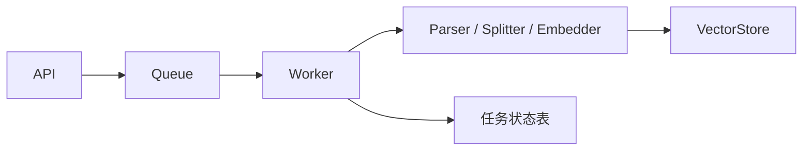
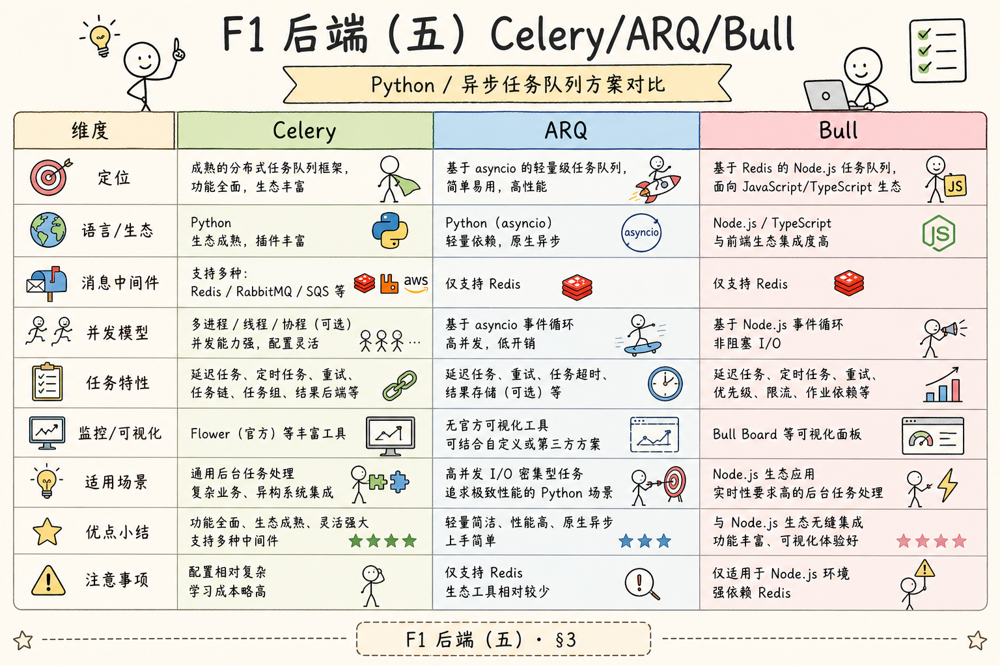
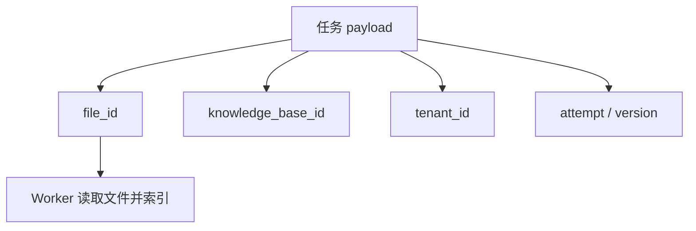
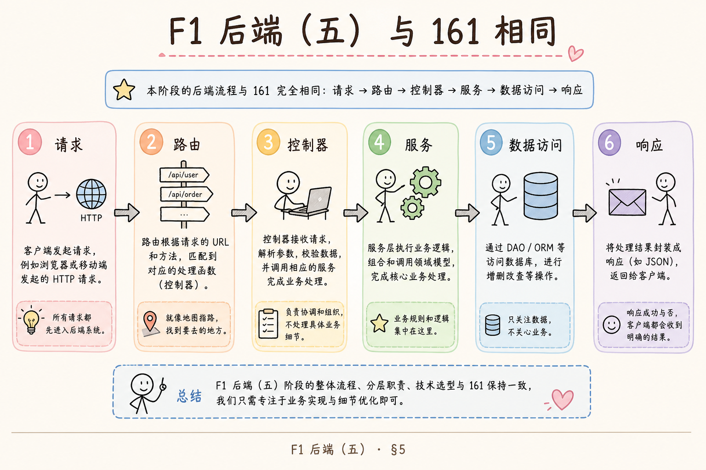
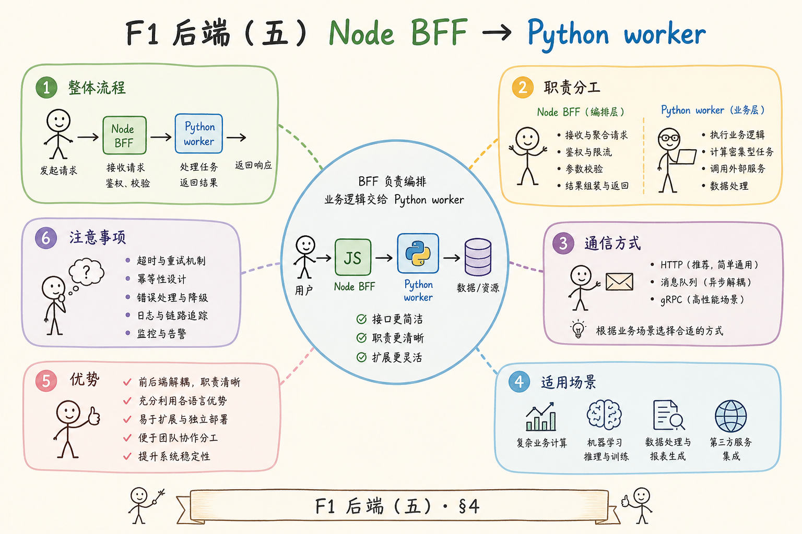
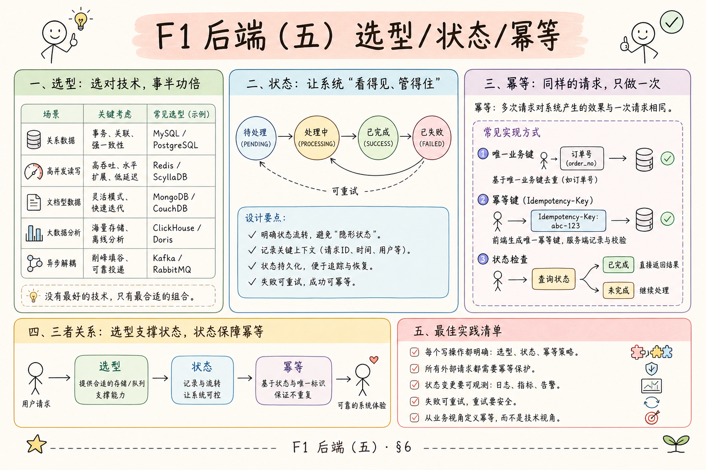
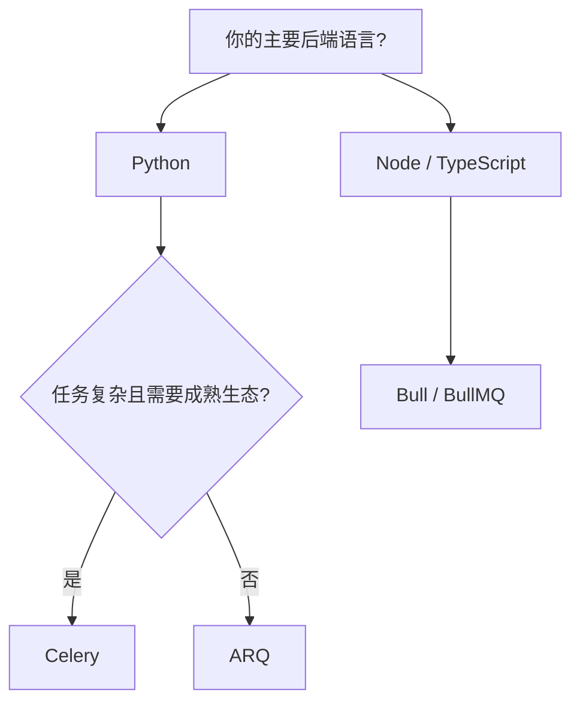
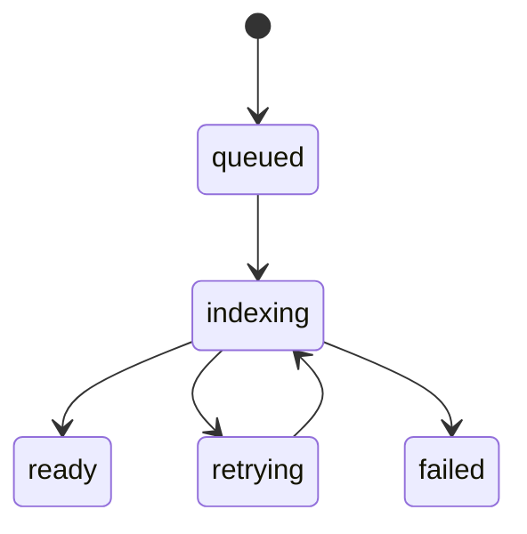
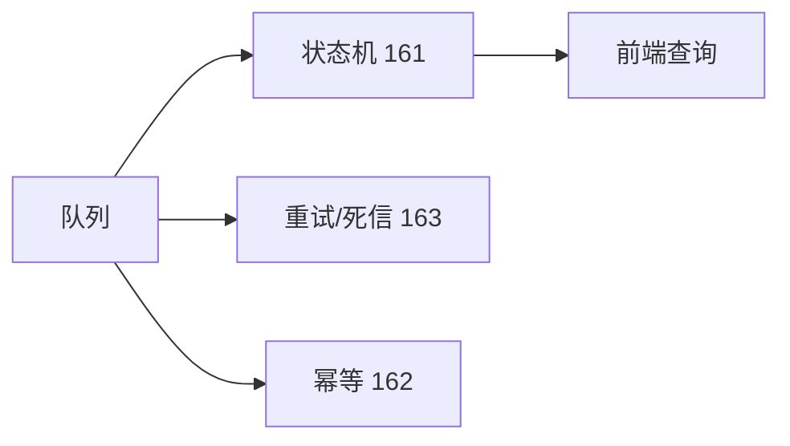

# F1 后端（五）：Bull / ARQ / Node 队列入门指南

> Celery 不是唯一答案。TypeScript 后端常用 **Bull/BullMQ**；已是 async Python 的团队可能更愿用 **ARQ**。队列工具可以换，但 RAG 任务模型——入队 ID、worker 索引、状态写回——不变。

RAG 后台任务不一定只用 Python。前端团队熟悉 Node.js，后端也可能使用 TypeScript；也有团队希望用更轻量的 Python 异步队列。Bull 和 ARQ 都属于任务队列方案：它们把耗时任务从请求里拆出来，让 worker 异步处理。

本文面向初学者。读完后，你应该能理解 Bull、ARQ 这类队列解决什么问题，它们和 Celery 的区别，RAG 索引任务如何抽象成队列任务，以及选择方案时应该看哪些条件。落地时仍要配合 [161 状态机](161.index-task-state-machine-tutorial.md)、[162 幂等](162.idempotent-reindex-tutorial.md)、[163 重试](163.retry-dead-letter-tutorial.md)。

## 目录

- [1. 为什么要了解不同队列](#1-为什么要了解不同队列)
- [2. Bull、ARQ、Celery 分别是什么](#2-bullarqcelery-分别是什么)
- [3. RAG 任务模型怎么抽象](#3-rag-任务模型怎么抽象)
- [4. Bull 的最小形状](#4-bull-的最小形状)
- [5. ARQ 的最小形状](#5-arq-的最小形状)
- [6. 如何选择队列方案](#6-如何选择队列方案)
- [7. 状态、重试和幂等仍然重要](#7-状态重试和幂等仍然重要)
- [8. 常见错误](#8-常见错误)
- [9. FAQ](#9-faq)
- [10. 总结](#10-总结)

## 1. 为什么要了解不同队列

队列不是单一技术。Celery 常见于 Python 后端；Bull 常见于 Node.js / TypeScript；ARQ 是 Python 异步生态中的轻量方案。选择哪个，取决于团队技术栈、任务复杂度、部署方式和可靠性要求。

RAG 索引任务的核心模型相同：API 创建任务，队列保存任务，worker 执行任务，状态写回数据库。



不管使用哪种队列，这条主线都不会变。

### 1.1 技术栈驱动的现实选择

| 团队现状 | 常见倾向 | 说明 |
|----------|----------|------|
| FastAPI + 纯 Python | Celery 或 ARQ | 见 [159](159.celery-async-queue-tutorial.md) |
| NestJS / Express BFF | BullMQ | 与 TS 类型、前端 monorepo 一致 |
| Python API + Node 微服务 | 按服务边界选 | 索引服务用什么语言，队列跟什么语言 |
| 全栈初创、人数少 | 先统一一种 | 减少运维面 |

选队列首先是**组织成本**，其次才是 benchmark。

### 1.2 与 158、159 的衔接

[158](158.fastapi-background-tasks-tutorial.md) 是进程内后台；[159](159.celery-async-queue-tutorial.md) 是 Python 重型队列。本篇说明：**同一套 RAG 任务抽象**可以落在 Bull 或 ARQ 上，避免“为了 Celery 硬拆 Node 服务”或“在 TS 项目里硬塞 Python worker”。

## 2. Bull、ARQ、Celery 分别是什么

先用一张表建立直觉。

| 工具 | 语言生态 | 常见后端 | 适合场景 |
|---|---|---|---|
| Celery | Python | Redis / RabbitMQ | 成熟 Python 后台任务 |
| Bull | Node.js / TypeScript | Redis | Node 项目中的可靠队列 |
| ARQ | Python async | Redis | 轻量异步 Python worker |

**Bull** 适合 TypeScript 项目，和 Redis 配合常见。**ARQ** 适合已经使用 async Python 的项目。**Celery** 生态成熟，适合复杂任务和较多运维经验的团队。

### 2.1 能力维度对比（粗览）

| 维度 | Celery | BullMQ | ARQ |
|------|--------|--------|-----|
| 成熟度 / 资料 | 高 | 中高 | 中 |
| 定时任务 | Beat | 需配合 | 有限 |
| async 原生 | 需适配 | Promise | 原生 async |
| 多队列 / 优先级 | 强 | 强 | 够用 |
| 运维工具 | Flower 等 | Bull Board 等 | 较简 |

没有“绝对最好”，只有与团队和任务规模匹配。

### 2.2 Redis 作为共同 Broker

三者学习阶段都常配 Redis。注意：**Redis 做 Broker 时要开持久化策略**（AOF/RDB），并监控内存。RAG 消息体应保持小（仅 ID），否则 Redis 成为第二份文件存储。

## 3. RAG 任务模型怎么抽象

无论队列工具是什么，RAG 索引任务都可以抽象成同一份 payload。

```json
{
  "task_type": "index_file",
  "file_id": "file_123",
  "knowledge_base_id": "kb_001",
  "tenant_id": "tenant_a",
  "attempt": 1
}
```

payload 不要塞大文件内容。队列里放 ID 和参数，worker 根据 ID 去对象存储或数据库读取文件。





这样任务消息更小，也更容易重试和排查。

### 3.1 可扩展字段（不改变上面 JSON 示例）

生产可在**业务表**中额外记录，而不必全部塞进队列消息：`content_hash`、`splitter_version`、`embedding_model`、`trace_id`。队列消息保持小而稳，详情以 DB 为准。

### 3.2 任务类型枚举

除 `index_file` 外，常见还有：

| `task_type` | 用途 |
|-------------|------|
| `reindex_file` | 同文件新版本重建 |
| `delete_file_index` | 删向量 |
| `reindex_kb` | 知识库级批任务 |

每种类型对应独立 worker 函数或队列，便于限流与监控。

## 4. Bull 的最小形状

Bull 是 Node.js 常用队列库。下面是一个概念示例，展示生产者和消费者的形状。





安装依赖：

```bash
npm install bullmq ioredis
```

生产者：

```ts
import { Queue } from "bullmq";

const queue = new Queue("rag-index", {
  connection: { host: "localhost", port: 6379 },
});

await queue.add("index_file", {
  fileId: "file_123",
  knowledgeBaseId: "kb_001",
});
```

Worker：

```ts
import { Worker } from "bullmq";

const worker = new Worker(
  "rag-index",
  async (job) => {
    const { fileId, knowledgeBaseId } = job.data;
    console.log("indexing", fileId, knowledgeBaseId);
  },
  { connection: { host: "localhost", port: 6379 } }
);
```

这段代码的核心是：API 负责 `queue.add`，worker 负责处理 job。

### 4.1 BullMQ 里的重试（概念）

BullMQ 可在 `queue.add` 时配置 `attempts`、`backoff`（指数退避）。与 [163](163.retry-dead-letter-tutorial.md) 一致：临时错误重试，永久错误 `failed` 或进 failed set。业务侧仍要写 [161](161.index-task-state-machine-tutorial.md) 状态表，不能只信 job 内部状态。

### 4.2 BFF 模式

许多团队用 Node 做 BFF：上传接口在 Nest/Express，索引 worker 同栈消费 `rag-index` 队列，Python 仅负责 embedding 微服务。上图 **BFF 模式**即 API 与 worker 语言一致，跨语言调用放在 HTTP/gRPC 层而非队列里塞二进制。

## 5. ARQ 的最小形状

ARQ 是 Python async 风格的 Redis 队列。它比 Celery 轻，适合已经使用 async/await 的项目。

安装依赖：

```bash
pip install arq
```

任务函数：

```python
async def index_file(ctx, file_id: str, knowledge_base_id: str):
    print("indexing", file_id, knowledge_base_id)
    return {"status": "ready"}


class WorkerSettings:
    functions = [index_file]
```

入队：

```python
from arq import create_pool
from arq.connections import RedisSettings


async def enqueue():
    redis = await create_pool(RedisSettings())
    await redis.enqueue_job("index_file", "file_123", "kb_001")
```

启动 worker：

```bash
arq tasks.WorkerSettings
```

ARQ 的优势是写法贴近 async Python；缺点是生态和成熟度通常不如 Celery 广。

### 5.1 何时选 ARQ 而非 Celery

- 整个栈已是 `async def` 路由 + `httpx` + `asyncpg`  
- 任务类型少，不需要 Beat / 复杂路由  
- 团队愿接受较小社区与较少开箱运维工具  

一旦需要多队列、复杂定时、大量运维 playbook，仍建议 [159 Celery](159.celery-async-queue-tutorial.md)。

### 5.2 ARQ 与 FastAPI 共存

FastAPI 路由里 `await enqueue()` 入队；独立进程 `arq tasks.WorkerSettings` 消费。与 Celery 的 `delay()` 对称，但全程 async，无需在 worker 里再包一层 `asyncio.run`。

## 6. 如何选择队列方案

选择队列时，不要只看工具热度。先看团队和任务要求。

| 条件 | 倾向选择 |
|---|---|
| Python 项目、复杂后台任务 | Celery |
| TypeScript / Node 后端 | Bull |
| Python async 项目、轻量任务 | ARQ |
| 需要成熟运维经验 | Celery 或 Bull |
| 只是本地学习 | 任一轻量方案即可 |





工具选择只是开始。状态机、重试、幂等和观测才决定系统是否可靠。

### 6.1 决策清单（上线前自问）

1. 团队主要维护语言是？  
2. 是否需要定时全库重建？  
3. 是否已有 Redis / RabbitMQ 运维经验？  
4. 峰值队列深度与 worker 扩容谁负责？  
5. 失败任务谁看、能否手动 replay（163）？  

五项都能答清，再锁定 Bull / ARQ / Celery 之一。

### 6.2 混合架构注意点

Python embedding 服务 + Node 索引 worker 可行，但要统一：`file_id` 规范、状态表、幂等键（162）、日志 `trace_id`。避免“Node 标 ready 了，Python 向量还没写完”的双写竞态——以**单向状态推进 + DB 事务**为准。

## 7. 状态、重试和幂等仍然重要

无论使用 Bull、ARQ 还是 Celery，都要处理这三件事：

| 能力 | 为什么重要 |
|---|---|
| 状态 | 用户要知道任务 queued、indexing、ready、failed |
| 重试 | embedding API 或网络会临时失败 |
| 幂等 | 重试不能重复写入脏数据 |



队列框架可以帮你调度任务，但业务一致性仍然要自己设计。

### 7.1 三件套分工



换 Bull 为 Celery，这张图不变。

## 8. 常见错误

第一个错误是队列消息里塞大文件。队列应该传 ID，文件内容放对象存储或文件系统。

第二个错误是只比较库名，不看团队技术栈。Python 团队强行上 Node 队列，或反过来，都会增加维护成本。

第三个错误是认为换队列能解决所有可靠性问题。没有状态机和幂等，任何队列都会出问题。

第四个错误是没有监控队列长度和失败率。任务堆积时，如果没有指标，用户只会看到系统越来越慢。

### 8.1 跨栈特有坑

| 坑 | 说明 |
|----|------|
| 字段命名不一致 | JSON `file_id` vs TS `fileId`，约定一种序列化规范 |
| 重复消费 | 至少一次投递 + 幂等写入 |
| 本地 dev 只起 API 不起 worker | 任务永远 `queued` |
| 混用 Celery 与 Bull 消费同一 Redis key | 协议不兼容，必须分库或分前缀 |

## 9. FAQ

**Q：Bull 和 BullMQ 是一回事吗？**  
BullMQ 是较新的实现，常用于现代 Node / TypeScript 项目。学习时重点理解队列模型，而不是纠结名字。

**Q：ARQ 能替代 Celery 吗？**  
轻量异步任务可以。复杂场景、成熟生态和大量运维经验方面，Celery 仍更常见。

**Q：RAG 索引任务必须用队列吗？**  
小 Demo 不一定。生产系统处理文件、embedding 和重试时，队列几乎是必需的。

**Q：队列结果要给前端直接看吗？**  
不建议。前端应查询业务状态接口，后端再从任务表或数据库返回稳定状态。

**Q：Bull 和 Celery 能共用同一个 Redis 吗？**  
可以共用实例，但应使用**不同 logical DB 或 key 前缀**，避免消费者误读。

**Q：ARQ worker 崩溃会丢任务吗？**  
取决于 Redis 持久化与 ARQ 配置；业务上仍用 `indexing` 超时扫描 + 可重投（161、163）。

## 10. 总结

Bull、ARQ、Celery 都是在解决同一个问题：把耗时 RAG 任务从请求中拆出来，交给 worker 异步执行。差别主要在语言生态、成熟度和部署习惯。

初学者先抓住通用模型：API 入队、worker 执行、状态写回、失败可重试、重试要幂等。理解这条线后，换哪个队列工具都不会偏离核心。接下来用 [161](161.index-task-state-machine-tutorial.md) 把状态写清楚，用 [162](162.idempotent-reindex-tutorial.md) 保证重跑安全，用 [163](163.retry-dead-letter-tutorial.md) 处理失败收敛。
