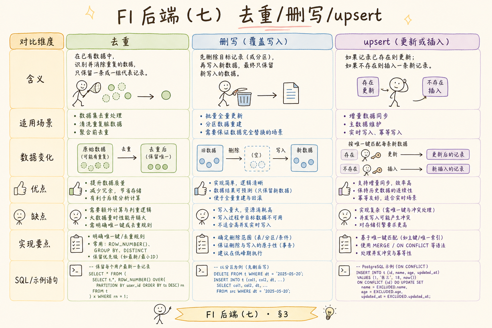
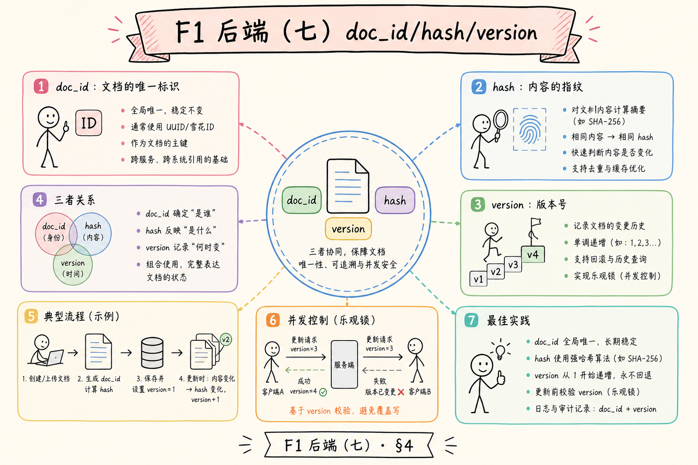
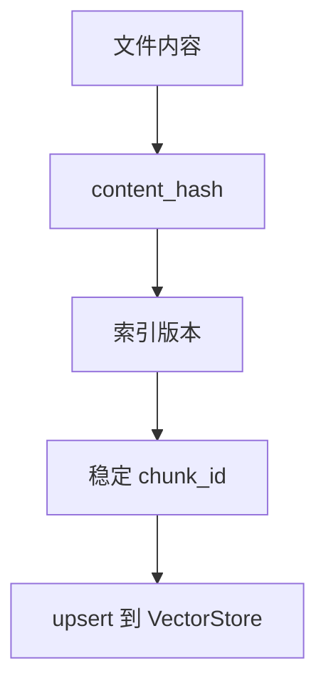
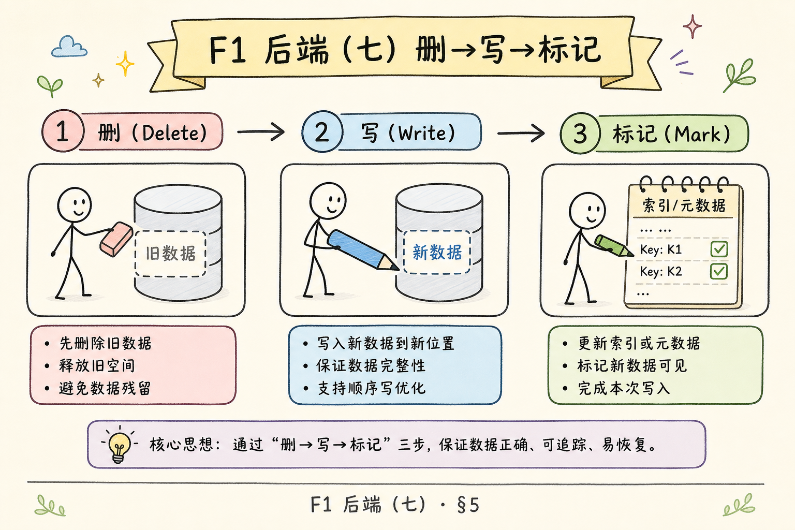
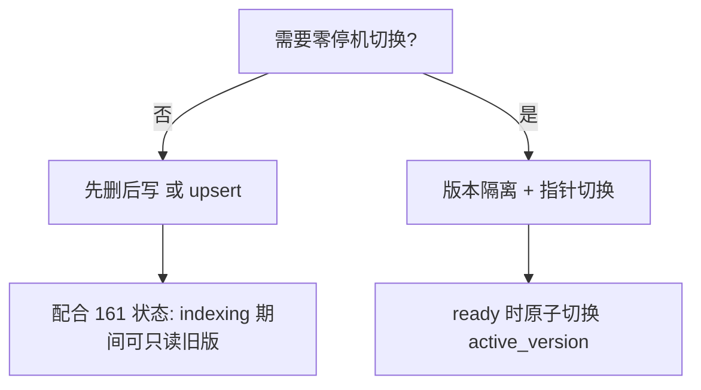
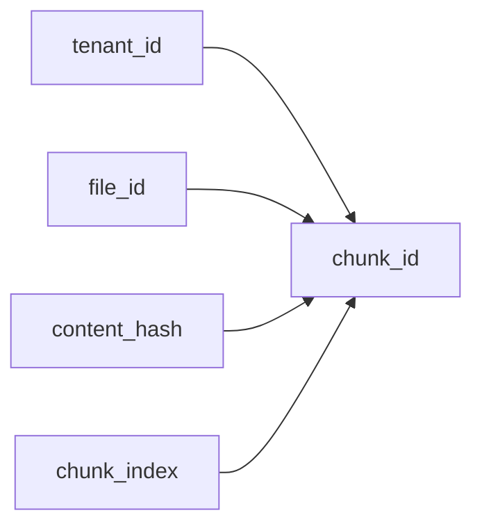
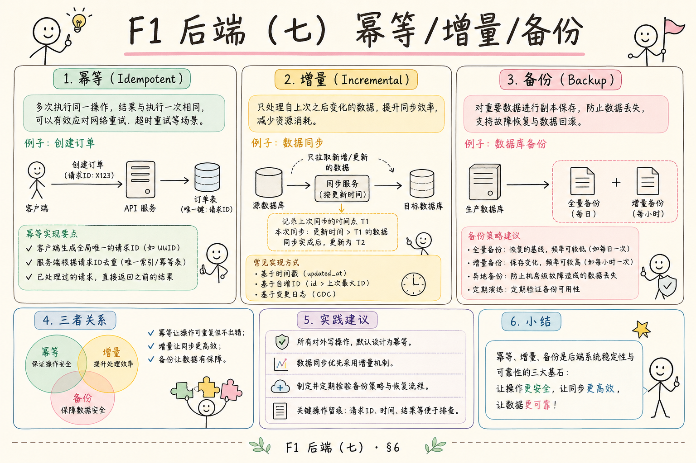
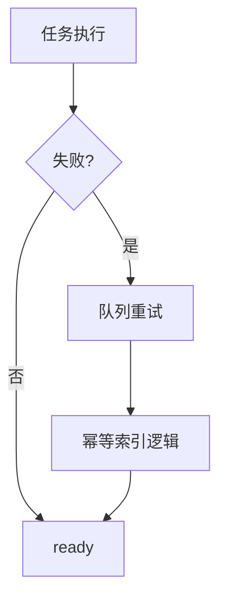

# F1 后端（七）：幂等重建索引入门指南

> 队列可以重试，但重试若每次 `insert` 新向量，知识库会堆满重复 chunk。**幂等**保证：同一文件、同一内容版本，跑 1 次和跑 N 次，检索看到的仍是同一份正确索引。

RAG 索引任务经常会重跑：用户重新上传同一文件，worker 失败后重试，文档更新后重建索引。如果每次重跑都直接追加向量，知识库很快会出现重复 chunk、旧版本资料和错误引用。**幂等重建索引**要解决的是：同一个文件同一个版本，无论执行一次还是多次，最终结果都一致。

本文面向刚开始做 RAG 后端的读者。读完后，你应该能理解幂等是什么、为什么索引任务必须幂等、常见重建策略有哪些，并能设计一个基于 `content_hash` 和稳定 `chunk_id` 的最小方案。请与 [159](159.celery-async-queue-tutorial.md) 重试、[161](161.index-task-state-machine-tutorial.md) 状态、[163](163.retry-dead-letter-tutorial.md) 失败收敛一起使用。

## 目录

- [1. 为什么重试会写脏数据](#1-为什么重试会写脏数据)
- [2. 幂等是什么](#2-幂等是什么)
- [3. RAG 索引里的幂等目标](#3-rag-索引里的幂等目标)
- [4. 三种重建策略](#4-三种重建策略)
- [5. 最小可运行逻辑](#5-最小可运行逻辑)
- [6. content_hash 与 chunk_id](#6-content_hash-与-chunk_id)
- [7. 与队列重试如何配合](#7-与队列重试如何配合)
- [8. 常见错误](#8-常见错误)
- [9. FAQ](#9-faq)
- [10. 总结](#10-总结)

## 1. 为什么重试会写脏数据

假设 worker 写入到一半时网络失败。队列重试后，任务从头执行。如果写入逻辑只是“追加向量”，同一批 chunk 可能被写两次。检索时，重复片段会挤占 top_k，旧内容也可能和新内容混在一起。


幂等的目的就是让重试变安全。失败可以重跑，但重跑不应该制造重复或脏数据。

### 1.1 检索侧的症状

| 现象 | 可能原因 |
|------|----------|
| 同一句话在答案里出现两遍 | 重复 chunk 占满 top_k |
| 用户已更新文档，回答仍是旧版 | 旧 `content_hash` 向量未删 |
| 重试后 chunk 数翻倍 | 追加写无稳定 ID |
| 偶发“幽灵”引用 | 失败中间态与成功态并存 |

这些问题在 Demo 单线程时不易暴露；一旦 [159](159.celery-async-queue-tutorial.md) 重试或 [163](163.retry-dead-letter-tutorial.md) replay 就会放大。

### 1.2 哪些操作会触发“第二次写入”

- Celery `self.retry`  
- 用户点击“重新索引”  
- 定时全库重建  
- 部署新版本 splitter 后批量重跑  

每一种都应走同一套幂等写入，而不是另写一套“重建脚本”。

## 2. 幂等是什么

**幂等**：同一个操作执行一次和执行多次，最终结果相同。通俗说，电梯按钮按一次和按十次，目标楼层不应该变成十倍。

在索引任务中，幂等意味着：

| 场景 | 期望结果 |
|---|---|
| 同一文件重复上传 | 不重复入库，或创建新版本 |
| 同一任务重试 | 最终只有一份正确 chunk |
| 重建同一版本 | 结果覆盖旧结果，不叠加 |
| 新版本文件 | 能和旧版本区分 |

幂等不是“不允许重试”，而是“允许安全重试”。

### 2.1 与 HTTP 幂等的类比

REST 里 `PUT` 同一资源多次，结果应一致。索引任务相当于对 `(file_id, content_hash)` 做“逻辑 PUT”：多次执行后，向量库中该版本的 chunk 集合与元数据一致，且无多余副本。

### 2.2 幂等键（Idempotency Key）

除 `chunk_id` 外，API 入队时可接受客户端 `Idempotency-Key`（或内部 `task_fingerprint`），防止用户双击上传产生两条队列消息。键相同则返回已有 `task_id`，不二次入队。

## 3. RAG 索引里的幂等目标

一个幂等索引流程至少要保证三件事：

| 目标 | 说明 |
|---|---|
| 文件版本可识别 | 用 `content_hash` 判断内容是否变化 |
| chunk ID 稳定 | 同一文件同一 chunk 生成同一 ID |
| 写入可覆盖 | 重跑时覆盖旧记录或先删后写 |







只要 ID 稳定，重试时就可以用 upsert 覆盖，而不是无脑 insert。

### 3.1 版本维度清单

除文件字节外，下列变化也应视为**新版本**（需新 `content_hash` 或扩展版本号）：

| 变化 | 是否新版本 |
|------|------------|
| 文件正文修改 | 是 |
| 换 embedding 模型 | 是 |
| 调整 splitter 参数 | 是 |
| 仅改文件名 | 否（若内容不变） |
| 换向量库 collection 名 | 视迁移策略 |

在任务表记录 `embedding_model`、`splitter_version`，便于以后按版本批量重建。

## 4. 三种重建策略

常见策略有三种：先删后写、版本隔离、upsert 覆盖。



| 策略 | 做法 | 优点 | 风险 |
|---|---|---|---|
| 先删后写 | 删除旧 chunk，再写新 chunk | 简单直观 | 中途失败可能短暂无数据 |
| 版本隔离 | 新版本写入新 namespace，完成后切换 | 更安全 | 实现复杂 |
| upsert 覆盖 | 用稳定 ID 覆盖同一 chunk | 适合重试 | 需要 ID 设计稳定 |

初学阶段可以先用“先删后写 + 状态机”或“稳定 ID upsert”。生产高可用场景再考虑版本隔离。

### 4.1 策略选型简图



问答 API 应只读 `active_version` 指向的 chunk 集，避免读到半写入状态。

### 4.2 先删后写的安全写法

删除范围应精确：`delete where file_id=? and content_hash=?`，不要误删其他版本。删完后若 embedding 失败，任务标 `failed`，用户可能暂时搜不到该文档——需在 [161](161.index-task-state-machine-tutorial.md) 文案中区分“失败”与“处理中”。

## 5. 最小可运行逻辑

下面用 Python 模拟稳定 chunk_id 和 upsert。

运行环境：Python 3.10+。

```python
import hashlib


vector_store = {}


def sha1(text: str) -> str:
    return hashlib.sha1(text.encode("utf-8")).hexdigest()[:12]


def split_text(text: str) -> list[str]:
    return [part.strip() for part in text.split("\n\n") if part.strip()]


def index_document(file_id: str, content: str) -> dict:
    content_hash = sha1(content)
    chunks = split_text(content)

    for position, chunk in enumerate(chunks):
        chunk_id = f"{file_id}:{content_hash}:{position}"
        vector_store[chunk_id] = {
            "text": chunk,
            "content_hash": content_hash,
            "position": position,
        }

    return {"file_id": file_id, "content_hash": content_hash, "chunks": len(chunks)}


doc = "第一段介绍上传。\n\n第二段介绍索引。"
print(index_document("file-1", doc))
print(index_document("file-1", doc))
print(len(vector_store))
```

同一内容执行两次，`vector_store` 里仍然只有同一批 ID，不会重复增加。

### 5.1 如何读这个 Demo

- 第二次调用 `index_document` 模拟 **Celery 重试** 或 **用户重复点索引**  
- `len(vector_store)` 不变，说明 ID 稳定 + 覆盖写生效  
- 把 `vector_store` 换成 Milvus / pgvector / Qdrant 时，使用相同 `chunk_id` 做 upsert API  

### 5.2 内容变更时

若 `doc` 改一个字，`content_hash` 变，`chunk_id` 前缀变，会写入**新一组**键。此时应删除或归档旧 `content_hash` 下 chunk，否则多版本并存（有时是故意的版本隔离，有时是垃圾数据）。

## 6. content_hash 与 chunk_id

`content_hash` 用来识别文件内容版本。只要文件内容没变，hash 就不变；内容变了，hash 也变。

`chunk_id` 应该稳定且可追踪。一个常见格式是：

```text
{tenant_id}:{file_id}:{content_hash}:{chunk_index}
```

| 字段 | 作用 |
|---|---|
| `tenant_id` | 多租户隔离 |
| `file_id` | 找到原始文件 |
| `content_hash` | 区分内容版本 |
| `chunk_index` | 区分片段顺序 |



如果切分策略变了，也应把 `splitter_version` 纳入版本信息，否则旧 chunk 和新 chunk 可能冲突。

### 6.1 hash 算在哪一层

| 输入 | 适用 |
|------|------|
| 原始文件字节 | 检测用户是否换了文件 |
| 解析后纯文本 | 忽略 PDF 元数据噪声 |
| 清洗后文本 | 与线上检索文本一致 |

可并存 `raw_hash` 与 `text_hash`；**参与 chunk_id 的应与实际 embedding 的文本一致**。

### 6.2 chunk_index 稳定性

同一 `content_hash` 下，`chunk_index` 必须仅由切分结果决定（如按段落顺序 0,1,2…）。若切分非确定性，幂等会失效——应固定 splitter 种子、规则或记录 `splitter_version` 在 hash 盐里。

## 7. 与队列重试如何配合

队列重试和幂等必须一起设计。队列保证“失败后还能再执行”，幂等保证“再执行不会写坏”。





重试次数也要有限。永久失败的文件应该进入 `failed` 状态，并记录错误，而不是无限重跑。

### 7.1 推荐执行顺序（worker 内）

1. 读 `file_id`，算 `content_hash`  
2. 若 DB 记录显示同 hash 已 `ready` 且向量完整 → 短路返回（可选优化）  
3. `indexing`：解析、切分  
4. 按稳定 `chunk_id` upsert 向量  
5. 删除同 `file_id` 下**旧 hash** 的 orphan chunk（若策略要求单版本活跃）  
6. 标 `ready`  

步骤 5 与 [161](161.index-task-state-machine-tutorial.md) 的 `ready` 顺序配合：避免先 `ready` 后删旧数据导致短暂不一致。

### 7.2 死信 replay（163）

人工 replay 死信任务时，仍走同一 `index_document` / `index_file` 逻辑。运维不需要“特殊清库脚本”，降低人为失误。

## 8. 常见错误

第一个错误是每次重建都追加写入。这样会产生重复向量和旧内容污染。

第二个错误是 chunk_id 使用随机 UUID。随机 ID 让重试无法覆盖旧记录。

第三个错误是只按 file_id 覆盖，不区分内容版本。文件更新后，你可能无法判断哪些向量属于旧版本。

第四个错误是忽略切分版本。Splitter 参数变化后，chunk 边界变了，也应视为新索引版本。

### 8.1 向量库 API 层

| 错误 | 后果 |
|------|------|
| 只用 auto-id insert | 重试必重复 |
| 删库范围过大 | 误删其他 tenant |
| upsert 未等索引刷新就标 ready | 检索空窗 |
| 元数据未存 `content_hash` | 无法 GC 旧版本 |

元数据字段应与 `chunk_id` 一致，便于按 `file_id` + `content_hash` 批量删除。

## 9. FAQ

**Q：幂等是不是只需要数据库唯一键？**  
唯一键是手段之一，但还要设计稳定 ID、版本和写入策略。

**Q：先删后写安全吗？**  
简单但有窗口风险。任务中途失败时，知识库可能暂时没有这份文档。高要求系统可用版本隔离。

**Q：content_hash 应该基于原文件还是清洗后文本？**  
两者都可以，但含义不同。建议记录原文件 hash 和解析后文本 hash，便于排查。

**Q：embedding 模型换了算新版本吗？**  
算。不同 embedding 模型的向量空间不同，通常需要重建索引。

**Q：两个 worker 同时索引同一 file_id？**  
靠 DB 锁或“进行中任务”唯一约束 + 相同 `chunk_id` upsert，最终一致；最好入队去重。

**Q：幂等会影响性能吗？**  
upsert 略贵于 blind insert，但远便宜于线上重复 chunk 与人工清库。

## 10. 总结

幂等重建索引让 RAG 后台任务可以安全重试、重复执行和版本更新。它避免重复 chunk、旧版本污染和重试写坏数据。

初学者先抓住三个点：用 content_hash 标识版本，用稳定 chunk_id 写入，用 upsert 或先删后写保证重复执行结果一致。后续再根据可用性要求升级到版本隔离，并与 [163 重试与死信](163.retry-dead-letter-tutorial.md) 的 replay 流程统一。
