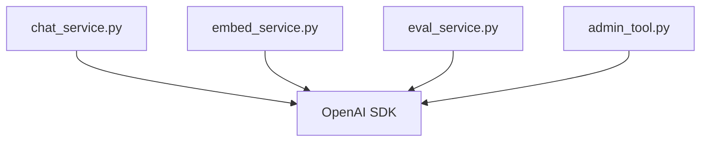
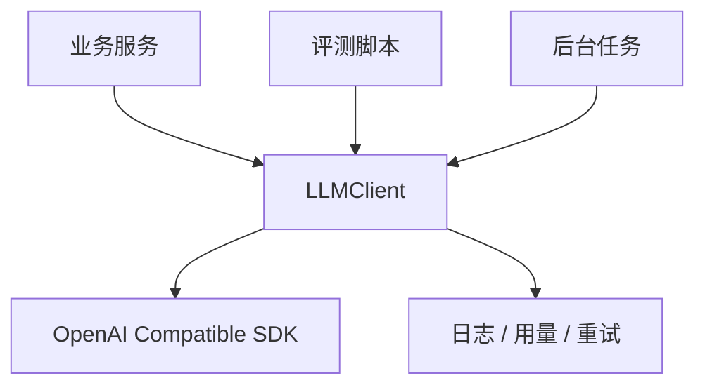
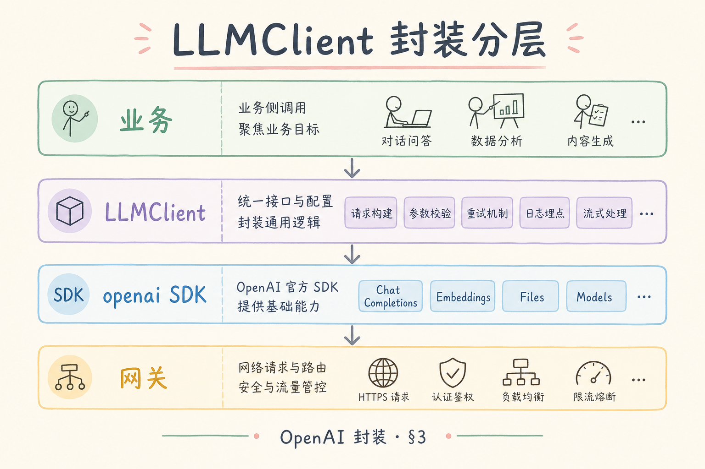
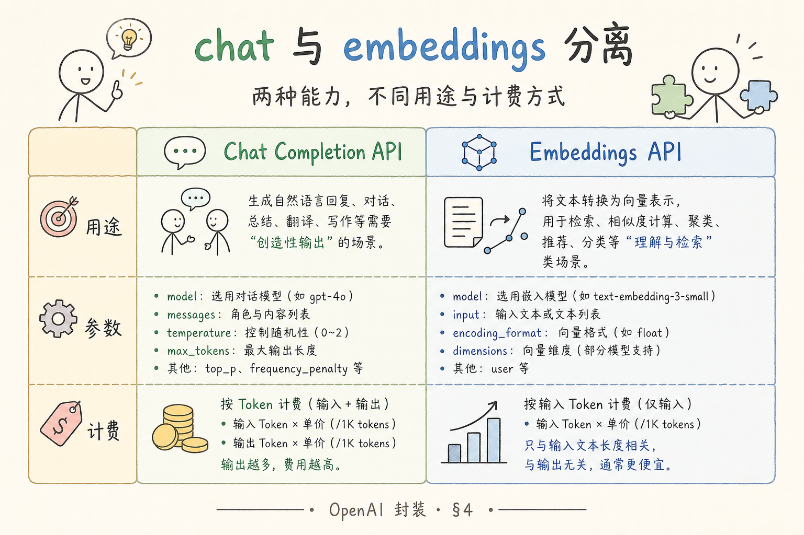
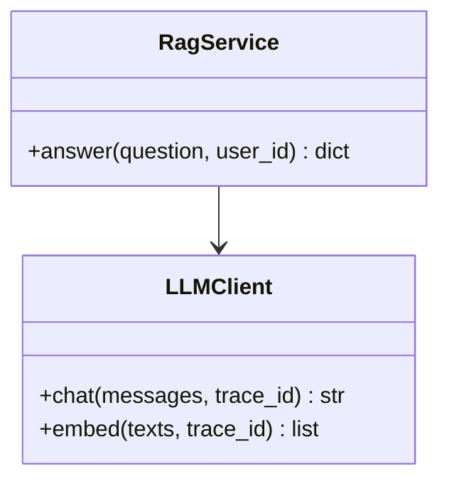

# F 后端与 API（十二）：OpenAI 兼容 API 封装入门

很多 RAG demo 会在业务代码里直接调用 `openai.Client()`。一开始很方便，但项目稍微变大，就会遇到模型名散落、超时不统一、重试失控、用量不好统计等问题。**API 封装**的目标就是把这些重复细节收拢到一个 LLMClient 里。

本文面向初学者，讲清楚为什么要封装 OpenAI 兼容 API，封装层应该包含什么，以及如何在 RAG 服务中使用它。

## 目录

- [1. 为什么不要到处直接调用 SDK](#1-为什么不要到处直接调用-sdk)
- [2. 封装层要解决哪些问题](#2-封装层要解决哪些问题)
- [3. 配置：base_url、key 和模型名](#3-配置base_urlkey-和模型名)
- [4. LLMClient 的最小接口](#4-llmclient-的最小接口)
- [5. Chat 与 Embeddings 方法](#5-chat-与-embeddings-方法)
- [6. 超时、重试和错误映射](#6-超时重试和错误映射)
- [7. 在 RAG 服务中注入客户端](#7-在-rag-服务中注入客户端)
- [8. 常见错误](#8-常见错误)
- [9. FAQ](#9-faq)
- [10. 总结](#10-总结)

## 1. 为什么不要到处直接调用 SDK

OpenAI 兼容 API 指的是许多模型服务提供了和 OpenAI 类似的接口格式，例如 `/chat/completions`、`/embeddings`。兼容接口让切换供应商更容易，但不代表可以把 SDK 调用散落在业务代码里。

散落调用通常会变成这样：



问题是每个文件都可能写自己的 timeout、model、retry、日志。线上出错时，你很难统一调整。

封装后，业务代码只依赖一个客户端：



这个结构让模型调用变成一个可治理的边界。

## 2. 封装层要解决哪些问题

一个实用的 LLMClient 至少应该解决六件事：

| 问题 | 封装层做什么 |
| --- | --- |
| 配置分散 | 统一读取 base_url、API key、模型名 |
| chat/embed 混用 | 分开 chat model 和 embedding model |
| 超时不一致 | 统一 timeout |
| 重试失控 | 只对可重试错误做有限重试 |
| 错误不好处理 | 映射成业务可理解的异常 |
| 成本不可见 | 记录 token 用量、模型名、trace_id |

封装层不是为了“多写一层代码”，而是为了让业务层不用关心底层供应商细节。

## 3. 配置：base_url、key 和模型名

配置应该集中管理，不要硬编码在函数里。下面是一个最小配置对象：



```python
from dataclasses import dataclass
import os


@dataclass(frozen=True)
class LLMConfig:
    base_url: str
    api_key: str
    chat_model: str
    embedding_model: str
    timeout_seconds: float = 30.0


def load_config() -> LLMConfig:
    return LLMConfig(
        base_url=os.environ["LLM_BASE_URL"],
        api_key=os.environ["LLM_API_KEY"],
        chat_model=os.environ.get("LLM_CHAT_MODEL", "gpt-4o-mini"),
        embedding_model=os.environ.get("LLM_EMBEDDING_MODEL", "text-embedding-3-small"),
    )
```

这里刻意把 chat model 和 embedding model 分开。聊天模型负责生成回答，embedding 模型负责把文本变成向量，二者不能混用。

## 4. LLMClient 的最小接口

初学阶段可以先定义两个方法：`chat()` 和 `embed()`。业务层只知道调用这两个方法，不直接接触 SDK。





接口越稳定，后续越容易替换底层模型供应商。比如从 OpenAI 切到兼容服务时，业务层不应该大面积改代码。

## 5. Chat 与 Embeddings 方法

下面示例展示一个同步版 LLMClient。运行前需要：

```bash
pip install openai
```

示例代码：

```python
from openai import OpenAI


class LLMClient:
    def __init__(self, config: LLMConfig):
        self.config = config
        self.client = OpenAI(
            base_url=config.base_url,
            api_key=config.api_key,
            timeout=config.timeout_seconds,
        )

    def chat(self, messages: list[dict], trace_id: str) -> str:
        response = self.client.chat.completions.create(
            model=self.config.chat_model,
            messages=messages,
        )
        usage = response.usage
        print({"trace_id": trace_id, "type": "chat", "usage": usage})
        return response.choices[0].message.content or ""

    def embed(self, texts: list[str], trace_id: str) -> list[list[float]]:
        response = self.client.embeddings.create(
            model=self.config.embedding_model,
            input=texts,
        )
        print({"trace_id": trace_id, "type": "embedding", "items": len(texts)})
        return [item.embedding for item in response.data]
```

这段代码有两个重点：业务层不传 model，model 由配置决定；每次调用都带 trace_id，方便日志串起来。

## 6. 超时、重试和错误映射

**超时**是指请求超过指定时间仍未完成，就主动失败。没有超时的模型调用可能拖垮整个接口。

**重试**是指临时失败后再试一次，例如网络抖动或 429 限流。重试必须有限制，不能无限循环。

建议把错误分成三类：

| 错误 | 是否重试 | 处理方式 |
| --- | --- | --- |
| 401/403 | 不重试 | 配置或权限问题，直接报警 |
| 429/5xx | 有限重试 | 指数退避，最多 2-3 次 |
| 400 参数错误 | 不重试 | 修代码或请求内容 |

下面是简化版重试包装：

```python
import time


def with_retry(fn, max_attempts: int = 3):
    last_error = None
    for attempt in range(max_attempts):
        try:
            return fn()
        except Exception as exc:
            last_error = exc
            if attempt == max_attempts - 1:
                break
            time.sleep(0.5 * (2 ** attempt))
    raise RuntimeError(f"llm call failed after retry: {last_error}")
```

真实项目里应按 SDK 的具体异常类型判断，而不是捕获所有异常后无脑重试。这里的代码只演示结构。

## 7. 在 RAG 服务中注入客户端

**依赖注入**的意思是：服务需要什么对象，就从外部传进来，而不是在函数内部临时 new。这样更容易测试和替换。

```python
class RagService:
    def __init__(self, llm: LLMClient):
        self.llm = llm

    def answer(self, question: str, context: str, trace_id: str) -> str:
        messages = [
            {"role": "system", "content": "只根据给定资料回答。"},
            {"role": "user", "content": f"资料：{context}\n问题：{question}"},
        ]
        return self.llm.chat(messages, trace_id=trace_id)
```

测试时可以传一个假客户端：

```python
class FakeLLMClient:
    def chat(self, messages: list[dict], trace_id: str) -> str:
        return "固定测试答案"

    def embed(self, texts: list[str], trace_id: str) -> list[list[float]]:
        return [[0.1, 0.2, 0.3] for _ in texts]
```

这样单元测试不需要真的调用模型，也不会产生费用。

## 8. 常见错误

这一节列出模型 API 封装最常见的工程问题。它们通常不会在 demo 阶段暴露，但会在线上放大。

### 8.1 chat 与 embedding 共用一个 model 参数

聊天模型和 embedding 模型能力不同、价格不同、返回格式也不同。配置里应明确区分 `chat_model` 和 `embedding_model`。

### 8.2 业务层直接创建 SDK Client

业务层直接 `OpenAI(...)` 会让配置、日志和错误处理散落。应由 LLMClient 统一封装。

### 8.3 429 无限重试

429 通常表示限流。无限重试会让系统更拥堵。应使用有限次数、指数退避，并记录失败。

### 8.4 Key 硬编码

API Key 不能写进源码。使用环境变量、密钥管理服务或部署平台的 secret 配置。

### 8.5 没有 timeout

没有 timeout 的请求可能长时间占住连接。后端接口、后台任务和批处理都应该有明确超时。

## 9. FAQ

**Q1：同步还是异步客户端更好？**  
普通后台脚本用同步更简单；高并发 API 或流式响应通常更适合异步。先按项目调用方式选择，不必一开始过度抽象。

**Q2：流式输出放在 LLMClient 里吗？**  
应该放。业务层可以调用 `stream_chat()`，但底层的 SDK 流式细节、错误处理和日志仍由 LLMClient 负责。

**Q3：兼容 API 能不能完全无缝切换？**  
不一定。接口路径可能兼容，但模型能力、上下文长度、错误码、usage 字段和流式格式仍可能不同。

**Q4：封装会不会让功能受限？**  
如果接口设计太死会。解决办法是先封装稳定能力，再允许少量受控参数透传，例如 temperature、max_tokens。

## 10. 总结

OpenAI 兼容 API 封装的核心目标是建立模型调用边界。业务层只表达“我要生成答案”或“我要向量化文本”，底层客户端负责配置、超时、重试、日志、错误和用量。


初学者可以先做到四点：

1. 集中管理 base_url、key、chat model 和 embedding model。
2. 用 LLMClient 包住 chat 和 embed。
3. 统一 timeout、有限重试和错误映射。
4. 通过依赖注入让 RAG 服务可测试、可替换。

封装完成后，多模型路由、成本统计、流式输出和 A/B 测试才有稳定落点。
