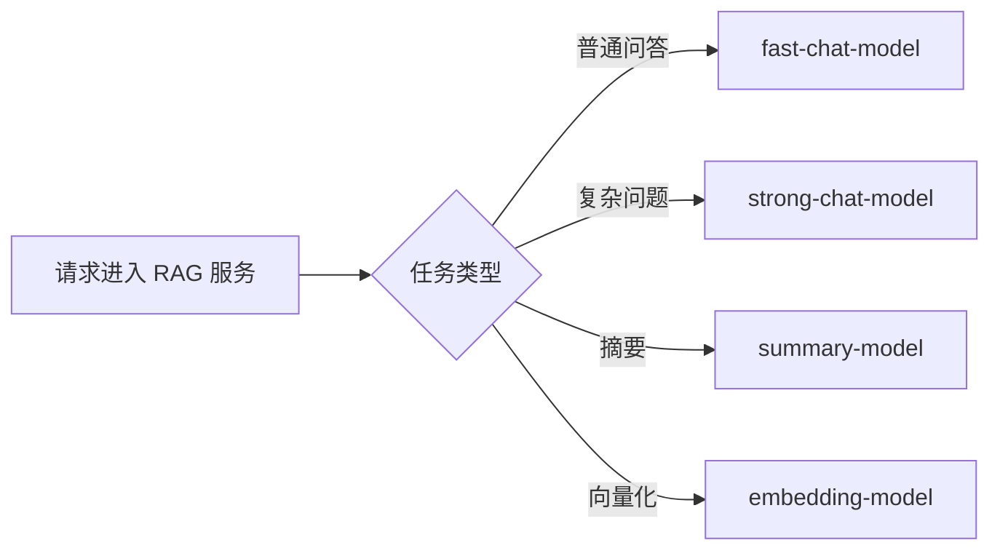
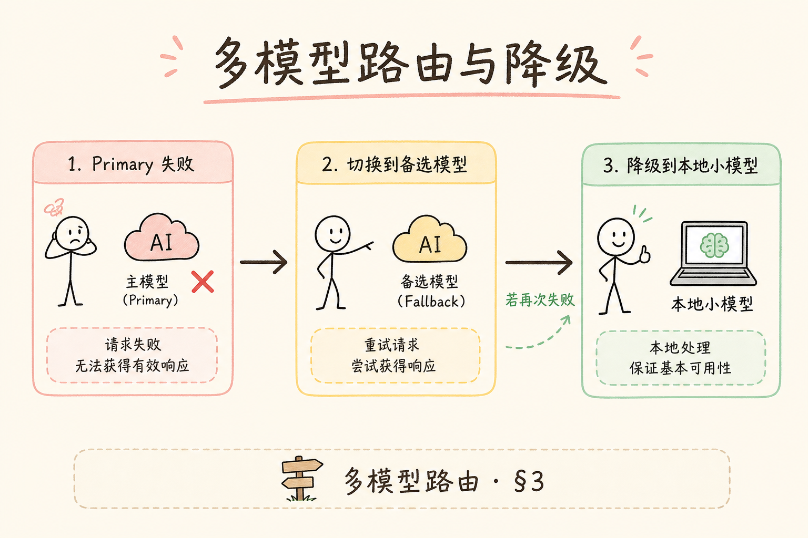
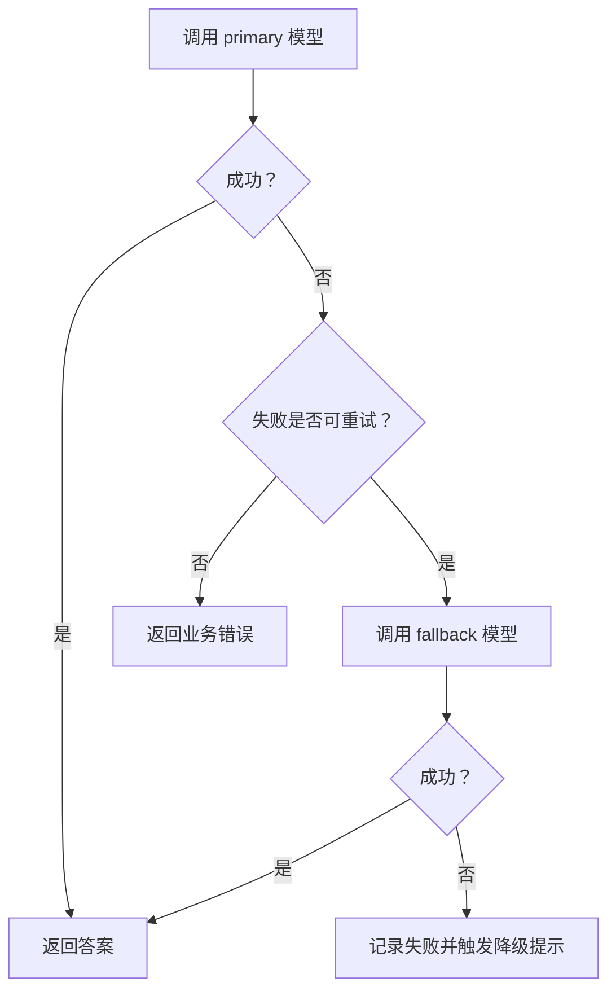
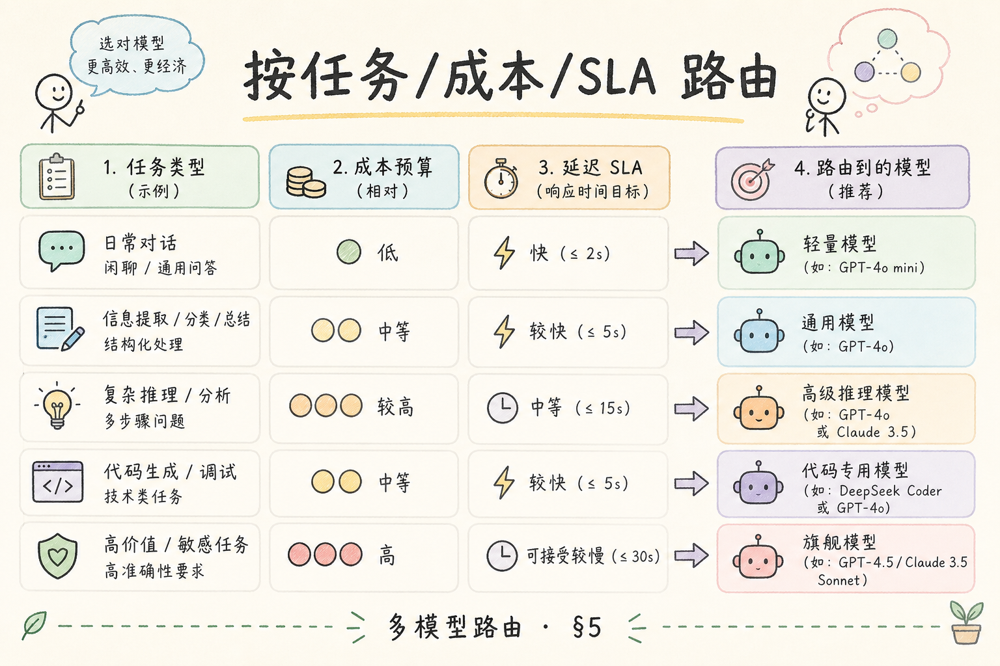
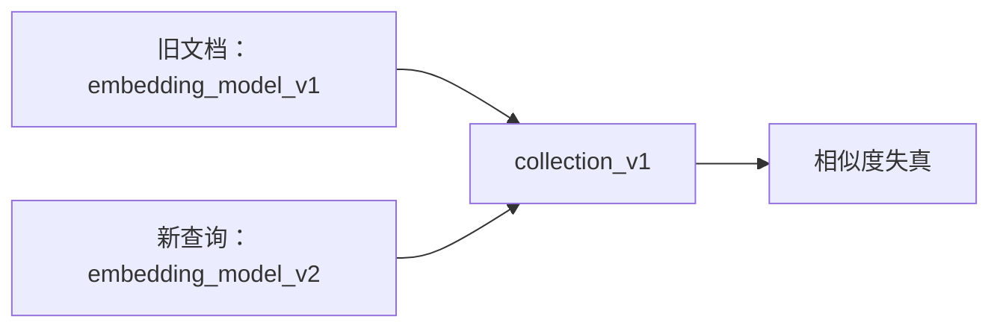

# F 后端与 API（十三）：多模型路由与降级入门

RAG 系统上线后，单一模型往往不够用：有的任务需要便宜模型，有的任务需要强模型，有的模型会限流或故障。**多模型路由**就是按任务、成本、质量和可用性选择模型；**降级**就是主模型不可用时切到备用方案。

本文面向已经有 LLMClient 封装的初学者。读完后，你应该能设计一个最小 Router，把聊天、重排、摘要等任务分到不同模型，并理解 fallback、timeout、日志为什么重要。

## 目录

- [1. 多模型路由解决什么问题](#1-多模型路由解决什么问题)
- [2. 路由维度：任务、成本、质量、SLA](#2-路由维度任务成本质量sla)
- [3. 降级链与断路器](#3-降级链与断路器)
- [4. 配置驱动的路由表](#4-配置驱动的路由表)
- [5. 最小 Router 示例](#5-最小-router-示例)
- [6. Embedding 路由的特殊风险](#6-embedding-路由的特殊风险)
- [7. 日志、评测和 A/B 测试](#7-日志评测和-ab-测试)
- [8. 常见错误](#8-常见错误)
- [9. FAQ](#9-faq)
- [10. 总结](#10-总结)

## 1. 多模型路由解决什么问题

**路由**可以理解为“把请求分配给合适的处理者”。在模型系统里，它决定某个任务应该调用哪个模型。

一个 RAG 服务可能同时有这些任务：

| 任务 | 模型需求 |
| --- | --- |
| 普通问答 | 稳定、便宜、速度快 |
| 复杂推理 | 质量更高、上下文更长 |
| 摘要生成 | 便宜且长文本能力好 |
| query rewrite | 延迟低 |
| embedding | 向量维度和索引版本稳定 |

如果所有任务都用同一个大模型，成本会很高；如果所有任务都用便宜模型，复杂问题质量会差。多模型路由就是在这两者之间做工程取舍。



## 2. 路由维度：任务、成本、质量、SLA

**SLA**（Service Level Agreement，服务等级目标）在这里指接口对延迟、可用性和成功率的要求。不同任务的 SLA 不一样。

可以先用四个维度设计路由：

| 维度 | 问题 | 示例 |
| --- | --- | --- |
| 任务 | 这次调用要做什么？ | chat、embed、rerank、summary |
| 成本 | 能否用便宜模型？ | query rewrite 用小模型 |
| 质量 | 失败代价高不高？ | 合规问答用强模型 |
| SLA | 是否要求低延迟？ | 在线聊天比离线摘要更敏感 |

一个实用原则是：先按任务分，再按质量和成本微调。不要一开始设计过于聪明的自动路由，否则很难解释和排查。

## 3. 降级链与断路器

**降级**（fallback）是主方案失败时使用备用方案。例如强模型 429 限流，就切到备用模型；备用模型也失败，就返回“当前繁忙，请稍后重试”。

**断路器**（circuit breaker）是一种保护机制：如果某个模型连续失败，系统暂时不再调用它，避免所有请求都卡在同一个故障点。





降级不是偷偷换模型就完事。它必须记录日志，否则你无法知道线上到底用了多少备用模型，质量有没有下降。

## 4. 配置驱动的路由表

路由规则不要散落在 `if task == ...` 里。更可维护的方式是配置一张路由表。

下面是 YAML 风格示例：

```yaml
tasks:
  chat_default:
    primary: gpt-4o-mini
    fallback: deepseek-chat
    timeout_seconds: 20
  chat_hard:
    primary: gpt-4o
    fallback: gpt-4o-mini
    timeout_seconds: 40
  summary:
    primary: gpt-4o-mini
    fallback: local-summary-model
    timeout_seconds: 30
  embedding:
    primary: text-embedding-3-small
    fallback: null
    timeout_seconds: 15
```

配置化的好处是上线后可以调整模型组合，而不一定要改业务代码。但配置变更也要走审查，因为换模型会影响质量、成本和索引兼容性。

## 5. 最小 Router 示例

下面代码演示一个最小可理解的 Router。它依赖上一篇的 LLMClient 思想，但为了简化，用函数模拟模型调用。



```python
from dataclasses import dataclass


@dataclass
class Route:
    primary: str
    fallback: str | None
    timeout_seconds: int


ROUTES = {
    "chat_default": Route("gpt-4o-mini", "deepseek-chat", 20),
    "chat_hard": Route("gpt-4o", "gpt-4o-mini", 40),
    "summary": Route("gpt-4o-mini", "local-summary-model", 30),
}


def call_model(model: str, prompt: str) -> str:
    if model == "gpt-4o":
        raise RuntimeError("rate limited")
    return f"[{model}] {prompt[:20]}"


class ModelRouter:
    def complete(self, task: str, prompt: str, trace_id: str) -> str:
        route = ROUTES[task]
        try:
            result = call_model(route.primary, prompt)
            print({"trace_id": trace_id, "model": route.primary, "fallback": False})
            return result
        except RuntimeError as exc:
            if route.fallback is None:
                raise
            result = call_model(route.fallback, prompt)
            print({"trace_id": trace_id, "model": route.fallback, "fallback": True, "reason": str(exc)})
            return result


router = ModelRouter()
print(router.complete("chat_hard", "请解释公司的报销政策", trace_id="t-001"))
```

预期输出会显示主模型失败后使用了 fallback。真实项目里，`call_model()` 应替换成 LLMClient，并按错误类型决定是否降级。

## 6. Embedding 路由的特殊风险

Embedding 模型不能像聊天模型一样随便降级。因为向量库里的旧向量由某个 embedding 模型生成，换模型后，新旧向量空间可能不兼容。



如果要切换 embedding 模型，通常要：

1. 建新 collection 或新索引版本。
2. 用新模型重新向量化文档。
3. 灰度切流量。
4. 验证召回率和答案质量。

所以 embedding 路由应比 chat 路由更保守。不要在 embedding 失败时自动换另一个维度或语义空间不同的模型。

## 7. 日志、评测和 A/B 测试

多模型路由必须记录这些字段：

| 字段 | 用途 |
| --- | --- |
| `trace_id` | 串联一次请求 |
| `task` | 判断是哪类任务 |
| `primary_model` | 原计划使用的模型 |
| `actual_model` | 实际调用的模型 |
| `fallback` | 是否发生降级 |
| `latency_ms` | 延迟 |
| `tokens` | 成本估算 |

有了日志，才能做评测和 A/B 测试。否则你只知道“答案变差了”，不知道是不是某个任务被路由到了弱模型。

## 8. 常见错误

这一节列出多模型路由最容易出问题的地方。重点不是让路由变复杂，而是让它可解释、可回滚、可观测。

### 8.1 没有 fallback

单一模型限流或故障时，所有请求都会失败。关键在线接口至少要有备用方案或明确的失败提示。

### 8.2 降级没有日志

用户看到答案质量下降，团队却不知道发生了降级。每次 fallback 都应记录原因和实际模型。

### 8.3 路由规则散落在业务代码

规则散在多个 `if` 里，很难审查和回滚。应集中到路由表或配置文件。

### 8.4 把 embedding 当 chat 一样随便切

Embedding 模型变化会影响向量空间。切换前要考虑索引版本和重建成本。

### 8.5 只按价格路由

便宜模型不一定适合所有任务。路由需要同时考虑质量、延迟、失败率和业务风险。

## 9. FAQ

**Q1：路由应该自动判断问题难度吗？**  
可以，但初学阶段不建议一开始做复杂自动分类。先按任务类型和用户等级做显式规则，更容易验证。

**Q2：本地小模型适合做什么？**  
适合低风险、可容错的任务，比如简单摘要、关键词提取、格式转换。高风险问答仍需评测验证。

**Q3：降级后要告诉用户吗？**  
如果降级明显影响质量或能力，应给出温和提示。内部至少要记录日志，方便事后分析。

**Q4：多模型路由和 A/B 测试有什么关系？**  
A/B 测试可以看成受控路由：一部分流量走模型 A，一部分走模型 B，然后比较质量、成本和延迟。

## 10. 总结

多模型路由的目标不是炫技，而是让 RAG 系统在质量、成本和可用性之间做可控取舍。


初学者可以先实现四件事：

1. 用任务类型区分 chat、summary、embedding 等调用。
2. 用配置表管理 primary、fallback 和 timeout。
3. 记录实际模型、降级原因、token 和延迟。
4. 对 embedding 切换保持谨慎，配合索引版本管理。

当路由规则能被解释、能被测试、能被回滚时，多模型才真正从“临时 if”变成工程能力。
