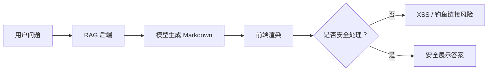
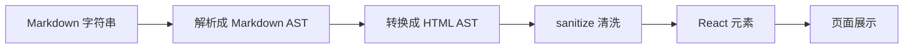
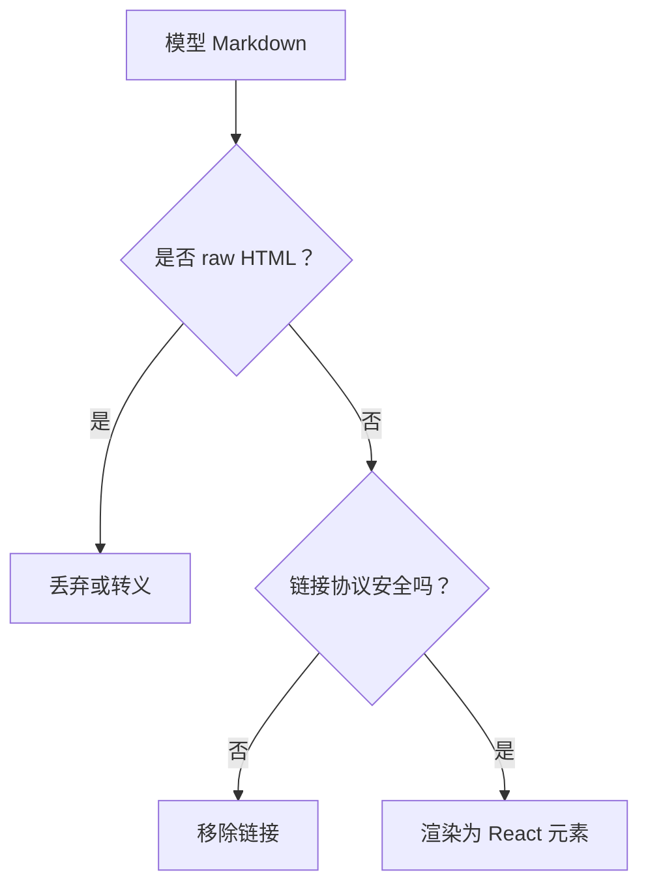
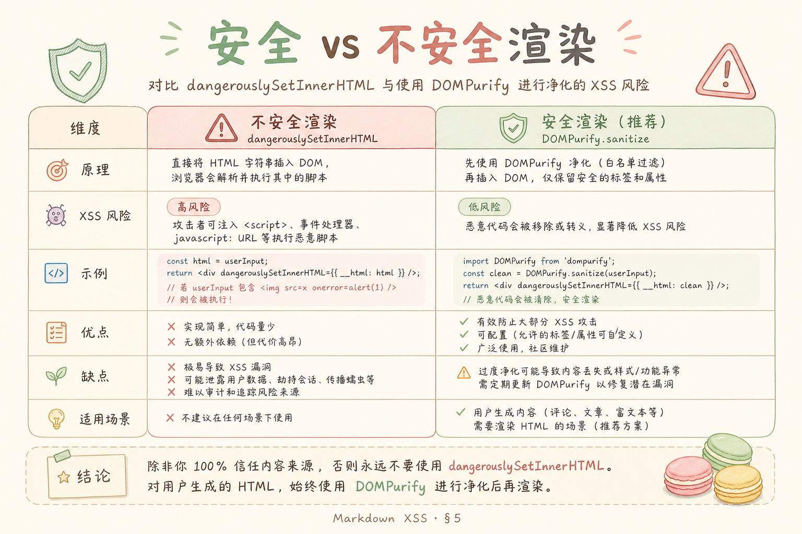
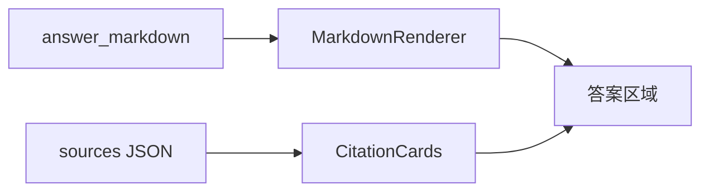

# G 前端与体验（二）：RAG 答案的 Markdown 渲染与安全

RAG 答案经常包含列表、代码块、引用链接和表格。直接把纯文本丢到页面上，可读性差；但直接把模型输出当 HTML 渲染，又可能引入 XSS 风险。**XSS**（Cross-Site Scripting，跨站脚本攻击）就是攻击者让页面执行恶意脚本，偷 cookie、跳转页面或伪造操作。

本文面向前端初学者，讲清楚为什么要渲染 Markdown、为什么不能相信模型输出，以及如何用 `react-markdown` 加 `rehype-sanitize` 做一个安全的 MarkdownRenderer。

## 目录

- [1. RAG 为什么需要 Markdown 渲染](#1-rag-为什么需要-markdown-渲染)
- [2. Markdown 渲染管线](#2-markdown-渲染管线)
- [3. XSS 威胁模型](#3-xss-威胁模型)
- [4. 安全策略：允许什么，禁止什么](#4-安全策略允许什么禁止什么)
- [5. 最小 React 组件](#5-最小-react-组件)
- [6. 链接、图片和代码块](#6-链接图片和代码块)
- [7. 与引用卡片结合](#7-与引用卡片结合)
- [8. 常见错误](#8-常见错误)
- [9. FAQ](#9-faq)
- [10. 总结](#10-总结)

## 1. RAG 为什么需要 Markdown 渲染

模型答案如果包含步骤、对比表和代码，Markdown 能让它更易读：

```markdown
## 报销流程

1. 提交发票
2. 直属主管审批
3. 财务打款
```

渲染后的页面比纯文本更适合阅读。但 RAG 场景有一个特殊点：Markdown 内容不是开发者手写的，而是模型生成的。模型可能输出错误链接、HTML 标签，甚至被提示注入诱导输出恶意内容。



结论是：Markdown 可以渲染，但必须经过安全策略。

## 2. Markdown 渲染管线

`react-markdown` 的核心作用是把 Markdown 转成 React 元素。它通常配合 remark、rehype 插件处理扩展语法和 HTML。

通俗理解这条管线：



**AST**（Abstract Syntax Tree，抽象语法树）可以理解为“文本被解析后的结构化树”。清洗发生在结构层，比简单字符串替换更可靠。

## 3. XSS 威胁模型

威胁模型就是先问：攻击者能控制什么、想达到什么、系统哪里可能放大风险。


在 RAG Markdown 渲染中，攻击者可能控制：

| 输入来源 | 风险 |
| --- | --- |
| 用户问题 | 诱导模型输出恶意 Markdown |
| 被上传文档 | 文档里藏恶意链接或 HTML |
| 模型答案 | 输出 `<script>`、`onerror`、危险链接 |

典型危险内容包括：

```html

<a href="javascript:alert('xss')">点击查看资料</a>
```

安全渲染的目标不是让所有 Markdown 都显示，而是只允许安全、必要的元素显示。

## 4. 安全策略：允许什么，禁止什么

初学者可以先采用白名单策略：只允许常见排版标签，禁止 raw HTML 和危险链接协议。

| 内容 | 建议 |
| --- | --- |
| 标题、段落、列表 | 允许 |
| 表格 | 按需允许 |
| 代码块 | 允许，但只当文本显示 |
| raw HTML | 禁止 |
| `javascript:` 链接 | 禁止 |
| 外链 | 新窗口打开并加 `noopener noreferrer` |

安全策略可以这样理解：



这套规则会牺牲一点展示自由度，但换来更可控的安全边界。

## 5. 最小 React 组件

下面示例使用 `react-markdown` 和 `rehype-sanitize`。运行前安装：



```bash
npm install react-markdown rehype-sanitize remark-gfm
```

最小组件：

```tsx
import ReactMarkdown from "react-markdown";
import remarkGfm from "remark-gfm";
import rehypeSanitize from "rehype-sanitize";

type MarkdownRendererProps = {
  content: string;
};

export function MarkdownRenderer({ content }: MarkdownRendererProps) {
  return (
    <ReactMarkdown
      remarkPlugins={[remarkGfm]}
      rehypePlugins={[rehypeSanitize]}
      components={{
        a: ({ href, children }) => (
          <a href={href} target="_blank" rel="noopener noreferrer">
            {children}
          </a>
        ),
      }}
    >
      {content}
    </ReactMarkdown>
  );
}
```

这个组件做了三件事：支持 GitHub 风格 Markdown；通过 sanitize 清洗危险节点；外链新窗口打开时加上 `noopener noreferrer`，避免新页面控制原页面。

## 6. 链接、图片和代码块

RAG 答案里的链接和图片要更谨慎，因为它们可能来自模型或外部文档。

| 元素 | 建议 |
| --- | --- |
| 链接 | 只允许 `http`、`https`、站内相对路径 |
| 图片 | 默认禁用，或只允许可信域名 |
| 代码块 | 只高亮文本，不执行 |
| 表格 | 允许，但注意移动端横向滚动 |

图片尤其要注意：模型输出的图片链接可能追踪用户或加载不可信资源。企业 RAG 页面通常可以先禁用模型答案中的图片，只展示后端验证过的来源预览。

代码块高亮可以在后续加入，但不要为了高亮引入 `dangerouslySetInnerHTML`。如果高亮库需要 HTML 输出，也必须经过可信处理。

## 7. 与引用卡片结合

RAG 答案常见需求是正文里出现 `[1]`，下面显示来源卡片。建议把“答案 Markdown”和“引用数据”分开处理：



不要让模型直接生成完整 HTML 引用卡片。更稳妥的做法是：模型只输出引用编号，后端返回结构化 sources，前端用自己的组件渲染卡片。

这样可以避免模型伪造来源链接，也能统一控制来源标题、页码、文档权限和预览按钮。

## 8. 常见错误

这一节列出 RAG Markdown 前端最容易踩的安全坑。它们通常在 demo 中看不出来，但上线后风险很高。

### 8.1 使用 dangerouslySetInnerHTML

`dangerouslySetInnerHTML` 会把字符串当 HTML 注入页面。除非你完全信任并严格清洗内容，否则不要用于模型输出。

### 8.2 允许 raw HTML

Markdown 里夹 HTML 很常见，但模型输出不可信。默认禁止 raw HTML，必要时只允许极小白名单。

### 8.3 链接缺少 noopener

`target="_blank"` 如果不加 `rel="noopener noreferrer"`，新页面可能拿到原页面引用，带来安全风险。

### 8.4 用户 Markdown 和模型 Markdown 用同一策略

后台管理员写的说明文档、普通用户上传的 Markdown、模型生成的答案，可信度不同。安全策略不应完全一样。

### 8.5 以为模型不会输出恶意内容

模型可能被提示注入影响，也可能复述文档里的恶意片段。前端必须按“不可信输入”处理模型答案。

## 9. FAQ

**Q1：react-markdown 和 marked 怎么选？**  
React 项目里 `react-markdown` 更自然，因为它输出 React 元素；`marked` 更偏字符串转 HTML，安全处理要格外小心。

**Q2：内网系统可以关 sanitize 吗？**  
不建议。内网也可能有恶意文档、误上传内容或被污染的数据源。安全策略应默认开启。

**Q3：代码高亮怎么做？**  
可以接 `rehype-highlight` 或自定义 code 组件，但不要执行代码，也不要直接注入未清洗 HTML。

**Q4：Markdown 里的引用编号如何校验？**  
后端返回 sources 数组，前端只把存在的编号渲染为可点击引用。不存在的编号应当显示为普通文本或标记异常。

## 10. 总结

RAG 答案需要 Markdown 渲染来提升可读性，但模型输出必须按不可信内容处理。


初学者先做到四点：

1. 用 `react-markdown` 渲染 Markdown，不直接注入 HTML。
2. 使用 `rehype-sanitize` 或等价白名单清洗。
3. 链接、图片、代码块分别制定策略。
4. 引用卡片由结构化数据渲染，不交给模型拼 HTML。

这样做之后，页面既能展示清晰答案，也能守住前端安全底线。
