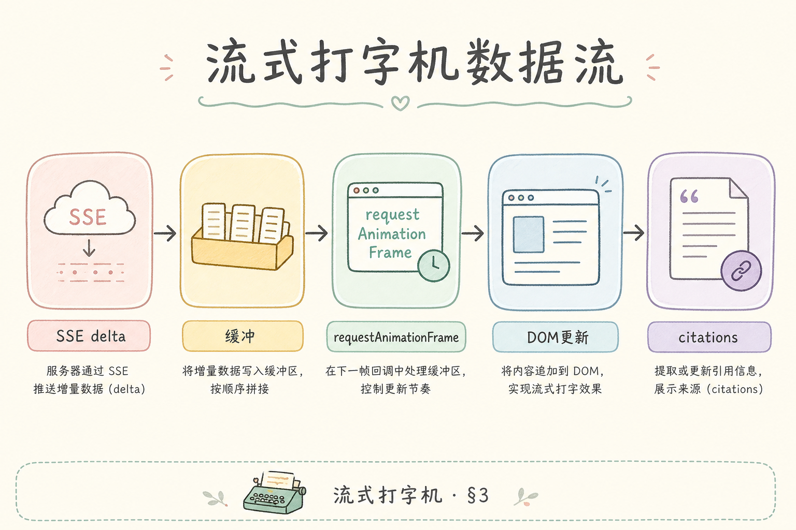
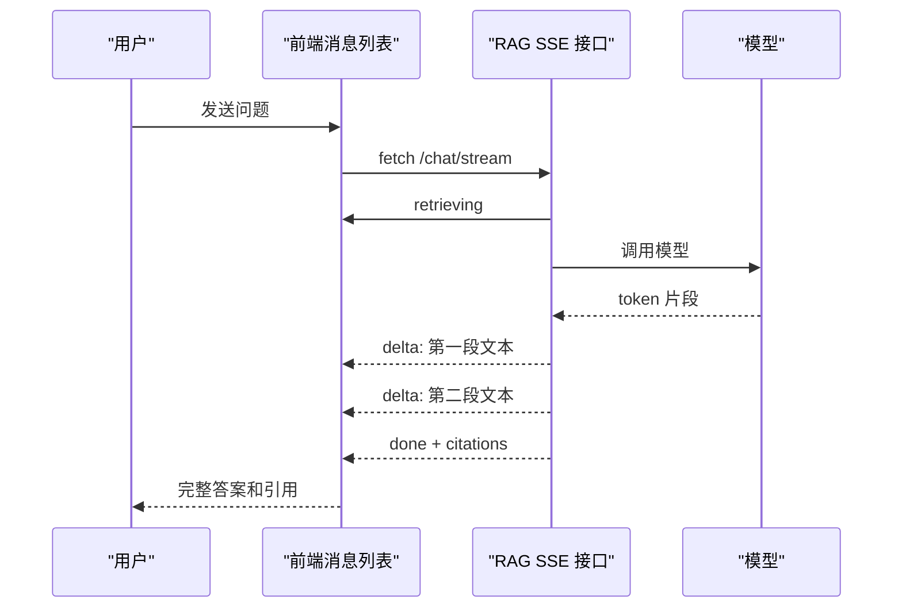
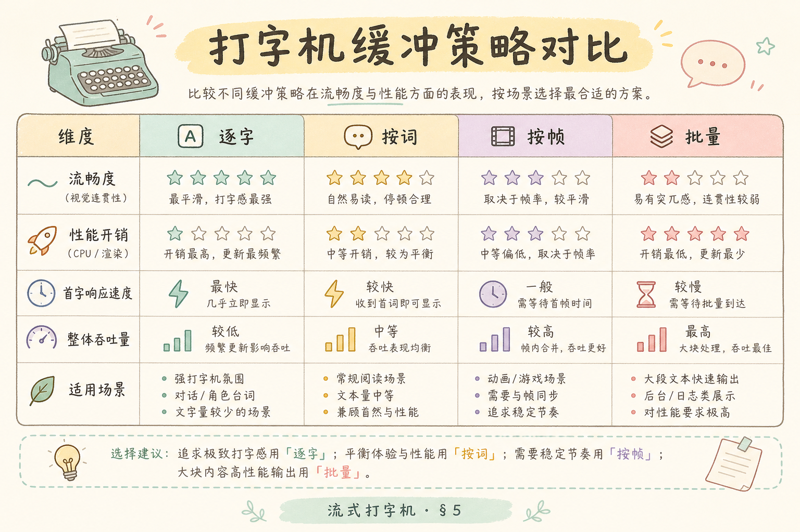
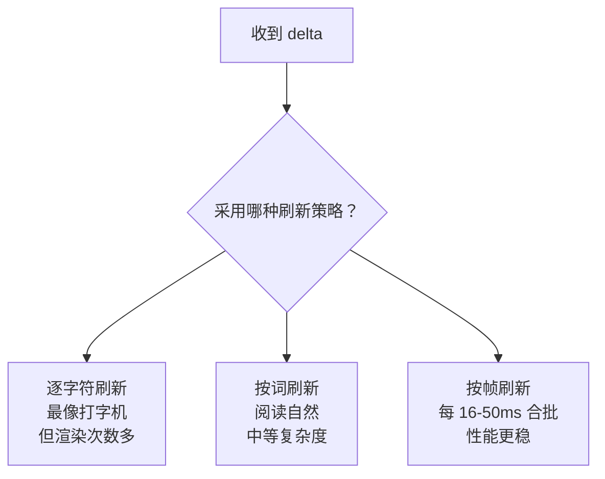
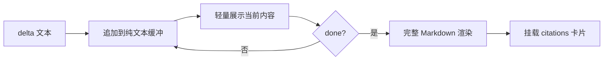
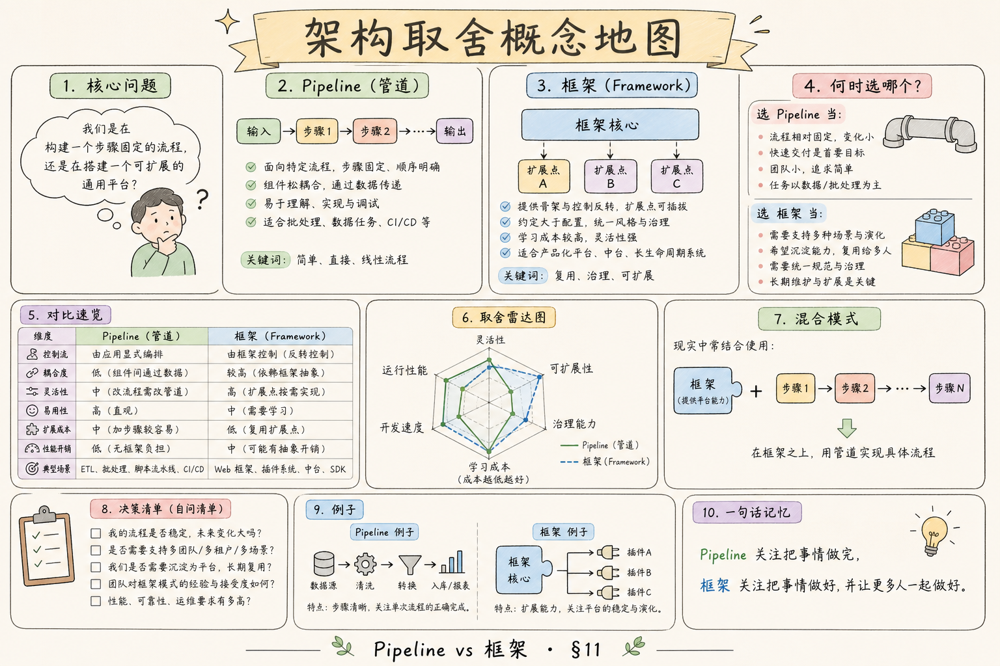

# F2 前端（四）：流式打字机效果完全指南

这篇讲的是 RAG 应用里常见的“边生成边显示”效果。它看起来像打字机，但本质不是 CSS 动画，而是前端持续接收后端返回的文本片段，并把这些片段稳定地渲染到消息列表里。

**流式输出**（streaming）：服务器不是等完整答案生成完再返回，而是一小段一小段返回。
通俗说：像水龙头打开后持续出水，而不是等水桶装满后一次倒给你。

**打字机效果**：前端把流式文本按节奏显示出来。
通俗说：用户看到答案正在长出来，不会以为页面卡死。

## 目录

- [1. 它解决什么问题](#1-它解决什么问题)
- [2. 本文边界与目标](#2-本文边界与目标)
- [3. 数据流怎么走](#3-数据流怎么走)
- [4. 与 SSE 事件契约对齐](#4-与-sse-事件契约对齐)
- [5. 缓冲策略](#5-缓冲策略)
- [6. React Hook 最小实现](#6-react-hook-最小实现)
- [7. Markdown 与引用怎么配合](#7-markdown-与引用怎么配合)
- [8. 常见错误](#8-常见错误)
- [9. FAQ](#9-faq)
- [10. 总结与下一步](#10-总结与下一步)

## 1. 它解决什么问题

RAG 问答通常会经历检索、组织上下文、调用模型、返回引用这几个阶段。如果前端一直空白，用户很难判断系统是在工作、卡住，还是失败了。流式打字机效果解决的是“等待感”和“反馈感”。

它有三个直接价值：

| 问题 | 没有流式 UI | 有流式 UI |
|---|---|---|
| 首字等待 | 用户看空白页面 | 先显示“正在检索/生成” |
| 长答案 | 一次性出现，像卡顿后刷新 | 持续增长，用户感知更快 |
| 引用加载 | 答案和来源关系不清 | done 后统一挂载引用 |

注意：打字机不是为了炫技。它是让用户知道“系统还活着”，并且让长答案更容易被阅读。

## 2. 本文边界与目标

本文只讲前端如何消费流式文本并展示，不讲后端如何实现 SSE；后端事件格式可以参考前面的 SSE 文章。本文也不讲完整设计系统，只给出一个能跑通的 React 思路。

读完你应该能完成四件事：

- 区分 retrieving、streaming、done、error 几种 UI 状态。
- 把后端 `delta` 事件追加到当前答案中。
- 控制打字机缓冲，避免每个字符都触发重渲染。
- 在答案结束后再展示可点击引用。

## 3. 数据流怎么走

下面这张图展示了流式打字机的主链路。读图时重点看：后端发来的不是完整答案，而是多个 `delta`；前端需要边收边渲染，并在最后处理 `done`。





这张图的结论是：前端必须把“答案文本”和“引用列表”分开管理。答案可以逐步显示，引用最好等 `done` 后再挂载，避免用户点到半成品来源。

## 4. 与 SSE 事件契约对齐

**SSE**（Server-Sent Events）：浏览器和服务器之间的一种单向事件流。
通俗说：服务器可以不断给浏览器推消息，但浏览器不能用同一条连接反向发消息。

一个适合 RAG 的事件契约可以这样设计：

```text
event: retrieving
data: {"query":"什么是 RAG？"}

event: delta
data: {"text":"RAG 是"}

event: delta
data: {"text":"检索增强生成。"}

event: done
data: {"citations":[{"index":1,"title":"RAG 入门","url":"/docs/rag"}]}
```

前端要做的是按事件类型更新状态：

| 事件 | 前端动作 |
|---|---|
| `retrieving` | 显示“正在检索资料” |
| `delta` | 追加文本到答案缓冲 |
| `done` | 标记完成，挂载引用 |
| `error` | 停止流式渲染，显示错误态 |

## 5. 缓冲策略

如果每来一个字符就 `setState`，React 会频繁重渲染，长答案时可能卡。更稳的做法是把片段先放进缓冲区，再按固定节奏刷到界面。

下面这张图对比三种策略。读图时重点看“流畅度”和“实现复杂度”的取舍。





初学者建议先用“按帧刷新”：把收到的文本放进 `bufferRef`，再用 `setInterval` 或 `requestAnimationFrame` 定期取一小段显示。这样既有流式感，又不会把浏览器压得太紧。

## 6. React Hook 最小实现

下面代码演示一个最小 Hook。前置条件：后端提供一个返回 SSE 风格文本流的接口；如果你用 `EventSource`，读取方式会不一样，这里用 `fetch` + `ReadableStream`。

```tsx
import { useRef, useState } from "react";

type StreamStatus = "idle" | "retrieving" | "streaming" | "done" | "error";

export function useRagStream() {
  const [status, setStatus] = useState<StreamStatus>("idle");
  const [content, setContent] = useState("");
  const [citations, setCitations] = useState<any[]>([]);
  const bufferRef = useRef("");

  async function ask(question: string) {
    setStatus("retrieving");
    setContent("");
    setCitations([]);

    const res = await fetch("/api/v1/chat/stream", {
      method: "POST",
      body: JSON.stringify({ question }),
      headers: { "Content-Type": "application/json" },
    });

    if (!res.body) {
      setStatus("error");
      return;
    }

    setStatus("streaming");
    const reader = res.body.getReader();
    const decoder = new TextDecoder();

    while (true) {
      const { done, value } = await reader.read();
      if (done) break;

      const chunk = decoder.decode(value, { stream: true });
      bufferRef.current += chunk;
      setContent((prev) => prev + chunk);
    }

    setStatus("done");
  }

  return { status, content, citations, ask };
}
```

这段代码为了易懂，直接把 chunk 追加到内容里。生产环境需要再加事件解析、异常处理、AbortController 和引用解析。你可以先跑通最小链路，再逐步增强。

## 7. Markdown 与引用怎么配合

RAG 答案通常包含 Markdown 和引用标记，例如 `[1]`。问题是：流式过程中 Markdown 可能是不完整的，比如代码块只收到开头的三个反引号。如果每个 delta 都完整解析 Markdown，性能和显示都可能不稳定。

建议采用下面的渲染节奏：



结论：流式中先保证读者能看到内容，完成后再做完整 Markdown 和引用交互。尤其是引用卡片，不要在 `done` 前变成可点击状态。

## 8. 常见错误

这一节专门列出流式 UI 最容易翻车的地方。它们看起来都是“小体验问题”，但在真实 RAG 产品里会直接影响用户是否相信系统还在正常工作。

### 8.1 等 done 才显示答案

这会让流式接口失去意义。用户仍然面对空白等待，体验和普通请求差不多。

### 8.2 每个 token 都重新解析 Markdown

长答案会造成明显卡顿。更稳的做法是流式中轻渲染，结束后完整渲染。

### 8.3 引用提前可点

如果引用列表还没完整返回，提前可点会让用户进入错误来源。应在 `done` 后再启用引用交互。

### 8.4 自动滚动抢用户阅读位置

用户上滑查看前文时，不应该强制滚到底。可以只在用户本来就在底部时自动滚动。

## 9. FAQ

**Q1：打字机效果一定要逐字显示吗？**

不一定。按词或按帧显示通常更稳，读者也更容易阅读。

**Q2：应该用 `EventSource` 还是 `fetch`？**

只接收服务端事件时 `EventSource` 简单；需要 POST 请求体、鉴权 Header 或中断控制时，`fetch` 更灵活。

**Q3：为什么 citations 要等最后？**

因为引用通常需要后端完成检索、排序和生成后才能确认。提前展示容易出现编号错位。

**Q4：流式 UI 和后端性能有关系吗？**

有。前端只能改善感知等待；如果后端检索慢、首 token 慢，仍需要优化后端链路。

## 10. 总结与下一步

流式打字机效果的核心不是动画，而是状态管理：检索中、生成中、完成、失败。初学者先把事件契约、文本追加、完成后引用挂载三件事做对，再考虑更细的节奏、Markdown 优化和可访问性。



下一篇可以继续做“停止生成”，也就是用 AbortController 让用户能主动中断一条正在生成的回答。
