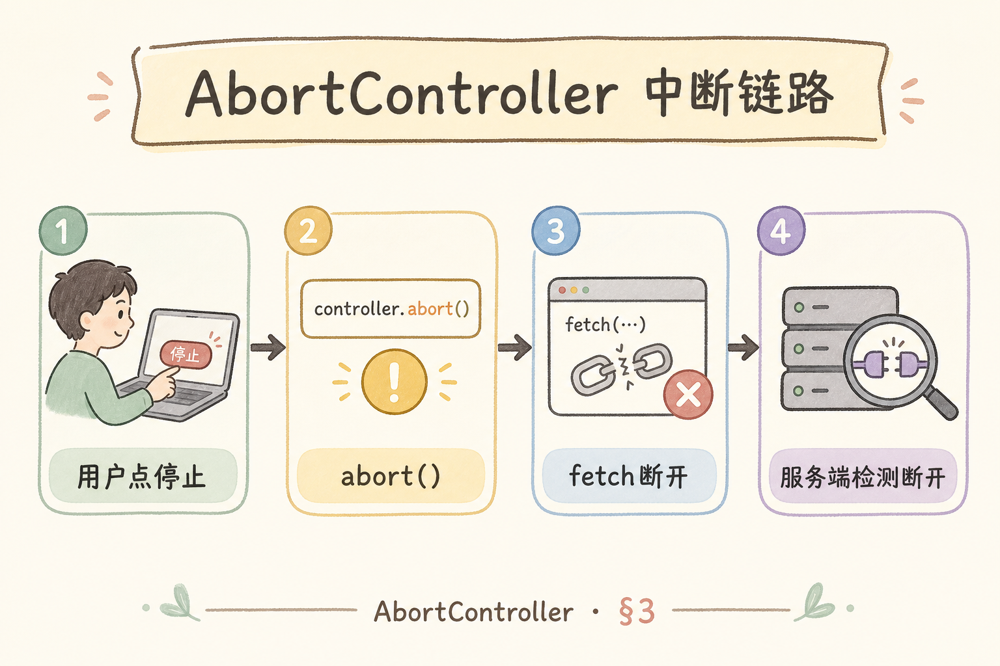
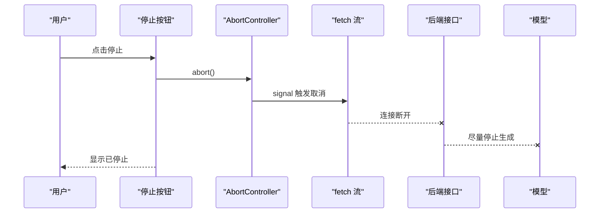
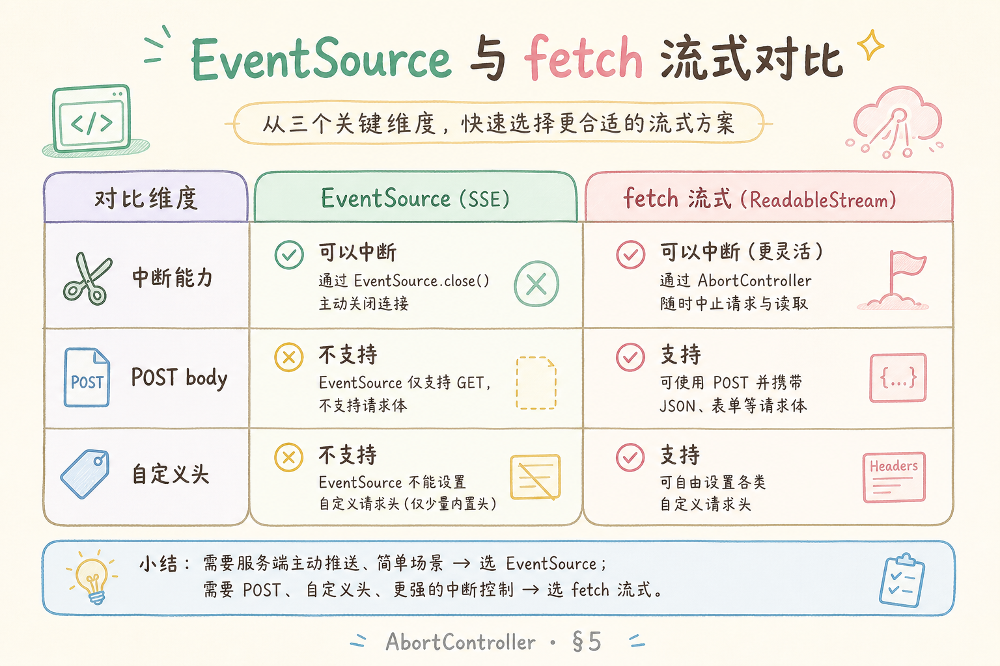
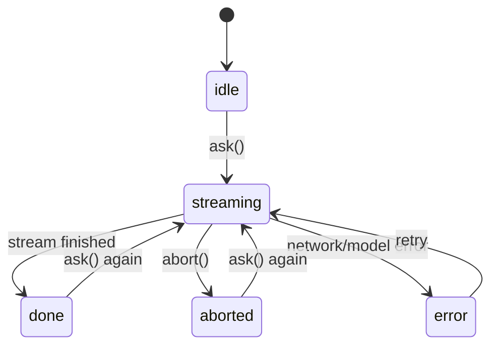

# F2 前端（五）：中断生成 AbortController 完全指南

这篇讲的是：用户点“停止生成”时，前端怎样真正取消正在进行的流式请求。很多初学者会把按钮文字改成“已停止”，但请求其实还在后台跑，模型还在生成，费用也可能还在产生。

**AbortController**：浏览器提供的请求取消控制器。
通俗说：它像一根“刹车线”，你把它传给 `fetch`，需要停止时拉一下，浏览器就会尝试中断请求。

**中断生成**：停止一次正在进行的流式回答。
通俗说：用户觉得回答方向错了，不想继续等，也不想继续消耗资源。

## 目录

- [1. 为什么停止按钮不能只改 UI](#1-为什么停止按钮不能只改-ui)
- [2. 本文边界与目标](#2-本文边界与目标)
- [3. AbortController 链路](#3-abortcontroller-链路)
- [4. fetch 流式与 EventSource 的差异](#4-fetch-流式与-eventsource-的差异)
- [5. React 状态机](#5-react-状态机)
- [6. 最小可用 Hook](#6-最小可用-hook)
- [7. 后端如何感知断开](#7-后端如何感知断开)
- [8. 常见错误](#8-常见错误)
- [9. FAQ](#9-faq)
- [10. 总结与下一步](#10-总结与下一步)

## 1. 为什么停止按钮不能只改 UI

“停止生成”至少涉及三层：前端 UI 停止追加文本，浏览器请求被取消，后端尽量停止继续生成。如果只做到第一层，用户看到是停了，但服务端可能还在跑。

这会带来三个问题：

| 问题 | 只停 UI 的后果 |
|---|---|
| 费用 | 模型继续生成，仍可能计费 |
| 并发 | 用户再次提问时，旧请求仍占资源 |
| 体验 | 旧请求晚到的片段可能污染新答案 |

所以，停止按钮应该是端到端的取消语义，而不只是一个视觉状态。

## 2. 本文边界与目标

本文重点讲前端如何用 AbortController 管理 `fetch` 流式请求，并说明后端应该怎样配合检测断开。本文不展开队列任务取消、模型厂商的内部计费规则，也不保证所有后端都能立即停止模型推理。

读完后你应该能：

- 给每次提问创建独立的 AbortController。
- 点击停止时取消当前请求。
- 区分 `aborted`、`done`、`error` 三种结局。
- 避免旧请求污染新请求。

## 3. AbortController 链路

下面这张图展示一次中断从按钮到后端的传播。读图时重点看：controller 的 `signal` 必须传进 `fetch`，否则点停止没有真正刹车。





这张图的关键结论：AbortController 是前端取消的入口，但“后端是否立刻停住模型”还要看后端实现和模型 SDK 支持。

## 4. fetch 流式与 EventSource 的差异

`EventSource` 简单，但它原生更适合 GET 请求，并且自定义 Header、POST body、中断控制都不如 `fetch` 灵活。RAG 问答通常需要传问题、会话 ID、鉴权信息，所以很多项目会选 `fetch` 读流。

| 能力 | EventSource | fetch + ReadableStream |
|---|---|---|
| 接收服务端事件 | 简单 | 需要自己读流 |
| POST JSON | 不方便 | 直接支持 |
| 自定义 Header | 受限 | 直接支持 |
| AbortController | 关闭连接可做 | 原生配合 `signal` |

初学者可以先用 `fetch`，因为它更接近普通请求，只是多了 `res.body.getReader()` 这一步。

## 5. React 状态机

停止生成时，最怕状态混乱：请求已经停止，但 UI 还显示“生成中”；或者用户又问了新问题，旧请求的最后一段文本还追加进来。

下面这张状态图可以作为实现依据：





结论：`aborted` 不是 `error`。用户主动停止不应该弹红色错误，也不应该清空已经生成的内容。

## 6. 最小可用 Hook

下面代码演示一个可中断的 Hook。前置条件：浏览器环境支持 `fetch` 和 `AbortController`；后端接口返回流式内容。

```tsx
import { useRef, useState } from "react";

type Status = "idle" | "streaming" | "done" | "aborted" | "error";

export function useAbortableRagStream() {
  const [status, setStatus] = useState<Status>("idle");
  const [content, setContent] = useState("");
  const controllerRef = useRef<AbortController | null>(null);
  const requestIdRef = useRef(0);

  async function ask(question: string) {
    const requestId = requestIdRef.current + 1;
    requestIdRef.current = requestId;

    controllerRef.current?.abort();
    const controller = new AbortController();
    controllerRef.current = controller;

    setStatus("streaming");
    setContent("");

    try {
      const res = await fetch("/api/v1/chat/stream", {
        method: "POST",
        headers: { "Content-Type": "application/json" },
        body: JSON.stringify({ question }),
        signal: controller.signal,
      });

      const reader = res.body?.getReader();
      if (!reader) throw new Error("No response body");

      while (true) {
        const { done, value } = await reader.read();
        if (done) break;
        if (requestId !== requestIdRef.current) return;
        setContent((prev) => prev + new TextDecoder().decode(value));
      }

      setStatus("done");
    } catch (err: any) {
      if (err.name === "AbortError") {
        setStatus("aborted");
        return;
      }
      setStatus("error");
    }
  }

  function stop() {
    controllerRef.current?.abort();
  }

  return { status, content, ask, stop };
}
```

这段代码里有两个关键点：每次请求都有自己的 `requestId`，避免旧请求写入新答案；`AbortError` 被当成用户主动停止，而不是系统故障。

## 7. 后端如何感知断开

前端取消请求后，后端需要尽快发现连接断开。下面是 FastAPI 的概念示例，演示在生成流里检查客户端是否断开。

```python
from fastapi import Request
from fastapi.responses import StreamingResponse


async def stream_answer(request: Request):
    async def event_generator():
        async for token in model_stream():
            if await request.is_disconnected():
                break
            yield f"data: {token}\n\n"

    return StreamingResponse(event_generator(), media_type="text/event-stream")
```

这段代码的预期行为是：如果用户关闭页面或点击停止导致连接断开，后端循环会尽快退出。真实项目还要处理模型 SDK 是否支持取消、日志如何记录、是否保留部分答案。

## 8. 常见错误

这一节列出停止生成时最常见的误解。核心判断标准是：用户点击停止后，旧请求不能继续污染界面，也不能被当成普通系统异常处理。

### 8.1 只设置 `isStopped = true`

这只能停止 UI，不会取消网络请求。正确做法是调用 `controller.abort()`。

### 8.2 多次提问共用一个 controller

共用 controller 会让一个停止按钮误伤多个请求。每次 `ask()` 都应该创建新的 controller。

### 8.3 把 AbortError 当系统错误

用户主动停止不是故障。不要弹“系统异常”，可以显示“已停止生成”。

### 8.4 停止后清空内容

通常不要清空。保留已经生成的部分更符合用户预期，也便于用户判断是否重新提问。

## 9. FAQ

**Q1：abort 后后端一定停止计费吗？**

不一定。前端只能关闭连接；模型服务是否停止计费，取决于后端 SDK 和供应商行为。工程上仍然应该尽早取消。

**Q2：停止后能继续从原位置恢复吗？**

通常不能。大多数实现会重新提问。要恢复，需要后端支持会话状态和续写控制。

**Q3：为什么要 requestId？**

网络是异步的，旧请求可能比新请求晚返回。requestId 可以阻止旧请求继续写入当前消息。

**Q4：WebSocket 也能取消吗？**

可以，但通常用一条 `cancel` 消息表达业务取消；`fetch` 流式则更依赖 AbortController。

## 10. 总结与下一步

中断生成的核心是“真取消”：按钮触发 `abort()`，`fetch` 收到 `signal`，后端尽量感知断开并停止生成。对初学者来说，先把 `streaming / done / aborted / error` 状态分清，再处理复杂的重试、恢复和多标签页。


下一篇可以继续做引用卡片 UI，让生成完成后的来源展示更可信、更可点。
