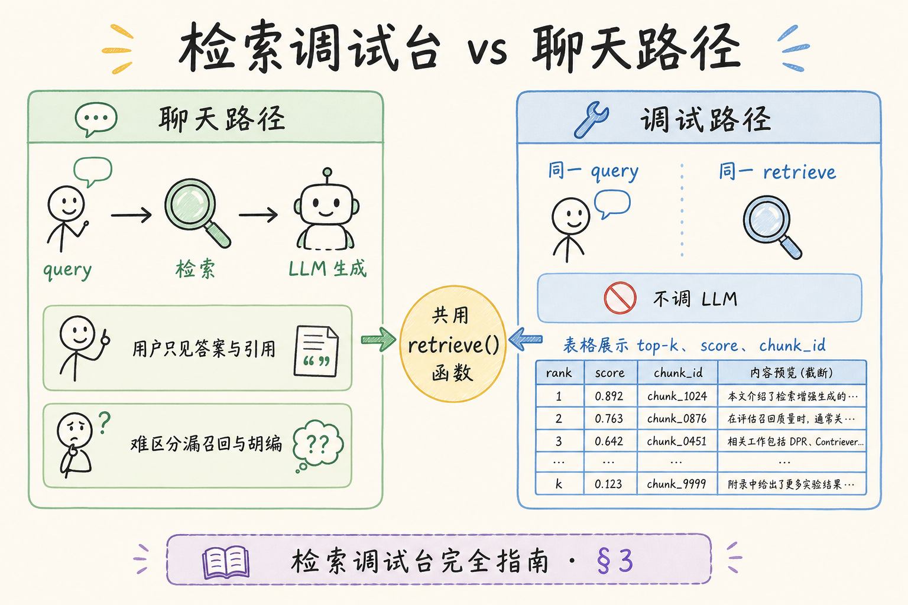
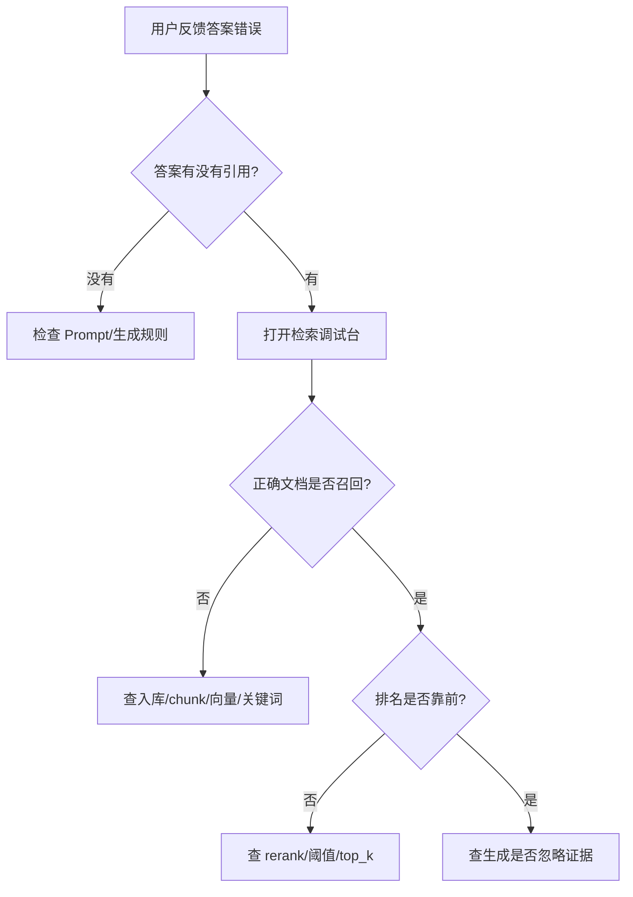
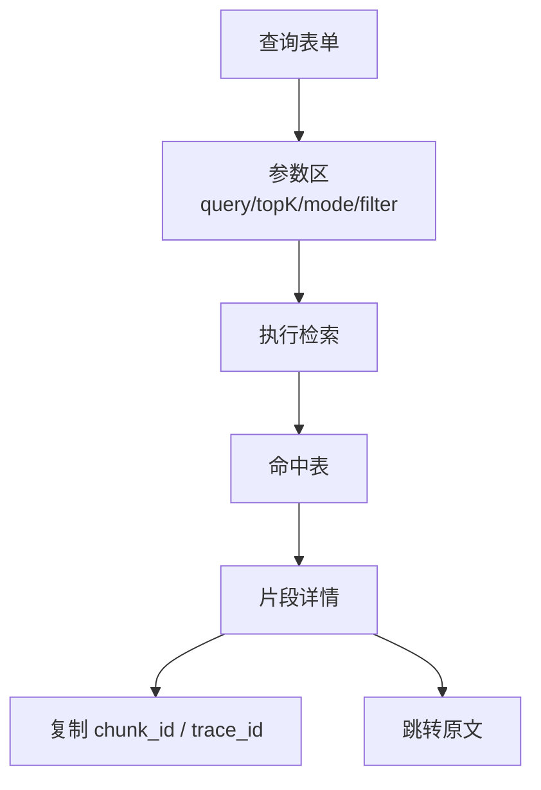
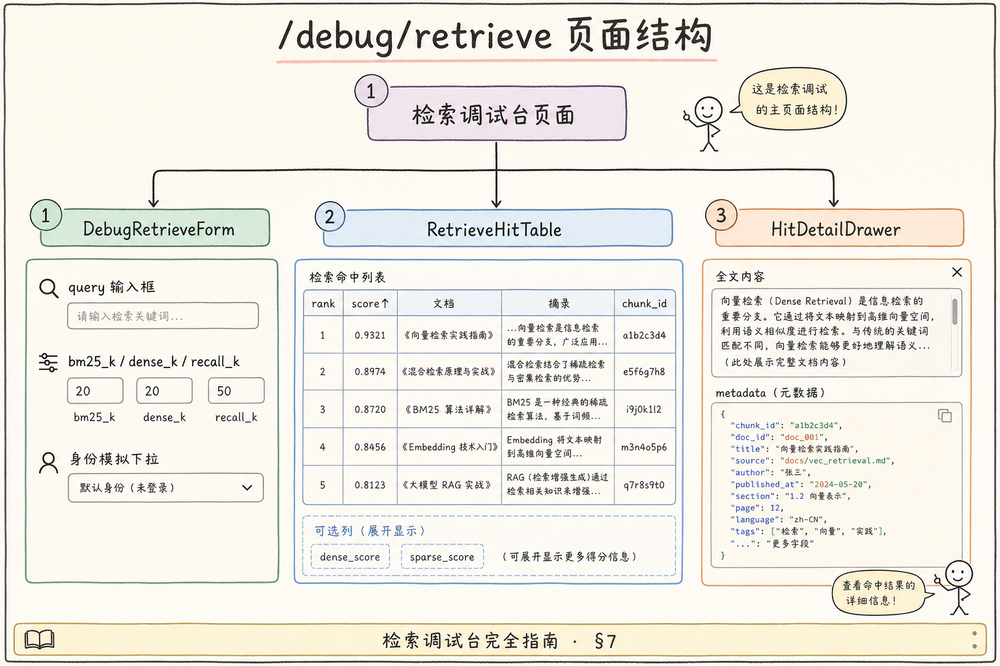
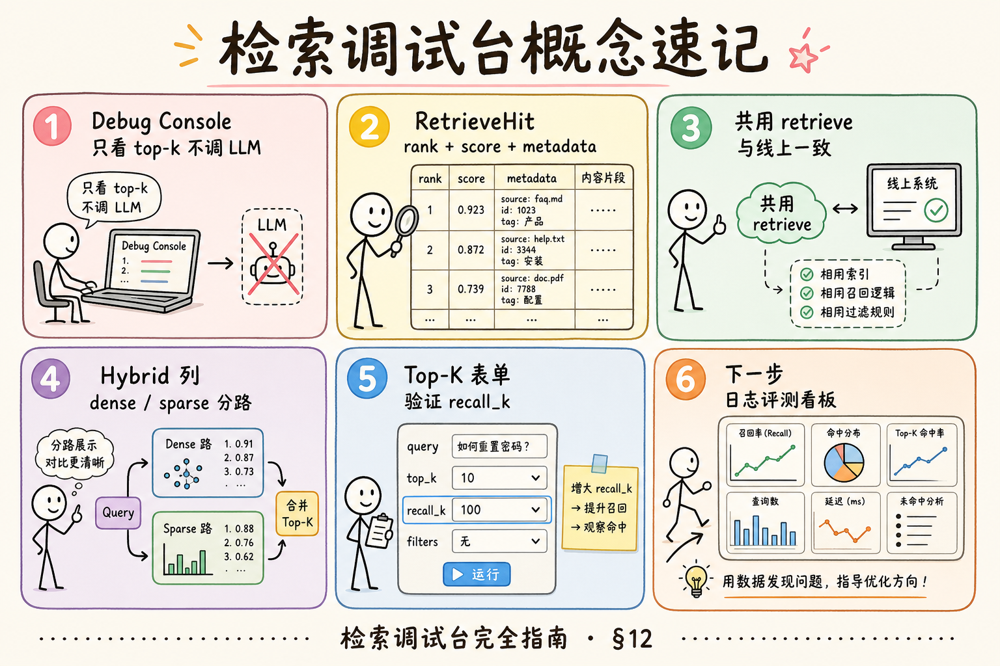

# F2 前端（十七）：检索调试台完全指南

> 聊天页面只能看到最终答案，看不出检索到底找到了什么。答案错了，可能是没召回、召回了但排序错、排序对但被模型忽略。**检索调试台**要解决的问题是：把一次 RAG 查询拆开看，让开发、运营和内容维护者能定位“问题出在检索、重排、权限还是生成”。

---

## 目录

1. [为什么需要检索调试台](#1-为什么需要检索调试台)
2. [检索调试台是什么](#2-检索调试台是什么)
3. [它解决什么问题](#3-它解决什么问题)
4. [在 RAG 排障链路中的位置](#4-在-rag-排障链路中的位置)
5. [API 契约与结果字段](#5-api-契约与结果字段)
6. [界面结构：查询表单、命中表、详情面板](#6-界面结构查询表单命中表详情面板)
7. [React 最小实现](#7-react-最小实现)
8. [常见陷阱与 FAQ](#8-常见陷阱与-faq)
9. [总结](#9-总结)

---

## 1. 为什么需要检索调试台

RAG 答案质量问题通常不止一种原因：

- 文档没有入库；
- chunk 切得太碎或太长；
- 向量召回找错了；
- 关键词检索漏了；
- reranker 排序不合理；
- 权限过滤把正确文档过滤掉；
- 模型拿到了证据但没有引用。

如果只看聊天页，所有问题都会表现成“答案不对”。检索调试台的价值是把黑盒拆成可观察的中间结果。

### 1.1 单条 bad case 拆解时限

目标：**2 分钟内**判断问题落在检索、重排、权限还是生成。若超过 5 分钟仍在猜，说明调试台缺字段（如无 `aclPassed`）或未与 `trace_id` 贯通日志。上线前应拿 3 个已知 case（故意未入库、故意排后面、故意 ACL 拒绝）做验收。

---

## 2. 检索调试台是什么

**检索调试台**：一个内部页面，允许输入 query、top_k、知识库、过滤条件等参数，直接查看检索命中的文档片段、分数、来源、权限和 trace_id。

通俗说，它像搜索引擎的“开发者模式”：普通用户看答案，维护者看答案背后的证据是怎么来的。

调试台的第一用户是内容维护者与值班工程，不是数据科学家。设计时应默认展示“能促成下一步动作”的字段：排名、snippet、aclPassed、chunk_id，而不是堆满 embedding 维度。新同事 onboarding 时给三个标准 bad case 练手（未入库、ACL 误杀、rerank 排反），能在十分钟内建立“先检索后生成”的排障肌肉记忆，比阅读长篇架构文档更快见效。


调试台不是给终端用户使用的聊天入口，而是给团队排查 RAG 质量问题的工具。

---

## 3. 它解决什么问题

| 问题 | 调试台应该展示什么 |
|---|---|
| 没召回 | 命中为空、过滤条件、知识库范围 |
| 召回错文档 | hit 的标题、chunk 文本、相似度 |
| 排序不对 | 原始分数、rerank 分数、最终排名 |
| 权限异常 | ACL 命中情况、用户身份、租户 |
| 引用不对 | chunk_id、source_url、document_id |
| 参数不稳 | top_k、阈值、检索模式对比 |

调试台的目标不是替代评测系统，而是让单个 bad case 能被快速拆解。

当评测看板显示整体 precision 下降时，调试台负责把曲线上的尖刺还原成具体 query：是某份新文档 chunk 切坏了，还是 reranker 版本回退。建议为调试台单独配一套与线上一致的默认参数快照，并在 URL 支持分享 `?kb=&topK=&mode=`，方便工单里一键复现。没有可复现链接，团队会在聊天里来回粘贴截图，信息丢失且无法审计。

### 3.1 案例：权限误杀 vs 真没召回

运营反馈：“退款政策”问答总答错。在调试台用**同一租户、同一用户身份**重放 query，发现排名第 3 的 chunk 文本正确但 `aclPassed: false`。根因是文档 metadata 的 `department` 与当前用户不匹配，而非向量没召回到。修复权限规则后，无需改 Embedding；若 hit 列表为空，才进入入库/chunk/向量排查路径。

### 3.2 与评测看板的分工

| 工具 | 粒度 | 典型问题 |
|------|------|----------|
| 检索调试台 | 单 query | 这条为何没召回 |
| 日志（190） | 单 request_id | API 超时还是检索失败 |
| 评测看板（184） | 批量样本 | 换 reranker 后整体 precision 是否下降 |



---

## 4. 在 RAG 排障链路中的位置



这张图说明：调试台主要负责“检索和排序”这一段。如果正确证据已经排在前面，但模型仍答错，就应该去看 Prompt 和生成链路。

实践中可给维护者一张 laminated 卡片式流程：无引用 → 生成；有引用但错 → 看 rank1 文本是否支撑答案；rank1 对但答错 → Prompt/cite 规则；正确文档不在 hits → 入库/chunk/向量。调试台把这张卡片变成可点击的界面。与 [184 评测看板](184.admin-log-eval-dashboard-tutorial.md) 互跳 `trace_id` 时，应保证两侧 topK 与 mode 一致，否则会出现“看板里差评、调试台却搜得到”的撕裂感。

### 4.1 下钻顺序建议

1. 从用户差评或 trace 列表复制 `trace_id`
2. 在调试台用**相同 query + 相同过滤条件**重放
3. 正确文档是否在 hits 中？否 → 查入库、chunk、混合检索权重
4. 在但排名低？→ 调 top_k、阈值、reranker
5. 排名第一仍答错？→ 查 Prompt、引用规则、模型行为

---

## 5. API 契约与结果字段

请求示例：

```json
{
  "query": "退款政策是否支持 7 天内申请？",
  "knowledgeBaseId": "kb_123",
  "topK": 8,
  "mode": "hybrid",
  "filters": {
    "tenantId": "tenant_a"
  }
}
```

响应示例：

```json
{
  "traceId": "tr_001",
  "hits": [
    {
      "rank": 1,
      "documentId": "doc_9",
      "chunkId": "chk_18",
      "title": "退款政策",
      "snippet": "用户可在签收后 7 天内申请退款...",
      "score": 0.82,
      "rerankScore": 0.91,
      "sourceUrl": "/docs/refund",
      "aclPassed": true
    }
  ]
}
```

字段说明：

| 字段 | 用途 |
|---|---|
| `traceId` | 贯通日志、评测和聊天请求 |
| `rank` | 最终排序 |
| `score` | 初始召回分数 |
| `rerankScore` | 重排后的分数 |
| `snippet` | 命中的 chunk 文本 |
| `aclPassed` | 是否通过权限过滤 |
| `sourceUrl` | 跳回原文位置 |

分数要配解释。初学者不要把 `0.82` 当成“82 分正确率”，它只是当前检索算法下的相似度或相关性信号。

### 5.1 建议补充的调试字段

除示例外，生产调试 API 宜增加：`retrievalMode`（vector / keyword / hybrid）、`filteredOutCount`（被 ACL 或 metadata 滤掉的数量）、`embeddingModel`、`indexVersion`。这些字段不进终端用户界面，但能让“版本回退”对比有据可依。

### 5.2 与线上聊天参数对齐

调试台必须能复现线上请求：同一 `knowledgeBaseId`、`topK`、`mode`、租户过滤。若调试台默认 hybrid 而线上只用 vector，会出现“调试台能搜到、线上搜不到”的假象。最好在 API 支持 `traceId` 入参，直接拉取该次请求的检索参数快照。

---

## 6. 界面结构：查询表单、命中表、详情面板



页面建议分成三块：

| 区域 | 内容 |
|---|---|
| 查询表单 | query、知识库、top_k、模式、过滤条件 |
| 命中表 | rank、标题、分数、来源、权限状态 |
| 详情面板 | chunk 全文、metadata、引用链接、trace_id |

空状态也要认真设计：

- 没输入 query：提示输入要调试的问题；
- 无结果：展示当前过滤条件，并建议放宽 top_k 或检查入库；
- 接口失败：展示 trace_id 和错误码；
- 权限不足：说明需要管理员或维护者权限。

### 6.1 命中表交互细节

- 行点击展开详情抽屉，展示 chunk 全文与 metadata JSON
- 提供“复制 chunk_id / trace_id”一键按钮，方便贴到日志平台或 bad case 工单
- 支持“在原文中打开”深链，核对切块边界是否切断语义
- 可选：并排对比两次检索（调参前 vs 调参后），用于验收 rerank 或 top_k 变更

### 6.2 空结果排错清单

- [ ] 知识库 ID 是否与线上一致
- [ ] 过滤条件是否过严（日期、标签、租户）
- [ ] 文档是否 `indexed` 状态（非 queued / failed）
- [ ] 混合检索是否某一通道整体失败（看日志 `retrieval_finished`）

---

## 7. React 最小实现

下面示例只演示核心交互：输入 query，提交后展示 hits。



```tsx
import { useState } from "react";

type Hit = {
  rank: number;
  title: string;
  snippet: string;
  score: number;
  rerankScore?: number;
  sourceUrl?: string;
};

export function RetrievalDebugConsole() {
  const [query, setQuery] = useState("");
  const [hits, setHits] = useState<Hit[]>([]);
  const [loading, setLoading] = useState(false);
  const [error, setError] = useState<string | null>(null);

  async function runDebugSearch() {
    setLoading(true);
    setError(null);

    try {
      const res = await fetch("/api/debug/retrieve", {
        method: "POST",
        headers: { "Content-Type": "application/json" },
        body: JSON.stringify({ query, topK: 8, mode: "hybrid" }),
      });

      if (!res.ok) throw new Error(`HTTP ${res.status}`);
      const data = (await res.json()) as { hits: Hit[] };
      setHits(data.hits);
    } catch (err) {
      setError(err instanceof Error ? err.message : "检索失败");
    } finally {
      setLoading(false);
    }
  }

  return (
    <main>
      <textarea value={query} onChange={(e) => setQuery(e.target.value)} />
      <button onClick={runDebugSearch} disabled={!query.trim() || loading}>
        {loading ? "检索中..." : "运行调试检索"}
      </button>
      {error ? <p role="alert">{error}</p> : null}
      <ol>
        {hits.map((hit) => (
          <li key={`${hit.rank}-${hit.title}`}>
            <strong>#{hit.rank} {hit.title}</strong>
            <p>{hit.snippet}</p>
            <small>score={hit.score} rerank={hit.rerankScore ?? "-"}</small>
          </li>
        ))}
      </ol>
    </main>
  );
}
```

真实项目要继续补上知识库选择、过滤条件、分页、详情抽屉和复制 trace_id。

示例未包含 `traceId` 回显与按 trace 重放，而这是生产调试台与线上一致性的关键。建议在响应区顶部固定展示 `traceId`，并提供“复制到剪贴板”与“在评测看板打开”两个动作。加载态要区分“检索中”与“rerank 中”，否则维护者会把 rerank 超时误判为向量库宕机。错误信息避免只显示 `HTTP 500`，应透出后端 `error_code` 便于与日志对齐。

### 7.1 权限与脱敏

调试台页面应挂在 `/admin` 或内网 VPN 后。列表中的 `snippet` 可能含 PII，导出 hit 列表需二次确认。与 [195](195.pii-redaction-rag-tutorial.md) 的脱敏策略一致：默认展示片段，完整 chunk 仅高权限角色可见。

---

## 8. 常见陷阱与 FAQ

检索调试台的价值在于暴露中间证据，但这也意味着它更容易泄露内部信息。下面这些陷阱需要在权限、字段展示和排障流程上提前约束。

### 8.1 错：把调试台开放给普通用户

调试台会暴露 chunk、分数、metadata 和权限信息，应该放在内部后台，并受角色控制。

### 8.2 错：只展示最终答案

如果调试台仍然只展示答案，它就和聊天页没区别。必须展示命中片段、分数和来源。

### 8.3 错：忽略权限过滤

很多“没召回”其实是 ACL 把文档过滤掉了。调试台必须显示当前身份和权限过滤结果。

### 8.4 FAQ：需要展示 embedding 向量吗？

通常不需要。向量本身对人不可读。更有用的是 chunk 文本、分数、rank、metadata 和检索模式。

### 8.5 FAQ：调试台和评测看板有什么区别？

调试台看单个 case，适合排障；评测看板看一批样本，适合判断整体质量趋势。

### 8.6 排错：分数很高但文本明显无关

可能是 Embedding 与领域不匹配、或 chunk 过短导致语义漂移。用详情面板看 metadata 与切块边界；对比 keyword 通道是否有正确标题命中。必要时对该文档触发 [重建索引](181.reindex-ui-tutorial.md) 并换 chunk 策略。

### 8.7 排错：与线上下结果不一致

逐项核对：用户身份模拟、知识库范围、top_k、mode、索引版本时间戳。最常见遗漏是调试台用管理员身份绕过了 ACL。

### 8.8 评测：调试台验收标准

| 项 | 标准 |
|----|------|
| 重放 | 给定 trace_id 可还原参数与 hits |
| 时效 | 维护者 2 分钟内完成单 case 分类 |
| 安全 | 普通用户无路由；snippet 受 RBAC |
| 可操作 | 可复制 id、可跳原文、空状态有指引 |

---

## 9. 总结

检索调试台让 RAG 排障从“猜模型为什么答错”变成“逐段看证据怎么来的”。

是否达标可以用一个简单指标衡量：维护者拿到 `trace_id` 后，能否在两分钟内说出问题属于召回、排序、权限还是生成，并指向下一步负责人。达不到时，优先补字段（aclPassed、indexVersion、filteredOutCount）而不是加更多图表。调试台上线后，建议每周用真实差评做十分钟 drill，防止功能腐化成“只能看不能改参数”的只读镜像。



最小可落地方案是：

1. 提供 debug retrieve API；
2. 展示 query、top_k、mode 和过滤条件；
3. 展示命中 chunk、分数、来源和权限状态；
4. 支持复制 trace_id、chunk_id；
5. 明确权限边界，只给内部维护角色使用。

当团队能在 2 分钟内判断一个 bad case 是召回、排序、权限还是生成问题，RAG 质量迭代速度会明显提升。

### 9.1 本篇检查清单

- [ ] 内部专用路由 + 角色控制
- [ ] 展示 hits、分数、rerank、ACL、trace_id
- [ ] 支持按 trace_id 或参数重放线上请求
- [ ] 空结果与接口失败有明确下一步
- [ ] 与日志、评测看板通过 trace_id 串联
- [ ] snippet 与导出符合脱敏策略
