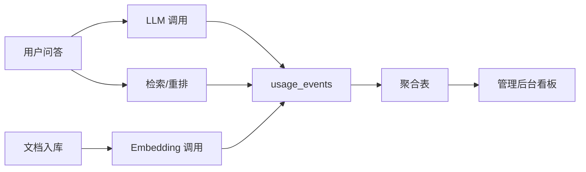
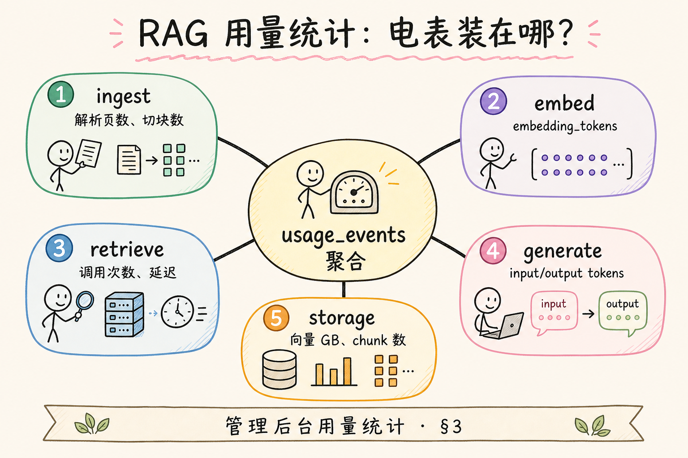
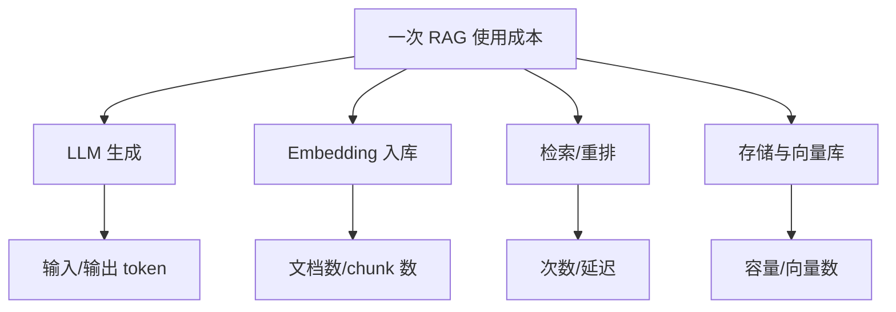
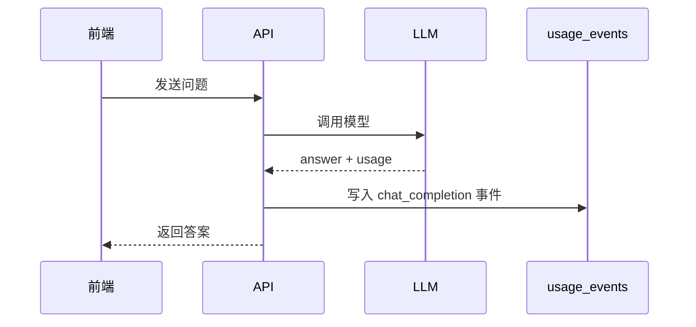
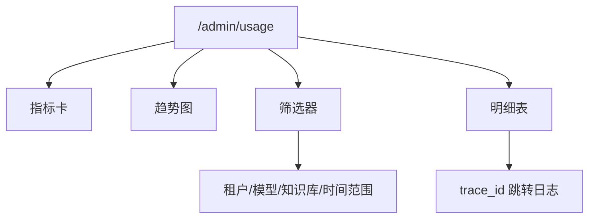
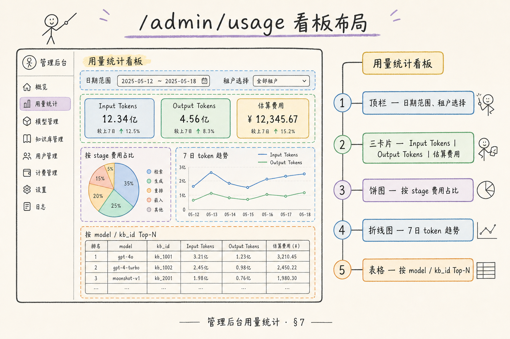
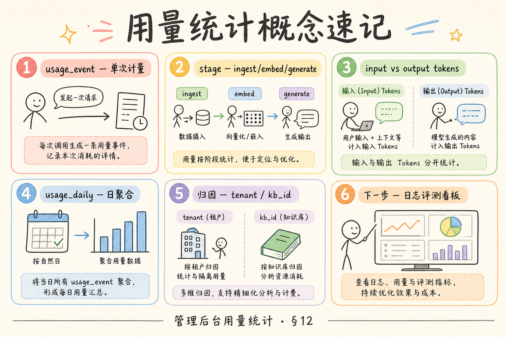

# F2 前端（十八）：管理后台用量统计完全指南

> RAG 系统上线后，团队很快会遇到一个现实问题：谁在用、用了多少、钱花在哪里、有没有异常请求。**用量统计看板**要解决的问题是：把 Token、Embedding、检索、存储等成本拆成可观察的数据，让产品、运营、工程和财务能围绕同一组事实做决策。

---

## 目录

1. [为什么需要用量统计看板](#1-为什么需要用量统计看板)
2. [用量统计是什么](#2-用量统计是什么)
3. [它解决什么问题](#3-它解决什么问题)
4. [应该统计哪些指标](#4-应该统计哪些指标)
5. [埋点与数据模型](#5-埋点与数据模型)
6. [看板界面结构](#6-看板界面结构)
7. [React 最小实现](#7-react-最小实现)
8. [常见陷阱与 FAQ](#8-常见陷阱与-faq)
9. [总结](#9-总结)

---

## 1. 为什么需要用量统计看板

没有用量统计时，团队只能靠账单和感觉判断系统成本。账单告诉你“总共花了多少钱”，但很难回答：

- 哪个租户或部门成本最高；
- 是生成 Token 贵，还是 Embedding 批处理贵；
- 哪些请求异常地长；
- 新功能上线后成本是否上升；
- 成本优化是否真的有效；
- 是否有人在滥用或误用系统。

用量统计看板的目标不是做精确财务结算，而是让团队能看到成本和使用行为之间的关系。

### 1.1 从“账单震惊”到可行动归因

典型场景：月底 OpenAI 账单环比 +40%。没有看板时会议只能猜“是不是用户变多了”。有 `usage_events` 后，下钻发现某租户三天内 `embedding_batch` 事件激增——对应一次错误配置的“全库重复入库”脚本。看板的价值是把猜测变成 **租户 × 事件类型 × 时间** 三维筛选。

---

## 2. 用量统计是什么

**用量统计**：记录每次 RAG 请求、索引任务和模型调用消耗了多少资源，并按用户、租户、知识库、模型、时间等维度聚合展示。

通俗说，它像水电表。水电表不解释你为什么用水，但它能告诉你谁用了、什么时候用了、用了多少、是否突然暴涨。



读图时重点看 `usage_events`：它是所有用量事件的原始账本。看板应该基于事件聚合，而不是只读厂商最终账单。

事件账本的价值在于事后可按新维度重算：今天按租户看，明天按知识库看，不必改埋点。若只存日聚合表，一旦出现“某模型占比异常”却无法下钻到 trace，排障会退回 grep 日志。建议 `usage_events` 保留至少九十天热数据、更久冷归档，并与 [184 评测看板](184.admin-log-eval-dashboard-tutorial.md) 共用 `trace_id`，从“贵”跳到“答得差”只需一次点击。

---

## 3. 它解决什么问题

| 问题 | 看板应该回答 |
|---|---|
| 成本归因 | 哪个租户、知识库、模型消耗最多 |
| 异常发现 | 是否出现 Token 暴涨或请求风暴 |
| 产品判断 | 哪些功能被频繁使用 |
| 成本优化 | 调整 top_k 或模型路由后是否省钱 |
| 内部对账 | 厂商账单和应用内统计是否接近 |
| 多租户运营 | 是否需要限额、套餐或 chargeback |

用量统计的价值在于“可解释”。只知道总成本上涨 30% 没有用，知道“某租户导入了 2GB 文档导致 embedding 成本上涨”才可行动。

看板评审时应能回答三个问题：谁花的、花在哪类事件、是否异常。RAG 成本常被误归为“LLM 太贵”，实际上 embedding 批处理与重复重建索引在不少团队占比更高——要把 `embedding_batch` 单独拉一条趋势线，否则优化方向会跑偏。与 [182 调试台](182.retrieval-debug-console-tutorial.md) 联动时，高 prompt_tokens 的 trace 应能一键查看当时 top_k 与进 prompt 段数，把“贵”与“检索配置”钉死在同一条证据上。

### 3.1 异常模式识别

| 信号 | 可能原因 | 建议动作 |
|------|----------|----------|
| `chat_completion` 请求数突增 | 爬虫、脚本循环、新功能未限流 | 查 trace_id 明细，加 rate limit |
| 单请求 prompt_tokens 极高 | top_k 过大、context 未截断 | 调检索参数，看 [182](182.retrieval-debug-console-tutorial.md) |
| `embedding_batch` 与文档数不成比例 | 重复索引、未去重 content_hash | 查 Worker 日志与重建任务 |
| 某模型占比异常 | 路由配置错误或 fallback 全开 | 对比模型维度趋势 |



---

## 4. 应该统计哪些指标

初学者可以从四类指标开始。

| 类型 | 指标 | 说明 |
|---|---|---|
| 生成 | prompt_tokens、completion_tokens、model | LLM 问答成本 |
| 嵌入 | embedding_tokens、document_count、chunk_count | 文档入库成本 |
| 检索 | retrieve_count、rerank_count、latency_ms | 检索负载与延迟 |
| 存储 | document_size、chunk_count、vector_count | 知识库规模 |



不要一开始就追求“精确到分”。早期看板更重要的是发现趋势、异常和归因方向。

指标卡上的“估算成本”应与财务账单允许偏差，但 **环比突变** 必须可信。发布日对比时，把 deploy 标记叠在趋势图上，能一眼看出新 rerank 或更大 top_k 是否带来 token 台阶。若环比涨但请求数 flat，优先查单请求 prompt_tokens P99，而不是怀疑厂商涨价——这类 case 常与 [98 Top-K](98.top-k-retrieval-tutorial.md) 或上下文未截断有关。

### 4.1 估算成本公式（后端统一）

前端只展示 `estimated_cost`，规则集中在后端，例如：`prompt_tokens * price_in + completion_tokens * price_out`，Embedding 按 `embedding_tokens` 计价。模型单价变更时改一处配置，避免 React 与报表服务各算各的。与厂商账单允许 ±5% 漂移，看板用于 **趋势与归因**，不替代财务结算。

---

## 5. 埋点与数据模型

用量统计应该尽量记录事件，而不是只记录聚合结果。事件便于后续按新维度重新统计。

一个最小表结构：

```sql
create table usage_events (
  id bigserial primary key,
  occurred_at timestamptz not null,
  tenant_id text not null,
  user_id text,
  event_type text not null,
  model text,
  prompt_tokens integer default 0,
  completion_tokens integer default 0,
  embedding_tokens integer default 0,
  retrieve_count integer default 0,
  rerank_count integer default 0,
  document_id text,
  knowledge_base_id text,
  trace_id text
);
```

事件类型可以先控制在几类：

| event_type | 触发时机 |
|---|---|
| `chat_completion` | 每次生成答案后 |
| `embedding_batch` | 文档入库或重建索引后 |
| `retrieve` | 每次检索后 |
| `rerank` | 每次重排后 |

埋点位置建议如下：



注意：usage 事件不要记录完整 Prompt 原文。需要排障时，用 `trace_id` 关联日志，并对日志做脱敏和保留期控制。

### 5.1 事件写入失败怎么办

用量埋点不应阻塞主路径。推荐：API 在返回答案后异步写 `usage_events`；写失败打 `usage_write_failed` 结构化日志并丢进补偿队列。否则 LLM 超时与 DB 写入失败耦合，用户既没答案又难对账。

### 5.2 与 Prometheus 的对照

| 维度 | usage_events | Prometheus |
|------|--------------|------------|
| 业务归因 | tenant、user、kb | 通常只有 route、status |
| 成本 | token 级估算 | 需自行用 histogram 近似 |
| 告警 | 适合日级报表 | 适合分钟级 P95 |

两者通过 `trace_id` 与时间窗口互证：指标异常 → 用量明细 → 日志下钻。

---

## 6. 看板界面结构

管理后台可以分成四块：

| 区域 | 作用 |
|---|---|
| 顶部指标卡 | 今日请求数、Token、估算成本、异常数 |
| 趋势图 | 按日/小时展示成本和请求趋势 |
| 维度下钻 | 按租户、模型、知识库、用户筛选 |
| 明细表 | 展示高成本请求和 trace_id |



界面默认不要展示太多列。建议默认列：

运营日常最常用的是“高成本 outlier 表”，而不是全量明细。默认可筛 `total_tokens > P99` 或 `estimated_cost > 租户日均三倍`，行内链到 trace 详情。若列表只有聚合没有 outlier，团队会在月底才发现某脚本循环调用 embedding。时间范围默认七天，发布或大促时切小时粒度，与 Prometheus QPS 曲线对照，可区分“流量涨”还是“单次变贵”。

- 时间；
- 租户；
- event_type；
- model；
- total_tokens；
- estimated_cost；
- trace_id。

更多字段放到详情抽屉里。

### 6.1 顶部指标卡建议

- 今日请求数 / 昨日环比
- 今日总 token（生成 + 嵌入）
- 估算成本（USD 或本位币）
- 异常事件数（如单请求 token > P99 阈值）

趋势图默认 7 天，支持切换小时粒度用于发布日对比。维度下钻至少支持：租户、模型、`event_type`、知识库。

---

## 7. React 最小实现

下面示例演示一个最小用量列表。真实项目中还需要日期筛选、分页和图表组件。



```tsx
import { useEffect, useState } from "react";

type UsageRow = {
  id: string;
  occurredAt: string;
  tenantId: string;
  eventType: string;
  model?: string;
  totalTokens: number;
  estimatedCost: number;
  traceId?: string;
};

export function UsageDashboard() {
  const [rows, setRows] = useState<UsageRow[]>([]);
  const [loading, setLoading] = useState(true);

  useEffect(() => {
    async function loadUsage() {
      const res = await fetch("/api/admin/usage?range=7d");
      const data = (await res.json()) as { rows: UsageRow[] };
      setRows(data.rows);
      setLoading(false);
    }

    loadUsage();
  }, []);

  if (loading) return <p>加载中...</p>;

  return (
    <table>
      <thead>
        <tr>
          <th>时间</th>
          <th>租户</th>
          <th>类型</th>
          <th>模型</th>
          <th>Token</th>
          <th>估算成本</th>
        </tr>
      </thead>
      <tbody>
        {rows.map((row) => (
          <tr key={row.id}>
            <td>{row.occurredAt}</td>
            <td>{row.tenantId}</td>
            <td>{row.eventType}</td>
            <td>{row.model ?? "-"}</td>
            <td>{row.totalTokens}</td>
            <td>{row.estimatedCost.toFixed(4)}</td>
          </tr>
        ))}
      </tbody>
    </table>
  );
}
```

这个示例只展示数据，不负责计算。成本换算应在后端完成，避免前端散落价格规则。

生产还要处理：空状态（新租户无事件）、加载失败重试、时区与 `occurred_at` 筛选一致。列表 `trace_id` 列应可点击跳转日志平台；若只展示数字不可点，看板会退化成“只能看不能查”的报表。高成本行背景色标注时，注意 RBAC——运营可见租户级汇总，工程才可见 trace 全文，避免用量排障变成 PII 泄露通道。

### 7.1 明细行与 trace 跳转

`trace_id` 列应链到日志平台或内部 trace 详情（见 [184](184.admin-log-eval-dashboard-tutorial.md)）。高成本行可用背景色标注（如超过租户日均 3 倍），方便运营一眼看到 outlier。

---

## 8. 常见陷阱与 FAQ

用量看板最常见的问题，是把“粗略运营统计”误当成“完整财务账单”，或者为了排障记录过多敏感内容。下面这些点决定了看板能否长期安全使用。

### 8.1 错：直接用厂商账单当看板

厂商账单通常缺少业务维度。应用内看板要记录 tenant、user、knowledge_base、trace_id，才能做归因。

### 8.2 错：只看总成本

总成本上升可能是用户增长，也可能是异常请求。要同时看请求数、平均 token、P95 token 和高成本明细。

### 8.3 错：把完整 Prompt 写进 usage 表

usage 表是统计账本，不是调试日志。不要把用户问题和检索片段全量写进去，避免 PII 和敏感信息扩散。

### 8.4 FAQ：估算成本和厂商账单不一致怎么办？

允许有小差异。看板用于运营和排障，财务结算仍以厂商账单为准。关键是趋势和归因要稳定。

### 8.5 FAQ：什么时候需要限额？

当你能按租户或用户稳定统计用量后，再做限额、套餐或告警。没有统计就做限额，很容易误伤正常用户。

### 8.6 排错：看板全零但系统在跑

检查埋点是否上线、事件类型拼写是否一致、`occurred_at` 时区是否导致筛选窗口错位。用 SQL `count(*) group by event_type` 对比 API 层日志中的 `chat_completion` 数量。

### 8.7 排错：估算成本与账单差很大

核对：是否漏记 `embedding_batch`、是否重复计数重试请求、模型单价表是否含缓存折扣。财务仍以厂商账单为准，修的是 **归因逻辑** 而非强行平账。

### 8.8 评测：看板可用性验收

| 项 | 标准 |
|----|------|
| 归因 | 能答出 top3 租户/模型成本 |
| 时效 | 事件延迟 < 5 分钟（或标明 T+1） |
| 安全 | 无完整 prompt；管理员 RBAC |
| 联动 | trace_id 可跳到排障链路 |

---

## 9. 总结

用量统计看板的核心是把“钱花在哪里”变成可追踪事实。

没有 trace 下钻的看板，月底会议只能停留在“好像 embedding 变贵了”。把高成本 outlier、租户维度趋势与 `trace_id` 跳转做扎实，团队才能把限额、模型路由、top_k 优化排上优先级，而不是笼统地“换更便宜的模型”。与 Prometheus 指标互证时，记住用量事件适合日级归因，指标适合分钟级告警，两者互补而非重复建设。



最小落地方案：

1. 记录 `usage_events` 原始事件；
2. 覆盖生成、Embedding、检索、存储四类指标；
3. 按租户、模型、知识库、时间聚合；
4. 后端计算估算成本，前端负责展示；
5. 明细行保留 `trace_id`，但不保存完整 Prompt；
6. 用趋势和高成本明细指导 Token 优化、模型路由和限额策略。

做到这一步后，团队就能把成本讨论从“感觉很贵”推进到“哪个功能、哪个租户、哪个模型导致贵”。

### 9.1 本篇检查清单

- [ ] `usage_events` 覆盖 chat、embedding、retrieve、rerank
- [ ] 后端统一估算成本，前端只展示
- [ ] 按租户/模型/知识库/时间聚合与下钻
- [ ] 明细含 trace_id，不写完整 prompt
- [ ] 埋点异步不阻塞主路径，失败可补偿
- [ ] 与指标、日志可交叉验证异常
