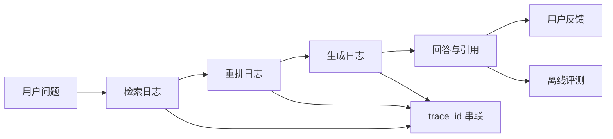
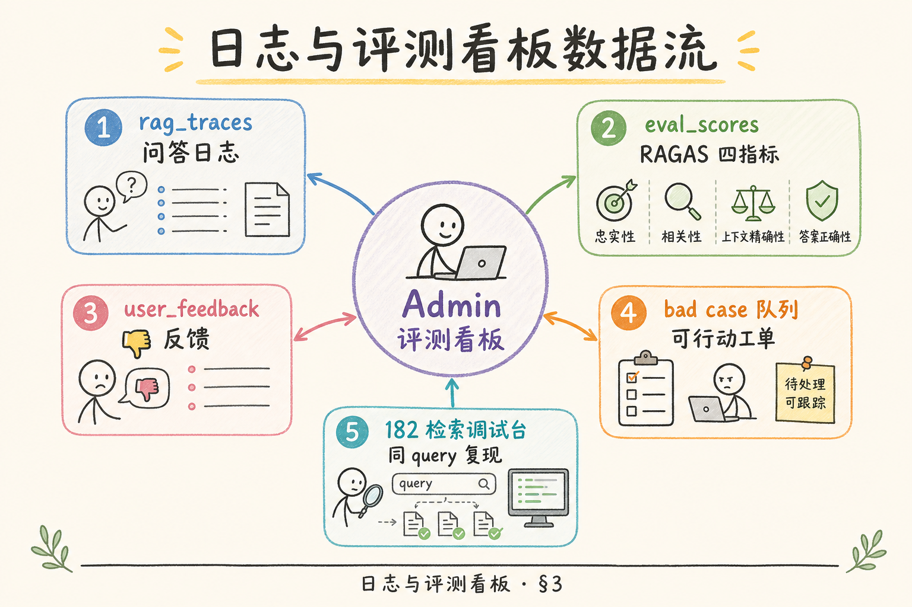
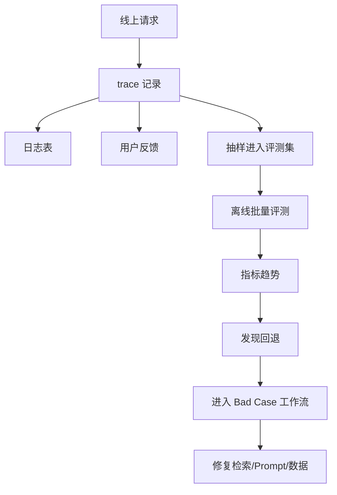
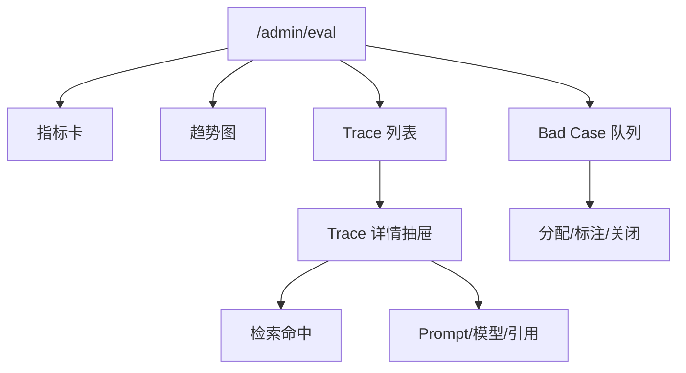
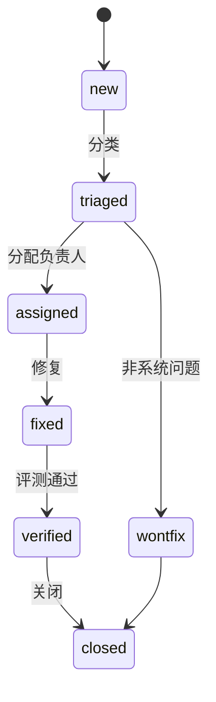
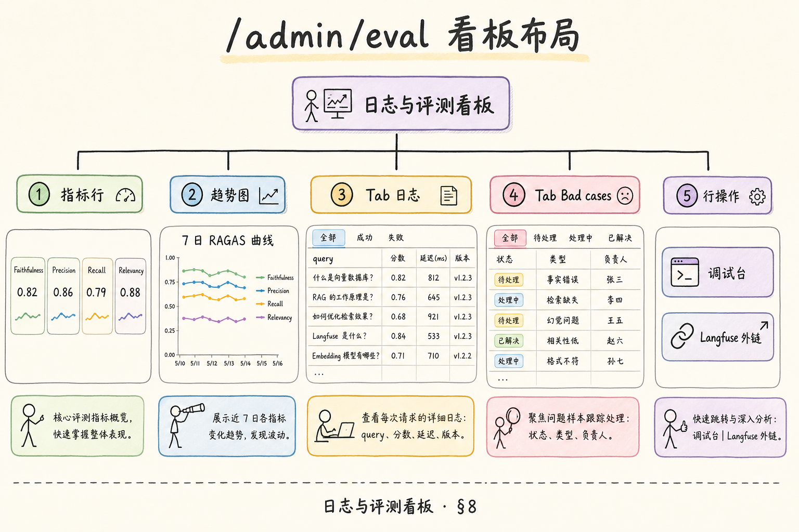

# F2 前端（十九）：管理后台日志与评测看板完全指南

> 用量看板告诉你“花了多少钱”，但不能告诉你“答案好不好”。RAG 系统需要同时看日志、trace、用户反馈和评测分数。**日志与评测看板**要解决的问题是：把单次问答的证据链和批量质量指标放到同一个后台里，让团队能发现坏 case、定位原因、验证修复是否有效。

---

## 目录

1. [为什么需要日志与评测看板](#1-为什么需要日志与评测看板)
2. [日志、Trace、评测是什么](#2-日志trace评测是什么)
3. [它解决什么问题](#3-它解决什么问题)
4. [RAG 质量观测链路](#4-rag-质量观测链路)
5. [数据模型与关键字段](#5-数据模型与关键字段)
6. [看板界面结构](#6-看板界面结构)
7. [Bad Case 工作流](#7-bad-case-工作流)
8. [React 最小实现](#8-react-最小实现)
9. [常见陷阱与 FAQ](#9-常见陷阱与-faq)
10. [总结](#10-总结)

---

## 1. 为什么需要日志与评测看板

RAG 答案变差时，用户通常只会说“答得不对”。团队需要继续追问：

- 是检索没找到正确文档；
- 是找到了但排序太低；
- 是模型没有引用证据；
- 是答案格式不符合要求；
- 是用户问题本身超出知识库；
- 是新版本 prompt 或 reranker 造成回退。

日志与评测看板的目标是把这些判断从口头讨论变成可查询的证据。

### 1.1 质量回退的典型一周

周一发布新 reranker；周三差评率升；周五会议争论“是不是模型问题”。有看板时：趋势图显示 `context_precision` 从 0.71 降到 0.58，且集中在 `retriever_version=v2`；Trace 列表抽样可见正确文档 rank 从 2 掉到 7。结论指向 reranker 而非 LLM，回滚或调参后有评测分数背书——避免凭感觉的“再观察两天”。

---

## 2. 日志、Trace、评测是什么

**日志**：系统在运行过程中记录的事件，例如请求开始、检索完成、模型调用失败。

**Trace**：一次请求的完整链路，把检索、重排、生成、引用等步骤串起来。

**评测**：用一组样本问题和参考标准，批量判断系统回答质量。

通俗说：日志像流水账，trace 像一次案件的完整卷宗，评测像定期考试。

三者缺一不可：只有日志没有 trace，无法把一次差评串起来；只有 trace 没有评测，看不到版本回退趋势；只有离线评测没有线上反馈，可能与真实用户体感脱节。看板设计时应让运营从差评一点进入 trace，再一键到 [182 调试台](182.retrieval-debug-console-tutorial.md) 重放检索，避免在三个系统间手工复制 query。`trace_id` 是这条链路的护照号，任何表只要可能关联问答质量，都应能挂上它。



看板要围绕 `trace_id` 组织信息，这样工程师才能从一条坏答案追到检索片段、模型调用和错误日志。

---

## 3. 它解决什么问题

质量看板首先要回答“这条差评我能不能在五分钟内有结论”。因此每条 trace 必须能展开 hits、版本号与用户 feedback，而不是只有 answer 文本。拒答异常与幻觉增加看似不同，排查时都可能落到检索分数或阈值变更——看板若缺 `retriever_version` 列，会把 rerank 回退误判成 LLM 抽风。

| 问题 | 看板应该提供 |
|---|---|
| 用户反馈坏答案 | trace、问题、答案、引用、检索片段 |
| 检索质量下降 | context precision、召回命中文档 |
| 幻觉增加 | faithful 或人工标注结果 |
| 拒答异常 | 拒答率趋势、低置信度样本 |
| 版本回退 | prompt/reranker/model 版本对比 |
| 修复验收 | 修复前后评测集分数变化 |

这个看板不是单纯的日志列表。它要把“单条排障”和“批量质量趋势”连接起来。

产品侧关心“差评是否下降”，工程侧关心“是哪次发布引入回退”。看板应同时服务两种视角：列表页支持按 `prompt_version`、`retriever_version` 筛选，趋势页展示 faithfulness 与拒答率。若只有原始日志流，会议会沦为截图大赛；若只有聚合分数没有 trace 下钻，修复无法验收。Bad case 队列是把两种视角焊在一起的焊缝。



---

## 4. RAG 质量观测链路

线上质量不是“日志有了就行”，而是抽样、评测、告警要自动汇入同一工单流。建议把用户点踩、离线低分、拒答率尖刺三类信号用规则合并进 bad case 队列，而不是让运营在三个系统里手工对齐 trace_id。链路图上的每个箭头都应有负责人：谁维护评测集、谁看趋势告警、谁关闭 verified 工单。



这条链路的关键是闭环：发现问题、归类问题、修复问题、用评测确认修复。

没有“验证”环节的闭环会在两周后重复同一类 bad case。建议在工单系统里强制填写 `fix_pr` 或 `config_change_id`，关闭前必须附同一 `eval_version` 下的分数对比截图或自动评测结果。运营自动创建的 bad case 仍需人工 triage，防止把库外问题全标成 `retrieval_miss` 浪费工程时间。每周例会只过 `new` 与 `assigned` 状态，已 `verified` 的归档供培训新维护者。

### 4.1 闭环各环节的交付物

| 环节 | 交付物 | 负责人 |
|------|--------|--------|
| 发现 | 趋势告警或用户差评 | 运营 / 值班 |
| 归类 | bad case 类型 + trace_id | 维护者 |
| 修复 | PR / 配置变更 + 版本号 | 工程 |
| 验证 | 评测集分数 ≥ 修复前 | QA 或维护者 |
| 关闭 | bad case 状态 `verified` | 工单负责人 |

---

## 5. 数据模型与关键字段

最小 trace 表可以这样设计：

```sql
create table rag_traces (
  trace_id text primary key,
  occurred_at timestamptz not null,
  tenant_id text not null,
  user_id text,
  question text,
  answer text,
  model text,
  prompt_version text,
  retriever_version text,
  latency_ms integer,
  total_tokens integer,
  feedback text,
  status text
);
```

检索命中可以单独存：

```sql
create table rag_trace_hits (
  id bigserial primary key,
  trace_id text not null,
  rank integer not null,
  document_id text,
  chunk_id text,
  score numeric,
  rerank_score numeric,
  source_url text
);
```

评测分数可以单独存：

| 字段 | 说明 |
|---|---|
| `trace_id` 或 `sample_id` | 关联线上请求或评测样本 |
| `metric_name` | 指标名，例如 faithfulness |
| `score` | 分数 |
| `judge_model` | 使用哪个评测模型 |
| `eval_version` | 评测规则版本 |
| `reason` | 简短原因 |

注意：这些表可能含用户问题和回答，必须有权限控制、脱敏策略和保留期。

### 5.1 版本字段为何不可少

`prompt_version`、`retriever_version`、`eval_version` 任一缺失，都无法回答“上周降的分是不是因为换了 judge 模型”。列表页默认展示版本列；筛选器支持“仅看 v3 prompt”。离线评测结果务必写 `eval_version`，与 [190](190.structured-logging-rag-tutorial.md) 的 `event` 枚举一样求稳定。

### 5.2 列表页脱敏展示

`question` 在列表可截断为前 40 字并打码手机号；完整文本仅在详情抽屉且需 `eval_admin` 角色。导出 CSV 应单独审批，避免把用户问题批量下载到笔记本。

---

## 6. 看板界面结构



建议界面分为四块：

| 区域 | 内容 |
|---|---|
| 指标卡 | 回答成功率、拒答率、平均评分、坏 case 数 |
| 趋势图 | 每日评分、低分率、用户差评数 |
| Trace 列表 | 问题、模型、版本、反馈、trace_id |
| 详情抽屉 | 检索片段、引用、评测原因、日志事件 |

默认筛选器建议：

筛选器组合应保存为“视图”供值班切换：例如“过去 24 小时差评 + rerank v2 + faithfulness<0.5”。没有预设视图时，每次事故都要重新点七八个下拉框，延误定位。列表默认按时间倒序，但差评工单队列应按优先级与停留时长排序，避免 `new` 状态堆积一周无人认领。详情抽屉打开时，hits 区若为空应短轮询或显示 `hits_ready: false`，防止工程师对着空白面板误判为检索未执行。

- 时间范围；
- 租户；
- 模型；
- prompt 版本；
- 是否有差评；
- 评测分数区间；
- 是否已进入 bad case。

### 6.1 Trace 详情抽屉应包含

- 问题、答案、引用列表与检索 hits（对齐 [182](182.retrieval-debug-console-tutorial.md) 字段）
- 结构化日志事件时间线（`request_started` → `retrieval_finished` → `llm_finished`）
- 用户 feedback 与离线 `metric_name` / `score` / `reason`
- 一键“加入 bad case 队列”与“在调试台重放”

---

## 7. Bad Case 工作流

Bad case 不是“看一眼就忘”的记录，而应该有状态机。



建议分类：

| 类型 | 说明 |
|---|---|
| `retrieval_miss` | 正确文档没召回 |
| `rerank_error` | 正确文档召回但排名低 |
| `generation_error` | 证据正确但答案错 |
| `citation_error` | 答案引用错误或缺失 |
| `out_of_scope` | 问题超出知识库 |
| `policy_refusal` | 应拒答但没有拒答，或反过来 |

每个 bad case 至少要记录：trace_id、类型、原因、负责人、修复链接、验证结果。

### 7.1 从差评到工单的自动化

用户点踩时写入 `feedback=down` 并可选原因标签。规则引擎可将“连续 3 次同类 down + 低 faithfulness”自动创建 `new` 状态 bad case，减少运营手工复制 trace_id。自动单仍需人工 triage，避免把“超出知识库”误标为 `retrieval_miss`。

### 7.2 修复验收与评测集

修复合并后，在固定 golden set 上跑离线评测；看板对比 `eval_version` 相同前提下修复前后分数。仅当 faithfulness / context_precision 不低于基线且差评样本通过抽样，才将 bad case 置为 `verified`。

---

## 8. React 最小实现

下面示例展示一个最小 trace 列表。真实项目应继续加入筛选器、分页和详情抽屉。



```tsx
import { useEffect, useState } from "react";

type TraceRow = {
  traceId: string;
  occurredAt: string;
  question: string;
  model: string;
  score?: number;
  feedback?: "up" | "down";
  status: string;
};

export function EvalDashboard() {
  const [rows, setRows] = useState<TraceRow[]>([]);

  useEffect(() => {
    async function loadRows() {
      const res = await fetch("/api/admin/eval/traces?range=7d");
      const data = (await res.json()) as { rows: TraceRow[] };
      setRows(data.rows);
    }

    loadRows();
  }, []);

  return (
    <table>
      <thead>
        <tr>
          <th>时间</th>
          <th>问题</th>
          <th>模型</th>
          <th>评分</th>
          <th>反馈</th>
          <th>状态</th>
        </tr>
      </thead>
      <tbody>
        {rows.map((row) => (
          <tr key={row.traceId}>
            <td>{row.occurredAt}</td>
            <td>{row.question}</td>
            <td>{row.model}</td>
            <td>{row.score ?? "-"}</td>
            <td>{row.feedback ?? "-"}</td>
            <td>{row.status}</td>
          </tr>
        ))}
      </tbody>
    </table>
  );
}
```

如果问题文本可能包含敏感信息，列表页应该只展示摘要，完整内容放到权限更严格的详情页。

表格只是入口，生产还需：行点击打开抽屉、列色阶标示低分、`feedback=down` 快捷筛选、链接 `/admin/debug?traceId=`。加载失败时不要静默空表，应提示 API 错误码与 request_id。扩展时保持与 [183 用量看板](183.admin-usage-dashboard-tutorial.md) 相同的时间范围 query 参数，方便从“这条很贵”跳到“这条答得很差”时时间窗口一致。

### 8.1 扩展方向

在示例表格上增加：行点击打开抽屉、筛选 `feedback=down`、链接到 `/admin/debug?traceId=`。评分列可色阶显示（低于 0.5 标红），与趋势图共用同一时间范围 API 参数。

---

## 9. 常见陷阱与 FAQ

日志与评测看板会接触问题、回答、检索片段和评测原因，因此不能只按普通后台表格来设计。下面这些问题关系到质量判断是否可信，以及敏感数据是否被过度暴露。

### 9.1 错：只做日志表，不做质量指标

日志能排查单次请求，但看不到整体趋势。评测指标和 bad case 队列能帮助团队判断版本是否进步。

### 9.2 错：把 Prompt 原文随便展示给所有管理员

Prompt 可能包含用户问题、内部文档和个人信息。看板必须有角色权限和脱敏策略。

### 9.3 错：评测分数没有版本

评测 prompt、judge model 和指标定义会变化。没有 `eval_version`，历史分数就不可比较。

### 9.4 FAQ：一定要接 RAGAS 或 LangSmith 吗？

不一定。初期可以自建最小 trace 表和人工标注流程。第三方工具能提效，但不能替代你对数据、权限和流程的设计。

### 9.5 FAQ：用户差评和评测分数谁更重要？

两者都重要。用户差评代表真实体验，评测分数代表批量趋势。冲突时要抽样人工复核。

### 9.6 排错：trace 有记录但 hits 为空

多为异步写入竞态：详情页打开时 `rag_trace_hits` 尚未落库。前端可对 hits 区做短轮询，或 API 返回 `hits_ready: false`。若持久为空，查检索是否失败却仍将 trace 标为 success。

### 9.7 排错：评测分数突然全体下降

先查 `eval_version` 与 judge 模型是否变更，再查是否误把拒答样本计入。对比同一 `eval_version` 下历史分分布，排除评测脚本 bug。

### 9.8 评测：看板闭环验收

| 项 | 标准 |
|----|------|
| 串联 | trace_id 贯通日志、hits、反馈、评测 |
| 工单 | bad case 状态可流转且可查负责人 |
| 版本 | 筛选 prompt/retriever/eval 版本有效 |
| 隐私 | 列表脱敏；详情 RBAC |
| 修复 | 修复前后同版本评测可对比 |

---

## 10. 总结

日志与评测看板的目标是建立 RAG 质量闭环：

闭环跑通后，团队应能回答“哪次发布、哪类问题、哪个环节”导致质量下降，而不是停留在体感。建议每季度做一次桌面演练：给值班一条虚构差评 trace，要求在十五分钟内完成归类、调试台重放、指定负责人。演练暴露的缺口（缺版本字段、hits 写入竞态、脱敏过度）应优先于再加新图表。与用量、调试台互跳 `trace_id` 写进 onboarding 文档，减少口口相传。


1. 用 `trace_id` 串起问题、检索、生成、引用和反馈；
2. 用 Trace 列表排查单次请求；
3. 用评测指标观察整体质量；
4. 用 Bad Case 工作流推动修复；
5. 用版本字段确认修复是否真的提升；
6. 用权限和脱敏保护 Prompt、日志和用户数据。

当这个闭环跑起来后，团队就能从“感觉答案变差了”升级为“哪个版本、哪类问题、哪个环节导致质量下降”。

### 10.1 本篇检查清单

- [ ] `trace_id` 串联问题、hits、日志、反馈、评测
- [ ] Trace 列表 + 详情抽屉 + bad case 队列
- [ ] `prompt_version` / `retriever_version` / `eval_version` 可筛选
- [ ] bad case 状态机与修复验收记录
- [ ] 列表脱敏，详情与导出受 RBAC 控制
- [ ] 与调试台、用量看板可互跳 trace_id
