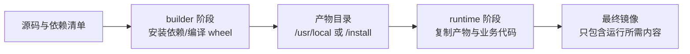
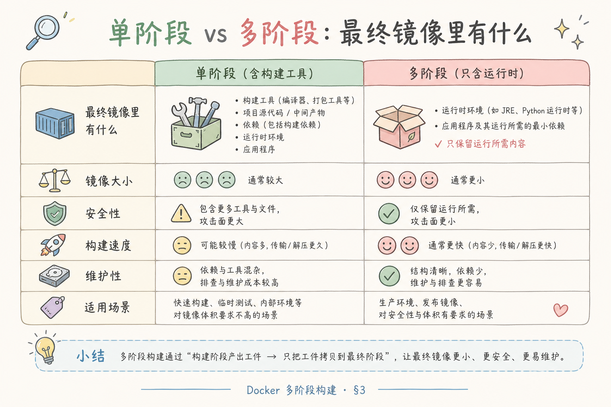
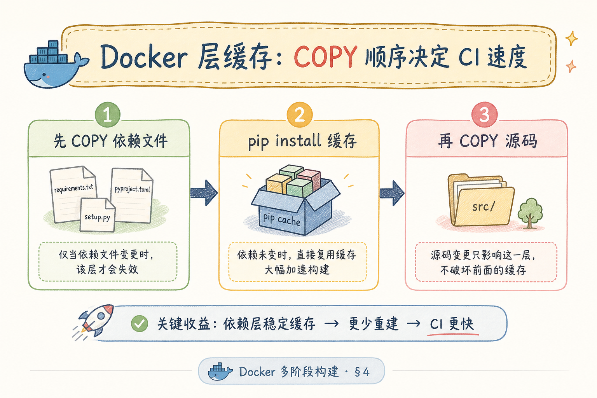
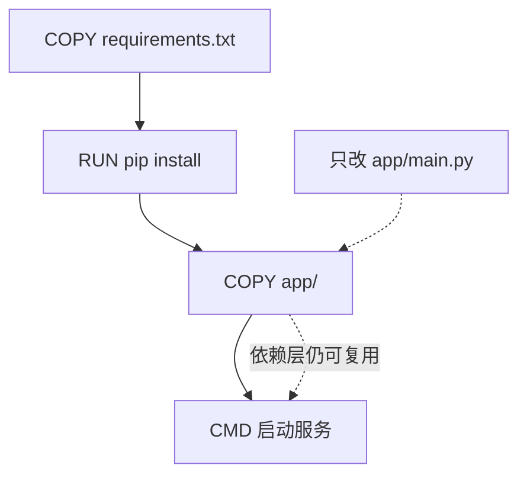
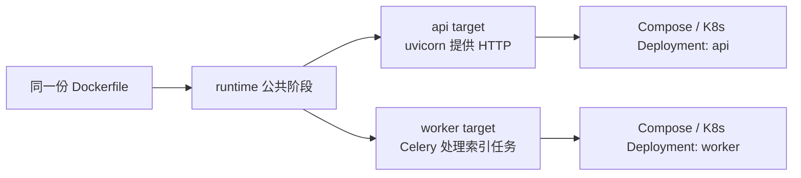
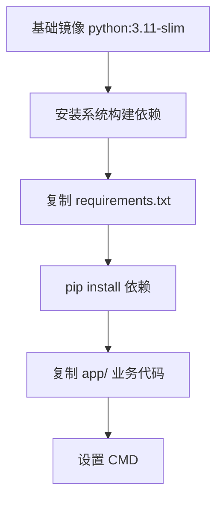
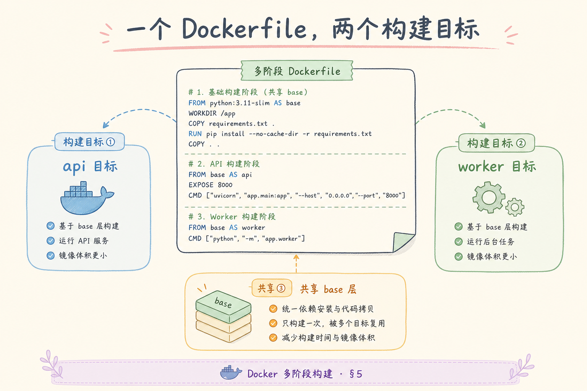

# G 生产化（零）：Docker 多阶段构建完全指南

> 前面我们已经把 FastAPI、Celery、向量库这些 RAG 后端能力跑起来了。到了生产化阶段，问题会从“本地能不能运行”变成“别人能不能稳定部署”。**Docker 多阶段构建**（Multi-stage Build）就是把“安装依赖、编译扩展、准备运行环境”拆成多个镜像阶段，让最终交付的镜像更小、更干净、更容易缓存。

---

## 目录

1. [为什么需要多阶段构建](#1-为什么需要多阶段构建)
2. [多阶段构建是什么](#2-多阶段构建是什么)
3. [它解决了什么问题](#3-它解决了什么问题)
4. [Stage、Layer、Target 三个核心概念](#4-stagelayertarget-三个核心概念)
5. [最小 Dockerfile：从 builder 到 runtime](#5-最小-dockerfile从-builder-到-runtime)
6. [RAG 后端如何拆 api 和 worker 镜像](#6-rag-后端如何拆-api-和-worker-镜像)
7. [缓存、.dockerignore 与构建速度](#7-缓存dockerignore-与构建速度)
8. [本地验证与常见错误](#8-本地验证与常见错误)
9. [总结](#9-总结)

---

## 1. 为什么需要多阶段构建

本地开发时，你可能这样启动一个 RAG 后端：

```bash
python -m venv .venv
pip install -r requirements.txt
uvicorn app.main:app --reload
celery -A app.workers.celery_app worker -l info
```

这套方式适合开发，但不适合交付。生产环境需要的是一个可复制的镜像：运维、CI、测试环境、Kubernetes 都能用同一份镜像启动服务。

如果 Dockerfile 写得太粗糙，常见问题是：

- 镜像很大，里面带着 `gcc`、`git`、测试工具和 pip 缓存；
- 改一行业务代码就重新安装全部依赖，构建很慢；
- API 和 Worker 各写一套 Dockerfile，依赖慢慢漂移；
- 密钥或本地 `.env` 被误打进镜像；
- 本地能跑，容器里却因为 `WORKDIR` 或 `PYTHONPATH` 报 `ModuleNotFoundError`。

多阶段构建要解决的就是这些“交付质量”问题。它不是让代码更聪明，而是让镜像更可靠。

### 1.1 单阶段 vs 多阶段对照

| 维度 | 单阶段 `COPY . .` + pip | 多阶段 builder + runtime |
|------|-------------------------|----------------------------|
| 镜像体积 | 常 >1GB（含 gcc、缓存） | slim 基础 + 仅运行时依赖 |
| 构建时间 | 改一行代码可能重装依赖 | 依赖层缓存命中 |
| 安全面 | 编译工具留在生产镜像 | 运行时无 build-essential |
| API/Worker | 易复制两份 Dockerfile | 同一文件不同 target |

---

## 2. 多阶段构建是什么

**Docker 多阶段构建**：在一个 Dockerfile 里写多个 `FROM`，每个 `FROM` 代表一个阶段。前面的阶段可以负责安装、编译、打包，后面的阶段只复制真正运行时需要的文件。

通俗说：先在厨房里洗菜、切菜、炒菜，最后只把装好的菜端到餐桌上。用户不需要看到锅、案板、垃圾桶，生产镜像也不应该带着编译器、测试文件和安装缓存。



读这张图时重点看两次“筛选”：第一次筛选依赖产物，第二次筛选业务代码。最终镜像不是 builder 的完整复制，而是只拿运行需要的结果。

---

## 3. 它解决了什么问题

RAG 后端比普通 CRUD API 更容易把镜像做胖，因为它经常包含 PDF 解析、向量库客户端、Embedding 客户端、异步任务和日志观测依赖。



| 问题 | 单阶段构建的结果 | 多阶段构建的做法 |
|---|---|---|
| 镜像过大 | 编译器、缓存、测试工具都留下 | builder 里安装，runtime 只复制产物 |
| 构建慢 | 每次 `COPY . .` 后都重装依赖 | 先复制依赖清单，再复制业务代码 |
| API / Worker 漂移 | 两份 Dockerfile 难以同步 | 一个 Dockerfile，用不同 target 输出 |
| 安全风险 | 密钥、`.venv`、测试数据误入镜像 | `.dockerignore` 明确排除 |
| 排错困难 | 不知道哪层失效 | 按 Layer 观察缓存命中情况 |

多阶段构建的价值可以概括成一句话：**把构建时需要的东西留在构建阶段，把运行时需要的东西交给生产镜像。**

镜像交付评审时除体积外，还要看 `docker history` 里是否残留 `gcc`、`git`、`.env`。RAG Worker 常因 PDF 解析依赖把镜像撑到 gigabyte 级，拖累 K8s 冷启动与回滚速度。多阶段并不能自动瘦身——若 runtime 仍 `COPY . .` 把 `data/` 打进去，阶段再多也徒劳。案例中的 1.8GB→420MB 来自 **只复制 /install 与 app/**，这条纪律应写进 code review checklist。

### 3.1 案例：RAG Worker 镜像过大

某团队 Worker 需编译 `lxml`、PDF 解析依赖，单阶段镜像 1.8GB，K8s 拉取慢。改为 builder 安装 `--prefix=/install`，runtime 仅 `COPY --from=builder`，镜像降到 420MB。API 与 Worker 共用 `runtime` 阶段，仅 CMD 不同，依赖不再漂移。

---

## 4. Stage、Layer、Target 三个核心概念

初学者先记住这三个词即可，不需要一开始就背完整 Docker 机制。

### 4.1 Stage：阶段

**Stage**（阶段）：Dockerfile 中每个 `FROM` 开始的一段独立构建流程。

```dockerfile
FROM python:3.11-slim AS builder
# 安装依赖、编译扩展

FROM python:3.11-slim AS runtime
# 只放运行服务需要的内容
```

`builder` 和 `runtime` 是阶段名。阶段名不是装饰，它会被 `COPY --from=builder` 引用。

### 4.2 Layer：层

**Layer**（层）：Dockerfile 里大多数指令都会形成缓存层，例如 `RUN`、`COPY`、`ADD`。

层的关键规则是：**前面的层变了，后面的缓存通常也会失效**。





所以依赖清单要放在业务代码之前复制。这样只改 `app/` 时，不会重新安装全部 Python 包。

### 4.3 Target：构建目标

**Target**（构建目标）：告诉 Docker 最终要构建哪个阶段。

同一份 Dockerfile 可以输出 API 镜像和 Worker 镜像：

```dockerfile
FROM runtime AS api
CMD ["uvicorn", "app.main:app", "--host", "0.0.0.0", "--port", "8000"]

FROM runtime AS worker
CMD ["celery", "-A", "app.workers.celery_app", "worker", "-l", "info"]
```

构建命令分别是：

```bash
docker build --target api -t rag-api:local ./backend
docker build --target worker -t rag-worker:local ./backend
```

这能避免 API 和 Worker 维护两套重复 Dockerfile。

### 4.4 构建时查看缓存命中

`docker build --progress=plain` 可看到每步 `CACHED` 或全新执行。发布前改一次 `requirements.txt` 再改一次 `app/main.py`，确认第二次构建跳过 pip 层。CI 中缓存策略（BuildKit cache mount）可进一步缩短 pip，但 Layer 顺序仍是基础。

---

## 5. 最小 Dockerfile：从 builder 到 runtime

下面是一份适合 FastAPI RAG 后端的最小示例。假设目录结构如下：

```text
backend/
  app/
    main.py
    api/
    services/
    workers/
  requirements.txt
  Dockerfile
```

Dockerfile：

```dockerfile
FROM python:3.11-slim AS builder

ENV PYTHONDONTWRITEBYTECODE=1 \
    PYTHONUNBUFFERED=1

WORKDIR /build

RUN apt-get update \
    && apt-get install -y --no-install-recommends build-essential \
    && rm -rf /var/lib/apt/lists/*

COPY requirements.txt .
RUN pip install --no-cache-dir --prefix=/install -r requirements.txt

FROM python:3.11-slim AS runtime

ENV PYTHONDONTWRITEBYTECODE=1 \
    PYTHONUNBUFFERED=1 \
    PYTHONPATH=/app

WORKDIR /app

COPY --from=builder /install /usr/local
COPY app ./app

RUN useradd -m appuser
USER appuser

FROM runtime AS api
EXPOSE 8000
CMD ["uvicorn", "app.main:app", "--host", "0.0.0.0", "--port", "8000"]

FROM runtime AS worker
CMD ["celery", "-A", "app.workers.celery_app", "worker", "-l", "info"]
```

这份 Dockerfile 的重点不在语法多复杂，而在分工明确：

- `builder` 允许出现编译工具；
- `runtime` 只接收依赖产物和业务代码；
- `api` 与 `worker` 只改变启动命令；
- `USER appuser` 避免容器默认用 root 运行。

第一次把本地 `uvicorn` 迁进容器时，`ModuleNotFoundError: app` 是最常见拦路虎——几乎都是 `WORKDIR` 与 `PYTHONPATH` 未对齐，而非业务代码问题。建议在 CI 增加一步：构建后 `docker run` 执行 `python -c "import app.main"` smoke test，比等到部署环境才发现导入失败更省时间。API 与 Worker 共用 runtime 阶段时，改 `requirements.txt` 后两个 target 都应重建，避免只滚 API 导致 Worker 缺包。

### 5.1 非 root 与只读文件系统

生产环境可叠加：只读根文件系统、tmpfs 挂载 `/tmp`、以 `appuser` 运行。若 Worker 需写临时 PDF，挂载 volume 到 `/tmp` 或专用目录，而非放宽为 root。

---

## 6. RAG 后端如何拆 api 和 worker 镜像

RAG 服务通常至少有两个进程：一个 HTTP API，一个后台 Worker。它们共享业务代码和大部分依赖，但启动方式不同。



这样拆的好处是：依赖只定义一次，构建逻辑只维护一次，但部署时仍然能把 API 和 Worker 独立扩缩容。

在 Docker Compose 中可以这样引用：

```yaml
services:
  api:
    build:
      context: ./backend
      target: api
    ports:
      - "8000:8000"

  worker:
    build:
      context: ./backend
      target: worker
```

这里的 `target` 对应 Dockerfile 里的 `FROM runtime AS api` 和 `FROM runtime AS worker`。

Compose 本地联调时，api 与 worker 应挂载同一业务代码卷仅用于开发；生产镜像则不应依赖 bind mount。扩缩容上 API 按 QPS、Worker 按队列深度，但镜像 tag 必须一致，否则会出现“API 已发新 chunk 策略、Worker 仍用旧解析器”的隐性版本分裂。发布流水线宜并行 build 两个 target 并推送 `api-${git_sha}` 与 `worker-${git_sha}`，回滚时成对回退。

### 6.1 Worker 需要额外系统库时

若仅 Worker 需 `poppler-utils` 等，可增设 `FROM runtime AS worker-runtime`，在该阶段 `apt-get` 一次，再 `FROM worker-runtime AS worker`。避免为 API 镜像无谓增大。仍保持 **一份 requirements.txt**。

---

## 7. 缓存、.dockerignore 与构建速度

`.dockerignore` 决定哪些文件不会被发送给 Docker 构建上下文。它和 `.gitignore` 类似，但作用对象是 Docker build。

建议在 `backend/.dockerignore` 写：

```text
.venv
__pycache__
*.pyc
.pytest_cache
.mypy_cache
.ruff_cache
.git
.env
tests
notebooks
data
```

这能避免三个问题：

1. 本地虚拟环境被打进镜像，导致体积暴涨；
2. `.env` 和密钥进入镜像历史；
3. 测试数据、Notebook、缓存文件拖慢构建。

缓存层的推荐顺序是：



这张图的结论很简单：**越不常变的内容越靠前，越常变的业务代码越靠后。**

改一行 `app/main.py` 却触发全量 `pip install`，多半是 Layer 顺序写反或 `.dockerignore` 漏了 `.venv` 导致上下文哈希巨变。BuildKit 的 cache mount 能进一步加速 pip，但 **先 requirements 后 app** 仍是底线。RAG 项目 `requirements.txt` 变动频率低于业务代码，顺序正确时日常迭代构建应在秒级完成依赖层复用，分钟级都说明缓存未命中，值得用 `--progress=plain` 查哪一层失效。

### 7.1 .dockerignore 漏项排错

| 现象 | 常见漏忽略 | 后果 |
|------|------------|------|
| 构建上下文几百 MB | `data/`、`.venv` | 上传慢、缓存失效 |
| 镜像含密钥 | `.env` | 安全风险 |
| 改测试触发重装 | `tests/` 被 COPY 进层 | pip 层频繁失效 |

构建前可 `du -sh` 看上下文体积；超过 50MB 应审视 ignore 列表。

---

## 8. 本地验证与常见错误

先构建 API 镜像：

```bash
cd backend
docker build --target api -t rag-api:local .
docker run --rm -p 8000:8000 rag-api:local
```

再访问健康检查：

```bash
curl http://localhost:8000/health
```

预期返回类似：

```json
{"status":"ok"}
```

再构建 Worker 镜像：

```bash
docker build --target worker -t rag-worker:local .
```

常见错误如下：

| 现象 | 常见原因 | 修复方式 |
|---|---|---|
| `ModuleNotFoundError: app` | `WORKDIR` 或 `PYTHONPATH` 不对 | 设置 `WORKDIR /app` 和 `PYTHONPATH=/app` |
| runtime 找不到包 | 忘了 `COPY --from=builder /install /usr/local` | 显式复制依赖产物 |
| 镜像巨大 | `.venv`、缓存、测试数据进入镜像 | 增加 `.dockerignore` |
| 改代码后 pip 重装 | 先 `COPY app` 再装依赖 | 先复制依赖清单 |
| Worker 缺 PDF 解析库 | API 和 Worker 依赖拆散漂移 | 共用 runtime，必要时再扩展 worker target |
| 密钥泄漏 | `.env` 被复制进镜像 | `.dockerignore` 排除，运行时用环境变量注入 |

一个重要反例：

```dockerfile
FROM python:3.11-slim
WORKDIR /app
COPY . .
RUN pip install -r requirements.txt
CMD ["uvicorn", "app.main:app"]
```

这不是不能运行，而是不适合生产交付。它把源码、测试、缓存、依赖安装过程都混在一个阶段里，后续很难优化和排查。

单阶段 Dockerfile 在 PoC 阶段可以容忍，但一旦接入 CI/CD，应规划迁移窗口：先引入 builder 复制 `/install`，再拆 api/worker target，最后收紧 `.dockerignore`。迁移日应做体积与缓存验收，并跑 Worker 消费一条假索引任务的 smoke test，确认 PDF 解析依赖未在 runtime 丢失。否则会出现“镜像更小但 Worker 一跑就缺库”的倒退。

### 8.1 CI 中的双 target 构建

流水线宜并行：`docker build --target api` 与 `--target worker`，推送不同 tag。集成测试用 api 镜像跑 `/health`，Worker 镜像跑“消费一条假索引任务”的 smoke test。版本 tag 与 git sha 一致，便于回滚。

### 8.2 评测：镜像交付验收

| 项 | 标准 |
|----|------|
| 体积 | runtime 不含 gcc/git（`docker history` 可查） |
| 缓存 | 仅改 app 代码不触发 pip |
| 双进程 | api/worker target 均可启动 |
| 安全 | 无 .env；非 root 运行 |
| 健康 | `curl /health` 返回 ok |

---

## 9. 总结

Docker 多阶段构建的核心不是“多写几个 `FROM`”，而是建立清晰的交付边界：

交付边界清楚后，Compose 与 Kubernetes 只需引用同一 git sha 的不同 target，不再维护两份漂移的 Dockerfile。团队新人常问“为什么本地 venv 能跑、容器不能”——十之八九是路径、用户与非 root 写权限，而非 Python 版本神秘差异。把本篇检查清单纳入 PR 模板，比事后在凌晨回滚镜像更有性价比。



- builder 阶段负责安装和编译；
- runtime 阶段只保留运行需要的依赖与代码；
- target 让 API 和 Worker 共用构建逻辑；
- `.dockerignore` 防止本地垃圾和密钥进入镜像；
- 合理的 Layer 顺序让改业务代码时不重装依赖。

读完这一篇，你应该能把一个本地可运行的 FastAPI RAG 后端，整理成可以被 Compose、Kubernetes 或 CI 继续接手的镜像基础。下一步可以进入 Docker Compose，把 API、Worker、Postgres、Redis、向量库放进同一个可启动的开发/演示环境。

### 9.1 本篇检查清单

- [ ] builder / runtime 职责分离，`COPY --from=builder` 正确
- [ ] requirements 先于 app 复制，利用 Layer 缓存
- [ ] api 与 worker 共用 runtime，不同 target
- [ ] `.dockerignore` 排除 .venv、.env、data、tests
- [ ] 非 root 用户与健康检查通过
- [ ] CI 双 target 构建与镜像体积可观测
