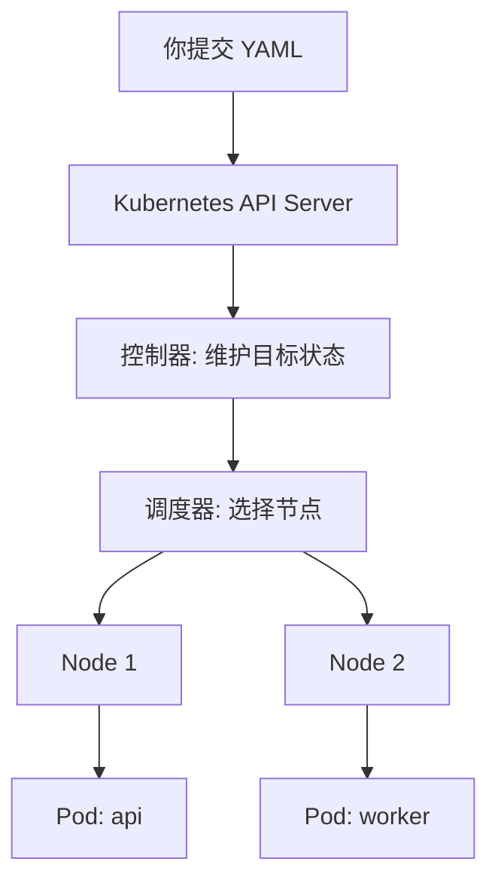
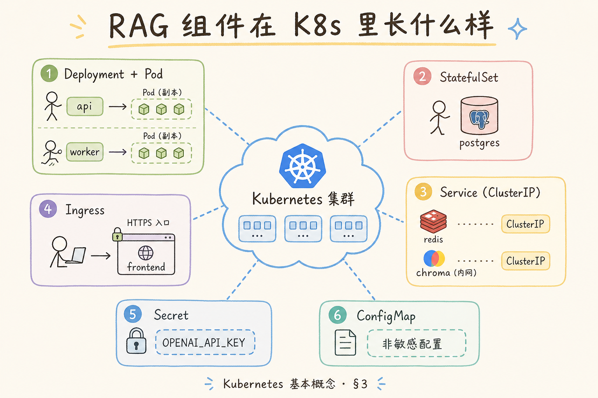
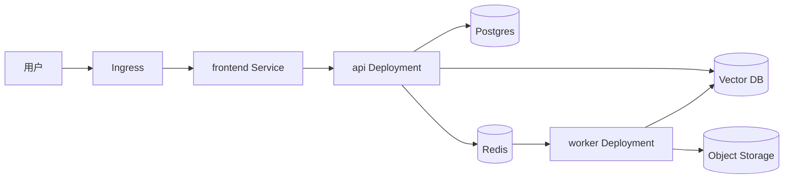
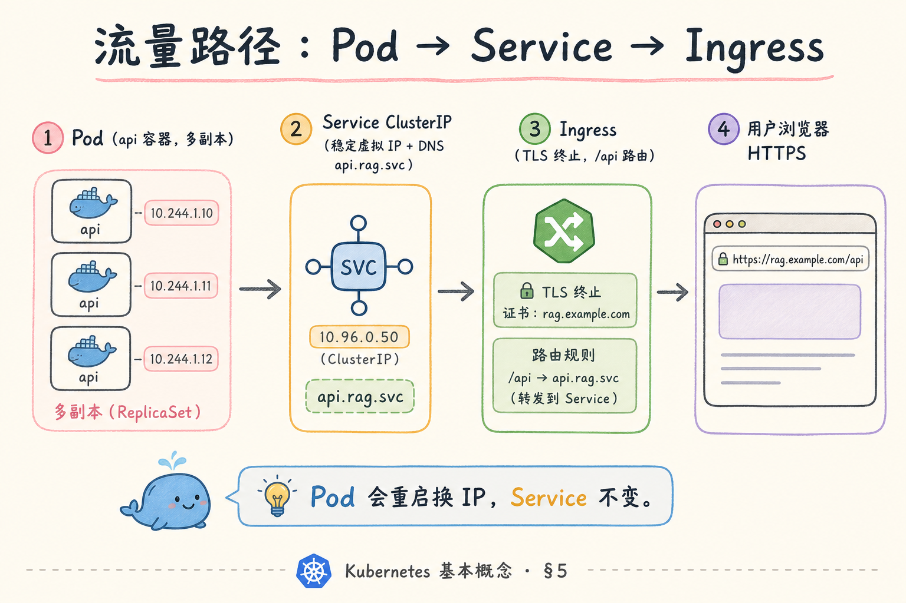
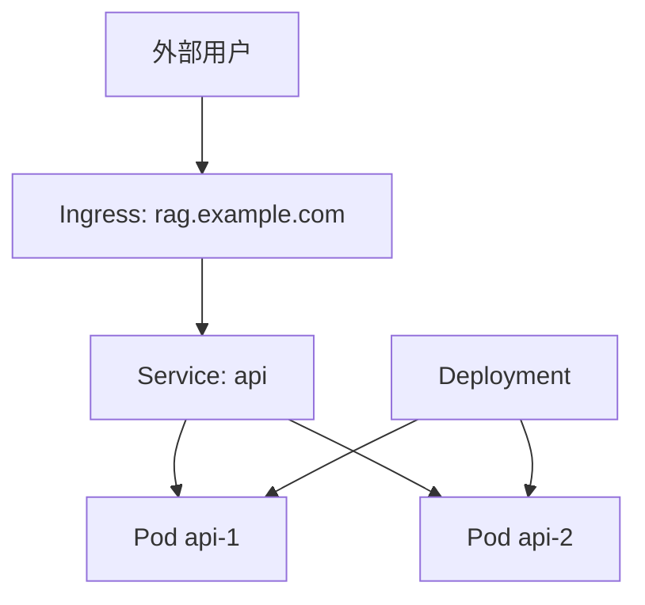
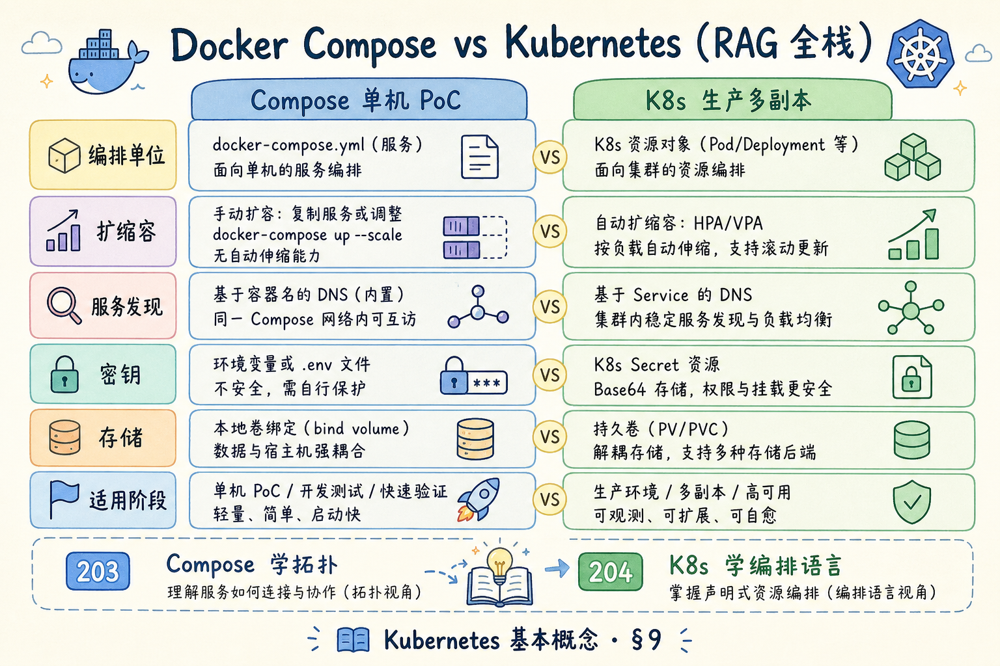

# G 生产化（二）：Kubernetes 基本概念（RAG 语境）完全指南

> Docker Compose 能让一组服务在单机上跑起来；**Kubernetes** 解决的是另一件事：多台机器上如何稳定运行、扩缩容、发布和恢复这些服务。本文不追求一次讲完 K8s 全部能力，而是用 RAG 项目语境讲清它是什么、有什么用、解决什么问题，以及初学者如何理解 Pod、Deployment、Service、Ingress、ConfigMap、Secret 和探针。

---

## 目录

1. [为什么需要 Kubernetes](#1-为什么需要-kubernetes)
2. [Kubernetes 是什么](#2-kubernetes-是什么)
3. [它解决什么问题](#3-它解决什么问题)
4. [RAG 服务如何映射到 K8s](#4-rag-服务如何映射到-k8s)
5. [核心对象：Pod、Deployment、Service、Ingress](#5-核心对象poddeploymentserviceingress)
6. [配置、密钥、存储和探针](#6-配置密钥存储和探针)
7. [最小部署示例](#7-最小部署示例)
8. [什么时候不需要 Kubernetes](#8-什么时候不需要-kubernetes)
9. [常见陷阱与 FAQ](#9-常见陷阱与-faq)
10. [总结](#10-总结)

## 1. 为什么需要 Kubernetes

当 RAG 项目只有一个 Demo，Docker Compose 已经够用。但进入团队测试、灰度发布、线上运行后，会出现新问题：API 要多副本，Worker 要按队列扩容，发布不能停机，服务挂了要自动拉起，配置和密钥不能散落在服务器上。

Kubernetes 的价值是把这些运维动作变成声明式配置。你告诉它“我希望 API 始终有 3 个副本”，它负责调度、重启和维持目标状态。

| 问题 | Compose 的局限 | Kubernetes 的作用 |
|------|----------------|------------------|
| 多机运行 | 偏单机 | 跨节点调度 |
| 自动恢复 | 容器挂了要人工排查 | 控制器自动拉起 |
| 滚动发布 | 手动控制 | Deployment 滚动更新 |
| 服务发现 | 单机网络 | Service 稳定入口 |
| 资源隔离 | 粗粒度 | requests / limits |

### 1.1 从 Compose 到集群的典型触发点

| 信号 | 说明 | 建议动作 |
|------|------|----------|
| API 单副本扛不住峰值 | 问答高峰时 P95 飙升 | 先加副本 + HPA，再评估上 K8s |
| 发布要零停机 | 滚动替换旧 Pod | Deployment `maxUnavailable` |
| Worker 要按队列伸缩 | 索引积压、embedding 排队 | Deployment 或 KEDA |
| 多环境配置漂移 | dev/staging/prod 手工改 env | ConfigMap + Secret 分层 |

RAG 团队常见路径：Compose 验证业务 → 托管数据库/向量库 → 无状态 API/Worker 上 K8s → 再考虑自建有状态组件。不要跳过健康检查与配置分层直接上集群。

### 1.2 排错场景对照

| 值班现象 | 容易误判 | 实际常见原因 |
|----------|----------|--------------|
| 用户 502 | “K8s 坏了” | Ingress 未指向正确 Service，或 ready 全红 |
| Pod 反复重启 | 业务 bug | liveness 探针过重或 `/health` 查了数据库 |
| 扩容无效 | “副本数加了” | requests 过大导致节点 Pending |
| 发布后全挂 | 镜像问题 | 新镜像缺环境变量，ready 失败被摘流 |

---

## 2. Kubernetes 是什么

**Kubernetes**：一个容器编排平台。它不负责打包镜像，而是负责把镜像部署到集群里，并持续维护你声明的运行状态。

通俗说：Docker 负责“把应用装进箱子”；Kubernetes 负责“把很多箱子放到多台机器上，并保证该开的箱子一直开着”。



读这张图时注意：Kubernetes 的核心不是“运行命令”，而是“不断把实际状态拉回目标状态”。

### 2.1 控制平面与数据平面（初学者版）

| 组件 | 角色 | RAG 语境类比 |
|------|------|--------------|
| API Server | 接收 YAML、查询状态 | “集群前台” |
| 调度器 | 决定 Pod 跑在哪台 Node | 给 API/Worker 找机器 |
| 控制器 | 对比期望 vs 实际，纠偏 | 维持 3 个 API 副本 |
| kubelet | Node 上真正起容器 | 每台机器上的执行者 |

你日常写的 Deployment、Service YAML，最终都经 API Server 进入这套循环。排障时 `kubectl describe pod` 看 Events，往往比猜业务日志更快定位调度与探针问题。

### 2.2 声明式 vs 命令式

命令式是 `docker run` 一次起一次；声明式是“我要 2 个 rag-api Pod”，控制器持续补齐。发布新版本时只改镜像 tag 并 `kubectl apply`，由 Deployment 滚动替换——这与 RAG 频繁发版、模型配置迭代很契合。

---

## 3. 它解决什么问题

Kubernetes 解决的是**运行态治理**：副本维持、故障自愈、滚动发布、资源隔离、服务发现。它不会替你修 RAG 检索质量、分块策略或 embedding 选型——若应用没有 `/health`/`/ready`、没有幂等 Worker、没有配置分层，上 K8s 只是把同样的不稳定复制到 N 个 Pod。

Kubernetes 解决的是服务运行和运维治理问题，不是业务代码问题。



| 能力 | 对 RAG 的意义 |
|------|---------------|
| 副本管理 | API 可以多副本承载流量 |
| 滚动发布 | 新版本逐步替换旧版本 |
| 服务发现 | 前端/API/Worker 能稳定互联 |
| 资源限制 | 防止 embedding 或解析任务打爆节点 |
| 探针 | 区分进程活着和服务可用 |
| 配置与密钥 | 环境差异集中管理 |

如果应用本身没有健康检查、没有幂等任务、没有配置分层，上 Kubernetes 也不会自动变稳定。

### 3.1 K8s 不会替你做的事

| 领域 | 仍需应用层负责 |
|------|----------------|
| RAG 检索质量 | 分块、embedding、rerank |
| 幂等与重试 | Worker 任务去重、DLQ |
| 密钥轮换 | Secret 只存值，流程要自建 |
| 可观测 | 日志、指标、Trace 仍要埋点 |

把 K8s 当成**运行与发布平台**，不是业务稳定性的替代品。

---

## 4. RAG 服务如何映射到 K8s

映射原则：**有状态外置、无状态进集群**。Postgres、向量库、对象存储优先托管或独立运维；API、Worker、前端做成 Deployment + Service。初学者常见误区是把 Chroma 当普通容器随手 `replicas: 3`——有状态组件需要 PVC、备份与版本策略，否则扩缩容等于丢索引。Worker 按队列深度扩副本时，要同时看 embedding 批任务的内存峰值与 LLM 外部限流，不能只看 CPU。

一个 RAG 项目常见映射如下：



| RAG 部件 | K8s 对象 |
|----------|----------|
| API | Deployment + Service |
| Worker | Deployment 或 Job |
| 前端 | Deployment + Service + Ingress |
| Postgres / Redis / Vector DB | 初期可托管；自建时用 StatefulSet |
| 配置 | ConfigMap |
| 密钥 | Secret 或外部 Secret Manager |

初学者建议：数据库、对象存储、向量库优先用托管服务；先把无状态 API 和 Worker 放进 K8s。

### 4.1 有状态组件怎么放

| 组件 | 首选 | 自建时注意 |
|------|------|------------|
| Postgres | 云 RDS | StatefulSet + PVC + 备份 |
| 向量库 | 托管 Milvus/Qdrant Cloud | 磁盘与内存 requests 要写实 |
| Redis | 托管或 Sentinel | 队列场景别用无持久化单机 |
| 对象存储 | S3/OSS | 不进集群，用 IAM/密钥 |

索引大批量导入时，Worker 内存 spike 常是 OOM 元凶——在 limits 里给 embedding 批任务留余量，并用 HPA 按自定义指标（队列深度）扩，而非只看 CPU。

### 4.2 案例：内部 PoC 到灰度

某团队 Compose 跑通后，第一步只把 `rag-api` 和 `rag-worker` 做成 Deployment，Postgres 仍用 RDS。Ingress 挂 `rag-staging.example.com`，副本数 2。灰度时新镜像 tag `1.1.0-rc1`，观察 ready 与错误率后再全量。向量库仍外置，避免在集群里运维 StatefulSet——这是多数 RAG 项目的务实起点。

---

## 5. 核心对象：Pod、Deployment、Service、Ingress

**Pod** 是 Kubernetes 里最小运行单元，通常包含一个应用容器。不要把 Pod 当成永久机器，它随时可能被重建。

**Deployment** 管理一组 Pod 副本。你声明副本数和镜像版本，它负责创建、更新和回滚。

**Service** 给一组 Pod 一个稳定访问名。Pod 会变，Service 名不变。

**Ingress** 把集群外部 HTTP 流量转进 Service。





一句话理解：Deployment 管“有几个副本”，Service 管“怎么找到它们”，Ingress 管“外部怎么进来”。

### 5.1 对象关系速记

| 对象 | 问的问题 | 失败时先看 |
|------|----------|------------|
| Pod | 容器是否在跑 | `kubectl logs`, Events |
| Deployment | 副本数、镜像版本对不对 | `kubectl rollout status` |
| Service | 流量能否到 Pod | selector 与 label 是否一致 |
| Ingress | 域名/TLS 是否通 | backend 与 path 配置 |

Service 的 `selector` 必须与 Pod template 的 `labels` 匹配；RAG 项目里改过一次 `app: rag-api` 漏改 Service，会出现“Pod 健康但 Ingress 502”的经典坑。

### 5.2 Ingress 与 RAG 前端

浏览器访问通常走 Ingress → frontend Service → Next.js Pod；API 可走同域 `/api` 反代或子域 `api.rag.example.com`。无论哪种，**对外只暴露 Ingress**，集群内 Service 用 ClusterIP 即可，减少攻击面。

---

## 6. 配置、密钥、存储和探针

RAG 项目配置很多：数据库地址、Redis 地址、向量库地址、模型供应商、租户配置、回调 URL。不要把这些写死在镜像里。

| 对象 | 用途 |
|------|------|
| ConfigMap | 非敏感配置 |
| Secret | 密码、token、key |
| PersistentVolume | 需要持久化的数据 |
| livenessProbe | 进程是否需要重启 |
| readinessProbe | 是否能接流量 |

探针尤其重要。API 进程活着不代表数据库、Redis、向量库都可用，所以 `/ready` 应该检查关键依赖。

### 6.1 探针与 RAG 冷启动

向量库客户端初始化、连接池预热可能耗时数十秒。应配置 **startupProbe** 给足 `failureThreshold × periodSeconds`，避免 liveness 在启动期误杀 Pod。ready 则在依赖可用前保持 503，防止流量打到“能起进程但不能问答”的副本。详见 [189](189.health-readiness-rag-tutorial.md)。

### 6.2 ConfigMap 与 Secret 分工

| 内容 | 放哪里 |
|------|--------|
| `RETRIEVAL_TOP_K`、功能开关 | ConfigMap |
| `DATABASE_URL`、LLM API Key | Secret |
| 多租户默认模型名 | ConfigMap；租户级可进 DB |

挂载方式：`envFrom` 适合整包注入；单键用 `valueFrom.secretKeyRef` 更清晰。改 ConfigMap 后 Pod 不会自动重启——需要滚动重启或 Reloader 一类工具。

---

## 7. 最小部署示例

`kubectl apply` 后应观察 `rollout status` 与 Events：新版 ready 失败常见原因是迁移未完成、Secret 缺 key、探针路径错误。staging 上完整走一遍 apply → 验证 → `rollout undo`，比直接上生产成功率更高。镜像勿用 `latest`；resources 填 requests/limits 避免 BestEffort 被挤掉。

最小 YAML 的目标是验证「声明式发布」闭环：`kubectl apply` → 两个副本 Running → 集群内 `curl rag-api:8000/ready` 通过 → `rollout undo` 能回滚。镜像 tag 固定、密钥来自 Secret、readiness 查硬依赖——这三项不达标，staging 上的滚动更新会在「新版 ready 全红」时卡住，用户侧表现为 502。与 Compose 对照见 7.2 节，便于团队从单机编排平滑迁移。

下面示例只展示 API Deployment 和 Service 的基本结构：

```yaml
apiVersion: apps/v1
kind: Deployment
metadata:
  name: rag-api
spec:
  replicas: 2
  selector:
    matchLabels:
      app: rag-api
  template:
    metadata:
      labels:
        app: rag-api
    spec:
      containers:
        - name: api
          image: registry.example.com/rag-api:1.0.0
          ports:
            - containerPort: 8000
          readinessProbe:
            httpGet:
              path: /ready
              port: 8000
          resources:
            requests:
              cpu: "250m"
              memory: "512Mi"
            limits:
              cpu: "1"
              memory: "1Gi"
---
apiVersion: v1
kind: Service
metadata:
  name: rag-api
spec:
  selector:
    app: rag-api
  ports:
    - port: 8000
      targetPort: 8000
```

这段 YAML 说明：Deployment 负责创建两个 API Pod，Service 负责给它们一个稳定入口 `rag-api:8000`。

### 7.1 落地前检查项

| 项 | 说明 |
|----|------|
| 镜像 tag 不用 `latest` | 可回滚、可追责 |
| readiness 指向 `/ready` | 与 liveness `/health` 分工 |
| resources 已填 | 避免 BestEffort 被节点挤掉 |
| 环境变量来自 Secret/ConfigMap | 密钥不进镜像 |
| `imagePullSecrets` | 私有仓库需配置 |

`kubectl apply -f` 后执行 `kubectl get pods -w`，确认两个副本均 `Running` 且 `READY 1/1`，再在集群内 `curl rag-api:8000/ready` 验证。

### 7.2 与 Compose 字段对照

| Compose | Kubernetes |
|---------|------------|
| `services.api` | Deployment + Service |
| `ports` | `containerPort` + Service `port` |
| `deploy.replicas` | `spec.replicas` |
| `healthcheck` | `readinessProbe` / `livenessProbe` |
| `env_file` | Secret / ConfigMap `envFrom` |

---

## 8. 什么时候不需要 Kubernetes

K8s 的学习与运维成本真实存在：Ingress、证书、存储类、RBAC、版本升级都需要专人或平台团队。小团队 PoC、个人学习、单机 Demo 用 Compose 或托管 PaaS 往往更省时间——把时间花在检索评测与数据质量上，通常比过早学 `kubectl` 更值。决策时可自问：是否同时需要多副本、自动恢复、滚动发布？应用是否已具备健康检查与结构化日志？三句里有两句答「否」，继续 Compose 是务实选择。

不要为了“生产化”三个字强行上 Kubernetes。

| 场景 | 建议 |
|------|------|
| 个人学习 | 本机运行即可 |
| 单机 Demo | Docker Compose |
| 小团队内部 PoC | Compose 或 PaaS |
| 多团队、多环境、需要灰度 | Kubernetes |
| 有专门平台团队 | Kubernetes 更合适 |

如果你还没有日志、指标、健康检查、配置分层和镜像构建流程，上 Kubernetes 只会把问题分散到更多层。

### 8.1 决策自问三句

1. 是否需要**多副本 + 自动恢复 + 滚动发布**同时成立？
2. 是否有专人维护集群版本、Ingress、证书与备份？
3. 应用是否已具备 **/health、/ready、结构化日志**？

三句里有两句答“否”，继续 Compose 或托管 PaaS（Railway、Fly.io、Cloud Run）往往更省时间。RAG 业务验证期，把时间花在检索质量上通常比学 `kubectl` 更值。

---

## 9. 常见陷阱与 FAQ

这一节收束 Kubernetes 的边界。K8s 是运行平台，不会替你修业务逻辑、数据模型和 RAG 质量。



### 9.1 Pod 可以当固定服务器用吗？

不可以。Pod 会重建、迁移、替换。需要持久化的数据必须放外部存储或 volume。

### 9.2 requests 和 limits 有什么用？

`requests` 是调度时承诺的资源，`limits` 是运行时上限。解析 PDF、embedding、rerank 这类任务要特别注意内存限制。

### 9.3 Worker 应该怎么扩容？

先按队列长度和任务耗时扩容。不要只看 CPU，因为很多任务卡在外部模型 API 或对象存储。

### 9.4 Kubernetes 能替代 Docker Compose 吗？

能覆盖更复杂的部署场景，但学习和运维成本更高。Compose 适合单机，K8s 适合多节点和治理。

### 9.5 排错：Pod 一直 Pending

| 原因 | 处理 |
|------|------|
| 资源 requests 总和超过节点可分配 | 降 requests 或加节点 |
| PVC 未绑定 | 检查 StorageClass |
| 镜像拉取失败 | `kubectl describe pod` 看 ImagePullBackOff |
| 污点/亲和性不匹配 | 调整 nodeSelector 或容忍度 |

### 9.6 排错：滚动更新卡住

`kubectl rollout status deployment/rag-api` 若长时间未完成，常见是新版 ready 失败——数据库迁移未做完、环境变量缺失、探针路径错误。用 `kubectl rollout undo` 先回滚，再在 staging 复现。

### 9.7 评测：是否具备上 K8s 的条件

| 维度 | 通过标准 |
|------|----------|
| 镜像 | CI 构建、tag 可追溯 |
| 配置 | 十二要素，密钥外置 |
| 健康检查 | `/health` 轻、`/ready` 查硬依赖 |
| 观测 | 日志带 `request_id`，有基础指标 |
| 发布 | 能在 staging 完整走一遍 apply + 回滚 |

五项里至少四项达标，再投入集群迁移，成功率会高很多。

---

## 10. 总结

Kubernetes 的核心价值是让多服务系统在多节点环境中按目标状态运行：副本、网络、配置、探针、资源和发布都可声明、可观察、可回滚。

对 RAG 团队，务实路径是：Compose 验证业务 → 托管数据库与向量库 → 无状态 API/Worker 上 K8s → 再评估自建有状态组件。上集群前确保镜像可追溯、密钥外置、探针语义正确、指标与日志能下钻——否则排障会从「查业务日志」变成「查业务日志 + 查调度事件 + 查网络策略」，故障半径反而扩大。

### 10.1 本篇检查清单

- [ ] 无状态 API/Worker 已映射为 Deployment + Service
- [ ] 数据库/向量库优先托管或有状态方案已评审
- [ ] readiness 使用 `/ready`，startup 覆盖冷启动
- [ ] requests/limits 已设，Worker 内存有余量
- [ ] 镜像 tag 固定，密钥来自 Secret 而非镜像层
- [ ] 能在 staging 完成 apply、验证、rollout undo

一句话记忆：**Compose 让一组服务在单机一起跑；Kubernetes 让一组服务在集群里持续稳定地跑。**
