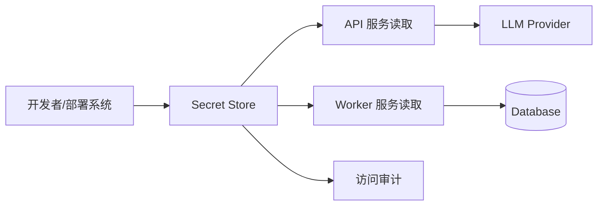
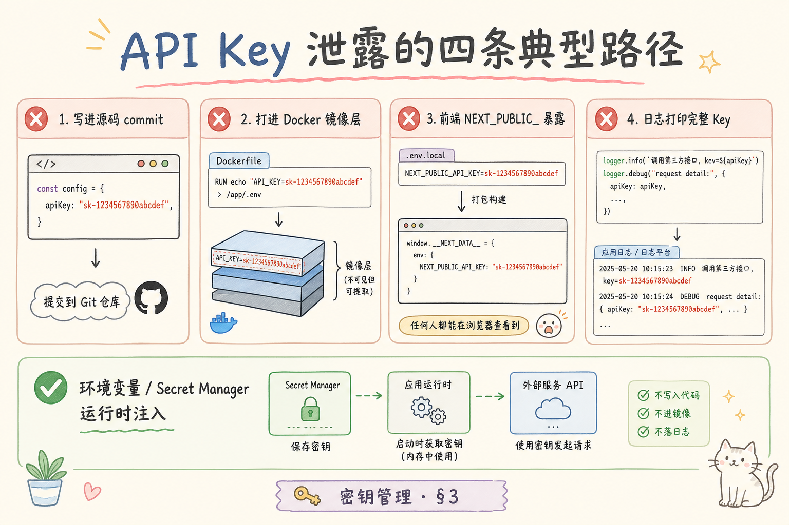
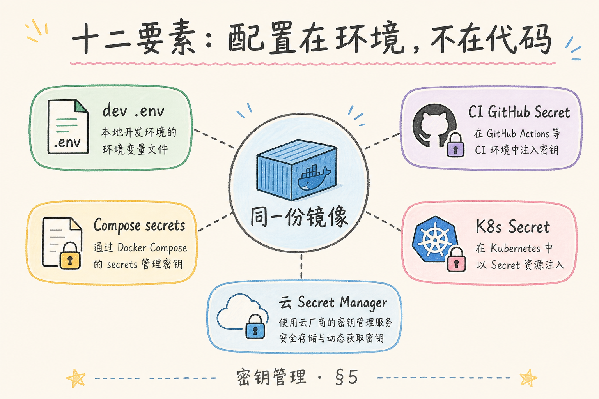
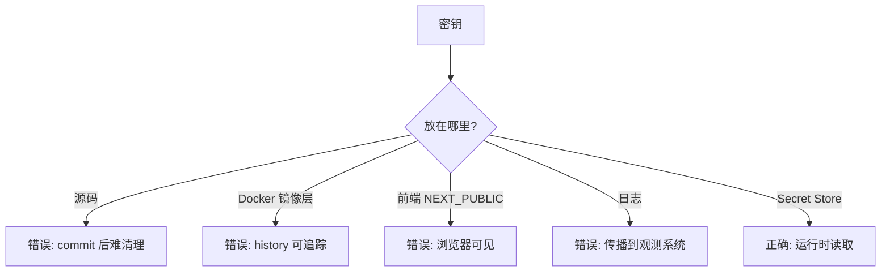
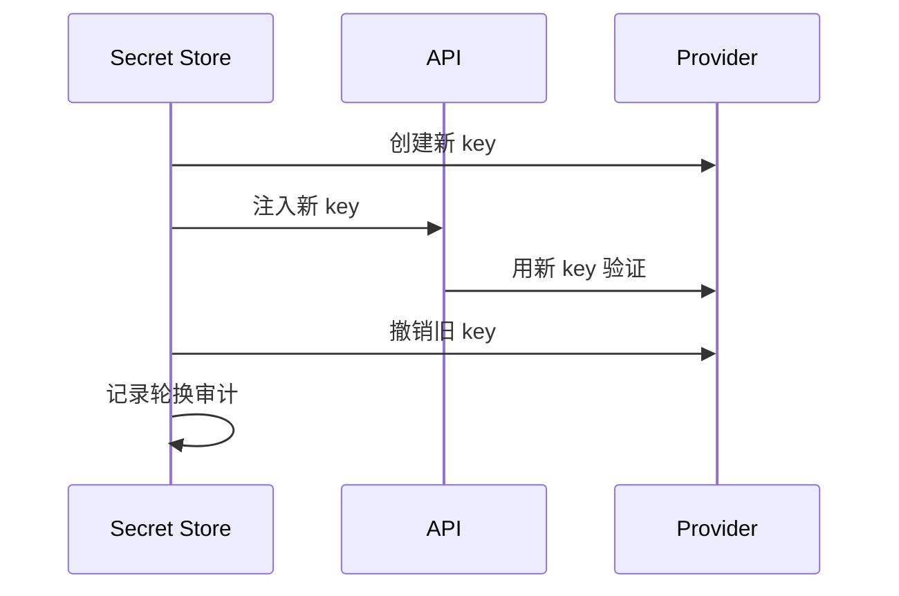
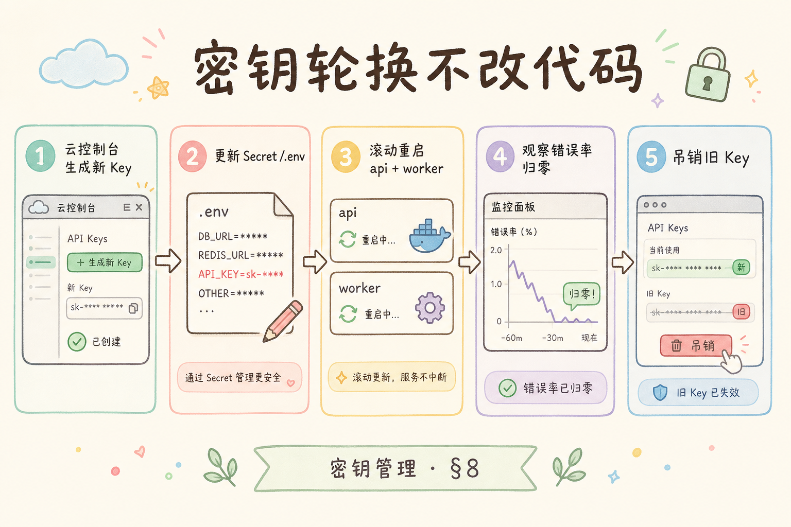

# G 生产化（三）：RAG 密钥管理完全指南

> RAG 系统通常要连接 LLM API、Embedding API、数据库、向量库、对象存储和监控系统。每一个连接都可能需要密钥。**密钥管理**解决的是：这些敏感值放在哪里、谁能读、怎么轮换、泄漏后怎么止损。

---

## 目录

1. [为什么需要密钥管理](#1-为什么需要密钥管理)
2. [密钥管理是什么](#2-密钥管理是什么)
3. [它解决什么问题](#3-它解决什么问题)
4. [RAG 项目有哪些密钥](#4-rag-项目有哪些密钥)
5. [不要把密钥放在哪里](#5-不要把密钥放在哪里)
6. [本地、Compose、K8s 分别怎么做](#6-本地composek8s-分别怎么做)
7. [轮换、最小权限和审计](#7-轮换最小权限和审计)
8. [最小代码示例](#8-最小代码示例)
9. [常见陷阱与 FAQ](#9-常见陷阱与-faq)
10. [总结](#10-总结)

## 1. 为什么需要密钥管理

初学阶段常见写法是把 API Key 直接放进代码或 `.env`。这在本地练习还能接受，但一旦进入团队协作和生产环境，就会带来泄漏风险：代码仓库、Docker 镜像层、日志、前端 bundle、报错堆栈都可能把密钥暴露出去。

RAG 项目尤其敏感，因为一个 LLM key 可能带来费用损失，一个数据库密码可能暴露用户文档，一个对象存储 key 可能下载原始文件。

### 1.1 真实事故类型（简化）

| 事故 | 后果 | 常见入口 |
|------|------|----------|
| LLM Key 进 Git 历史 | 账单暴增、数据外泄 | 误 commit `.env` |
| Key 打进 Docker 层 | 任何人 `docker history` 可见 | Dockerfile `ENV` |
| 日志打印 Authorization | 观测平台全员可见 | debug 时打印 header |
| 前端 `NEXT_PUBLIC_*` | 浏览器 Network 可见 | 把服务端 key 当公开配置 |

密钥管理的目标不是“绝对不被攻破”，而是**缩小泄漏面、缩短暴露窗口、让轮换可执行**。

### 1.2 与配置管理的边界

非敏感配置（检索 top_k、功能开关）走 ConfigMap 或环境变量即可；凡是能换钱、换数据、换身份的字符串，一律按密钥流程处理。RAG 里 `DATABASE_URL` 几乎总是密钥，不要因为它“长得像连接串”就放松。

---

## 2. 密钥管理是什么

密钥生命周期分创建、使用、轮换、吊销四阶段——每个阶段都应有责任人与审计点。开发沙箱 key 与 prod 隔离；CI 不持有生产凭证。Secret Store 负责「存」，RBAC 与网络策略负责「谁能读」，二者缺一不可。

**密钥管理**：对 API Key、数据库密码、Token、证书等敏感值进行存储、读取、授权、轮换和审计的一套机制。

通俗说：配置管理管“系统怎么连”；密钥管理管“敏感钥匙谁能拿、怎么保管、丢了怎么换”。



核心原则：应用运行时可以读取自己需要的密钥，但密钥不应该写进源码、镜像、前端或日志。

### 2.1 生命周期四阶段

| 阶段 | 动作 |
|------|------|
| 创建 | 在厂商控制台或 IAM 生成，立即写入 Secret Store |
| 使用 | 运行时注入，内存持有，不落盘日志 |
| 轮换 | 新旧并存 → 切换 → 撤销旧 key |
| 吊销 | 泄漏或人员离职，立即失效并审计 |

开发者在本地只用**个人沙箱 key**，与 staging/prod 严格隔离；CI 用只读测试 key 或 mock，避免流水线持有生产密钥。

---

## 3. 它解决什么问题

密钥管理的工程目标是**缩小泄漏面、缩短暴露窗口、让轮换可执行**。RAG 项目一把 LLM Key 可能一夜四位数美元，数据库密码泄漏可能拖出全部客户文档——因此「不进源码、不进镜像、不进前端、不进日志」不是口号，而是 pre-commit、CI、Dockerfile review 的硬性检查项。与配置管理的边界要清晰：检索 top_k、功能开关可走 ConfigMap；能换钱、换数据、换身份的字符串一律按密钥流程处理。

| 问题 | 密钥管理做法 |
|------|--------------|
| 泄漏面太大 | 不进源码、不进镜像、不进前端 |
| 权限过大 | 每个服务只拿自己需要的 key |
| key 过期或泄漏 | 支持轮换 |
| 谁读取过无法追踪 | Secret manager 或审计日志记录访问 |
| 多环境混乱 | dev/staging/prod 分开管理 |

密钥管理不只是安全团队的事。开发者写日志、Dockerfile、CI/CD 配置时，都可能决定密钥是否泄漏。



### 3.1 排错：应用报 “invalid API key”

| 检查项 | 说明 |
|--------|------|
| 环境是否对错 | staging Pod 是否误用 prod Secret |
| 注入是否生效 | `kubectl exec` 看 env 是否存在（勿打印完整值） |
| 轮换中间态 | 旧 key 已删、新 key 未全量切换 |
| 厂商侧限制 | IP 白名单、组织策略 |

先确认**哪个服务、哪个环境、哪把 key**，再查 Secret 版本与部署时间线，避免在群里粘贴完整密钥“对一下”。

---

## 4. RAG 项目有哪些密钥

按服务拆分权限是生产底线：API 不必持有对象存储写权限，Worker 不必持有 JWT 签发密钥，前端绝不能出现 `sk-` 类字符串。多租户 BYOK 场景要把租户级模型 key 与平台级 key 分层存储，运行时按 `tenant_id` 加载，禁止写进全局环境变量。向量库若支持分集合 API Key，索引任务与在线查询应使用不同凭证，降低「一泄漏全盘皆输」的风险。

| 密钥 | 典型用途 | 风险 |
|------|----------|------|
| `OPENAI_API_KEY` / 模型供应商 key | LLM、Embedding | 费用和数据风险 |
| `DATABASE_URL` | Postgres | 数据泄漏 |
| `REDIS_URL` 带密码 | 队列和缓存 | 任务被篡改 |
| `S3_ACCESS_KEY` | 原始文件 | 文档泄漏 |
| `JWT_SECRET` | 用户登录 | 身份伪造 |
| `LANGFUSE_SECRET_KEY` | 观测数据 | trace 泄漏 |

生产环境要按服务拆分权限。API 不一定需要对象存储写权限，前端绝不应该拿服务端密钥。

### 4.1 按服务最小权限矩阵

| 服务 | 通常需要 | 通常不需要 |
|------|----------|------------|
| API | DB 读写、LLM、向量库读、JWT 验签 | S3 写、管理员 IAM |
| Worker | DB、Redis、S3 读写、Embedding | 用户 JWT 签发密钥 |
| 前端 | 无服务端密钥 | 一切 `sk-` 类 key |
| 批处理 Job | 只读对象前缀、单次任务 scope | 全局 root 凭证 |

向量库若支持 API Key 分集合权限，Worker 索引任务与 API 查询应使用不同 key，降低“一个泄漏全盘皆输”的风险。

### 4.2 案例：多租户 RAG 的密钥分层

租户级 BYOK（自带模型 key）场景：密钥存租户维度的加密列或独立 Secret 命名空间 `tenant-{id}-llm`，运行时按 `tenant_id` 加载，禁止写进全局 `OPENAI_API_KEY`。平台级 key 仅用于 demo 租户或计费兜底，并设硬性额度告警。

---

## 5. 不要把密钥放在哪里

泄漏路径往往发生在「方便调试」的瞬间：Dockerfile `ENV`、日志打印 Authorization、前端 `NEXT_PUBLIC_*`、CI 失败时 dump 环境变量。值班若遇到 `invalid API key`，先确认环境（staging 是否误用 prod Secret）、注入是否生效、是否处于轮换中间态——**不要在群里粘贴完整密钥对账**。Git 历史里已有密钥时，旋转是第一优先级，清历史需团队协调。





典型错误：

```dockerfile
# 错误示例：ARG/ENV 把密钥打进镜像层
ARG OPENAI_API_KEY
ENV OPENAI_API_KEY=$OPENAI_API_KEY
```

正确方向是：镜像只包含代码和依赖；密钥在容器运行时注入。

### 5.1 泄漏面检查清单（开发日常）

- [ ] pre-commit 扫描 `.env`、`.pem`、`sk-` 模式
- [ ] CI 失败时日志不打印完整环境变量
- [ ] 错误上报（Sentry）过滤 `Authorization`、`api_key` 字段
- [ ] PR 评审显式问：有没有新密钥进仓库或 Dockerfile

### 5.2 Git 历史里已有密钥怎么办

旋转密钥是第一优先级；其次用 `git filter-repo` 等工具清理历史（需团队协调 force-push）。只删当前文件不删历史，仓库仍不安全。轮换后观察厂商用量是否异常下降。

---

## 6. 本地、Compose、K8s 分别怎么做

环境分层是密钥纪律的基础：`.env.example` 提交仓库、真实 `.env*` 进 gitignore；Compose 用 `env_file` 引用但不把生产路径写进截图；K8s 生产用 External Secrets 从云 Secret Manager 同步，原生 Secret 仅 base64，需配合 KMS 与 RBAC。开发沙箱 key 与 staging/prod 严格隔离，CI 用只读测试 key 或 mock，避免流水线持有生产凭证。

| 环境 | 推荐做法 |
|------|----------|
| 本地开发 | `.env.local`，加入 `.gitignore` |
| Docker Compose | `env_file` 或运行时环境变量 |
| CI/CD | 平台 Secret，不在日志打印 |
| Kubernetes | Secret / External Secrets |
| 云生产 | 云 Secret Manager / Vault |

Compose 示例：

```yaml
services:
  api:
    image: rag-api:latest
    env_file:
      - .env.production
```

Kubernetes Secret 示例：

```yaml
apiVersion: v1
kind: Secret
metadata:
  name: rag-secrets
type: Opaque
stringData:
  OPENAI_API_KEY: "replace-me"
```

注意：原生 K8s Secret 默认只是 base64 编码，不等于强加密。生产环境常配合云 KMS、External Secrets 或 Vault。

### 6.1 External Secrets 模式（生产推荐）

| 组件 | 作用 |
|------|------|
| 云 Secret Manager | 加密存储、版本、IAM |
| External Secrets Operator | 同步到 K8s Secret |
| Pod | 仍通过 `envFrom` 读取，应用无感 |

好处：轮换在云上完成，E SO 定期同步；K8s etcd 里的只是缓存，权限仍靠 RBAC 收紧。RAG 多环境时，用不同 ExternalSecret 绑定不同 GCP/AWS 项目。

### 6.2 本地与生产的 `.env` 纪律

| 文件 | 是否提交 | 内容 |
|------|----------|------|
| `.env.example` | 是 | 变量名 + 说明，值为 `replace-me` |
| `.env.local` | 否 | 开发者个人 key |
| `.env.production` | 否 | 仅部署机或 Secret Store 持有 |

`docker compose --env-file` 时确认 compose 文件里没有把 `.env.production` 路径写进文档截图。

---

## 7. 轮换、最小权限和审计

LLM Key 轮换 Runbook 应写清：厂商创建 key2 → Secret Manager 写入 → 滚动重启 API/Worker → 观察 24h 错误率与账单 → 撤销 key1。谁通过 IAM 读了 prod Secret、谁 `kubectl get secret -o yaml`，进入 [196 审计](196.audit-log-rag-tutorial.md)，与「存」互补。

密钥不是设置一次就结束。生产系统要设计轮换流程。



轮换建议：

1. 新旧 key 短时间并存。
2. 服务切到新 key。
3. 验证成功后撤销旧 key。
4. 审计记录写入安全日志。

最小权限原则：Worker 需要对象存储读写，API 可能只需要读；前端不应该持有服务端 key。

### 7.1 轮换 Runbook（LLM Key 示例）

| 步骤 | 负责人 | 验证 |
|------|--------|------|
| 厂商控制台创建 key2 | 平台 | 记录 key_id |
| Secret Manager 写入 key2 版本 | SRE | ESO 同步成功 |
| 滚动重启 API/Worker | SRE | 抽样问答成功 |
| 观察 24h 错误率与账单 | 值班 | 无 auth 错误尖峰 |
| 撤销 key1 | 安全 | 审计条目 |

### 7.2 审计读密钥访问

谁通过 IAM 读了 `prod/rag/openai`、谁在 K8s 里 `kubectl get secret -o yaml`，都应进入安全审计（见 [196](196.audit-log-rag-tutorial.md)）。密钥管理与审计互补：前者管存，后者管“谁动了”。

### 7.3 评测：密钥成熟度

| 级别 | 特征 |
|------|------|
| L0 | key 在源码或镜像 |
| L1 | 运行时 env，无轮换 |
| L2 | Secret Manager + 按服务拆分 |
| L3 | 自动轮换 + 访问审计 + 泄漏扫描 |

RAG 对外演示前至少达到 L1；付费客户场景建议 L2 起步。

---

## 8. 最小代码示例

用 `pydantic-settings` 集中读取环境变量：



```python
from pydantic_settings import BaseSettings

class Settings(BaseSettings):
    openai_api_key: str
    database_url: str
    redis_url: str

    class Config:
        env_file = ".env"

settings = Settings()
```

代码里只引用 `settings.openai_api_key`，不要散落 `os.getenv("OPENAI_API_KEY")`。集中读取方便校验缺失变量，也方便测试环境替换。

### 8.1 启动时校验缺失密钥

应用启动时若 `Settings()` 抛 `ValidationError`，应快速失败并打**不含密钥值**的日志（例如 `missing: openai_api_key`）。避免运行一半才在首次 LLM 调用时报错，难以区分配置问题与厂商故障。

### 8.2 测试环境注入

单元测试用 `monkeypatch.setenv` 或 `Settings(_env_file=None, openai_api_key="test")`；集成测试用固定 mock server，不要把真实 prod key 放进 pytest fixture 文件。

### 8.3 日志与 repr 防泄漏

确保 `Settings` 的 `__repr__` 不打印完整 `database_url`；异常堆栈若包含环境变量，用 logging filter 脱敏。RAG 调试检索时尤其容易 `logger.debug(settings)`——养成只打字段名的习惯。

---

## 9. 常见陷阱与 FAQ

这一节收束密钥管理的边界。密钥管理的目标不是“藏得神秘”，而是减少泄漏面、限制权限、支持轮换和追踪访问。

### 9.1 `.env` 可以提交吗？

不可以提交真实 `.env`。可以提交 `.env.example`，只保留变量名和说明。

### 9.2 `NEXT_PUBLIC_*` 能放 API key 吗？

不能。`NEXT_PUBLIC_*` 会进入浏览器 bundle，任何用户都能看到。前端只能拿公开配置。

### 9.3 日志里不小心打出 key 怎么办？

立即撤销旧 key、创建新 key、清理日志访问权限，并补脱敏规则。不要只删除一行日志就结束。

### 9.4 Secret Manager 是否能替代权限设计？

不能。Secret Manager 负责存密钥；服务之间的最小权限、网络访问和审计仍要单独设计。

### 9.5 排错：Pod 启动即 CrashLoop 且报 DB 连接失败

检查 Secret 的 key 名是否与 Deployment `secretKeyRef.key` 一致；base64 手工编码时是否混入换行；托管 DB 是否改了密码但 K8s Secret 未更新。用**新密码单独 psql 验证**后再改 Secret 并滚动发布。

### 9.6 FAQ：能否在 Helm values 里写密钥？

`values.yaml` 常进 Git，应使用 `values-secrets.yaml`（gitignore）或 Helm Secrets / 外部引用。Chart 模板里只引用 `{{ .Values.secrets.openaiApiKey }}` 占位，真实值由 CI 注入。

### 9.7 FAQ：Embedding 与 Chat 能否共用一个 OpenAI Key？

技术上可以，权限上建议拆分：Chat key 设月度额度上限，Embedding key 设 RPM 限制，泄漏时影响面更小，账单也更容易归因到具体用途。

---

## 10. 总结

RAG 密钥管理的核心是：密钥不进源码、不进镜像、不进前端、不进日志；运行时按最小权限注入，并支持轮换和审计。

成熟度可自评：L0 密钥在源码或镜像；L1 运行时 env 无轮换；L2 Secret Manager + 按服务拆分；L3 自动轮换 + 访问审计 + 泄漏扫描。对外演示前至少 L1，付费客户建议 L2 起步。与 [196](196.audit-log-rag-tutorial.md) 联动：谁读了 prod Secret、谁执行了轮换，都应进入安全审计而非仅靠口头交接。

### 10.1 本篇检查清单

- [ ] `.env.example` 已提交，真实 `.env*` 已 ignore
- [ ] Dockerfile 无 `ENV`/`ARG` 承载生产密钥
- [ ] API/Worker/前端权限矩阵已文档化
- [ ] 生产使用 Secret Manager 或 External Secrets
- [ ] 轮换 Runbook 与泄漏应急响应已写
- [ ] 日志与 CI 已配置密钥脱敏/扫描

一句话记忆：**密钥不是配置文本，而是生产系统的钥匙；能少暴露一处，就少一个事故入口。**
