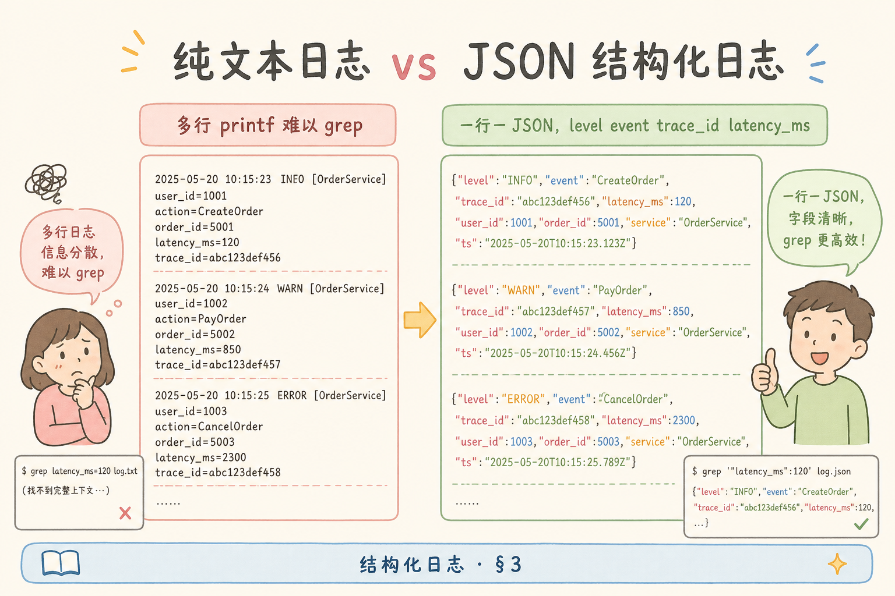
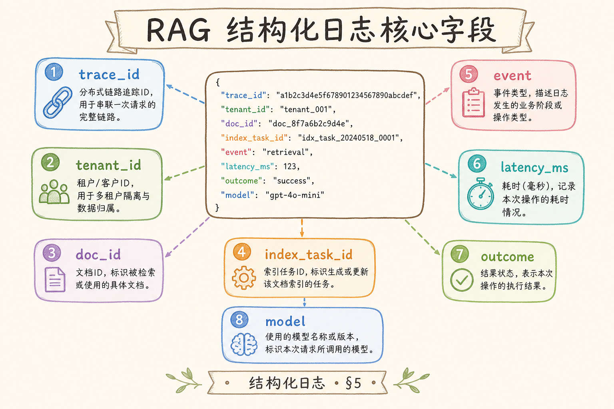
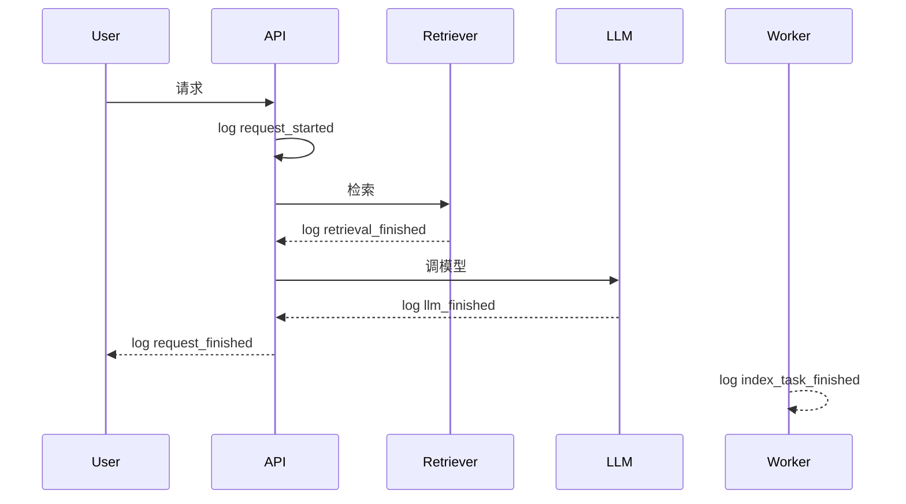
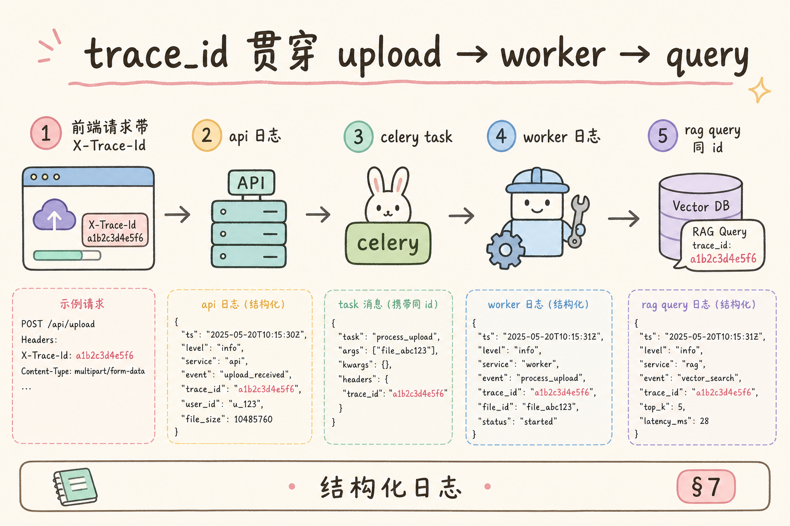
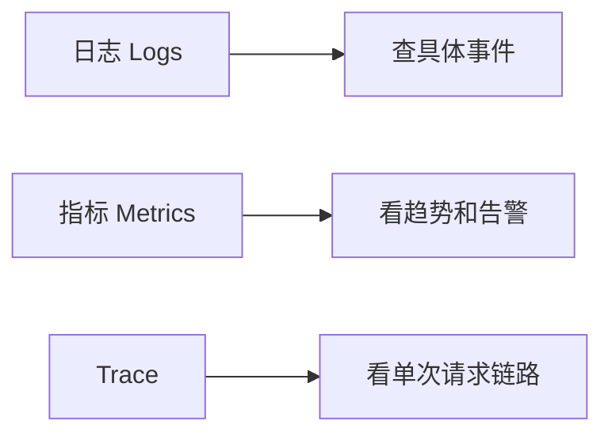

# G 生产化（五）：结构化日志（JSON）完全指南

> 初学阶段用 `print()` 看输出就够了；生产环境需要能搜索、聚合、关联和脱敏的日志。**结构化日志**解决的是：让每条日志都像一条可查询的数据记录，而不是一段难解析的自然语言。

---

## 目录

1. [为什么需要结构化日志](#1-为什么需要结构化日志)
2. [结构化日志是什么](#2-结构化日志是什么)
3. [它解决什么问题](#3-它解决什么问题)
4. [RAG 应该记录哪些字段](#4-rag-应该记录哪些字段)
5. [Python logging 最小配置](#5-python-logging-最小配置)
6. [API、Worker、LLM 调用如何埋点](#6-apiworkerllm-调用如何埋点)
7. [脱敏和高基数字段](#7-脱敏和高基数字段)
8. [日志、指标、Trace 的分工](#8-日志指标trace-的分工)
9. [常见陷阱与 FAQ](#9-常见陷阱与-faq)
10. [总结](#10-总结)

## 1. 为什么需要结构化日志

生产 RAG 出问题时，你通常要回答这些问题：哪个请求慢？检索用了哪些参数？LLM 调用失败了吗？用户属于哪个租户？Worker 处理的是哪个任务？

如果日志只是普通字符串，搜索和聚合会很痛苦：

```text
user 123 asked something and retrieval failed
```

结构化日志会把同样信息拆成字段：

```json
{"event":"retrieval_failed","user_id":"user_123","request_id":"req_456","tenant_id":"tenant_a","error_type":"timeout"}
```

这样日志平台可以按 `request_id`、`tenant_id`、`event`、`error_type` 精确查询。

### 1.1 排障场景对照

| 值班问题 | 非结构化日志 | 结构化日志 |
|----------|--------------|------------|
| “刚才 tenant_a 超时了几次？” | 全文搜 tenant，误匹配 message | `tenant_id="tenant_a" AND event="retrieval_failed"` |
| “req_456 完整路径？” | 手工拼 grep | `request_id="req_456"` 按时间排序 |
| “换模型后错误是否增多？” | 难统计 | `event="llm_finished" AND status="error" GROUP BY model` |

RAG 链路组件多，没有统一字段时，一次 P1 故障可能耗在 **找日志** 而非 **修 bug**。

### 1.2 与合规、审计的边界

结构化日志主要服务 **工程排障**。若需“谁何时访问了哪份文档”的追责，应另有审计日志（字段更严、保留更久、权限更窄）。二者可共用 `request_id`，但存储与访问策略分开，见 9.4。

---

## 2. 结构化日志是什么

**结构化日志**：用固定字段记录事件的日志，常见格式是 JSON。

通俗说：普通日志像写日记；结构化日志像填表。填表更麻烦一点，但后续能筛选、统计、关联。


结构化日志不要求每条日志都很长。关键是字段稳定、命名一致、敏感信息受控。

### 2.1 JSON 之外的选择

JSON 最常见，也便于 ELK、Loki、CloudWatch Logs Insights 解析。也可用 logfmt（`key=value`）或 Protobuf，团队选一种 **全栈统一** 即可。RAG Python 栈用 JSON 最省事。

### 2.2 字段设计原则

1. **稳定**：`event` 用 snake_case 固定枚举，不写散文
2. **扁平**：常用过滤字段放顶层，避免深嵌套
3. **可关联**：`request_id`、`trace_id` 贯穿 API、Worker、批任务
4. **可演进**：新增字段向后兼容；改名等于破坏查询

---

## 3. 它解决什么问题

没有统一字段时，一次 P1 可能耗在「找日志」而非「修 bug」。结构化日志让日志平台能按 `tenant_id`、`event`、`error_type` 精确过滤，并与 Prometheus 指标、Trace 通过 `request_id` 形成下钻闭环：指标报警 → 抽样 trace → 日志查 `event=llm_finished` 是否 `rate_limit`。注意：结构化日志服务工程排障，「谁何时访问哪份文档」的追责应走专用审计通道（见 [196](196.audit-log-rag-tutorial.md)），二者存储与 RBAC 分开。

| 问题 | 普通日志困难 | 结构化日志做法 |
|------|--------------|----------------|
| 查某次请求 | 只能全文搜索 | 用 `request_id` |
| 查某个租户 | 字符串不稳定 | 用 `tenant_id` |
| 查错误类型 | 文案多变 | 用 `error_type` |
| 统计失败率 | 难聚合 | 按 `event` / `status` |
| 关联 trace | 无统一 ID | 记录 `trace_id` |

结构化日志是后续检索调试台、审计日志、指标告警的基础之一。



### 3.1 从 print 迁移的最小步骤

1. 定义 10 个以内 **基础字段**（见第 4 节）
2. 用 `logging` + JSON formatter 替代 `print`
3. 在 API 入口生成 `request_id`，放进 `contextvars` 或 middleware
4. 选 5 个 **稳定 event** 先落地，再扩展

不必第一天就埋满全链路；先保证 **请求开始/结束、检索完成、LLM 完成、索引失败** 五条能查。

---

## 4. RAG 应该记录哪些字段

上线验收：随机抽一条 P1 请求，能否在日志平台用 `request_id` 串起 `request_started` → `retrieval_finished` → `llm_finished`？字段设计失败时，团队会退回 `grep` 全文，结构化投入归零。

字段设计遵循「稳定、扁平、可关联、可演进」：业务字段走 `extra` 而非拼进 message；`event` 用 snake_case 枚举；默认不记完整 query、prompt、API key。Worker 索引任务补充 `task_id`、`doc_id`、`chunk_count`，失败时足够定位重试而不必打全文 chunk。与 Prometheus 的 `retrieval_latency_ms` 对照，可形成指标报警后的日志下钻路径。

建议先统一一组基础字段：

| 字段 | 说明 |
|------|------|
| `timestamp` | 时间 |
| `level` | info / warning / error |
| `event` | 稳定事件名 |
| `request_id` | 一次请求 ID |
| `trace_id` | 跨服务链路 ID |
| `tenant_id` | 租户 |
| `user_id` | 用户，必要时 hash |
| `route` | API 路径或任务类型 |

RAG 相关字段：

| 字段 | 说明 |
|------|------|
| `retrieval_top_k` | 检索数量 |
| `retrieval_latency_ms` | 检索耗时 |
| `model` | LLM 模型 |
| `prompt_tokens` | prompt token |
| `completion_tokens` | completion token |
| `chunk_ids` | 命中的 chunk ID，注意数量和脱敏 |

不要记录完整 query、完整 prompt、完整 context，除非有严格脱敏和访问控制。

### 4.1 字段分层记忆

| 层 | 字段示例 | 何时写 |
|----|----------|--------|
| 关联 | `request_id`, `trace_id`, `tenant_id` | 几乎每条 |
| 业务事件 | `event`, `status`, `error_type` | 状态变化时 |
| RAG 参数 | `retrieval_top_k`, `model` | 检索/LLM 完成时 |
| 性能 | `retrieval_latency_ms`, `llm_latency_ms` | 同上，便于与 Prometheus 对照 |
| 调试 | `chunk_ids`（限量） | 仅 debug 级别或采样 |

### 4.2 error 时建议多写什么

| 字段 | 用途 |
|------|------|
| `error_type` | 稳定枚举：`retrieval_timeout`, `llm_rate_limit` |
| `error_message` | 简短技术信息，无用户原文 |
| `stacktrace` | 仅 error 级别，注意体积 |

避免 `error_message` 里拼接用户 query 或文档片段。

### 4.3 Worker 索引任务补充字段

| 字段 | 说明 |
|------|------|
| `task_id` | 队列任务 ID |
| `doc_id` | 正在索引的文档 |
| `chunk_count` | 本批 chunk 数 |
| `embedding_model` | 与向量库一致 |

索引失败时，`doc_id` + `task_id` 足够定位重试，不必打全文 chunk。

---

## 5. Python logging 最小配置

生产环境日志应输出到 stdout，由容器或 K8s 侧采集，避免本地巨型文件；级别默认 INFO，排障临时开 DEBUG 后及时收回。用 `contextvars` + `logging.Filter` 自动注入 `request_id`，业务代码只写 `event` 等业务字段，降低漏打关联 ID 的概率。`logger.exception` 配合 `extra` 可在 error 级自动带 stacktrace，同时避免在 message 里嵌套 JSON 字符串。

下面用 `python-json-logger` 演示最小 JSON 日志：



```bash
pip install python-json-logger
```

```python
import logging
from pythonjsonlogger import jsonlogger

logger = logging.getLogger("rag")
logger.setLevel(logging.INFO)

handler = logging.StreamHandler()
formatter = jsonlogger.JsonFormatter(
    "%(asctime)s %(levelname)s %(name)s %(message)s %(request_id)s %(tenant_id)s %(event)s"
)
handler.setFormatter(formatter)
logger.addHandler(handler)

logger.info(
    "retrieval finished",
    extra={
        "event": "retrieval_finished",
        "request_id": "req_123",
        "tenant_id": "tenant_a",
    },
)
```

这段代码的重点是 `extra`。业务字段不要拼进 message，而要作为字段写入日志。

### 5.1 为什么字段走 extra

日志平台按 JSON key 建索引。若写成 `logger.info(f"retrieval finished req={req_id}")`，`req_id`  trapped 在 message 字符串里，聚合困难。`extra` 使 `request_id` 成为一等公民。

### 5.2 生产环境补充

| 项 | 建议 |
|----|------|
| 输出 | stdout，由 K8s/容器采集，不写本地巨型文件 |
| 级别 | 生产 INFO；排障临时 DEBUG，用完收回 |
| 过滤器 | middleware 注入 `request_id`，避免每个 handler 手写 |
| 异常 | `logger.exception(..., extra={...})` 自动带 stacktrace |

### 5.3 contextvars 注入 request_id（模式）

在 FastAPI middleware 里 `request_id = uuid4()`，写入 `contextvars.ContextVar`，自定义 `logging.Filter` 把其并入每条 `LogRecord`。业务代码只 `logger.info("...", extra={"event": "..."})`，关联 ID 自动带上。

---

## 6. API、Worker、LLM 调用如何埋点

Worker 与 API 应共用 `request_id`/`trace_id` 注入方式，否则队列任务无法在日志平台与 API 请求对齐。`index_task_failed` 务必带 `task_id`、`doc_id`、`error_type`，足够定位重试而不打全文 chunk。

埋点粒度在「业务动作」级，不在每个 token 或每次 cosine 计算。优先落地五条稳定事件：`request_started`、`retrieval_finished`、`llm_finished`、`index_task_failed`、`request_finished`——覆盖主路径后再扩展。事件名一旦发布就不要随意改名，否则历史仪表盘与告警规则全部失效。



建议事件名：

| 事件 | 说明 |
|------|------|
| `request_started` | API 收到请求 |
| `retrieval_finished` | 检索完成 |
| `llm_finished` | LLM 调用完成 |
| `index_task_started` | 索引任务开始 |
| `index_task_failed` | 索引任务失败 |
| `answer_returned` | 答案返回 |

事件名要稳定，避免今天叫 `retrieval_done`，明天叫 `search_ok`。

### 6.1 每条事件建议携带的最小字段

| 事件 | 除基础字段外 |
|------|--------------|
| `request_started` | `route`, `user_id`（或 hash） |
| `retrieval_finished` | `retrieval_top_k`, `retrieval_latency_ms`, `status` |
| `llm_finished` | `model`, `prompt_tokens`, `completion_tokens`, `status` |
| `request_finished` | 端到端 `duration_ms`, `status` |
| `index_task_failed` | `task_id`, `doc_id`, `error_type` |

### 6.2 先错后对：message 里堆 JSON

```python
# ❌ 双份、难解析
logger.info(json.dumps({"event": "x", "request_id": "r1"}))

# ✅ message 简短，字段在 extra
logger.info("retrieval finished", extra={"event": "retrieval_finished", "request_id": "r1"})
```

### 6.3 与 Prometheus 对齐

日志里的 `retrieval_latency_ms` 不必替代 Histogram，但 P95 告警后，用 `retrieval_latency_ms > 2000` 在日志平台拉具体 `request_id`，形成 **指标 → 日志** 下钻闭环（见 [191](191.prometheus-metrics-rag-tutorial.md)）。

---

## 7. 脱敏和高基数字段

日志是合规与成本的双重战场：记了完整 query 可能违反个保/GDPR，记了百万级 `chunk_id` 会让存储与索引费用暴涨。默认策略是 hash 或只记长度；debug 采样需 RBAC；`Authorization` 绝不落盘。`trace_id` 从网关或 OpenTelemetry 注入，Worker 从消息体继承，才能在 Tempo/Jaeger 与日志平台间一跳关联。

日志最容易犯两个错误：泄漏敏感信息、写入高基数字段。



| 字段 | 建议 |
|------|------|
| 用户 query | 默认不记全文，可记 hash |
| prompt/context | 默认不记全文 |
| API key | 绝不记录 |
| chunk_ids | 可限量记录 |
| doc_title | 谨慎，可能含敏感信息 |

高基数字段是指取值非常多的字段，比如完整 query、chunk_id、文件名。它们不适合放进指标 label；在日志里也要控制长度和权限。

### 7.1 脱敏策略

| 数据 | 做法 |
|------|------|
| 用户 query | `query_hash=sha256(normalize(q))` 或仅记长度 |
| 手机号、身份证 | 中间位 `***` 或完全不记 |
| Authorization header | 不记；若必须记则只记 `Bearer ***` |
| 检索 context | 默认不记；debug 采样 1%，且限管理员 RBAC |

### 7.2 高基数在日志里也会疼

百万级 `chunk_id` 若每条日志都打全列表，存储与索引成本暴涨。建议：只记 `chunk_count` 与前 3 个 `chunk_id`，或仅 error 时记全量。

### 7.3 trace_id 如何贯穿

API 入口从网关或 OpenTelemetry 取 `trace_id`，写入日志与下游 HTTP header。Worker 消费队列时从消息体带 `trace_id`。这样 Grafana Tempo / Jaeger 里一个 trace 可跳到同一 `trace_id` 的日志行。

---

## 8. 日志、指标、Trace 的分工

三者不是重复建设：指标回答「最近十分钟是否变慢」；Trace 回答「单次请求时间花在哪些 span」；日志回答「这次请求具体发生了什么事件」。小团队可让 `request_id` 与 `trace_id` 暂时共用，服务变多后应拆分：网关生成 `trace_id`，各服务入口生成 `span_id`，产品工单仍用 `request_id` 对齐。



| 工具 | 回答的问题 |
|------|------------|
| 日志 | 这次请求发生了什么？ |
| 指标 | 最近 10 分钟系统是否变慢？ |
| Trace | 请求时间花在哪些阶段？ |

结构化日志不是万能工具。延迟趋势看 Prometheus，跨服务调用链看 tracing，安全追责看审计日志。

### 8.1 典型下钻路径

1. Prometheus：P95 升高
2. Trace：抽样慢请求，看检索 vs LLM 跨度
3. 日志：`trace_id` 或 `request_id` 查 `event=llm_finished` 是否 `error_type=rate_limit`
4. 修复后：指标回落 + 日志 error 减少双向确认

### 8.2 不要重复造三套 ID

小团队可 `request_id == trace_id`；服务变多后拆分：网关生成 `trace_id`，每个服务入口生成 `span_id`，业务仍用 `request_id` 对齐产品侧工单。

---

## 9. 常见陷阱与 FAQ

这一节收束结构化日志的边界。它的目标是可查询和可关联，不是把所有内部变量都写出去。

### 9.1 message 字段还需要吗？

需要，但 message 应该是简短说明。真正用于查询的内容放结构化字段。

### 9.2 可以把完整 prompt 打日志吗？

默认不要。prompt 可能包含用户数据、文档片段和密钥误注入内容。需要调试时用受控采样和脱敏。

### 9.3 request_id 和 trace_id 有什么区别？

`request_id` 标识一次业务请求；`trace_id` 标识跨服务链路。小系统可以先共用，复杂系统建议分开。

### 9.4 结构化日志能替代审计日志吗？

不能。审计日志字段更稳定、权限更严、保留更久。结构化日志服务排障，审计日志服务追责。

### 9.5 日志级别滥用

把所有检索结果打 DEBUG 且长期开在生产，磁盘与费用会爆。用 **动态调高级别** 或 **按 request_id 采样 debug**。

### 9.6 多行 stacktrace 破坏 JSON

确保 formatter 与采集器支持多行异常；或 stacktrace 单独字段转义。否则 Loki/ELK 解析断行。

### 9.7 时钟与时区

统一 UTC ISO8601 写入 `timestamp`，展示层再转本地。多区域排障时避免“日志顺序错乱”误判因果。

---

## 10. 总结

结构化日志的核心是把日志变成可查询字段：稳定事件名、统一请求 ID、清晰租户信息、受控脱敏。

上线验收时自问：能否在五分钟内在日志平台按 `request_id` 串起 API → Worker → LLM 全链路？默认是否已屏蔽 query 全文与 API key？是否与 [191](191.prometheus-metrics-rag-tutorial.md) 指标能按时间窗口或 ID 下钻？三项皆满足，才算从 `print` 迁移完成。

### 10.1 本篇检查清单

- [ ] 使用 JSON formatter，业务字段走 `extra`
- [ ] 至少 5 个稳定 `event` 覆盖请求与索引主路径
- [ ] 默认不记完整 query/prompt/API key
- [ ] `request_id` / `trace_id` 在 API 与 Worker 一致
- [ ] 与 Prometheus 指标能按 ID 或时间窗口下钻

一句话记忆：**普通日志给人读；结构化日志既给人读，也给机器筛选、聚合和关联。**
