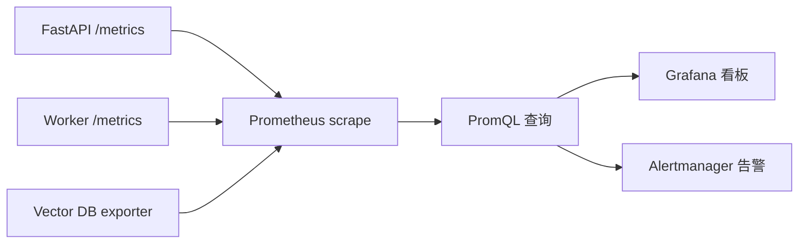
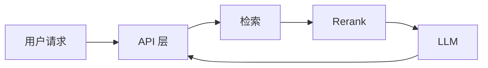
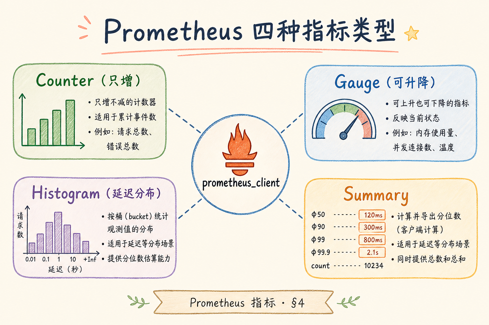
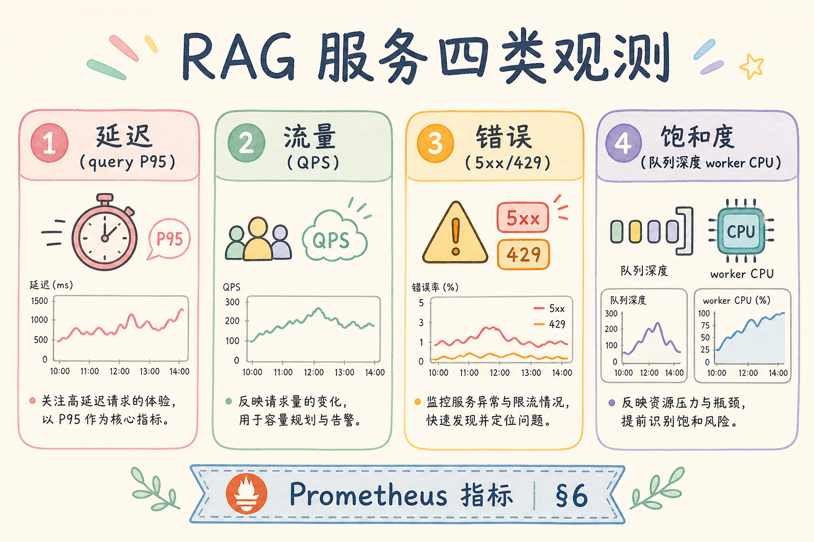
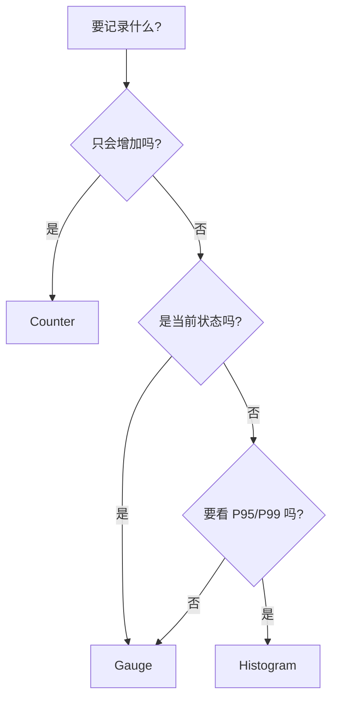
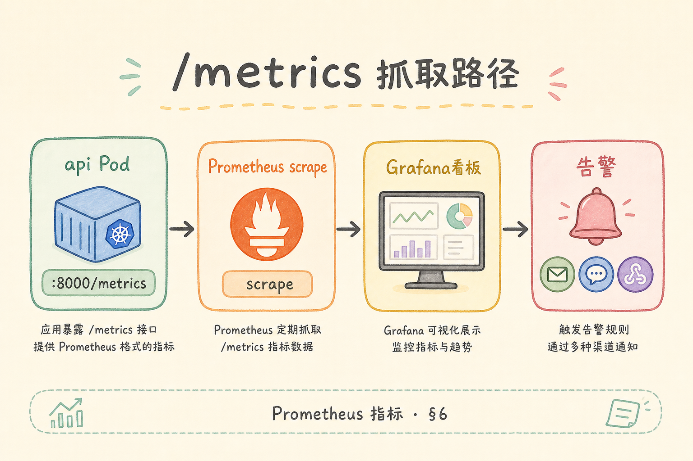

# G 生产化（六）：Prometheus 指标完全指南

> 日志告诉你“发生了什么”；指标告诉你“系统整体状态正在变好还是变坏”。**Prometheus** 是常见的指标采集和告警工具。对 RAG 项目来说，它能持续观察 API 延迟、检索耗时、embedding 成本、Worker 队列、错误率和向量库状态。

---

## 目录

1. [为什么需要 Prometheus](#1-为什么需要-prometheus)
2. [Prometheus 是什么](#2-prometheus-是什么)
3. [它解决什么问题](#3-它解决什么问题)
4. [RAG 应该采哪些指标](#4-rag-应该采哪些指标)
5. [FastAPI 暴露 /metrics](#5-fastapi-暴露-metrics)
6. [Counter、Gauge、Histogram 怎么选](#6-countergaugehistogram-怎么选)
7. [Prometheus 怎么抓取](#7-prometheus-怎么抓取)
8. [告警和看板怎么设计](#8-告警和看板怎么设计)
9. [常见陷阱与 FAQ](#9-常见陷阱与-faq)
10. [总结](#10-总结)

## 1. 为什么需要 Prometheus

没有指标的系统只能靠用户投诉和日志排查。RAG 系统尤其容易出现“慢慢变坏”的问题：队列积压越来越多、向量库查询越来越慢、embedding token 成本突然升高、P95 延迟逐步爬升。

日志适合查单个请求；指标适合看整体趋势。生产系统需要两者配合。

| 问题 | 日志能做什么 | 指标能做什么 |
|------|--------------|--------------|
| 某次请求失败 | 查错误堆栈 | 统计失败率是否升高 |
| 用户觉得慢 | 查单次 trace | 看 P95/P99 延迟 |
| Worker 积压 | 查任务日志 | 看队列长度趋势 |
| 成本异常 | 查调用记录 | 看 token 总量和单请求均值 |

### 1.1 “慢慢变坏”的典型曲线

RAG 链路长：API → 检索 → rerank → LLM → 后处理。某一环劣化 50ms，单条日志不易察觉；但 P95 在一周内从 2s 爬到 8s，指标曲线一眼可见。Prometheus 的价值是把这类退化 **在用户大规模投诉前** 暴露给值班。

### 1.2 与结构化日志、Trace 的分工

| 手段 | 强项 | 弱项 |
|------|------|------|
| 指标（本文） | 趋势、告警、容量规划 | 不解释单次请求细节 |
| 结构化日志 | 事件、错误类型、租户 | 难做全局 P95 聚合 |
| Trace | 阶段耗时、跨服务 | 采样与存储成本高 |

三者共用 `request_id` / `trace_id` 串联，见 [190 结构化日志](190.structured-logging-rag-tutorial.md)。

---

## 2. Prometheus 是什么

**Prometheus**：一个开源监控系统。它按固定间隔主动访问服务的 `/metrics` 接口，把指标拉回来存储，并支持查询和告警。

通俗说：你的服务把体温、心率、血压写在 `/metrics`；Prometheus 像护士，每隔几秒来抄一次。



Prometheus 的关键特点是 pull 模型：不是服务主动推送，而是 Prometheus 定时抓取。

### 2.1 Pull vs Push（知道即可）

Prometheus 默认 **拉取** 各 target 的 `/metrics`。短生命周期任务（如 Cron 批处理）可用 Pushgateway，但 RAG 的 API 与 Worker 常驻进程，直接暴露 `/metrics` 即可。

### 2.2 时间序列是什么

每个指标名 + label 组合是一条时间序列。例如 `rag_requests_total{route="/chat",status="ok"}` 与 `status="error"` 是两条序列。命名稳定、label 低基数，是长期可维护的前提。

---

## 3. 它解决什么问题

Prometheus 回答的是「系统整体是否在变坏」：队列是否在积压、P95 是否在爬升、embedding token 是否突增。它不能替代日志里的错误堆栈，也不能替代 Trace 里的跨服务跨度——三者共用 label 与 ID 串联即可。RAG 链路长，某一环劣化 50ms 单条日志不易察觉，但一周 P95 从 2s 到 8s 的曲线会在指标层一眼暴露。

Prometheus 解决的是“系统是否健康”的连续观测问题。它不替代日志，也不替代 tracing。

对 RAG 来说，Prometheus 常用于回答这些问题：

| 问题 | 典型指标 |
|------|----------|
| API 是否变慢 | `http_request_duration_seconds` |
| 检索是否变慢 | `rag_retrieval_duration_seconds` |
| Worker 是否积压 | `rag_index_queue_depth` |
| LLM 调用是否失败 | `llm_requests_total{status="error"}` |
| embedding 成本是否异常 | `embedding_tokens_total` |

### 3.1 按 RAG 阶段拆指标



| 阶段 | 建议观测 | 告警关注点 |
|------|----------|------------|
| API | 端到端延迟、5xx 率 | SLA 违约 |
| 检索 | `rag_retrieval_duration_seconds`、错误计数 | 向量库或 filter 异常 |
| Rerank | 可选单独 Histogram | CPU 或模型服务超时 |
| LLM | token 总量、错误率、超时 | 供应商限流、成本飙升 |
| Worker | 队列深度、任务失败率 | 索引积压 |

先保证 **端到端 + 检索 + 队列 + LLM 错误** 四条线，再细化 rerank、embedding 子阶段。

---

## 4. RAG 应该采哪些指标

指标设计原则是「少而稳、低基数、可行动」：先把流量、端到端延迟、错误、队列四条线跑通，再根据值班反馈加细。不要把 `query`、`chunk_id`、`doc_title` 放进 label——它们属于日志与 trace 的领域。命名统一前缀 `rag_`/`llm_`，Counter 用 `_total`，延迟用 `_seconds` 的 Histogram，便于 PromQL 与 Grafana 复用。

不要一开始就采几十个指标。先覆盖四类：流量、延迟、错误、资源/成本。



| 类别 | 指标示例 | 说明 |
|------|----------|------|
| 流量 | `rag_requests_total` | 请求量 |
| 延迟 | `rag_answer_duration_seconds` | 端到端耗时 |
| 错误 | `rag_errors_total` | 按错误类型拆分 |
| 检索 | `rag_retrieval_duration_seconds` | 检索耗时 |
| 队列 | `rag_index_queue_depth` | 索引任务积压 |
| 成本 | `llm_tokens_total` | token 消耗 |

指标命名要稳定。不要把用户问题、文档标题、chunk 文本放进 label，否则会造成高基数问题，让 Prometheus 存储爆炸。

### 4.1 命名约定（建议）

- 前缀统一：`rag_`、`llm_`、`embedding_`
- Counter 用 `_total` 后缀
- 延迟用 `_seconds`，Histogram 桶单位一致
- label 只放 **低基数**：`route`、`status`、`error_type`、`model`（若模型种类有限）

### 4.2 第一批上线最小集

| 指标名 | 类型 | label 建议 |
|--------|------|------------|
| `rag_requests_total` | Counter | `route`, `status` |
| `rag_answer_duration_seconds` | Histogram | `route` |
| `rag_retrieval_duration_seconds` | Histogram | 可无或 `backend` |
| `rag_errors_total` | Counter | `error_type` |
| `rag_index_queue_depth` | Gauge | — |
| `llm_tokens_total` | Counter | `model`, `type`（prompt/completion） |

上线一周后再根据值班反馈加指标，避免一开始仪表盘爆炸却无人看。

### 4.3 高基数反面教材

```text
# ❌ 每条请求一个 label
rag_requests_total{query="用户原话..."}

# ❌ 每个 chunk_id
rag_hits_total{chunk_id="chunk_88271..."}

# ✅ 聚合维度
rag_errors_total{error_type="retrieval_timeout"}
```

用户 query 进日志或 trace；指标只统计 **类** 而非 **实例**。

---

## 5. FastAPI 暴露 /metrics

中间件覆盖全站 HTTP 请求可避免「某个路由漏埋点」；但端到端 Histogram 无法区分检索慢还是 LLM 慢——应在 retriever 与 LLM 客户端单独包计时。Worker 另开端口或复用 health 端口暴露 `/metrics`，至少含队列深度 Gauge 与任务 Counter。`/metrics` 生产环境仅内网可访问，不对公网开放。

下面代码演示 FastAPI 如何暴露 `/metrics`。它需要安装 `prometheus-client`：

```bash
pip install prometheus-client
```

```python
from fastapi import FastAPI, Response
from prometheus_client import Counter, Histogram, generate_latest, CONTENT_TYPE_LATEST
import time

app = FastAPI()

REQUESTS = Counter(
    "rag_requests_total",
    "Total RAG requests",
    ["route", "status"],
)

LATENCY = Histogram(
    "rag_answer_duration_seconds",
    "End-to-end RAG answer latency",
    buckets=(0.5, 1, 2, 5, 10, 30),
)

@app.middleware("http")
async def metrics_middleware(request, call_next):
    start = time.perf_counter()
    status = "ok"
    try:
        response = await call_next(request)
        if response.status_code >= 500:
            status = "error"
        return response
    except Exception:
        status = "error"
        raise
    finally:
        elapsed = time.perf_counter() - start
        REQUESTS.labels(route=request.url.path, status=status).inc()
        LATENCY.observe(elapsed)

@app.get("/metrics")
def metrics():
    return Response(generate_latest(), media_type=CONTENT_TYPE_LATEST)
```

这段代码演示三件事：Counter 计数请求量，Histogram 记录延迟分布，`/metrics` 暴露给 Prometheus 抓取。

### 5.1 中间件里记了什么

| 行为 | 指标效果 |
|------|----------|
| 每个 HTTP 请求经过 middleware | 全站覆盖，避免漏埋点 |
| `status` 按 5xx 标 error | 便于告警错误率 |
| `LATENCY.observe` | 累积进 Histogram 桶，供 PromQL 算 P95 |

### 5.2 检索与 LLM 建议单独 Histogram

middleware 只有端到端延迟。在 retriever 与 LLM 客户端 **包裹计时**，否则端到端变慢时，无法判断是检索还是 LLM 拖后腿。

### 5.3 Worker 暴露指标

索引 Worker 另起 HTTP 端口或复用 health 端口暴露 `/metrics`，至少包含：`rag_index_queue_depth`（Gauge）、`rag_index_tasks_total{status}`（Counter）、任务耗时 Histogram。

---

## 6. Counter、Gauge、Histogram 怎么选

选错类型会导致告警失真：用 Gauge 记每次请求耗时只剩最后一次；用 Counter 记队列长度无法下降。P95 延迟应使用 Histogram 在 Prometheus 侧 `histogram_quantile`，而非把耗时写日志再手算。进程重启后 Counter 归零是预期行为，看图与告警用 `rate()`/`increase()`，不要跨重启比绝对值。

初学者最容易选错指标类型。

| 类型 | 用途 | 示例 |
|------|------|------|
| Counter | 只增不减的累计次数 | 请求总数、错误总数、token 总数 |
| Gauge | 可增可减的当前值 | 队列长度、在线 worker 数 |
| Histogram | 分布和分位数 | 请求耗时、检索耗时 |





P95 延迟通常用 Histogram，而不是把每次耗时写日志后再手算。

### 6.1 常见选错与修正

| 错误 | 为什么错 | 应改为 |
|------|----------|--------|
| 用 Gauge 记每次请求耗时 | 只剩最后一次，无分布 | Histogram.observe |
| 用 Counter 记队列长度 | Counter 不能减 | Gauge.set |
| 重启后 Counter 归零 | 正常；用 `rate()` 看增速 | 告警用 rate/increase |

### 6.2 PromQL 一眼会用

```promql
# 5 分钟请求 QPS
rate(rag_requests_total[5m])

# P95 端到端延迟（Histogram）
histogram_quantile(0.95, sum(rate(rag_answer_duration_seconds_bucket[5m])) by (le))

# 错误占比
sum(rate(rag_requests_total{status="error"}[5m])) / sum(rate(rag_requests_total[5m]))
```

Grafana 面板可直接绑这些查询；告警规则用相同表达式加阈值。

### 6.3 Histogram 桶怎么选

桶应覆盖业务 SLA：RAG 若 P95 目标 5s，桶宜包含 `0.5, 1, 2, 5, 10, 30`（与示例代码一致）。桶太稀会低估 P99；太密增加存储，一般 10～20 个桶足够。

---

## 7. Prometheus 怎么抓取

Pull 模型下，每个 API 副本都会被独立 scrape，PromQL 聚合时要明确是实例级还是全局级。K8s 环境用 `kubernetes_sd_configs` 替代手写 IP；抓取失败先查 target 是否 down、端口是否监听 `0.0.0.0`、自定义指标是否 import。保留时间 `retention` 与磁盘规划要提前做，否则历史曲线断档后无法复盘发布前后对比。

Prometheus 配置示例：

```yaml
global:
  scrape_interval: 15s

scrape_configs:
  - job_name: "rag-api"
    static_configs:
      - targets: ["api:8000"]

  - job_name: "rag-worker"
    static_configs:
      - targets: ["worker:9000"]
```

如果使用 Docker Compose，`api` 和 `worker` 是服务名。Prometheus 容器和它们在同一个 network 时，可以直接用服务名访问。

### 7.1 配置项说明

| 字段 | 含义 |
|------|------|
| `scrape_interval: 15s` | 每 15 秒拉一次 `/metrics` |
| `job_name` | 逻辑分组，label `job` 会带上 |
| `targets` | host:port，路径默认 `/metrics` |

### 7.2 生产注意

- **服务发现**：K8s 上用 `kubernetes_sd_configs`，避免手写 IP
- **网络**：Prometheus 能访问 pod/容器网络；`/metrics` 不对公网开放
- **多副本**：每个 API 副本都会被 scrape，PromQL 用 `sum` 聚合时要理解是 **实例级** 还是 **全局**

### 7.3 抓取失败排查

| 现象 | 检查 |
|------|------|
| target down | 端口、防火墙、服务是否监听 0.0.0.0 |
| 无自定义指标 | 是否 import 了 prometheus_client、是否打到请求路径 |
| 数据断层 | Prometheus 自身磁盘、保留时间 `retention` |

---

## 8. 告警和看板怎么设计

先做少量真正有行动意义的告警：

| 告警 | 触发条件示例 | 处理动作 |
|------|--------------|----------|
| API 错误率高 | 5xx 比例 > 2% 持续 5 分钟 | 查日志和最近发布 |
| P95 延迟高 | P95 > 10 秒 持续 10 分钟 | 查检索、LLM、队列 |
| 队列积压 | `rag_index_queue_depth` 持续上升 | 加 worker 或查失败任务 |
| LLM 错误多 | error counter 突增 | 查供应商和限流 |





看板建议按用户体验组织：请求量、错误率、P95 延迟、检索耗时、队列积压、token 成本。不要把所有底层指标堆在同一页。

### 8.1 告警设计原则

1. **可行动**：每条告警对应 runbook 第一步（查哪张图、哪个日志字段）
2. **少而精**：上线初期 4～6 条，避免 Alertmanager 刷屏后被忽略
3. **持续窗口**：用 `for: 5m` 过滤毛刺，避免单次慢请求半夜叫醒人
4. **分级**：P1 用户不可用；P2 退化；P3 容量预警

### 8.2 Grafana 看板布局建议

| 行 | 面板 |
|----|------|
| 第一行 | QPS、错误率、P95 端到端 |
| 第二行 | 检索 P95、LLM 错误率、队列深度 |
| 第三行 | token 增速、embedding 调用（若有） |
| Drill-down | 链到日志平台：按 `route` 过滤最近 error 日志 |

### 8.3 与发布联动

发版前后对比 `rate(rag_errors_total)` 与 P95。若金丝雀实例单独 scrape，可在全量前发现指标回归。

---

## 9. 常见陷阱与 FAQ

这一节收束 Prometheus 在 RAG 项目里的边界。它负责趋势和告警，不负责解释每一次请求的完整链路。

### 9.1 能不能把 query 放进 label？

不能。用户 query、chunk_id、doc_title 都是高基数字段，会让 Prometheus 存储膨胀。它们应该进入日志或 trace。

### 9.2 Histogram 和 Summary 选哪个？

多数服务端场景先选 Histogram。它能在 Prometheus 侧聚合，适合看 P95/P99。

### 9.3 /metrics 要不要鉴权？

生产环境要限制访问。通常只允许 Prometheus 所在网络访问，不对公网暴露。

### 9.4 Prometheus 能替代 tracing 吗？

不能。Prometheus 看趋势；tracing 看单次请求链路；日志看具体错误细节。

### 9.5 Counter 重启归零怎么办？

进程重启后 Counter 从 0 开始是预期行为。告警与看图用 `rate()` / `increase()`，不要直接比较 Counter 绝对值跨重启。

### 9.6 多租户要在指标里分 tenant_id 吗？

仅当租户数量 **少且固定**（如企业版十几个大客户）时可作为 label。SaaS 成千上万租户时，用日志聚合或单独计费系统，不要写入 Prometheus label。

### 9.7 指标太多没人看

与 4.2 最小集对齐；每月复盘删除从未触发、从未打开的曲线。可观测性是 **为值班服务**，不是为凑满仪表盘。

---

## 10. 总结

Prometheus 的核心价值是持续采集指标，让团队知道 RAG 系统是否变慢、变贵、变不稳定。

上线检查：API 与 Worker 是否暴露 `/metrics` 且仅内网可达？是否至少有流量、延迟、错误、队列四类指标？Grafana 能否出 P95 且 Alertmanager 有 4 条以内可行动告警？与 [190](190.structured-logging-rag-tutorial.md) 能否按 `request_id` 下钻？可观测性的目标是服务值班，不是凑满仪表盘。

### 10.1 本篇检查清单

- [ ] API 与 Worker 暴露 `/metrics`，且仅内网可访问
- [ ] 至少有流量、端到端延迟、错误、队列四类指标
- [ ] 未把 query/chunk_id 放进 label
- [ ] Grafana 能出 P95；Alertmanager 有 4 条以内可行动告警
- [ ] 与结构化日志共用 `request_id` 便于下钻

一句话记忆：**日志查单点，指标看趋势；Prometheus 负责把 RAG 系统的趋势持续记录下来。**
