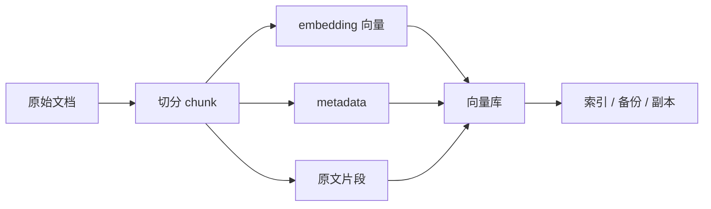
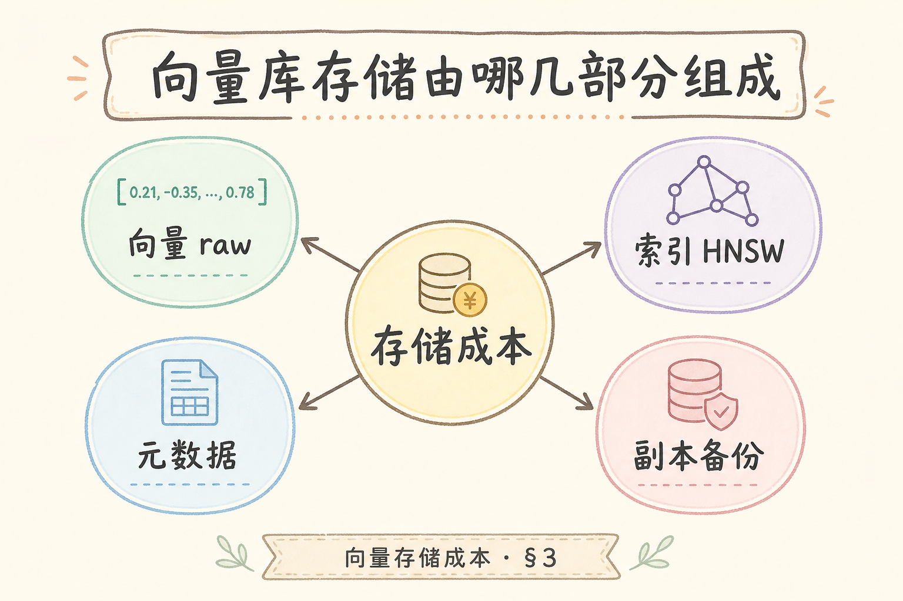
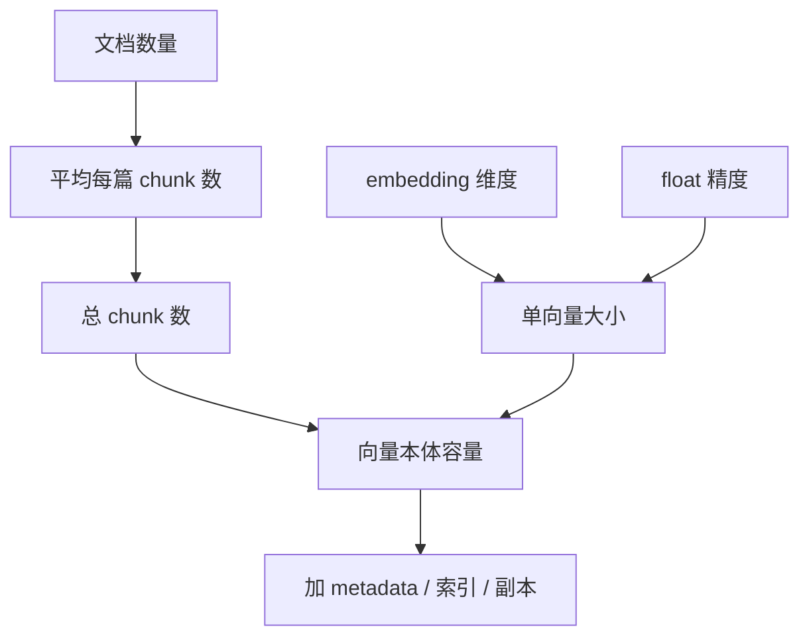
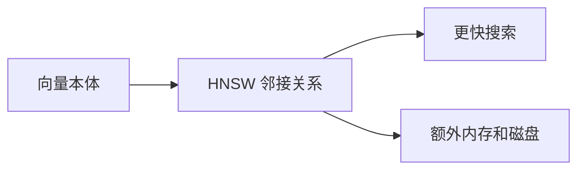
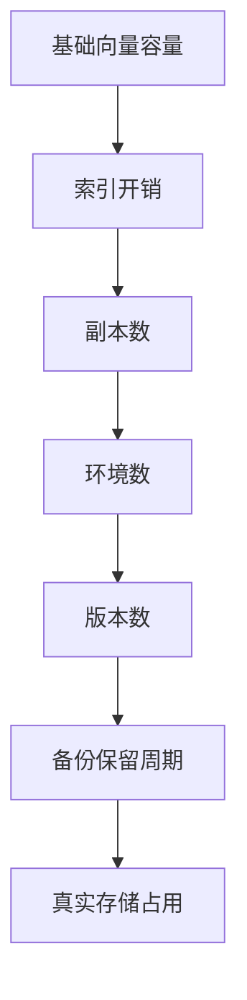
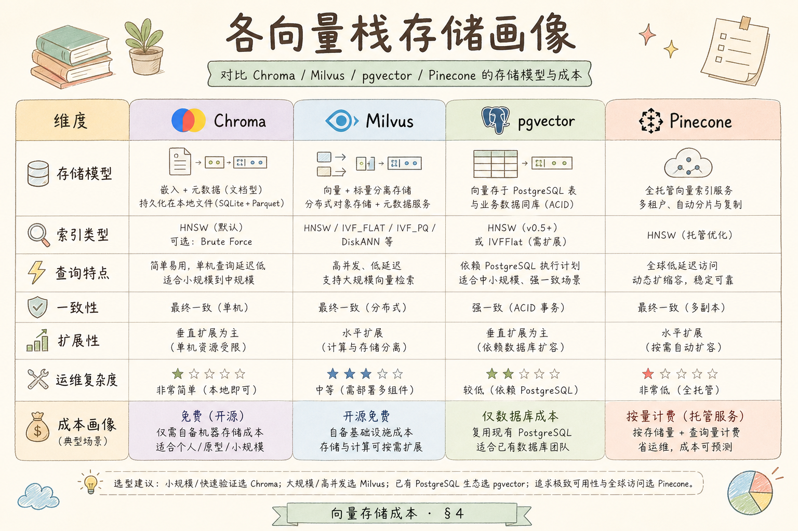

# G 生产（十五）：向量库存储成本入门

很多团队做 RAG 成本估算时只看模型 API 账单，忽略了向量库本身也会持续占用磁盘、内存、对象存储和备份空间。文档越多、版本越多、metadata 越肥，存储成本就越明显。

本文面向刚开始做生产化 RAG 的初学者，讲清楚向量存储成本由哪些部分组成，如何粗算容量，以及哪些设计会让成本突然膨胀。

## 目录

- [1. 向量库存储为什么会花钱](#1-向量库存储为什么会花钱)
- [2. 成本由哪些部分组成](#2-成本由哪些部分组成)
- [3. 粗算公式：维度 × 条数 × 精度](#3-粗算公式维度--条数--精度)
- [4. metadata 和原文常被低估](#4-metadata-和原文常被低估)
- [5. 索引结构开销](#5-索引结构开销)
- [6. 增量、版本和环境](#6-增量版本和环境)
- [7. 最小估算脚本](#7-最小估算脚本)
- [8. 常见错误](#8-常见错误)
- [9. FAQ](#9-faq)
- [10. 总结](#10-总结)

## 1. 向量库存储为什么会花钱

**向量**是 embedding 模型把文本转换出来的一串数字。向量库需要保存这些数字，还要保存索引结构、metadata、可能的原文片段和备份。

一次文档入库通常会产生这些数据：



所以存储成本不是“向量大小”一个数字，而是一组数据的总和。

### 1.1 案例：账单里“向量库”突然翻倍

某内部知识库上线半年后，云账单里托管向量库磁盘从 80GB 涨到 190GB，但文档数只增了 30%。排查发现三件事叠加：

1. 换 embedding 模型后 **新旧 collection 并存**，旧库未设清理期；
2. 每个 chunk 的 metadata 里重复存了 **整篇 doc_title + 文件路径**（平均 400 字节 × 200 万 chunk）；
3. staging 与 prod **共用同一备份策略**，快照保留 30 天 × 2 环境。

这不是“向量维度算错”，而是 **版本、metadata、环境** 三类放大因子被忽略。下文第 6 节会专门讲如何把这些写进估算表。

### 1.2 与 embedding API 成本的分工

| 成本类型 | 发生时机 | 是否持续 |
|----------|----------|----------|
| Embedding API | 入库、重建索引 | 一次性或批量 |
| 向量库存储 | 数据落盘后 | **按月持续** |
| 备份/副本 | 策略开启后 | **按月持续** |

做方案评审时，应同时给出 **首年入库 embedding 费** 与 **稳态存储月费**，避免只批模型预算、不批磁盘。

## 2. 成本由哪些部分组成

方案评审时应同时给出 **首年 embedding API 费** 与 **稳态存储月费**——只批模型预算、不批磁盘，半年后账单翻倍往往来自 metadata 膨胀、多版本 collection 并存与备份策略叠加，而非向量维度算错。不同部署形态（托管、pgvector 自建、内存型 HNSW）计费画像不同，估算要看实际部署方式。

向量存储成本可以拆成五类：

| 成本项 | 白话解释 |
| --- | --- |
| 向量本体 | 每个 chunk 的 embedding 数组 |
| metadata | 文档 id、页码、租户、权限、标题等字段 |
| 原文片段 | 为引用和预览保存的 chunk 文本 |
| 索引结构 | HNSW、IVF 等加速搜索的数据结构 |
| 副本与备份 | 高可用副本、快照、对象存储备份 |

不同向量库的账单方式不同。有的按磁盘，有的按内存，有的按节点规格，有的还要算对象存储。估算时要看你实际部署方式，而不是只看文档里的“向量大小公式”。

### 2.1 各栈计费画像（粗对比）

| 部署形态 | 账单常看什么 | 排错时先查 |
|----------|--------------|------------|
| 托管向量库（按容量） | 磁盘 GB、节点规格 | collection 条数、是否多版本 |
| 自建 pgvector | Postgres 磁盘 + 内存 | 表大小、`pg_total_relation_size` |
| 内存型 HNSW 服务 | RAM 峰值 | `M`、`efConstruction`、副本数 |
| 对象存储 + 导出 | S3 类存储 + 请求 | 周导出是否压缩、生命周期 |

详见 [192 Embedding 批处理成本](192.embedding-batch-cost-tutorial.md)（算 token）与 [90 向量库备份](90.vector-db-backup-tutorial.md)（快照保留）。

## 3. 粗算公式：维度 × 条数 × 精度

粗算只覆盖向量本体；生产估算通常再乘索引系数、metadata 比例、副本数与环境数。常见错误是「只乘维度忘条数」——1536 维本身很小，乘上百万 chunk 才是账单量级。先用业务参数换算 chunk 总数，再代入公式，最后用第 7 节脚本与线上 collection 大小校准系数。

向量本体可以先用一个粗公式估算：

```text
向量字节数 = chunk 数量 × 向量维度 × 每个数字字节数
```

常见 float32 每个数字 4 字节。如果有 100 万个 chunk，每个向量 1536 维：

```text
1,000,000 × 1536 × 4 ≈ 6,144,000,000 bytes ≈ 5.72 GiB
```

下面这张图展示估算入口：





注意：这个结果只是向量本体，不包括 metadata、索引和副本。生产估算通常要再乘一个系数。

### 3.1 动手：把业务参数换成 chunk 数

| 输入 | 示例 | 换算 |
|------|------|------|
| 文档数 | 5 万份 PDF | — |
| 平均页数 | 12 页 | — |
| 切块策略 | 512 token/块，20% 重叠 | 约 15 块/篇 |
| **chunk 总数** | — | 5万 × 15 ≈ **75 万** |

代入公式：`750,000 × 1536 × 4 ≈ 4.3 GiB` 仅向量本体。若索引系数 0.7、metadata 0.3、副本 2，粗算总量约 **4.3 × (1+1.0) × 2 ≈ 17 GiB** 量级——仍可能低于真实值，需用第 7 节脚本 + 线上校准。

### 3.2 先错对已：只乘维度忘条数

```text
❌ “我们用的是 1536 维，所以很小” — 未乘 chunk 数
✅ 先估 chunk 总数，再 × 维度 × 4 字节
```

## 4. metadata 和原文常被低估

metadata 是每条向量旁边的结构化信息，例如：

```json
{
  "tenant_id": "tenant_a",
  "doc_id": "policy_001",
  "page": 12,
  "acl": ["finance", "legal"],
  "title": "差旅报销制度"
}
```

这些字段看起来很小，但如果每个 chunk 都重复保存长标题、长路径、权限列表，规模上来后会明显占空间。

最容易浪费的是把全文塞进 metadata：

```json
{
  "doc_id": "policy_001",
  "text": "这里放了几千字原文……"
}
```

更稳妥的做法是：metadata 只放过滤和展示必要字段，长原文放对象存储或专门的文档表，通过 `doc_id` 和 `chunk_id` 关联。

### 4.1 案例：title 重复 200 万次

假设 `title` 平均 200 字符（UTF-8 约 600 字节），200 万 chunk 每条都带一份 title，仅 title 字段就约 **1.2GB** metadata，还不含 `acl` 数组。优化：title 只存 **doc 级** 表，chunk metadata 只留 `doc_id`。

### 4.2 评测：metadata 瘦身前后对比

| 指标 | 瘦身前 | 瘦身后（doc 表） |
|------|--------|------------------|
| 单条 metadata 字节 | ~800 | ~120 |
| collection 导出大小 | 基准 | 常降 20%～40%（视原文是否仍内嵌） |
| 检索 filter 字段 | 不变 | 不变 |

瘦身 **不能** 删掉 `tenant_id`、`doc_id` 等 filter 必需字段。

## 5. 索引结构开销

向量库为了快速搜索，会额外保存索引结构。**HNSW** 是一种常见近似最近邻索引，可以把它理解为“给向量之间建了一张多层导航网”。搜索更快，但这张网也要占空间。



不同索引的开销不同：

| 索引类型 | 特点 |
| --- | --- |
| Flat | 几乎没有额外索引，但搜索慢 |
| IVF | 先分桶再搜索，适合较大规模 |
| HNSW | 搜索快，常见，但内存开销较高 |

所以容量规划不能只算 embedding 数组。选择 HNSW 时，至少要预留额外索引空间。

### 5.1 与 [86 HNSW](86.hnsw-index-tutorial.md) 参数的关系

`M` 越大，图边越多，**内存与磁盘索引开销越高**，召回通常更好。成本优化不是无脑压 `M`，而是：在 recall@k 达标前提下选最小 `M`（见 [87 ANN 评测](87.ann-recall-latency-tutorial.md)）。

### 5.2 排错：磁盘够但 OOM

现象：向量文件不大，Pod 因内存被杀。常见原因：HNSW **全内存加载**、副本双份、查询高峰缓存。对策：降 `M`、量化、分片、或换磁盘型索引策略——每项都要用 recall 评测验证。

## 6. 增量、版本和环境

换 embedding 模型后新旧 collection 并存、dev/staging/prod 各一套、每日快照保留 30 天——三类因子叠加可使存储在文档数仅增 30% 时磁盘翻倍。runbook 应写清：旧 collection 只读保留期、实验数据 TTL、删库前确认备份策略。与 [90 向量库备份](90.vector-db-backup-tutorial.md) 联动，避免「为省空间删 collection 却丢了唯一快照」。

生产环境的成本经常不是线性增长，而是被版本和环境放大。

| 放大因素 | 例子 |
| --- | --- |
| 增量更新 | 同一文档多版本 chunk 并存 |
| 模型切换 | 新 embedding 模型需要新 collection |
| 多环境 | dev、staging、prod 各一套 |
| 备份快照 | 每日快照保留 30 天 |
| 多租户 | 大租户数据增长远快于小租户 |

一个常见事故是：换 embedding 模型后，新旧 collection 都保留；同时 dev/staging/prod 又各有一份，实际存储直接翻多倍。

可以把增长关系画成：



这张图提醒你：容量估算越接近生产，越要把副本、环境和版本算进去。

### 6.1 版本清理策略（建议写进 runbook）

| 事件 | 保留建议 | 清理动作 |
|------|----------|----------|
| 换 embedding 模型 | 旧 collection 只读 14～30 天 | 到期 drop 或归档冷存储 |
| 文档重索引 | 旧 chunk_id 软删标记 | 定期 compact |
| 误入库实验数据 | 实验 collection 独立命名 | 7 天自动 TTL |

与 [90 备份](90.vector-db-backup-tutorial.md) 联动：删 collection 前确认快照与导出策略。

## 7. 最小估算脚本

下面脚本用于粗算向量本体容量，并加上索引和副本系数。它不是精确账单工具，但适合做方案评审前的数量级估算。



```python
def estimate_vector_storage(
    chunks: int,
    dimension: int,
    bytes_per_value: int = 4,
    index_overhead_ratio: float = 0.5,
    metadata_overhead_ratio: float = 0.3,
    replicas: int = 1,
) -> dict:
    vector_bytes = chunks * dimension * bytes_per_value
    overhead = vector_bytes * (index_overhead_ratio + metadata_overhead_ratio)
    total_bytes = int((vector_bytes + overhead) * replicas)
    gib = total_bytes / (1024 ** 3)
    return {
        "vector_gib": round(vector_bytes / (1024 ** 3), 2),
        "total_gib": round(gib, 2),
    }


result = estimate_vector_storage(
    chunks=1_000_000,
    dimension=1536,
    index_overhead_ratio=0.7,
    metadata_overhead_ratio=0.3,
    replicas=2,
)
print(result)
```

这段代码把索引和 metadata 当作比例估算。真实项目应再用向量库实际导出的 collection 大小校准这些比例。

### 7.1 用真实数据校准系数

1. 导出当前 collection 总字节 `S_actual`
2. 用脚本算 `vector_gib` 得 `S_vector`
3. 令 `k = (S_actual / replicas) / S_vector - 1`，作为 **实测综合系数**
4. 下次扩容用同一 `k` 外推，每季度重算一次

### 7.2 按租户拆分（成本分摊）

在 metadata 保留 `tenant_id`，定期统计各 tenant 的 chunk 数 × 平均 metadata 大小。大客户占比超 80% 时，可触发 **单独配额或计费**，避免小租户 subsidize 大租户。

## 8. 常见错误

这一节列出向量存储成本最常见的低估来源。它们不一定马上出问题，但会在数据量增长后变成账单或运维压力。

### 8.1 只按 API 账单做容量规划

模型调用费只是成本的一部分。向量库节点、磁盘、备份、对象存储和监控也会持续产生费用。

### 8.2 metadata 里塞全文

为了调试方便把全文放进 metadata，会让每条向量都携带大量重复文本。应把原文放到独立存储，通过 id 关联。

### 8.3 多环境共用 persist 目录

dev、staging、prod 共用目录会带来污染和误删风险。环境之间应独立 collection 或独立存储路径。

### 8.4 换模型不清理旧 collection

切换 embedding 模型后，旧 collection 如果不再使用，应设定保留期和清理策略。否则版本会长期堆积。

### 8.5 忘记按租户拆分账单

多租户系统里，大客户可能占用绝大部分存储。没有 tenant 维度统计，就无法做成本分摊和容量预警。

## 9. FAQ

**Q1：向量维度越低越好吗？**  
不一定。低维通常更省空间，但可能影响召回质量。要用评测集比较召回率、答案质量和成本。

**Q2：float16 能省一半空间吗？**  
理论上向量本体会更小，但要看向量库是否支持、精度是否影响搜索质量，以及索引结构是否同样变小。

**Q3：原文应该放向量库还是对象存储？**  
短文本片段可以放向量库方便展示；长原文、PDF、图片更适合对象存储或文档表。

**Q4：什么时候需要成本告警？**  
一旦进入生产，就应该按 collection、tenant、环境、版本监控存储增长。等账单异常再查通常太晚。

### 9.1 存储增长告警阈值（示例）

| 信号 | 阈值示例 | 动作 |
|------|----------|------|
| 周环比 chunk 数 | +25% | 查是否批量重索引未清旧版 |
| collection 磁盘 | 达配额 80% | 扩容或清理 + 评审切块策略 |
| 单 tenant 占比 | >70% 总存储 | 客户成功 + 配额谈判 |
| 备份总大小 | > 生产 3 倍 | 缩短保留或分层归档 |

告警接 [191 Prometheus](191.prometheus-metrics-rag-tutorial.md) 的 Gauge（如 `rag_index_storage_bytes`）或云厂商原生指标。

## 10. 总结

向量库存储成本由向量本体、metadata、原文、索引、副本、环境、版本和备份共同决定。


初学者可以先建立三步估算习惯：

1. 用 `chunk 数 × 维度 × 精度` 粗算向量本体。
2. 加上 metadata、索引、副本和备份系数。
3. 用真实 collection 大小校准估算模型。

成本治理的目标不是一味压缩，而是在召回质量、可追溯性、隔离安全和账单之间做可解释的取舍。

### 10.1 本篇检查清单

- [ ] 能用 `chunk 数 × 维度 × 4` 粗算向量本体
- [ ] 估算表含索引系数、副本、环境、版本、备份
- [ ] metadata 未重复存全文；title 等 doc 级字段已去重
- [ ] 换模型有旧 collection 清理期限
- [ ] 有按 tenant 的存储统计或告警
- [ ] 用真实 collection 大小校准过脚本系数

下一步读 [194 LLM Token 成本优化](194.llm-token-cost-optimization-tutorial.md)，把检索侧存储与生成侧 token 放在同一张 FinOps 视图里。
