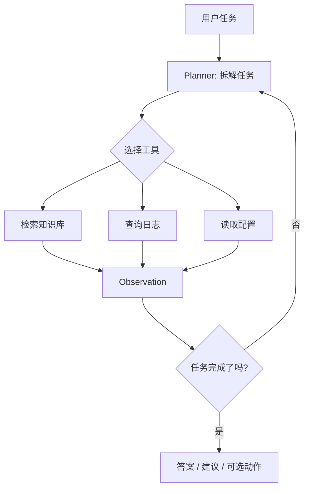
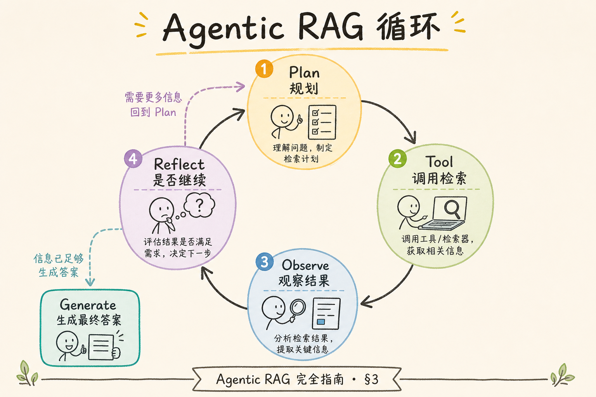
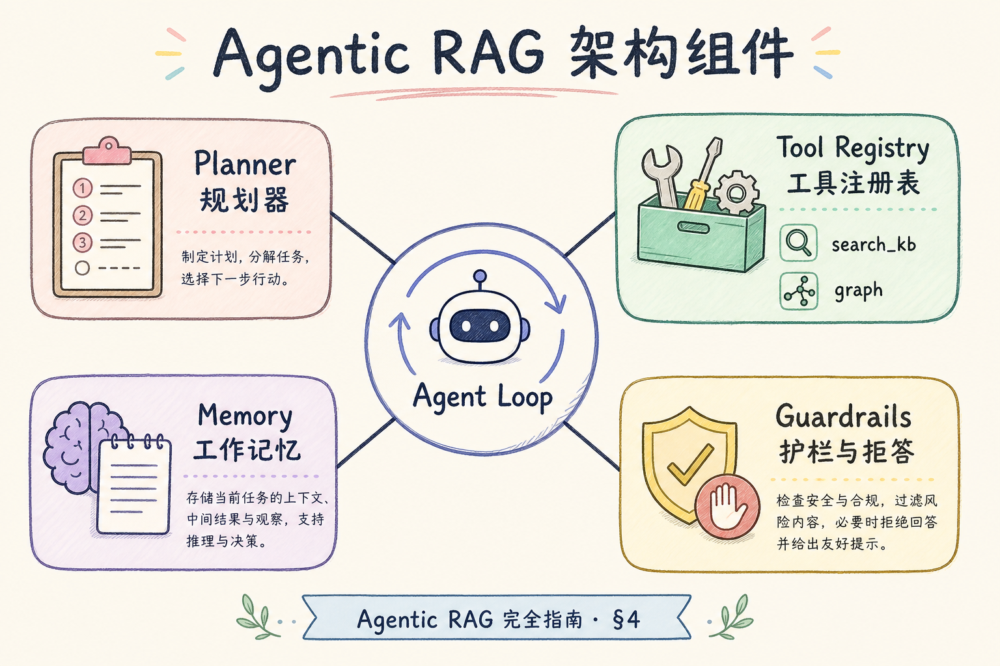
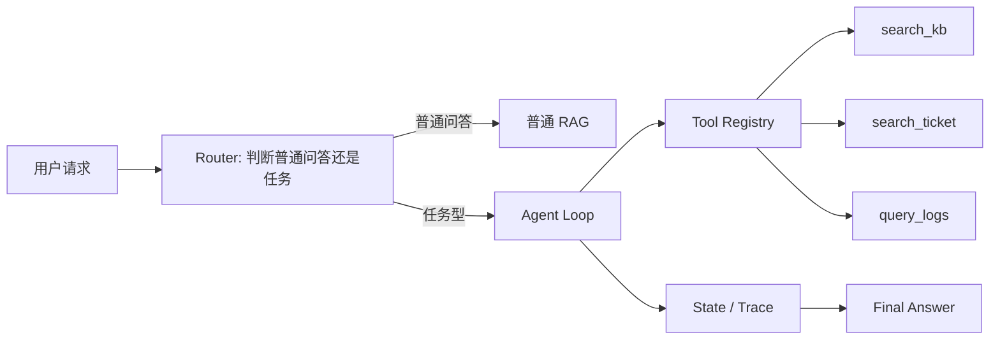
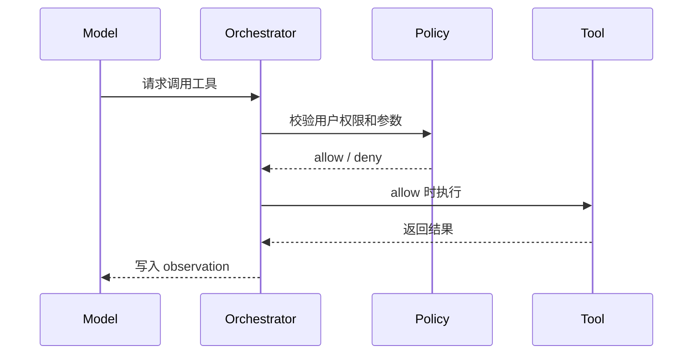
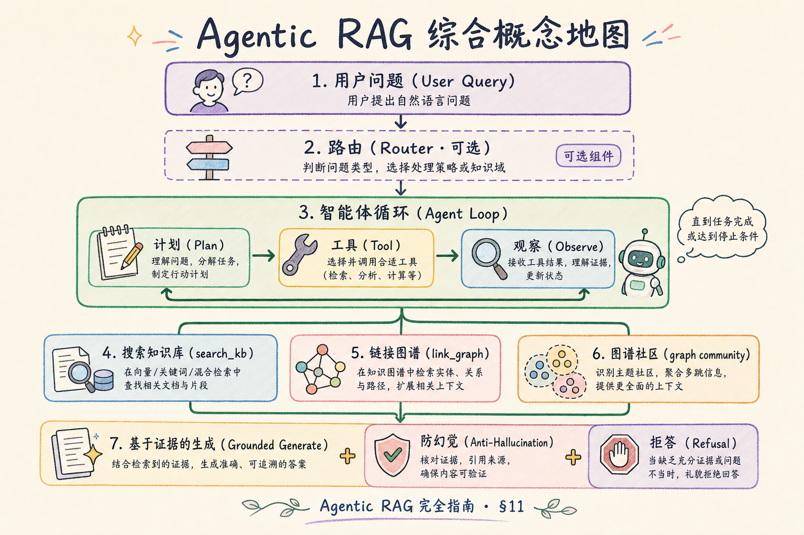

# H 进阶方向（三）：Agentic RAG 完全指南（了解）

> 普通 RAG 像“检索一次再回答”；Agentic RAG 像“给 RAG 助手一套可控工具，让它能按任务目标规划、检索、调用工具、检查结果”。这篇面向初学者，重点讲清 Agentic RAG 是什么、有什么用、解决什么问题、怎么做一个最小可控版本。

---

## 目录

1. [为什么需要 Agentic RAG](#1-为什么需要-agentic-rag)
2. [Agentic RAG 是什么](#2-agentic-rag-是什么)
3. [它解决什么问题](#3-它解决什么问题)
4. [Agentic RAG 和普通 RAG 的区别](#4-agentic-rag-和普通-rag-的区别)
5. [最小架构怎么设计](#5-最小架构怎么设计)
6. [工具和权限怎么控制](#6-工具和权限怎么控制)
7. [什么时候不要用 Agentic RAG](#7-什么时候不要用-agentic-rag)
8. [常见陷阱与 FAQ](#8-常见陷阱与-faq)
9. [总结](#9-总结)

## 1. 为什么需要 Agentic RAG

普通 RAG 适合回答“资料里有什么”。但企业场景里，用户经常不是单纯查资料，而是要完成一个小任务：查政策、比对权限、生成摘要、创建工单、解释失败原因。

例如用户问：“这个客户为什么看不到高级报表？请给出原因和处理建议。”系统可能要先查客户套餐，再查权限策略，再查最近工单，再判断是否需要创建工单。单次检索无法覆盖这个流程。

Agentic RAG 的价值是把 RAG 从“问答管道”扩展成“受控任务执行器”。它不是让模型随意行动，而是给模型有限工具、有限步骤和可审计记录。

| 用户目标 | 普通 RAG 的困难 | Agentic RAG 的作用 |
|----------|----------------|-------------------|
| 查原因 | 一次检索可能缺上下文 | 分步查多类资料 |
| 做操作 | RAG 只能回答 | 通过工具执行受控动作 |
| 排障 | 需要结合日志、工单、配置 | 编排多个检索源 |
| 解释过程 | 只给最终答案 | 输出 trace 和证据 |

## 2. Agentic RAG 是什么

**Agentic RAG**：把 RAG、工具调用、状态管理和决策循环组合起来，让模型可以在受控范围内规划下一步、调用工具、观察结果，再决定是否继续。

通俗说：普通 RAG 是“资料员”；Agentic RAG 是“有工具清单的办事员”。办事员不能乱来，只能在系统允许的工具和权限范围内执行。

这张图里最重要的是“受控工具”。Agentic RAG 的工程质量不取决于模型有多会想，而取决于系统有没有边界、状态和审计。

## 3. 它解决什么问题

Agentic RAG 主要解决“问答之外还要做事”的问题。

第一，它能把一个复杂任务拆成多个可执行步骤。比如先查资料，再判断是否需要调用另一个工具。

第二，它能连接多个系统。企业知识通常分散在知识库、日志、工单、配置、数据库中，Agentic RAG 可以把它们包装成工具。

第三，它能保留执行轨迹。每一步用了什么工具、输入是什么、返回了什么，都能写入 trace，便于调试和审计。

## 4. Agentic RAG 和普通 RAG 的区别

| 对比 | 普通 RAG | Agentic RAG |
|------|----------|-------------|
| 核心动作 | 检索 + 生成 | 规划 + 工具 + 检索 + 生成 |
| 状态 | 通常很少 | 必须记录步骤 |
| 适合场景 | 单轮知识问答 | 多步任务、排障、工单、工具调用 |
| 成本 | 较低 | 较高 |
| 风险 | 检索错、引用错 | 工具误用、循环失控、权限风险 |

不要把 Agentic RAG 当成默认升级。它适合任务型问题，不适合所有普通问答。

## 5. 最小架构怎么设计

一个最小可控版本只需要四个模块：路由器、工具注册表、执行状态、答案生成器。

推荐状态字段：

| 字段 | 说明 |
|------|------|
| `goal` | 用户真正要完成的任务 |
| `steps` | 每一步工具调用 |
| `evidence` | 已收集证据 |
| `allowed_tools` | 当前用户可用工具 |
| `max_steps` | 最大步数 |
| `stop_reason` | 完成、失败、超步数、权限拒绝 |

最小实现时，不要一开始接写操作工具。先只接只读工具，把 trace、权限、停止条件跑稳。

## 6. 工具和权限怎么控制

Agentic RAG 最大的生产风险是“模型做了不该做的事”。所以工具控制必须由系统完成，而不是靠 prompt 口头约束。

基本规则：

| 控制点 | 要求 |
|--------|------|
| 工具白名单 | 模型只能选已注册工具 |
| 参数 schema | 输入必须结构化校验 |
| 权限继承 | 工具访问权限不能高于用户 |
| 步数限制 | 防止无限循环 |
| 写操作审批 | 初期只读，写操作必须二次确认 |

## 7. 什么时候不要用 Agentic RAG

以下场景先不要上 Agentic RAG：

| 场景 | 更合适做法 |
|------|------------|
| 只是查一条政策 | 普通 RAG |
| 检索质量还不稳定 | 先修 chunk / metadata / rerank |
| 没有 trace 和审计 | 不上线 Agent |
| 权限边界不清楚 | 先做权限模型 |
| 工具本身不可靠 | 先修工具 |

一个实用路线是：普通 RAG 稳定后，再加 [202 ReAct](202.react-reasoning-rag-tutorial.md) 的思考-行动循环，再进入 [203 Multi-step Tool Retrieval](203.multi-step-tool-retrieval-tutorial.md) 的工程编排。

## 8. 常见陷阱与 FAQ

这一节专门收束 Agentic RAG 的边界。记住：Agentic 不是“让模型自由行动”，而是“让模型在受控工具箱里分步完成任务”。

### 8.1 Agentic RAG 等于 AutoGPT 吗？

不等于。企业 Agentic RAG 应该是受限、可审计、可回滚的任务编排，不是开放式自主代理。

### 8.2 需要展示推理过程吗？

通常不展示模型内部 thought。可以展示用户可理解的步骤摘要，例如“已查合同、权限策略和最近工单”。

### 8.3 最大上线风险是什么？

权限风险和工具误用。只要工具能访问真实系统，就必须做权限校验、参数校验和日志审计。

### 8.4 和 ReAct、多步工具检索有什么关系？

Agentic RAG 是大概念；ReAct 是一种“思考-行动-观察”的循环；多步工具检索是把这个循环工程化。

## 9. 总结

Agentic RAG 的核心是让 RAG 不只回答资料，还能在受控工具范围内分步完成任务。它适合多来源、多步骤、需要 trace 的企业场景。

一句话记忆：**普通 RAG 是会查资料的助手；Agentic RAG 是会按规则使用工具的助手。**
