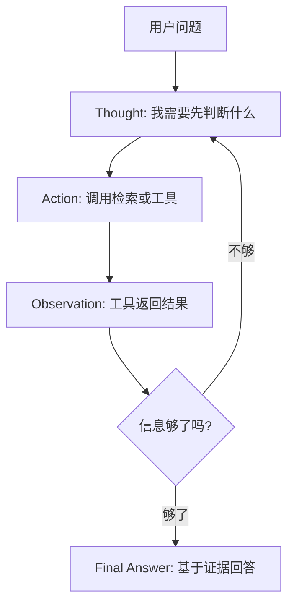
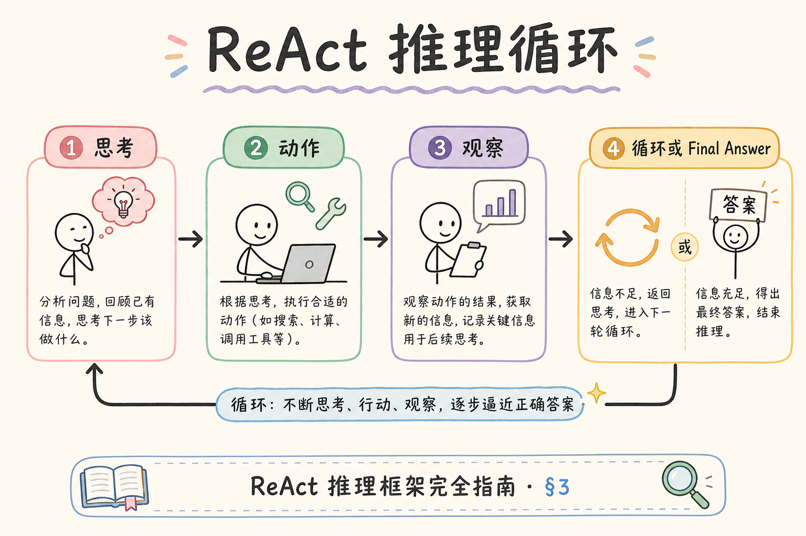
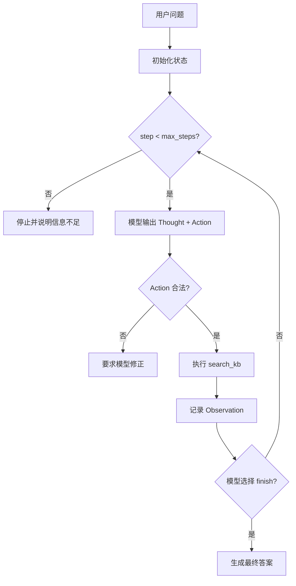
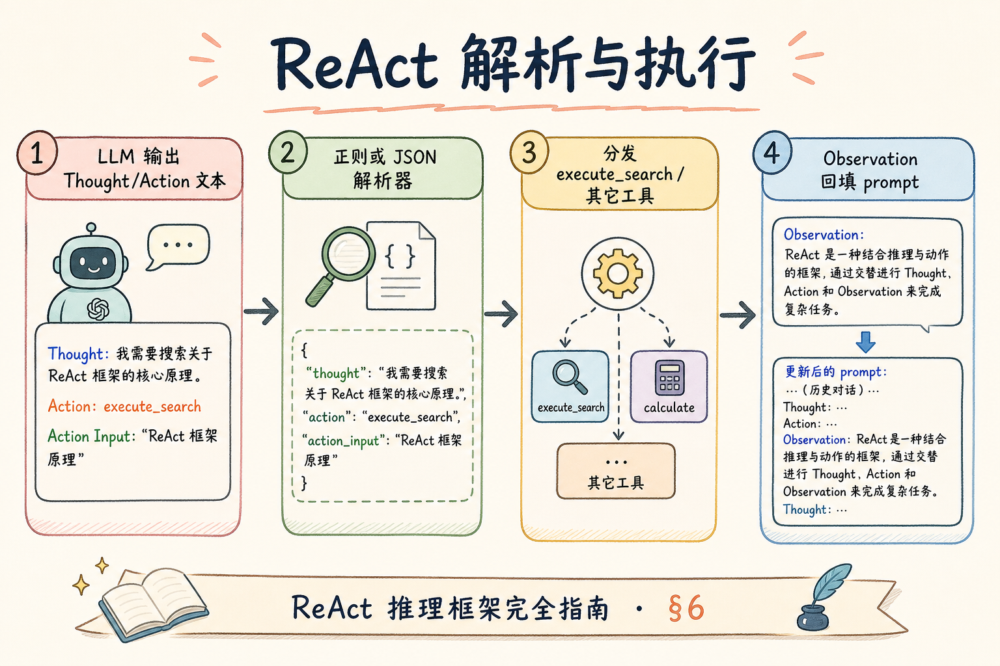
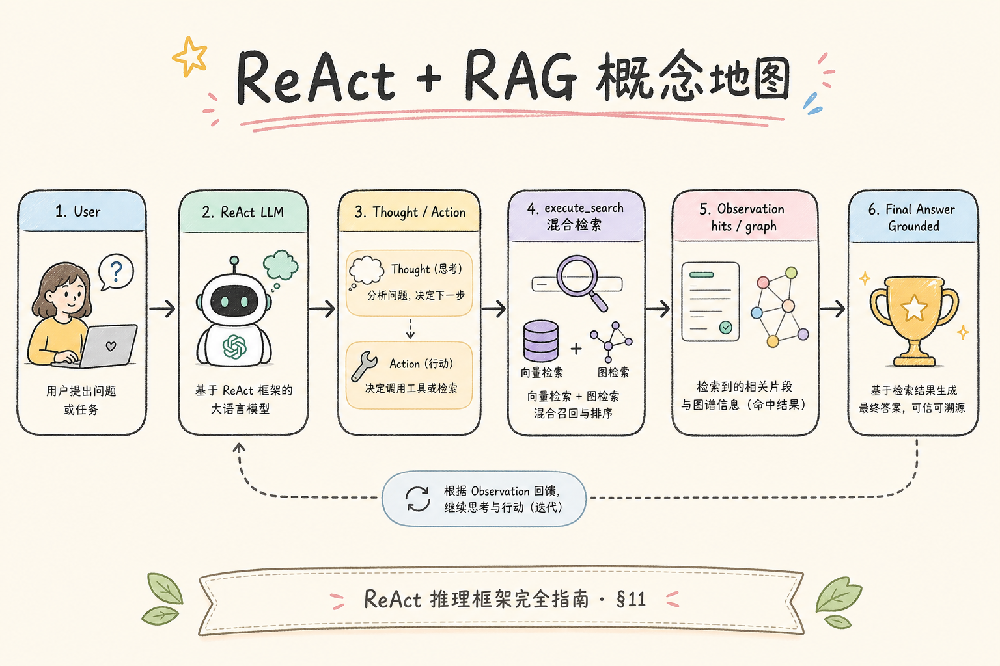

# H 进阶方向（四）：ReAct 推理式 RAG 完全指南（了解）

> 普通 RAG 通常是“一次检索，一次回答”。但有些问题不能一次搜完：模型需要先想一步、查资料、再根据结果决定下一步。**ReAct** 把 Reasoning（推理）和 Acting（行动）放进同一个循环，让 RAG 系统能边想边查。这篇面向初学者，重点讲清 ReAct 是什么、有什么用、解决什么问题、怎么在 RAG 里做一个最小闭环。

---

## 目录

1. [为什么需要 ReAct](#1-为什么需要-react)
2. [ReAct 是什么](#2-react-是什么)
3. [它解决什么问题](#3-它解决什么问题)
4. [ReAct 和普通 RAG 的区别](#4-react-和普通-rag-的区别)
5. [最小工作流怎么设计](#5-最小工作流怎么设计)
6. [Prompt 与状态怎么写](#6-prompt-与状态怎么写)
7. [什么时候不要用 ReAct](#7-什么时候不要用-react)
8. [常见陷阱与 FAQ](#8-常见陷阱与-faq)
9. [总结](#9-总结)

## 1. 为什么需要 ReAct

普通 RAG 的流程很简单：用户问问题，系统检索 Top-k 文档，把文档塞进 prompt，然后让模型回答。这个流程适合“答案就在一批资料里”的问题，比如“报销上限是多少”。

但有些问题需要分步判断。例如用户问：“新加坡员工参加国内会议，住宿和差旅报销应该按哪条政策算？”模型可能要先查“员工所在地”，再查“会议地点规则”，再查“跨境差旅例外”。一次 Top-k 很容易漏掉其中一类资料。

ReAct 的价值就是让模型能按步骤工作，而不是把所有上下文一次性猜出来。

| 问题类型 | 普通 RAG 的风险 | ReAct 的价值 |
|----------|----------------|--------------|
| 多条件政策题 | 只命中其中一个条件 | 分步查条件 |
| 需要比较多个来源 | context 混在一起 | 每次行动有目标 |
| 初次检索结果不够 | 直接编答案 | 继续检索或澄清 |
| Agent 工具调用 | 工具乱用 | 每步有 thought/action/observation |

## 2. ReAct 是什么

**ReAct**：Reasoning + Acting 的缩写。它让模型交替执行两件事：先写出当前推理，再选择一个行动，行动返回观察结果后继续推理。

通俗说：普通 RAG 像“拿到一叠资料就写答案”；ReAct 像“边查资料边做笔记，查到不够再换关键词继续查”。



这张图里最重要的是 `Observation`。模型每一步都要根据真实工具返回继续判断，而不是在脑内假装已经查过。

## 3. 它解决什么问题

ReAct 主要解决“问题需要多步信息收集”的场景，而不是解决所有 RAG 质量问题。

第一，它能把复杂问题拆成多个检索目标。比如先查“适用人群”，再查“金额标准”，最后查“例外条款”。

第二，它能让工具调用更可解释。每次 action 都有前置 thought，开发者能知道模型为什么查这个关键词。

第三，它能在检索失败时补救。普通 RAG 一次查不到就容易编；ReAct 可以换查询词、查另一个 collection，或者承认资料不足。





## 4. ReAct 和普通 RAG 的区别

初学者可以先用一张表区分：

| 对比 | 普通 RAG | ReAct RAG |
|------|----------|-----------|
| 检索次数 | 通常 1 次 | 可能多次 |
| 决策方式 | 先检索后回答 | 边推理边行动 |
| 适合问题 | 单跳事实问答 | 多条件、多跳、工具型问题 |
| 成本 | 低 | 更高 |
| 风险 | 检索漏了就答错 | 循环失控、工具滥用 |

ReAct 不是更高级的默认选项。它增加延迟、token 和工具调用成本。只有当问题确实需要分步查证时，才值得启用。

## 5. 最小工作流怎么设计

一个最小 ReAct RAG 不需要很多工具。先保留两个工具即可：`search_kb` 用于查知识库，`finish` 用于输出最终答案。



建议状态字段：

| 字段 | 作用 |
|------|------|
| `question` | 原始用户问题 |
| `steps` | 已执行的 thought/action/observation |
| `evidence` | 已收集的 chunk |
| `max_steps` | 防止无限循环 |
| `stop_reason` | 正常完成、超步数、工具错误 |

## 6. Prompt 与状态怎么写

Prompt 要让模型知道：它不能直接编 observation，必须通过 action 获取结果。下面是一个概念模板：



```text
你是 RAG 助手。你可以使用工具：
- search_kb(query): 检索知识库
- finish(answer): 当证据足够时回答

每一步只能输出一种动作：
Thought: 说明当前要判断什么
Action: search_kb("...") 或 finish("...")

如果证据不足，不要编造，继续检索或说明无法回答。
```

状态记录可以这样存：

```json
{
  "question": "新加坡员工参加国内会议怎么报销？",
  "steps": [
    {
      "thought": "先查员工所在地是否影响差旅规则",
      "action": "search_kb",
      "input": "新加坡员工 国内会议 差旅 报销",
      "observation": ["chunk-17", "chunk-41"]
    }
  ],
  "max_steps": 4
}
```

这段 JSON 的重点不是格式本身，而是保留每一步的因果链。后续做日志、调试台和人工评测时，才能看清模型在哪里走偏。

## 7. 什么时候不要用 ReAct

不要因为 ReAct 听起来像 Agent，就把所有请求都交给它。下面这些情况更适合普通 RAG：

| 情况 | 更合适的方案 |
|------|--------------|
| 单条政策查询 | 普通 RAG + rerank |
| 延迟要求极低 | 一次检索 |
| 工具结果不稳定 | 先修工具和数据 |
| 没有 trace 监控 | 不要上线 ReAct |
| 用户问题很简单 | 规则路由到普通 RAG |

一个实用策略是加路由：简单问题走普通 RAG，复杂问题才走 ReAct。后续 [206 Adaptive RAG](206.adaptive-rag-tutorial.md) 会更系统地讲路由。

## 8. 常见陷阱与 FAQ

这一节收束 ReAct 在 RAG 场景里的常见误用。核心判断是：ReAct 只负责分步决策，不能替代检索质量、权限控制和证据引用。

### 8.1 ReAct 会自动提升准确率吗？

不会。它只是给模型更多行动机会。如果工具检索质量差，ReAct 会更频繁地拿到坏证据，甚至更自信地答错。

### 8.2 Thought 要不要展示给用户？

通常不要。对用户展示最终答案和引用即可；内部可以记录结构化 trace，方便调试和审计。

### 8.3 最大风险是什么？

循环失控和工具滥用。必须设置 `max_steps`、合法 action 列表、工具超时和失败兜底。

### 8.4 和 Multi-step Tool Retrieval 有什么关系？

本文讲 ReAct 思想：边想边行动。[203](203.multi-step-tool-retrieval-tutorial.md) 更偏工程实现：状态机、停止条件、工具编排和 trace 字段。

## 9. 总结

ReAct RAG 的核心是把复杂问题拆成“推理一步、行动一步、观察一步”的循环。它适合多条件、多跳、工具型问题；不适合作为所有问答的默认路径。



一句话记忆：**普通 RAG 是一次查资料后回答；ReAct 是边查边判断，直到证据足够再回答。**
