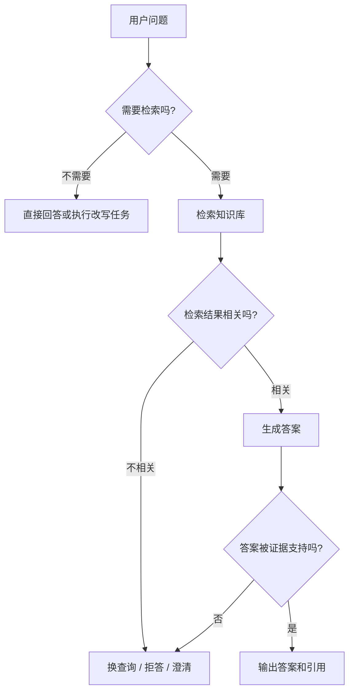
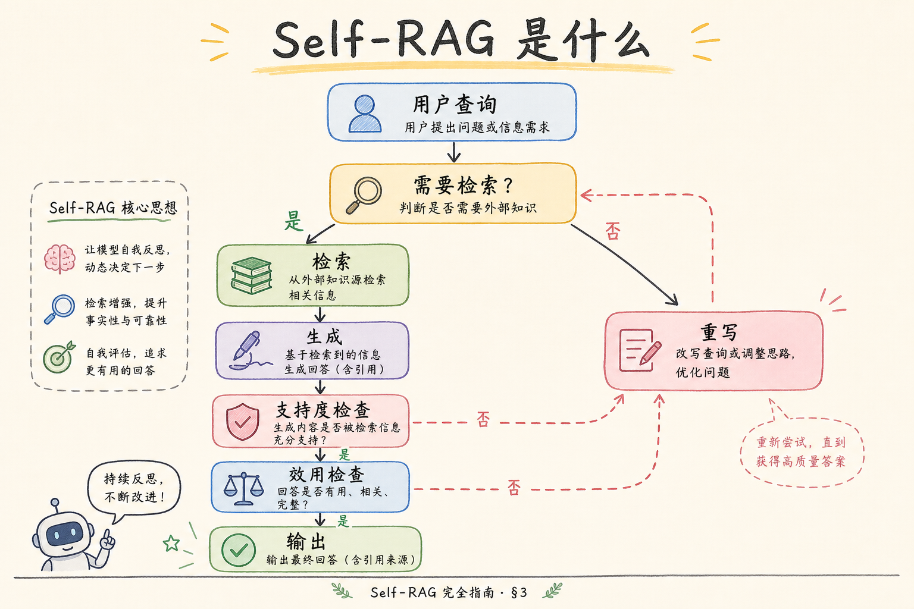
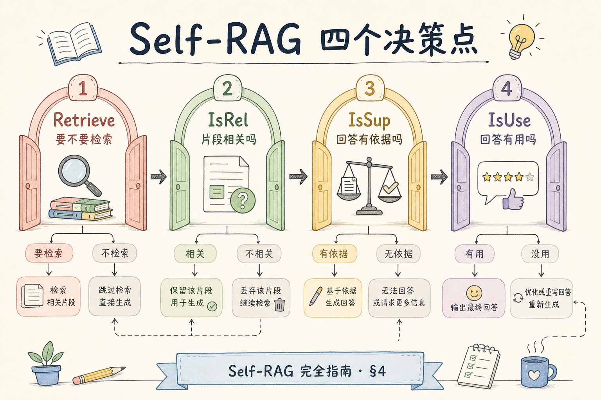
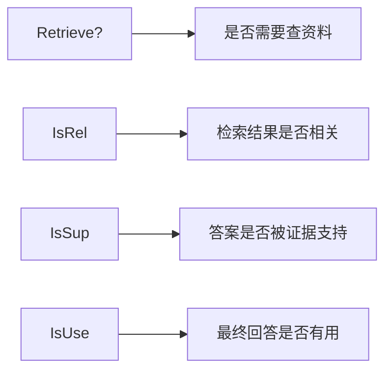
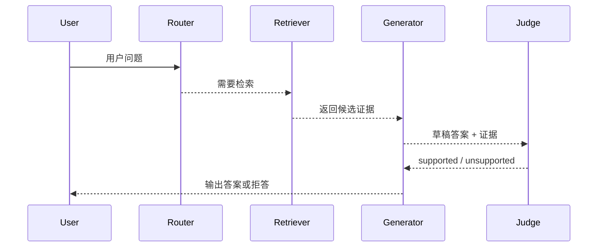
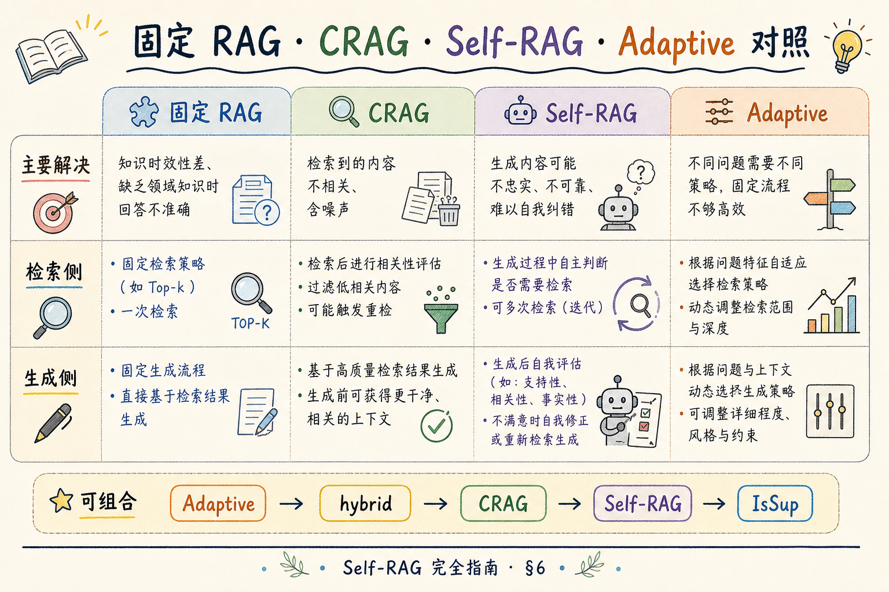
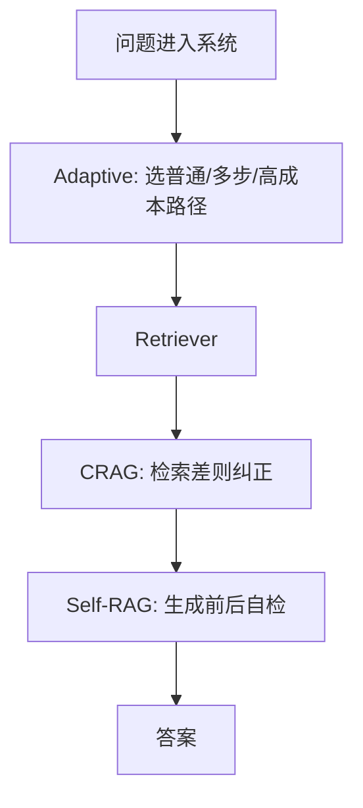

# H 进阶方向（六）：Self-RAG 自反思检索完全指南（了解）

> 普通 RAG 默认“检索一定需要、检索结果一定有用、答案一定被证据支持”。Self-RAG 质疑这三个默认值：要不要检索？检索结果相关吗？答案是否被证据支持？这篇面向初学者解释 Self-RAG 是什么、解决什么问题、怎么用工程简化版落地。

---

## 目录

1. [为什么需要 Self-RAG](#1-为什么需要-self-rag)
2. [Self-RAG 是什么](#2-self-rag-是什么)
3. [它解决什么问题](#3-它解决什么问题)
4. [四个判断点](#4-四个判断点)
5. [工程简化版怎么做](#5-工程简化版怎么做)
6. [和 CRAG、Adaptive RAG 的区别](#6-和-cragadaptive-rag-的区别)
7. [评测与上线门禁](#7-评测与上线门禁)
8. [常见陷阱与 FAQ](#8-常见陷阱与-faq)
9. [总结](#9-总结)

## 1. 为什么需要 Self-RAG

普通 RAG 很容易形成固定套路：所有问题都检索，拿到 Top-k 就塞进 prompt，然后直接回答。这个套路简单，但会带来三个问题。

第一，有些问题不需要检索，比如“把上一段改成更礼貌”。硬检索只会增加噪声。第二，检索结果可能不相关，模型却照样引用。第三，答案可能看起来有引用，但实际超出了 context。

Self-RAG 的核心价值是让系统在关键节点做自检，而不是盲目相信检索流程。

## 2. Self-RAG 是什么

**Self-RAG**：一种让模型在生成过程中自我判断检索需求、证据相关性和答案支持度的 RAG 思路。论文版本会训练特殊反思 token；工程落地时，常用规则、小模型分类器或 LLM judge 模拟这些判断。

通俗说：普通 RAG 像“查到什么就用什么”；Self-RAG 像“先问自己要不要查，查到后再问这些资料有没有用，写完后再问答案有没有证据”。



这张图是工程简化版，不要求你训练论文里的特殊 token，但保留了 Self-RAG 的核心思想：关键节点要判断。

## 3. 它解决什么问题

Self-RAG 主要解决三类质量问题。



| 问题 | 普通 RAG 表现 | Self-RAG 思路 |
|------|---------------|---------------|
| 不该检索却检索 | 噪声进入 context | 先判断 retrieve/no-retrieve |
| 检索结果不相关 | 模型被错误资料带偏 | 判断 relevance |
| 答案没被证据支持 | 有引用但仍胡编 | 判断 support |

它不是万能修复器。如果 chunk 切分差、metadata 错、权限错，Self-RAG 只能发现“结果不对”，不能自动把数据治理做好。

## 4. 四个判断点

初学者可以把 Self-RAG 理解成四个小判断器：





| 判断点 | 问的问题 | 可能输出 |
|--------|----------|----------|
| Retrieve? | 这个问题需要外部知识吗？ | yes / no |
| IsRel | 当前 chunk 和问题相关吗？ | relevant / irrelevant |
| IsSup | 答案里的关键事实被 context 支持吗？ | supported / unsupported |
| IsUse | 回答对用户是否有帮助？ | useful / not useful |

工程上可以先只做两个：Retrieve? 和 IsSup。前者节省不必要检索，后者减少无依据回答。

## 5. 工程简化版怎么做

一个可落地的简化版不需要训练新模型。可以先用三段式 pipeline：



最小实现步骤：

1. 用规则或小模型判断 `need_retrieval`。
2. 需要检索时走普通 RAG。
3. 生成答案后，用 judge 检查关键事实是否被 context 支持。
4. 如果 unsupported，要求模型改写为“资料不足”或重新检索。

一个 judge prompt 可以这样写：

```text
你是 RAG 事实核查器。给定 context 和 answer，
只判断 answer 中的关键事实是否都能在 context 找到依据。
输出 supported 或 unsupported，并列出 unsupported 的句子。
```

## 6. 和 CRAG、Adaptive RAG 的区别

这些名字容易混。可以先按“判断点”区分：

| 方案 | 重点 | 通俗理解 |
|------|------|----------|
| Self-RAG | 生成过程中自评是否需要检索、证据是否支持 | 边写边自检 |
| CRAG | 检索结果差时纠正、换源或补查 | 检索坏了就纠偏 |
| Adaptive RAG | 根据问题复杂度选择不同检索策略 | 先分流再执行 |





三者可以组合，但不要一开始全上。先把普通 RAG 和评测集做好，再逐步加判断点。

## 7. 评测与上线门禁

Self-RAG 的评测不能只看回答好不好，还要看判断器是否可靠。

| 指标 | 看什么 |
|------|--------|
| unnecessary retrieval rate | 不需要检索的问题是否少查了 |
| relevance precision | 被保留的 chunk 是否相关 |
| faithfulness | 答案是否基于 context |
| refusal quality | 资料不足时是否拒答清楚 |
| latency | judge 和重试是否拖慢太多 |

上线门禁建议：Faithfulness 提升明显，拒答质量不下降，平均延迟可接受。如果只是多加了几个 LLM judge 但坏例没有减少，就不要上线。

## 8. 常见陷阱与 FAQ

这一节收束 Self-RAG 最容易被误用的地方。关键原则是：自检只能发现和缓解问题，不能替代数据质量、检索质量和人工评测。

### 8.1 Self-RAG 一定要训练模型吗？

不一定。论文方案涉及训练反思 token；工程 PoC 可以先用规则、小分类器或 LLM judge 做简化版。

### 8.2 Judge 会不会也判断错？

会。所以 judge 输出要抽检，并且不能让它成为唯一真理。高风险场景仍需要人工评测集。

### 8.3 Self-RAG 能修检索遗漏吗？

只能部分缓解。它能发现“证据不足”，但如果知识库里本来有资料却检索不到，根因仍是 chunk、metadata、rerank 或查询改写。

### 8.4 什么时候不值得做？

如果当前 RAG 连基础引用、bad case 归因、RAGAS 评测都没有，先补基础。Self-RAG 会增加复杂度，不适合作为第一阶段优化。

## 9. 总结

Self-RAG 的核心不是让模型“更聪明地幻想”，而是让 RAG 流程在关键节点自检：要不要检索、证据是否相关、答案是否被支持。

一句话记忆：**普通 RAG 默认检索结果可用；Self-RAG 会在使用证据前后先问一句：这真的需要、相关、被支持吗？**
