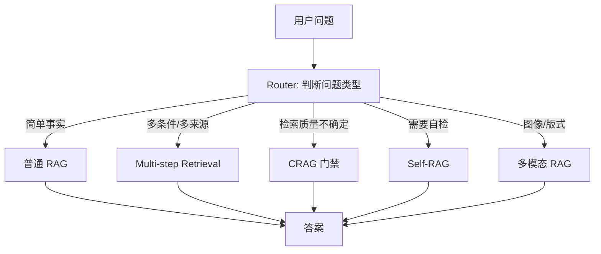
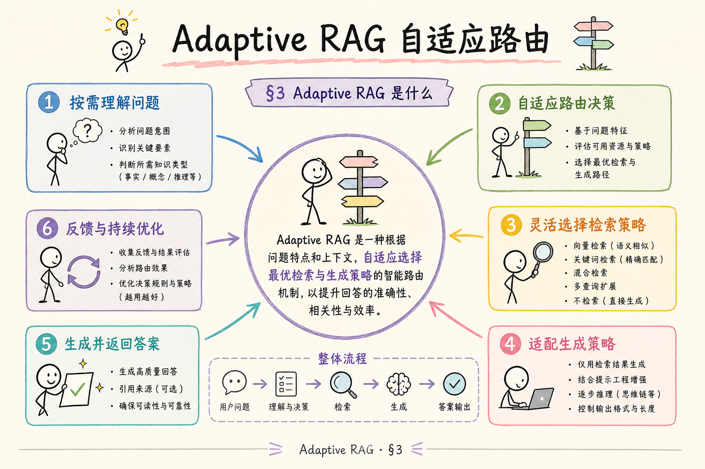
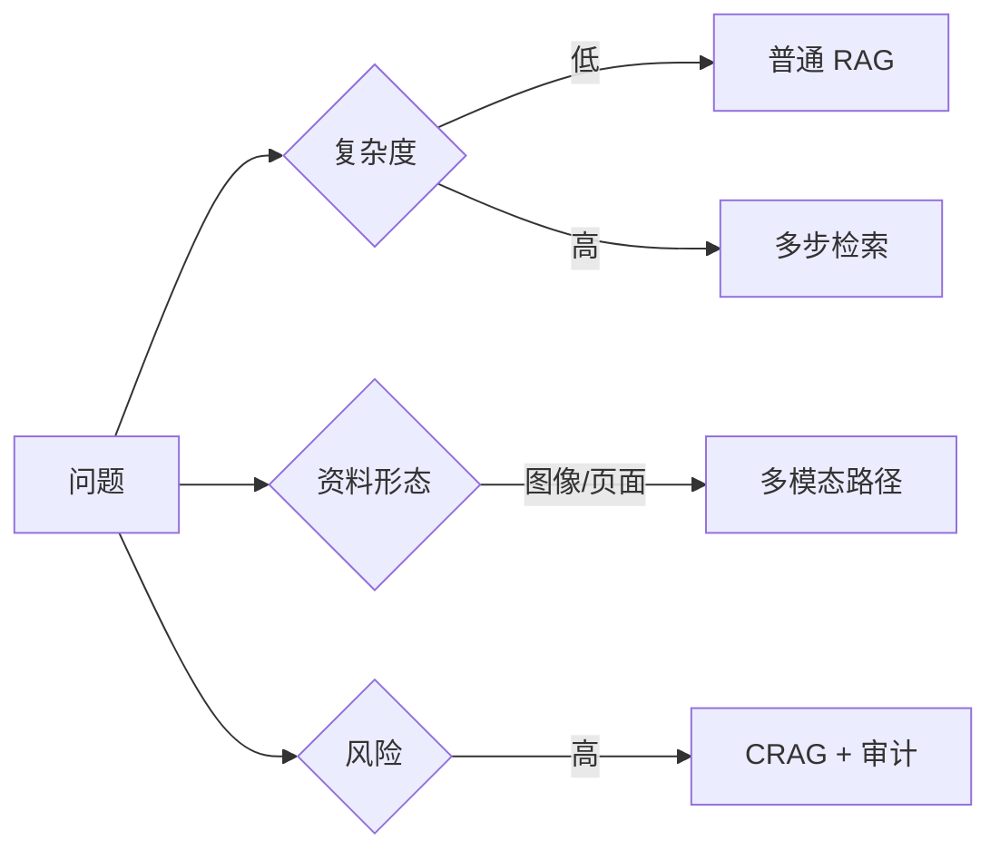
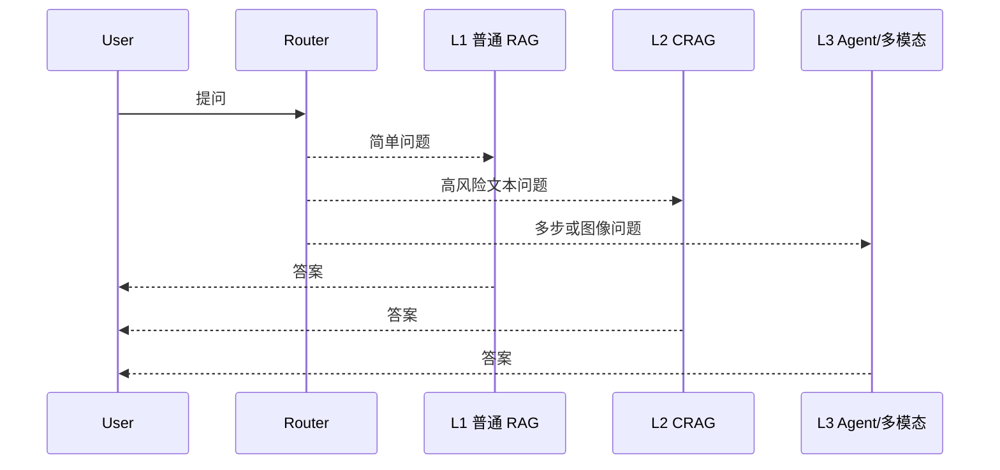
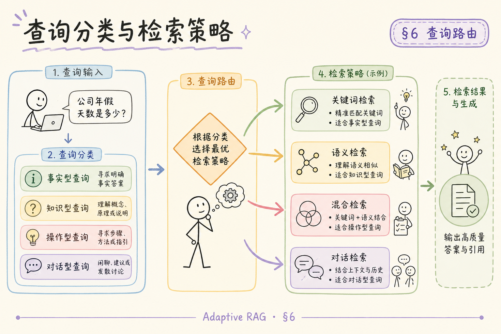
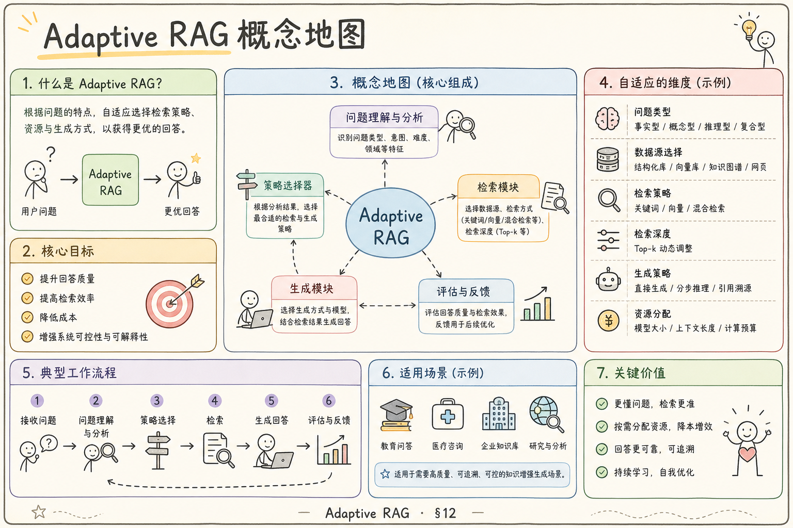

# H 进阶方向（八）：Adaptive RAG 自适应检索完全指南（了解）

> 同一个 RAG 系统里，不同问题需要不同成本的处理方式。简单事实题不该走多步 Agent；复杂分析题也不该只做一次 Top-k。Adaptive RAG 的目标是先判断问题类型，再选择合适的检索路径。

---

## 目录

1. [为什么需要 Adaptive RAG](#1-为什么需要-adaptive-rag)
2. [Adaptive RAG 是什么](#2-adaptive-rag-是什么)
3. [它解决什么问题](#3-它解决什么问题)
4. [路由维度怎么设计](#4-路由维度怎么设计)
5. [最小路由架构](#5-最小路由架构)
6. [和 ReAct、CRAG、Self-RAG 的关系](#6-和-reactcragself-rag-的关系)
7. [评测与成本控制](#7-评测与成本控制)
8. [常见陷阱与 FAQ](#8-常见陷阱与-faq)
9. [总结](#9-总结)

## 1. 为什么需要 Adaptive RAG

很多 RAG 系统一开始只有一条路径：所有问题都检索 Top-k，再让模型回答。系统变复杂后，团队又会加 rerank、多步工具、CRAG、Self-RAG、长上下文、VLM。问题是：如果所有请求都走最贵路径，成本和延迟会失控。

Adaptive RAG 解决的是“按问题选择路径”。简单问题走便宜路径；复杂问题才走多步、高成本或更强模型。

| 问题 | 不自适应的后果 | 自适应做法 |
|------|----------------|------------|
| “住宿上限是多少？” | 走 Agent 浪费成本 | 普通 RAG |
| “对比两版政策差异” | 一次 Top-k 不够 | 多步检索 |
| “资料不足能否回答？” | 模型硬答 | Self-RAG / CRAG |
| “图里曲线异常原因？” | 文本检索无效 | 多模态路径 |

## 2. Adaptive RAG 是什么

**Adaptive RAG**：在检索前增加一个路由器，根据问题复杂度、资料类型、风险等级和用户上下文，选择不同 RAG 策略。

通俗说：它像医院分诊。不是所有病人都进 ICU，也不是所有问题都只看普通门诊。先分诊，再走合适路径。

Adaptive RAG 本身不生成答案，它负责选路。真正回答仍由后面的 RAG、Agent、CRAG 或多模态模块完成。

## 3. 它解决什么问题

Adaptive RAG 解决的是“质量、成本、延迟之间的平衡”。

第一，避免简单问题走昂贵流程。很多问题一次检索就够，不需要 Agent。

第二，避免复杂问题被简单流程误伤。多条件、多来源、图像类问题需要更强路径。

第三，把风险控制前置。涉及合规、权限、删除、PII 的问题，可以直接路由到更严格的检查链路。

## 4. 路由维度怎么设计

一个实用路由器不需要一开始很聪明。先从四个维度做规则或小模型分类：

| 维度 | 判断问题 | 路由影响 |
|------|----------|----------|
| 复杂度 | 是否多条件、多跳、多来源？ | 普通 RAG 或多步 |
| 资料形态 | 是否需要图片、PDF 页面、表格？ | 文本或多模态 |
| 风险等级 | 是否涉及合规、权限、PII？ | 加 CRAG / 审计 |
| 证据要求 | 是否必须严格引用？ | 加 Faithfulness / Self-RAG |

路由器可以先用规则：关键词、问题长度、是否包含“对比/为什么/判断/图中/删除/权限”等。后续再用分类器替代。

## 5. 最小路由架构

推荐先做三档：

| 档位 | 路径 | 适用 |
|------|------|------|
| L1 | 普通 RAG | 单跳事实 |
| L2 | RAG + rerank + CRAG | 高准确要求 |
| L3 | 多步 / Agent / 多模态 | 多来源、工具、图像 |

路由结果要写入日志：`route=L1/L2/L3`、`reason=multi_source/high_risk/visual`。否则后续无法分析“为什么这个问题走了贵路径”。

## 6. 和 ReAct、CRAG、Self-RAG 的关系

Adaptive RAG 是上游分流器，ReAct、CRAG、Self-RAG 是下游策略。

| 模块 | 在系统里的位置 |
|------|----------------|
| Adaptive RAG | 先选路径 |
| ReAct | 复杂路径里的推理-行动循环 |
| Multi-step Tool Retrieval | 复杂路径的工程编排 |
| CRAG | 检索结果门禁和纠错 |
| Self-RAG | 生成前后自检 |

一个组合例子：用户问“图中异常趋势是否违反安全策略？”路由器识别为“视觉 + 合规”，先走多模态检索，再加 CRAG 检查资料质量，最后用 Self-RAG 检查答案是否被证据支持。

## 7. 评测与成本控制

Adaptive RAG 的评测要看两件事：路由对不对，整体成本是否下降。

| 指标 | 说明 |
|------|------|
| route accuracy | 人工标注路径与系统路径是否一致 |
| over-routing rate | 简单问题误走高成本路径 |
| under-routing rate | 复杂问题误走低成本路径 |
| quality by route | 每条路径的答案质量 |
| cost per query | 平均 token、工具调用、延迟 |

上线门禁：L1 问题大部分留在便宜路径；L3 问题质量明显优于普通 RAG；整体延迟和成本可接受。

## 8. 常见陷阱与 FAQ

这一节收束 Adaptive RAG 的边界。它不是万能智能调度器，而是一个可观察、可评测、可迭代的路由层。

### 8.1 路由器错了怎么办？

保留降级和升级机制。L1 回答证据不足时可升级到 L2；L3 超时可降级为“资料不足，稍后重试”。

### 8.2 一开始需要训练分类器吗？

不需要。先用规则和小样本评测跑通，积累路由日志后再训练分类器。

### 8.3 最大风险是什么？

路由不可解释。用户和开发者不知道为什么走某条路径，就无法优化成本和质量。必须记录 route reason。

### 8.4 和缓存有什么关系？

Adaptive RAG 很适合配合缓存。简单高频问题走 L1 并缓存；高成本 L3 结果可缓存中间证据，避免重复工具调用。

## 9. 总结

Adaptive RAG 的核心是先分流，再检索。它让简单问题保持便宜，让复杂问题获得足够能力。

一句话记忆：**不要让所有问题都走同一条 RAG 管道；Adaptive RAG 先判断问题需要多大火力，再选择路径。**
