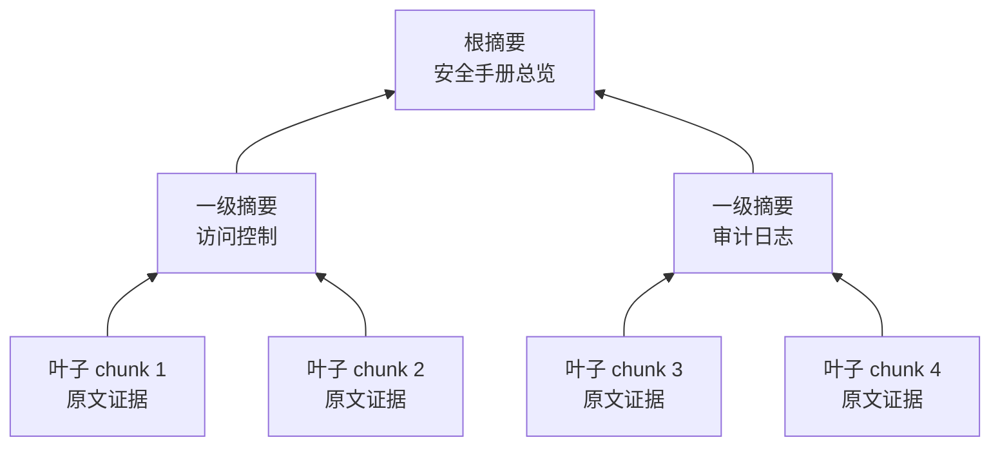
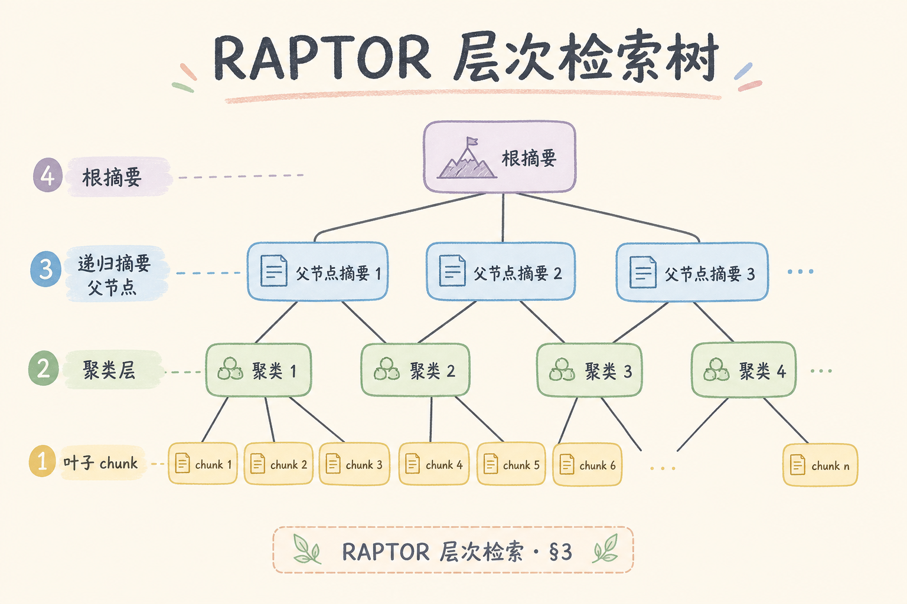
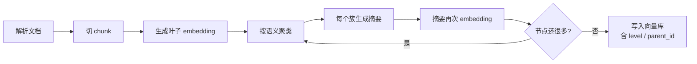
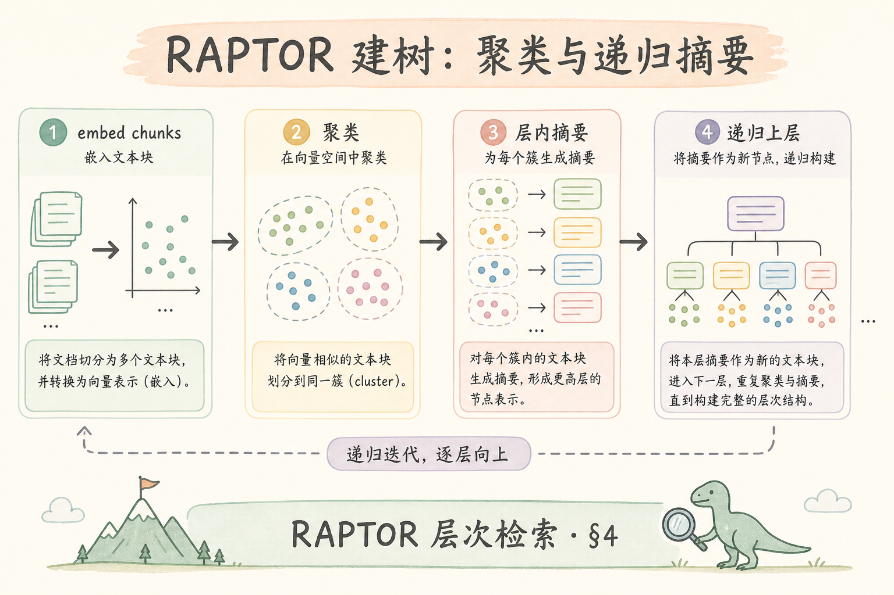
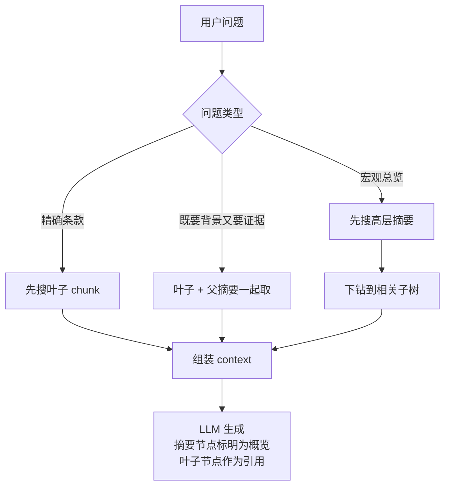
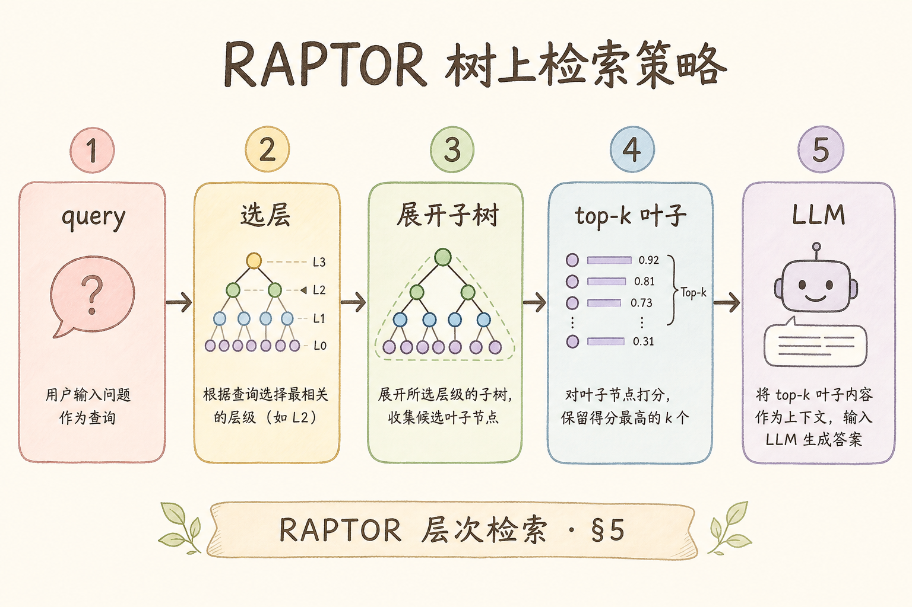

# H 进阶方向（十一）：RAPTOR 层次检索完全指南（了解）

> [207 Map-Reduce](207.map-reduce-summarization-tutorial.md) 与 [208 Refine](208.refine-summarization-tutorial.md) 解决「怎么把长文档摘要出来」；RAPTOR 进一步问：「摘要能不能也参与检索？」这篇是 [企业 RAG 路线图](ENTERPRISE_RAG_ROADMAP.md) H 模块了解档，目标是让初学者讲清 RAPTOR 做什么、解决什么问题、怎么落到一个 PoC，而不是复现论文全部细节。

---

## 目录

1. [要不要读](#1-要不要读)
2. [RAPTOR 解决什么问题](#2-raptor-解决什么问题)
3. [RAPTOR 是什么](#3-raptor-是什么)
4. [建树：从 chunk 到摘要树](#4-建树从-chunk-到摘要树)
5. [检索：怎么在树上找答案](#5-检索怎么在树上找答案)
6. [最小 PoC 怎么做](#6-最小-poc-怎么做)
7. [什么时候值得用](#7-什么时候值得用)
8. [常见误用与 FAQ](#8-常见误用与-faq)
9. [总结](#9-总结)

## 1. 要不要读

如果你的知识库主要是短 FAQ、工单标题、几百字的帮助文档，RAPTOR 大概率不是第一优先级。普通向量检索、BM25 混合检索、rerank 和 [65 Parent-Document](65.parent-document-retriever-tutorial.md) 已经能覆盖大部分问题。

如果你的知识库是 100 页以上的手册、政策、教材或研究报告，用户既会问「全书讲了什么」这种宏观问题，也会问「某条款数值是多少」这种细节问题，RAPTOR 才值得了解。它的价值不是让检索“更高级”，而是让同一个库同时保留“目录级理解”和“页码级证据”。

读完本文，你应该能做到四件事：

| 能力 | 自检问题 |
|------|----------|
| 说清是什么 | RAPTOR 为什么叫层次检索？ |
| 说清用途 | 哪类问题会受益于摘要树？ |
| 说清做法 | 离线建树和在线检索各做什么？ |
| 说清边界 | 为什么不能删掉叶子 chunk？ |

## 2. RAPTOR 解决什么问题

普通 RAG 常把长文档切成很多 chunk，然后把这些 chunk 全部塞进向量库。这个结构很直接，但有一个明显问题：向量库只记住了“碎片”，没有记住“这些碎片共同属于哪个主题”。

例如一本安全手册被切成 800 个 chunk：

| 用户问题 | 扁平检索的困难 | 需要的能力 |
|----------|----------------|------------|
| “这本手册的访问控制原则是什么？” | Top-k 可能命中几条零散规则，缺少总览 | 先命中章节摘要 |
| “TLS 最低版本是多少？” | 需要精确条款，不需要总览 | 命中叶子 chunk |
| “认证、授权、审计三者怎么配合？” | 答案分散在多个章节 | 找到相关主题簇再展开 |

RAPTOR 解决的是“长文档既要宏观又要微观”的问题。它不是替代向量库，而是在向量库里加入多层摘要节点，让检索有机会命中不同抽象层级。

## 3. RAPTOR 是什么

**RAPTOR**（Recursive Abstractive Processing for Tree-Organized Retrieval）：把文档 chunk 先聚类，再对每个簇生成摘要，把摘要当作父节点；然后继续对父节点聚类和摘要，直到形成一棵树。

通俗说：普通 RAG 像把一本书撕成很多纸条后检索；RAPTOR 会额外给这些纸条贴上“小节标签、章节标签、全书标签”。问宏观问题先看标签，问细节问题再回到纸条。



读这张图时注意两点：第一，叶子节点仍然是最终引用证据；第二，摘要节点只帮助定位主题，不应该单独当作精确出处。

## 4. 建树：从 chunk 到摘要树

RAPTOR 的建树发生在离线 ingest 阶段，不应该在用户提问时临时建。一个概念级流程如下：





初学者最容易误解“聚类”。聚类不是让模型自动理解文档结构，而是根据 embedding 的距离把相近 chunk 放在一起。它可能把不该放在一起的段落合并，所以工程上要加限制：同一标题下优先成簇、每簇大小有限制、父摘要必须抽检。

建议的 metadata：

| 字段 | 用途 |
|------|------|
| `doc_id` | 属于哪份文档 |
| `node_id` | 当前节点 ID |
| `parent_id` | 父节点 ID，用于下钻 |
| `level` | 0 是叶子，1/2 是摘要层 |
| `text_type` | `leaf` 或 `summary`，生成时区别处理 |

父摘要的 prompt 要求要保守：保留专有名词、数字、条款编号；不要写“本节主要介绍若干内容”这种空话。摘要太泛，检索时就会命中一个看似相关但无法指导下钻的节点。

## 5. 检索：怎么在树上找答案

在线检索不是只有一种方式。RAPTOR 常见做法有三类：

| 策略 | 怎么做 | 适合场景 |
|------|--------|----------|
| 扁平混合 | 叶子和摘要节点放同一个 index，Top-k 后按 level 去重 | PoC 最简单 |
| 自上而下 | 先搜高层摘要，再在子树里搜叶子 | 宏观问题多 |
| 自下而上 | 先搜叶子，再带上父摘要扩上下文 | 细节问题多，但需要背景 |





关键规则：摘要节点不能冒充证据。生成 prompt 里要明确区分“以下是章节摘要”和“以下是原文片段”。否则模型会把概括性语言当成引用，容易产生不严谨答案。

## 6. 最小 PoC 怎么做

了解档也应该能动手。下面是一个 4 周 PoC 切片，目标不是论文复现，而是验证“长文档宏观问答是否真的变好”。



| 周 | 交付物 | 验收方式 |
|----|--------|----------|
| W1 | 选 1 份 100～200 页手册，做扁平 RAG baseline | 金标 30 题：15 个宏观题、15 个细节题 |
| W2 | 建两层树：叶子聚类 → 父摘要 → 父 embedding | 抽检 20 个父摘要，低质摘要返工 |
| W3 | 做 collapsed 检索：叶子和父节点同库 Top-k | 对比 overview Recall@5 |
| W4 | 写 go/no-go ADR | 宏观提升、成本、维护复杂度写清 |

一个最小数据结构可以这样设计：

```python
node = {
    "node_id": "doc1-L1-003",
    "doc_id": "doc1",
    "level": 1,
    "parent_id": "doc1-L2-000",
    "children": ["doc1-L0-021", "doc1-L0-022"],
    "text_type": "summary",
    "text": "本簇总结访问控制策略：最小权限、角色审批、季度复核。",
}
```

这段代码演示的是节点长什么样，不是完整实现。真正落地时，`text` 会写入向量库，`children` 和 `parent_id` 用于调试、下钻和页面解释。

## 7. 什么时候值得用

RAPTOR 值得用的条件比较苛刻。它增加构建成本、存储成本、调试成本，也让文档更新更麻烦。

| 情况 | 建议 |
|------|------|
| 短 FAQ / 工单库 | 不用 RAPTOR，先做混合检索和 rerank |
| 长手册 + 宏观问题频繁 | 可以 PoC RAPTOR |
| 需要跨实体关系推理 | 优先看 [199 Graph RAG](199.graph-rag-tutorial.md) |
| 更新很频繁 | 谨慎，摘要树会频繁失效 |
| 强合规引用 | 保留叶子引用，不让摘要节点单独答 |

一个实用 no-go 标准：如果宏观题 Recall@5 提升低于 15%，但构建成本超过扁平 RAG 的 3 倍，就不要上线全库 RAPTOR。可以只对少数长文档启用。

## 8. 常见误用与 FAQ

这一节把 RAPTOR 最容易被误解的边界集中说明。读者只要记住：RAPTOR 增强的是长文档检索层级，不是让摘要替代原文证据。

### 8.1 RAPTOR 能替代 Parent-Document 吗？

不能。Parent-Document 是“检索小块、阅读大块”的两层扩上下文；RAPTOR 是“摘要也进索引”的多层结构。两者可以叠加：叶子命中后取 parent，宏观题命中摘要后下钻。

### 8.2 为什么叶子层不能删？

因为数字、页码、脚注、条款原文只能从叶子层给出处。摘要节点是概括，不是证据。删掉叶子层后，宏观题可能还能答，细节题和引用会崩。

### 8.3 摘要节点总是命不中怎么办？

先查三件事：父摘要是否太长、是否太空泛、是否真的被 embedding 并写入 index。如果摘要写成“本节介绍安全要求”，它和任何问题都像相关，但不会帮模型定位答案。

### 8.4 RAPTOR 和 Graph RAG 的区别是什么？

RAPTOR 组织的是“文档层级”：chunk、簇、摘要、根。Graph RAG 组织的是“实体关系”：人、系统、政策、交易、依赖。长文档总览用 RAPTOR；关系追踪用 Graph RAG。

## 9. 总结

RAPTOR 的核心不是“树”这个形式，而是让长文档检索同时拥有两种粒度：摘要层负责主题定位，叶子层负责精确证据。初学者记住一句话即可：**RAPTOR 是把摘要节点也放进检索系统的长文档 RAG 架构**。

下一步建议：先读 [65 Parent-Document](65.parent-document-retriever-tutorial.md)、[207 Map-Reduce](207.map-reduce-summarization-tutorial.md)、[208 Refine](208.refine-summarization-tutorial.md)，再用本文的 PoC 表验证一份长手册是否真的需要 RAPTOR。
