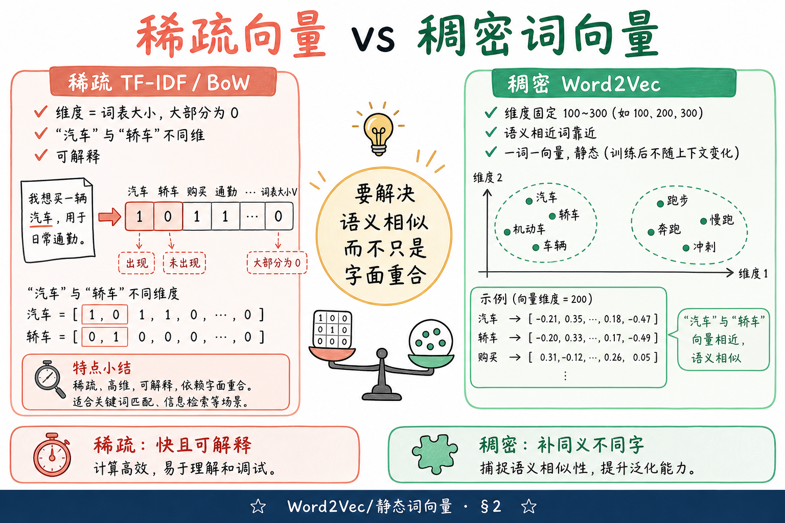
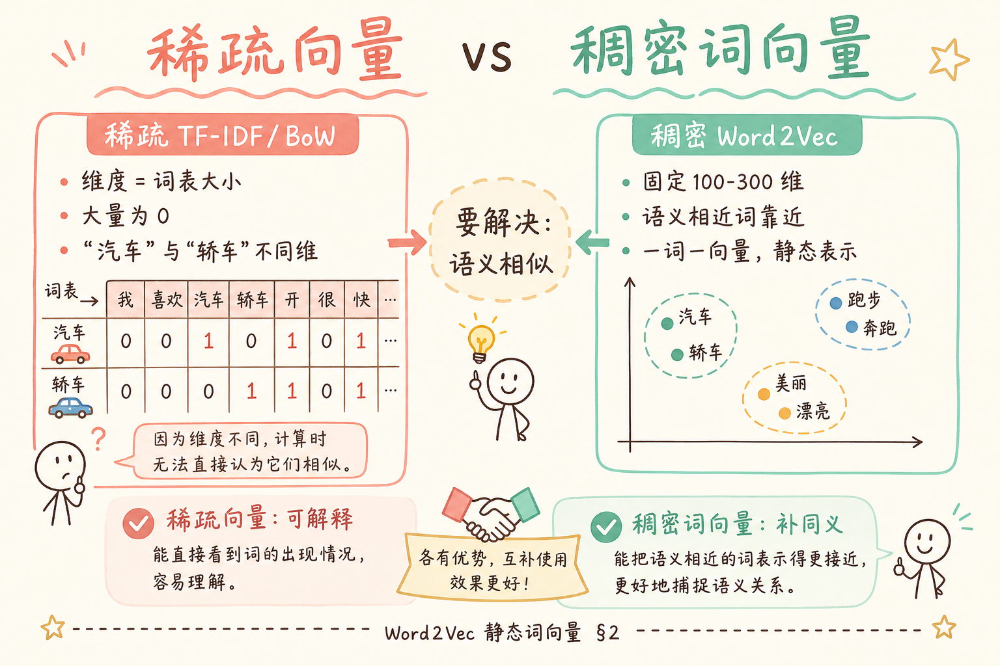
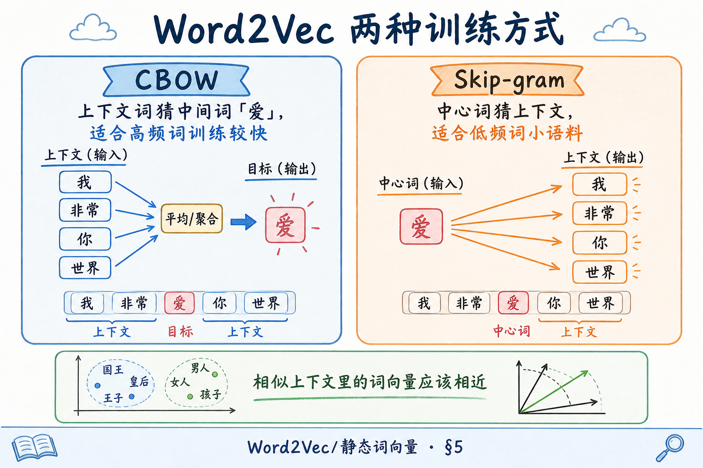
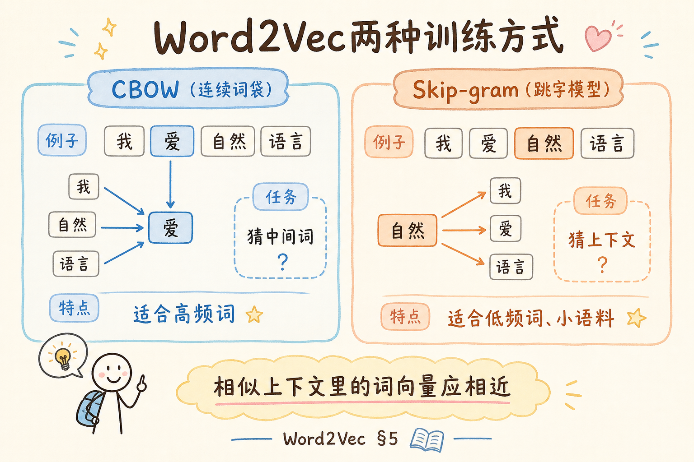
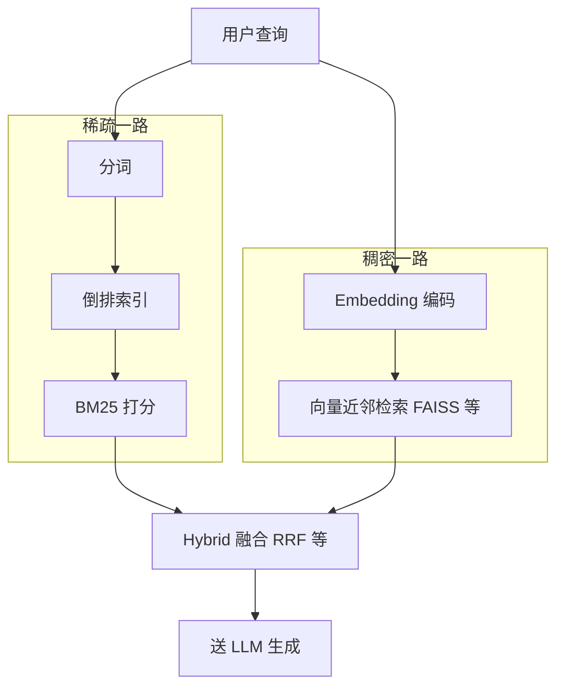
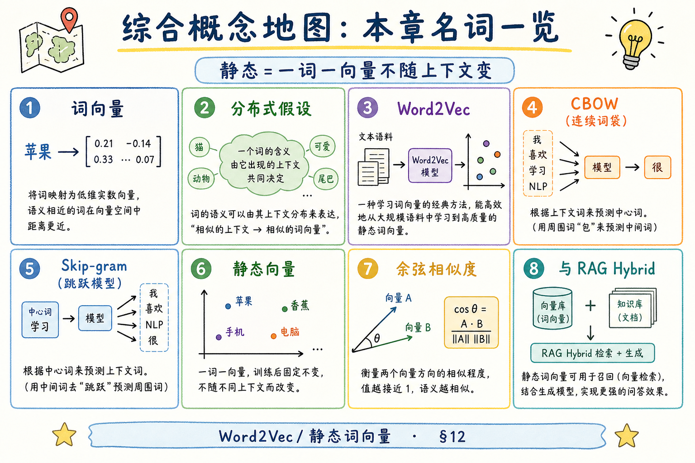
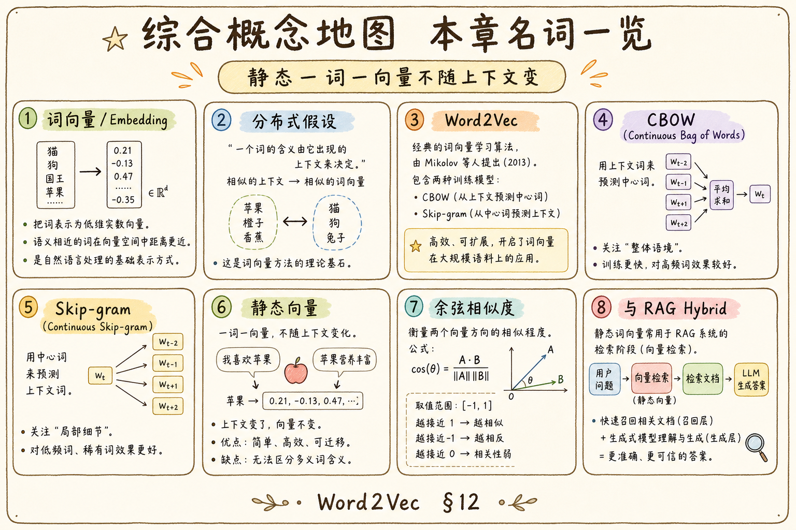

# NLP / IR / LLM 基础（五）：Word2Vec 与静态词向量完全指南

> 你学完 [TF-IDF](18.tfidf-principles-tutorial.md) 与 [BM25](19.bm25-sparse-retrieval-tutorial.md)，知道稀疏检索靠「词是否出现」打分——用户搜「轿车保养」，语料里只写「汽车维护」却可能完全召不回。不是分词错了，而是 **BoW / TF-IDF 把每个词当成互不相关的坐标轴**，「汽车」和「轿车」落在不同维度上。2013 年前后 **Word2Vec** 把词变成 **稠密低维向量**，让语义相近的词在空间里靠近，为今天的 Embedding 检索铺了路。这篇是 [企业 RAG 路线图](ENTERPRISE_RAG_ROADMAP.md) **B 轨第五篇**（路线图第 28 条）：概念为主，说明 **静态词向量** 是什么、怎么学出来、与稀疏检索如何分工；代码仅保留加载预训练向量的最小示例。前置 [分词](17.nlp-tokenization-basics-tutorial.md)、[倒排索引](20.inverted-index-tutorial.md)。

---

## 目录

1. [前言：同义词墙](#1-前言同义词墙)
2. [从稀疏到稠密：向量长什么样](#2-从稀疏到稠密向量长什么样)
3. [分布式假设：上下文即语义](#3-分布式假设上下文即语义)
4. [词向量（Embedding）是什么](#4-词向量embedding是什么)
5. [Word2Vec 的两种架构：CBOW 与 Skip-gram](#5-word2vec-的两种架构cbow-与-skip-gram)
6. [训练直觉：窗口、负采样与一词一向量](#6-训练直觉窗口负采样与一词一向量)
7. [相似度、类比与「国王减男人」](#7-相似度类比与国王减男人)
8. [静态词向量的局限](#8-静态词向量的局限)
9. [与 RAG 路线图的位置关系](#9-与-rag-路线图的位置关系)
10. [最小代码：看一眼预训练向量](#10-最小代码看一眼预训练向量)
11. [静态 vs 上下文向量（预告）](#11-静态-vs-上下文向量预告)
12. [综合概念地图](#12-综合概念地图)
13. [常见陷阱与 FAQ](#13-常见陷阱与-faq)
14. [总结与系列下一步](#14-总结与系列下一步)

---

## 1. 前言：同义词墙

典型场景：制度库 chunk 写「**机动车**年检流程」，用户问「**汽车**年检怎么办」。BM25 若没命中共同词项，分数接近零——而人眼知道这是在问同一件事。

**词向量**（word embedding，词嵌入）：把词映射到 **固定长度** 的实数向量（如 300 维），使得语义相近的词向量 **距离更近**。  
通俗说：给每个词发一张 **坐标卡**，意思相近的词住在邻近街区——不再各占一个互不相干的稀疏维度。

**静态词向量**（static embedding）：无论出现在哪句话里，「银行」永远对应 **同一张** 坐标卡。  
通俗说：**一词一向量**——后面会看到，多义词会吃亏；[BERT](ENTERPRISE_RAG_ROADMAP.md) 一类 **动态向量** 才随上下文变。

**读完本文，你应该能做到：**

1. 说明稀疏 TF-IDF 向量与稠密词向量在 **维度、语义、可解释性** 上的差异。
2. 用白话解释 **分布式假设** 与 Word2Vec 的训练目标。
3. 区分 **CBOW** 与 **Skip-gram** 各猜什么、各适合什么场景。
4. 解释「静态」的含义，并举例 **多义词** 为何是硬伤。
5. 描述 Word2Vec 在 RAG 里与 BM25 **互补** 而非替代的关系。
6. 用余弦相似度比较两个词向量的直觉含义。

**前置**：[17 分词](17.nlp-tokenization-basics-tutorial.md)、[18 TF-IDF](18.tfidf-principles-tutorial.md)、[19 BM25](19.bm25-sparse-retrieval-tutorial.md)、[20 倒排索引](20.inverted-index-tutorial.md)。  
**环境**：概念篇不强制安装；§10 试代码需 Python 3.10+，`pip install gensim numpy`。  
**本文边界（地基篇）**：讲清 **静态词向量概念**；**不讲** Word2Vec 完整反向传播推导、GloVe/FastText 细节、sentence-transformers 微调。路线图第 32 条「Embedding 向量表示」、第 78～90 条「生产向量化」在后续展开。

### 1.1 和前几篇的分工

| 篇章 | 回答的问题 |
|------|------------|
| [17 分词](17.nlp-tokenization-basics-tutorial.md) | term 怎么切 |
| [18–19 TF-IDF / BM25](18.tfidf-principles-tutorial.md) | 稀疏检索怎么打分 |
| [20 倒排索引](20.inverted-index-tutorial.md) | 稀疏检索怎么快 |
| **本篇** | 词怎么变成 **稠密语义向量**；为何需要它 |
| 路线图 32、C3 | 生产里用哪家 Embedding API、维度与成本 |

没有 Word2Vec 这一代工作，今天 RAG 里的「语义检索」会难讲得多——但生产环境你多半 **不自己训 Word2Vec**，而是调用 `text-embedding-3`、BGE 等 **句向量 / 文档向量** 模型；理解静态词向量，是读懂那些模型的 **历史台阶**。

---

## 2. 从稀疏到稠密：向量长什么样

### 2.1 回顾：TF-IDF 向量是「稀疏」的

[第 18 篇](18.tfidf-principles-tutorial.md) 把文档看成向量：每一维对应词表里的一个词，值是 tfidf 权重，**没出现的词为 0**。词表 5 万，向量就是 5 万维，其中 99% 以上是 0——这叫 **稀疏**（sparse）。

查询「轿车」时，只有「轿车」那一维非零；「汽车」在另一维——**余弦相似度为 0**，除非查询扩展或命中同一词。

### 2.2 稠密词向量：维数少、几乎无零

Word2Vec 学出的向量通常 **100～300 维**，每一维都是小数（如 `0.12, -0.87, …`），**一般不全为 0**——这叫 **稠密**（dense）。

语义相近的词，向量在空间里 **夹角小**（余弦高）；无关词 **方向差**。

下面这张图对比两种表示：左边是「一词一维、大量为零」的稀疏世界；右边是「一词一串小数、维数固定」的稠密世界。读图时重点看 **维度数量** 与 **「汽车 / 轿车」能否靠近**。





对照上图：稀疏侧 **可解释**（能打印命中了哪些 term），稠密侧 **补语义**（同义不同字仍可能相近）。RAG 里常见 **两路都要**，而不是二选一。

| 维度 | 稀疏 TF-IDF / BoW | 稠密 Word2Vec 类 |
|------|-------------------|------------------|
| 向量长度 | ≈ 词表大小 | 固定（如 300） |
| 非零比例 | 极低 | 几乎全部非零 |
| 同义词 | 不同维，默认不相似 | 训练后常相近 |
| 可解释性 | 高（看词项权重） | 低（每维无人类标签） |
| 存储 | 倒排压缩 | 每词 300×float |

### 2.3 为什么叫「静态」

Word2Vec 给「苹果」一个向量，无论出现在「吃 **苹果**」还是「**苹果** 公司」，**同一张向量**。  
这与后面 **Transformer** 按上下文动态生成向量不同——静态是 **故意简化**，换来得快、好算、2013 年惊艳全场。

---

## 3. 分布式假设：上下文即语义

**分布式假设**（distributional hypothesis）：词的意思由它 **经常出现的上下文** 决定。  
通俗说：**物以类聚，词以伴生**——经常和「驾驶、轮胎、油耗」一起出现的词，多半和「汽车」一类。

经典表述：*You shall know a word by the company it keeps.*（你可以从它的「朋友圈」认识这个词。）

Word2Vec 不查词典定义，而是 **读大量句子**，反复问：

- 看见这些邻居词，**中间** 最可能是谁？（CBOW）
- 看见中心词，**周围** 最可能是谁？（Skip-gram）

答对得多，说明这对 **词向量配得好**；训练过程就是调整向量，让共现词的预测更准。

### 3.1 与 TF-IDF 的哲学差异

| | TF-IDF | Word2Vec |
|---|--------|----------|
| 信号来源 | 文档里 **有没有** 这个词 | 词 **和谁一起出现** |
| 「银行」与「利率」 | 共现会提高各自 tf，但仍不同维 | 向量会被拉近 |
| 需要标注 | 否 | 否（自监督） |

两者都 **不需要人工标注**「这是同义词」——但 Word2Vec 从 **共现** 里榨出语义，TF-IDF 只统计 **计数**。

---

## 4. 词向量（Embedding）是什么

**Embedding**（嵌入）：把离散符号（词、句、图节点）映射到连续向量空间的技术总称。  
通俗说：**把「字面上的 ID」变成「可算距离的点」**——计算机才能做「找最近的邻居」。

Word2Vec 是 **词级别** embedding 的代表作之一。今天 RAG 更常用 **句向量**（整段 chunk 一个向量），但句向量模型内部往往仍建立在 **子词 / 词** 的表示之上；搞清 **词向量**，读 BGE、OpenAI Embedding 文档不会完全黑盒。

### 4.1 向量空间里有什么

想象二维平面（实际几百维，人类只能画 2D）：

- 「国王」「女王」离得近  
- 「国王」「香蕉」离得远  
- 「男人」「女人」的方向，有时和「国王」「女王」的方向 **平行**（引出 §7 类比）

检索时：把 **查询** 也变成向量（查询里各词向量平均，或直接用句向量模型），在库里找 **余弦相似度最高** 的 chunk 向量——这是路线图 **C3 向量化** 的核心动作，本篇先建立 **「向量 ≈ 语义坐标」** 的直觉。

### 4.2 词表与 OOV

Word2Vec 训练时有 **固定词表**。训练时没见过或频次极低的词，没有向量或向量不可靠——叫 **OOV**（out-of-vocabulary，未登录词）。  
工程上可用 **子词** 方法（FastText，了解）或直接用现代 **BPE tokenizer + 神经网络**，本篇只需记住：**静态词表模型对生僻词、错字敏感**。

---

## 5. Word2Vec 的两种架构：CBOW 与 Skip-gram

**Word2Vec**（Mikolov 等，2013）：用浅层神经网络，在大语料上学习词向量；两种训练目标：



**CBOW**（Continuous Bag of Words，连续词袋）：用 **上下文词的向量平均**，预测 **中间词**。  
通俗说：**看左右邻居，猜中间那个词**——适合 **高频词**，训练快。

**Skip-gram**：用 **中心词**，预测 **周围上下文词**。  
通俗说：**拿中间词去猜两边**——对 **低频词** 更友好，小语料更常用。

下图左右两栏分别是两种架构：注意 **箭头方向**——CBOW 是上下文指向中心；Skip-gram 是中心指向上下文。



对照上图：二者 **目标不同**，但 **哲学相同**——共现多的词，向量应配在一起。生产训练自己语料的 Word2Vec 已较少，但 **理解窗口与预测方向**，有助于读 GloVe、FastText 与后来的 **语言模型预训练**。

### 5.1 滑动窗口

训练时句子上开 **窗口**（如左右各 2 个词）：  
「我 / 爱 / **自然语言处理** / 和 / 机器学习」

每个位置滑一遍，产生多条 (上下文, 目标) 训练样本。窗口越大，越偏 **话题**；越小，越偏 **语法搭配**。这是超参，地基篇知道 **有窗口** 即可。

### 5.2 先错后对：把 Word2Vec 当成「查同义词词典」

**错误直觉**：训完 Word2Vec，等于内置了一本 **同义词表**，查询时做字符串替换。  
**更接近事实**：向量空间里 **距离近** 不等于 **可互换**；「删除」与「移除」相近，但法律文本里能否替换要人审。RAG 里用向量 **召回候选**，仍要靠 BM25、重排序、LLM 把关。

---

## 6. 训练直觉：窗口、负采样与一词一向量

### 6.1 训练在优化什么

简化叙述：模型给词表中每个词两个向量角色（中心 / 上下文，实现细节略），通过 **softmax** 预测「下一个词是谁」。词表 10 万时，每步 softmax 太贵。

**负采样**（negative sampling）：每次不只算正确词，再 **随机抽几个错误词**（负样本），让正确词分数高于负样本即可。  
通俗说：**只跟几个陪跑选手比快慢**，不全场马拉松——Word2Vec 能训百万级语料的关键技巧之一。地基篇 **不必推公式**，知道「大规模语料靠负采样才训得动」。

### 6.2 一词一向量

训练结束后，每个词 **固定** 取一张向量（通常用中心词向量或两者平均）。这张表可以 **查表**：`vector("报销")` → 300 个 float。  
**静态** 就体现在这里：没有「当前句子」输入，向量不变。

### 6.3 中文 Word2Vec

中文需先 **分词** 再训（与 [第 17 篇](17.nlp-tokenization-basics-tutorial.md) 衔接）：同一套语料，用 jieba 与用 pkuseg 切词，得到的 **词表与向量不同**。  
开源有 `sgns.zhihu.word` 等中文预训练；企业 RAG 更常用 **领域句向量**，但 **分词一致性** 原则不变。

---

## 7. 相似度、类比与「国王减男人」

### 7.1 余弦相似度

两向量 \(\vec{a}, \vec{b}\) 的 **余弦相似度**：

\[
\cos(\vec{a}, \vec{b}) = \frac{\vec{a} \cdot \vec{b}}{\|\vec{a}\| \|\vec{b}\|}
\]

取值常在 \([-1, 1]\)，越接近 1 越 **方向一致**。  
通俗说：**比夹角，不比长度**——检索里常对向量 **L2 归一化** 后，余弦与点积等价（路线图第 83 条）。

Word2Vec 论文里「**king − man + woman ≈ queen**」曾很出名：向量运算 **有时** 对应语义关系。  
**不必迷信**：高维空间里这种类比 **不总成立**，且受训练语料偏见影响（了解即可）。初学者 takeaway：**向量可以做加减，暗示语义方向**——但 RAG 生产 **不靠玩类比**，靠 **最近邻检索**。

### 7.2 词级 vs 句级相似度

用户问「怎么报销差旅」是一 **句**。词级 Word2Vec 常把句中词向量 **平均** 成句向量——粗糙但教学够用。  
现代 `text-embedding-3`、BGE 直接编码 **整句**，语义更完整；路线图 C3 专讲。本篇词向量是 **理解 Embedding 的台阶**。

---

## 8. 静态词向量的局限

| 局限 | 白话 | 对 RAG 的影响 |
|------|------|----------------|
| **一词一向量** | 「苹果」水果与公司同向量 | 歧义 chunk 可能误召 |
| **无语序** | 词袋式上下文窗口 | 否定、条件句仍弱 |
| **无世界知识** | 只从共现学 | 「2024 年财报」等需新语料或新模型 |
| **域外迁移** | 维基训的向量不懂你司 OKR | 领域 Embedding 或微调 |
| **可解释性弱** | 说不清哪一维代表什么 | 合规场景要 hybrid + 引用 |

**何时仍值得了解 Word2Vec**：读论文、读老项目、理解 **Embedding 从哪来**；算法课作业。  
**何时直接用现代句向量**：企业 RAG 上线——路线图 **78～90** 的 API / BGE / 本地推理。

### 8.1 静态 vs 动态：银行 disambiguation

「我去 **银行** 办事」与「河 **银行** 种草」——静态 Word2Vec 同一个 `银行` 向量；**BERT** 类模型按上下文输出 **不同** 向量。  
这是路线图 **29 Transformer**、**32 Embedding** 的动机预告：RAG 质量跃迁往往来自 **更好的编码器**，不只是更大词表。

---

## 9. 与 RAG 路线图的位置关系



读图：**Word2Vec 属于稠密一路的思想源头**；你上线时稠密一路多半是 **chunk 句向量 + 向量库**，不是裸 Word2Vec 词向量平均。但 **「语义相近应靠近」** 不变。

### 9.1 与路线图条目对照

| 路线图条 | 与本篇关系 |
|----------|------------|
| 28 Word2Vec / 静态词向量 | **本篇** |
| 32 Embedding 向量表示 | 生产向量与 API |
| 33 Cosine / 内积 | §7 相似度扩展 |
| C3 78～90 | OpenAI / BGE / 批处理 / 成本 |
| C4 92～99 | FAISS / Milvus / pgvector 存向量 |

### 9.2 Hybrid 为何常见

- 用户搜 **产品型号 `X-2000`**：稀疏 **精确命中** 更稳。  
- 用户搜 **「出差费用怎么报」**：稠密 ** paraphrase** 更稳。  
- [第 18 篇 §9](18.tfidf-principles-tutorial.md) 已说 TF-IDF 无语义；本篇给 **稠密补语义** 的直觉。  
- 企业 RAG 路线图 **检索层** 默认 **混合检索 + 重排**，不是纯向量一把梭。

### 9.3 从词向量到 chunk 向量

RAG 索引单位是 **chunk**，不是单个词。工程路径：

1. **词向量平均**（老 baseline，了解）；  
2. **句向量模型** 编码整段 chunk（主流）；  
3. **多向量**（ColBERT 类，进阶）。

本篇 Word2Vec 是 **(1) 的思想来源**；(2) 是你要在 C3 实现的。

---

## 10. 最小代码：看一眼预训练向量

下面演示：加载 **gensim** 自带的小型 Word2Vec 格式模型（英文），打印向量形状、算两个词的相似度。  
**演示目的**：确认「一词一串 float」「相似词 cos 更高」。  
**环境**：`pip install gensim numpy`；首次运行可能下载测试模型。  
**说明**：中文请换中文预训练文件，接口相同。

```python
import gensim.downloader as api

# 加载 gensim 提供的预训练 Word2Vec（英文，体积较小，适合本地试）
model = api.load("word2vec-google-news-300")  # 约 1.6GB，可改用 "glove-wiki-gigaword-100"

word = "king"
vec = model[word]
print(word, "向量维度:", vec.shape)  # (300,)

# 余弦相似度：gensim 用 most_similar 展示近邻
for term, score in model.most_similar("king", topn=5):
    print(f"  与 {term!r} 相似度 {score:.3f}")

# 类比：positive 加、negative 减（不总可靠，仅作演示）
result = model.most_similar(
    positive=["woman", "king"],
    negative=["man"],
    topn=3,
)
print("woman + king - man ≈", [r[0] for r in result])
```

**预期**：`king` 近 `queen`、`prince`；类比 top 常含 `queen`（不保证每次第一）。  
若报 `KeyError`，说明该词不在词表（**OOV**）——换成 `most_similar` 里存在的词。

**先错后对**：不要 `pip install word2vec` 以为有官方包——常用 **gensim** 加载 `.bin` / `.txt` 或自己用 `gensim.models.Word2Vec` 训练。

---

## 11. 静态 vs 上下文向量（预告）

| | 静态（Word2Vec） | 动态（BERT 类） |
|---|------------------|-----------------|
| 一词多向量 | 否 | 是（看上下文） |
| 训练年代 | 2013 起盛行 | 2018 Transformer 后主流 |
| 推理成本 | 查表 O(1) | 整句前向，较慢 |
| RAG 现状 | 多被句向量模型取代 | 编码器内核 |

路线图 **29 Transformer**、**30 Self-Attention** 会解释动态向量从哪来。本篇只需记住：**Word2Vec 是历史里程碑，不是 2026 年 RAG 默认栈**——但 **「用向量表示语义」** 这条线一直延续到 `text-embedding-3-large`。

---

## 12. 综合概念地图

| 名词 | 通俗说 |
|------|--------|
| 词向量 / Embedding | 词 → 一串小数，语义靠距离 |
| 分布式假设 | 看上下文认词 |
| 稀疏 vs 稠密 | 词表维 + 大量 0 vs 固定维 + 全小数 |
| CBOW | 上下文猜中间 |
| Skip-gram | 中间猜上下文 |
| 静态 | 一词一向量 |
| 负采样 | 训练加速技巧 |
| 余弦相似度 | 比夹角 |
| OOV | 词表外，无好向量 |

下面信息图把上表收成八格，复习时扫一眼即可。





对照上图：**静态** 是理解后续 **句向量、多模态向量** 的底座；看到「Embedding」一词，先问 **是词级、句级、还是多模态**，再问 **静还是动**。

---

## 13. 常见陷阱与 FAQ

### 13.1 常见陷阱

**陷阱 1：用 Word2Vec 平均向量当生产 RAG 唯一检索**  
句向量 + Hybrid + 重排是常态；词平均丢语序与句意。

**陷阱 2：以为向量近就能自动替换词**  
法务、医药领域 **近义不等于可替换**。

**陷阱 3：中文不统一分词就训 / 就用**  
与 [第 17 篇](17.nlp-tokenization-basics-tutorial.md) 索引、查询 **同一分词器** 原则类似；训与用、索引与查询要 **一致**。

**陷阱 4：忽略 OOV**  
新品代号、内部缩写无向量 → 召回空洞；稀疏一路或关键词仍要保留。

**陷阱 5：把 king−man+woman 当产品特性**  
演示而已；偏见、性别刻板印象在旧语料向量里常见，**不可直接用于人事决策**。

### 13.2 FAQ

**Q：Word2Vec 和 GloVe 选谁？**  
A：地基篇知二者都是 **静态词向量** 经典方法即可；RAG 生产优先 **句向量 API**。GloVe 用全局共现矩阵分解，Word2Vec 用局部窗口预测——**思想不同，用途都被后续模型覆盖**。

**Q：还要自己训 Word2Vec 吗？**  
A：多数团队 **否**；除非极小垂直域、无 Embedding API、研究对比。路线图 C3 走 **现成编码器**。

**Q：向量维度越高越好？**  
A：不必然；高维占存储、增 ANN 成本（路线图第 82 条）。需在 **评测集** 上看 recall@k。

**Q：Word2Vec 与路线图第 32 条 Embedding？**  
A：本篇是 **词级静态**；第 32 条是 **工程里 chunk 向量表示** 总论，含 API 与归一化。

**Q：和 LLM 的 token embedding 一样吗？**  
A：**概念类似**（离散 id → 向量），但 LLM 的 token 向量会随 **上层网络** 变成上下文相关表示；Word2Vec 训完就 **冻结查表**。

---

## 14. 总结与系列下一步

1. **稀疏检索** 看词是否出现；**稠密向量** 看语义是否相近——RAG 常 **两路并存**。  
2. **分布式假设** + **窗口预测** 是 Word2Vec 的核心故事。  
3. **CBOW** 猜中间，**Skip-gram** 猜两边；都是 **静态一词一向量**。  
4. **静态** 快、简单，怕 **多义词**；现代 RAG 用 **句向量 + Transformer 编码器**。  
5. 生产实现跟路线图 **C3 向量化**、**C4 向量库**，本篇是 **概念地基**。

### 14.1 系列下一步

| 目标 | 推荐阅读 |
|------|----------|
| 向量相似度公式与归一化 | 路线图 **33 Cosine / 内积**（待成篇） |
| 生产 Embedding 选型 | 路线图 **32、C3 78～90** |
| 向量库与 ANN | 路线图 **C4** |
| 稀疏侧继续巩固 | [19 BM25](19.bm25-sparse-retrieval-tutorial.md)、[20 倒排](20.inverted-index-tutorial.md) |
| Transformer 为何能动态编码 | [22 Transformer 架构](22.transformer-architecture-tutorial.md) |

### 14.2 学习目标自检

- [ ] 能说出稀疏与稠密向量各一个区别  
- [ ] 能画 CBOW / Skip-gram 箭头方向  
- [ ] 能解释「静态」对「银行」多义的问题  
- [ ] 能说明 Word2Vec 在 RAG 里与 BM25 的分工  

---

> **初学者可能仍困惑的点**  
> - Word2Vec **训的是词**，RAG **检的是 chunk**——中间还有 **句向量** 这一步。  
> - 向量相似 **不等于** 业务上「可互相替代」。  
> - 旧新闻语料训的向量带 **时代与偏见**，别直接当真理。  
> - **Hybrid** 不是落后，是 **型号 + 语义** 都要时的务实组合。  
> - 没有 Embedding API 时，仍可用 **BM25 + 关键词** 做出第一版 RAG，不必等向量。
