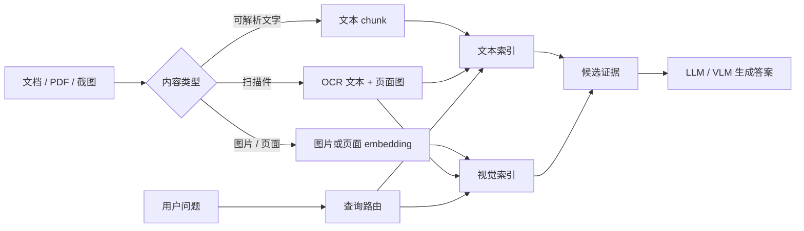
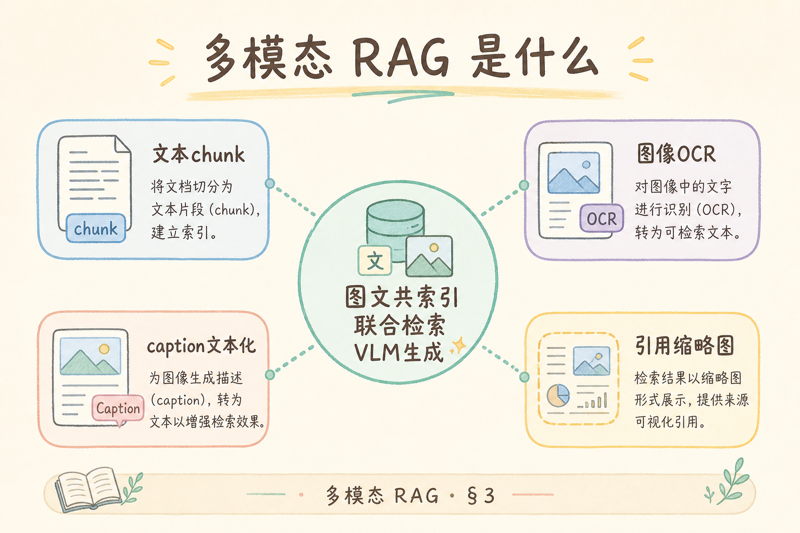
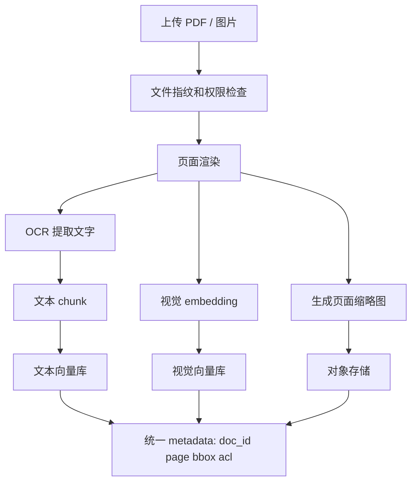
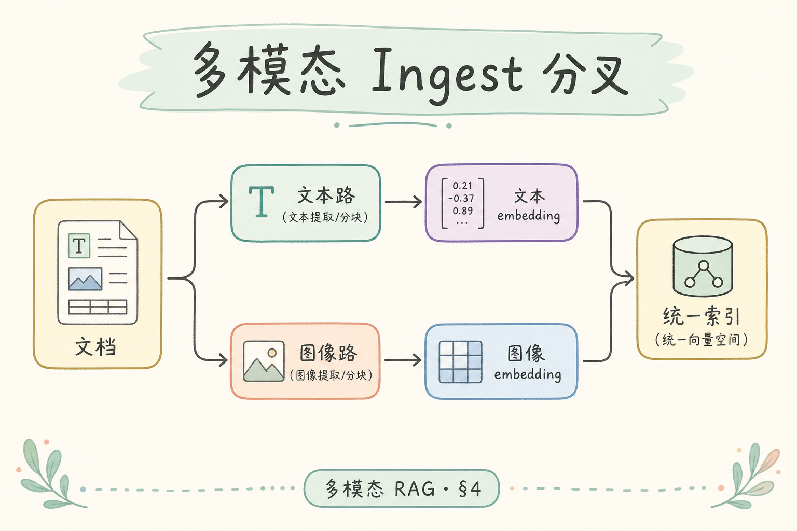
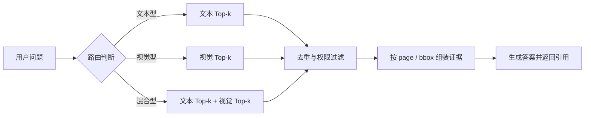
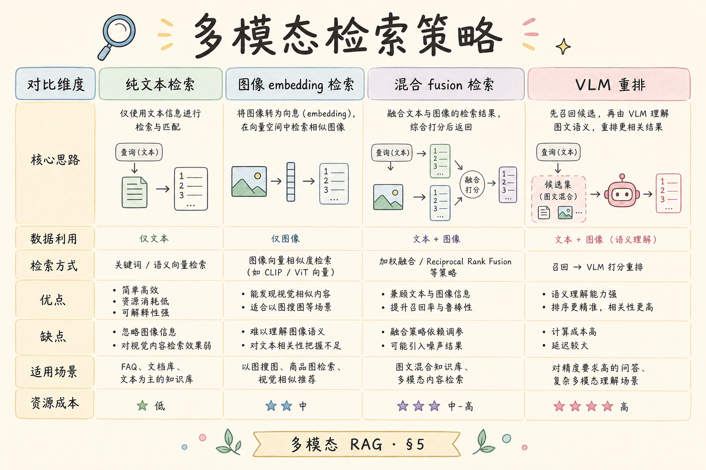

# H 进阶方向（十二）：多模态 RAG 完全指南（了解）

> 纯文本 RAG 只能检索文字。遇到截图、图表、扫描件、流程图、合同版式时，答案可能藏在像素里。这篇解释多模态 RAG 是什么、解决什么问题、如何从 OCR MVP 逐步升级到图文联合检索。

---

## 目录

1. [为什么文字 RAG 不够](#1-为什么文字-rag-不够)
2. [多模态 RAG 是什么](#2-多模态-rag-是什么)
3. [它解决什么问题](#3-它解决什么问题)
4. [Ingest：图文怎么入库](#4-ingest图文怎么入库)
5. [检索：怎么跨模态匹配](#5-检索怎么跨模态匹配)
6. [生成：VLM 和文本 LLM 怎么分工](#6-生成vlm-和文本-llm-怎么分工)
7. [最小 MVP 路径](#7-最小-mvp-路径)
8. [边界、陷阱与 FAQ](#8-边界陷阱与-faq)
9. [总结](#9-总结)

## 1. 为什么文字 RAG 不够

普通 RAG 的输入通常是文本：PDF 解析出的段落、Markdown、网页正文、数据库字段。问题是，很多企业知识并不只存在于文字里。

举例：一张运维告警截图里有红色曲线、阈值线和时间轴。OCR 可能能读出“CPU 使用率”，但它不一定知道红线在 14:00 后突然上升，也不一定能把图例颜色和曲线对应起来。用户问“红色曲线为什么越过阈值”，答案需要视觉理解。

| 资料类型 | 纯文本 RAG 的缺口 | 多模态 RAG 的目标 |
|----------|------------------|-------------------|
| 扫描合同 | OCR 错字、表格错位 | 同时看文字和版式 |
| 架构图 | 箭头关系丢失 | 理解组件连接 |
| 截图 | 像素信息未入库 | 识别界面状态 |
| 图表 | 数值、颜色、趋势难抽 | 解释视觉趋势 |

## 2. 多模态 RAG 是什么

**多模态 RAG**：检索系统不只处理文字，还处理图片、页面截图、PDF 页面、图表等视觉信息；生成答案时可以引用文字片段，也可以引用图片区域或页面。

通俗说：文字 RAG 像只读书里的字；多模态 RAG 像同时看字、图、表格、版式和截图。它的目标不是“把所有问题都交给视觉大模型”，而是让检索阶段就能找到正确的视觉证据。



这张图表达的是一个实用原则：多模态不是替代文本索引，而是增加一条视觉索引，让查询可以按需要走文本、视觉或双通道。

## 3. 它解决什么问题

多模态 RAG 主要解决三类问题。

第一类是“图里有答案”。例如用户问“架构图中 API Gateway 后面接了几个服务”，文字说明可能没有列全，答案在图里。

第二类是“版式就是信息”。合同、发票、表格、说明书经常靠位置表达关系。单纯 OCR 会把多列内容串错，导致检索命中错误上下文。

第三类是“文字和图必须一起看”。例如图表标题说“延迟趋势”，图里曲线显示异常峰值；只看标题没有答案，只看图片又缺业务解释。

| 问题类型 | 推荐路径 |
|----------|----------|
| 图片里有文字 | OCR + 文本索引先做 |
| 图片里有结构/趋势 | 视觉 embedding 或 VLM caption |
| PDF 版式复杂 | 页级检索，必要时看 [211 ColPali](211.colpali-rag-tutorial.md) |
| 大量普通文本 | 继续用文本 RAG，不要强行多模态 |

## 4. Ingest：图文怎么入库

多模态 ingest 的关键不是“多调一个模型”，而是把每份资料拆成可检索、可引用、可回放的证据单元。





初学者要特别注意 metadata。多模态检索必须知道证据来自哪一页、哪个区域、哪个租户、哪份文件版本。否则答案即使命中了正确图片，也无法在 UI 里高亮给用户看。

建议字段：

| 字段 | 说明 |
|------|------|
| `doc_id` / `version` | 文件与版本 |
| `page` | 页码或截图序号 |
| `bbox` | 图片区域坐标，可为空 |
| `modality` | `text`、`ocr`、`image`、`page` |
| `acl` | 权限，必须与文本索引一致 |

## 5. 检索：怎么跨模态匹配

查询来了以后，系统先判断它更像文字问题、视觉问题，还是混合问题。

| 查询 | 路由建议 |
|------|----------|
| “退款政策第 3 条是什么？” | 文本检索优先 |
| “图里红色曲线表示什么？” | 视觉检索优先 |
| “这张架构图里的鉴权流程是否符合文字说明？” | 文本 + 视觉双通道 |

一个简单可解释的打分方式是双通道融合：

```text
score = alpha * text_score + (1 - alpha) * image_score
```

`alpha` 不是固定真理。文字问题多时提高 `alpha`，视觉问题多时降低 `alpha`。上线前要用金标问题扫参，而不是凭感觉写死。





## 6. 生成：VLM 和文本 LLM 怎么分工

**VLM**（Vision-Language Model，视觉语言模型）：能同时读取图像和文字的模型。通俗说，它不只看 prompt 里的字，也能看图片内容。



多模态 RAG 里不一定每次都要调用 VLM。一个省钱且稳的分工是：

| 情况 | 生成方式 |
|------|----------|
| OCR 文本足够回答 | 文本 LLM 回答 |
| 需要解释图表趋势 | VLM 看图后回答 |
| 需要引用图片区域 | VLM 或页级模型辅助定位 |
| 批量普通问答 | 不走 VLM，避免成本失控 |

生成时必须告诉模型证据类型。例如：`以下 evidence[0] 是 OCR 文本，evidence[1] 是页面截图`。否则模型可能把 OCR 错误当原文，也可能忽略图片证据。

## 7. 最小 MVP 路径

建议按 L1/L2/L3 逐步升级，不要一开始就做全套多模态平台。

| 层级 | 做什么 | 适合目标 |
|------|--------|----------|
| L1 | OCR 文本入库，保留页码引用 | 扫描 PDF 可搜索 |
| L2 | 图片 caption + 文本索引 | 图表可粗略检索 |
| L3 | 视觉 embedding / ColPali / VLM 生成 | 版式、图表、截图深度问答 |

两周 MVP 可以这样切：

1. 选 50 份代表性 PDF 或截图。
2. 做 OCR，文本 chunk 带 `page` metadata。
3. 对每页生成 caption，写入文本索引。
4. 做 30 条金标问题，标注“必须看图”子集。
5. 如果 OCR+caption 不够，再评估视觉 embedding 或 [211 ColPali](211.colpali-rag-tutorial.md)。

## 8. 边界、陷阱与 FAQ

这一节回答多模态 RAG 上手前最容易混淆的几个问题。重点是区分“让模型看图生成答案”和“把图片证据纳入可检索、可引用、可权限控制的 RAG 系统”。

### 8.1 多模态 RAG 等于直接上 GPT-4V 吗？

不是。直接把图片塞给 VLM 是生成能力，不是检索系统。RAG 还要解决资料入库、权限、版本、引用、缓存、评测和成本。

### 8.2 OCR 已经做了，还需要多模态吗？

看问题。如果用户只问图片中的文字，OCR 足够。如果用户问颜色、布局、趋势、箭头关系，OCR 通常不够。

### 8.3 最大的生产风险是什么？

权限和引用。图片、缩略图、OCR 文本、caption、视觉 embedding 必须使用同一套 ACL。不能出现文本无权限但图片缩略图可见的漏洞。

### 8.4 怎么评测？

把金标分成三类：纯文本可答、OCR 可答、必须看图可答。多模态能力只看第三类，否则指标会被普通文本问题稀释。

## 9. 总结

多模态 RAG 的核心价值是让“图像和版式里的知识”进入检索闭环。初学者可以按一个判断来记：**如果答案必须看图、看位置、看颜色或看版式，纯文本 RAG 就不够了**。

下一步：先把 L1 OCR 做稳，再读 [211 ColPali](211.colpali-rag-tutorial.md) 了解页级检索；如果只是普通长文档总览，回到 [209 RAPTOR](209.raptor-hierarchical-retrieval-tutorial.md) 更合适。
