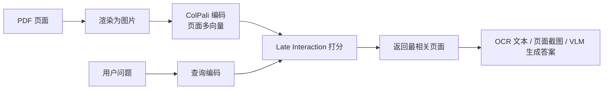
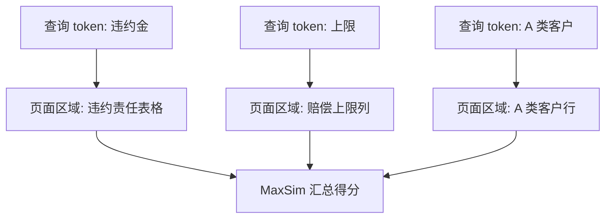
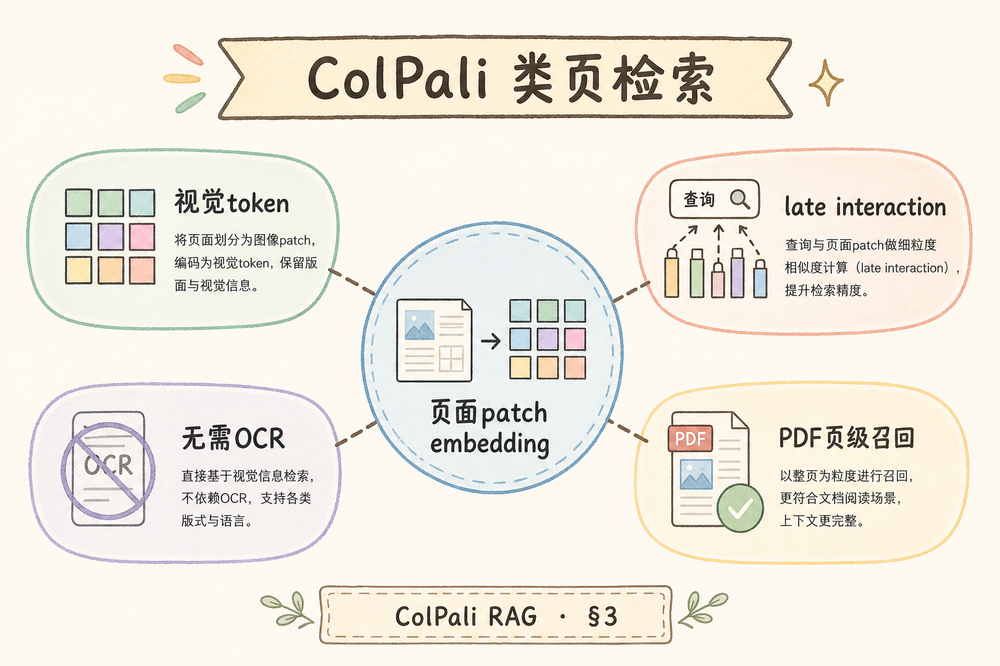
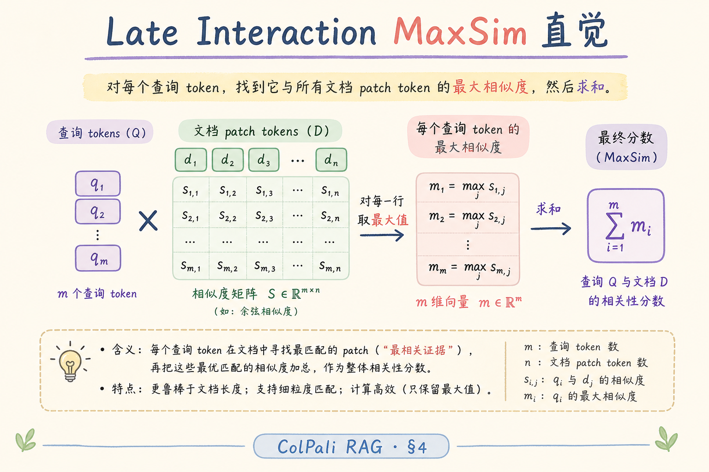
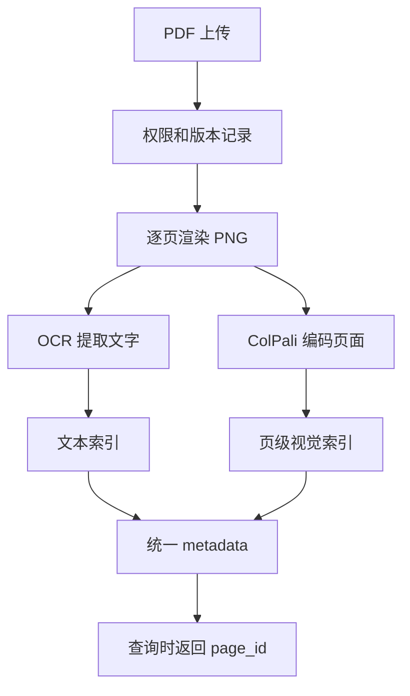
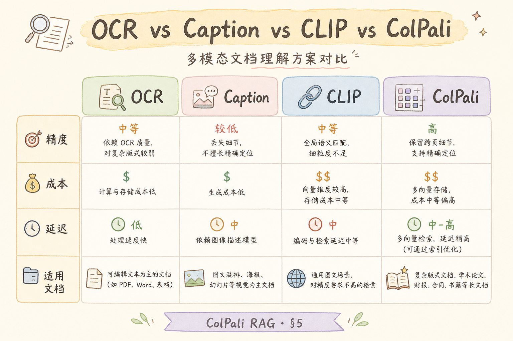

# H 进阶方向（十三）：ColPali 类文档页检索完全指南（了解）

> 多模态 RAG 解决“图文都要看”的问题；ColPali 类方案进一步聚焦一个高频场景：PDF 页面本身就是知识单元，版式、表格、图注、页内位置都重要。这篇解释 ColPali 是什么、有什么用、怎么用于页级检索，以及它不能替代什么。

---

## 目录

1. [为什么需要页级检索](#1-为什么需要页级检索)
2. [ColPali 是什么](#2-colpali-是什么)
3. [Late Interaction 怎么理解](#3-late-interaction-怎么理解)
4. [与 OCR、CLIP、Caption 的分工](#4-与-ocrclipcaption-的分工)
5. [Ingest 和检索怎么做](#5-ingest-和检索怎么做)
6. [最小 PoC](#6-最小-poc)
7. [成本、边界与 FAQ](#7-成本边界与-faq)
8. [总结](#8-总结)

## 1. 为什么需要页级检索

有些 PDF 不是“文字段落集合”，而是“页面布局集合”。合同、财报、论文、说明书、扫描表格经常靠位置表达含义：左栏是条件，右栏是限制；图注解释图表；表头决定单元格含义。

普通 OCR 会把页面拆成文字流，但拆完后可能丢掉版式。用户问“第 3 页表格里 A 类客户的上限是多少”，只搜文字可能命中“上限”两个字，却不知道它属于哪个表头。

ColPali 类方案的目标：把整页当作视觉文档来检索，让问题和页面里的局部视觉 token 做匹配，从而更容易找到正确页面。

## 2. ColPali 是什么

**ColPali**：一类面向文档页检索的视觉语言检索方案。它把 PDF 页面渲染成图片，模型读取页面后生成多向量表示；查询也生成向量，然后用 late interaction 计算查询和页面的相关性。

通俗说：OCR 像把页面抄成一串字；ColPali 更像让模型“看一眼整页”，记住文字、表格、图、位置之间的关系。

注意：ColPali 通常负责“找页面”，不一定负责“生成最终答案”。生成阶段仍可能需要 OCR 文本、页面截图或 VLM。

## 3. Late Interaction 怎么理解

**Late Interaction**：不是把整页压成一个向量，而是保留多个 token 向量，到打分时再让查询 token 和页面 token 做匹配。

通俗说：单向量检索像只给每页一个总评分；late interaction 像逐个检查“问题里的关键词/意图”能不能在页面不同区域找到对应证据。

这也是它适合复杂页面的原因：问题可能对应页面上的多个局部区域，而不是整页主题。

## 4. 与 OCR、CLIP、Caption 的分工

初学者不要把这些方案混成一个词。它们解决的问题不同。

| 方案 | 做什么 | 优点 | 局限 |
|------|--------|------|------|
| OCR | 图片转文字 | 便宜、可引用文字 | 版式和视觉关系容易丢 |
| Caption | 给图片生成描述 | 可接入文本索引 | 描述可能漏细节 |
| CLIP 类单向量 | 图文相似度检索 | 快、简单 | 复杂版式召回弱 |
| ColPali 类 | 页级多向量检索 | 更适合表格、版式、扫描页 | 索引大、算力贵 |

一个稳妥架构通常不是四选一，而是组合：OCR 提供可读文字，ColPali 找页面，VLM 或文本 LLM 生成答案，UI 返回页码和高亮区域。

## 5. Ingest 和检索怎么做

页级检索的 ingest 需要保留页面粒度。不要只存 chunk 文本，否则后面无法回放页面。

查询时常用“两段式”：先用便宜索引粗筛，再用 ColPali 精排。

| 阶段 | 做法 | 目的 |
|------|------|------|
| 粗筛 | BM25 / 文本向量取 100～300 页 | 降低候选量 |
| 精排 | ColPali 对候选页打分 | 找到版式相关页 |
| 生成 | OCR 文本 + 页面截图 + 引用 | 答案可解释 |

如果页面规模很小，可以直接 ColPali 检索；如果是百万页合同库，必须做粗筛，否则成本和延迟会失控。

## 6. 最小 PoC

一个四小时 PoC 不需要训练模型，重点是验证“页级检索是否比 OCR 文本更能找到答案”。

1. 选 30～50 页复杂 PDF，包含表格、图注、多栏或扫描页。
2. 准备 20 条金标问题，其中至少 10 条必须依赖版式。
3. 做 OCR baseline：文本检索返回页码。
4. 做 ColPali 或托管页级检索：返回页码。
5. 比较 Recall@3，并记录失败样例。

验收表：

| 项目 | 合格标准 |
|------|----------|
| 版式题 Recall@3 | 明显高于 OCR baseline |
| 引用 | 能返回页码和页面截图 |
| 成本 | 离线编码时间可接受 |
| 回滚 | 可退回 OCR + 文本检索 |

## 7. 成本、边界与 FAQ

这一节用问答方式收束 ColPali 的适用边界。它适合复杂页面检索，但不应该被当成 OCR、权限系统或答案生成器的替代品。

### 7.1 ColPali 能替代 OCR 吗？

不能。ColPali 擅长找页面，但用户最终往往还需要可复制文字、页码引用和高亮。OCR 仍然是生成和展示的重要输入。

### 7.2 它和多模态 RAG 是什么关系？

ColPali 是多模态 RAG 的一种检索组件，专门处理“文档页”场景。多模态 RAG 范围更大，还包括截图、图片库、图表问答等。

### 7.3 最大成本在哪里？

离线页面编码和在线精排。页面越多，索引越大；查询越多，GPU 或托管服务费用越高。生产上要做队列、缓存、粗筛和限流。

### 7.4 什么时候不要用？

如果 PDF 都是干净文本，段落结构清楚，OCR 或原生文本解析已经足够，就不必上 ColPali。它适合“版式本身影响答案”的场景。

## 8. 总结

ColPali 类方案的核心价值是页级视觉检索：它让系统不只读 OCR 文字，还能根据页面布局和局部视觉证据找到正确页面。初学者记住一句话：**OCR 负责把字拿出来，ColPali 负责在复杂页面里找哪一页最相关**。

下一步：先读 [210 多模态 RAG](210.multimodal-rag-tutorial.md)，再用本文 PoC 表验证自己的 PDF 是否真的需要页级检索。
