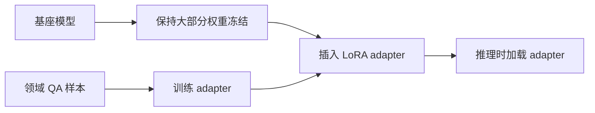
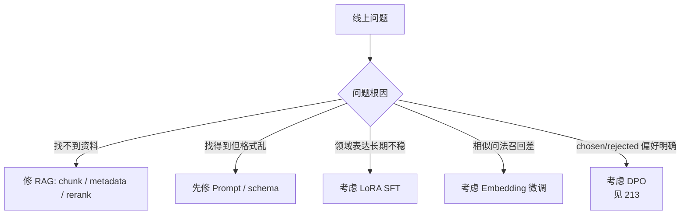
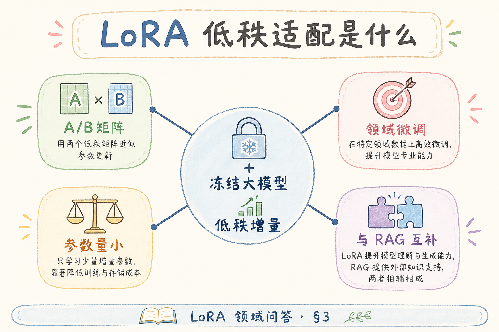
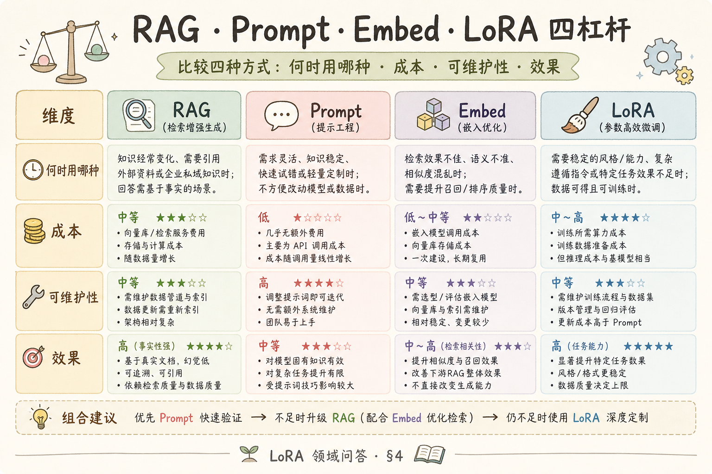
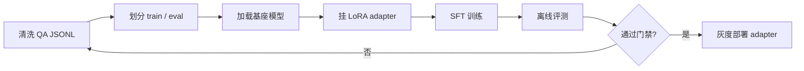
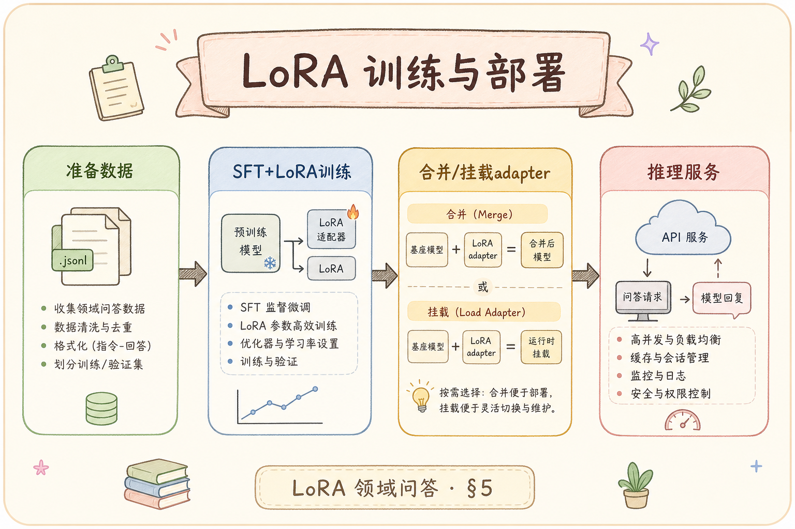

# H 进阶方向（十四）：LoRA 微调领域问答完全指南（了解）

> RAG 负责把资料找出来，但模型回答的口吻、格式、拒答习惯、领域表达不一定符合业务。LoRA 微调解决的是“模型怎么说、怎么遵守领域任务格式”的问题，不是替代检索。这篇解释 LoRA 是什么、有什么用、解决什么问题，以及一个领域 QA 微调 PoC 怎么设计。

---

## 目录

1. [为什么 RAG 之后还会考虑微调](#1-为什么-rag-之后还会考虑微调)
2. [LoRA 是什么](#2-lora-是什么)
3. [LoRA、RAG、Prompt、Embedding 微调怎么分工](#3-loraragpromptembedding-微调怎么分工)
4. [领域 QA 数据怎么准备](#4-领域-qa-数据怎么准备)
5. [训练与部署怎么走](#5-训练与部署怎么走)
6. [最小 PEFT 代码长什么样](#6-最小-peft-代码长什么样)
7. [评测、成本与上线边界](#7-评测成本与上线边界)
8. [常见误用与 FAQ](#8-常见误用与-faq)
9. [总结](#9-总结)

## 1. 为什么 RAG 之后还会考虑微调

RAG 能把资料送进上下文，但它不保证模型一定按你的业务方式回答。常见问题包括：回答格式不稳定、客服话术不统一、该拒答时不拒答、领域缩写解释不一致、引用格式总忘。

这些问题有一部分可以靠 prompt 修；如果 prompt 越写越长、仍然不稳定，才考虑 LoRA 微调。

| 问题 | 先试什么 | 何时考虑 LoRA |
|------|----------|---------------|
| 检索不到资料 | 修 chunk、metadata、rerank | 不该用 LoRA 解决 |
| 回答格式不稳定 | Prompt + JSON schema | 大量样本仍不稳时 |
| 领域口吻不一致 | Few-shot 示例 | 需要固定话术风格时 |
| 不会拒答 | 拒答策略 + 评测集 | 有高质量拒答样本时 |

## 2. LoRA 是什么

**LoRA**（Low-Rank Adaptation，低秩适配）：一种参数高效微调方法。它不直接改动模型的大部分原始权重，而是在部分层旁边加小矩阵，让模型学会某个任务的偏好。

通俗说：全量微调像把整本教材重写；LoRA 像在教材旁边贴一套领域便签。便签小、训练便宜、可以按业务切换。



LoRA 的优势是成本低、可切换、适合 PoC。它的局限也明显：训练数据差，LoRA 会学坏；检索错，LoRA 只会更流畅地答错。

## 3. LoRA、RAG、Prompt、Embedding 微调怎么分工

这是本文最重要的边界。很多项目失败不是因为 LoRA 不行，而是把它用在了错误问题上。



| 手段 | 解决什么 | 不解决什么 |
|------|----------|------------|
| Prompt | 短期格式和规则 | 深层稳定性 |
| RAG | 资料新鲜度和事实来源 | 模型口吻 |
| Embedding 微调 | 检索相似度 | 生成风格 |
| LoRA SFT | 领域回答格式、话术、拒答习惯 | 检索遗漏 |
| DPO | 偏好排序，如更简洁、更忠实 | 原始知识缺失 |

## 4. 领域 QA 数据怎么准备

LoRA 的上限主要由数据决定。领域 QA 数据不是随便把日志扔进去，而是要把“问题、检索上下文、理想回答、拒答规则”整理清楚。



一个推荐 JSONL 样本：

```json
{"messages":[{"role":"system","content":"你是企业知识库助手，必须基于 context 回答。"},{"role":"user","content":"context:\n[1] 一线城市住宿上限 500 元/晚。\n\n问题：一线城市住宿标准是多少？"},{"role":"assistant","content":"一线城市住宿上限是 500 元/晚，需要保留发票。[1]"}],"meta":{"doc_id":"policy-2026","answer_type":"grounded"}}
```

数据要覆盖四类样本：

| 类型 | 作用 |
|------|------|
| 正常问答 | 学会领域格式 |
| 拒答样本 | context 不足时不编造 |
| 边界样本 | 用户问题模糊、资料冲突 |
| 负例改写 | 把线上坏回答改成好回答 |

规模上，PoC 不要追求几十万条。先做 500～2000 条高质量样本，比 5 万条脏日志更有价值。每条样本最好记录 `doc_id`、`chunk_ids`、检索参数版本，方便排查数据污染。

## 5. 训练与部署怎么走

LoRA 训练可以概念化为四步：准备数据、加载基座、挂 adapter、训练并评测。





部署时不要把 LoRA 当成不可回滚的模型替换。更稳的做法是多 adapter 路由：base、sft-lora、后续 dpo-lora 各有版本号，可按租户或流量比例灰度。

## 6. 最小 PEFT 代码长什么样

下面代码只演示结构，真实训练要按显卡、模型和数据格式调整。它的重点是让初学者看懂：LoRA 不是重写整个模型，而是把 adapter 挂到基座模型上训练。

```python
from peft import LoraConfig, get_peft_model
from transformers import AutoModelForCausalLM, AutoTokenizer

model_name = "your-base-chat-model"
tokenizer = AutoTokenizer.from_pretrained(model_name)
base_model = AutoModelForCausalLM.from_pretrained(model_name)

config = LoraConfig(
    r=16,
    lora_alpha=32,
    target_modules=["q_proj", "v_proj"],
    lora_dropout=0.05,
    task_type="CAUSAL_LM",
)

model = get_peft_model(base_model, config)
model.print_trainable_parameters()
```

预期行为：`print_trainable_parameters()` 会显示只有一小部分参数可训练。后续再接 SFTTrainer 或自定义训练循环。初学者不要先纠结 `r` 和 `alpha` 的数学细节，先理解“冻结基座 + 训练小 adapter”这个结构。

## 7. 评测、成本与上线边界

LoRA 上线前至少要过三类评测：



| 评测 | 看什么 |
|------|--------|
| 格式评测 | 是否稳定输出指定结构 |
| Faithfulness | 是否仍基于检索 context，不胡编 |
| 回归集 | 旧问题有没有变差 |

成本主要来自训练 GPU、数据清洗、人审和上线回归。对多数企业 RAG，LoRA 不是第一阶段任务。先把 [151 检索遗漏](151.bad-case-retrieval-miss-tutorial.md)、[152 幻觉坏例](152.bad-case-hallucination-tutorial.md)、[158 RAGAS](158.ragas-faithfulness-tutorial.md) 做稳，再考虑微调。

上线边界：如果模型需要新知识，优先更新知识库；如果模型需要固定口吻或格式，才是 LoRA 的主场。

## 8. 常见误用与 FAQ

这一节专门澄清 LoRA 最常见的误用。判断是否微调前，先确认问题根因是不是检索、prompt 或数据质量；只有“表达方式长期不稳”才进入 LoRA 讨论。

### 8.1 LoRA 能替代 RAG 吗？

不能。LoRA 适合学习表达方式和任务格式，不适合承载频繁变化的企业知识。政策、价格、合同条款应该放在 RAG 资料里。

### 8.2 数据越多越好吗？

不是。脏数据会放大坏习惯。高质量、覆盖边界、带拒答的 1000 条样本，比未清洗的 10 万条日志更可靠。

### 8.3 什么时候应该停下来不微调？

如果坏例根因是检索不到、context 错、prompt 没说清，就不要训练。先修管道，否则 LoRA 会学习错误分布。

### 8.4 LoRA 和 213 DPO 什么关系？

LoRA SFT 先学“应该怎么回答”；DPO 再用 chosen/rejected 学“两个回答哪个更好”。实践上常见顺序是 base → SFT LoRA → DPO LoRA。

## 9. 总结

LoRA 的核心价值是用较低成本让模型适应领域回答风格和任务格式。初学者记住一句话：**RAG 管事实，LoRA 管表达习惯；检索错了，不要指望 LoRA 救场**。

下一步读 [213 RLHF / DPO](213.rlhf-dpo-rag-tutorial.md)，理解当你已经有“好回答 vs 坏回答”偏好对时，如何进一步做对齐。
