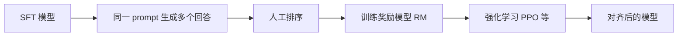
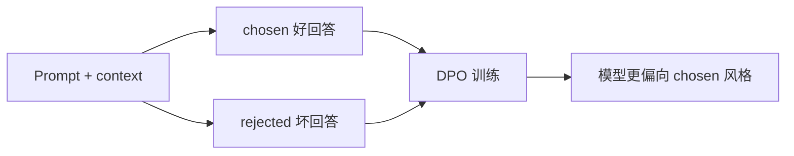
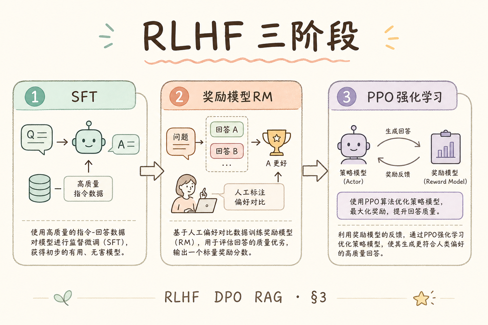
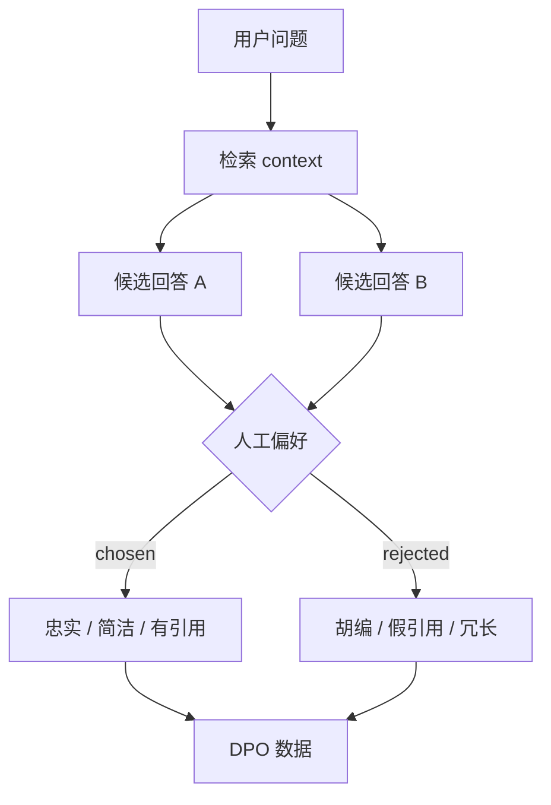
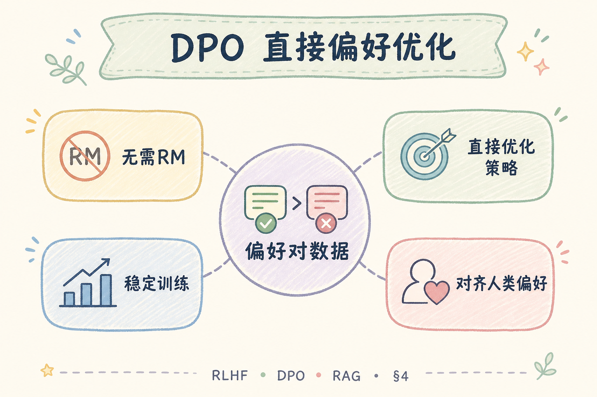
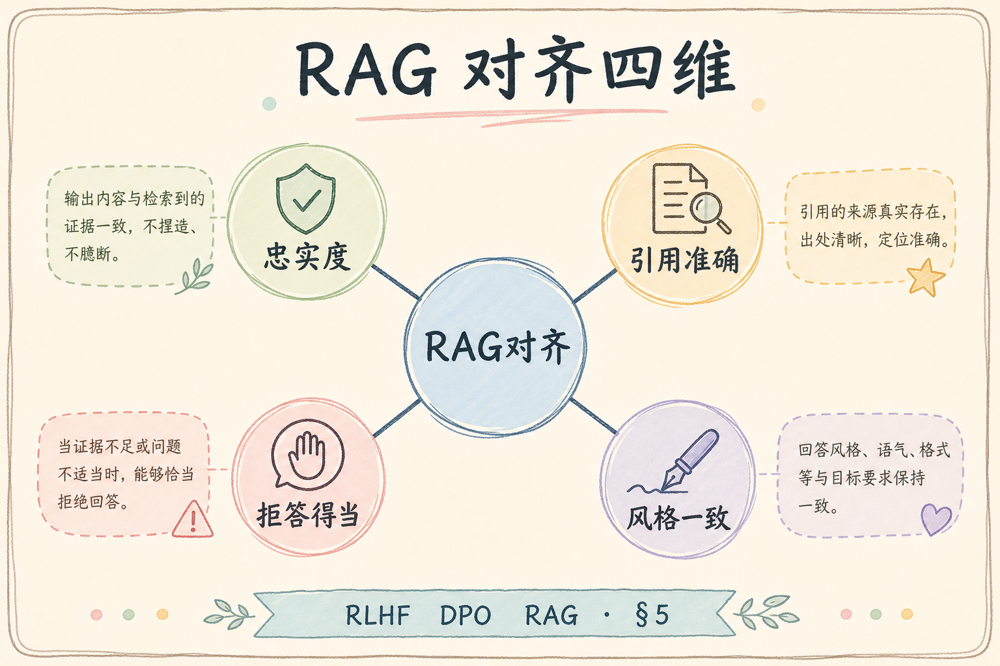
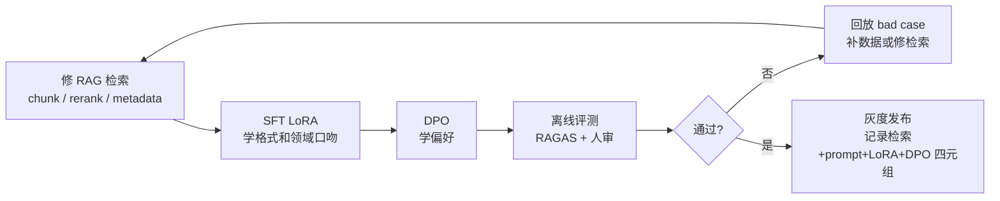

# H 进阶方向（十五 · 收官）：RLHF / DPO 与 RAG 对齐完全指南（了解）

> [212 LoRA](212.lora-domain-qa-tutorial.md) 让模型学会领域格式和口吻；RLHF / DPO 进一步处理“两个答案都能说，哪个更符合人类偏好”。这篇作为 H 模块收官，重点解释 RLHF、DPO 是什么，解决什么问题，怎么和 RAG、LoRA、评测形成闭环。

---

## 目录

1. [为什么 SFT 之后还需要偏好对齐](#1-为什么-sft-之后还需要偏好对齐)
2. [RLHF 是什么](#2-rlhf-是什么)
3. [DPO 是什么](#3-dpo-是什么)
4. [RAG 场景要对齐什么](#4-rag-场景要对齐什么)
5. [偏好数据怎么构造](#5-偏好数据怎么构造)
6. [怎么和 LoRA、RAG、评测闭环](#6-怎么和-lorarag评测闭环)
7. [最小 DPO PoC](#7-最小-dpo-poc)
8. [什么时候不该做](#8-什么时候不该做)
9. [H 模块收官复盘](#9-h-模块收官复盘)
10. [总结](#10-总结)

## 1. 为什么 SFT 之后还需要偏好对齐

SFT 训练模型模仿标准答案，但标准答案只有一个“示范”。现实中，同一个 context 下可能有多个正确回答：有的太长，有的没有引用，有的语气好但事实松，有的简洁且忠实。

偏好对齐解决的问题是：当两个回答都像答案时，让模型更倾向人类认为更好的那个。

| 回答 | 内容 | 问题 |
|------|------|------|
| A | 复制 500 字 context，没结构 | 正确但不可读 |
| B | 80 字总结，带引用 | 更适合产品 |
| C | 语气自然但未引用 | 有合规风险 |

如果只是让模型模仿 A，它会学会啰嗦；如果把 B 标为 chosen，把 A/C 标为 rejected，DPO 才能学到“简洁、忠实、带引用”这种偏好。

## 2. RLHF 是什么

**RLHF**（Reinforcement Learning from Human Feedback，基于人类反馈的强化学习）：先让人类比较多个回答，训练一个奖励模型，再用强化学习让策略模型更容易产生高奖励回答。

通俗说：先训练一个“裁判”，再让模型反复练习拿高分。



RLHF 强大，但工程复杂：奖励模型要训练，PPO 要调参，还要控制模型不要偏离基座太远。多数企业 RAG 项目了解原理即可，不会一开始自研完整 RLHF。

## 3. DPO 是什么

**DPO**（Direct Preference Optimization，直接偏好优化）：不用显式训练奖励模型，而是直接用偏好对 `(chosen, rejected)` 优化模型，让 chosen 的概率相对 rejected 更高。

通俗说：RLHF 是“先训练裁判再训练选手”；DPO 是“直接告诉选手哪种答案更好”。



对企业 PoC 来说，DPO 通常比完整 RLHF 更现实。它可以接在 [212 LoRA](212.lora-domain-qa-tutorial.md) 后面，用同一个领域任务继续训练偏好。

| 对比 | RLHF | DPO |
|------|------|-----|
| 组件 | SFT + 奖励模型 + RL | SFT + 偏好对 |
| 难度 | 高 | 中 |
| 稳定性 | 调参难 | 相对稳 |
| RAG PoC | 少见 | 更常见 |

## 4. RAG 场景要对齐什么

普通聊天模型的偏好可能是礼貌、自然、有帮助。RAG 场景还必须加上“基于证据”。

| 对齐目标 | 好回答 | 坏回答 |
|----------|--------|--------|
| 忠实 | 只根据 context 回答 | context 没有也编 |
| 引用诚实 | 关键事实带引用 | 引用不存在的来源 |
| 简洁 | 只回答用户问题 | 大段复述资料 |
| 拒答 | 资料不足时说明不足 | 用常识补漏洞 |
| 工具纪律 | 需要检索就检索 | Agent 乱调工具 |





关键点：DPO 不能替代检索修复。如果 context 本来就没找对，偏好训练只会让模型更优雅地错。

## 5. 偏好数据怎么构造

偏好样本通常包含 prompt、chosen、rejected。RAG 场景建议把 context、chunk_id、检索参数版本都写进 metadata。



```json
{
  "prompt": "context:\n[1] 一线城市住宿上限 500 元/晚。\n\n用户：一线城市住宿标准？",
  "chosen": "一线城市住宿上限是 500 元/晚。[1]",
  "rejected": "不同城市标准不同，建议咨询 HR。",
  "meta": {
    "chunk_ids": ["policy-2026-017"],
    "retrieval_param_version": "rag-v4"
  }
}
```

数据来源可以有四类：

| 来源 | 说明 | 风险 |
|------|------|------|
| 人工并排标注 | 同一 context 下选更好回答 | 成本高 |
| 日志反馈 | 用户点赞、改写、客服采纳 | 噪声大 |
| bad case 回放 | 把胡编、假引用做 rejected | 覆盖关键风险 |
| 合成 rejected | 人为制造错误答案 | 必须抽检 |

不要只标“更短”。短但漏事实不是好答案。RAG 偏好标注必须同时看忠实、引用、拒答和可读性。

## 6. 怎么和 LoRA、RAG、评测闭环

一个稳妥顺序是：先把 RAG 检索修稳，再做 SFT LoRA，最后才做 DPO。





发布时要记录四元组：检索参数、prompt 版本、LoRA adapter、DPO adapter。因为 DPO 学到的是某个检索分布下的偏好；检索改了，偏好数据可能也要重审。

## 7. 最小 DPO PoC

DPO PoC 不要直接上生产全量流量。建议做一个受控小实验：

| 步骤 | 交付物 |
|------|--------|
| 1 | 固定一套 RAG 参数和 prompt |
| 2 | 从 bad case 中整理 500～1000 对偏好数据 |
| 3 | 在 SFT LoRA 基础上做 DPO |
| 4 | 用保留集评测忠实度、拒答、引用格式 |
| 5 | 小流量灰度，对比 base / sft / dpo |

门禁指标：Faithfulness 不下降，假引用率下降，拒答场景更稳，人工偏好胜率提高。如果只是文风变好但事实变差，不能上线。

## 8. 什么时候不该做

以下情况不适合做 RLHF/DPO：

| 情况 | 应该先做什么 |
|------|--------------|
| 检索经常漏答案 | 修 RAG，别训练 |
| 没有人审资源 | 先做人工评测流程 |
| 偏好标准不一致 | 先写标注规范 |
| 数据少且质量差 | 先积累 bad case |
| 基座模型已足够 | 用 prompt 和评测闭环即可 |

DPO 是锦上添花，不是地基。没有稳定 RAG、没有高质量偏好对、没有回归评测，DPO 只会增加不可控变量。

## 9. H 模块收官复盘

H 模块可以按四条线理解，而不是背标题：

| 线索 | 代表文章 | 解决的问题 |
|------|----------|------------|
| 结构增强 | [199 Graph RAG](199.graph-rag-tutorial.md)、[209 RAPTOR](209.raptor-hierarchical-retrieval-tutorial.md) | 知识组织更复杂 |
| 推理与纠错 | [201 Agentic](201.agentic-rag-tutorial.md)、[204 Self-RAG](204.self-rag-tutorial.md)、[205 CRAG](205.crag-corrective-rag-tutorial.md) | 检索和回答过程可调整 |
| 长文档与多模态 | [207 Map-Reduce](207.map-reduce-summarization-tutorial.md)、[210 多模态](210.multimodal-rag-tutorial.md)、[211 ColPali](211.colpali-rag-tutorial.md) | 资料形态更复杂 |
| 微调与对齐 | [212 LoRA](212.lora-domain-qa-tutorial.md)、本文 | 模型行为更符合业务偏好 |

阶段 6 的验收不是“读完 230 篇标题”，而是能讲一条技术故事线：我做过哪个 RAG Demo，遇到什么坏例，用哪条 H 模块思路扩展，为什么没有滥用更复杂方案。

## 10. 总结

RLHF 和 DPO 解决的是偏好问题：让模型更倾向忠实、简洁、会拒答、有引用的答案。对企业 RAG 来说，DPO 比完整 RLHF 更适合作为 PoC，但它必须建立在稳定检索、清晰标注规范和回归评测之上。

一句话收官：**RAG 先保证答案有依据，LoRA 学领域表达，DPO 学人类偏好；顺序不能反过来。**
