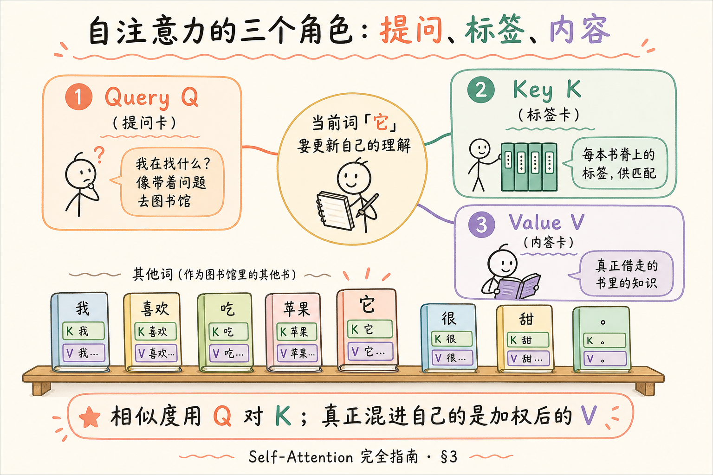
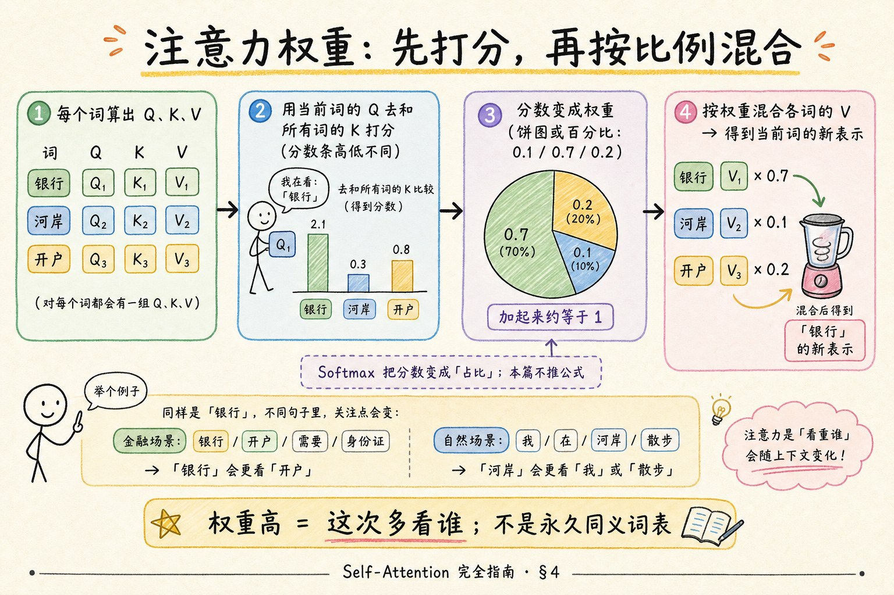
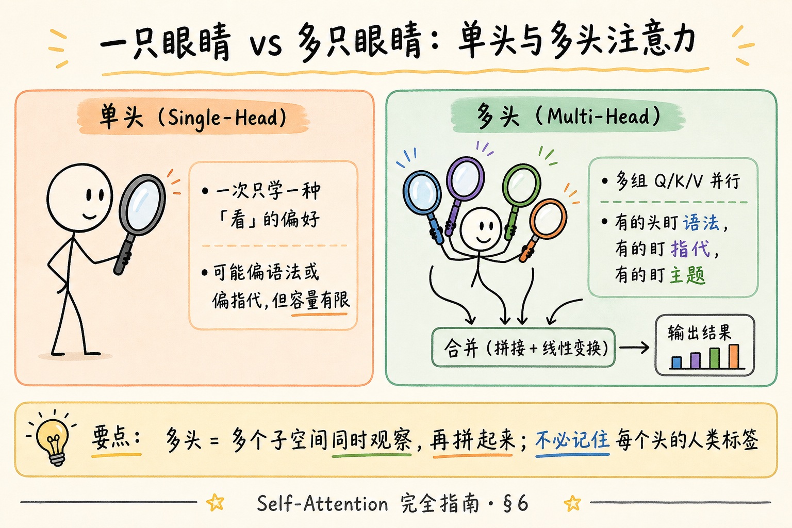
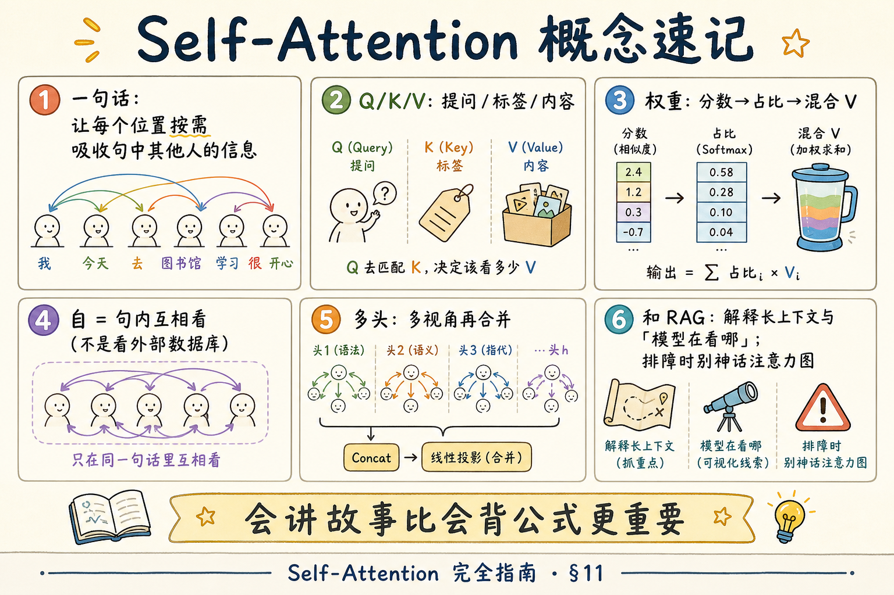

# NLP / IR / LLM 基础（七）：Self-Attention（自注意力）完全指南

> 上一篇 [Transformer 架构](22.transformer-architecture-tutorial.md) 把整栋楼的图纸摊开了：编码器读懂、解码器写出、词可以「互相看」。这篇把显微镜对准那句「互相看」——**Self-Attention（自注意力）**。这是 [企业 RAG 路线图](ENTERPRISE_RAG_ROADMAP.md) **B 轨第七篇**（路线图第 30 条）。目标：用图书馆借书、开会发言的比喻，让你能讲清 **Q / K / V**、**注意力权重**、**多头**；**不要求**你会手推 Softmax 公式。前置第 22 篇。

---

## 目录

1. [前言：模型到底在「看」什么](#1-前言模型到底在看什么)
2. [从「传话」到「点名提问」](#2-从传话到点名提问)
3. [三个角色：Query、Key、Value](#3-三个角色querykeyvalue)
4. [注意力权重：先打分，再按比例混合](#4-注意力权重先打分再按比例混合)
5. [为什么叫「Self」：自己看自己这句](#5-为什么叫self自己看自己这句)
6. [多头注意力：多只眼睛同时看](#6-多头注意力多只眼睛同时看)
7. [编码器、解码器里的注意力有何不同](#7-编码器解码器里的注意力有何不同)
8. [和 RAG、排障的关系](#8-和-rag排障的关系)
9. [什么时候不必深挖](#9-什么时候不必深挖)
10. [最小代码：用矩阵直觉走一遍（可选）](#10-最小代码用矩阵直觉走一遍可选)
11. [综合概念地图](#11-综合概念地图)
12. [常见陷阱与 FAQ](#12-常见陷阱与-faq)
13. [总结与系列下一步](#13-总结与系列下一步)

---

## 1. 前言：模型到底在「看」什么

读到「银行」两个字，人会下意识问：这是 **金融机构**，还是 **河岸**？你靠的是 **前后文**——「去银行开户」和「河岸边的银行」会激活不同理解。

Transformer 层里，每个位置也在做类似的事：不是查一本固定词典（那是 Word2Vec 静态表），而是 **看看这句话里其他人**，决定这次更新自己时，该多吸收谁的信息。

**Self-Attention**（自注意力）：一种让序列中 **每个位置** 根据与其他位置的相关性，**加权混合** 他人信息，从而得到新表示的机制。  
通俗说：开小组会时，每个人发言前先扫一眼全场——谁和我话题相关，我就多听谁几句，再整理成自己的新理解。

**读完本文，你应该能做到：**

1. 用「提问卡 / 书脊标签 / 书里内容」解释 Q、K、V。  
2. 说明注意力权重「先打分再变成占比」的直觉，并举例多义词。  
3. 解释「Self」指句内互相看，不是去外挂数据库检索。  
4. 说出多头注意力「多视角再合并」的目的。  
5. 区分编码器自注意力与解码器里「不能偷看未来」的约束（直觉级）。  
6. 说明注意力可视化 **不能** 当成 RAG 引用溯源的替代品。

**前置**：[22 Transformer](22.transformer-architecture-tutorial.md)、[21 Word2Vec](21.word2vec-static-embeddings-tutorial.md)。  
**环境**：概念为主；§10 可选 Python 3.10+、`numpy`（无 GPU）。  
**本文边界（地基篇）**：讲清自注意力 **故事与数据流**；**不讲** 完整反向传播、FlashAttention 内核、稀疏注意力变体证明。公式只保留「分数 → 占比 → 加权和」三步口头版。

### 1.1 和前后篇分工

| 篇章 | 回答的问题 |
|------|------------|
| [22 Transformer](22.transformer-architecture-tutorial.md) | 整栋楼：编解码、家族 |
| **本篇** | 核心零件：如何「互相看」 |
| 路线图 31 | 预训练时注意力在学什么任务 |
| 路线图 32～33 | 句向量与相似度（检索侧） |
| 路线图 35 | 上下文窗口与注意力代价直觉 |

---

## 2. 从「传话」到「点名提问」

回顾第 22 篇：RNN 像传话——信息必须一站站传。自注意力更像：

1. 每个人手里有自己的笔记（当前词的向量）；  
2. 想更新笔记时，向全场 **提问**：「谁有我需要的信息？」；  
3. 根据匹配程度，按比例 **抄** 别人笔记里的内容；  
4. 写成自己的新笔记，交给下一层。

这样，句首和句尾也可以 **直接对话**，不必经过中间十几个传话人。

> **严格结论**：自注意力让任意两个位置之间存在一条「可直接交互」的路径；是否真学到有用依赖，取决于训练数据与目标。类比只负责直觉。

---

## 3. 三个角色：Query、Key、Value

初学者最容易被三个英文字母吓住。先记住：**同一套词向量，被乘上不同的「变换」后，扮演三个角色**——不是三份无关魔法。

**Query（Q，查询）**：当前词发出的 **提问**。  
通俗说：我带着问题去图书馆——「我在找和账户、利率相关的内容」。

**Key（K，键）**：每个词对外展示的 **标签 / 书脊摘要**，用来和提问匹配。  
通俗说：每本书脊上的分类号，方便你扫一眼决定要不要打开。

**Value（V，值）**：匹配成功后，真正借走、混进自己笔记的 **内容**。  
通俗说：书里面的正文——标签只负责「找得到」，内容才负责「学到东西」。

为什么拆成三个？因为「用来匹配的特征」和「真正要吸收的信息」可以不一样——就像书脊分类和书内细节分工。

读下图时，盯住三角色：**Q 提问、K 标签、V 内容**；中心是正在更新的那个词。




对照上图：相似度发生在 **Q 对 K**；真正写进新表示的是 **加权后的 V**。面试若只说「注意力就是相似度」而不提 V，会少半截。

### 3.1 一张表消歧

| 符号 | 英文 | 角色 | 常见误解 |
|------|------|------|----------|
| Q | Query | 我在找什么 | 不是 SQL 查询语句 |
| K | Key | 供匹配的标签 | 不是键盘 key，也不是 API Key |
| V | Value | 被混合的内容 | 不是「价值观 value」 |

---

## 4. 注意力权重：先打分，再按比例混合

对「当前词」来说，流程可以记成三步（口头版）：

1. **打分**：用我的 Q，去和句中每个词的 K 算一个分数（常见是点积一类相似度）。分数高 =「标签更对得上我的问题」。  
2. **变成占比**：把一串分数压成 **加起来约为 1** 的权重（这一步常叫 Softmax）。  
   **Softmax**：把任意实数分数变成正数占比的常用函数。  
   通俗说：把「谁更相关」的原始分，收成「注意力预算怎么分」的百分比。  
3. **混合**：用这些权重，对各个词的 V 做 **加权平均**，得到我的新向量。

读下图时看四步流水线，以及「银行」在金融句里权重偏向「开户」的例子。




对照上图：**权重高 = 这一次多看谁**，不是永久把两词焊成同义词。换一句上下文，权重分布会变——这正是相对 Word2Vec 静态表的优势。

### 4.1 和「检索」别混

| | 自注意力 | RAG 向量检索 |
|--|----------|--------------|
| 看哪里 | **当前输入序列内部** | 外部知识库 / 向量库 |
| 结果 | 更新每个 token 的表示 | 找出相关 chunk 文本 |
| 你是否直接控制 | 模型内部，通常不手调 | 你选模型、top-k、阈值 |

有人把注意力热力图当成「引用了哪段资料」——**不够**。RAG 的引用应来自你检索并注入提示词的 chunk，而不是内部注意力图。

---

## 5. 为什么叫「Self」：自己看自己这句

**Self** 强调：注意力的对象是 **同一序列内部** 的位置（自己这句/这段），而不是另一个外部序列。

相对地，翻译里解码器还会做 **交叉注意力**（cross-attention）：解码器位置去看 **编码器** 输出——那是「看另一边」，不是 self。

白话对照：

- Self-Attention：小组内部讨论  
- Cross-Attention：写作组回头问阅读组「原文怎么说的」

本篇标题是 Self-Attention，交叉注意力知道存在即可。

---

## 6. 多头注意力：多只眼睛同时看

如果只有一组 Q/K/V，模型一次主要学一种「看的偏好」。语言关系却很多：主谓搭配、指代（「它」指谁）、主题相关、标点结构……

**多头注意力**（Multi-Head Attention）：并行使用 **多组** Q/K/V（多个「头」），每组在稍有不同的子空间里做注意力，再把结果拼起来（或再投影合并）。  
通俗说：开会时不只有一只眼睛——有人盯语法，有人盯指代，有人盯主题，最后汇总纪要。

读下图时对比「一只放大镜」和「多色放大镜」。




对照上图：你 **不必** 给每个头起人类可解释的名字；研究里有时能观察到分工，但工程上把它当成「提高表达能力的并行子模块」即可。

---

## 7. 编码器、解码器里的注意力有何不同

### 7.1 编码器：通常可看全句

编码器做理解时，位置往往可以 **双向** 看左右上下文（具体掩码依模型而定）。适合「填空、分类、句向量」等需要整句信息的任务。

### 7.2 解码器：生成时不能偷看未来

GPT 类从左到右写下一个词时，若让当前位置看到 **还没生成的右边**，训练会「作弊」。因此常用 **因果掩码**（causal mask）：只能看自己和左边。

**因果掩码**：一种遮挡规则，禁止注意力看到未来位置。  
通俗说：写作文时不许翻看后页剧透；只能根据已写内容续写。

这能解释：

- 为什么生成是一个 token 一个 token；  
- 为什么「流式输出」和架构习惯匹配。

### 7.3 和第 22 篇的衔接

| 位置 | 常见注意力 | 直觉 |
|------|------------|------|
| 编码器层 | Self（常双向） | 精读 |
| 解码器层 | 掩码 Self +（经典结构里还有）Cross | 续写 + 看原文 |
| 仅解码器 GPT | 掩码 Self | 一直续写 |

---

## 8. 和 RAG、排障的关系

自注意力本身不是 RAG 模块，但影响你怎么理解现象：

1. **长上下文**：序列越长，注意力要处理的位置两两关系越多（朴素实现代价升高）——这与路线图第 35 条上下文窗口、成本相关。  
2. **「模型好像没看见我贴的资料」**：可能是提示词太长被截断、资料放太远、指令冲突等；**不要**第一反应去解读注意力热力图当证据。优先查：是否注入、token 是否超窗、系统提示是否禁止胡编。  
3. **幻觉**：注意力再强，也只在 **已输入的 token** 里混合信息；没检索到的事实，模型可能靠参数记忆瞎编——所以需要 RAG Grounding（后文）。

| 你想解释的现象 | 更相关的杠杆 |
|----------------|--------------|
| 同词不同义 | 自注意力 + 上下文表示 |
| 检索不到文档 | Embedding / BM25 / 分块（不是调注意力头） |
| 生成胡编 | 检索质量、提示词、拒答策略 |
| 延迟与费用 | 上下文长度、模型大小、采样参数 |

---

## 9. 什么时候不必深挖

| 目标 | 建议 |
|------|------|
| 调 API 做 Mini-RAG | 记住 QKV 故事 + 权重混合即可 |
| 面试白板 | 能画「打分→占比→加权 V」+ 多头一句话 |
| 实现高效注意力内核 | 超出本系列；读系统论文 |
| 解释业务引用 | 用检索 chunk 与 UI 引用，不用注意力图冒充 |

---

## 10. 最小代码：用矩阵直觉走一遍（可选）

### 10.1 要不要读

**日常开发可跳过**。若你想确认「加权平均」不是空话，可用下面 **玩具数字** 跑通。这不是真实 Transformer，只演示线性代数形状。

**演示什么**：3 个位置、假 Q/K/V，算出注意力权重并混合。  
**前置**：`pip install numpy`，Python 3.10+。  
**预期**：打印 3×3 权重（每行和约为 1）以及输出向量。

```python
"""玩具自注意力：只有 3 个位置，维度很小，便于打印。"""
import numpy as np

np.set_printoptions(precision=3, suppress=True)

# 假装已经得到每个位置的 Q/K/V（真实模型里由线性层从词向量变来）
Q = np.array([[1.0, 0.0], [0.0, 1.0], [1.0, 1.0]], dtype=float)
K = np.array([[1.0, 0.2], [0.1, 1.0], [0.9, 0.8]], dtype=float)
V = np.array([[10.0, 0.0], [0.0, 10.0], [5.0, 5.0]], dtype=float)

# 1) 打分：Q 与 K 的点积（每个 query 对所有 key）
scores = Q @ K.T
print("原始分数:\n", scores)

# 2) Softmax 成占比（按行）
scores = scores - scores.max(axis=1, keepdims=True)  # 数值稳定小技巧
weights = np.exp(scores)
weights = weights / weights.sum(axis=1, keepdims=True)
print("注意力权重(每行≈1):\n", weights)
print("行和:", weights.sum(axis=1))

# 3) 用权重混合 V
out = weights @ V
print("混合后的新表示:\n", out)
```

代码后解读：每一行权重描述「这个位置把注意力预算分给谁」；`out` 是各行 V 的加权组合。真实模型还有缩放、掩码、多头、残差等，本玩具全部省略。

### 10.2 先错后对

**错：** 以为注意力权重是「模型引用了知识库第几段」。  
**对：** 权重是 **当前前向计算里、序列内部** 的混合系数；知识库引用要靠 RAG 管线显式给出。

**错：** 手动把某两个词的权重改成 1 来「纠正」业务答案。  
**对：** 改分块、改检索、改提示词、换模型；不要幻想在线拧注意力旋钮。

---

## 11. 综合概念地图

读下图前，试着不看稿子说出 Q/K/V 各是什么。再对照补全。




对照上图：会讲故事比会背公式更重要；公式细节留给要改内核的人。

### 11.1 核心概念速记表

| 概念 | 一句话 |
|------|--------|
| Self-Attention | 句内按需加权混合他人信息 |
| Q / K / V | 提问 / 标签 / 内容 |
| 注意力权重 | 分数经 Softmax 得到的占比 |
| Softmax | 把分数收成正数占比 |
| 多头 | 多组视角并行再合并 |
| 因果掩码 | 生成时不许看未来 |
| Cross-Attention | 看另一序列（如编码器输出） |

---

## 12. 常见陷阱与 FAQ

### 12.1 常见陷阱

1. **把 Q/K/V 当成三个无关黑盒名词**  
   纠正：同一来源表示的三种投影角色。

2. **把注意力图当 RAG 引用**  
   纠正：引用看检索 chunk 与提示词。

3. **以为多头=多模型**  
   纠正：同一层里的并行子空间，不是多个独立 ChatGPT。

4. **忽略掩码**  
   纠正：解码器生成有「不能看未来」的硬规则。

5. **被 √d 缩放公式吓退**  
   纠正：那是数值稳定与训练技巧；面试讲清三步流通常够。

### 12.2 FAQ

**Q：Self-Attention 和 Attention 有何区别？**  
A：Attention 是更广的「按相关性加权」思想；Self 特指对象在同一序列内。

**Q：一定要会写 Softmax 吗？**  
A：RAG 全栈日常不必手写；要懂它输出是占比。

**Q：和 Embedding 相似度是一回事吗？**  
A：都用「相近」直觉，但场景不同：句向量检索是 **库外找文档**；自注意力是 **句内混合表示**。

**Q：可视化工具有用吗？**  
A：研究与教学有用；生产排障优先日志、检索分数、提示词内容。

**Q：长文本注意力会怎样？**  
A：朴素实现成本随长度上升快；工程上有多种优化，概念上记住「更长更贵更慢」即可，详见上下文窗口篇。

---

## 13. 总结与系列下一步

1. 自注意力让每个位置 **按需吸收** 句中他人信息。  
2. **Q 提问、K 匹配、V 混合**——三步：打分 → 占比 → 加权和。  
3. **Self** = 看自己这句；交叉注意力看另一边。  
4. **多头** = 多视角；**因果掩码** = 生成不剧透。  
5. RAG 引用与内部注意力图 **不是** 同一件事。

### 13.1 系列下一步

| 目标 | 推荐阅读 |
|------|----------|
| 预训练与微调 | [24 预训练与微调](24.pretrain-finetune-tutorial.md) |
| 句向量 Embedding | [25 Embedding](25.embedding-vector-tutorial.md) |
| 相似度 | [26 相似度](26.similarity-metrics-tutorial.md) |
| 架构总图回顾 | [22 Transformer](22.transformer-architecture-tutorial.md) |

### 13.2 学习目标自检

- [ ] 能用图书馆比喻讲 Q/K/V  
- [ ] 能口述打分→占比→混合  
- [ ] 能解释 Self 与检索的差别  
- [ ] 能说明多头与因果掩码各解决什么  
- [ ] 能拒绝「注意力图 = 引用」的说法  

### 13.3 深度说明

本篇为 **地基篇**：可选 numpy 玩具即可；更厚实战放在 Embedding、上下文窗口、提示词角色等主线篇。

---

> **初学者可能仍困惑的点**  
> - 真实模型里 Q/K/V 是高维矩阵运算，打印出来不可读——正常。  
> - 「头」没有官方中文业务名，不要强行翻译成产品功能。  
> - 有的文章写 Attention Is All You Need，指论文标题，不是说系统里只有注意力、没有别的层。  
> - 下一篇会讲：这么大的网络，旋钮最初如何在海量文本上拧响（预训练），又如何为你的任务微调。
