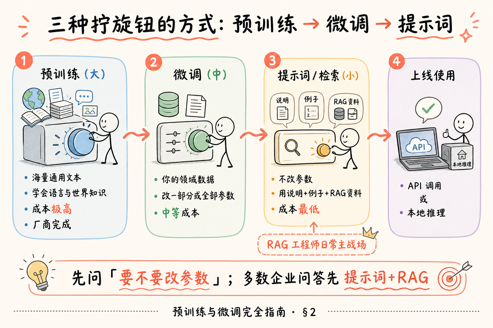
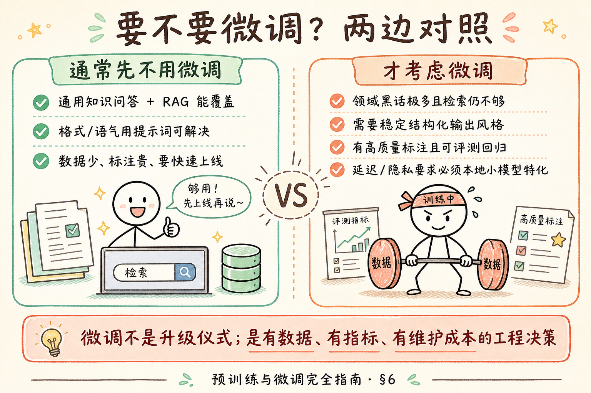
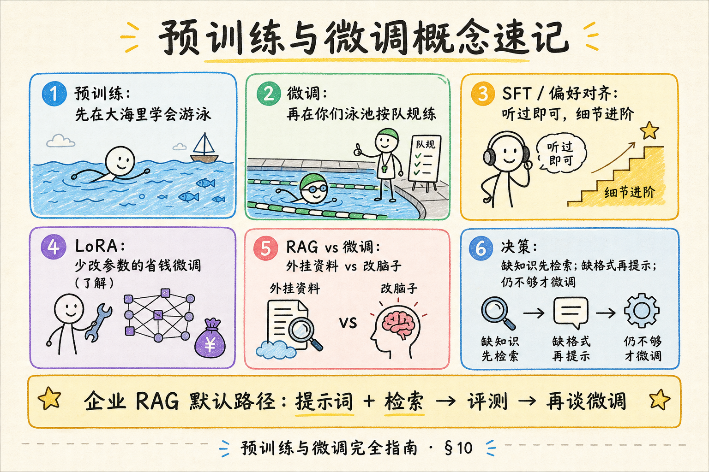

# NLP / IR / LLM 基础（八）：预训练与微调完全指南

> 你已经知道 [Transformer](22.transformer-architecture-tutorial.md) 是图纸、[自注意力](23.self-attention-tutorial.md) 是核心零件。可图纸上的旋钮最初是随机的——**怎么变成会说话的模型？** 又为什么有人说「微调一下」？这篇是 [企业 RAG 路线图](ENTERPRISE_RAG_ROADMAP.md) **B 轨第八篇**（路线图第 31 条）：分清 **预训练、微调、提示词（含 RAG）** 三层杠杆，并明确 **多数企业问答何时不必微调**。

---

## 目录

1. [前言：旋钮从哪来](#1-前言旋钮从哪来)
2. [三层杠杆总览](#2-三层杠杆总览)
3. [预训练：先在大海里学会游泳](#3-预训练先在大海里学会游泳)
4. [微调：再按你们队规加练](#4-微调再按你们队规加练)
5. [提示词与 RAG：不改参数的适配](#5-提示词与-rag不改参数的适配)
6. [要不要微调：决策对照](#6-要不要微调决策对照)
7. [常见名词速通（了解即可）](#7-常见名词速通了解即可)
8. [和路线图的位置](#8-和路线图的位置)
9. [最小示例：同任务三种做法对比](#9-最小示例同任务三种做法对比)
10. [综合概念地图](#10-综合概念地图)
11. [常见陷阱与 FAQ](#11-常见陷阱与-faq)
12. [总结与系列下一步](#12-总结与系列下一步)

---

## 1. 前言：旋钮从哪来

买到一辆车，发动机不是你在停车场用螺丝刀拧出来的——是工厂用巨大产线造的。大语言模型类似：

- **预训练**：工厂阶段，用海量文本把 Transformer 参数拧到「会语言、懂不少常识」；  
- **微调**：4S 店或车队改装，用你的数据再拧一拧，更贴任务；  
- **提示词 / RAG**：不拆发动机，只换导航与备忘录——告诉它今天开去哪、参考哪份文件。

**参数**（parameters）：模型里可学习的数值（权重）。  
通俗说：万亿级「旋钮」；训练就是按数据把旋钮拧到更会完成目标。

**读完本文，你应该能做到：**

1. 用一句话说清预训练与微调的差别。  
2. 画出「预训练 → 微调 → 提示/RAG」成本与改动范围对照。  
3. 判断企业知识库问答何时 **优先 RAG** 而非微调。  
4. 解释为何「微调了仍会幻觉」。  
5. 认识 SFT、对齐、LoRA 等词的 **门牌级** 含义（不要求会训）。  
6. 写出同任务下「只提示 / RAG /（概念上）微调」的取舍理由。

**前置**：第 22～23 篇。  
**环境**：概念为主；§9 需可选 API Key。  
**本文边界（地基篇）**：概念与决策；**不讲** 分布式训练、学习率曲线、完整 LoRA 实操。路线图 229 LoRA、230 RLHF 在进阶区。

---

## 2. 三层杠杆总览

读下图时看从左到右：**谁改参数、谁花钱、RAG 工程师站哪一层**。




对照上图：日常主战场多在第 3 层；第 1 层几乎总是调用厂商或开源社区已训好的底座。

| 杠杆 | 改参数？ | 典型成本 | 谁做 |
|------|----------|----------|------|
| 预训练 | 是（从随机或继续大规模训） | 极高 | 大厂 / 实验室 |
| 微调 | 是（在已有底座上） | 中～高 | 有数据与算力的团队 |
| 提示词 + RAG | 否 | 低～中 | 大多数应用团队 |

---

## 3. 预训练：先在大海里学会游泳

**预训练**（pre-training）：在大规模通用语料上，用自监督目标（如「预测下一个词」「填空」）训练模型，使其获得通用语言能力与广泛知识。  
通俗说：先扔进互联网与书籍的海洋里，学会游泳和认路，还不教「你们公司请假流程」。

常见直觉：

- **自监督**：标签来自文本自身（下一个词就是答案），不必人工逐条标注。  
- **底座模型 / 基座**（base model）：预训练完成后的通用模型，可再微调或直接提示使用。  
- 你调用的 `gpt-*`、`deepseek-*` 等，背后都经历过（或基于）这类阶段。

预训练解决的是：**会说话、会推理一点、知道很多公开世界的事**。  
它 **不保证**：知道你们未公开的制度 PDF、不胡编、输出永远符合你们 JSON 模板。

### 3.1 预训练在学什么（直觉）

不同底座目标略有差别，初学记住两类就够：

| 目标类型 | 白话 | 常见于 |
|----------|------|--------|
| 预测下一个词 | 看到上文，猜后面最可能接什么 | GPT 类解码器 |
| 填空 / 挖空 | 句子挖掉几个词，猜回去 | BERT 类编码器 |

这两种都 **不需要** 人工写「标准答案标签」——答案就在原文里，所以叫自监督。海量重复之后，模型内部表示变得对语法、指代、常见事实更敏感。

### 3.2 你为什么几乎从不自己做预训练

- 数据要清洗到「能吃」的规模与质量，工程量巨大；  
- 算力与电费以「大团队 / 大厂」计；  
- 开源社区与 API 厂商已经把底座训好，你的差异化很少来自「再训一个通用底座」。

对企业 RAG：**选底座** 比 **造底座** 重要一百倍。

---

## 4. 微调：再按你们队规加练

**微调**（fine-tuning）：在预训练好的模型上，用 **更小、更贴任务** 的数据集继续训练，更新部分或全部参数，使行为更符合目标任务。  
通俗说：游泳健将进国家队，按你们项目的动作规范加练。

典型动机：

- 领域术语、文风、固定格式；  
- 特定分类 / 抽取任务；  
- 希望较小模型在窄任务上更稳、更便宜。

### 4.1 微调不能自动消灭的问题

| 问题 | 微调是否够 | 更对症的手段 |
|------|------------|--------------|
| 不知道内部新文档 | 常常不够（知识未写入权重或易过时） | **RAG / 工具查询** |
| 事实过时 | 权重更新慢 | RAG + 文档版本治理 |
| 偶发胡编 | 可减轻但难根除 | 拒答策略、引用、评测 |
| 提示词写得乱 | 不治本 | 提示词工程 |

一句话：**微调改的是「习惯与技能」，RAG 外挂的是「可更新的资料」。**

### 4.2 微调的隐藏成本（写进决策）

初学者容易只看见「效果可能更好」，看不见账单：

1. **数据成本**：谁来写标准问答对？争议答案怎么仲裁？  
2. **评测成本**：没有回归集，微调等于蒙眼改装。  
3. **迭代成本**：业务规则一变，是改文档（RAG）快，还是重新采样再训快？  
4. **平台成本**：训练环境、权限、模型版本管理、回滚。  
5. **风险成本**：过拟合到过时政策；或把错误示范训进权重。

因此面试加分句往往是：「我们评估过微调，但文档周更，所以用 RAG + 提示词，微调留作格式稳定的备选。」

### 4.3 一个小故事串起来

假设你们做「制度问答机器人」：

1. 第 0 周：直接调 Chat API，系统提示写「你是人事助手」——能聊，但常编造不存在的条款。  
2. 第 1 周：上 RAG，把手册切块检索——胡编明显下降，引用可点。  
3. 第 2 周：答案格式仍飘（有时列表、有时散文）——加结构化提示与一两个 few-shot 例子。  
4. 第 3 个月：客服话术要极度统一，且有 2000 条优质问答对——这时才认真评估 SFT/LoRA。

多数团队长期停在第 2～3 步，这很正常，也往往更划算。

---

## 5. 提示词与 RAG：不改参数的适配

**提示词工程**（prompting）：通过系统说明、用户问题、少样本例子等文本，引导模型行为，而不更新权重。  
通俗说：不改发动机，改 **说明书与对话方式**。

**RAG**（检索增强生成）：先检索相关资料，再把资料放进提示词让模型依据它回答。  
通俗说：开卷考试——允许带笔记，而不是把整本笔记背进脑子（微调）。

对企业知识库助手，默认推荐路径往往是：

1. 选合适底座 API；  
2. 写清角色与拒答规则；  
3. 上分块 + 检索 + 引用；  
4. 用评测集迭代；  
5. **仍不够** 再评估微调。

### 5.1 「提示词」到底改了模型什么

严格说：**什么参数都没改**。模型权重文件字节级不变。变的是：

- 这次请求送进上下文窗口的文字；  
- 因而注意力混合到的信息不同；  
- 输出分布随之偏移。

所以提示词很强，但有边界：窗口塞不下、会话结束就忘、无法把整库制度「背进权重」。这也是为什么 RAG 要把 **可更新资料** 每次检索再塞进去，而不是幻想「提示一次就永久学会」。

### 5.2 和「上下文学习」一词

有时资料会写 **in-context learning**（上下文学习）：在提示里给例子，模型当场模仿。  
通俗说：开卷考试时卷子上印了两道例题。  
它属于提示词杠杆，不是微调。Few-shot 篇会展开。

---

## 6. 要不要微调：决策对照

读下图两边标签，对照自己的项目。




对照上图：微调是 **有数据、有指标、有维护成本** 的工程决策，不是「高级感」仪式。

### 6.1 简易决策句式

- 若痛点是「模型不知道我们文档里的规定」→ **先 RAG**。  
- 若痛点是「知道，但格式/语气总飘」→ **先提示词 / 结构化输出**。  
- 若痛点是「窄任务要极稳、可接受训练成本、有标注」→ **再微调**。  
- 若文档周更 → 微调难追上，**RAG 更合适**。

---

## 7. 常见名词速通（了解即可）

章首说明：**日常开发可跳过细节**；面试听过门牌即可。

| 名词 | 白话 |
|------|------|
| **SFT**（Supervised Fine-Tuning，监督微调） | 用「输入→理想输出」对再训一训 |
| **对齐**（alignment） | 让模型更听人话、更安全、更符合偏好（含 RLHF/DPO 等，进阶） |
| **Instruct 模型** | 经过指令微调、更会遵循指令的对话版 |
| **LoRA** | 少改参数的高效微调手法之一（加分了解） |
| **继续预训练**（continual pre-training） | 用领域长文本再做「预测下一词」类训练，偏注入领域语言 |

不必在本篇学会跑通训练脚本。

---

## 8. 和路线图的位置

| 条目 | 关系 |
|------|------|
| 29～30 | 模型 **是什么结构** |
| **31 本篇** | 参数 **怎么来、怎么改** |
| 32 Embedding | 检索向量模型同样有预训练/微调故事 |
| 37～39 | 提示词侧杠杆 |
| C 轨 RAG | 不改生成模型参数的主路径 |
| H 229～230 | LoRA / RLHF 进阶 |

---

## 9. 最小示例：同任务三种做法对比

**场景**：回答「年假怎么请」，标准答案在《员工手册》第 12 页。

### 9.1 做法 A：只提示词（无资料）

**演示什么**：模型可能靠参数记忆瞎编或拒答。  
**前置**：可选 API。  
**预期**：答案可能过时或不含你们公司细则。

```text
系统：你是人事助手。
用户：我们公司年假怎么请？
```

风险：手册未进权重 → **幻觉或空话**。

### 9.2 做法 B：RAG（推荐默认）

```text
系统：只根据【资料】回答；资料没有就说不知道。
资料：《员工手册》§12 ……（检索得到的 chunk）
用户：年假怎么请？
```

优点：资料可更新；可做引用。这是企业 RAG 主路径。

### 9.3 做法 C：微调（概念）

收集大量「问→标准答」对，在底座上 SFT。  
可能让语气更像你们客服，但 **手册一改就要重训或仍需 RAG**。  
本篇不给训练代码——避免初学者误以为「微调=必须作业」。

### 9.4 先错后对

**错：** 「上线前必须微调，不然不像 AI 项目。」  
**对：** 先证明 RAG + 提示词的评测指标；微调是选项不是门票。

---

## 10. 综合概念地图




对照上图：缺知识先检索；缺格式再提示；仍不够才微调。

### 10.1 速记表

| 概念 | 一句话 |
|------|--------|
| 预训练 | 大规模通用训练，得到底座 |
| 微调 | 用任务数据继续改参数 |
| 提示词 | 不改参数，改说明书 |
| RAG | 开卷：外挂可更新资料 |
| Instruct | 更会遵循指令的对话版 |
| LoRA | 省参微调手法（了解） |

---

## 11. 常见陷阱与 FAQ

1. **微调后仍胡编** → 正常可能；加拒答与引用。  
2. **用微调代替文档更新** → 版本灾难。  
3. **混淆 Embedding 微调与 Chat 微调** → 目标不同。  
4. **无评测集就微调** → 无法知道变好还是过拟合。  

**Q：RAG 和微调能一起用吗？**  
A：能。微调改善格式/领域语言，RAG 提供新事实。

**Q：提示词算不算「训练」？**  
A：不算改权重；有时称 in-context learning，但是推理期行为。

**Q：开源模型下载后算预训练完成了吗？**  
A：对你而言是「拿到已预训练（及可能已指令微调）的权重」。

**Q：Embedding 模型也要微调吗？**  
A：多数项目直接用公开/商用句向量模型；领域极特殊且有评测资源时才考虑。细节见下一篇 Embedding。

**Q：提示词里写很多公司制度，算不算一种「训练」？**  
A：那是把资料放进 **上下文窗口**（开卷），权重没变；窗口满了或会话结束，这些字就不再「在模型脑子里」。

**Q：厂商说的「fine-tuned for chat」是什么？**  
A：多半指他们已做过多轮对话/指令微调（甚至对齐），所以更适合当助手，而不是生硬的 base 续写模型。

---

## 12. 总结与系列下一步

1. 预训练造底座；微调改习惯；提示词/RAG 做低成本适配。  
2. 企业知识问答 **默认 RAG**，不是默认微调。  
3. 微调不自动等于「有了最新内部知识」。  
4. 先有评测，再谈改参数。

### 12.1 系列下一步

| 目标 | 阅读 |
|------|------|
| 句向量与 Embedding | [25 Embedding 向量表示](25.embedding-vector-tutorial.md) |
| 提示词角色 | [30 提示词角色](30.prompt-roles-tutorial.md) |
| 架构与注意力回顾 | [22](22.transformer-architecture-tutorial.md) / [23](23.self-attention-tutorial.md) |

### 12.2 自检

- [ ] 能区分三层杠杆  
- [ ] 能说出何时先 RAG  
- [ ] 能解释微调后仍可能幻觉  
- [ ] 认识 SFT / Instruct / LoRA 门牌  

---

> **初学者可能仍困惑的点**  
> - 「对齐」不等于「对齐你们的 PDF」。  
> - Base 与 Chat/Instruct 版本不同，选错 endpoint 会行为怪异。  
> - 微调数据集质量差，会把坏习惯训进去。  
> - 下一篇进入 Embedding：检索侧如何把句子变成向量。
