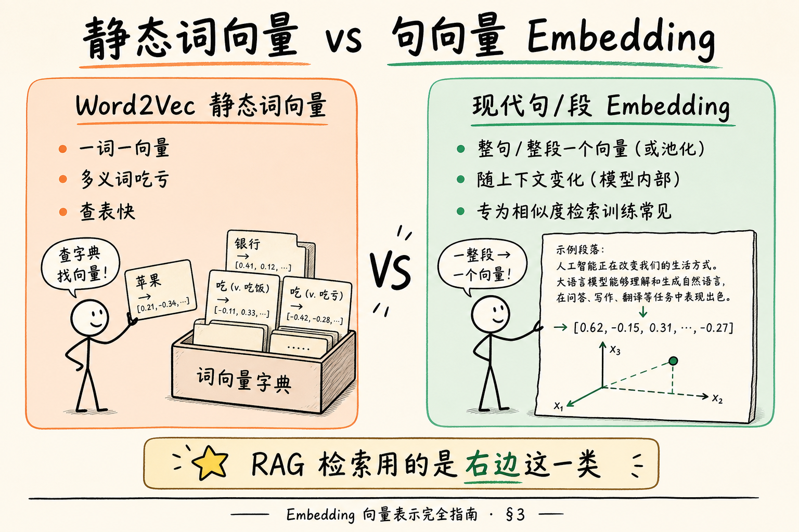
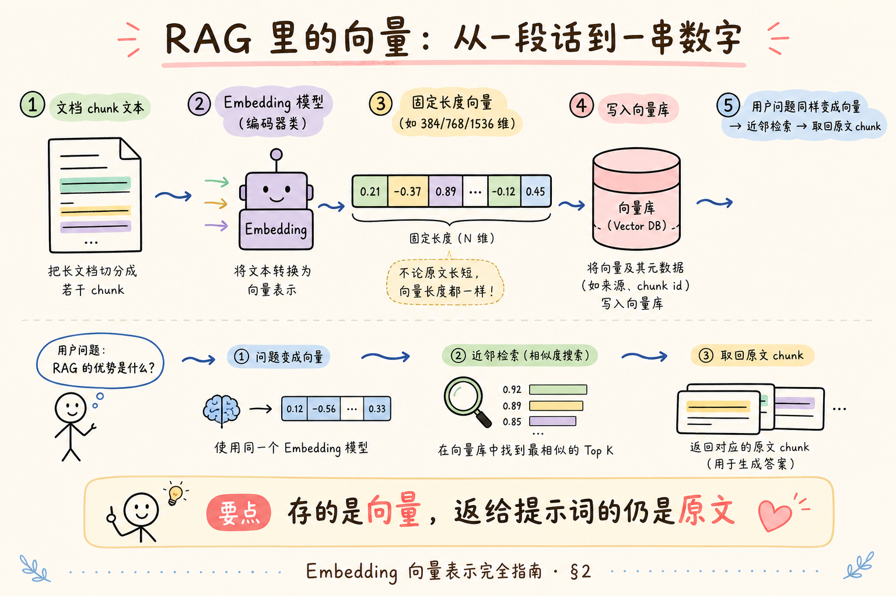
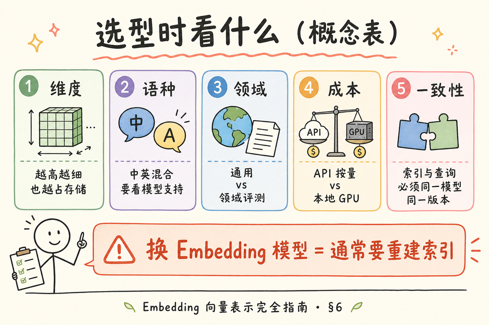
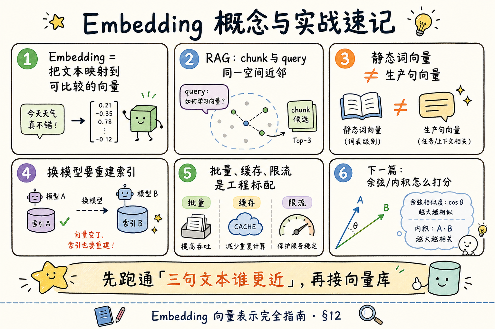

# NLP / IR / LLM 基础（九）：Embedding 向量表示完全指南

> 做 RAG 时，你几乎每天都在说「把文档做成向量再检索」。这个「向量」从哪来？和 [Word2Vec 静态词向量](21.word2vec-static-embeddings-tutorial.md) 是不是一回事？这篇是 [企业 RAG 路线图](ENTERPRISE_RAG_ROADMAP.md) **B 轨第九篇**（路线图第 32 条），定位 **主线篇**：不仅讲清概念，还带你跑通「三句文本谁更近」的最小切片，并给出可粘贴的批量伪流程。前置建议：[22 Transformer](22.transformer-architecture-tutorial.md)、[24 预训练与微调](24.pretrain-finetune-tutorial.md)。

---

## 目录

1. [前言：检索为什么需要「坐标」](#1-前言检索为什么需要坐标)
2. [本文边界与动手路径](#2-本文边界与动手路径)
3. [Embedding 是什么](#3-embedding-是什么)
4. [静态词向量 vs 句/段 Embedding](#4-静态词向量-vs-句段-embedding)
5. [RAG 里向量怎么流动](#5-rag-里向量怎么流动)
6. [维度、模型与「换模型要重建」](#6-维度模型与换模型要重建)
7. [工程要点：批量、缓存、限流](#7-工程要点批量缓存限流)
8. [综合实战：三句文本谁更近](#8-综合实战三句文本谁更近)
9. [综合实战延伸：迷你索引与查询](#9-综合实战延伸迷你索引与查询)
10. [什么时候不必上向量](#10-什么时候不必上向量)
11. [综合概念地图](#11-综合概念地图)
12. [常见陷阱与 FAQ](#12-常见陷阱与-faq)
13. [总结与系列下一步](#13-总结与系列下一步)

---

## 1. 前言：检索为什么需要「坐标」

用户问：「轿车保养周期？」知识库写的是「汽车维护间隔」。关键词对不上时，[BM25](19.bm25-sparse-retrieval-tutorial.md) 可能很弱。若两段话被放进 **同一个语义坐标系**，坐标靠近就能召回——这就是稠密检索的直觉。

**Embedding**（嵌入 / 向量表示）：把离散对象（词、句、段落、图片等）映射到 **固定长度实数向量**，使得「语义相近」的对象在空间里更靠近的表示方法。  
通俗说：给每段文字发一张 **多维坐标卡**，相近意思的卡片住得近。

在 RAG 口语里，「Embedding」常特指：**句/段级向量模型**（以及调用它的 API），而不是 Word2Vec 词表。

为什么企业这么依赖它？因为知识库很少用「用户原话」写成文档。人会换说法、缩写、口语化；制度会用书面语。若只靠关键词重合，召回像碰运气。把「意思接近」变成「坐标接近」，是稠密检索给 RAG 的核心礼物——当然，它也带来成本、重建索引、与稀疏检索如何融合等新问题。本篇先把礼物拆开看清楚。

**读完本文，你应该能做到：**

1. 说明 Embedding 在 RAG 中的输入输出（文本 → 向量 → 近邻 → 原文）。  
2. 区分静态词向量与现代句向量。  
3. 解释为何换 Embedding 模型通常要 **重建索引**。  
4. 列出维度、语种、成本、一致性等选型维度。  
5. 跑通「三句文本相似度」最小脚本（有 Key）或读懂其数据流（无 Key）。  
6. 判断何时先用 BM25、何时上向量。

---

## 2. 本文边界与动手路径

**档位：主线篇。**

**本文讲：** 句/段 Embedding 概念、RAG 数据流、选型与工程注意、最小可运行切片。  
**本文不讲：** 向量库 ANN 细节（C4）、BGE 全系列横向评测报告、Embedding 微调训练（进阶）、多模态 ColPali。

### 2.1 动手路径表

| 步骤 | 你做什么 | 验收 |
|------|----------|------|
| A | 读 §3～§5，能画「文本→向量→检索→原文」 | 白板能讲 |
| B | 跑 §8 三句相似度（或跟读输出） | 打印出谁更近 |
| C | 跟读 §9 迷你索引 | 理解「存向量、返原文」 |
| D | 对照 §10 决定项目是否先 BM25 | 写出理由 |

**环境：** Python 3.10+；`pip install openai numpy`；`OPENAI_API_KEY` 或兼容网关。无 Key 时把 §8 当阅读材料。

### 2.2 沿用前文

| 概念 | 来自 |
|------|------|
| 稠密 vs 稀疏 | [21 Word2Vec](21.word2vec-static-embeddings-tutorial.md)、[18 TF-IDF](18.tfidf-principles-tutorial.md) |
| 编码器家族 | [22 Transformer](22.transformer-architecture-tutorial.md) |
| 底座来自预训练 | [24 预训练与微调](24.pretrain-finetune-tutorial.md) |

---

## 3. Embedding 是什么

再钉一次定义，避免和「聊天模型」混：

| | Chat / 生成模型 | Embedding 模型 |
|--|-----------------|----------------|
| 输出 | 文本（或 token 流） | **一串浮点数** |
| 典型用途 | 写答案 | 算相似度、检索 |
| API | `chat.completions` | `embeddings.create` 一类 |

同一家厂商常同时提供两者——**endpoint 不同，别混用**。

### 3.1 再举一个生活类比

把公司知识库想成一座超大图书馆：

- **Embedding 模型** = 编目员：给每本书（每个 chunk）贴一张「主题坐标」；  
- **向量库** = 按坐标排架的特殊书架；  
- **查询** = 把读者问题也做成坐标，去架上找邻居；  
- **Chat 模型** = 咨询台：根据你抽出来的那几页书，组织人话回答。

编目员和咨询台可以是不同供应商、不同模型——只要编目规则（同一 Embedding）前后一致。

### 3.2 「向量」两个字的消歧

中文里「向量」还出现在物理课。这里没有方向箭头的物理力，只是 **一列有序的浮点数**。说「两个向量接近」，在 RAG 里几乎总是指 **相似度分数高**（下一篇讲余弦/内积），不是几何课上的严格平行定义（虽然余弦确实来自夹角直觉）。

---

## 4. 静态词向量 vs 句/段 Embedding

读下图，盯住「一词一向量」和「整段一个向量」。




对照上图：RAG 生产检索用的是 **右边**；左边是历史地基与面试对比素材。

| | Word2Vec | 现代句 Embedding |
|--|----------|------------------|
| 粒度 | 词 | 句 / 段 / chunk |
| 多义 | 弱 | 相对更好（上下文编码） |
| RAG | 很少直接当 chunk 向量 | **主流** |

有人把 chunk 里所有词向量平均当句向量——能跑通玩具，但生产请用 **专门的句向量模型**（对比学习等目标训过）。

---

## 5. RAG 里向量怎么流动

读下图完整链路。




对照上图：**库里存向量是为了找近邻；拼进提示词的仍是原文 chunk**（外加元数据）。千万别把浮点数组直接塞给用户当答案。

索引期：`chunk 文本 → embed → 向量 + 元数据写入库`  
查询期：`问题 → embed → 近邻搜索 → 取回 chunk 文本 → 交给生成模型`

---

## 6. 维度、模型与「换模型要重建」

**向量维度**（dimension）：向量有多少个浮点数。  

通俗说：坐标卡有多少列；常见 384、768、1024、1536 等。

读选型图时，记住珊瑚红强调的那句。



对照上图：**换模型 / 换版本 / 换维度 → 旧向量不可比 → 通常全量重嵌重建索引**。

### 6.1 一致性铁律

查询向量与库内向量必须来自：

- 同一模型名；  
- 同一版本习惯（有的模型区分 query / passage 前缀）；  
- 同一归一化约定（见下一篇相似度）。

否则「近邻」毫无意义。

---

## 7. 工程要点：批量、缓存、限流

| 点 | 为什么 |
|----|--------|
| **Batching（批量）** | 一次送多段文本，摊薄 HTTP 开销 |
| **缓存** | 同一 chunk 未改勿重复计费 |
| **限流与重试** | API 有 QPS；要指数退避 |
| **失败可恢复** | 索引任务状态机（后文后端篇） |
| **文本预处理** | 空白、截断长度与模型上限 |

这些在路线图 C3（78～90）还会展开；本篇先建立「Embedding 不是一次 for 循环随便打」的意识。

### 7.1 文本太长怎么办

句向量模型通常有 **最大输入长度**（按 token 计）。超长 chunk 会被截断或报错。实务建议：

1. 分块阶段就控制 chunk 大小，别把整本 PDF 塞进一次 embed；  
2. 截断时记录「被砍了」，避免静默丢关键段落；  
3. 标题 + 正文前几句有时比正文中段更有检索价值——分块策略后文 C2 展开。

### 7.2 空文本与脏数据

空字符串、纯空白、乱码页眉，也会变成「某个向量」。它们可能污染近邻结果。索引前做最小清洗：去空、去明显页眉页脚、编码统一——与路线图 C1 文本清洗衔接。

---

## 8. 综合实战：三句文本谁更近

### 8.1 阅读顺序

先读完 §3～§5，再跑本节。

**演示什么：** 调用 Embedding API，用余弦相似度比较三句谁更近。  
**前置：** `openai`、`numpy`、API Key。  
**预期：** 「汽车保养」与「轿车维护」更近，「今天天气」更远。

```python
"""最小实战：三句文本的 Embedding 相似度。"""
import os
import numpy as np
from openai import OpenAI

client = OpenAI(api_key=os.environ["OPENAI_API_KEY"])
# 兼容网关示例：
# client = OpenAI(api_key=..., base_url="https://api.deepseek.com")  # 若该网关提供 embedding

MODEL = "text-embedding-3-small"  # 换成你可用的 embedding 模型名
texts = [
    "汽车保养周期是多久？",
    "轿车维护间隔说明",
    "今天天气真好",
]

resp = client.embeddings.create(model=MODEL, input=texts)
vectors = np.array([item.embedding for item in resp.data], dtype=float)

def cosine(a, b):
    return float(np.dot(a, b) / (np.linalg.norm(a) * np.linalg.norm(b)))

print("0 vs 1 (应较近):", round(cosine(vectors[0], vectors[1]), 4))
print("0 vs 2 (应较远):", round(cosine(vectors[0], vectors[2]), 4))
print("维度:", vectors.shape[1])
```

代码后解读：若 0–1 明显高于 0–2，说明模型把「保养/维护」放进了相近区域。具体数值随模型而变，看 **相对大小** 即可。余弦细节见下一篇。

### 8.2 先错后对

**错：** 聊天用 `gpt-4o-mini`，却把同一模型名传给 `embeddings.create`。  
**对：** 使用文档标明的 **embedding 专用模型名**。

**错：** 索引用模型 A，查询用模型 B。  
**对：** 两端锁定同一模型。

---

## 9. 综合实战延伸：迷你索引与查询

**演示什么：** 用字典模拟向量库——存 `(向量, 原文)`，查询时暴力算余弦取 top-1。  
**前置：** 接上节同一 `client` / `MODEL`。  
**预期：** 问「车辆怎么保养」时取回维护相关句子。

```python
# 接续 §8 的 client / MODEL / cosine

corpus = [
    "公司规定：轿车维护间隔为每 5000 公里。",
    "报销需附发票原件。",
    "食堂周三供应牛肉面。",
]

emb = client.embeddings.create(model=MODEL, input=corpus)
index = [
    {"text": t, "vec": np.array(item.embedding, dtype=float)}
    for t, item in zip(corpus, emb.data)
]

query = "车辆保养多久一次？"
qvec = np.array(
    client.embeddings.create(model=MODEL, input=[query]).data[0].embedding,
    dtype=float,
)

ranked = sorted(index, key=lambda row: cosine(qvec, row["vec"]), reverse=True)
print("Top-1:", ranked[0]["text"])
print("分数:", round(cosine(qvec, ranked[0]["vec"]), 4))
```

代码后解读：这就是 RAG 检索的 **最小心脏**——生产中把暴力循环换成 FAISS/Qdrant/pgvector，把 `text` 换成 chunk + 元数据。

### 9.1 自检清单

- [ ] 能说明为何返回的是 `text` 不是向量  
- [ ] 能指出换 MODEL 后旧 `index` 必须重做  
- [ ] 能说出 top-k > 1 时要重排序或混合检索（后文）

### 9.2 从玩具到生产的差距清单

跑通 §8～§9 之后，真实系统还会多出这些「看起来无聊但决定能不能上线」的事：

| 玩具里没有的 | 生产里要有 |
|--------------|------------|
| 三个句子 | 万级～亿级 chunk |
| 内存里 `list` | 向量库 + 备份恢复 |
| 每次现场 embed | 索引任务队列、失败重试 |
| 人人可读全部语料 | 租户隔离与 ACL |
| 只看余弦分数 | 阈值、重排、人工抽检 |
| 单机脚本 | 观测：延迟、错误率、空结果率 |

不必一天做完。正确心态是：**概念心脏已经在你手里**；后面 C 轨是把心脏装进可运维的身体。

### 9.3 和生成模型如何交接

检索结束后，你通常会把 top-k 的 **原文** 格式化进提示词，例如：

```text
【资料1｜源：员工手册｜页：12】
……chunk 原文……
【资料2｜……】
……
请只根据资料回答：……
```

注意：交接物是 **文本**，不是向量。向量只负责「找谁」；「怎么说」交给 Chat 模型与提示词角色（第 30 篇）。

如果你此刻只能记住一件事，请记住这句话：**Embedding 解决的是「找得到」；RAG 的引用与拒答解决的是「说得对、说得可追溯」。** 两者缺一，Demo 可以很炫，企业场景却容易翻车。

---

## 10. 什么时候不必上向量

| 场景 | 建议 |
|------|------|
| 词项匹配已足够（工单号、精确型号） | BM25 / 过滤字段优先 |
| 语料极小、可全文扫 | 先简单关键词 |
| 无 Embedding 预算 | 先稀疏检索做 MVP |
| 需要同义与释义召回 | 上句向量或混合检索 |

向量不是身份象征；**混合检索** 常常是企业默认答案（路线图 C4）。

### 10.1 和稀疏检索怎么分工（再钉一次）

| 信号 | 更吃哪边 |
|------|----------|
| 精确编号、型号、法规条款号 | 稀疏 / 元数据过滤 |
| 同义改写、口语化提问 | 稠密 Embedding |
| 又要精确又要同义 | **混合**（两路召回再融合） |

初学者常见焦虑是「是不是必须一上来就上最贵的 Embedding」。不必。Mini-RAG 可以：先 BM25 跑通产品闭环，再换/加向量，用同一套评测集看召回是否变好。

评测时至少准备二三十个真实问题，人工标「应该命中哪几段」。没有这张小表，你很难判断换模型是进步还是自我感觉良好。

### 10.2 安全与权限提醒

向量库里的邻近结果，仍可能来自 **用户无权看的文档**。Embedding 本身不懂 ACL。  
企业落地必须在检索后（或过滤条件里）做权限裁剪——这是服务层话题，本篇只提醒：**相似 ≠ 可展示**。权限没做，向量检索越准，越可能「精准越权」。上线前把 ACL 当成检索链路的一环，而不是事后补丁。

---

## 11. 综合概念地图




对照上图：先跑通三句谁更近，再接真向量库。

### 11.1 速记表

| 概念 | 一句话 |
|------|--------|
| Embedding | 文本 → 固定长向量 |
| 句向量 | 整句/段一个坐标 |
| 维度 | 向量长度 |
| 一致性 | 索引与查询同模型 |
| 重建索引 | 换模型后的常规动作 |

---

## 12. 常见陷阱与 FAQ

1. **把生成模型当 Embedding**  
2. **混用模型版本**  
3. **超长 chunk 盲目截断不记录**  
4. **相似度高 = 业务可引用**（仍要读原文与权限）  
5. **忽略 query/document 非对称指令**（有的模型要加前缀）

**Q：OpenAI、BGE、E5 怎么选？**  
A：看语种、延迟、成本、私有化；用小评测集比盲听品牌。

**Q：一个文档一个向量还是按 chunk？**  
A：RAG 主流按 chunk；整文档向量难精确定位。

**Q：向量能解密回原文吗？**  
A：一般不能无损还原；但仍可能敏感，库要做权限与审计。

---

## 13. 总结与系列下一步

1. Embedding 把文本放进可比较的坐标空间。  
2. RAG：同模型嵌 chunk 与 query，近邻取 **原文**。  
3. 换模型 ≈ 重建索引。  
4. 先跑通最小相似度，再上向量库与混合检索。

### 13.1 系列下一步

| 目标 | 阅读 |
|------|------|
| 余弦 / 内积 | [26 相似度](26.similarity-metrics-tutorial.md) |
| Token 与窗口 | [27 Token](27.token-counting-billing-tutorial.md)、[28 上下文窗口](28.context-window-tutorial.md) |
| 生产向量化 | 路线图 C3 |

### 13.2 学习目标自检

- [ ] 能画 RAG 向量数据流  
- [ ] 能区分静态词向量与句 Embedding  
- [ ] 能解释重建索引原因  
- [ ] 跑通或跟读 §8～§9  

---

> **初学者可能仍困惑的点**  
> - 「向量相似」≠「可以当答案」；还要生成与引用。  
> - 中文分词质量影响稀疏侧更多；稠密侧仍受截断与模型语种影响。  
> - 本地 `sentence-transformers` 与云 API 只是承载不同，概念相同。  
> - 下一篇专门把「靠近」定义成可算的余弦与内积。
