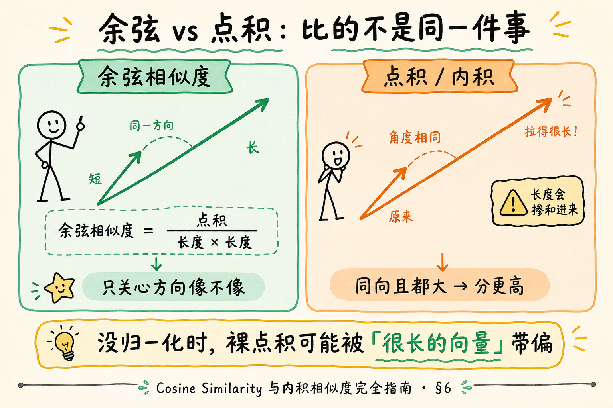
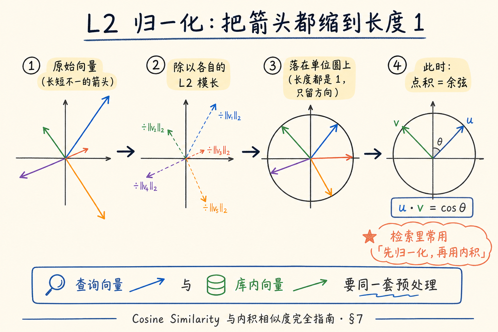
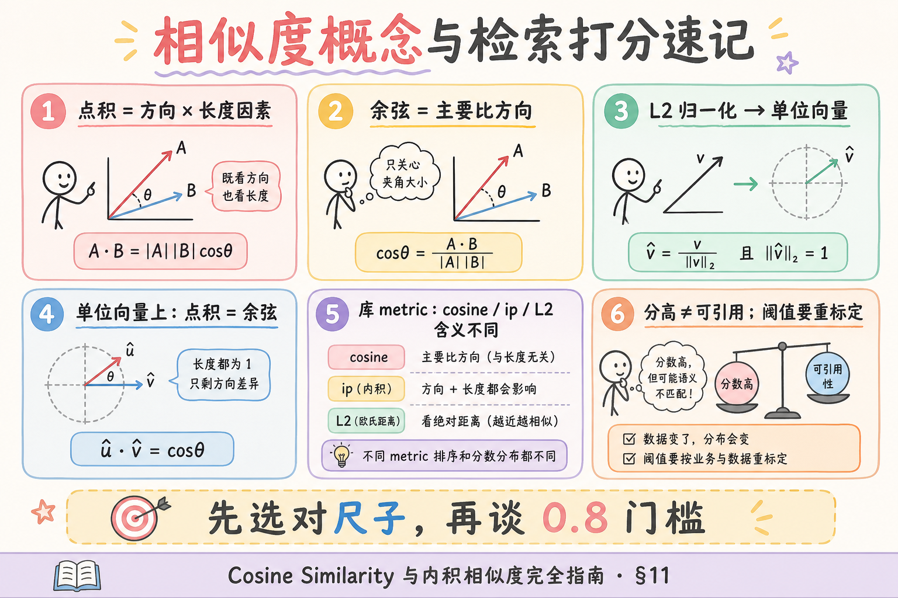

# NLP / IR / LLM 基础（十）：Cosine Similarity 与内积相似度完全指南

> 上一篇 [Embedding 向量表示](25.embedding-vector-tutorial.md) 把文本变成了「坐标卡」，并在最小脚本里用余弦比了三句谁更近。但「靠近」到底怎么算？向量库里写的 `cosine`、`ip`、`dot`、`L2` 又是什么？这篇是 [企业 RAG 路线图](ENTERPRISE_RAG_ROADMAP.md) **B 轨第十篇**（路线图第 33 条），定位 **地基篇**：讲清 **余弦相似度** 与 **内积（点积）** 的直觉、公式级关系、L2 归一化后二者何时等价，以及检索打分时该怎么读分数。前置建议：第 25 篇；可选回顾 [21 Word2Vec](21.word2vec-static-embeddings-tutorial.md) 里「夹角小 = 更相似」的说法。

---

## 目录

1. [前言：分数从哪来](#1-前言分数从哪来)
2. [本文边界与学习目标](#2-本文边界与学习目标)
3. [向量复习：方向、长度、夹角](#3-向量复习方向长度夹角)
4. [点积（内积）：「同向且都大」才高](#4-点积内积同向且都大才高)
5. [余弦相似度：只关心方向](#5-余弦相似度只关心方向)
6. [对照图：余弦 vs 点积](#6-对照图余弦-vs-点积)
7. [L2 归一化：归一化后二者关系](#7-l2-归一化归一化后二者关系)
8. [检索打分直觉：库里的 metric](#8-检索打分直觉库里的-metric)
9. [最小 numpy 示例：先错后对](#9-最小-numpy-示例先错后对)
10. [和 Embedding / RAG 的衔接](#10-和-embedding--rag-的衔接)
11. [综合概念地图](#11-综合概念地图)
12. [常见陷阱与 FAQ](#12-常见陷阱与-faq)
13. [总结与系列下一步](#13-总结与系列下一步)

---

## 1. 前言：分数从哪来

做稠密检索时，你几乎每天都会看到一个数字：`score=0.87`、`distance=0.12`、`ip=42.3`。产品经理问「0.87 算高吗？」工程师答「看模型与度量」。这句话背后，其实是两件不同的事：

1. **Embedding 模型**决定：两段文本落在空间里的位置；  
2. **相似度 / 距离度量**决定：用什么尺子量「近」。

同一对向量，换尺子，数字会变；甚至「越大越好」还是「越小越好」都会反转。若你把「余弦 0.9」和「欧氏距离 0.9」当成同一量级去设阈值，排障会非常痛苦。

典型痛点：

- 文档写「用 cosine」，代码却对未归一化向量做 `np.dot`，排序偶发「看起来对、细看怪」。  
- 换了向量库默认 metric（例如从 cosine 换成 L2），旧阈值全部失效。  
- 面试被问「归一化后 cosine 和内积什么关系」，只记得「差不多」说不清。

本篇把尺子本身讲清楚，让你在读第 25 篇的 `cosine` 函数、以及后续向量库配置时，心里有一张对照表。

---

## 2. 本文边界与学习目标

**档位：地基篇。**

**本文讲：** 点积与余弦的定义与直觉；长度如何干扰点积；L2 归一化后「cosine = 点积」；检索场景如何读分；最小 numpy 可跑示例与先错后对。  
**本文不讲：** FAISS / HNSW 索引结构、ANN 近似误差证明、学习型度量（metric learning）训练、完整线性代数课程。欧氏距离只作对照，不展开推导。

**读完本文，你应该能做到：**

1. 用「方向 + 长度」解释点积分数为什么会被「向量很长」抬高。  
2. 写出余弦公式的口头版：点积除以两范数之积。  
3. 说明 **L2 归一化** 后，余弦与点积数值相等（在同一对单位向量上）。  
4. 在向量库文档里区分 `cosine` / `ip`（inner product）/ `L2`，并知道阈值不可跨 metric 硬搬。  
5. 跑通 §9 的 numpy 示例，指出「只比点积、不归一化」时的反例。  
6. 把「相似度高」与「业务可引用」再次分开（承接第 25 篇）。

**前置**：[25 Embedding](25.embedding-vector-tutorial.md)。  
**环境**：Python 3.10+；`pip install numpy`（无需 API Key）。  
**和前后篇分工：**

| 篇章 | 回答的问题 |
|------|------------|
| [25 Embedding](25.embedding-vector-tutorial.md) | 文本如何变成向量；索引与查询同模型 |
| **本篇** | 两向量如何打成一个「近/远」分数 |
| 路线图 34 | Token 与计费（下一篇） |
| 路线图 C4 | 向量库、混合检索、重排序（生产） |

---

## 3. 向量复习：方向、长度、夹角

把二维平面想成桌面，每个 Embedding 是一支从原点画出的箭头（高维同理，只是画不出来）。

**向量**（vector）：有序的一串实数，可看成空间中的点，或从原点出发的箭头。  
通俗说：坐标卡上的一排数字；方向表示「朝哪边」，长度表示「箭头有多长」。

**范数 / 模长**（norm，常说 L2 范数）：向量的「长度」。二维里就是勾股定理；高维是各分量平方和再开方。  
通俗说：尺子量箭头有多长，不管它指向哪。

**夹角**（angle）：两支箭头之间的角度。夹角小 → 方向接近；夹角接近 90° → 方向不太相关；钝角 → 方向相反倾向。  
通俗说：两个人手指的方向是不是差不多。

在语义检索里，我们通常更关心 **方向是否接近**（语义是否同向），而不是某条向量碰巧特别「长」。很多 Embedding 管线会在入库前做归一化，正是为了让「长度」别搅和进打分。

> **严格结论**：相似度度量是人为选择的比较规则；没有宇宙唯一正确的尺子。工程上选哪把，要与 **模型训练/官方推荐**、**库默认**、**是否归一化** 一致。

---

## 4. 点积（内积）：「同向且都大」才高

**点积 / 内积**（dot product / inner product）：两向量对应分量相乘再求和。二维：`a·b = a1*b1 + a2*b2`。几何上等于 `|a| * |b| * cosθ`。  
通俗说：既看你们指得是否同向（`cosθ`），也看两边箭头有多长（两个模长相乘）。

因此点积有一个对初学者很「坑」的性质：

- 两向量方向完全一样，但其中一个特别长 → 点积可以很大；  
- 两向量方向也很接近，但都很短 → 点积可能偏小。

若你的 Embedding **没有**把长度压到同一尺度，用裸点积排序，可能出现：**「很长但语义一般」压过「短但语义很贴」**——取决于模型输出是否本身已近似单位长度。

**何时点积仍然好用？**

- 模型或管线保证向量已 L2 归一化（此时点积 = 余弦，见 §7）；  
- 某些双塔检索模型训练目标就是内积打分，官方要求用 IP；  
- 你明确需要「幅度」参与（少见于通用句向量 RAG，多见特定训练设定）。

**先错后对（概念）：**

**错：** 「点积越大一定语义越近，和长度无关。」  
**对：** 点积 = 长度 × 长度 × 方向余弦；长度会掺和进来，除非你先归一化或模型已保证单位长。

---

## 5. 余弦相似度：只关心方向

**余弦相似度**（cosine similarity）：两向量夹角余弦值，公式为：

`cos(a, b) = (a · b) / (|a| * |b|)`

取值在理想实数向量下约为 **[-1, 1]**：1 表示同向，0 表示正交倾向，-1 表示反向。句向量实践里，常见分数多落在正区间的某一段，**具体分布随模型而变**，不要背「必须大于 0.8 才算相关」这种万能阈值。

通俗说：先把两支箭头的长度「约掉」，只问「指的方向像不像」。

这正是第 25 篇示例里 `cosine` 函数在做的事：先点积，再除以两范数。它回答的是 **方向相似度**，对「向量整体缩放」不敏感——若把 `a` 乘以 2，余弦不变（分母也变大）。

**和点积的一句话对比：**

| | 点积 | 余弦 |
|--|------|------|
| 是否受长度影响 | 是 | 否（已除以模长） |
| 典型范围 | 无固定上下界（随维度与尺度变） | 约 [-1, 1] |
| 口语 | 「同向且都大」 | 「只看同向」 |

---

## 6. 对照图：余弦 vs 点积

读下图前，先自己猜：两对向量若夹角相同、但一对更「长」，点积和余弦谁会变、谁不变？




对照上图：左边强调「只比方向」的余弦；右边强调「方向 × 长度」的点积。同一夹角下，拉长向量会抬高点积，余弦纹丝不动——这就是检索配置里为什么要问「你们归一化了没有」。

再补一个生活类比：

- **余弦**：两支指南针是否指向同一方位，不管指针画得多粗。  
- **点积**：既看方位，又看你把箭头画得有多夸张。

RAG 里若目标是「语义方向是否接近」，余弦（或等价的「先归一化再点积」）通常更符合直觉。

---

## 7. L2 归一化：归一化后二者关系

**L2 归一化**（L2 normalization）：把向量除以自己的 L2 范数，得到长度为 1 的 **单位向量**。  
通俗说：把箭头缩放到标准长度 1，只保留方向。

对任意非零向量 `a`：

`a_hat = a / |a|`，于是 `|a_hat| = 1`。

若 `a`、`b` 都已 L2 归一化，则：

`a · b = |a| |b| cosθ = 1 * 1 * cosθ = cosθ`

也就是说：**单位向量上，点积数值等于余弦相似度。**

这是工程上极常见的优化与约定：

1. 入库前对 Embedding 做 L2 归一化并持久化；  
2. 查询向量同样归一化；  
3. 向量库用 **内积（IP）** 检索——数学上等价于余弦，计算上往往更省事（少一次除法，且与部分索引实现更搭）。

读下图时，跟着「原始向量 → 除以模长 → 单位圆上的点 → 此时点积=余弦」这条线走。




对照上图：归一化不是「让分数更好看」的美颜滤镜，而是 **统一比较尺度**。若只归一化库内向量、查询忘了归一化（或反过来），等价关系被破坏，排序会 silently 变味。

### 7.1 和「模型已输出单位向量」的关系

有的 Embedding API / 开源模型文档写明：输出已归一化，或建议你自行归一化。实践建议：

- **以官方文档为准**；  
- 不确定时，对一批向量算平均模长：若都非常接近 1，多半已单位化；若模长差异大，裸点积风险更高；  
- 管线里 **显式归一化一次** 往往比「假设已经归一化」更稳（注意：有的库在选 cosine metric 时会再处理一次，避免双重语义混乱——读你用的库的文档）。

### 7.2 欧氏距离（对照，不展开）

**欧氏距离**（Euclidean distance / L2 distance）：两点之间的直线距离。  
通俗说：把向量当点，量两点之间有多远——**越小越近**。

在单位球面上，欧氏距离与余弦存在单调关系（夹角小则距离也小），但 **数值不可与余弦直接比大小**。向量库若默认 L2，你的「0.8 阈值」不能从 cosine 世界原样搬过来。

---

## 8. 检索打分直觉：库里的 metric

打开 Qdrant、Milvus、pgvector、FAISS 一类文档，常看到：

| 名称（常见写法） | 直觉 | 通常「更好」的方向 |
|------------------|------|-------------------|
| `cosine` / Cosine Similarity | 比方向 | 分数 **越大** 越相似 |
| `ip` / Inner Product / Dot | 内积 | 通常 **越大** 越好（在约定一致时） |
| `l2` / Euclidean | 比距离 | 距离 **越小** 越近 |

**打分直觉 checklist：**

1. 先问：这个分数是 similarity 还是 distance？  
2. 再问：向量有没有按该 metric 要求的方式归一化？  
3. 阈值、监控告警、A/B 实验必须绑定 **同一模型 + 同一 metric + 同一预处理**。  
4. 重排序（rerank）模型输出的分数，又是另一套尺子——不要和向量库原始分混在一张「万能 0~1」表里解读。

**先错后对（工程）：**

**错：** 从教程复制 `score > 0.75` 当万能门槛。  
**对：** 用你们自己的小评测集看分数分布，再定阈值；换模型或换 metric 后重标定。

**错：** 以为「cosine 和 ip 配置可以随便互换，反正都是相似度」。  
**对：** 仅当向量已单位化（或库在 cosine 模式下替你处理）时，排序才与「单位向量 + IP」一致；配置必须与数据预处理对齐。

### 8.1 读分时的三个「不要」

1. **不要**把向量库原始分直接展示给终端用户当「可信度百分比」。即使用户爱看进度条，也要先做校准或改成相对排序（第 1 / 第 2），并说明「仅表示检索相关程度」。  
2. **不要**在日志里只存一个名叫 `score` 的浮点，却不存 `metric`、`model`、`normalized` 字段。三个月后你自己都忘了当时用的是 L2 还是 cosine。  
3. **不要**在 A/B 实验里一组用 cosine、一组用 IP，却共用同一套「大于 0.7 才进重排」规则——实验结论会被尺子污染。

### 8.2 和「距离越小越好」混用时的排序代码直觉

伪代码对比：

```text
# 相似度（cosine / 常见 IP）：降序
ranked = sort(candidates, key=score, reverse=True)

# 距离（L2）：升序
ranked = sort(candidates, key=distance, reverse=False)
```

若你从 FAISS 某接口拿到的是距离，却按降序排，top-1 会变成「最远的那个」——这类 bug 在初学者项目里并不罕见。写单测时用两三个手写向量，断言排序方向，比事后猜分数有效。

### 8.3 小评测集：比盯绝对值更重要

准备 20～50 条「问题 → 应召回的 chunk id」即可开始：

- 看 **排序是否把正解排进 top-k**，而不是先纠结绝对分是 0.62 还是 0.71；  
- 换 metric 或是否归一化时，对比 Recall@k 有没有掉；  
- 画直方图看分数是否挤成一团（区分度差）——那是模型/分块问题，不是把阈值小数点后再加一位能解决的。

地基篇做到「会设计这种小实验」就够；完整评测体系属于路线图后部的观测与评测模块。

---

## 9. 最小 numpy 示例：先错后对

### 9.1 阅读顺序

先读完 §4～§7，再跑本节。无需 Embedding API——我们用手写小向量制造「长度陷阱」。

**演示什么：**  
（1）夹角相同、长度不同时，点积变、余弦不变；  
（2）归一化后点积与余弦相等；  
（3）一个「只按点积排序会排错」的迷你反例。

```python
"""相似度地基：点积、余弦、L2 归一化。"""
import numpy as np

def l2_normalize(v: np.ndarray) -> np.ndarray:
    n = np.linalg.norm(v)
    if n == 0:
        raise ValueError("零向量无法归一化")
    return v / n

def dot(a: np.ndarray, b: np.ndarray) -> float:
    return float(np.dot(a, b))

def cosine(a: np.ndarray, b: np.ndarray) -> float:
    return float(np.dot(a, b) / (np.linalg.norm(a) * np.linalg.norm(b)))

# --- 实验 1：同方向，拉长其中一条 ---
a = np.array([1.0, 0.0])
b = np.array([2.0, 0.0])  # 与 a 同向，但更长
c = np.array([1.0, 1.0])  # 另一方向

print("实验1 同向 a vs b")
print("  dot:", round(dot(a, b), 4), "cosine:", round(cosine(a, b), 4))
print("实验1 a vs c")
print("  dot:", round(dot(a, c), 4), "cosine:", round(cosine(a, c), 4))

# --- 实验 2：归一化后点积 == 余弦 ---
a_u, c_u = l2_normalize(a), l2_normalize(c)
print("实验2 归一化后")
print("  dot:", round(dot(a_u, c_u), 4), "cosine:", round(cosine(a_u, c_u), 4))

# --- 实验 3：长度陷阱（检索排序）---
query = np.array([1.0, 0.0])
# doc_long：方向略偏，但很长 → 裸点积可能很高
doc_long = np.array([10.0, 3.0])
# doc_short：方向更贴 query，但很短
doc_short = np.array([1.0, 0.1])

print("实验3 裸点积排序（可能误导）")
print("  q·long:", round(dot(query, doc_long), 4))
print("  q·short:", round(dot(query, doc_short), 4))
print("实验3 余弦排序（更看方向）")
print("  cos long:", round(cosine(query, doc_long), 4))
print("  cos short:", round(cosine(query, doc_short), 4))

# 归一化后再比点积，应与余弦一致
print("实验3 归一化后点积")
q_u = l2_normalize(query)
print("  ip long:", round(dot(q_u, l2_normalize(doc_long)), 4))
print("  ip short:", round(dot(q_u, l2_normalize(doc_short)), 4))
```

代码后解读：

- 实验 1：`a` 与 `b` 余弦为 1，但点积是 2——长度进账了。  
- 实验 2：归一化后两种分数对齐。  
- 实验 3：裸点积可能让 `doc_long` 赢；余弦 / 「双端归一化 + 点积」更站在 `doc_short` 一边（方向更贴）。真实 Embedding 未必如此夸张，但 **机制** 相同。

### 9.2 先错后对（代码）

**错：**

```python
# 以为点积就是余弦
score = np.dot(query_vec, doc_vec)
```

在未归一化、且模型未保证单位长时，这可能不是你以为的「方向分」。

**对：**

```python
score = cosine(query_vec, doc_vec)
# 或
score = np.dot(l2_normalize(query_vec), l2_normalize(doc_vec))
```

**错：** 库内向量归一化了，查询向量直接拿 API 原始输出比 IP，却按「等于余弦」解读。  
**对：** 查询侧做 **同一套** 预处理；或改用库的 cosine 模式并确认其行为。

**错：** 用 `1 - cosine` 当距离后，仍用「越大越好」排序。  
**对：** 改成距离后，排序方向要反转（越小越好），监控图也要改。

### 9.3 接回第 25 篇三句相似度

第 25 篇的 `cosine` 已是本篇推荐路径。若你改成裸 `np.dot`，在 **已单位化** 的模型上可能「看起来差不多」；换一个模长不稳的模型，排序就可能漂移。地基阶段请养成习惯：**显式余弦，或显式双端 L2 + 点积**。

---

## 10. 和 Embedding / RAG 的衔接

把尺子放回 RAG 链路：

1. **索引期**：chunk → Embedding →（可选 L2 归一化）→ 写入向量库（记下 metric）。  
2. **查询期**：问题 → 同一模型 Embedding → 同一预处理 → 近邻搜索 → 得到分数 + 原文。  
3. **生成期**：把原文 chunk 塞进提示词——**用户看到的不是分数**，分数只服务于召回与调试。

相似度解决的是「谁先被捞上来」；不解决「捞上来的是否允许给这个用户看」「是否事实正确」。权限、引用、幻觉，仍是后文话题。

**与稀疏检索分数：** BM25 分和余弦分 **不可比**。混合检索常分别召回再融合（如 RRF），而不是把两套分加在一个没有校准的公式里硬加——细节留待 C4。

**与自注意力里的「打分」：** [23 Self-Attention](23.self-attention-tutorial.md) 里 Q·K 也是点积家族，但那是 **句内混合表示**；本篇是 **库外找文档**。都叫「相似度直觉」，场景不同。

### 10.1 一张「排障决策」口头流程

当线上出现「明明相关却排很后」：

1. 确认索引与查询是否 **同一 Embedding 模型**（第 25 篇铁律）；  
2. 确认两端是否 **同一归一化与同一 metric**（本篇）；  
3. 打印 top-5 的原文——是不是分块切碎了关键句，导致向量「方向」漂走；  
4. 再用稀疏检索（BM25）对照：若关键词能命中、向量不能，考虑混合检索，而不是先怀疑余弦公式写错。

当线上出现「不相关却分很高」：

1. 看是否 chunk 过短、套话过多，大家挤在同一语义团里；  
2. 看是否查询太短（两三个字），方向不稳定；  
3. 看阈值是否从别的模型教程抄来；  
4. 需要时上重排模型——它吃的是「查询 + 候选原文」，不是只吃向量分。

### 10.2 为什么面试爱问「归一化后呢」

因为这句话能同时检查：

- 你是否真懂余弦公式里除以模长的含义；  
- 你是否知道工程上 IP 检索的常见前提；  
- 你是否会把「数学等价」和「配置没对齐」区分开。

答到「两边都单位化后点积等于余弦；所以许多系统先 normalize 再内积」就扎实。再补一句「没归一化时点积含长度，可能误导排序」，基本就过关。

---

## 11. 综合概念地图

读下图前，试着用一句话区分：点积、余弦、L2 归一化、检索 metric。




对照上图：先选对尺子，再谈阈值；归一化是连接「余弦」与「内积检索」的桥梁。

### 11.1 核心概念速记表

| 概念 | 一句话 |
|------|--------|
| 点积 / 内积 | 同向且都大 → 分高；含长度 |
| 余弦相似度 | 只比方向；约 [-1, 1] |
| L2 范数 | 向量有多长 |
| L2 归一化 | 压成单位长，只留方向 |
| 单位向量上 | 点积 = 余弦 |
| metric | 库用的比较规则；阈值绑定它 |
| 距离 vs 相似 | 越小越好 vs 越大越好，别混 |

### 11.2 三十秒口述稿（面试用）

> Embedding 把文本放进向量空间。比远近常用余弦，只看方向。点积还乘了长度，没归一化时可能被长向量带偏。两边都 L2 归一化后，点积就等于余弦，所以很多库用 IP 做检索。换模型或换 metric 要重标定阈值；分高不等于可引用。

---

## 12. 常见陷阱与 FAQ

### 12.1 常见陷阱

1. **把任意「score」都当成 0~1 余弦**  
   纠正：先读 metric 与文档；IP/L2 的数值尺度完全不同。

2. **只归一化一端**  
   纠正：查询与文档同一约定；画数据流时把「normalize」画成双方对称步骤。

3. **跨模型比较绝对分数**  
   纠正：模型 A 的 0.6 与模型 B 的 0.6 不是同一回事。

4. **用余弦公式却忘了零向量**  
   纠正：范数为 0 会除零；空文本 / 异常输出要拦截。

5. **相似度当权限或当答案**  
   纠正：承接第 25 篇——近邻只是候选，还要读原文、鉴权、生成与引用。

6. **负分一定「语义相反」就业务丢弃**  
   纠正：有的模型分数分布很少出现强负值；解释要结合模型，不要文学化过度。

### 12.2 FAQ

**Q：生产环境到底用 cosine 还是 ip？**  
A：看模型与向量库推荐。若已 L2 归一化，二者排序常一致；配置与预处理必须匹配，比纠结名字更重要。

**Q：为什么我的余弦全是 0.7x，区分度很差？**  
A：可能是模型、文本域、chunk 过短/过长、或「什么都有点像」。先做评测集看相对排序，再考虑换模型、改分块、加稀疏/重排——不是先把阈值从 0.75 调到 0.751。

**Q：维度越高余弦是不是自然越小？**  
A：高维几何有些反直觉现象，但实务上更关键的是 **模型训练方式** 与 **是否归一化**。不要用「维度神话」替代评测。

**Q：和 Word2Vec 里的余弦是一回事吗？**  
A：公式同一家族；对象从「词向量」换成了「句/段向量」。静态词向量的多义词问题，不会因为换了余弦公式而消失。

**Q：必须手写 numpy 吗？**  
A：库通常内置 metric。手写是为了建立直觉，避免黑盒配置抄错。

**Q：下一篇为什么突然讲 Token？**  
A：你会把检索到的 chunk 塞进提示词——那要占上下文、要花钱。相似度解决「捞谁」，Token 解决「塞得下吗、多少钱」。

---

## 13. 总结与系列下一步

1. **点积**关心「同向且都大」；**余弦**主要关心「同向」。  
2. **L2 归一化**后，单位向量上 **点积 = 余弦**——这是检索里 IP 与 cosine 能对齐的关键桥梁。  
3. 向量库 metric 决定分数含义与排序方向；**阈值不可盲搬**。  
4. 最小示例请亲自跑一遍「长度陷阱」，形成肌肉记忆。  
5. 分高只说明「向量近」，不自动等于「答案对、可展示」。

### 13.1 系列下一步

| 目标 | 阅读 |
|------|------|
| 回顾向量从哪来 | [25 Embedding](25.embedding-vector-tutorial.md) |
| Token 计数与计费 | 路线图 **34** → [27 Token 计数与计费](27.token-counting-billing-tutorial.md) |
| 上下文窗口 | [28 Context Window](28.context-window-tutorial.md) |
| 生产向量库与混合检索 | 路线图 C4 |

### 13.2 学习目标自检

- [ ] 能口述点积与余弦的差别（是否含长度）  
- [ ] 能说明归一化后二者关系  
- [ ] 能解释库里 cosine / ip / l2 的「越大/越小越好」  
- [ ] 跑通 §9，并能指出裸点积的反例  
- [ ] 能拒绝「万能相似度阈值」  

### 13.3 深度说明

本篇为 **地基篇**：公式停留在可口述、可 numpy 验证的层级。ANN 性能、量化、GPU 检索等留给向量库专题。你若已能把第 25 篇的三句相似度与本篇尺子对齐，B 轨「表示 → 比较」这一环就闭合了。

---

> **初学者可能仍困惑的点**  
> - 屏幕上的 `0.83` 没有宇宙含义，只有「在当前模型+度量下的相对位置」。  
> - 「内积」在数学课与向量库文档里是同一家族，但实现细节（是否隐式归一化）要以你用的引擎为准。  
> - 二维箭头图只是直觉；真实 Embedding 是成百上千维——道理相同，无法目视。  
> - 下一篇会离开「向量有多近」，转向「提示词有多长、账单怎么算」——RAG 成本意识的起点。
