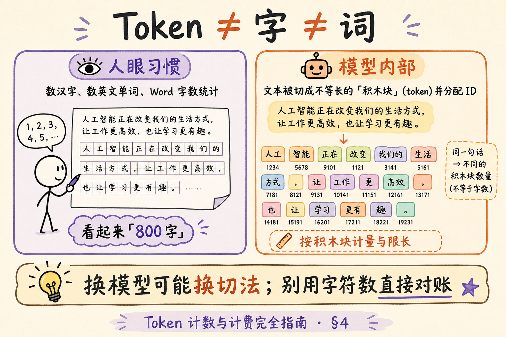
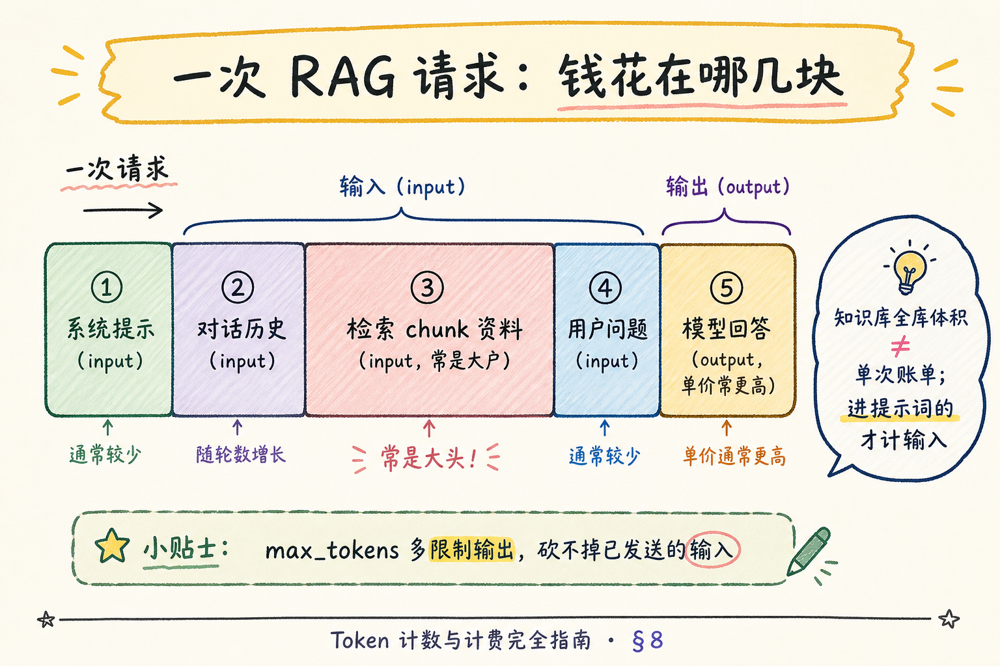
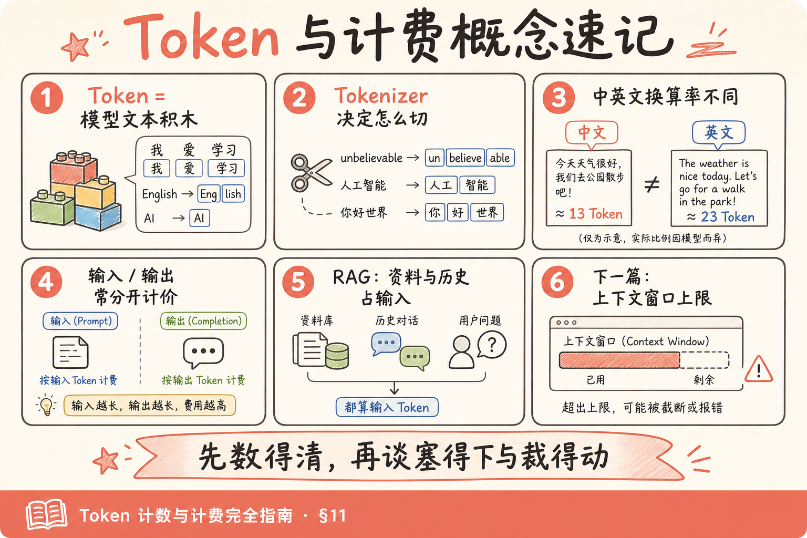

# NLP / IR / LLM 基础（十一）：Token 计数与计费完全指南

> 你已经会把文本变成 [Embedding 向量](25.embedding-vector-tutorial.md)，也会用 [余弦 / 内积](26.similarity-metrics-tutorial.md) 比较谁更近。下一步把检索到的 chunk 塞进大模型提示词时，账单与报错往往来自同一个词：**Token**。这篇是 [企业 RAG 路线图](ENTERPRISE_RAG_ROADMAP.md) **B 轨第十一篇**（路线图第 34 条），定位 **地基篇**：讲清 Token ≠ 字 ≠ 词、中英文计数直觉、输入/输出分别计费、以及 RAG 里「资料也占额度」。前置：第 25、26 篇；可选回顾 [17 分词](17.nlp-tokenization-basics-tutorial.md) 的「切分」直觉（那是检索词项；本篇是模型子词计费单位）。

---

## 目录

1. [前言：账单上的神秘单位](#1-前言账单上的神秘单位)
2. [本文边界与学习目标](#2-本文边界与学习目标)
3. [Token 是什么：不是字，也不是词](#3-token-是什么不是字也不是词)
4. [对照图：Token ≠ 字符](#4-对照图token--字符)
5. [中英文差异直觉](#5-中英文差异直觉)
6. [输入 / 输出分别计费](#6-输入--输出分别计费)
7. [RAG：资料、历史、系统提示都占 Token](#7-rag资料历史系统提示都占-token)
8. [计费拆解图与粗算](#8-计费拆解图与粗算)
9. [可选实操：tiktoken 或纯说明](#9-可选实操tiktoken-或纯说明)
10. [和上下文窗口的预告](#10-和上下文窗口的预告)
11. [综合概念地图](#11-综合概念地图)
12. [常见陷阱与 FAQ](#12-常见陷阱与-faq)
13. [总结与系列下一步](#13-总结与系列下一步)

---

## 1. 前言：账单上的神秘单位

产品上线第一周，常见三种惊吓：

1. **报错**：`context_length_exceeded` / 「超过最大上下文」——明明「字数看起来还行」。  
2. **账单**：同样「聊了几句」，费用比预期高一个数量级——因为每次请求都带了长系统提示 + 多段检索资料 + 历史轮次。  
3. **误解**：运营按「汉字个数 × 单价」估算成本，和财务对不上。

根因通常不是「模型黑心」，而是计量单位搞错了。大模型 API 几乎普遍按 **Token** 计费与限长，而 Token **不是** 中文的「一个字」、也 **不是** 英文的「一个单词」那么整齐。

本篇建立正确心智模型：先会估、会拆账单，再在下一篇（上下文窗口）里谈「塞不下时怎么砍」。

---

## 2. 本文边界与学习目标

**档位：地基篇。**

**本文讲：** Token 定义与直觉；与字/词的差异；中英文粗算经验；input / output 分计；RAG 场景下各部分如何占额度；可选 `tiktoken` 计数或无库纯说明；和窗口限制的衔接预告。  
**本文不讲：** 各家最新价目表精算（价格常变，以官网为准）、BPE 训练细节、自研 tokenizer、如何破解计费。也不展开完整的长上下文策略（留给路线图 35）。

**读完本文，你应该能做到：**

1. 用自己的话定义 Token，并举出「一词多 token / 一字多 token」例子。  
2. 解释为何「中文字数 ≈ token 数」常常不准，英文「词数 ≈ token 数」也只是粗近似。  
3. 看懂账单上的 **prompt / completion**（或 input / output）两行。  
4. 画出一次 RAG 请求里：系统提示、对话历史、检索 chunk、用户问题、模型回答各自占额度。  
5. （可选）用 tiktoken 对一段中英混合文本计数，或能说明「无库时如何保守估算」。  
6. 在排障时区分：「超长」是输入侧爆了，还是你要求输出太长。

**前置**：[25 Embedding](25.embedding-vector-tutorial.md)、[26 相似度](26.similarity-metrics-tutorial.md)。  
**环境**：概念可零依赖；§9 可选 `pip install tiktoken`（OpenAI 系编码常用）。其他厂商用其官方计数工具或文档近似。  
**和前后篇分工：**

| 篇章 | 回答的问题 |
|------|------------|
| [17 分词](17.nlp-tokenization-basics-tutorial.md) | 检索用的词项怎么切 |
| [25～26](25.embedding-vector-tutorial.md) | 向量与相似度 |
| **本篇** | 生成模型按什么单位计量与收费 |
| 路线图 35 | 窗口上限与截断策略 |

---

## 3. Token 是什么：不是字，也不是词

**Token**（词元 / 子词单元）：语言模型在内部使用的 **文本切分单位**。训练与推理时，字符串先被 tokenizer 切成 token 序列，再映射成整数 ID 送进模型。  
通俗说：模型不直接「看汉字或英文单词」，而看一串它自己的「积木块」；计费和长度限制，多半按积木块个数算。

**Tokenizer**（分词器 / 编码起）：把文本 ↔ token ID 互相转换的规则与词表。  
通俗说：说明书——这段话要拆成哪些积木、每块编号是多少。

重要澄清：

| 说法 | 是否等于 Token | 说明 |
|------|----------------|------|
| 1 个英文字母 | 通常否 | 常见词往往整词或子词一块 |
| 1 个英文单词 | 经常 ≈ 1，但不保证 | 生僻词、拼写变体、代码可能多块 |
| 1 个汉字 | 经常 ≈ 1～几，不保证 | 视模型词表与语境 |
| 1 个空格 / 标点 | 可能单独占 | 别忽略格式 |
| Embedding 的「一个向量」 | 无关 | 句向量是另一条 API；本篇谈生成侧计量 |

**子词**（subword）：介于「整词」与「字符」之间的切分粒度，BPE、SentencePiece 等常用。  
通俗说：常见词整块搬，生僻词拆成零件——既控制词表大小，又少出现完全没见过的「字」。

> **严格结论**：Token 边界由 **具体模型的 tokenizer** 决定；换模型可能换切法。跨厂商用「字符数换算」只能做预算级估算，不能当精确账单。

---

## 4. 对照图：Token ≠ 字符

读下图前，先猜：英文句子 `tokenization` 和中文「令牌化」各自大概几个 token？不必猜中，只要意识到「不是按字面个数」。




对照上图：左边是人眼习惯的「字 / 词」；右边是模型的「积木块」。同一段业务文案，用字符数估费，和用 token 估费，可能差出一截——尤其是中英混合、代码、表格、Markdown。

### 4.1 几个直觉例子（不必背数字）

下列数量随 tokenizer 而变，只建立数量级直觉：

- 英文常见词 `apple`：常常 1 个 token。  
- 较长或少见英文：可能拆成 2+ 个。  
- 中文短句：汉字数与 token 数 **可能接近，也可能明显更多**。  
- 一段 JSON、一段代码缩进：空白与符号也会「吃」token。  
- 多轮对话里重复粘贴同一份制度全文：每轮请求都再计一次输入。

**先错后对：**

**错：** 「我们提示词一共 800 个汉字，所以大概 800 token。」  
**对：** 先按模型 tokenizer 计一次；没有工具时用保守系数估算，并在上线前用真实请求的 usage 字段校准。

---

## 5. 中英文差异直觉

为什么团队里常有人说「中文更贵」或「中文更占窗口」？不完全是都市传说，但要说准确：

1. **词表与训练语料分布**不同，中文、英文、代码的切分效率不同。  
2. **同一信息**用中文写 vs 英文写，字符数、token 数都可能不同——不是简单「中文一定 2 倍」。  
3. **混合文本**（中文说明 + 英文专有名词 + 代码）是企业 RAG 常态，最难用单一经验公式。

实用粗算（仅预算用，**非精确**）：

| 文本类型 | 极粗经验（务必用真实 usage 校准） |
|----------|-----------------------------------|
| 纯英文散文 | 词数 × ~0.75～1.3 量级猜 token |
| 纯中文散文 | 汉字数 × ~1.0～2.0 量级猜 token（模型差异大） |
| 代码 / JSON | 往往比「看起来的字数」更「贵」 |
| Markdown 标题与列表 | 符号与换行也计入 |

请把上表当成「别用字符数硬乘单价」的警告牌，而不是财务制度。

与第 17 篇「中文分词」的关系：检索侧的 jieba 词项，和 Chat 模型的 BPE token，**不是同一套切分**。不要用检索分词结果去估 GPT 账单。

### 5.1 为什么「同一句中文」换模型数字会变

企业里经常同时试用两家模型。你用 A 厂工具数出 1200 token，换成 B 厂可能变成 1500。这不代表谁「作弊」，而是：

- 词表不同，常见词是否整块收录不同；  
- 预分词规则（是否先按空格/标点切）不同；  
- 对特殊符号、emoji、不可见字符的处理不同。

因此：**跨模型比较「谁更省」时，要用各自的真实 usage，在同一批提示词上跑**，不要只比较官方价目表上的「每百万 token 单价」。单价低但切得碎，总账未必省。

### 5.2 代码与表格为什么特别「吃」额度

RAG 知识库里常有：

- Markdown 表格、对齐空格；  
- JSON 配置、日志行；  
- 带缩进的代码块。

人眼觉得「没多少字」，tokenizer 却可能为括号、引号、缩进、换行各付一块积木。若你的 top-k 经常捞到这类 chunk，输入账单会高于「纯散文制度」场景。分块时给代码块单独策略（更短、或先摘要）往往比单纯降价套餐更有效——细节仍留给工程篇，本篇先建立「格式有成本」的意识。

---

## 6. 输入 / 输出分别计费

绝大多数 Chat / Completion API 把用量拆成至少两块：

**输入 Token**（input / prompt tokens）：你送给模型的所有内容——系统提示、历史消息、工具定义、检索进提示词的资料、当前用户问题等。  
通俗说：你端上桌的菜有多重。

**输出 Token**（output / completion tokens）：模型生成出来的内容。  
通俗说：模型回给你的菜有多重。

常见计费形态（概念级）：

- 输入单价与输出单价 **不同**，输出往往更贵；  
- 有的账单还单列 cached input、工具调用等（以厂商为准）；  
- Embedding API 通常只按 **输入侧** 文本 token（或字符近似）计费，且 **没有「聊天输出」**——别和 Chat 混在一张脑图里。

**先错后对：**

**错：** 「限制 `max_tokens=256` 就能控制费用。」  
**对：** `max_tokens` 主要限制 **输出上限**；输入已经在请求里按实际长度计费。砍成本经常要先砍 **重复历史与过长资料**，而不只是把 max_tokens 调小。

**错：** 「流式输出更贵。」  
**对：** 流式一般是传输方式；计费仍按生成的 token 量（以厂商文档为准）。流式不自动等于更贵，也不自动更便宜。

---

## 7. RAG：资料、历史、系统提示都占 Token

一次典型 RAG 请求，输入侧往往长这样（顺序因框架而异）：

1. **System Prompt**：角色、安全边界、回答格式、引用要求；  
2. **对话历史**：前几轮用户与助手消息；  
3. **检索资料**：top-k 个 chunk 原文（有时加标题、页码、分隔符）；  
4. **当前用户问题**；  
5. （可选）工具/函数 schema、JSON 模式说明等。

输出侧：

6. **模型回答**（可能含思维痕迹字段、引用标记——视产品设计）。

关键直觉：**向量库里存一千万字，并不直接等于每次请求计一千万。** 每次计费的是 **你塞进这一次提示词的那些字**。但若你 top-k=8 且每块很长，再叠加十轮历史，输入会迅速膨胀。

这与第 25～26 篇的衔接是：

- 相似度决定 **哪些 chunk 有资格被塞进来**；  
- Token 预算决定 **你敢塞几块、每块多长、历史留几轮**。

排障口诀：

- 报错超长 → 先打印本次 prompt 各段 token（或字符粗估），看是历史爆了还是资料爆了；  
- 账单飙升 → 看平均输入长度是否随「知识库变大」而变大（通常不应；应变大的是索引，不是每次 prompt）；  
- 「答不到点」却很长 → 可能输出啰嗦，用提示词约束 + 合理 max_tokens，同时检查是否检索了无关长文。

---

## 8. 计费拆解图与粗算

读下图时，盯住「一次请求」的柱状/分区：哪几块属于输入，哪块属于输出，哪块是 RAG 特有的资料区。




对照上图：知识库全库体积 ≠ 单次账单；**单次进提示词的资料**才进输入 token。产品设计上的 top-k、chunk 大小、历史截断策略，本质都是在做 **Token 预算分配**。

### 8.1 一张粗算小抄（例题）

假设（虚构单价，仅练手）：

- 输入：$0.5 / 1M tokens  
- 输出：$1.5 / 1M tokens  

某次 RAG：

- 系统 + 模板：800 tokens  
- 历史：1200 tokens  
- 检索 4 段：3000 tokens  
- 用户问题：100 tokens  
- 模型回答：400 tokens  

则：

- 输入合计 ≈ 800+1200+3000+100 = 5100  
- 输出 = 400  
- 费用 ≈ 5100×0.5/1e6 + 400×1.5/1e6（再乘汇率与税费等）

若把 top-k 提到 8 且每段同样长，仅资料就翻倍——这比「用户多打两句」冲击大得多。

### 8.2 Embedding 侧别忘了

索引期：每个 chunk 调 Embedding API，按 **嵌入输入** 计费（或按次）。  
查询期：每个用户问题通常再嵌一次。  

这是 **另一条账单**，不要和 Chat 混加后还奇怪「为什么检索也花钱」。缓存未改动的 chunk 向量，是第 25 篇已提过的工程点。

### 8.3 产品侧可以动手的「预算旋钮」

把 Token 预算想成一张饼，常见旋钮如下（数字需按业务改）：

| 旋钮 | 调低的效果 | 可能代价 |
|------|------------|----------|
| top-k | 输入资料变少、更便宜、更不易超窗 | 漏召回风险上升 |
| chunk 目标长度 | 单段更短 | 上下文不完整，需更好的重叠/标题元数据 |
| 历史轮数 / 摘要历史 | 输入显著下降 | 多轮指代可能丢 |
| 系统提示长度 | 每次都省 | 约束变弱，格式与安全说明变少 |
| 输出 max_tokens | 限制最长答 | 截断风险；不降低已产生的输入费 |
| 是否每次重嵌未改 chunk | 降 Embedding 账单 | 要实现缓存键与失效策略 |

讨论「省钱」时，请让产品、算法、后端坐在同一张表前看这张旋钮表——否则会出现「为了省 10% 输出费，却把 top-k 提到 20 导致输入翻倍」的反向优化。

### 8.4 日志里建议留下的用量字段

每次 Chat 请求至少结构化记录：

- `prompt_tokens` / `completion_tokens`（或厂商等价字段）；  
- `model`；  
- `retrieved_chunk_ids` 与各 chunk 字符数（或预估 token）；  
- `history_turns`；  
- 是否命中提示词缓存（若有）。

有了这些，财务问「为什么这周贵了」时，你可以回答「平均检索资料 token 从 2k 涨到 5k」，而不是「可能用户变多了吧」。

---

## 9. 可选实操：tiktoken 或纯说明

### 9.1 路径 A：有 tiktoken 时（OpenAI 系常见）

**演示什么：** 对中英混合字符串计数，感受 ≠ 字符数。  
**前置：** `pip install tiktoken`。  
**注意：** 编码名要与模型匹配；换厂商请换对应工具。

```python
"""可选：用 tiktoken 感受 Token ≠ 字符。"""
import tiktoken

# 示例编码名；请按你使用的模型文档替换
enc = tiktoken.get_encoding("cl100k_base")

samples = [
    "Hello world",
    "你好，世界",
    "轿车保养周期是多久？",
    "def add(a, b):\n    return a + b\n",
    "系统提示：" + "请引用资料回答。" * 5,
]

for s in samples:
    ids = enc.encode(s)
    print("---")
    print("文本:", repr(s[:40]), "..." if len(s) > 40 else "")
    print("字符数:", len(s), "token数:", len(ids))
    print("前几个token id:", ids[:8])
```

代码后解读：盯住「字符数」与「token 数」两列的差异；代码样例往往更「贵」。若 `get_encoding` 与线上模型不一致，数字只能当教学，不能当对账依据——应用 `encoding_for_model("...")`（若库支持该模型名）或厂商官方计数。

### 9.2 路径 B：无库纯说明

若环境装不了包：

1. 在厂商控制台 / playground 粘贴同一段文本，看 usage；  
2. 或对一次真实 API 响应读取 `usage.prompt_tokens` / `completion_tokens`；  
3. 用多段典型业务文案（制度、工单、代码）建一张 **内部换算表**。

**先错后对：**

**错：** 用 GPT 的 tokenizer 去估另一家国产模型账单，还精确到个位。  
**对：** 教学可用同一工具感受「不是字符」；对账必须用 **目标模型** 的计数。

**错：** 本地 `len(text)` 当 token。  
**对：** `len` 是字符（或 Python 的码点级长度），不是 token。

### 9.3 和「分词」演示的区别

```text
检索分词（第 17 篇直觉）：轿车 / 保养 / 周期
模型 token（本篇）：可能是完全不同的切块与 ID
```

两者都叫「切分」，服务对象不同：一个为了倒排与 BM25，一个为了神经网络输入与计费。

### 9.4 上线前的最小验收清单

在把计费相关逻辑当成「已经懂了」之前，建议至少做完下面几条：

1. 对 3 段真实业务文本（制度条款、工单描述、含代码的片段）用目标模型计数，写下「字符数 → token 数」内部对照。  
2. 对一次完整 RAG 请求，能指出系统提示、历史、资料、问题、回答各自大约占多少，并与 API `usage` 对得上数量级。  
3. 故意把 top-k 加倍，观察输入 token 与延迟是否如预期上升——确认监控不是摆设。  
4. 确认产品文案里若出现「字数限制」，技术实现实际校验的是 token 或明确的字符上限，避免中英用户体感不公却无人解释。

做完这四条，你就不再是「听说过 token」的状态，而是能在评审会上把成本与体验讲清楚的状态。

---

## 10. 和上下文窗口的预告

**上下文窗口**（context window）：模型单次能接受的 token 总量上限（常含输入+输出的共享预算，具体定义看厂商）。  
通俗说：桌面就这么大，菜（输入）和你要装走的打包盒（输出预留）要一起算。

本篇先让你会数「菜有多重」；下一篇（路线图 35）专门讲：

- 窗口满了怎么办（截断历史、压缩资料、摘要、滑动窗口）；  
- 为什么「模型宣传 128K」不等于你能随便塞 128K 又好又便宜；  
- 长上下文与注意力代价的直觉（回扣第 22～23 篇）。

没有 Token 意识，窗口策略会变成盲目删字。

### 10.1 和「相似度分数」一起看的联合故事

把第 25～27 篇串成一句产品故事：

1. 用户提问 → Embedding → 用余弦/内积在库里找近邻（25、26）；  
2. 取回 top-k **原文**（不是向量）；  
3. 把原文与历史、系统提示拼成 Chat 输入 → 按 Token 计量（本篇）；  
4. 若拼完超窗 → 下一篇的截断/压缩策略上场；  
5. 模型输出再按输出 Token 计费，并写回对话历史（历史又会成为下一轮输入）。

任一环配置飘了，用户感知都是「AI 变笨或变贵」：相似度错导致资料不对；Token 无预算导致乱截断；窗口策略差导致删掉关键段。地基阶段先把每一环的 **计量单位** 分清，后面排障才有语言。

### 10.2 团队沟通用的三句「翻译」

| 对方说的话 | 你可翻译成 |
|------------|------------|
| 「字数超了」 | 多半是 token / 窗口超了，先看 usage |
| 「加更多知识进提示词」 | 输入 token 与费用、超窗风险一起涨 |
| 「把回答写详细一点」 | 输出 token 涨；且详细回答会进入历史，拖累下一轮输入 |

会做这种翻译，比背单价表更能减少跨角色误解。

---

## 11. 综合概念地图

读下图前，试着列出一次 RAG 请求里所有占 token 的部件。




对照上图：Token 是积木；输入输出分计；RAG 资料是输入大户；精确数字跟模型走。

### 11.1 核心概念速记表

| 概念 | 一句话 |
|------|--------|
| Token | 模型的文本积木；计费与限长单位 |
| Tokenizer | 文本 ↔ token 的规则 |
| ≠ 字 / ≠ 词 | 不要按汉字或英文词直接等价 |
| Input tokens | 你送进去的全部 |
| Output tokens | 模型吐出来的全部 |
| max_tokens | 多限制输出上限，不消除输入费用 |
| RAG 资料 | 每次进 prompt 的 chunk 才计费 |
| Embedding 费用 | 另一条账单 |
| 窗口 | 下一篇：桌面有多大 |

### 11.2 三十秒口述稿（面试用）

> 大模型按 token 计量，不是按汉字。中英文切分效率不同，要用对应 tokenizer 或 usage 字段。输入输出常分开计价，输出往往更贵。RAG 里系统提示、历史、检索 chunk、用户问题都算输入；知识库全量不自动进账单，进提示词的才算。控制成本先控 top-k、chunk 长度和历史，而不是只调 max_tokens。

---

## 12. 常见陷阱与 FAQ

### 12.1 常见陷阱

1. **用 Word 字数统计估 API 费**  
   纠正：以 tokenizer / usage 为准。

2. **以为知识库越大单次越贵**  
   纠正：索引存储与单次 prompt 是两件事；单次贵通常因为 top-k×chunk 或历史过长。

3. **只盯输出价格**  
   纠正：RAG 输入往往是大头。

4. **多厂商共用一张「1 汉字 = 2 token」表**  
   纠正：最多当预算，上线用真实样本校准。

5. **把 Embedding token 和 Chat token 加总规则搞混**  
   纠正：不同 endpoint、不同价、不同含义。

6. **为省 token 删掉引用所需的原文**  
   纠正：成本与可追溯要权衡；可缩短 chunk、降 k、或先摘要再生成（策略见窗口篇）。

### 12.2 FAQ

**Q：必须学会 tiktoken 吗？**  
A：OpenAI 兼容栈很有用；其他栈用官方工具即可。核心是建立「不是字符」的观念。

**Q：图片 / 多模态怎么计？**  
A：常按厂商规则把图像折算成 token 或按张计费——本地基篇不展开，做多模态 RAG 前读专页。

**Q：流式返回能看到 usage 吗？**  
A：视 SDK：有的在流结束事件带 usage；有的要另查。不要假设「流式就没有 usage」。

**Q：系统提示很长是否值得？**  
A：值得与否看质量收益；但要知道它 **每次请求都计输入**。稳定前缀有时享受缓存优惠（若厂商提供）——以文档为准。

**Q：和相似度分数有关系吗？**  
A：无直接关系。相似度决定捞谁；token 决定捞来的东西塞不塞得下、花多少钱。

**Q：下一篇读什么？**  
A：路线图 35——上下文窗口：桌面上限与截断策略。

---

## 13. 总结与系列下一步

1. **Token** 是模型的切分与计量单位，**不等于** 字或词。  
2. 中英文与代码的「字符→token」换算率不同，精确计数跟 **具体 tokenizer**。  
3. **输入 / 输出常分计**；`max_tokens` 管不住输入账单。  
4. RAG 中，**进提示词的资料与历史**才是输入大户；全库体积不是单次费用。  
5. Embedding 与 Chat 是不同账单；缓存与批量仍重要。  
6. 下一站：窗口上限——数得清之后，才谈怎么裁。

### 13.1 系列下一步

| 目标 | 阅读 |
|------|------|
| 向量从哪来 | [25 Embedding](25.embedding-vector-tutorial.md) |
| 怎么比远近 | [26 余弦与内积](26.similarity-metrics-tutorial.md) |
| 窗口与截断 | [28 Context Window](28.context-window-tutorial.md) |
| 采样参数 | 路线图 36 Temperature / Top-p / Top-k |

### 13.2 学习目标自检

- [ ] 能解释 Token ≠ 字 ≠ 词  
- [ ] 能说出输入/输出分计的含义  
- [ ] 能列出 RAG 一次请求的占额部件  
- [ ] 能说明为何「库越大」≠「每次越贵」  
- [ ] 可选：跑通 tiktoken 或会读 usage 字段  

### 13.3 深度说明

本篇为 **地基篇**：不绑定某一天的价目表。价格与套餐以各厂商官网为准；你要带走的是 **计量心智与 RAG 预算分配**，以便在上下文窗口篇里做策略，而不是靠猜字数。

---

> **初学者可能仍困惑的点**  
> - 同一段中文在不同模型上 token 数不同——正常，词表不同。  
> - 「token」在安全里也指登录令牌——本系列 B 轨这里特指 NLP 计量单位，别串台。  
> - 有的中文资料把 token 译成「词元」「标记」——指同一类概念。  
> - 下一篇会回答：宣传的超长窗口，和你真正能用、用得起的长度，差在哪里。
