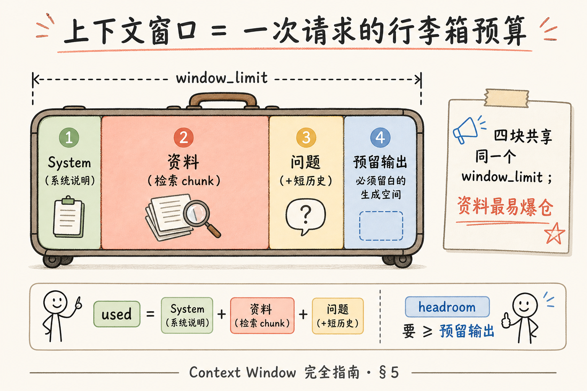
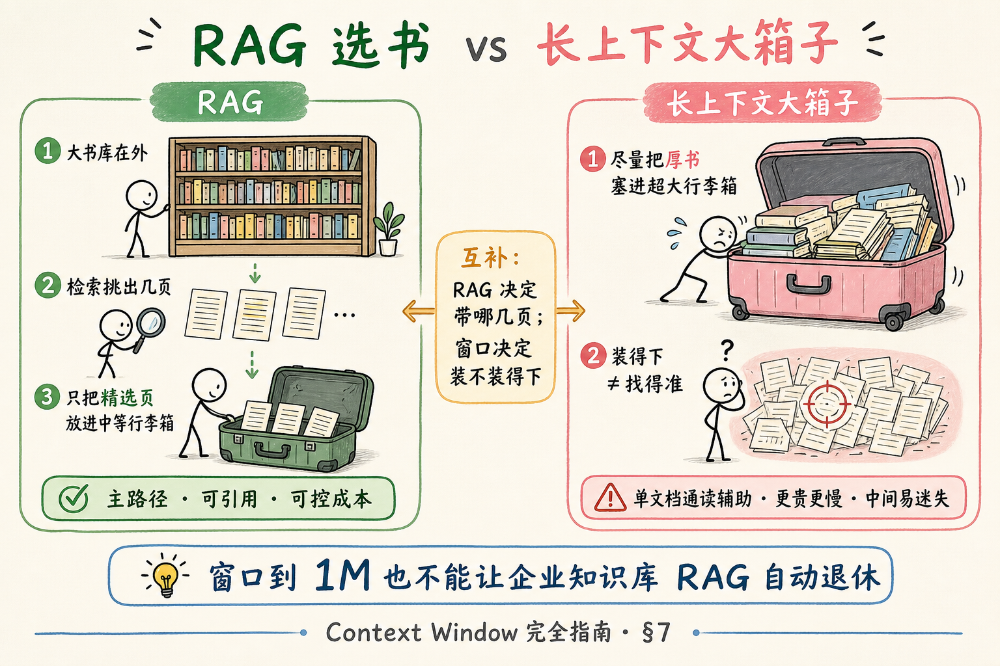
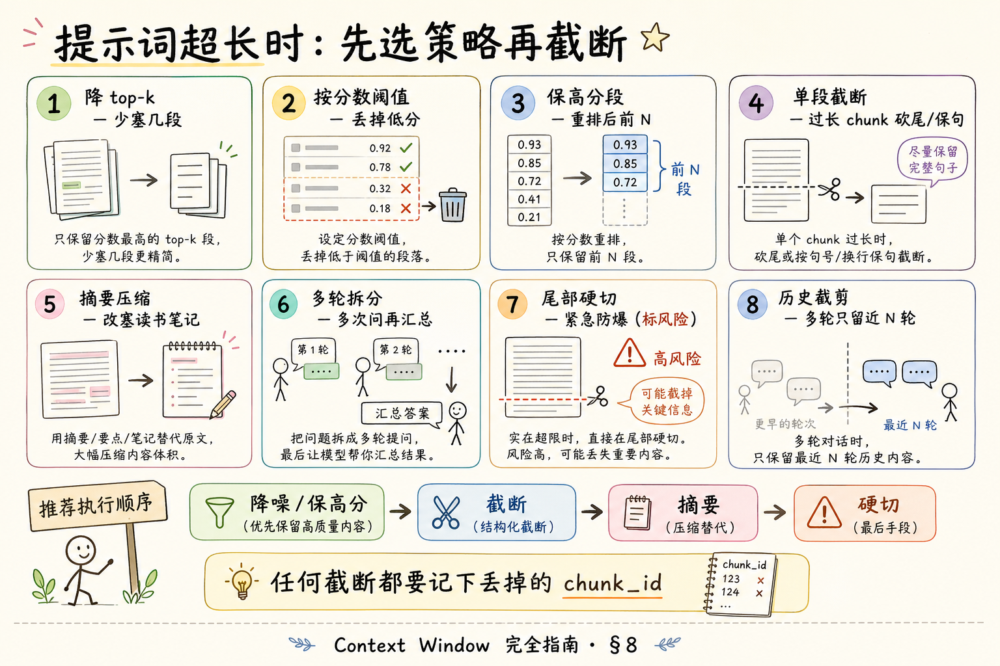

# NLP / IR / LLM 基础（十二）：Context Window（上下文窗口）完全指南

> 你已经知道 [Embedding](25.embedding-vector-tutorial.md) 把文档变成可检索的坐标，也知道生成模型靠「读进提示词的文字」来回答。可提示词不是无限长的——**装得下多少 token，就是上下文窗口在卡你**。这篇是 [企业 RAG 路线图](ENTERPRISE_RAG_ROADMAP.md) **B 轨第十二篇**（路线图第 **35** 条），定位 **主线篇**：把窗口当成「提示词预算」，讲清与 RAG 的分工、超长时怎么截断，并带你做一次 **预算分配实战**。前置建议：路线图 34（Token 计数与计费）、[22 Transformer](22.transformer-architecture-tutorial.md)、[23 Self-Attention](23.self-attention-tutorial.md)。

---

## 目录

1. [前言：提示词也有「行李箱容量」](#1-前言提示词也有行李箱容量)
2. [本文边界与动手路径](#2-本文边界与动手路径)
3. [Context Window 是什么](#3-context-window-是什么)
4. [窗口里装什么：一次请求的账单](#4-窗口里装什么一次请求的账单)
5. [预算图：system + 资料 + 问题 + 预留输出](#5-预算图system--资料--问题--预留输出)
6. [为什么不能无限塞：代价直觉](#6-为什么不能无限塞代价直觉)
7. [和 RAG 的分工：检索 vs 长上下文](#7-和-rag-的分工检索-vs-长上下文)
8. [超长时怎么办：截断与压缩策略](#8-超长时怎么办截断与压缩策略)
9. [位置外推：了解即可](#9-位置外推了解即可)
10. [综合实战：提示词预算分配](#10-综合实战提示词预算分配)
11. [综合概念地图](#11-综合概念地图)
12. [常见陷阱与 FAQ](#12-常见陷阱与-faq)
13. [总结与系列下一步](#13-总结与系列下一步)

---

## 1. 前言：提示词也有「行李箱容量」

做 RAG 时，最常见的失败不是「模型不会写」，而是：**你想塞进提示词的东西，比模型一次能读的还多**。

想象登机前的行李箱：

- 系统说明（角色、拒答规则）像 **必带证件**；  
- 检索到的资料像 **参考书**；  
- 用户问题像 **行程单**；  
- 模型还要留空间 **写回执**（生成答案）。

箱子只有这么大。塞爆了，航空公司（API）会拒收，或你被迫把书撕掉几页——撕错页，答案就歪。

**Context Window**（上下文窗口 / 上下文长度限制）：模型在 **单次推理** 中，能同时处理的输入与输出 token 总量上限（具体计法因厂商略有差异，初学按「输入+输出共享一个大桶」理解即可）。  
通俗说：**这一趟对话请求，行李箱最多装多少「词块」**。

注意：窗口说的是 **这一次请求里模型「看得见」的文本**，不是「你们公司知识库有多大」。知识库可以有几百万页；真正进模型的，通常只有检索挑出来的那几段。

**读完本文，你应该能做到：**

1. 用「行李箱 / 预算」解释上下文窗口，并区分「库很大」与「单次能读很多」。  
2. 把一次 RAG 请求拆成 system、资料、问题、预留输出四块，并估算 token。  
3. 说明为何 RAG 与「超长上下文模型」是互补，不是互相替代。  
4. 在超长时从策略表里选出截断 / 摘要 / 多轮等手段，并说出风险。  
5. 对「位置外推 / 宣称 100 万 token」保持了解级态度，不神话。  
6. 跑通或跟读 §10 预算分配脚本，完成「先错后对」自检。

---

## 2. 本文边界与动手路径

**档位：主线篇（要厚）。**

**本文讲：** 上下文窗口定义、提示词预算、与 RAG 分工、超长截断策略、最小可运行预算脚本。  
**本文不讲：** 各厂商 tokenizer 源码、RoPE 数学推导、长上下文训练配方、KV Cache 内核优化、完整对话多轮压缩产品方案。

### 2.1 动手路径表

| 步骤 | 你做什么 | 验收 |
|------|----------|------|
| A | 读 §3～§5，能画「四块预算」 | 白板能讲 system / 资料 / 问题 / 输出 |
| B | 读 §7，能说清 RAG 与长上下文各自解决什么 | 一句话对比 |
| C | 对照 §8 策略表，给「资料超长」选一种手段 | 写出理由与风险 |
| D | 跑 §10 预算脚本（或跟读输出） | 打印出各块 token 与是否超限 |
| E | 完成 §10.3 先错后对 | 能指出两种典型错误 |

**环境：** Python 3.10+；推荐 `pip install tiktoken`（OpenAI 系计数）或按字符粗估；有 API Key 时可再实测 `max_tokens` 行为。无 Key 时把 §10 当阅读材料，用粗估函数即可。

### 2.2 沿用前文

| 概念 | 来自 |
|------|------|
| Token 是计费与长度单位 | 路线图 **34** Token 计数与计费 |
| 注意力随长度变贵 | [23 Self-Attention](23.self-attention-tutorial.md) |
| 检索取回原文再塞进提示词 | [25 Embedding](25.embedding-vector-tutorial.md) |
| 提示词不改参数 | [24 预训练与微调](24.pretrain-finetune-tutorial.md) |

---

## 3. Context Window 是什么

再钉一次，避免和「知识库容量」「训练语料大小」混谈：

| 说法 | 实际指什么 | 常见误解 |
|------|------------|----------|
| 上下文窗口 128K | **单次请求**大约能处理约 12.8 万 token | 「模型记住了你们全部文档」 |
| 知识库 10 万页 | 存在磁盘 / 向量库里的语料 | 「每次都会全读」 |
| 训练数据万亿 token | 预训练见过的规模 | 「推理时也能一次读万亿」 |

**Token**（词元）：模型读写文本的最小计费/计数单位，不等于「一个汉字」或「一个英文单词」。  
通俗说：行李箱里的 **积木块**；中文常「几字一块」，英文常「一词一块或更碎」——精确数要用对应模型的 tokenizer。

厂商标的「128K context」「200K context」，通常表示 **该模型单次可处理的上下文规模量级**。有的产品把「输入上限」和「输出上限」分开写；有的把输入+输出算进同一个窗口。工程上请 **以官方文档为准**，本文用统一预算桶讲直觉。

> **严格结论**：上下文窗口是推理时的硬约束；超出时 API 报错，或客户端/网关在送出前截断——截断策略若未设计，等于随机撕书。

---

## 4. 窗口里装什么：一次请求的账单

一次典型的企业 RAG 问答，提示词大致由这些部分组成：

1. **System（系统提示）**：角色、语气、拒答、引用格式、安全边界。  
2. **资料（Retrieved context）**：检索到的 chunk、表格摘要、元数据（来源、页码）。  
3. **问题（User query）**：当前用户问句；多轮时还可能带近期对话。  
4. **预留输出（Reserved for completion）**：你希望模型最多生成多长——对应 `max_tokens` / `max_completion_tokens` 一类参数。

还有常被忘掉的「隐形行李」：

- 工具调用的 JSON schema、函数结果；  
- 多轮历史（上一轮答得很长，下一轮窗口就被吃掉）；  
- 厂商自动注入的默认系统文案（少见，但要知道可能存在）。

**有效上下文**（effective context）：真正进入模型、影响本次生成的那一段文本。  
通俗说：行李箱里 **已经放进去且安检通过** 的东西；库里没检索到的、被截掉的，模型这趟看不见。

---

## 5. 预算图：system + 资料 + 问题 + 预留输出

读下图时，盯住四块如何瓜分同一个窗口。




对照上图：窗口不是「只限制用户问题」，而是 **整次请求的共享预算**。资料块往往最大、也最容易失控；预留输出若设成 0 或忘了留，会出现「输入刚好塞满 → 模型几乎写不出完整答案」的尴尬。

### 5.1 一笔糊涂账的公式（工程口语）

用符号帮助记忆（不是某家 API 的精确公式）：

```text
used ≈ tokens(system) + tokens(资料) + tokens(问题) + tokens(历史)
headroom = window_limit - used
若 headroom < 预留输出 → 必须减资料 / 减历史 / 降预留，否则超限或答案被掐断
```

### 5.2 经验比例（起点，不是教条）

对「128K 窗口、企业制度问答」的 **起步分配** 可参考：

| 块 | 起步占比（直觉） | 说明 |
|----|------------------|------|
| System | 较小且相对固定 | 写清楚即可，勿堆小说 |
| 问题 + 短历史 | 中小 | 多轮要单独治理 |
| 资料 | **最大可变块** | 由 top-k、chunk 大小决定 |
| 预留输出 | 按答案形态 | 短答几百；长报告要上千～更多 |

真正项目里应用 **计数器** 动态裁剪资料，而不是死记百分比。

---

## 6. 为什么不能无限塞：代价直觉

结合 [自注意力](23.self-attention-tutorial.md)：标准注意力里，每个位置都要和许多其他位置交互。长度变长时，计算与显存大致按 **更陡的曲线** 上涨（经典说法是对长度平方敏感；工程上还有 KV Cache 等优化，但「更长通常更贵更慢」仍然成立）。

因此厂商会：

- 给模型标一个窗口上限；  
- 对超长请求收费更高或限流更严；  
- 用稀疏注意力、滑动窗口、外推技术等 **缓解**，而不是魔法取消物理限制。

对 RAG 工程师的含义很务实：

- **能检索就别全库塞进提示词**；  
- **能短 chunk 就别贴整本 PDF**；  
- **能引用页码就别复制十页原文**。

---

## 7. 和 RAG 的分工：检索 vs 长上下文

读下图，比较「先挑再读」与「尽量一次读很多」。




对照上图：

| | RAG（检索增强） | 长上下文（Long context） |
|--|-----------------|---------------------------|
| 核心动作 | 先从库里 **挑** 相关片段 | 尽量把大段文本 **直接放进** 窗口 |
| 解决什么 | 库远大于窗口；要权限、版本、引用 | 单文档/少文档已在手，希望少建索引 |
| 主要风险 | 检索漏召回、chunk 切坏 | 噪声多、中间遗忘、贵、慢 |
| 企业知识库默认 | **主路径** | 辅助（合同通读、单次分析等） |

**长上下文模型**（long-context model）：宣称支持更大窗口（如数十万 token）的生成模型。  
通俗说：更大号的行李箱——仍有上限，且「装得下」≠「找得准」。

常见误区：

- 「窗口到了 1M，RAG 可以退休」——知识库仍可能更大；权限、增量更新、引用溯源、成本，RAG 仍更合适。  
- 「有了 RAG 就不用关心窗口」——检索 top-k 一大，照样爆窗。

互补句（面试加分）：**RAG 决定「带哪几页」；上下文窗口决定「这几页加说明加答案能不能一次装下」。**

---

## 8. 超长时怎么办：截断与压缩策略

读策略总览图，再对照下面的表做选择。




对照上图：优先 **少而准**，再谈摘要与多轮；「从尾部硬切」往往是最后的安全网，不是默认最优。

### 8.1 截断策略表（综合实战会用到）

| 策略 | 做法 | 适用 | 风险 |
|------|------|------|------|
| **降 top-k** | 少塞几段检索结果 | 资料块过大 | 可能丢掉关键段 |
| **按分数阈值** | 低于相似度/重排分的丢掉 | 噪声多 | 阈值难调 |
| **保开头+结尾** | 长文档留首尾，中间砍 | 报告类结构 | 中间关键条款丢失 |
| **保检索高分段** | 只留重排后的前 N | RAG 主路径 | 依赖检索质量 |
| **滑动窗口** | 每次只看相邻若干 chunk | 顺序阅读、扫描 | 跨段推理弱 |
| **摘要压缩** | 先让模型/规则压成短摘要再问 | 多文档综述 | 摘要失真、二次幻觉 |
| **分层摘要** | map-reduce：分段摘要再总摘要 | 超长单文档 | 链路长、成本高 |
| **多轮 / 多请求** | 拆成多次问答再汇总 | 任务可拆 | 状态管理复杂 |
| **从尾部截断** | 超出部分直接丢掉末尾 | 紧急防爆窗 | **最易误伤关键信息** |
| **从头部截断** | 丢掉最早的历史或前言 | 多轮对话挤爆 | 丢失约束与早期事实 |

**截断**（truncation）：在送入模型前，按规则删除部分文本，使总长落入窗口。  
通俗说：**行李箱装不下就扔东西**——问题是扔哪一件。

**上下文压缩**（context compression）：用摘要、抽取、向量召回精炼等方式，减少 token 但尽量保留任务相关信息。  
通俗说：不把整本书塞进去，改塞 **读书笔记**——笔记写错，后面全错。

### 8.2 选择口诀

1. 先问：是 **检索太多**，还是 **单段太长**，还是 **历史太长**？  
2. RAG 场景优先：重排 → 降 k → 截断单 chunk → 再摘要。  
3. 纯长文档通读：分层摘要或专用长上下文，并做抽检。  
4. 任何截断都要 **可观测**：日志里记下「扔了哪些 chunk_id」。

---

## 9. 位置外推：了解即可

你可能在发布会听到：「训练只到 8K，推理却能到 128K」。这往往涉及 **位置编码外推**（position extrapolation / interpolation）一类技术：让模型在比训练时更长的序列上仍能运行。

初学者只需记住三点：

1. **能跑 ≠ 一样聪明**：超长区间上，模型对「中间段落」的利用常变差（有文献与评测讨论过「中间迷失」类现象）。  
2. **标称窗口是上限，不是质量保证**：128K 窗口不代表你塞 100K 噪声也能答得准。  
3. **企业交付仍靠评测**：用你们的长文档集测「塞全篇 vs RAG top-5」哪个更稳、更便宜。

本篇 **不推导** RoPE、ALiBi、YaRN 等公式；面试能说到「外推是工程技巧，质量要实测」即可。

---

## 10. 综合实战：提示词预算分配

### 10.1 阅读顺序

先读完 §3～§5、§8，再跑本节。

**演示什么：** 用粗估或 `tiktoken` 统计 system / 资料 / 问题的 token，检查是否为输出留足空间；模拟「资料过长」时的截断。  
**前置：** Python 3.10+；可选 `tiktoken`。  
**预期：** 打印各块用量；超限时按「保留高优先级资料」裁剪后再次检查。

### 10.2 最小脚本

```python
"""综合实战：提示词预算分配（system + 资料 + 问题 + 预留输出）。"""
from __future__ import annotations

# 可选：pip install tiktoken
try:
    import tiktoken

    enc = tiktoken.get_encoding("cl100k_base")

    def count_tokens(text: str) -> int:
        return len(enc.encode(text))
except ImportError:

    def count_tokens(text: str) -> int:
        # 无 tiktoken 时的粗估：中文约 1.5 字/token，英文约 4 字符/token
        # 仅供学习，生产请用模型对应 tokenizer
        return max(1, int(len(text) / 1.8))


WINDOW_LIMIT = 8000          # 演示用小窗口，真实项目换成模型文档值
RESERVE_OUTPUT = 800         # 预留生成答案
SYSTEM = """你是企业制度助手。只根据【资料】回答。
资料不足时明确说「资料中未找到」。回答末尾列出引用编号。"""

# 模拟检索到的多段资料（真实项目来自向量库 top-k）
CHUNKS = [
    ("c1", "差旅标准：一线城市住宿上限 500 元/晚。"),
    ("c2", "差旅标准：交通优先高铁；机票需经理审批。"),
    ("c3", "报销需在返回后 10 个工作日内提交发票。"),
    ("c4", "食堂菜单与差旅无关的长文……" + ("垫字。" * 400)),
    ("c5", "年假制度：转正后享有带薪年假，具体天数见人事表。"),
]

QUESTION = "去上海出差，住宿和机票怎么规定？"


def budget_report(system: str, chunks: list[tuple[str, str]], question: str) -> dict:
    parts = {
        "system": count_tokens(system),
        "question": count_tokens(question),
        "chunks": {cid: count_tokens(text) for cid, text in chunks},
    }
    materials = sum(parts["chunks"].values())
    used = parts["system"] + materials + parts["question"]
    headroom = WINDOW_LIMIT - used
    return {
        "parts": parts,
        "materials": materials,
        "used": used,
        "headroom": headroom,
        "ok_for_output": headroom >= RESERVE_OUTPUT,
    }


def fit_chunks(
    chunks: list[tuple[str, str]],
    system: str,
    question: str,
) -> list[tuple[str, str]]:
    """超长时策略：按列表顺序贪心塞入，优先靠前（模拟重排后的高分在前）。"""
    selected: list[tuple[str, str]] = []
    for item in chunks:
        trial = selected + [item]
        report = budget_report(system, trial, question)
        if report["headroom"] >= RESERVE_OUTPUT:
            selected = trial
        else:
            # 单段过大：截断该段文本再试一次
            cid, text = item
            # 粗暴按字符截断（生产应按 token 截断并保留完整句）
            for keep in (800, 400, 200, 100):
                trimmed = (cid, text[:keep] + "…【已截断】")
                trial2 = selected + [trimmed]
                if budget_report(system, trial2, question)["headroom"] >= RESERVE_OUTPUT:
                    selected = trial2
                    break
            # 仍不够则跳过该段
    return selected


def main() -> None:
    print("=== 先错：把全部 chunk 无脑塞入 ===")
    bad = budget_report(SYSTEM, CHUNKS, QUESTION)
    print(
        f"used={bad['used']}, headroom={bad['headroom']}, "
        f"预留{RESERVE_OUTPUT}够用? {bad['ok_for_output']}"
    )
    print("各 chunk:", bad["parts"]["chunks"])

    print("\n=== 后对：按预算裁剪（高分在前 + 单段截断） ===")
    # 假设重排后顺序：c1, c2, c3, c5, c4（噪声长文靠后）
    ranked = [CHUNKS[0], CHUNKS[1], CHUNKS[2], CHUNKS[4], CHUNKS[3]]
    fitted = fit_chunks(ranked, SYSTEM, QUESTION)
    good = budget_report(SYSTEM, fitted, QUESTION)
    print("保留:", [cid for cid, _ in fitted])
    print(
        f"used={good['used']}, headroom={good['headroom']}, "
        f"预留{RESERVE_OUTPUT}够用? {good['ok_for_output']}"
    )

    # 组装最终提示词（示意）
    material_block = "\n".join(f"[{cid}] {text}" for cid, text in fitted)
    prompt = f"{SYSTEM}\n\n【资料】\n{material_block}\n\n【问题】\n{QUESTION}"
    print("\n最终提示词字符数:", len(prompt))
    print("最终提示词 token 粗估:", count_tokens(prompt))


if __name__ == "__main__":
    main()
```

代码后解读：

- `WINDOW_LIMIT` 与 `RESERVE_OUTPUT` 是你的 **两道闸门**；  
- 「先错」展示无脑全塞；「后对」展示 **排序 + 贪心 + 单段截断**；  
- 生产中请把 `count_tokens` 换成 **与聊天模型一致** 的 tokenizer，并把截断改为按 token、尽量在句号处切开。

### 10.3 先错后对

**错 1：** 只统计用户问题长度，忽略 system 与资料。  
**对 1：** 四块一起算；资料通常是大头。

**错 2：** `max_tokens`（输出上限）设很大，却把输入塞到窗口见底。  
**对 2：** 先保证 `headroom >= 预留输出`，再谈「希望答多长」。

**错 3：** 超长时从资料 **尾部一刀切**，而高分 chunk 碰巧在后面。  
**对 3：** 先重排 / 按分数保留；截断是最后手段，并记录被丢的 `chunk_id`。

**错 4：** 把整本 PDF 当「一个 chunk」塞进 128K 模型，认为「反正装得下」。  
**对 4：** 装得下仍可能答不准、更贵；企业问答优先 RAG 精选。

### 10.4 超长截断策略——实战对照表

把 §8 的表落到本脚本场景：

| 现象 | 本脚本对应动作 | 你还可以加 |
|------|----------------|------------|
| 某一 chunk 特别长（c4） | `text[:keep]` 截断或跳过 | 按句切分、只要含关键词的句 |
| chunk 太多 | 贪心停止追加 | 降 top-k、分数阈值 |
| 预留输出不够 | 裁剪直到 `ok_for_output` | 动态降低 `RESERVE_OUTPUT`（短答场景） |
| 多轮历史挤爆 | （本脚本未演示） | 只保留最近 N 轮 + 摘要旧轮 |

### 10.5 自检清单

- [ ] 能写出 `used` 与 `headroom` 的含义  
- [ ] 能解释为何要单独「预留输出」  
- [ ] 能说出至少三种超长策略及一种风险  
- [ ] 能区分「窗口很大」与「RAG 仍有必要」

---

## 11. 综合概念地图


对照上图：窗口是预算，RAG 是选书，截断是扔行李，外推只是更大号箱子的说明书——质量仍要测。

### 11.1 速记表

| 概念 | 一句话 |
|------|--------|
| Context Window | 单次请求能处理的 token 上限 |
| 提示词预算 | system+资料+问题+预留输出 |
| RAG | 先挑再读，避免全库进窗 |
| 截断 / 压缩 | 超限时的丢弃或精炼 |
| 位置外推 | 了解：能更长跑，不保证更准 |

---

## 12. 常见陷阱与 FAQ

1. **把「上下文窗口」当成「长期记忆」**  
   窗口是单次（或产品封装的有限会话）可见范围；跨会话仍要靠存储与检索。

2. **只盯输入，不留输出**  
   输入 127K + 还想生成 2K，在 128K 共享窗口上会炸或被截断。

3. **top-k 越大越好**  
   更大 k → 更易爆窗、更多噪声；用重排与评测找甜点。

4. **中英混排凭感觉估 token**  
   生产必须用官方/对应 tokenizer；粗估只适合课堂。

5. **神话百万 token**  
   先看单价、延迟、中间段落答题质量，再决定架构。

**Q：流式输出会占用窗口吗？**  
A：生成出来的 token 通常计入本次上下文消耗（具体以厂商计费与窗口规则为准）；预留输出就是在防「写到一半没额度」。

**Q：多轮对话窗口怎么治？**  
A：保留系统提示 + 最近若干轮；更早内容做摘要或依赖「会话检索」；别无限追加全文历史。

**Q：和路线图 34 Token 计费什么关系？**  
A：34 讲「怎么数、怎么花钱」；本篇讲「数完了怎么在窗口里分配与裁剪」。

**Q：摘要压缩会不会引入幻觉？**  
A：会。压缩链要抽检；关键数字与条款尽量保留原文短摘录而非全靠二次生成。

---

## 13. 总结与系列下一步

1. 上下文窗口 = 单次推理的 **行李箱容量**（token 上限）。  
2. RAG 请求要显式做 **四块预算**：system、资料、问题、预留输出。  
3. RAG 与长上下文 **互补**：一个负责选书，一个负责箱子大小。  
4. 超长时用策略表，优先降噪与保高分，避免无脑尾切。  
5. 位置外推 **了解即可**；标称长度不等于答题质量。

### 13.1 系列下一步

| 目标 | 阅读 |
|------|------|
| Temperature / Top-p / Top-k | [29 采样参数](29.llm-sampling-tutorial.md) |
| System / User / Assistant | [30 提示词角色](30.prompt-roles-tutorial.md) |
| 幻觉与 Grounding | 路线图 **40～41** |

### 13.2 学习目标自检

- [ ] 能画四块预算图  
- [ ] 能对比 RAG vs 长上下文  
- [ ] 能从截断表选策略并说风险  
- [ ] 跑通或跟读 §10，完成先错后对  

---

> **初学者可能仍困惑的点**  
> - 「对话产品记得住我」常常是 **服务端存历史**，不是窗口变成无限。  
> - 同一段中文，不同模型 token 数不同——换模型要重测预算。  
> - 检索分数高 ≠ 应该占满窗口；有时 3 段精准资料优于 20 段含糊资料。  
> - 下一篇采样参数决定「怎么写」；本篇决定「能读多少、先读什么」。
