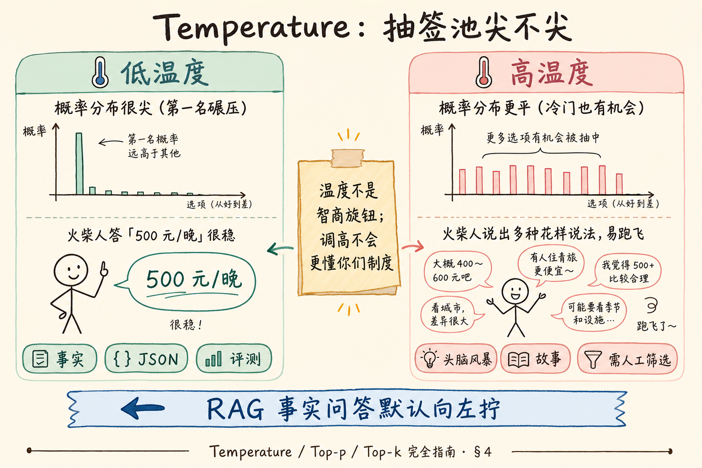
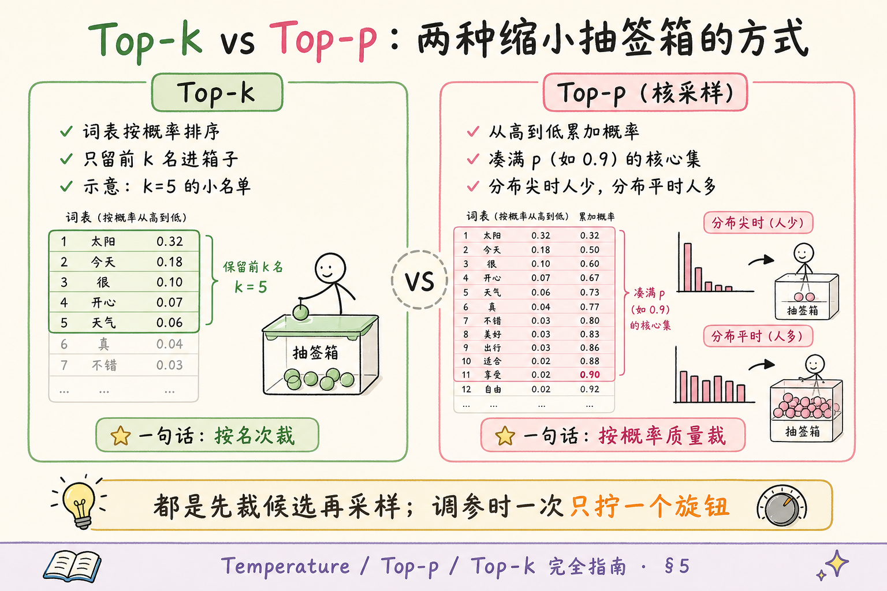
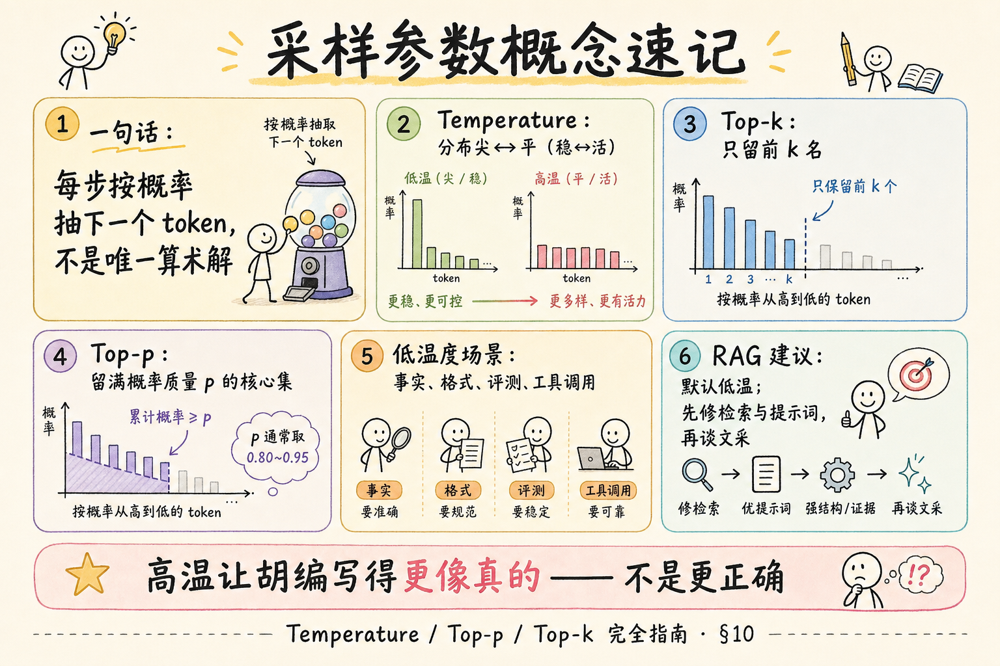

# NLP / IR / LLM 基础（十三）：Temperature / Top-p / Top-k 采样完全指南

> 上下文窗口决定模型 **能读多少**；采样参数决定它 **怎么从词表里挑下一个字**。你会在 API 里看到 `temperature`、`top_p`、`top_k`——调大了答案花哨不靠谱，调小了又像复读机。这篇是 [企业 RAG 路线图](ENTERPRISE_RAG_ROADMAP.md) **B 轨第十三篇**（路线图第 **36** 条），定位 **地基篇**：用白话讲清三个旋钮、何时用低温、以及 RAG 事实问答为何默认偏保守。前置：[28 上下文窗口](28.context-window-tutorial.md)（建议）、路线图 34 Token。

---

## 目录

1. [前言：下一个词不是「算死」的](#1-前言下一个词不是算死的)
2. [本文边界与动手路径](#2-本文边界与动手路径)
3. [生成时模型在做什么](#3-生成时模型在做什么)
4. [Temperature：温度计](#4-temperature温度计)
5. [Top-p 与 Top-k：候选名单怎么裁](#5-top-p-与-top-k候选名单怎么裁)
6. [三参数对照与常见组合](#6-三参数对照与常见组合)
7. [何时用低温度](#7-何时用低温度)
8. [和 RAG 事实问答](#8-和-rag-事实问答)
9. [综合实战：先错后对调参](#9-综合实战先错后对调参)
10. [综合概念地图](#10-综合概念地图)
11. [常见陷阱与 FAQ](#11-常见陷阱与-faq)
12. [总结与系列下一步](#12-总结与系列下一步)

---

## 1. 前言：下一个词不是「算死」的

大模型写答案时，并不是脑子里只有一个「标准下一个字」。每一步它会对词表里成千上万个 token 打出 **概率分布**——有的很像下一手，有的很离谱。

然后系统要 **采样**（sampling）：按规则从分布里抽出一个 token，接到后面，再重复。  
通俗说：不是计算器按出唯一解，更像 **按权重抽签**——温度和 top-p/top-k 就是抽签规则。

所以你会看到：同一提示词跑两次，答案可能略有不同。对创意写作，这是特性；对「公司差旅住宿上限是多少」，这是风险。

**读完本文，你应该能做到：**

1. 用「概率分布 → 抽下一个 token」说明生成为何有随机性。  
2. 白话解释 Temperature、Top-p、Top-k 各拧什么。  
3. 说出至少三类适合 **低温度** 的场景。  
4. 给出 RAG 事实问答的保守参数起点，并说明原因。  
5. 完成「先错后对」调参对照，避免同时把多个旋钮拧到极端。

---

## 2. 本文边界与动手路径

**档位：地基篇。**

**本文讲：** 三参数直觉、适用场景、与 RAG 的建议、最小调参对照。  
**本文不讲：** Softmax 温度公式的完整推导、beam search 细节、投机解码、各厂商隐藏默认值的逐项审计。

### 2.1 动手路径表

| 步骤 | 你做什么 | 验收 |
|------|----------|------|
| A | 读 §3～§5，能画「打分 → 调温 → 截断候选 → 抽样」 | 口头能讲 |
| B | 读 §7～§8，写下 RAG 默认参数起点 | 温度偏低 + 理由 |
| C | 跟读 §9 先错后对 | 能指出两种错误调法 |
| D | （可选）同一提示词改温度各跑一次 | 观察风格差异 |

**环境：** 概念为主；有 Chat API 时可用同一提示词对比 `temperature=0` 与 `0.9`。无 Key 时跟读即可。

### 2.2 沿用前文

| 概念 | 来自 |
|------|------|
| 解码器逐步生成 | [22 Transformer](22.transformer-architecture-tutorial.md) |
| 提示词装得下多少 | [28 Context Window](28.context-window-tutorial.md) |
| RAG 依据资料回答 | [25 Embedding](25.embedding-vector-tutorial.md)、路线图 C 轨 |

---

## 3. 生成时模型在做什么

每一步（简化）：

1. 根据已有上下文，模型给词表每个 token 一个分数（logits）；  
2. 变成概率（谁更可能当「下一个」）；  
3. **采样策略** 决定如何根据概率选出一个 token；  
4. 把选中的 token 追加到上下文，进入下一步。

**Logits**（未归一化分数）：模型输出的原始分值，尚未变成概率。  
通俗说：评委打的 **原始分**，还没换成「占多少百分比」。

**Softmax**：把分数变成加起来为 1 的概率分布的常用函数。  
通俗说：把原始分 **归一成抽签权重**。

若永远选概率最大的那个，叫 **贪心解码**（greedy decoding）——最稳、最可复现，但有时死板或陷入重复。温度与 top-p/top-k 是在「稳」与「活」之间找平衡。

### 3.1 和「训练」别混

采样参数作用在 **推理 / 生成阶段**：模型权重已经固定，你只是改「怎么抽下一个词」。  
它 **不会** 让模型突然学会你们没塞进提示词的内部制度，也 **不会** 替代微调或 RAG。

可以把整条链路记成：

| 阶段 | 决定什么 |
|------|----------|
| 预训练 / 微调 | 模型「会什么」 |
| 提示词 + RAG | 这次「读什么、按什么规则答」 |
| 采样参数 | 在候选词里「怎么挑着写」 |

RAG 工程师日常：前两行花 90% 精力；第三行用保守默认值，出问题再小步调。

---

## 4. Temperature：温度计

读下图，看低温与高温如何改变「尖峰 vs 平坦」的分布。




对照上图：

**Temperature**（温度）：采样前调节概率分布「尖锐程度」的参数。  
通俗说：**抽签池有多平均**——温度低，第一名权重更碾压；温度高，冷门词也更容易被抽到。

直觉表：

| 温度 | 分布形态 | 输出气质 | 典型用途 |
|------|----------|----------|----------|
| 偏低（如 0～0.3） | 更尖 | 稳、可复现、偏「标准答」 | 事实问答、分类、JSON |
| 中（如 0.5～0.8） | 适中 | 自然、略有变化 | 一般对话、改写 |
| 偏高（如 0.9～1.2+） | 更平 | 发散、意外、易跑飞 | 头脑风暴、故事 |

注意：

- 有的 API 把 `temperature=0` 近似成「几乎总选最高概率」（实现细节因厂商而异）。  
- 温度 **不是**「智商旋钮」：调高不会让模型突然更懂你们制度，只会让它更敢猜。  
- 温度过高时，即使提示词写了「只根据资料」，也更容易 **花样地胡编**。

### 4.1 温度在公式里大概干什么（了解）

不必背公式。口头版：温度出现在把 logits 变成概率之前，相当于 **除以一个正数 T**。  
T 变小 → 分差被放大 → 分布更尖；T 变大 → 分差被压平 → 分布更平。  
所以调温度是在改「第一名相对第二名有多碾压」，不是在改模型参数本身。

### 4.2 实操注意

- 不同产品滑条可能叫「创意度 / Creativity」，映射到温度或温度+top-p 组合。  
- 流式输出时，温度仍然逐步生效——你看到的「一个个字蹦出来」背后仍在抽样。  
- 若业务要求 **字节级可复现**，除了低温，还要查厂商是否支持 seed；不支持就不要对「完全一致」抱幻想。

---

## 5. Top-p 与 Top-k：候选名单怎么裁

读下图，比较两种「缩小抽签池」的方式。




对照上图：两者都是 **先丢掉太不像话的词，再在剩下来的里面采样**；裁法不同。

### 5.1 Top-k

**Top-k**：只保留概率最高的 **k 个** token，其余概率清零（再重新归一化），然后采样。  
通俗说：只准从 **前 k 名** 里抽签；k=1 近似贪心，k 很大则几乎不截断。

| k | 效果 |
|---|------|
| 很小（如 5～20） | 保守，变化少 |
| 很大 | 接近「不设 top-k」 |

### 5.2 Top-p（Nucleus Sampling）

**Top-p**（核采样 / nucleus sampling）：按概率从高到低累加，直到累计概率达到阈值 **p**（如 0.9），只保留这批「核心」token，再采样。  
通俗说：不固定人数，而是凑够 **前 p 的概率质量**——分布尖时可能只剩两三个词；分布平时常会纳入更多词。

| p | 效果 |
|---|------|
| 偏低（如 0.8） | 更保守 |
| 接近 1（如 0.95～1） | 更开放 |

### 5.3 和 Temperature 的关系

- Temperature 改的是 **形状**（尖不尖）；  
- Top-p / Top-k 改的是 **允许集合**（谁有资格进抽签箱）。  

三者常可组合。地基篇建议：**先固定两个，只拧一个**，否则你不知道是谁导致答案变野。

---

## 6. 三参数对照与常见组合

| 参数 | 一句话 | 调大时 | 调小时 |
|------|--------|--------|--------|
| Temperature | 分布尖↔平 | 更随机、更创意 | 更稳、更可复现 |
| Top-p | 按概率质量截断 | 候选更多 | 候选更少、更稳 |
| Top-k | 按名次截断 | 候选更多 | 候选更少、更稳 |

**常见起点（务必以你们模型文档为准）：**

| 场景 | 起点建议 | 备注 |
|------|----------|------|
| RAG 制度 / 事实问答 | `temperature` 0～0.3；`top_p` 0.9 或默认 | 优先稳 |
| 结构化 JSON 抽取 | 温度尽量低；配合 schema / 校验 | 随机性是敌人 |
| 客服话术润色 | 温度中低 | 要多样但别跑题 |
| 标题 / 文案头脑风暴 | 温度偏高；可略放开 top-p | 人工筛选 |

部分 API **不同时强调** top-k 与 top-p（或忽略其一）。以你调用的厂商说明为准；概念上知道「都是在裁候选」即可。

### 6.1 调参纪律（地基篇就养成）

1. **一次只改一个参数**，改完用同一批 5～10 个问题看差异。  
2. **先定场景目标**：要稳还是要活？事实场景默认稳。  
3. **记录默认值**：很多 SDK 有隐藏默认 temperature，不写进代码不等于 0。  
4. **与提示词解耦**：提示词不稳时，先别用采样「碰运气」。  
5. **上线前冻结**：评测通过的一组参数写进配置，而不是每个开发者本地口感不同。

---

## 7. 何时用低温度

优先考虑 **低温度** 的场景：

1. **有标准答案或短名单答案**：工单状态、是否、枚举字段。  
2. **要可复现**：评测集回归、A/B 对比提示词时，希望少被随机性干扰。  
3. **要严格格式**：JSON、CSV、固定引用模板。  
4. **高风险事实**：医疗、法律、财务、合规——即使有 RAG，也别额外加「创意」。  
5. **工具调用参数**：函数名与参数需要稳，不适合天马行空。

何时可以升高温度：

- 需要多种措辞、多种创意草案；  
- 明确接受「探索」，且下游有人审或有过滤；  
- 文学性任务，而非「根据第 3 页制度原文作答」。

---

## 8. 和 RAG 事实问答

企业 RAG 的目标通常是：**依据检索到的资料，给出可引用、少胡编的答案**。

因此建议：

- **默认低温**（或厂商文档中的「精确模式」）；  
- 把创造力预算花在「提示词写清结构」，而不是花在高温采样；  
- 若答案仍飘，先查检索与窗口预算（[28 篇](28.context-window-tutorial.md)），再怪采样；  
- 评测时固定种子或低温，避免「同一提示词今天过、明天挂」来自随机性。

**幻觉**（hallucination）：模型生成与资料/事实不符的内容。  
通俗说：**说得像真的，但没依据或依据是错的**。高温往往让幻觉 **更有文采**，不代表更正确。

一句话：**RAG 负责「读对材料」；低温度负责「少即兴发挥」。** 两者都要，缺一不可。

### 8.1 推荐起点（可写进项目 README）

| 项 | 建议起点 | 说明 |
|----|----------|------|
| temperature | 0～0.2 | 制度/FAQ/引用问答 |
| top_p | 0.9 或厂商默认 | 不必一上来拧到 0.5 |
| top_k | 按文档；没有就忽略 | 勿与 top_p 同时极端 |
| 多样性需求 | 另开「润色模式」 | 与「事实模式」配置分离 |

产品上常见做法：同一后端两个 profile——`factual`（低温）与 `creative`（中温），由路由或用户开关选择，避免一个全局高温害到知识库问答。

---

## 9. 综合实战：先错后对调参

### 9.1 场景

提示词（示意）：

```text
系统：只根据【资料】回答；不知则说不知道。
资料：一线城市住宿上限 500 元/晚。
问题：上海出差住宿标准？
```

期望：稳定答出 500 元/晚，并引用资料。

### 9.2 先错后对

**错 1：** `temperature=1.2`，`top_p=1`，还同时把 `top_k` 放到极大，指望「更聪明」。  
**现象：** 可能编出「一般 600～800」「淡季另议」等资料没有的话。  
**对 1：** 事实问答先 `temperature≤0.3`；其他参数保持默认或略保守；一次只改一个旋钮。

**错 2：** 评测提示词效果时用高温，发现「有时对有时错」就疯狂改提示词。  
**对 2：** 评测阶段固定低温（或固定种子），先把提示词与检索调稳，再视产品需要略增多样性。

**错 3：** 以为 `temperature=0` 就 **保证** 无幻觉。  
**对 3：** 低温降低随机乱跳，但资料错误、检索错误、提示词诱导仍会导致错答。采样≠真理。

**错 4：** JSON 模式开着高温。  
**对 4：** 结构化输出用低温 + 校验；失败重试，而不是靠「多试几次碰对格式」。

### 9.3 可选动手（有 API 时）

```python
"""可选：同一提示词对比低温 vs 高温（需配置你的 client）。"""
import os
from openai import OpenAI

client = OpenAI(api_key=os.environ["OPENAI_API_KEY"])
messages = [
    {
        "role": "system",
        "content": "只根据用户给出的资料回答；资料没有则说「资料中未找到」。",
    },
    {
        "role": "user",
        "content": "资料：一线城市住宿上限 500 元/晚。\n问题：上海住宿标准？",
    },
]

for temp in (0.0, 0.9):
    resp = client.chat.completions.create(
        model="gpt-4o-mini",  # 换成你可用的模型
        messages=messages,
        temperature=temp,
        max_tokens=120,
    )
    print(f"=== temperature={temp} ===")
    print(resp.choices[0].message.content)
```

代码后解读：低温应更贴「500」；高温未必每次都错，但 **方差更大**——这正是事实场景要避免的。

### 9.4 自检清单

- [ ] 能解释温度不是智商  
- [ ] 能区分 top-p 与 top-k 的裁法  
- [ ] 能为 RAG 事实问答给出保守起点  
- [ ] 知道评测时应固定随机性

---

## 10. 综合概念地图




对照上图：三旋钮都作用在「下一个 token 怎么抽」；RAG 场景默认向「稳」拧。

### 10.1 速记表

| 概念 | 一句话 |
|------|--------|
| 采样 | 按概率抽下一个 token |
| Temperature | 分布尖或平 |
| Top-k | 只留前 k 名 |
| Top-p | 留满概率质量 p 的核心集 |
| RAG 建议 | 低温、少即兴 |

---

## 11. 常见陷阱与 FAQ

1. **同时把温度、top-p、top-k 拧到极端** —— 无法归因，先只动一个。  
2. **用高温「激发」模型遵守复杂格式** —— 格式靠提示词与校验，不靠高温。  
3. **忽略厂商默认值** —— 你没传参不等于「无随机」。  
4. **把 top-p=0.9 理解成「只用 90% 的词表」** —— 实际是累计概率达到 0.9 的那批高概率词。  

**Q：temperature 和 top_p 应该一起改吗？**  
A：可以组合，但调参时建议一次改一个，并做小样本对比。

**Q：为什么低温仍会编造？**  
A：模型本质是语言预测；资料缺失或冲突时仍可能补全。要用拒答规则、引用、检索质量与评测兜底。

**Q：创意任务是不是温度越高越好？**  
A：不是。过高会语法崩、主题漂；常在中高区间试，并人工或自动筛选。

**Q：和「beam search」什么关系？**  
A：beam 是另一类搜索式解码，地基篇知道「除了随机采样还有搜索法」即可；聊天 API 更常见的是温度+nucleus。

**Q：frequency_penalty / presence_penalty 要一起学吗？**  
A：它们偏向「少重复 / 鼓励新话题」，与温度不同维。地基篇先掌握三参数；重复严重时再查文档加惩罚项，仍建议一次加一个。

**Q：开了 JSON mode 还要低温吗？**  
A：要。JSON mode 约束的是结构表面，不保证字段内容忠实于资料；低温降低「花样填字段」。

---

## 12. 总结与系列下一步

1. 生成是逐步 **采样**，不是唯一算术答案。  
2. Temperature 管分布尖平；Top-p / Top-k 管候选名单。  
3. 事实、格式、评测、工具调用 → **低温度**。  
4. RAG 事实问答：默认保守采样，先修检索与提示词，再谈「更有文采」。

### 12.1 系列下一步

| 目标 | 阅读 |
|------|------|
| System / User / Assistant | [30 提示词角色](30.prompt-roles-tutorial.md) |
| Few-shot | [31 Few-shot](31.few-shot-prompting-tutorial.md) |
| 幻觉与 Grounding | 路线图 **40～41** |

### 12.2 学习目标自检

- [ ] 三参数能各用一句人话解释  
- [ ] 能列出低温度场景  
- [ ] 能说出 RAG 默认偏低温的原因  
- [ ] 完成先错后对对照  

---

> **初学者可能仍困惑的点**  
> - 「随机」不等于「每次都完全不同」——低温时两次结果常常很像。  
> - 有的界面把「创意度」滑条映射到温度，名字不同，本质类似。  
> - 采样调的是 **表达与探索**，不增加模型没读过的私有知识；私有知识靠 RAG 与工具。  
> - 下一篇起进入提示词角色结构，和本篇的「怎么写」会拼在一起。
