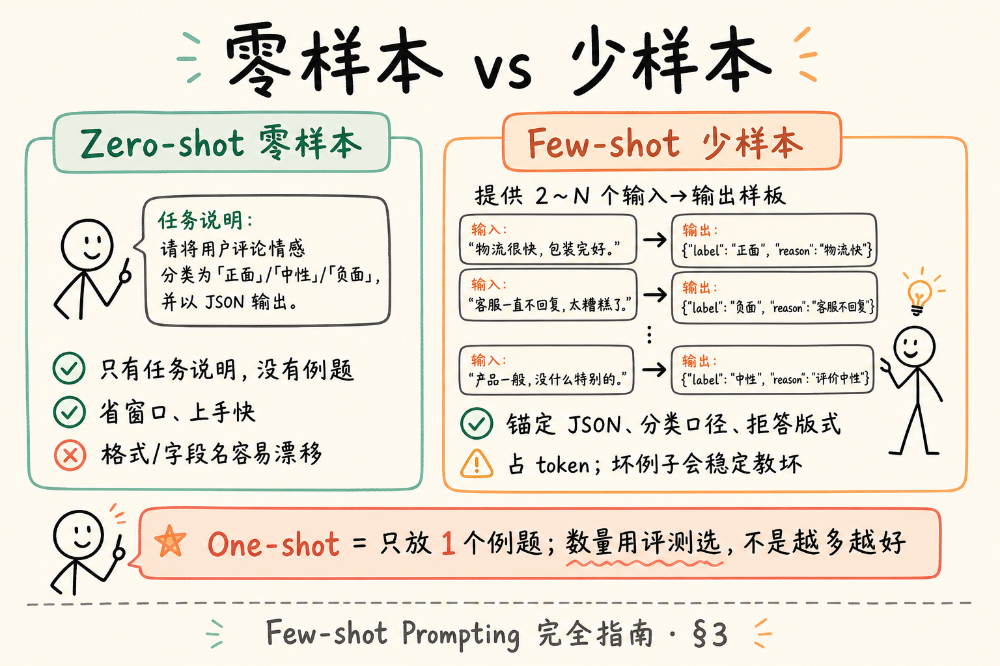
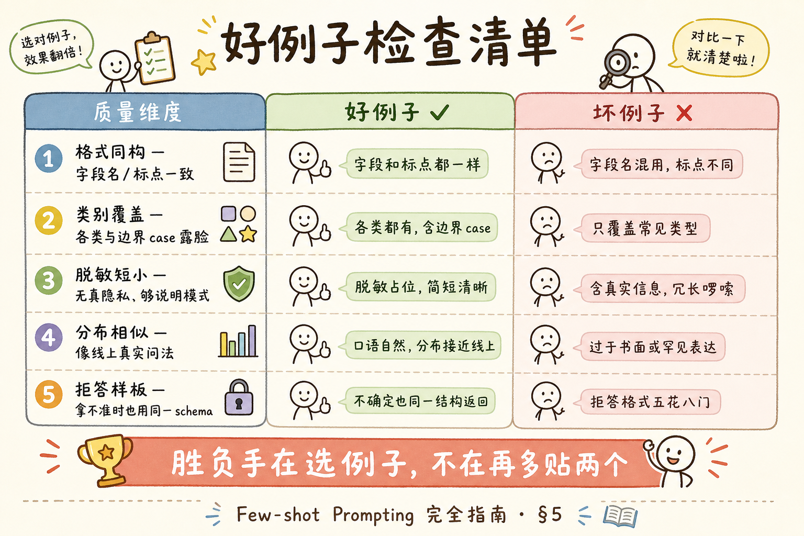
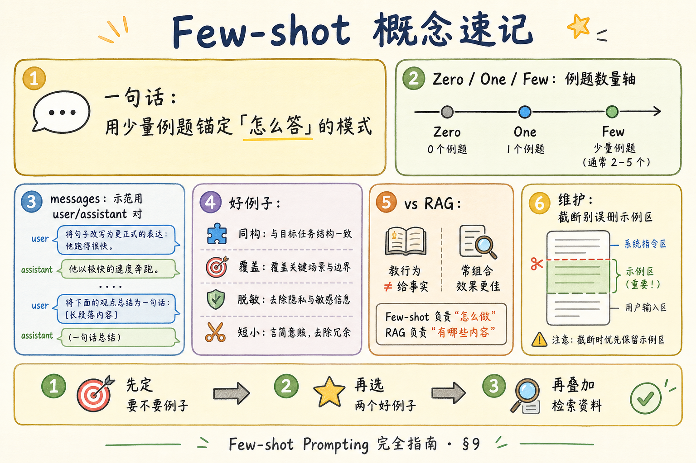

# NLP / IR / LLM 基础（十五）：Few-shot Prompting（少样本提示）完全指南

> 上一篇 [System / User / Assistant](30.prompt-roles-tutorial.md) 解决了「话放进哪个格子」。这一篇回答下一个高频问题：**怎样用几个例子，让模型学会你们的格式、语气和分类口径？** 这是 [企业 RAG 路线图](ENTERPRISE_RAG_ROADMAP.md) **B 轨第十五篇**（路线图第 **38** 条）。你会分清零样本 / 单样本 / 少样本，学会挑「好例子」，并搞清 **Few-shot 教的是行为，RAG 提供的是事实**——两者常一起用，但不是互相替代。

---

## 目录

1. [前言：为什么「举个例子」突然好用](#1-前言为什么举个例子突然好用)
2. [本文边界](#2-本文边界)
3. [零样本、单样本、少样本](#3-零样本单样本少样本)
4. [例子写在 messages 的哪里](#4-例子写在-messages-的哪里)
5. [示例质量：好例子长什么样](#5-示例质量好例子长什么样)
6. [和 RAG 的关系：教行为 vs 给事实](#6-和-rag-的关系教行为-vs-给事实)
7. [最小实战：用 2 个例子锁定 JSON 字段](#7-最小实战用-2-个例子锁定-json-字段)
8. [先错后对：坏例子如何带偏模型](#8-先错后对坏例子如何带偏模型)
9. [综合概念地图](#9-综合概念地图)
10. [常见陷阱与 FAQ](#10-常见陷阱与-faq)
11. [总结与系列下一步](#11-总结与系列下一步)

---

## 1. 前言：为什么「举个例子」突然好用

你对模型说：「把工单分成三类：报销 / 请假 / 其他，输出 JSON。」  
有时它输出 Markdown 表格；有时字段名写成 `type` 有时写成 `category`；有时还顺便写一段安慰人的话。

这时，与其把 system 写成小说，不如给 **两三个标准问答样板**：

```text
用户：…… → 助手：{"category":"报销","confidence":"高"}
用户：…… → 助手：{"category":"请假","confidence":"中"}
用户：【真正的新问题】→ 助手：？
```

模型很擅长 **续写模式**：看到前面的「题型」，后面就按同一题型答。

**Few-shot Prompting**（少样本提示）：在提示中提供 **少量输入–输出示例**，引导模型对 **新输入** 产生同类输出的技术。  
通俗说：先做两道例题再考试，而不是只发一张空白答题卡。

**In-context learning**（上下文学习）：不更新模型参数，仅靠当前提示里的说明与例子改变行为的现象。  
通俗说：开卷考试——答案模式写在卷子抬头，合上卷子（下次新请求）又忘了，除非你再贴一遍。

**读完本文，你应该能做到：**

1. 区分零样本、单样本、少样本，并各举一个场景。  
2. 用 `messages` 正确插入示范用的 user/assistant 对。  
3. 列出「好例子」的检查清单（覆盖、格式、反例、敏感）。  
4. 说明 Few-shot 与 RAG 分别解决什么问题，何时组合。  
5. 跑通或跟读 §7 的 JSON 字段锁定示例。  
6. 识别坏例子如何污染输出。

---

## 2. 本文边界

**档位：主线偏实践的概念篇**（短于第 30 篇，但仍要求能动手）。

**本文讲：** 零/单/少样本定义、messages 写法、示例质量、与 RAG 分工、最小可运行对照。  
**本文不讲：** 自动选例子的检索式 ICL、提示词优化算法、完整微调数据集构建、Agent 工具选择的 few-shot。

**前置：** [30 提示词角色](30.prompt-roles-tutorial.md)。  
**环境：** Python 3.10+、`openai`、API Key（可选；无 Key 跟读即可）。

---

## 3. 零样本、单样本、少样本

读下图，抓住「例题数量」这条轴。



对照上图：**左边靠说明书，右边靠例题；不是越多越好，而是「够用且不脏」。**

### 3.1 Zero-shot（零样本）

**Zero-shot**（零样本）：不提供输入–输出样板，只给任务说明（常在 system / 本轮 user）就让模型直接做。  
通俗说：只发规则，不发例题。

适合：

- 任务简单、格式宽松（「用三句话总结」）；  
- 模型本身很强且你已有清晰 system；  
- 窗口紧张，舍不得放例子。

风险：字段名漂移、语气不稳、边界 case 乱跳。

### 3.2 One-shot（单样本）

**One-shot**（单样本）：只提供 **一个** 完整示例，再跟真正的问题。  
通俗说：只做一道例题就开考。

适合：

- 格式固定、类别不多；  
- 想省 token，又需要「形状锚点」。

风险：模型可能 **过度模仿** 那一个例子的内容细节（把例题里的公司名抄进新答案）。

### 3.3 Few-shot（少样本）

**Few-shot**（少样本）：提供 **多个**（常见 2～8 个）示例。  
通俗说：小测验前的例题册。

适合：

- 分类口径需要「看过几种长什么样」；  
- 输出 schema 严格（JSON、表格列）；  
- 要展示「拿不准时怎么写」。

代价：吃窗口、吃钱；例子质量差时 **错得更像那么回事**。

### 3.4 对照表

| 名称 | 示例数 | 优点 | 代价 |
|------|--------|------|------|
| Zero-shot | 0 | 省窗口、简单 | 格式易漂 |
| One-shot | 1 | 快速定形 | 易抄例题细节 |
| Few-shot | ≥2 | 覆盖边界、稳格式 | 占 token；要维护例子库 |

数量没有魔法数字：以 **评测集上的稳定度** 为准，而不是「别人用 5 个我也用 5 个」。

---

## 4. 例子写在 messages 的哪里

延续第 30 篇的三角色。常见两种写法。

### 4.1 写法 A：伪造历史轮次（推荐入门）

```python
messages = [
    {"role": "system", "content": "你是工单分类器。只输出一行 JSON。"},
    # --- 示例 1 ---
    {"role": "user", "content": "我要报销上周打车费"},
    {"role": "assistant", "content": '{"category":"报销","confidence":"高"}'},
    # --- 示例 2 ---
    {"role": "user", "content": "下周三想请事假半天"},
    {"role": "assistant", "content": '{"category":"请假","confidence":"高"}'},
    # --- 真正问题 ---
    {"role": "user", "content": "发票丢了还能报吗？咨询一下流程"},
]
```

模型会把前面的 user/assistant 当成「题型示范」，再答最后一轮。

### 4.2 写法 B：全写在一条 user 里

```text
示例：
输入：……
输出：……
输入：……
输出：……
现在请处理：
输入：……
输出：
```

能用，但和多轮真实历史混在一起时更难截断与审计。团队更大时，优先写法 A + 「示例区与真实历史分区管理」。

### 4.3 和真实多轮历史共存时

生产对话可能既有：

- **静态 few-shot 模板**（每次请求都贴）；  
- **动态会话历史**（用户刚才聊的）。

建议：

1. system（契约）  
2. few-shot 示例对（可选，固定）  
3. 截断后的真实历史  
4. 本轮 user（可含 RAG 资料 + 问题）

截断时 **不要误删 few-shot** 却留下两小时闲聊——否则格式锚点没了。

---

## 5. 示例质量：好例子长什么样

读下图的质量检查维度。




对照上图：Few-shot 的胜负手往往在 **选例子**，不在「再多贴两个」。

### 5.1 好例子清单

| 维度 | 要求 | 反面教材 |
|------|------|----------|
| 格式一致 | 字段名、标点、语言统一 | 有的 JSON 有的 Markdown |
| 覆盖类别 | 各类至少露脸 | 三个例子全是「报销」 |
| 边界清晰 | 含一个「拿不准→其他/低置信」 | 只给极端好分的题 |
| 内容脱敏 | 假名、假工号 | 真手机号进提示词 |
| 短小 | 够说明模式即可 | 每例八百字小说 |
| 与任务同分布 | 像线上真实问法 | 全是教科书书面语 |

### 5.2 要不要故意给「错例」？

一般 **不要** 在 few-shot 里展示错误输出（除非你的任务就是「找错」）。模型可能模仿错误模式。  
若要教「拒答」，应给 **正确的拒答样板**，例如：

```json
{"category":"其他","confidence":"低","note":"信息不足，无法分类"}
```

### 5.3 动态选例子（了解）

进阶做法：按当前问题，从例子库里 **检索最相似的 K 个示例** 再贴进提示（检索式 ICL）。  
这和 RAG 很像，但检索目标是 **「示范题」**，不是「事实段落」。本篇只要求你知道有这条路；实现放到工程化阶段。

---

## 6. 和 RAG 的关系：教行为 vs 给事实

这是面试与排障高频区分题。

| | Few-shot | RAG |
|--|----------|-----|
| 主要提供 | 输入→输出的 **模式** | 与问题相关的 **证据文本** |
| 典型改善 | 格式、语气、分类口径、步骤骨架 | 时效知识、制度原文、私有数据 |
| 会过时吗 | 例子维护不当会「教坏」 | 索引不更新会「答旧」 |
| 能否替代对方 | 不能用例子代替整本制度 | 不能只靠检索教会严格 JSON |

### 6.1 组合拳（推荐心智）

```text
System：契约（只依据资料、JSON schema 文字说明）
Few-shot：2～3 个「有资料时如何引用」「无资料时如何拒答」的样板
User：【资料】… + 【问题】…
```

此时：

- Few-shot 教 **怎么答**；  
- RAG 资料给 **答什么**。

### 6.2 常见误用

**误用 1：** 把制度全文拆成「假 few-shot 问答」塞进提示，却不做检索。  
→ 窗口立刻爆；也难更新。该走 RAG。

**误用 2：** 检索很好，但输出格式天天漂。  
→ 加 few-shot 或加 JSON schema / 校验，而不是再堆资料。

**误用 3：** 例子里的「事实」与检索资料冲突。  
→ 模型可能站队例子。例子应避免写死易变事实，或明确「以【资料】为准」。

---

## 7. 最小实战：用 2 个例子锁定 JSON 字段

### 7.1 目标

**演示什么：** 对比 zero-shot 与 few-shot 在字段名稳定性上的差异（定性观察即可）。  
**前置：** `openai`、Key；接第 30 篇的 client 习惯。  
**预期：** few-shot 更常输出 `category` + `confidence` 两个键。

```python
"""Few-shot：用两个例子锁定 JSON 字段名。"""
import os
import json
from openai import OpenAI

client = OpenAI(api_key=os.environ["OPENAI_API_KEY"])
MODEL = "gpt-4o-mini"

SYSTEM = "你是工单分类器。只输出一行合法 JSON，不要 Markdown。"

def run(messages):
    resp = client.chat.completions.create(
        model=MODEL,
        messages=messages,
        temperature=0,
    )
    return resp.choices[0].message.content

question = "出差回京的高铁票怎么报？"

zero = [
    {"role": "system", "content": SYSTEM + " 字段用 category 与 confidence。"},
    {"role": "user", "content": question},
]

few = [
    {"role": "system", "content": SYSTEM},
    {"role": "user", "content": "我要报销上周打车费"},
    {"role": "assistant", "content": '{"category":"报销","confidence":"高"}'},
    {"role": "user", "content": "明天请假去办护照"},
    {"role": "assistant", "content": '{"category":"请假","confidence":"高"}'},
    {"role": "user", "content": question},
]

print("ZERO-SHOT:\n", run(zero))
print("FEW-SHOT:\n", run(few))
```

代码后解读：若 zero-shot 出现 `类型`/`label` 等漂移，而 few-shot 稳住 `category`，你就亲眼看到了「例题锚格式」。若两者都稳，说明强模型 + 清晰 system 已够——这时 few-shot 可以更短，把窗口留给 RAG。

### 7.2 自检

- [ ] 能指出 few 列表里哪些是示例、哪条是真问题  
- [ ] 知道 `temperature=0` 是为了对比更干净  
- [ ] 会用 `json.loads` 做输出校验（失败则重试或降级）

---

## 8. 先错后对：坏例子如何带偏模型

### 8.1 错误：例子格式不统一

```python
# ❌ 例1 JSON，例2 自然语言
bad = [
    {"role": "system", "content": "只输出 JSON"},
    {"role": "user", "content": "报销打车"},
    {"role": "assistant", "content": '{"category":"报销","confidence":"高"}'},
    {"role": "user", "content": "我要请假"},
    {"role": "assistant", "content": "这是请假类工单，置信度很高。"},  # 坏
    {"role": "user", "content": "高铁票怎么报？"},
]
```

模型可能对真问题也改回自然语言。

### 8.2 正确：样板同构

所有 assistant 示例遵守同一 schema；拿不准的例子也用同一 JSON，只改字段值。

### 8.3 错误：例子含易变「假事实」且与 RAG 冲突

示例写死「年假 10 天」，检索资料是「15 天」——生成时可能扯皮。  
**对：** 示例只演示引用动作：

```text
助手：根据资料[1]，年假上限为 15 天。[1]
```

其中的数字来自「示例里的假资料块」，并在示例的 user 里同时给出对应【资料】，避免与真实检索混源。

---

## 9. 综合概念地图




对照上图：先定任务要不要例子，再选 2 个好例子，最后决定是否叠加 RAG。

### 9.1 速记表

| 概念 | 一句话 |
|------|--------|
| Zero-shot | 只说明，不举例 |
| One-shot | 一个样板定形 |
| Few-shot | 多个样板稳行为 |
| 好例子 | 同构、覆盖、脱敏、短 |
| vs RAG | 教怎么答 / 给答什么 |

---

## 10. 常见陷阱与 FAQ

1. **例子越多越好**——过长会挤掉资料与问题。  
2. **类别不平衡**——模型偏向多露面的类。  
3. **示例与真实历史不分**——截断策略灾难。  
4. **用 few-shot 塞私有知识全书**——维护地狱，改走 RAG。  
5. **不校验输出**——JSON「看起来像」≠ `json.loads` 通过。

**Q：Few-shot 算微调吗？**  
A：不算。不改参数；只改本次上下文。见 [24 预训练与微调](24.pretrain-finetune-tutorial.md)。

**Q：和微调比谁好？**  
A：要稳定风格且有大量标注时，微调/LoRA 可能更省推理 token；要快速迭代格式，few-shot 更轻。企业问答事实仍优先 RAG。

**Q：中文例子、英文问题可以吗？**  
A：尽量与线上分布一致；中英混用要在评测里专门测。

**Q：例子要不要和检索到的资料放在同一条 user 里？**  
A：可以，但建议分区：先「示例区」，再「【资料】」，再「【问题】」，避免模型把例题内容当成本次证据。角色与槽位详见 [30 提示词角色](30.prompt-roles-tutorial.md)。

**Q：分类任务一定要 few-shot 吗？**  
A：不一定。标签少、说明清楚时，zero-shot + 枚举合法标签往往够用；标签多、边界糊时，再加覆盖各类的短例。

**Q：把错误示范也写进例子里当「反例」好不好？**  
A：谨慎。模型有时会模仿反例格式。更稳的是：只给正确样板，用 system 写清禁止项。

### 10.3 和 RAG 拼在一起的推荐顺序

1. 先定 system 契约（只根据资料、拒答、引用）；  
2. 再决定要不要 few-shot（主要稳格式）；  
3. 再注入本轮检索资料；  
4. 最后放用户问题；  
5. 用低温采样生成（见 [29 采样](29.llm-sampling-tutorial.md)）。

顺序反了——例如先堆资料再补例子——调试时更难定位「到底是例题教坏了，还是资料噪声」。

### 10.4 小练习（纸面即可）

给客服机器人设计两个 few-shot 例子，任务是输出 JSON：`{"intent": "...", "need_human": true/false}`。  
请自检：两个例子的字段名是否完全一致？是否至少覆盖「可自动答」与「需转人工」各一类？有没有把真实手机号写进例子？

若三问有任一「否」，先改例子再上线。

记住：few-shot 的目标通常是 **稳定行为**，不是 **塞进更多知识**。知识走检索；行为走例子与系统契约。

---

## 11. 总结与系列下一步

1. Few-shot 用少量例题锚定 **格式与口径**。  
2. 零 / 单 / 少样本是 Continuum，用评测选点。  
3. 例子质量 > 例子数量；坏例子会稳定地教坏。  
4. Few-shot 教行为，RAG 给事实——组合而非替代。  
5. 在 messages 里用示范 user/assistant 对，是清晰可维护的写法。

### 11.1 系列下一步

| 目标 | 阅读 |
|------|------|
| 角色与 messages 基础 | [30 提示词角色](30.prompt-roles-tutorial.md) |
| 逐步推理（了解） | 路线图 **39** → [32 CoT](32.chain-of-thought-tutorial.md) |
| 幻觉与 Grounding | 路线图 40～41 |

### 11.2 学习目标自检

- [ ] 能解释三种 shot  
- [ ] 能写出带示例的 messages  
- [ ] 能列出好例子清单  
- [ ] 能说清与 RAG 分工  
- [ ] 跑通或跟读 §7  

---

> **初学者可能仍困惑的点**  
> - 「模型学会了」只在本轮上下文里；下一次请求还要再贴例子（或改用微调）。  
> - 强模型可能 zero-shot 已够；用数据说话，别迷信必须 few-shot。  
> - 下一篇 CoT：让模型「一步步想」——有用，但不是 RAG 事实题的默认开关。
