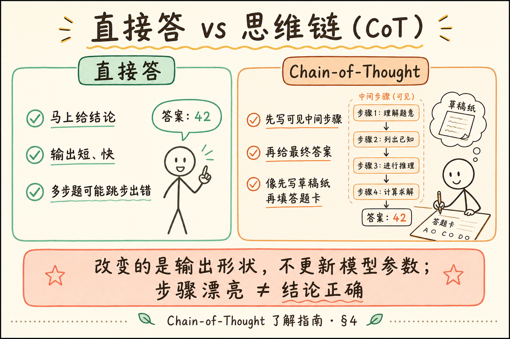
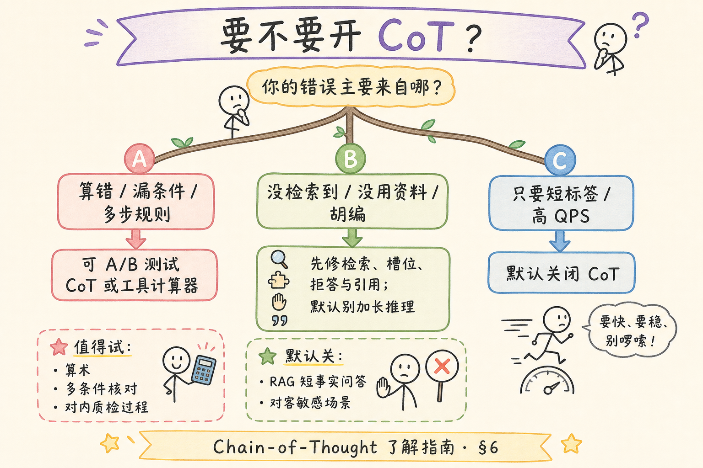
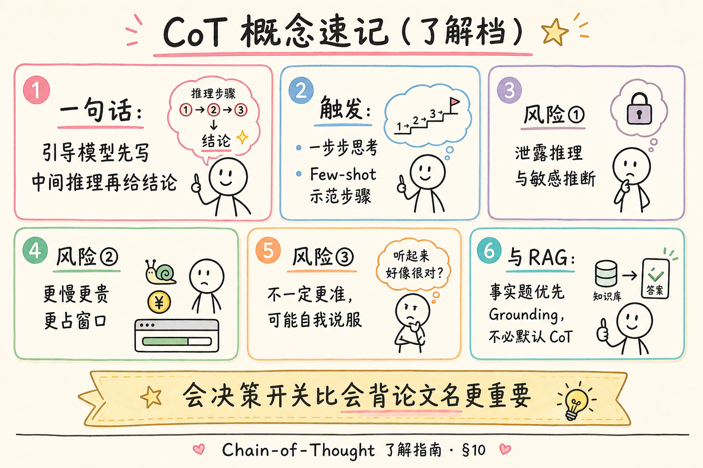

# NLP / IR / LLM 基础（十六）：Chain-of-Thought（思维链）了解指南

> **要不要读本篇？**  
> - **建议读（约 15～25 分钟）**：你已经会拼 [messages 角色](30.prompt-roles-tutorial.md)，想知道网上常说的「让模型一步步想」到底是什么、**何时开、何时别开**。  
> - **可以先跳过**：你当前只做「检索资料 → 据资料短答」的企业 FAQ，且排期紧——先把检索质量、引用与拒答做稳；本篇是路线图第 **39** 条的 **了解档**，不阻塞主线交付。  
> - **读完应带走的三句话**：① CoT 是引导模型写出中间推理步骤；② 它会更慢、可能泄露推理、且 **不保证更准**；③ **RAG 事实题默认不必强行 CoT**，证据够就直接答。

这篇是 [企业 RAG 路线图](ENTERPRISE_RAG_ROADMAP.md) **B 轨第十六篇**（路线图第 **39** 条）。前置：[30 提示词角色](30.prompt-roles-tutorial.md)；[31 Few-shot](31.few-shot-prompting-tutorial.md) 可选。

---

## 目录

1. [要不要读（章首决策）](#1-要不要读章首决策)
2. [前言：从「直接答」到「先写草稿再答」](#2-前言从直接答到先写草稿再答)
3. [本文边界](#3-本文边界)
4. [CoT 是什么：一步步想的提示技巧](#4-cot-是什么一步步想的提示技巧)
5. [常见写法：一句话触发与示范推理](#5-常见写法一句话触发与示范推理)
6. [何时值得用](#6-何时值得用)
7. [风险：泄露、变慢、不一定更准](#7-风险泄露变慢不一定更准)
8. [和 RAG：事实题未必需要](#8-和-rag事实题未必需要)
9. [最小对照实验（可选）](#9-最小对照实验可选)
10. [综合概念地图](#10-综合概念地图)
11. [常见陷阱与 FAQ](#11-常见陷阱与-faq)
12. [总结与系列下一步](#12-总结与系列下一步)

---

## 1. 要不要读（章首决策）

用一张表快速决定你的阅读深度：

| 你的现状 | 建议 |
|----------|------|
| 正在调「数学/逻辑/多步规则」类提示 | **精读** §4～§7，做 §9 对照 |
| 正在做企业知识库问答（制度/手册） | **略读** §8 + 概念地图即可 |
| 还不会 system/user/assistant | 先回 [第 30 篇](30.prompt-roles-tutorial.md) |
| 只想面试能解释名词 | 读 §4、§7、§8 三节 |

**了解档含义：** 要求你能 **解释与决策**，不要求你在生产默认开启 CoT，也不要求研究论文级变体（ToT、自洽采样等只需闻名）。

---

## 2. 前言：从「直接答」到「先写草稿再答」

人算「17×24」时，常在草稿纸上拆步；若逼自己「秒答」，更容易错。  
对大模型，有时也一样：若提示只说「给出答案」，它可能跳步；若提示说「一步步推理，最后再给答案」，中间 token 变成 **显式草稿**，某些任务上正确率会上升。

但草稿也有代价：更长、更贵、更慢；草稿里可能出现不该给用户看的内容；而且——**草稿写得漂亮 ≠ 结论正确**。

**Chain-of-Thought（CoT，思维链 / 链式思考）**：通过提示（或示例）引导模型在给出最终答案前，生成 **显式的中间推理步骤** 的技术。  
通俗说：请模型先把草稿纸写出来，再写答题卡上的最终答案。

**读完本文（若你选择精读），你应该能做到：**

1. 用一句话定义 CoT，并写出一种最小触发提示。  
2. 列出至少三类「值得尝试 CoT」与三类「不必默认开启」的场景。  
3. 说明泄露推理、延迟成本、准确性不确定这三类风险。  
4. 解释为何 RAG 据资料答题常常 **更需要 Grounding，而不是更长推理**。  
5. （可选）跑通 §9 的有/无 CoT 对照。

---

## 3. 本文边界

**档位：了解档。**

**本文讲：** CoT 直觉、触发写法、适用场景、风险、与 RAG 关系、最小对照。  
**本文不讲：** 训练期的过程监督、o1 类「内置长思考」产品的内部实现、Tree-of-Thoughts 实装、完整 Agent 规划框架。

**环境：** 概念为主；§9 需可选 API Key。

---

## 4. CoT 是什么：一步步想的提示技巧

读下图，建立「直接答 vs 先推理再答」的并排直觉。




对照上图：CoT 改变的是 **输出过程的形状**，不是给你一台新模型；也 **不更新** 参数（仍属提示词杠杆，见 [24 预训练与微调](24.pretrain-finetune-tutorial.md)）。

### 4.1 它在优化什么直觉

| 无 CoT | 有 CoT（显式） |
|--------|----------------|
| 直接跳到结论 | 先列中间命题/计算 |
| 输出短 | 输出长 |
| 难检查「哪步错」 | 有时可从步骤定位错误（不保证） |

### 4.2 和「模型内部一定在想」的区别

提示 CoT 得到的是 **可见的文本步骤**。  
模型内部是否「真的」按人的逻辑在想，你无法从黑盒 API 证实。工程上只关心：**可见步骤是否提升你的任务指标，以及成本/风险是否可接受。**

### 4.3 相关名词（门牌）

**Step-by-step reasoning**（逐步推理）：与 CoT 口语近义，强调分步。  
**Scratchpad**（草稿纸）：把中间计算写在输出里的比喻说法。  
**Answer-only**（只答结论）：要求最终答案，不展示推理（可用「内心想、嘴上只说结论」类指令，效果因模型而异）。

---

## 5. 常见写法：一句话触发与示范推理

### 5.1 零样本 CoT 触发语

经典短句（中英均可，按模型习惯选）：

```text
请一步步思考，然后给出最终答案。
```

或：

```text
Let's think step by step.
```

把它放在 **本轮 user 末尾** 或写进 system 的任务说明里。对部分模型有效，对部分模型几乎无感——**要实测**。

### 5.2 Few-shot CoT

在 [第 31 篇](31.few-shot-prompting-tutorial.md) 的示例里，让 assistant 示范「带步骤的回答」：

```text
用户：……
助手：步骤1：……
步骤2：……
最终答案：……
```

这叫用例子教会「答题版式」，比单靠一句「请逐步思考」更稳，但也更占窗口。

### 5.3 结构化输出：步骤与结论分离

企业里更实用的是 **强制结构**：

```text
【推理】
（可对内日志；对用户可隐藏）
【结论】
……
【依据】
[1] …
```

甚至：推理只写在服务端日志，对用户只流式返回结论——见 §7 泄露风险。

---

## 6. 何时值得用

读决策图，避免「网上都在说 CoT，所以我默认打开」。




对照上图：**多步演算/规则组合可以试；短事实检索问答默认关。**

### 6.1 更值得尝试的场景

| 场景 | 原因 |
|------|------|
| 算术、单位换算、日期计算 | 跳步易错 |
| 多条件规则引擎式问答 | 需要逐条核对条件 |
| 从长文本做多跳归纳（非简单摘录） | 中间命题可辅助组织 |
| 需要可检查的「解题过程」给老师/质检 | 过程本身是交付物 |

### 6.2 通常不必默认开启

| 场景 | 原因 |
|------|------|
| RAG 短事实：「年假几天？」+ 资料已含答案 | 关键是引用对，不是长推理 |
| 高 QPS 客服 | 延迟与 token 成本敏感 |
| 输出必须极短（按钮文案、标签） | CoT 与目标冲突 |
| 强监管、推理可能含敏感推断 | 泄露与合规风险 |

### 6.3 决策口诀

```text
若错误主要来自「没检索到 / 资料冲突」→ 先修检索与提示槽位，不先加 CoT
若错误主要来自「算错 / 漏条件」→ 可 A/B 测试 CoT 或工具计算器
若错误主要来自「胡编」→ 加强 Grounding 与拒答，而不是更长的自我说服
```

---

## 7. 风险：泄露、变慢、不一定更准

了解档最重要的不是「会背定义」，而是 **会怕对的东西**。

### 7.1 泄露推理（Information leakage）

**推理泄露**：中间步骤把不该暴露的信息写给了终端用户或日志未脱敏渠道。  
通俗说：草稿纸上写了「根据内部未公开草案……」，结果直接展示给用户。

可能泄露的内容包括：

- 系统提示片段（模型复述规则时）；  
- 未授权的检索片段（本不该进答案的敏感 chunk）；  
- 对用户的不当推断（歧视性、隐私猜测）；  
- 安全策略的绕过思路（模型「思考如何忽略规则」）。

缓解：

- 对用户只返回【结论】；推理留在服务端或丢弃；  
- 敏感场景用更强的输出过滤；  
- 不要假设「写了逐步思考就更安全」——有时反而更多废话可攻击面。

### 7.2 变慢与变贵

中间步骤显著增加生成 token：

- 延迟上升（流式也要等更长）；  
- 费用上升；  
- 挤占上下文窗口（与 RAG 资料抢预算）。

### 7.3 不一定更准

实证与工程经验都支持这句话：

> CoT **有时** 提升某些推理任务；在另一些任务上持平甚至变差（冗长、自我说服、步骤错但结论「看起来完整」）。

因此：

- 用 **评测集** 决定开不开，不要用博客标题决定；  
- 对事实问答，优先测「有无资料、引用是否正确」；  
- 出现「步骤很帅、结论很错」时，加校验或工具，而不是加更长 CoT。

### 7.4 自我说服式幻觉

模型可能用长推理 **圆一个错答案**。  
更长的错误推理，会让人工审核更难一眼识破——这是质检负担，不是自动胜利。

---

## 8. 和 RAG：事实题未必需要

企业 RAG 的主路径常常是：

```text
问题 → 检索 → 把【资料】放进 messages → 要求据资料短答并引用
```

这里的失败模式，前几名通常是：

1. 没召回对的 chunk；  
2. 召回了但模型没用；  
3. 资料冲突未处理；  
4. 权限过滤后资料为空却硬答。

这些用 CoT **很少对症**。对症的是：混合检索、重排、提示槽位（第 30 篇）、拒答、引用校验（路线图 40～41）。

### 8.1 何时 RAG + CoT 仍可能有用

- 资料里有多条规则，需要 **交叉核对** 才能下结论；  
- 要把表格中的数字做 **二次计算**；  
- 需要输出「质检可读」的核对清单（对内）。

即便如此，也建议：

```text
【核对步骤】（对内）
【最终答复】（对用户）
【引用】
```

并在产品层决定用户是否可见核对步骤。

### 8.2 和 Few-shot 的分工

| 技术 | 更擅长 |
|------|--------|
| Few-shot | 锁定格式、口径、拒答版式 |
| CoT | 诱导多步中间计算/条件展开 |
| RAG | 提供私有事实证据 |

可以同时出现：few-shot 示范「如何短拒答」，不必示范三千字推理。

### 8.3 排障口令（贴在工位）

当你觉得「再让它想想就会好」时，先问三句：

1. **资料在不在 messages 里？** 不在 → 修检索/拼装，不是加 CoT。  
2. **资料在但模型没用？** → 加强「只根据【资料】」契约与引用校验。  
3. **资料在且用了，但算错/漏条件？** → 这时才值得开 CoT 或改用计算器工具。

这三句能挡住大半「了解档知识被误用成默认开关」的事故。

---

## 9. 最小对照实验（可选）

> **要不要做本节？** 若你只了解概念，可跳过。若你要写进团队规范「默认关 CoT」，建议跑一遍留下截图。

**演示什么：** 同一道小逻辑题，对比有/无「一步步思考」。  
**前置：** `openai`、Key。  
**预期：** 观察步骤长度与对错；**不要**假设有 CoT 一定赢。

```python
"""了解档实验：有/无 CoT 的输出形状对照。"""
import os
from openai import OpenAI

client = OpenAI(api_key=os.environ["OPENAI_API_KEY"])
MODEL = "gpt-4o-mini"

problem = (
    "商店苹果 3 元一个，梨 4 元一个。"
    "小明买了 2 个苹果和 3 个梨，付了 20 元。"
    "应找回多少元？只关心最终数字是否正确。"
)

def ask(extra: str) -> str:
    messages = [
        {"role": "system", "content": "你是算术助手。"},
        {"role": "user", "content": problem + "\n" + extra},
    ]
    resp = client.chat.completions.create(
        model=MODEL,
        messages=messages,
        temperature=0,
    )
    return resp.choices[0].message.content or ""

print("=== 直接答 ===")
print(ask("直接给出最终答案（元）。"))
print("=== CoT ===")
print(ask("请一步步思考，最后用『最终答案：X元』结尾。"))
```

代码后解读：正确找回应是 `20 - (2*3 + 3*4) = 2` 元。把两边输出贴进笔记：长度差多少、有无算错。换一道 **RAG 事实题**（资料里写死「年假 15 天」）再试一次——你会更常看到：CoT 变长，但对「15」这个事实没有额外帮助。

### 9.1 先错后对（产品层）

**错：** 把完整 CoT 默认展示在对客聊天气泡。  
**对：** 默认展示结论与引用；推理仅调试模式可见。

**错：** 全站 system 写死「必须逐步思考」。  
**对：** 按任务类型开关；事实问答默认关。

### 9.2 和「工具调用」差在哪（门牌）

有人把「先搜索再回答」「先算再答」也叫思维链。工程上建议分开说：

- **文本 CoT**：中间步骤是自然语言段落；  
- **工具多步**：中间步骤是真实 API/SQL/计算器调用。

后者往往更可控（算错可复现），成本模型也不同。了解档只需记住：**需要硬计算时，优先工具，而不是更长的散文推理。**

---

## 10. 综合概念地图




对照上图：了解定义 → 会决策开关 → 记住三大风险 → RAG 事实题先 Grounding。

### 10.1 速记表

| 概念 | 一句话 |
|------|--------|
| CoT | 先写可见推理再答 |
| 触发 | 「一步步思考」或示范步骤 |
| 好处 | 某些多步题可能更稳 |
| 风险 | 泄露、变慢、未必更准 |
| RAG | 事实题优先证据，不必默认 CoT |

---

## 11. 常见陷阱与 FAQ

1. **把 CoT 当幻觉特效药**——长推理可能加重自我说服。  
2. **与窗口抢预算**——资料被推理挤掉，得不偿失。  
3. **面试背「CoT 一定涨点」**——表述为「常用于多步推理，需评测」。  
4. **忽略产品展示策略**——对客暴露内部推理。  
5. **和 Agent 规划混淆**——工具调用多步 ≠ 文本 CoT（相关但不是同一章）。

**Q：新模型「自带长思考」还要提示 CoT 吗？**  
A：读厂商文档。有的产品把思考放在独立通道；重复提示可能浪费。原则不变：用指标决策。

**Q：CoT 要配更高 temperature 吗？**  
A：对比实验先用低温度；提高温度会增加发散，未必利推理。

**Q：能否只让模型「内心 CoT」不输出？**  
A：可尝试「不要展示推理，直接给答案」；是否仍在内部受益因模型而异，不可假设。

---

## 12. 总结与系列下一步

1. CoT = 引导模型产出 **显式中间步骤** 再给结论。  
2. 对多步计算/条件组合可 A/B；对短事实 RAG **默认不必开**。  
3. 记住风险：**泄露、变慢、不一定更准**。  
4. 了解档目标：会解释、会决策，不追求论文复现。  
5. 主线继续把角色槽位、Few-shot 格式、检索与 Grounding 做扎实。

### 12.1 系列下一步

| 目标 | 阅读 |
|------|------|
| 角色与 messages | [30](30.prompt-roles-tutorial.md) |
| Few-shot | [31](31.few-shot-prompting-tutorial.md) |
| 幻觉成因 | [33 幻觉成因](33.llm-hallucination-tutorial.md) |
| Grounding 与引用 | 路线图 **41** |
| 闭源 API 调用模式 | 路线图 **42** |

### 12.2 学习目标自检

- [ ] 能一句话定义 CoT  
- [ ] 能说出何时开/何时关  
- [ ] 能列举三类风险  
- [ ] 能解释 RAG 事实题为何不默认 CoT  
- [ ] （可选）完成 §9 对照  

---

> **初学者可能仍困惑的点**  
> - 「一步步想」是提示策略，不是保证正确的证明过程。  
> - 看到模型写出漂亮步骤，仍要用答案键或资料核对。  
> - 下一阶段重点转向：幻觉、Grounding、引用归因——那才是企业问答的胜负手。
