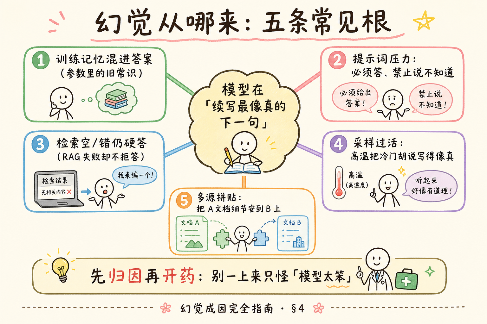
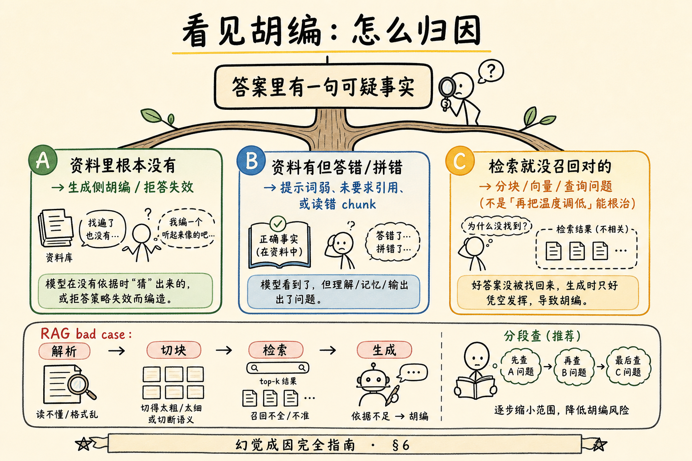
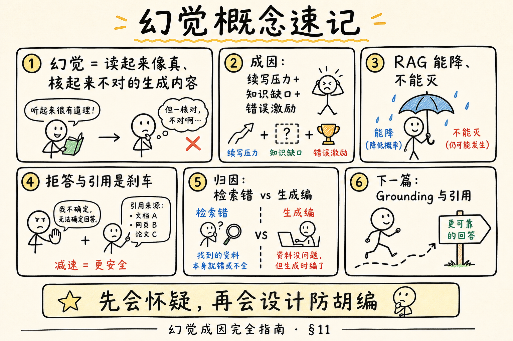

# NLP / IR / LLM 基础（十五）：幻觉（Hallucination）成因完全指南

> 你已经会调 [提示词角色](30.prompt-roles-tutorial.md)、会控 [采样温度](29.llm-sampling-tutorial.md)、也知道 [RAG](ENTERPRISE_RAG_ROADMAP.md) 要把资料塞进上下文。可上线第一周，客服仍可能截图质问：「机器人说年假 20 天，手册明明写 10 天——它是不是坏了？」这篇讲的不是「模型坏了」，而是 **幻觉**：读起来像真的、核起来不对的生成内容。本篇是 [企业 RAG 路线图](ENTERPRISE_RAG_ROADMAP.md) **B 轨收束之一**（路线图第 **40** 条），为下一篇 Grounding（落地/锚定）做铺垫。前置建议读过第 29～30、35 篇。

---

## 目录

1. [前言：为什么「说得真」比「说得对」更危险](#1-前言为什么说得真比说得对更危险)
2. [幻觉是什么（先立定义）](#2-幻觉是什么先立定义)
3. [模型本来在干什么：续写，不是查百科](#3-模型本来在干什么续写不是查百科)
4. [五条常见成因](#4-五条常见成因)
5. [RAG 能降幻觉，不能消灭幻觉](#5-rag-能降幻觉不能消灭幻觉)
6. [看见胡编：怎么归因](#6-看见胡编怎么归因)
7. [缓解手段地图（本篇点名，下篇展开）](#7-缓解手段地图本篇点名下篇展开)
8. [最小示例：逼出一次「像真的胡编」](#8-最小示例逼出一次像真的胡编)
9. [什么时候「看起来像幻觉」其实不是](#9-什么时候看起来像幻觉其实不是)
10. [综合概念地图](#10-综合概念地图)
11. [常见陷阱与 FAQ](#11-常见陷阱与-faq)
12. [总结与系列下一步](#12-总结与系列下一步)

---

## 1. 前言：为什么「说得真」比「说得对」更危险

错别字机器人大家一眼能识破。可怕的是：语气镇定、条目清晰、还写「根据公司规定」——内容却是 **凭空续写** 出来的。

对初学者，这会带来两种错误反应：

1. 「大模型不能用」——放弃整条技术路线；  
2. 「再换一个更强的模型就好」——忽略提示词、检索、拒答设计。

更有用的态度是：**把它当成会一本正经编故事的实习生**——能力强，但必须给资料、给红线、给验收。

**读完本文，你应该能做到：**

1. 用自己的话定义幻觉，并举一个企业场景例子。  
2. 说明「续写下一个词」为何天然可能编造。  
3. 列出至少四条常见成因，并对应到可改的杠杆。  
4. 区分「检索错了」与「生成编了」。  
5. 解释为何 RAG 降低幻觉却不能保证为零。  
6. 在坏案例上写出简短归因路径。

**前置**：[29 采样](29.llm-sampling-tutorial.md)、[30 角色](30.prompt-roles-tutorial.md)、[28 上下文窗口](28.context-window-tutorial.md)；有 [25 Embedding](25.embedding-vector-tutorial.md) 更佳。  
**环境**：概念为主；§8 可选 API Key。  
**本文边界（地基篇）**：讲清 **成因与归因**；**不讲** 完整引用 UI、评测指标公式（RAGAS Faithfulness 在 E 轨）、法律合规细则。落地手段详见下一篇 Grounding。

---

## 2. 幻觉是什么（先立定义）

**幻觉**（Hallucination，在 LLM 语境）：模型生成的内容在流畅性、自信度上像真实陈述，但与事实、给定资料或可核验来源 **不一致或无法核验**。  
通俗说：**一本正经地胡说**——不是随机乱码，而是「假得像样」。

注意消歧：

- 不是医学或心理学诊断术语；  
- 也不等于「模型所有错误」（算术算错、格式崩了，有时另归类）；  
- 企业里最关心的是：**把假制度、假数据说成真的**。

读下图：水面以上是用户看到的「真」，水面以下是核验后的「编」。


对照上图：产品验收不能停在「读起来通顺」；要问「这句话的证据在哪」。

### 2.1 两种常被混谈的子类（了解即可）

| 说法 | 白话 | 例子 |
|------|------|------|
| 事实性胡编 | 世界上/资料里没有这回事 | 捏造「第 18 条年假 20 天」 |
| 忠实性胡编 | 资料有，但回答歪曲/拼错 | 资料写 10 天，答成 15 天；或把 A 部门政策安到 B |

RAG 场景两者都常见；归因时先问：**资料里有没有、有没有被用对**。

---

## 3. 模型本来在干什么：续写，不是查百科

回顾：解码器类大模型训练目标大致是 **根据上文预测下一个 token**（见 [24 预训练](24.pretrain-finetune-tutorial.md)）。  
通俗说：它在练「这句话后面怎样接最像人话」，不是练「打开你们内网 Wiki 核对」。

因此：

- 没有资料时，它会用 **参数里的统计记忆** 补全——记忆可能过时、错位、张冠李戴；  
- 有资料但指令弱时，它仍可能 **忽略资料** 去写更「顺」的句子；  
- 你要求「必须给出明确数字」时，它可能 **编一个像样的数字** 来满足格式。

**严格结论**：幻觉不是偶发 Bug 标签，而是 **生成式目标 + 知识边界不清 + 错误激励** 的常见副作用。RAG、拒答、引用，是工程上的刹车，不是魔法消除键。

---

## 4. 五条常见成因

读下图时，从中心「续写」出发，看五条辐条各对应哪类改法。




对照上图：开药前先归因——检索问题别只调温度。

### 4.1 训练记忆混进答案

模型在海量公开文本上预训练，参数里压缩了大量「像常识的东西」。问到你们 **未公开** 的制度时，它可能用 **别的公司/旧新闻/论坛传言** 的模式来补。

缓解方向：强制「只根据资料」；资料不足则拒答；不要默认信任参数记忆。

### 4.2 提示词压力：禁止说不知道

若系统提示写「你必须回答用户所有问题」「不要说我不知道」，等于奖励胡编。  
通俗说：领导说「不准交白卷」——实习生就会编。

缓解：明确允许并示范拒答（见 Few-shot / 角色篇）。

### 4.3 检索空或错，仍硬答

RAG 链路里，若 top-k 为空、或不相关，却仍要求「根据资料作答」，模型常会：

- 假装根据了资料；或  
- 忽略资料自己编。

缓解：检索层设阈值；生成前检查「有没有可用证据」；无证据走拒答模板。

### 4.4 采样过活

[温度](29.llm-sampling-tutorial.md) 过高时，低概率胡说更容易被抽中，且读起来仍通顺。  
事实问答默认低温；高温留给头脑风暴，且要人工筛选。

### 4.5 多源拼贴与张冠李戴

同时塞入多段 chunk 时，模型可能把 A 的数字接到 B 的主语上——「每段都像有出处，整句却是假的」。

缓解：要求行内引用/脚注；限制每段职责；重排后少而精。

---

## 5. RAG 能降幻觉，不能消灭幻觉

**RAG**（检索增强生成）：先找资料再生成，把「开卷」变成默认动作。  
它降低幻觉的路径是：**减少无依据的自由发挥**。

但它 **不能** 保证：

| 仍可能胡编的情况 | 原因 |
|------------------|------|
| 检索漏了 | 没证据却硬答 |
| 检索到错的 | 忠实地根据错资料答（有时叫「被错误 grounding」） |
| 资料对但未遵守 | 忽略上下文 |
| 拼贴错误 | 多 chunk 组合错 |
| 引用伪造 | 写了「见资料3」但资料3没有这句 |

所以企业话术应是：「RAG **显著降低** 无依据胡编的概率，并让错误 **可追溯**」——而不是「上了 RAG 就不会错」。

### 5.1 一个对照小故事

同一问题：「试用期可以请年假吗？」

- **无 RAG**：模型可能根据「一般劳动法常识」编一套听起来合理的流程。  
- **有 RAG 但资料未命中**：若系统仍禁止拒答，模型可能继续编，还加上「根据手册」。  
- **有 RAG 且命中 + 要求引用**：答案应能指回具体 chunk；手册若写「试用期不享受年假」，引用应能点开核验。

三种体验的差别，不在「模型智商」，而在 **有没有证据约束**。下一篇 Grounding 会把第三种写成可运行模板。

### 5.2 和「搜索摘要出错」的异同

搜索引擎也可能给出过时结果，但通常带链接，用户习惯点开核对。聊天机器人若 **不带可点来源**，用户更容易把流畅句子直接当制度。因此企业助手比「随便聊聊」更需要引用与拒答——不是因为模型更差，而是因为 **决策成本更高**。

---

## 6. 看见胡编：怎么归因

读下图决策树，拿着一句可疑答案往下走。




对照上图：先分清「库里有没有」与「模型有没有用对」。

### 6.1 实操检查单（可打印）

1. 把当次注入的 **全部资料** 贴出来（或从日志取出）。  
2. 用搜索找答案中的关键数字/专名是否出现在资料中。  
3. 若无 → 生成胡编或拒答失效。  
4. 若有但被歪曲 → 提示词/引用约束不足，或模型未遵循。  
5. 若资料本身就不该被召回 → 回查分块、Embedding、查询改写、过滤条件。  
6. 记录：`query`、`chunk_ids`、`model`、`temperature`、完整 `messages`——否则无法复现。

这与路线图 E 轨 Bad Case 归因（解析/切块/检索/生成）同一思路。

### 6.2 日志里最少要留什么

没有日志，幻觉会变成「用户说它错了，你却复现不了」。最低字段建议：

| 字段 | 用途 |
|------|------|
| `request_id` | 串联前后端 |
| `query` | 用户原话 |
| `retrieved_chunk_ids` + 原文快照或哈希 | 判断当时到底塞了什么 |
| `messages` 或提示词模板版本 | 判断指令是否禁止拒答 |
| `model` / `temperature` | 排除采样与换模干扰 |
| `answer` + 可选 `citations` | 对照核验 |

初学阶段用本地 JSON 行日志即可；上线后再接 Langfuse 等观测（路线图 E）。

---

## 7. 缓解手段地图（本篇点名，下篇展开）

| 手段 | 主要打哪类成因 | 深入 |
|------|----------------|------|
| 拒答策略 | 无证据硬答 | 下一篇 + C6 |
| 引用归因 | 拼贴、假「根据资料」 | **下一篇 Grounding** |
| 低温 + 结构化输出 | 采样过活、格式漂移 | 第 29、C6 |
| 检索阈值 / 重排 | 错资料进上下文 | C4 |
| 分块与清洗 | 资料质量差 | C1～C2 |
| 人工评测集 | 不知变好还是变坏 | E 轨 |

本篇任务是 **会怀疑、会归因**；下一篇任务是 **会设计刹车**。

---

## 8. 最小示例：逼出一次「像真的胡编」

### 8.1 阅读说明

**演示什么**：在无资料、高压提示下，模型可能编造制度细节。  
**前置**：可选 `openai` 与 API Key；无 Key 可只读。  
**预期**：回答里出现具体数字/流程，但你并未提供任何手册——这些数字 **不可信**。

```python
# 警告：本示例用于观察「无资料高压提示」的风险，不要当正确答案。
import os
from openai import OpenAI

client = OpenAI(api_key=os.environ.get("OPENAI_API_KEY"))

resp = client.chat.completions.create(
    model="gpt-4o-mini",
    temperature=0.8,  # 故意偏活，更容易花样编
    messages=[
        {
            "role": "system",
            "content": "你是本公司人事专家。必须给出明确天数与步骤，禁止说不知道。",
        },
        {
            "role": "user",
            "content": "我们公司核心员工的带薪年假到底是多少天？请写三条办理步骤。",
        },
    ],
)
print(resp.choices[0].message.content)
```

代码后解读：若输出很具体，请立刻问自己——**证据在哪？** 没有手册 chunk，任何天数都只是续写。把 system 改成「资料不足必须说不知道」，再跑一次对比，体感会非常明显。

### 8.2 先错后对

**错：** 上线提示写「不准说不知道」，又无 RAG。  
**对：** 允许拒答 + 检索无命中则走拒答模板。

**错：** 用户投诉胡编，只把温度从 0.2 调到 0.1。  
**对：** 先查当次资料与引用；温度是微调，不是根治。

---

## 9. 什么时候「看起来像幻觉」其实不是

| 现象 | 可能其实是 |
|------|------------|
| 答错了，但资料里就写错 | 知识库质量 / 版本问题 |
| 两份制度冲突，模型选了 A | 治理问题，需冲突策略 |
| 用户问题含糊，模型选了一种理解 | 澄清问句缺失 |
| 摘要压缩导致细节丢失 | 窗口与压缩策略问题 |

归因时避免一棒子打成「幻觉」——否则会改错模块。

---

## 10. 综合概念地图




对照上图：先会怀疑，再会设计防胡编；下一篇进入 Grounding。

### 10.1 速记表

| 概念 | 一句话 |
|------|--------|
| 幻觉 | 像真的、核不对的生成 |
| 续写目标 | 预测下一词，不是查库 |
| 拒答 | 无证据时的合法出口 |
| 忠实性 | 是否忠实于给定资料 |
| 归因 | 分检索错 vs 生成编 |

---

## 11. 常见陷阱与 FAQ

1. **用更强模型替代验收** → 强模型胡编写得更像真。  
2. **只看用户满意度** → 用户可能被流畅度说服。  
3. **RAG 后不再做拒答** → 空检索仍会编。  
4. **伪造引用格式** → 比不引用更危险。  
5. **把 CoT 当抗幻觉银弹** → 步骤漂亮也可能自我说服（见第 32 篇）。

**Q：幻觉能测出来吗？**  
A：能。用黄金问答集 + 人工或自动忠实度检查；E 轨 RAGAS Faithfulness 等会展开。

**Q：开源模型是不是更爱幻觉？**  
A：不一定。关键看任务、提示、检索与对齐；不要用品牌替代评测。

**Q：和「搜索引擎出错」一样吗？**  
A：相似处是都可能错；不同处是生成式错误常 **更流畅、更难一眼识破**，且可能无链接可点。

---

## 12. 总结与系列下一步

1. 幻觉是生成式系统的常见副作用，不是偶发标签。  
2. 成因常在：记忆混入、禁止拒答、检索失败仍硬答、高温、拼贴。  
3. RAG 降风险、提可追溯，但不归零。  
4. 坏案例先归因再改参。  
5. 下一篇把「刹车」做成 Grounding 与引用。

### 12.1 系列下一步

| 目标 | 阅读 |
|------|------|
| 引用与落地 | [34 Grounding 与引用](34.grounding-citation-tutorial.md) |
| API 调用模式 | [35 OpenAI 兼容 API](35.openai-compatible-api-tutorial.md) |
| 采样与角色回顾 | [29](29.llm-sampling-tutorial.md) / [30](30.prompt-roles-tutorial.md) |

### 12.2 自检

- [ ] 能定义幻觉并举例  
- [ ] 能列出 ≥4 条成因  
- [ ] 能走完归因检查单  
- [ ] 能说明 RAG 的能力边界  

---

> **初学者可能仍困惑的点**  
> - 「模型说根据资料」不等于真的根据了——要看引用能否点回原文。  
> - 内部文档互相矛盾时，需要产品规则，不是只靠更大模型。  
> - 下一篇会动手设计：无证据拒答、有证据带引用编号。
