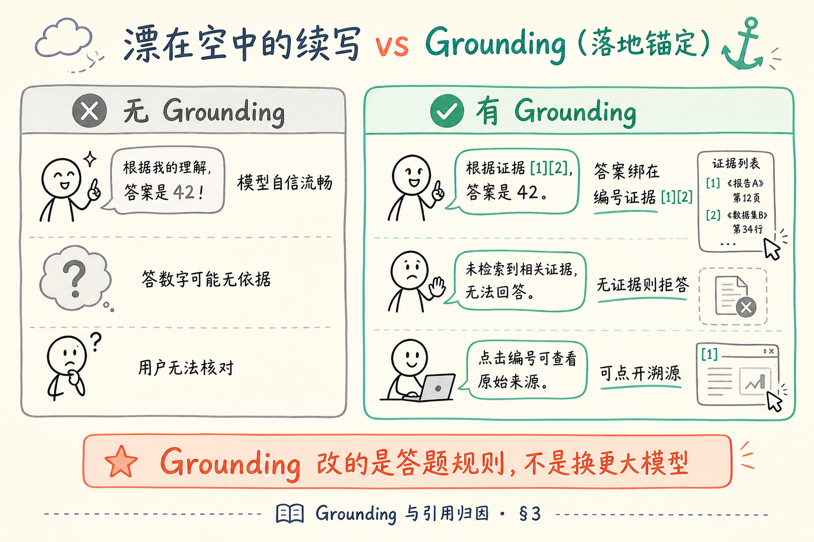
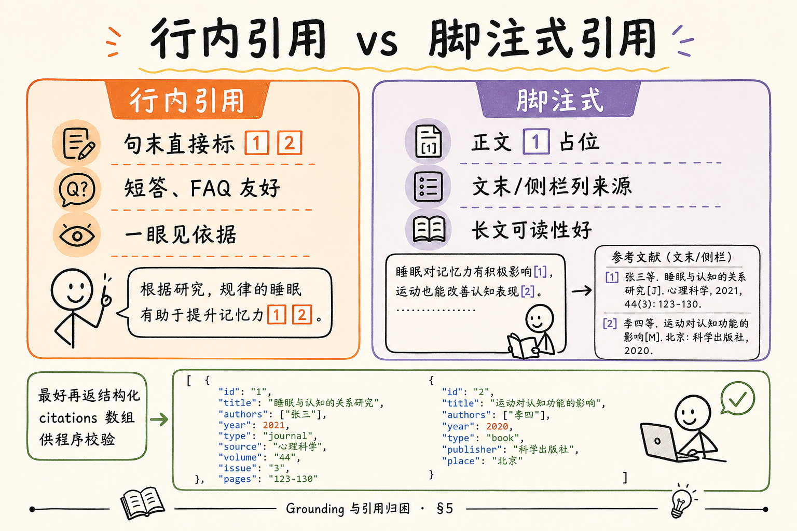
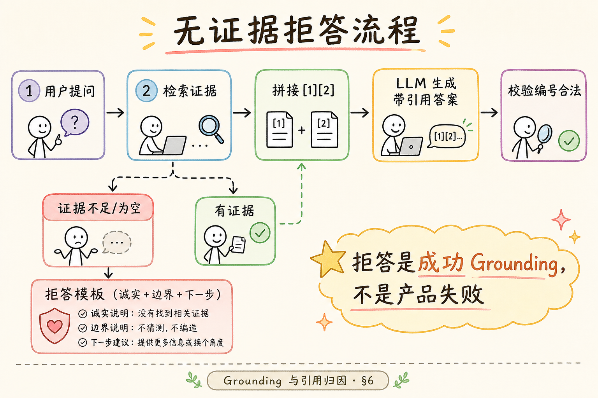
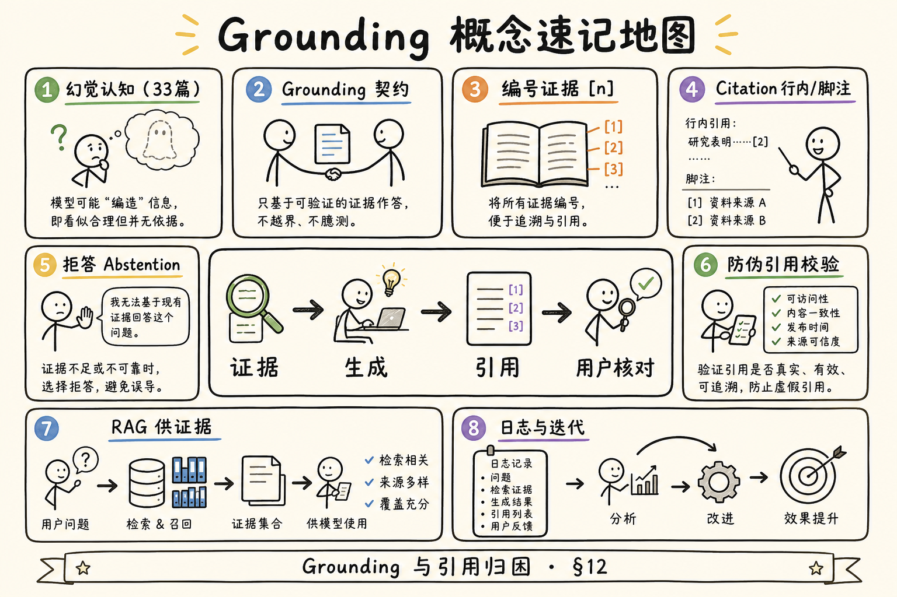

# NLP / IR / LLM 基础（十七）：Grounding 与引用归因完全指南

> 你已经读过 [幻觉成因](33.llm-hallucination-tutorial.md)：模型会一本正经地续写。上线企业问答时，用户真正要的不是「听起来专业」，而是 **能点回原文、敢拒答、敢承认不知道**。这篇把刹车做成工程：**Grounding（落地/锚定）** 与 **引用归因（Citation）**——让答案绑在证据上，而不是绑在模型的自信上。本篇是 [企业 RAG 路线图](ENTERPRISE_RAG_ROADMAP.md) **B 轨第十七篇**（路线图第 **41** 条），定位 **主线篇**。前置：[30 提示词角色](30.prompt-roles-tutorial.md)、[33 幻觉](33.llm-hallucination-tutorial.md)；有 [25 Embedding](25.embedding-vector-tutorial.md) 更佳。

---

## 目录

1. [前言：从「像真的」到「能核对」](#1-前言从像真的到能核对)
2. [本文边界与动手路径](#2-本文边界与动手路径)
3. [Grounding 是什么：答案必须长在证据上](#3-grounding-是什么答案必须长在证据上)
4. [引用归因：让用户看见证据从哪来](#4-引用归因让用户看见证据从哪来)
5. [行内引用 vs 脚注：两种展示习惯](#5-行内引用-vs-脚注两种展示习惯)
6. [拒答：无证据时不硬编](#6-拒答无证据时不硬编)
7. [提示词槽位：把规矩写进 System](#7-提示词槽位把规矩写进-system)
8. [综合实战：带引用编号的 messages 可运行示例](#8-综合实战带引用编号的-messages-可运行示例)
9. [综合实战：拒答模板与边界话术](#9-综合实战拒答模板与边界话术)
10. [先错后对：伪造引用与无证据硬答](#10-先错对对伪造引用与无证据硬答)
11. [工程清单：校验、UI 与观测](#11-工程清单校验ui-与观测)
12. [综合概念地图](#12-综合概念地图)
13. [常见陷阱与 FAQ](#13-常见陷阱与-faq)
14. [总结与系列下一步](#14-总结与系列下一步)

---

## 1. 前言：从「像真的」到「能核对」

客服截图里最常见的一句质问是：「你们机器人说年假 20 天，手册写 10 天——依据呢？」  
若你只能回答「模型是这么生成的」，产品就输了。用户要的是 **可核对**：点开引用，看到第几章第几条；若资料里没有，就明确说 **不知道**，而不是用流畅语气把缺口糊上。

[第 33 篇](33.llm-hallucination-tutorial.md) 讲清了「为什么会编」；本篇讲 **怎么把编的概率压下去，并把剩下的风险变成可审计**。核心动作只有两个：

1. **Grounding**：生成时必须以给定证据（检索 chunk、上传段落、数据库字段）为锚，不得凭空补全关键事实。  
2. **Citation**：把用了哪段证据 **显式标出来**，最好带编号，方便前端做成可点击溯源。

**Grounding**（落地 / 锚定）：约束模型回答必须基于、且不得超出所提供证据范围的技术与产品策略集合。  
通俗说：答题卡上的每一句「公司规定」，都要能在你发的 **参考资料** 里找到对应句子；找不到就停笔。

**Citation**（引用 / 归因）：在答案中标注信息来源（文档名、页码、chunk 编号、段落 ID 等），使用户可回溯核验。  
通俗说：像写论文加 `[1][2]`，只不过你的 `[1]` 应该能点开看到原文。

**读完本文，你应该能做到：**

1. 用一句话区分 Grounding 与 Citation，并说明二者为何常一起出现。  
2. 手写一份带 **证据编号** 的 RAG `messages` 列表，并解释 system 里应写哪些红线。  
3. 设计 **无证据拒答** 话术，避免「资料未提及仍硬答」。  
4. 比较 **行内引用** 与 **脚注式引用** 的 UI/可读性 trade-off。  
5. 跑通 §8 可运行示例（有 Key）或跟读其数据流（无 Key）。  
6. 用 §10 对照识别「伪造引用」「无证据硬答」两类坏味道。

---

## 2. 本文边界与动手路径

**档位：主线篇。**

**本文讲：** Grounding/Citation 直觉、提示词契约、拒答设计、引用展示风格、可运行 messages 示例、先错后对、工程校验清单。  
**本文不讲：** 完整引用卡片 React 组件、RAGAS Faithfulness 公式与自动化评测流水线（E 轨）、法律免责声明起草、多跳 Agent 工具链、向量检索本身怎么调（见 C/D 轨）。

### 2.1 动手路径表

| 步骤 | 你做什么 | 验收 |
|------|----------|------|
| A | 读 §3～§4，能口述 Grounding vs Citation | 白板两格不混 |
| B | 读 §5，选一种引用展示风格并说明理由 | 能对比行内/脚注 |
| C | 抄改 §7 的 system 模板到你的笔记 | 含拒答与编号规则 |
| D | 跑 §8 可运行示例 | 答案带 `[1]` 且编号对应证据 |
| E | 故意删掉证据跑 §9 拒答对照 | 输出为拒答而非胡编 |
| F | 完成 §10 先错对对 | 能指出伪造引用 |
| G | 对照 §12 概念地图复盘 | 速记表能默写 |

**环境：** Python 3.10+；`pip install openai`；`OPENAI_API_KEY` 或兼容网关 Key + 可选 `OPENAI_BASE_URL`。无 Key 时把 §8～§9 当阅读材料，重点看 `messages` 形状与输出契约。

### 2.2 沿用前文

| 概念 | 来自 |
|------|------|
| messages 三角色与 RAG 槽位 | [30 提示词角色](30.prompt-roles-tutorial.md) |
| 幻觉成因与 RAG 边界 | [33 幻觉](33.llm-hallucination-tutorial.md) |
| 低温减少编造 | [29 采样](29.llm-sampling-tutorial.md) |
| 检索回来的是 chunk 原文 | [25 Embedding](25.embedding-vector-tutorial.md) |
| CoT 不替代证据 | [32 CoT](32.chain-of-thought-tutorial.md) |

---

## 3. Grounding 是什么：答案必须长在证据上

读下图，建立「漂在空中的续写」与「绑在证据上的回答」的并排直觉。




对照上图：Grounding 不是换更大的模型，而是 **改答题规则**——模型仍可流畅表达，但 **关键事实句** 必须能在你提供的证据集合里找到支撑；找不到支撑的事实句不允许出现（应拒答或明确标注不确定）。

### 3.1 三个层次（由弱到强）

| 层次 | 做法 | 企业常用度 |
|------|------|------------|
| L1 提示约束 | system 写「仅据资料回答」 | 起步必有，单独不够 |
| L2 引用输出 | 要求每句关键事实带 `[n]` | 强烈建议 |
| L3 后验校验 | 解析 `[n]`，核对 chunk 是否含该事实 | 上线前应规划 |

初学者常停在 L1，以为写了「不要编造」就安全了——实测中模型仍会 **礼貌地补全**。L2 让用户能看见依据；L3 防止 **引用号乱贴**（见 §10 伪造引用）。

### 3.2 Grounding 与 RAG 的关系

**RAG**（Retrieval-Augmented Generation，检索增强生成）：先检索相关资料，再交给生成模型作答的流水线。  
通俗说：开卷考试——先翻书找到几段，再答题。

RAG **提供证据**；Grounding **规定怎么用证据**。检索漏了、chunk 截断了、资料互相矛盾时，Grounding 策略决定你是 **拒答**、**并列呈现矛盾**，还是 **错误地选一个编到底**——后一种正是 [33 篇](33.llm-hallucination-tutorial.md) 警告的路径。

### 3.3 什么算「关键事实」

企业场景里建议把以下内容视为 **必须 Ground** 的硬信息：

- 数字：天数、金额、比例、人数上限  
- 日期：生效日、截止日期、版本号  
- 权限：谁能批、谁能看、例外条款  
- 流程节点：先谁后谁、是否必须附件  
- 合规红线：禁止行为、处罚条款

寒暄、总结性套话、同义改写可以宽松；但 **一旦涉及可追责的数字与规则**，必须可溯源。

### 3.4 与 CoT 的分工

[第 32 篇](32.chain-of-thought-tutorial.md) 已说明：多步推理题可试 CoT；**事实问答优先 Grounding**。  
更长推理不会自动把「年假 10 天」变正确；证据里没有时，CoT 只会写出更长的错误解释。

---

## 4. 引用归因：让用户看见证据从哪来

**Attribution**（归因）：把输出中的陈述映射回具体来源的过程。Citation 是归因在 UI 上的呈现。  
通俗说：用户问「依据呢」，你能指着 `[2]` 说「就是手册第三章第二段」。

### 4.1 为什么「模型说根据资料」不可信

模型擅长生成 **像引用的话**：「根据《员工手册》第三章……」——但手册里可能根本没有第三章，或内容与生成不符。  
工程上要把「像引用」变成 **可机读、可点击、可核对** 的结构：

1. 检索阶段给每段证据分配稳定 **编号**（或 chunk_id）；  
2. 生成阶段要求答案中出现 `[编号]`；  
3. 展示阶段把 `[1]` 渲染成链接/卡片，点开显示原文；  
4. （进阶）用规则或二次模型检查「带 `[1]` 的句子是否真的被 chunk 1 支持」。

### 4.2 编号契约（检索 → 提示 → 答案）

推荐在 user 消息里这样组织证据（与 [30 篇](30.prompt-roles-tutorial.md) RAG 槽位一致）：

```text
【参考资料】
[1] （来源：员工手册 v3.2 · 第 12 页）
年假：入职满一年享带薪年假 10 个工作日……

[2] （来源：考勤制度 · 第 3 章）
请假须提前在 OA 提交……

【用户问题】
新员工第一年有没有年假？
```

system 里写清：

- 只能使用 `[1][2]…` 中出现的信息回答关键事实；  
- 每个关键事实句末标注引用编号；  
- 资料未覆盖则拒答，不得用常识补全。

这样 **编号在提示里已存在**，模型只需遵守映射，而不是自己发明「第三章」。

### 4.3 元数据字段（为后续 C 轨铺路）

即使本篇不做向量库，也应在心里预留这些字段（路线图 57～60）：

| 字段 | 用途 |
|------|------|
| `doc_id` | 哪份文件 |
| `chunk_id` | 哪一块 |
| `page` / `section` | 页码或章节 |
| `source` | 展示名（手册标题） |

生成时引用 `[1]`，后台把 `1` 映射到 `chunk_id`，前端才能 **高亮原文**。

---

## 5. 行内引用 vs 脚注：两种展示习惯

读图时，注意左侧「句末贴标」与右侧「文末集中列来源」的阅读体验差异。




对照上图：没有绝对优劣，取决于 **答案长度** 与 **前端能力**。

### 5.1 行内引用（Inline Citation）

**行内引用**：在陈述句末尾直接标注 `[1]` 或 `[1][2]`。  
通俗说：一句话讲完，立刻在旁边贴出处。

示例：

```text
入职满一年的员工享有 10 个工作日年假 [1]。请假须提前在 OA 提交 [2]。
```

**优点：** 扫一眼就知道哪句有依据；适合短答、制度问答。  
**缺点：** 编号多时显得密；移动端折行可能难看。

### 5.2 脚注式（Footnote-style）

**脚注式引用**：正文用 `[1]` 占位，文末或侧栏集中列出 `[1] 员工手册…` 全文摘要或链接。  
通俗说：正文干净，来源放「参考文献区」。

**优点：** 长文可读性好；适合多段综合答复。  
**缺点：** 用户可能不滚到文末；需 UI 支持 hover/点击跳转。

### 5.3 工程建议

| 场景 | 建议 |
|------|------|
| 企业 FAQ 短答 | 行内为主 |
| 多 chunk 综合摘要 | 行内 + 侧栏原文预览 |
| 对外合规报告 | 脚注 + 导出 PDF 时保留链接 |
| 仅 API 无 UI | 行内 + 另返回 `citations: [{id, chunk, url}]` 结构化字段 |

**Faithfulness**（忠实度）：生成内容是否被检索上下文充分支持的质量维度（评测常用）。  
通俗说：答案里的句子，是不是真的「打得了勾」对应某段资料。

有 UI 时，行内引用 + 结构化 `citations` 数组 **双轨返回** 最稳：人读得懂，程序也能验。

---

## 6. 拒答：无证据时不硬编

读下图，走一遍「资料不足 → 拒答 → 引导下一步」的流程。



对照上图：拒答不是产品失败，而是 **Grounding 成功的表现**。比错答强一个数量级。

### 6.1 何时必须拒答

- 检索结果为空或分数低于阈值；  
- 资料只谈「满一年」，用户问「入职三个月」——无覆盖；  
- 多份资料 **数字冲突** 且业务规则未定义优先级；  
- 问题超出知识库范围（如问竞品内部数据）；  
- 需要实时外部信息而库未更新。

### 6.2 拒答话术要素

好的拒答应包含：

1. **诚实**：明确说资料中未找到；  
2. **边界**：说明当前知识库覆盖范围（可选）；  
3. **下一步**：建议联系人工、提交工单、换关键词、上传新版本文档；  
4. **禁止**：不要用「一般来说」「通常公司会」用常识补全企业制度。

### 6.3 与「低温度」的配合

[第 29 篇](29.llm-sampling-tutorial.md)：`temperature=0` 减少胡编花样，但 **不会** 凭空变出拒答纪律。拒答要靠 **system 契约 + 空检索短路**（检索为空时甚至可不调用生成，直接模板拒答）。

---

## 7. 提示词槽位：把规矩写进 System

把 Grounding 规则放进 **system**（见 [30 篇](30.prompt-roles-tutorial.md)），user 只放 **编号证据 + 本题**。

### 7.1 System 模板（可复制改写）

```text
你是企业知识库问答助手。你必须严格遵守：

1. 仅使用用户消息【参考资料】中编号 [1][2]… 的内容回答关键事实。
2. 每个包含数字、日期、流程、权限的结论句末，标注对应引用编号，如 [1]。
3. 若【参考资料】无法支持用户问题，不要猜测，不要引用常识补全公司制度。
   请使用固定拒答格式（见下）。
4. 不要编造不存在的引用编号；不要写「根据资料」却不标 [n]。
5. 用简体中文，简洁准确。

拒答格式：
「根据当前知识库中的资料，未找到与您问题直接相关的规定。建议：① 换关键词重试；② 联系 HR/行政人工确认；③ 确认是否已上传最新版制度文件。」
```

### 7.2 User 模板

```text
【参考资料】
[1] …
[2] …

【用户问题】
……
```

### 7.3 Assistant 历史

多轮对话时，**不要把旧答案里的未验证结论** 当作新证据写进下一轮 user。历史 assistant 消息仅作语境；每轮关键事实仍应重新绑定 **本轮检索到的 chunk**。

---

## 8. 综合实战：带引用编号的 messages 可运行示例

以下脚本演示 **完整 messages 构造 + 低温生成**。证据是手写的两条 chunk；真实项目里 `[1][2]` 由检索模块填充。

```python
"""主线实战：Grounding + 行内引用编号。"""
import os
from openai import OpenAI

client = OpenAI(
    api_key=os.environ["OPENAI_API_KEY"],
    base_url=os.environ.get("OPENAI_BASE_URL"),  # 兼容网关时设置
)
MODEL = os.environ.get("OPENAI_CHAT_MODEL", "gpt-4o-mini")

SYSTEM = """你是企业知识库问答助手。严格遵守：
1. 仅使用【参考资料】中 [1][2]… 的信息回答关键事实。
2. 含数字/制度的结论句末标注 [n]。
3. 资料无法支持时，使用拒答格式，不要猜测。
拒答格式：「根据当前知识库中的资料，未找到与您问题直接相关的规定。建议：① 换关键词；② 联系 HR 人工确认；③ 确认已上传最新制度。」"""

EVIDENCE = """
[1] （来源：员工手册 2024 · 年假）
入职满一周年的正式员工，享有带薪年假 10 个工作日。入职当年按在职月数折算，不足 1 个月不计。

[2] （来源：考勤制度 · 请假）
各类请假须提前 1 个工作日于 OA 提交申请，直属主管审批后生效。
"""

QUESTION = "入职满一年的员工，年假有多少天？需要怎么请假？"

messages = [
    {"role": "system", "content": SYSTEM},
    {
        "role": "user",
        "content": f"【参考资料】\n{EVIDENCE.strip()}\n\n【用户问题】\n{QUESTION}",
    },
]

resp = client.chat.completions.create(
    model=MODEL,
    messages=messages,
    temperature=0,
)
print(resp.choices[0].message.content)
```

**代码后解读（期望形状）：**

- 应出现 `10 个工作日` 且带 `[1]`；  
- 请假流程带 `[2]`；  
- 不应出现证据外的「一般 15 天」或虚构的「人力资源部张经理审批」。

把 `QUESTION` 改成「入职三个月有多少年假？」再跑：应走 **拒答或明确说明资料仅规定满一年为 10 天、三个月未单独规定**，而不是给出具体天数。

### 8.1 结构化 citations（API 层加分）

若你做后端封装，可在解析模型输出后附加：

```python
citations = [
    {"id": 1, "source": "员工手册 2024", "page": "年假", "chunk_id": "demo-1"},
    {"id": 2, "source": "考勤制度", "page": "请假", "chunk_id": "demo-2"},
]
```

即使模型忘了写 `[2]`，你也可以用二次校验或重试策略——但 **不能** 在没有证据时伪造 `citations` 数组。

---

## 9. 综合实战：拒答模板与边界话术

### 9.1 检索为空的短路（推荐）

```python
def answer_with_grounding(question: str, chunks: list[str]) -> str:
    if not chunks:
        return (
            "根据当前知识库中的资料，未找到与您问题直接相关的规定。"
            "建议：① 换关键词重试；② 联系相关部门人工确认；③ 确认文档是否已完成入库。"
        )
    # 否则拼接 [1][2]… 调 LLM
    ...
```

**工程意义：** 省 token、省幻觉机会；用户得到确定性拒答。

### 9.2 矛盾资料话术

当 `[1]` 说 10 天、`[2]` 说 15 天（数据治理问题，但会发生）：

```text
【参考资料】中存在不一致：［1］记载 10 个工作日，［2］记载 15 个工作日。
在制度版本确认前，我无法给出单一结论。建议以 HR 书面解释或最新生效版本为准。
```

这比 **悄悄选一个** 更符合 Grounding 精神。

### 9.3 部分可答

用户问两件事，只有一件有证据：

```text
关于年假天数：入职满一年为 10 个工作日 [1]。
关于「境外出差补贴标准」：当前资料未提及，无法回答。
```

**Partial answer**（部分作答）：只回答有证据的子问题，对其余子问题拒答。  
通俗说：会多少答多少，别为了「完整」而补全。

---

## 10. 先错后对：伪造引用与无证据硬答

### 10.1 错：伪造引用

**错例（模型或提示纵容）：**

```text
根据［3］，年假为 15 天……
```

但提示里只提供了 `[1][2]`。  
**危害：** 用户以为可点开 `[3]`，实际不存在；比无引用更坏——**假的安全感**。

**对：**

- system 明确「不得使用未提供的编号」；  
- 后处理正则检查 `\[(\d+)\]` 是否 ≤ 证据数；  
- 违规则重试或降级拒答。

### 10.2 错：无证据硬答

**错例：**

```text
一般来说，公司年假在 10～15 天之间，建议您咨询 HR。
```

资料里没有时，「一般来说」就是 **常识幻觉**。

**对：** 使用 §7 拒答格式；或仅复述资料边界：「资料仅说明满一年为 10 天，未说明其他情况。」

### 10.3 错：只要求「根据资料」不要编号

**错例 system：**

```text
请根据资料回答问题，要专业、全面。
```

**对：** 加上编号契约 + 拒答 + 低温（[29 篇](29.llm-sampling-tutorial.md)）。

### 10.4 错：把引用当装饰

答案末尾统一贴「参考：员工手册」，但正文数字与手册不符。  
**对：** 关键事实 **句级** 绑定 `[n]`，并做 spot check。

---

## 11. 工程清单：校验、UI 与观测

| 环节 | 建议 |
|------|------|
| 检索 | 低分截断；空结果短路拒答 |
| 提示 | system 红线；证据带 `[n]` 与元数据 |
| 生成 | `temperature=0` 起点；max_tokens 合理上限 |
| 解析 | 提取 `[n]`；校验编号合法 |
| 展示 | 行内标 + 侧栏原文；PDF 页码（进阶） |
| 日志 | 记录 question、chunk_ids、是否拒答、模型原文 |
| 迭代 | 收集「有引用仍错」bad case → 查检索还是生成 |

**Abstention**（弃权 / 拒答）：模型或系统在不确定时选择不给出事实性结论的策略。  
通俗说：**这道题交白卷**，但白卷上要写清「为什么空着」。

---

## 12. 综合概念地图




对照上图：幻觉认知 → Grounding 契约 → 引用编号 → 拒答 → 校验 → 可观测迭代。

### 12.1 速记表

| 概念 | 一句话 |
|------|--------|
| Grounding | 关键事实必须有证据锚 |
| Citation | 用 `[n]` 等标出来源 |
| 行内引用 | 句末贴标，短答友好 |
| 脚注式 | 文末集中列来源 |
| 拒答 | 无证据不硬编 |
| 伪造引用 | 比不引用更危险 |
| RAG | 供证据；Grounding 定用法 |

---

## 13. 常见陷阱与 FAQ

1. **以为 RAG 等于不会幻觉**——检索错、截断、模型忽视资料仍会错；见 [33 篇](33.llm-hallucination-tutorial.md)。  
2. **只在前端展示「来源文档名」**——正文数字错仍无法追责；要句级引用。  
3. **多轮对话把旧答案当证据**——每轮重新绑检索 chunk。  
4. **矛盾资料强行综合**——应暴露矛盾或走人工。  
5. **用 CoT 替代 Grounding**——长推理不能代替 `[1]`。  
6. **拒答率羞耻**——高拒答有时说明边界清晰；关键是引导下一步。

**Q：引用编号从 0 还是 1 开始？**  
A：全文统一即可；本篇示例用 `[1]` 起始，与多数读者习惯一致。

**Q：模型就是不标 `[n]` 怎么办？**  
A：加强 system；Few-shot 一条示范（[31 篇](31.few-shot-prompting-tutorial.md)）；降低温度；后处理检测无编号则重试一次。

**Q：能否让模型输出 JSON citations？**  
A：可以要求 JSON 模式，但要验证 schema；初学者先用行内 `[n]` + 后端映射更直观。

**Q：用户问题需要跨 5 个 chunk 推理怎么办？**  
A：仍要求每步关键事实带引用；复杂推理可了解档开 CoT，但 **不得** 脱离 chunk 编造新事实。

**Q：Grounding 和「安全合规」一样吗？**  
A：有交集但不等同。Grounding 管 **事实溯源**；安全还管仇恨、隐私、越狱等。

**Q：内部 wiki 链接算引用吗？**  
A：若链接背后是稳定 chunk 且生成时真的用过该段文字，可以；若只是「相关阅读」而正文数字未从该页得出，不算 Grounding。

**Q：多文档同主题，编号怎么排？**  
A：按 **本轮检索结果** 动态编号即可，不必全局固定；关键是编号与本轮 `chunk_id` 映射一致，换轮检索可重新从 `[1]` 计。

### 13.1 上线前抽检清单（产品 + 工程）

| 抽检题 | 期望行为 |
|--------|----------|
| 资料明确写 10 天，问 10 天 | 答 10 天且带 `[n]` |
| 资料未写三个月年假 | 拒答或说明未规定，不给具体天数 |
| 只给 `[1]` 却问 `[2]` 才涵盖的内容 | 拒答 |
| 故意给矛盾两条资料 | 暴露矛盾或拒答，不悄悄二选一 |
| 检索为空 | 短路拒答，不调 LLM 或调了也拒答 |

每周抽 20 条真实用户问法回归，比「感觉模型变聪明了」更能守住 Grounding 底线。

### 13.2 与评测轨（E）的接口

路线图 **158 Faithfulness** 等指标，衡量的是「答案是否被上下文支持」。本篇的句级 `[n]` 与结构化 `citations`，是日后自动算 Faithfulness 的 **人工规则前身**：  
先让人能点回原文，再让脚本批量检查「带 `[1]` 的句子是否被 chunk 1 蕴含」。初学者不必现在就搭 RAGAS，但要在数据模型里 **预留 chunk 原文快照**，否则日后无评测原料。

---

## 14. 总结与系列下一步

1. Grounding = 答案绑证据；Citation = 把证据亮给用户。  
2. 提示词用 **编号参考资料 + system 红线 + 拒答格式**。  
3. 行内引用与脚注式按场景选；最好再返结构化 `citations`。  
4. 伪造引用、无证据硬答是两大坏味道——用 §10 对照改。  
5. 上线要有校验与日志，拒答是正常路径不是失败。

### 14.1 系列下一步

| 目标 | 阅读 |
|------|------|
| 幻觉回顾 | [33](33.llm-hallucination-tutorial.md) |
| 闭源 API 封装 | 路线图 **42** → [35](35.openai-compatible-api-tutorial.md) |
| PDF 入库第一关 | 路线图 **43** → [36](36.pdf-text-extraction-tutorial.md) |
| 引用 UI | 路线图 F2 引用卡片 |
| 忠实度评测 | 路线图 E 轨 RAGAS |

### 14.2 学习目标自检

- [ ] 能区分 Grounding 与 Citation  
- [ ] 能手写带 `[n]` 的 messages  
- [ ] 能写出拒答模板  
- [ ] 能对比行内 vs 脚注  
- [ ] 能识别伪造引用与硬答  
- [ ] 跑通或跟读 §8 示例  

---

> **初学者可能仍困惑的点**  
> - Grounding 是产品和提示词契约，不是某个神秘开关。  
> - 「带引用」若不能点开核对，只是换了一种幻觉包装。  
> - 下一篇把 API 调用做稳：`base_url`、chat vs embeddings、重试与安全存 Key——你才能把本篇 messages 搬进真实服务。
