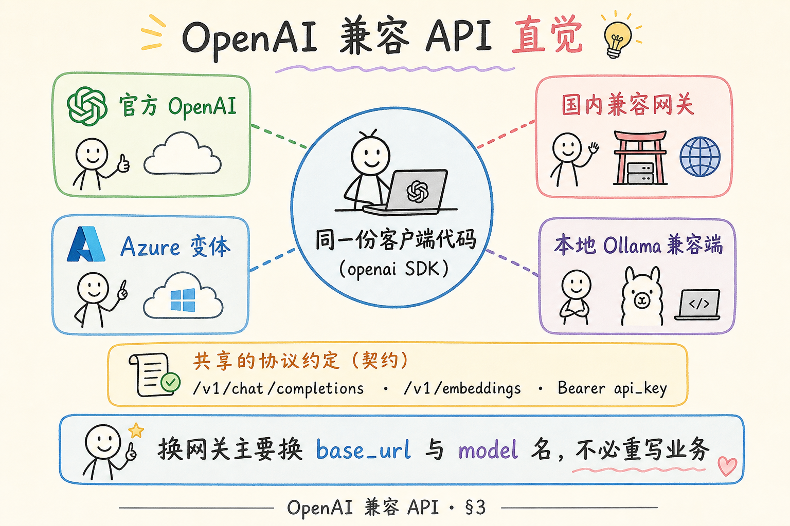
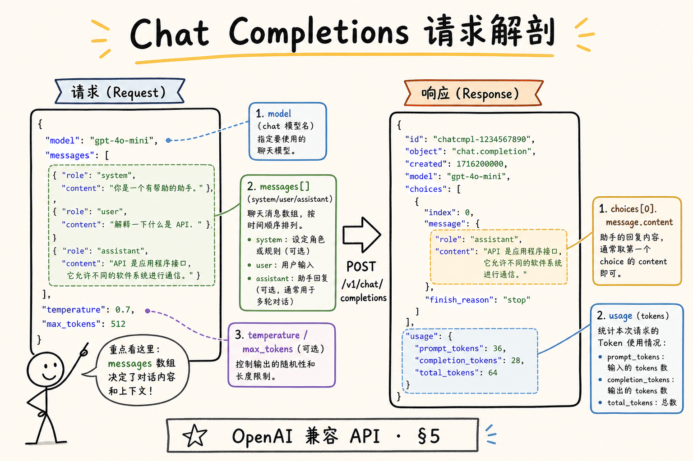
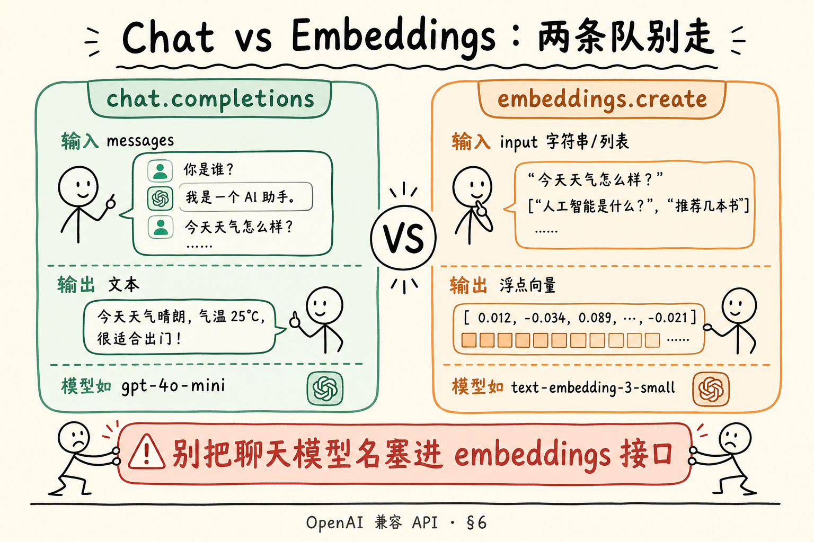
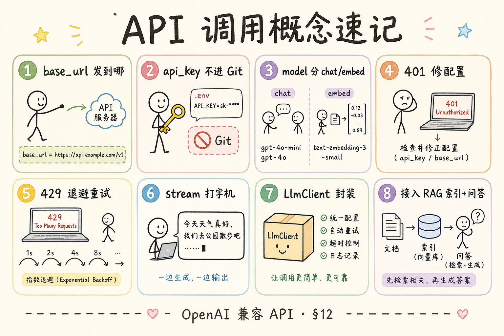

# NLP / IR / LLM 基础（十八）：闭源 LLM API 调用模式（OpenAI 兼容）完全指南

> 你已经会拼 [带引用的 messages](34.grounding-citation-tutorial.md)、会控 [采样温度](29.llm-sampling-tutorial.md)。要把这些搬进真实服务，下一关是 **怎么稳定地调 API**：`base_url` 指哪、`api_key` 放哪、`chat.completions` 和 `embeddings` 为何不能混、失败了该不该立刻重试。国内很多网关自称 **OpenAI 兼容**——学会一种调用形状，能换多家模型。本篇是 [企业 RAG 路线图](ENTERPRISE_RAG_ROADMAP.md) **B 轨第十八篇**（路线图第 **42** 条），定位 **主线篇**。前置：[30 提示词角色](30.prompt-roles-tutorial.md)；本篇示例与 [34 Grounding](34.grounding-citation-tutorial.md) 可串联。

---

## 目录

1. [前言：从笔记本脚本到可上线客户端](#1-前言从笔记本脚本到可上线客户端)
2. [本文边界与动手路径](#2-本文边界与动手路径)
3. [OpenAI 兼容是什么意思](#3-openai-兼容是什么意思)
4. [三要素：base_url、api_key、model](#4-三要素base_urlapi_keymodel)
5. [Chat Completions：messages 进，助手话出](#5-chat-completionsmessages-进助手话出)
6. [Embeddings：另一条 endpoint](#6-embeddings另一条-endpoint)
7. [错误、限流与重试直觉](#7-错误限流与重试直觉)
8. [流式输出：先建立直觉](#8-流式输出先建立直觉)
9. [安全：不要硬编码 Key](#9-安全不要硬编码-key)
10. [综合实战：最小客户端封装](#10-综合实战最小客户端封装)
11. [先错后对：常见调用事故](#11-先错对对常见调用事故)
12. [综合概念地图](#12-综合概念地图)
13. [常见陷阱与 FAQ](#13-常见陷阱与-faq)
14. [总结与系列下一步](#14-总结与系列下一步)

---

## 1. 前言：从笔记本脚本到可上线客户端

初学者第一个脚本往往是：

```python
client = OpenAI(api_key="sk-....")
resp = client.chat.completions.create(model="gpt-4o-mini", messages=[...])
```

能跑通，但一上线就踩坑：Key 进了 Git 历史、把 embedding 模型名传给 chat、429 时疯狂重试把账号打封、生产与开发共用同一个 Key 无法轮换。  
**API 调用模式** 指的是：你用 **同一套 HTTP 形状**（路径、JSON 字段、鉴权头）去访问 **聊天生成** 与 **向量嵌入** 等服务，并把 **配置、错误、重试、观测** 纳入工程习惯。

**OpenAI-compatible API**（OpenAI 兼容接口）：在 URL 路径、请求/响应 JSON 结构上模仿 OpenAI 官方 API 的网关或厂商实现，便于用 `openai` SDK 或同类客户端切换后端。  
通俗说：**插座形状一样**——插头（你的代码）不用改，换的是墙上的电站（厂商）。

**Endpoint**（端点）：API 上的一个具体 URL 路径，对应一类能力（如聊天补全、嵌入）。  
通俗说：饭店里「火锅档口」和「烧烤档口」——别在烧烤档点火锅。

**读完本文，你应该能做到：**

1. 说清 `base_url`、`api_key`、`model` 各自管什么，以及如何通过环境变量配置。  
2. 手写最小 `chat.completions.create` 与 `embeddings.create` 调用，并说明二者 **不可混用 model**。  
3. 列举至少三类 HTTP/API 错误，并说出 **该不该重试** 的直觉。  
4. 解释流式（stream）相对非流式的用户体验差异（不要求手写 SSE 解析）。  
5. 跑通 §10 最小客户端封装（有 Key）或跟读其结构（无 Key）。  
6. 用 §11 识别硬编码 Key、endpoint 混用等坏味道。

---

## 2. 本文边界与动手路径

**档位：主线篇。**

**本文讲：** OpenAI 兼容直觉、三要素配置、chat vs embeddings、错误重试直觉、流式了解、安全存 Key、可运行封装。  
**本文不讲：** 自研网关源码、Kubernetes 部署、多模型路由完整产品、Function Calling 全链路、各厂商私有参数穷举、完整异步高并发架构（async 细节见路线图 A 轨）。

### 2.1 动手路径表

| 步骤 | 你做什么 | 验收 |
|------|----------|------|
| A | 读 §3～§4，配置环境变量模板 | `.env` 不进 Git |
| B | 跑 §5 最小 chat | 终端有助手回复 |
| C | 跑 §6 最小 embeddings | 得到浮点向量列表 |
| D | 读 §7，对 401/429/500 各说是否重试 | 口头能判 |
| E | 读 §8，说明 stream 用途 | 能对比打字机体验 |
| F | 跑 §10 封装类 | chat 与 embed 共用配置 |
| G | 完成 §11 先错对对 | 指出两种事故 |

**环境：** Python 3.10+；`pip install openai`；可选 `pip install python-dotenv`（本地读 `.env`）。需要 `OPENAI_API_KEY`；用国内兼容网关时另设 `OPENAI_BASE_URL` 与对应模型名。

### 2.2 沿用前文

| 概念 | 来自 |
|------|------|
| messages 结构 | [30 提示词角色](30.prompt-roles-tutorial.md) |
| Grounding messages 实战 | [34 Grounding](34.grounding-citation-tutorial.md) |
| temperature 等采样参数 | [29 采样](29.llm-sampling-tutorial.md) |
| Embedding 向量用途 | [25 Embedding](25.embedding-vector-tutorial.md) |
| Token 计费 | [27 Token 计数](27.token-counting-billing-tutorial.md) |

---

## 3. OpenAI 兼容是什么意思

读下图，理解「官方 OpenAI」与「兼容网关」在 **客户端视角** 的关系。




对照上图：兼容的不是「模型权重一样」，而是 **调用合同**——你用同一份 Python 代码，改 `base_url` 和 `model` 字符串，就能换后端。合同常见包括：

- `POST /v1/chat/completions` + `messages`  
- `POST /v1/embeddings` + `input`  
- 鉴权头 `Authorization: Bearer <api_key>`  
- 响应里 `choices[0].message.content`（chat）或 `data[0].embedding`（embed）

**差异仍可能存在：** 个别厂商不支持 `response_format`、图像消息、某些 `tool` 字段；流式 SSE 字段名偶发不同；embedding 维度可能不同。**要以你所用网关文档为准**，但主线形状一致。

### 3.1 为什么 RAG 工程师要学这一套

企业 RAG 流水线至少两次 API 调用形态：

1. **索引期**：文档 → 切块 → `embeddings.create` → 写入向量库；  
2. **查询期**：用户问题 →（检索）→ `chat.completions.create` → 带引用答案。

两套调用共享 **Key 管理、重试、日志、成本统计**——封装成一个 `LlmClient` 类比复制粘贴两段脚本划算。

### 3.2 SDK vs 裸 HTTP

**openai** 官方 Python SDK 在兼容网关场景下通常只需改 `base_url`。  
裸 `httpx`/`requests` 也可，但要自己拼 JSON、解析错误体——初学者 **先用 SDK**，搞清字段后再考虑裸 HTTP 以便极致控制。

---

## 4. 三要素：base_url、api_key、model

| 要素 | 作用 | 典型配置 |
|------|------|----------|
| `base_url` | API 根地址，决定请求发到哪台网关 | 官方默认或 `https://your-gateway/v1` |
| `api_key` | 鉴权凭证，证明你有权调用 | 环境变量 `OPENAI_API_KEY` |
| `model` | 本次使用的模型标识字符串 | chat 与 embed **各用各的** 模型名 |

### 4.1 base_url

官方 OpenAI 可不显式设置（SDK 有默认值）。  
自建或第三方兼容网关常见：

```python
client = OpenAI(
    api_key=os.environ["OPENAI_API_KEY"],
    base_url=os.environ.get("OPENAI_BASE_URL", "https://api.openai.com/v1"),
)
```

注意：

- 有的文档给的是 `https://host` 不带 `/v1`，SDK 版本不同行为可能不同——**以网关说明为准**；  
- `base_url` 错是最浪费时间的 bug：401/404 连不上，先 `curl` 健康检查。

### 4.2 api_key

**API Key**（应用程序接口密钥）：服务端颁发的一串秘密令牌，放在请求头里证明调用者身份。  
通俗说：**门禁卡**——没有卡，保安不让进。

纪律：

- 不进源码、不进 Git、不进截图；  
- 开发/测试/生产 **分 Key**；  
- 泄露后立即在控制台 **吊销并轮换**。

### 4.3 model

**Model ID**（模型标识）：厂商定义的字符串，如 `gpt-4o-mini`、`text-embedding-3-small`。  
通俗说：点菜时说的 **菜名**——点错菜名，厨房做不了。

致命混淆：

```python
# 错：把 embedding 模型传给 chat
client.chat.completions.create(model="text-embedding-3-small", messages=[...])
```

Chat 模型与 Embedding 模型 **训练目标不同、接口不同、计费不同**——永远分开配置：

```bash
OPENAI_CHAT_MODEL=gpt-4o-mini
OPENAI_EMBED_MODEL=text-embedding-3-small
```


### 4.4 模型名从哪查、怎么试

网关文档或 `GET /v1/models`（若开放）列出可用 **Model ID**。初学者不要猜：  
`gpt-4` 与 `gpt-4o` 可能价差十倍；embedding 小模型与大模型维度不同。  
试连通性时用最便宜 chat 模型 + 一句「你好」即可，别用生产长 prompt 做 hello world。

换网关后第一件事：用 **同一句**「你好」分别打 chat 与 embed，确认两边都能 200——比直接跑 RAG 全链路省时间。

**API Version**（接口版本）：部分云厂商要求 URL 带 `api-version=2024-...` 等查询参数；OpenAI 官方路径较稳定。换 Azure 类后端时，读文档里的 **版本号** 与 **部署名（deployment）** 是否代替 model 字段。

初学者可记：**deployment 名有时就是你要写的 model 字符串**——以控制台抄录为准，不要凭新闻稿里的昵称瞎填。

把 `OPENAI_CHAT_MODEL` 与 `OPENAI_EMBED_MODEL` 拆成两个环境变量，是从根上避免 endpoint 混用的最便宜办法。

上线前在 README 或 `.env.example` 里写清这两个变量，能减少新人第一次跑通的时间。

---

## 5. Chat Completions：messages 进，助手话出

读图时，盯住请求 JSON 里 `messages`、`model`、`temperature` 如何组成一次调用。




对照上图：一次 chat 调用的最小输入是 **model + messages**；输出在 `choices[0].message.content`。

### 5.1 最小示例

```python
import os
from openai import OpenAI

client = OpenAI(
    api_key=os.environ["OPENAI_API_KEY"],
    base_url=os.environ.get("OPENAI_BASE_URL"),
)

resp = client.chat.completions.create(
    model=os.environ.get("OPENAI_CHAT_MODEL", "gpt-4o-mini"),
    messages=[
        {"role": "system", "content": "你是简洁的中文助手。"},
        {"role": "user", "content": "用一句话解释什么是 API。"},
    ],
    temperature=0,
)
print(resp.choices[0].message.content)
```

### 5.2 响应里你还该瞄一眼什么

| 字段 | 用途 |
|------|------|
| `usage.prompt_tokens` | 输入 token，计费与窗口 |
| `usage.completion_tokens` | 输出 token |
| `model` | 实际使用的模型（有时与请求略有差异） |
| `id` | 请求追踪号，报障给厂商 |

结合 [27 Token 计数](27.token-counting-billing-tutorial.md)：日志里记 `usage`，成本才不会月底惊吓。

### 5.3 与 Grounding 串联

把 [34 篇](34.grounding-citation-tutorial.md) §8 的 `SYSTEM`、`EVIDENCE`、`QUESTION` 原样塞进 `messages`，你就完成了 **业务提示词 + 标准 API 调用** 的合体——本篇管「怎么发」，34 篇管「发什么」。

### 5.4 常用可选参数（知道名字即可）

- `temperature` / `top_p`：见 [29 篇](29.llm-sampling-tutorial.md)  
- `max_tokens`：限制生成长度  
- `stop`：遇到停止词截断  
- `response_format`：部分网关支持 JSON 模式  

RAG 事实问答起点：`temperature=0`，`max_tokens` 设合理上限避免废话挤掉引用。


### 5.5 messages 里能放什么（边界扫一眼）

初学者常问：user 里能不能塞 JSON、能不能塞整本书？技术上 **能塞字符串**；工程上受 [28 上下文窗口](28.context-window-tutorial.md) 限制。  
Chat API 不关心你 user 里是 Markdown 还是 XML，只关心 **总 token**。RAG 因此才要检索 top-k，而不是把整库贴进 user。

**多模态消息**（图+文）在部分模型支持 `image_url` 等字段——本篇不展开；企业制度 PDF 文本问答，先把 **纯文本 messages** 跑通再升级。

### 5.6 一次调用在时间线上的样子

```text
T0 组装 messages → T1 POST 发出 → T2 网关排队 → T3 模型 prefill 输入
→ T4 逐 token 生成（非流式则客户端等到 T5 一次收齐）→ T6 解析 content/usage
```

体感慢时，先区分是 **排队（429/高负载）** 还是 **prompt 太长（prefill 慢）** 还是 **生成太长（max_tokens 大）**——三者优化手段不同。日志里的 `latency_ms` 与 `usage` 是拆因起点。

---

## 6. Embeddings：另一条 endpoint

读下图，牢记 **左边聊天、右边嵌入** 是两条队，模型名不能混。



对照上图：`embeddings.create` 吃的是 `input`（字符串或字符串列表），吐的是 **浮点向量**，没有 `messages` 角色。

### 6.1 最小示例

```python
import os
from openai import OpenAI

client = OpenAI(
    api_key=os.environ["OPENAI_API_KEY"],
    base_url=os.environ.get("OPENAI_BASE_URL"),
)

resp = client.embeddings.create(
    model=os.environ.get("OPENAI_EMBED_MODEL", "text-embedding-3-small"),
    input="年假制度适用于入职满一年的正式员工。",
)
vector = resp.data[0].embedding
print(len(vector), vector[:3])
```

### 6.2 批量 input

```python
resp = client.embeddings.create(
    model="text-embedding-3-small",
    input=["chunk one text", "chunk two text"],
)
vectors = [d.embedding for d in resp.data]
```

索引期常对成百上千 chunk 批量嵌入——注意网关 **batch 上限** 与 **QPS 限流**（§7）。

### 6.3 维度与向量库

不同 embedding 模型 **维度可能不同**（如 1536 vs 1024）。换模型通常要 **重建索引**。  
字段 `doc_id`、`chunk_id` 等元数据不进 embedding API，存在你自己的向量库侧（见 [25 篇](25.embedding-vector-tutorial.md)）。

### 6.4 Chat 模型能否代替 Embedding？

**不能作为常规方案。** 个别 hack（让 chat 吐「伪向量」）无稳定语义距离，生产 RAG 请用专用 embedding 模型或自托管句向量模型（路线图 89）。

---

## 7. 错误、限流与重试直觉

**Rate limit**（速率限制）：网关在单位时间内允许的最大请求数或 token 数，超限返回 429。  
通俗说：电梯限载——挤太多人就让你等下一趟。

**Retry**（重试）：失败后再次发送请求。不是所有错误都该重试。

### 7.1 常见状态与策略

| 现象 | 常见码 | 是否重试 | 做法 |
|------|--------|----------|------|
| Key 错/过期 | 401 | 否 | 修配置、轮换 Key |
| 无权访问该模型 | 403 | 否 | 改 model 或开通权限 |
| 请求体不合法 | 400 | 否 | 修 messages/model 字段 |
| 限流 | 429 | 是（有上限） | 指数退避 + 尊重 `Retry-After` |
| 服务端忙 | 500/502/503 | 少量重试 | 退避 2～3 次 |
| 超时 | timeout | 视情况 | 加长 timeout 或重试 |

### 7.2 指数退避（直觉版）

```text
第 1 次等 1s → 第 2 次等 2s → 第 3 次等 4s → 放弃并告警
```

**不要** 429 时 tight loop 毫秒级狂打——会被封更久。

### 7.3 幂等与副作用

Chat 生成 **非幂等**：重试可能得到另一份答案（尤其 temperature>0）。  
工程上：

- 事实问答用 `temperature=0` 降低漂移；  
- 关键写操作（自动改库）不要「失败就盲重试 chat 结果」；  
- 记录 `request_id` 便于对账。

Embedding 对同一 `input` 重试 **通常** 得到相同向量（仍应防重复计费）。

### 7.4 SDK 层重试

`openai` SDK 对部分错误有内置重试配置；无论是否开启，**你的业务层** 仍应有总超时、最大重试次数、熔断（连续失败暂停调用）。


### 7.5 把错误信息读完整（初学者排障）

SDK 抛错时，尽量打印：

```python
except APIStatusError as e:
    print(e.status_code, e.message)
```

**HTTP 401 Unauthorized**（未授权）：Key 无效、过期或没带 Bearer。  
通俗说：门禁卡刷不过——**不要重试**，修 Key。

**HTTP 400 Bad Request**（错误请求）：JSON 字段不对，如 `messages` 缺 `role`、model 名拼错。  
通俗说：订单填错了——改请求体，**不要重试**。

**HTTP 429 Too Many Requests**（请求过多）：触发限流。  
通俗说：电梯满了——**可以退避重试**，并检查是否并发过高。

**HTTP 503 Service Unavailable**（服务不可用）：网关或上游过载。  
通俗说：厨房爆单——**少量重试**，同时告警。

把 status_code 记进日志，比只记「调用失败」省一半排查时间。

### 7.6 超时与并发：两个独立旋钮

`timeout=60` 管 **单次请求最长等多久**；并发管 **同时飞出去多少请求**。  
初学者常只设 timeout，却用 `for chunk in chunks: embed(chunk)` 单线程跑索引——慢但安全；反过来，20 线程无退避打 embed，容易 429 把 Key 打停。

经验起点：索引批处理 **worker 数 ≤ 网关文档建议 QPS**；在线 chat **用户级限流** 防止一人刷爆窗口。二者都写在 `LlmClient` 外层，而不是散落在每个脚本里。

---

## 8. 流式输出：先建立直觉

**Streaming**（流式输出）：服务端边生成边推送 token，客户端边收边展示。  
通俗说：**打字机效果**——不用等全文写完才出现在屏幕上。

### 8.1 开启方式（了解）

```python
stream = client.chat.completions.create(
    model="gpt-4o-mini",
    messages=[{"role": "user", "content": "数到五。"}],
    stream=True,
)
for chunk in stream:
    delta = chunk.choices[0].delta.content
    if delta:
        print(delta, end="", flush=True)
```

### 8.2 何时用流式

| 用 | 不用 |
|----|------|
| 对客聊天 UI | 批量离线评测 |
| 长答案降低首字延迟 | 只要最终 JSON 且要简单解析 |
| 需要「停止生成」按钮 | 嵌入索引流水线 |

### 8.3 与 SSE

许多网关用 **SSE**（Server-Sent Events，服务器推送事件）传流式 chunk。前端可用 `EventSource` 或 fetch 读流；本篇不要求手写协议，知道 **流式 = 多个小 chunk 拼起来** 即可。路线图 A 轨第 9 条有 SSE 专题。

### 8.5 非流式何时反而更好

批量跑评测集、夜间对账、只要 JSON 字段时，**非流式**更简单：一次拿全 `content`，解析逻辑不用处理半截 JSON。  
企业后台「重建索引后的抽样问答质检」常用非流式 + `temperature=0`，结果落库比对；对客聊天才用流式。

**Server-Sent Events**（SSE，服务器推送事件）：一种服务器向浏览器单向推数据的 HTTP 机制，流式 chat 常用。  
通俗说：服务器持续往你这边「滴」小片段，而不是等整碗面端上来。

### 8.4 流式与 Grounding

流式展示时，引用 `[1]` 可能 **稍后才出现**——UI 可在流结束后做一次引用解析与高亮，避免半截答案就当成最终版归档。

---

## 9. 安全：不要硬编码 Key

### 9.1 推荐：环境变量

```bash
# .env.example（可提交 Git）
OPENAI_API_KEY=sk-your-key-here
OPENAI_BASE_URL=
OPENAI_CHAT_MODEL=gpt-4o-mini
OPENAI_EMBED_MODEL=text-embedding-3-small
```

```python
# 应用启动时
import os
from dotenv import load_dotenv  # 可选，仅本地

load_dotenv()  # 生产用真实环境变量注入，不靠 .env 文件
api_key = os.environ["OPENAI_API_KEY"]  # 缺失则立刻失败，优于静默空 Key
```

### 9.2 .gitignore

确保 `.env` 在 `.gitignore`；只提交 `.env.example` 占位。

### 9.3 生产密钥管理

路线图 G 轨 **密钥管理**：用云平台 Secret Manager、K8s Secret、CI 注入——原则一致：**运行时读取，不进仓库**。

### 9.4 日志脱敏

打印错误时 **不要** 把完整 Key 打进日志；请求体里的用户 PII 也要脱敏（路线图 212）。

---

## 10. 综合实战：最小客户端封装

以下 `LlmClient` 把 **配置集中、chat/embed 分离、简单重试** 合成一处，可直接拷进小项目再长大。

```python
"""最小 OpenAI 兼容客户端：chat + embeddings + 保守重试。"""
from __future__ import annotations

import os
import time
from typing import Any

from openai import OpenAI, APIStatusError, APITimeoutError, RateLimitError


class LlmClient:
    def __init__(
        self,
        api_key: str | None = None,
        base_url: str | None = None,
        chat_model: str | None = None,
        embed_model: str | None = None,
        max_retries: int = 3,
        timeout: float = 60.0,
    ) -> None:
        self.chat_model = chat_model or os.environ.get("OPENAI_CHAT_MODEL", "gpt-4o-mini")
        self.embed_model = embed_model or os.environ.get(
            "OPENAI_EMBED_MODEL", "text-embedding-3-small"
        )
        self.max_retries = max_retries
        self._client = OpenAI(
            api_key=api_key or os.environ["OPENAI_API_KEY"],
            base_url=base_url or os.environ.get("OPENAI_BASE_URL"),
            timeout=timeout,
        )

    def _call_with_retry(self, fn, *args, **kwargs) -> Any:
        delay = 1.0
        last_err: Exception | None = None
        for attempt in range(self.max_retries):
            try:
                return fn(*args, **kwargs)
            except RateLimitError as e:
                last_err = e
                time.sleep(delay)
                delay *= 2
            except APIStatusError as e:
                if e.status_code in (500, 502, 503) and attempt < self.max_retries - 1:
                    last_err = e
                    time.sleep(delay)
                    delay *= 2
                    continue
                raise
            except APITimeoutError as e:
                last_err = e
                if attempt < self.max_retries - 1:
                    time.sleep(delay)
                    delay *= 2
                    continue
                raise
        assert last_err is not None
        raise last_err

    def chat(
        self,
        messages: list[dict[str, str]],
        *,
        temperature: float = 0.0,
        max_tokens: int | None = None,
    ) -> str:
        kwargs: dict[str, Any] = {
            "model": self.chat_model,
            "messages": messages,
            "temperature": temperature,
        }
        if max_tokens is not None:
            kwargs["max_tokens"] = max_tokens

        resp = self._call_with_retry(
            self._client.chat.completions.create,
            **kwargs,
        )
        return resp.choices[0].message.content or ""

    def embed(self, texts: list[str]) -> list[list[float]]:
        resp = self._call_with_retry(
            self._client.embeddings.create,
            model=self.embed_model,
            input=texts,
        )
        return [d.embedding for d in resp.data]


if __name__ == "__main__":
    client = LlmClient()

    answer = client.chat(
        [
            {"role": "system", "content": "你是RAG助手，仅据资料回答。"},
            {
                "role": "user",
                "content": "【参考资料】\n[1] 年假10天。\n\n【用户问题】\n年假几天？",
            },
        ]
    )
    print("CHAT:", answer)

    vecs = client.embed(["年假制度", "考勤制度"])
    print("EMBED dims:", [len(v) for v in vecs])
```

**代码后解读：**

- 构造器读环境变量，**无硬编码 Key**；  
- `chat` 与 `embed` 用 **不同 model 字段**；  
- `_call_with_retry` 只对 429/5xx/超时退避，400/401 **不重试**；  
- `__main__` 演示与 [34 篇](34.grounding-citation-tutorial.md) 同形的 messages。

### 10.1 下一步可扩展点（知道即可）

- 加 `chat_stream()` 返回迭代器；  
- 日志层记录 `usage` 与 `latency_ms`；  
- 注入 `tenant_id` 做多租户限流；  
- 抽象 `base_url` 路由到「贵模型 / 便宜模型」——路线图 185。

### 10.2 接入 RAG 两条流水线（读写分离）

把 §10 封装放进真实项目时，建议 mentally 画两条 **单向流水线**，不要写成一团「调 API」：

**索引流水线（写向量库，低频、可离线）：**

```text
原始文件 → 解析提取（36篇）→ 清洗分块 → LlmClient.embed(batch)
         → 向量库 upsert（带 doc_id/chunk_id/page）
```

**查询流水线（在线、低延迟）：**

```text
用户问题 → 向量检索 top-k → 拼 [1][2] messages（34篇）
        → LlmClient.chat(temperature=0) → 解析引用 → 返回前端
```

两条线 **共享** `LlmClient` 的配置与重试，但 **不应共享** 同一个无界全局队列：索引批处理可以半夜跑、容忍更长 timeout；在线 chat 要短超时、快速失败转拒答模板。

### 10.3 本地 `.env` 与 CI 注入对照

| 环境 | Key 从哪来 | 注意 |
|------|------------|------|
| 笔记本开发 | `.env` + `python-dotenv` | `.env` 永不 commit |
| GitHub Actions | Repository Secret → `env:` | 日志掩码 |
| 服务器生产 | K8s Secret / 云 Secret Manager | 轮换不改代码 |
| Docker Compose | `env_file` 或 compose secrets | 别写进 image 层 |

**12-Factor Config**（十二要素配置）：把配置（含 Key）放在环境中，不写进代码库。  
通俗说：同一份镜像，开发/测试/生产靠 **环境变量** 区分，而不是改源码里的字符串。

### 10.4 观测字段建议（最小可排障）

每次 `chat` / `embed` 调用打一条结构化日志（JSON）：

```python
{
    "event": "llm_chat",
    "model": "gpt-4o-mini",
    "latency_ms": 842,
    "prompt_tokens": 512,
    "completion_tokens": 89,
    "status": "ok",
    "retry_count": 0,
}
```

出问题时你能回答：是 **变慢**、是 **token 暴涨**、还是 **重试打满**。这比「用户说慢」有价值一个数量级。路线图 164 LangSmith / 165 Langfuse 是此思路的产品化版本；初学者先用 `print` 或标准库 `logging` 也够。

### 10.5 成本粗算（与 27 篇衔接）

记一次调用的 `usage`，月末汇总：

```text
chat 成本 ≈ prompt_tokens × 输入单价 + completion_tokens × 输出单价
embed 成本 ≈ input_tokens × 嵌入单价
```

索引期 embedding 往往 **一次性**；查询期 chat 是 **持续**。若预算紧，先优化「chunk 数量 × 嵌入次数」，再优化「多轮历史膨胀的 prompt_tokens」——API 封装层是采集 `usage` 的最佳钩子。

---

## 11. 先错后对：常见调用事故

### 11.1 错：Key 写在源码

```python
client = OpenAI(api_key="sk-proj-abcdef...")
```

**对：** 环境变量 + 缺失即启动失败；`.env` 进 gitignore。

### 11.2 错：embeddings 调 chat 模型

```python
client.embeddings.create(model="gpt-4o-mini", input="hello")
```

**对：** `OPENAI_EMBED_MODEL` 专用。

### 11.3 错：429 时无退避狂重试

**对：** §7 指数退避 + 最大次数 + 告警。

### 11.4 错：不设 timeout

默认等太久，线程堵死。  
**对：** `OpenAI(..., timeout=60)` 并按业务调整。

### 11.5 错：生产日志打印完整 messages 含隐私

**对：** 脱敏；只记 hash 或前 80 字调试级别。

---

## 12. 综合概念地图




对照上图：配置三要素 → 分 endpoint 调用 → 错误策略 → 安全 → 封装 → 接入 RAG 流水线。

### 12.1 速记表

| 概念 | 一句话 |
|------|--------|
| 兼容 API | 插座形状像 OpenAI，可换网关 |
| base_url | 请求发到哪 |
| api_key | 门禁卡，不进 Git |
| chat | messages → 文本 |
| embeddings | input → 向量 |
| 429 | 等一等再重试 |
| 401/400 | 修配置，别盲重试 |
| stream | 打字机，降首字延迟 |

---

## 13. 常见陷阱与 FAQ

1. **把兼容当 100% 一致**——遇怪错先查网关文档与模型支持列表。  
2. **开发 Key 打生产流量**——无法审计、无法轮换。  
3. **忽略 usage**——成本失控；见 [27 篇](27.token-counting-billing-tutorial.md)。  
4. **embedding 维度假设不变**——换模型要重建索引。  
5. **chat 返回当结构化数据**——要 JSON 就加格式约束并校验解析。  
6. **无超时无重试上限**——雪崩时拖垮全站。

**Q：没有 OpenAI 官方账号能用本篇吗？**  
A：能。只要网关兼容 `/v1/chat/completions` 与 `/v1/embeddings`，改 `base_url` 和模型名即可。

**Q：azure/openai 和本篇什么关系？**  
A：Azure 常要 `api_version` 等额外参数，属于「兼容族」变体；思路仍是 endpoint + key + model。

**Q：本地 Ollama 算吗？**  
A：Ollama 提供 OpenAI 兼容层时，可用同类代码；embedding 模型名与维度查本地文档。

**Q：为什么要封装 LlmClient 而不是到处 create？**  
A：统一重试、日志、模型名、超时；换网关时改一处。

**Q：async 要不要学？**  
A：高并发服务需要；初学者先把同步跑通，再迁 `AsyncOpenAI`（路线图 A-4）。

**Q：`base_url` 末尾要不要加 `/v1`？**  
A：以网关文档为准；openai SDK 1.x 通常期望 `base_url` 含 `/v1`。配错时常见 404，用最小 curl 先打 `/v1/models` 探路。

**Q：同一请求能同时拿 chat 和 embed 吗？**  
A：不能一次 HTTP 干两件事；RAG 查询期至少「检索 embed（或预计算）+ 生成 chat」两次逻辑，可并行的是 **批量索引** 里的多个 embed。

**Q：代理/公司防火墙拦 HTTPS 怎么办？**  
A：走官方允许的代理、专线或私有化部署；这不是改 `temperature` 能解决的。开发机先 `curl -I` 验证连通。

### 13.1 HTTP 直觉：你在发什么包

即使使用 SDK，底层仍是 HTTP。一次 chat 大致是：

```text
POST {base_url}/chat/completions
Authorization: Bearer {api_key}
Content-Type: application/json

{"model":"...","messages":[...],"temperature":0}
```

**REST**（Representational State Transfer）：用 URL + HTTP 方法操作资源的风格；LLM 网关虽非典型 CRUD，但 **POST + JSON** 仍是 REST 族。  
通俗说：像点外卖——地址是 endpoint，Bearer 是身份，JSON 是订单内容。

响应 200 时 body 仍是 JSON；4xx/5xx 时 SDK 抛 `APIStatusError`，应 **读 `e.status_code` 与 body** 再决定重试，而不是 except 里一律 sleep。

### 13.2 多厂商切换检查表

换 `base_url` 或换模型前，用这张表过一遍：

| 检查项 | 说明 |
|--------|------|
| chat 模型名 | 新网关字符串可能完全不同 |
| embed 模型名 | 维度是否变化 → 是否重建索引 |
| 最大 context | 见 [28 窗口](28.context-window-tutorial.md) |
| 是否支持 stream | 前端是否依赖打字机 |
| 计费单位 | token 还是 request |
| 合规 | 数据是否出境、能否传客户原文 |

「兼容」帮你省的是 **改代码量**，不是 **改评测与合规义务**。

### 13.3 与 FastAPI 服务层（路线图 173）的接缝

日后你用 FastAPI 暴露 `/ask` 给前端时，典型分层是：

```text
Router（HTTP） → Service（拼 messages、调 LlmClient） → Repository（向量库）
```

`LlmClient` 不应写在 router 里裸调；也不应在每个 endpoint 复制一份 `OpenAI(...)`。本篇 §10 的类，就是 **Service 层下游的「模型网关适配器」**——再往上只关心业务字段，不关心 Bearer 头怎么写。

---

## 14. 总结与系列下一步

1. OpenAI 兼容 = **统一调用形状**，便于换网关与封装。  
2. `base_url` / `api_key` / `model` 三分离；chat 与 embed **各用各的 model**。  
3. 401/400 修配置；429/5xx **有限重试 + 退避**。  
4. 流式改善体验；Key **环境变量**，绝不硬编码。  
5. §10 封装是接入 [34 Grounding](34.grounding-citation-tutorial.md) 与 RAG 服务的桥梁。

### 14.1 系列下一步

| 目标 | 阅读 |
|------|------|
| Grounding 提示词 | [34](34.grounding-citation-tutorial.md) |
| PDF 入库第一关 | 路线图 **43** → [36](36.pdf-text-extraction-tutorial.md) |
| 向量与相似度 | [25](25.embedding-vector-tutorial.md)、[26](26.similarity-metrics-tutorial.md) |
| FastAPI 封装 | 路线图 F1-173 |
| 密钥与部署 | 路线图 G-205 |

### 14.2 学习目标自检

- [ ] 能配置三要素且不硬编码 Key  
- [ ] 能跑通 chat 与 embeddings  
- [ ] 能判断 401 vs 429 处理差异  
- [ ] 能解释 stream 用途  
- [ ] 能跑通或跟读 §10 封装  
- [ ] 能指出 §11 错例  

---

> **初学者可能仍困惑的点**  
> - 兼容是 **接口** 兼容，不是 **模型能力** 兼容——换 model 要重新评测。  
> - 先把同步客户端写稳，再追求 async 与流式花活。  
> - RAG 全链路里，API 只是中间两站；下一篇进入 C 轨：**PDF 里到底有没有字**——解析错了，后面全错。
