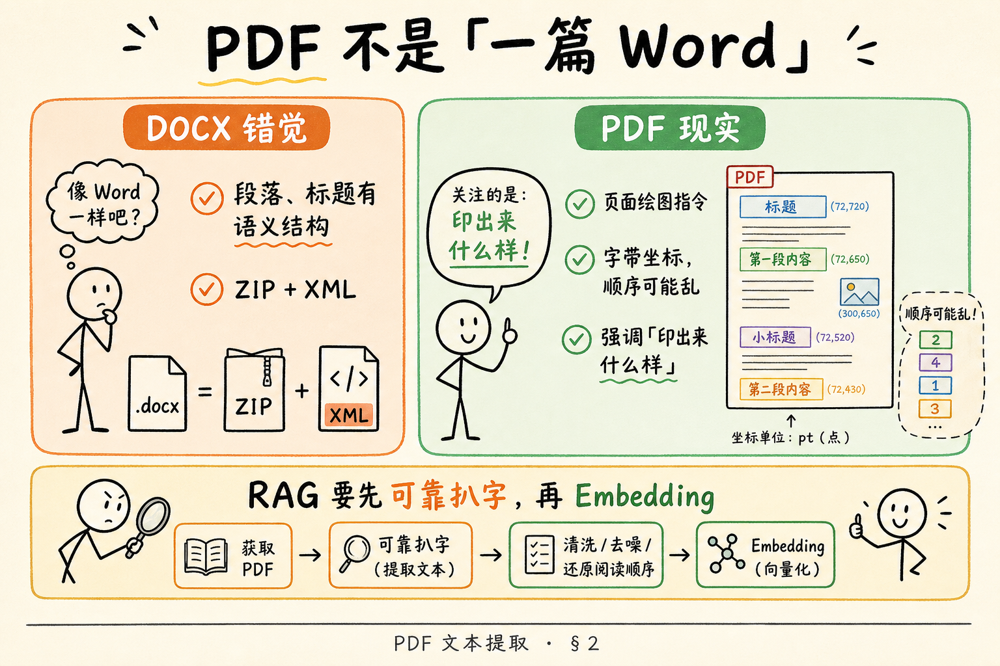
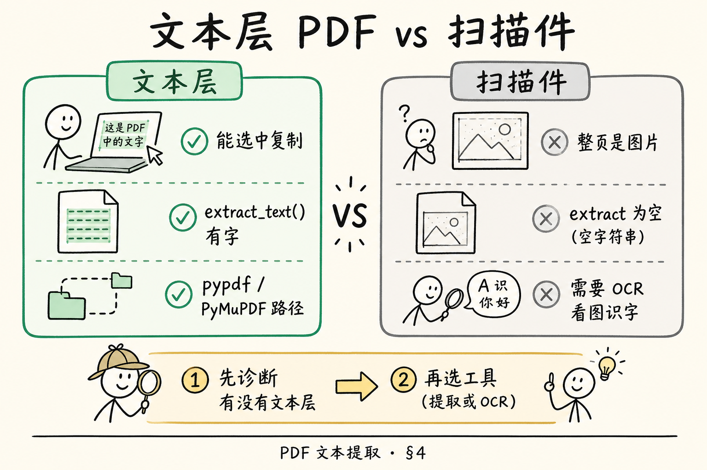
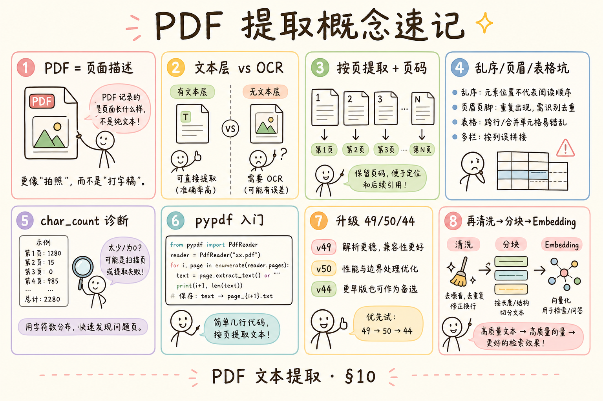

# 企业 RAG 数据采集（开篇）：PDF 文本提取完全指南

> 企业知识库上传量最大的往往是 **PDF**：扫描合同、导出的制度手册、汇报幻灯片另存为 PDF。很多初学者默认「PDF = 一篇 Word，读出来就是全文」——上线后却发现：有的文件复制出来是空白、有的段落顺序乱、有的中文变成方块。RAG 第一步 **不是 Embedding**，而是 **可靠地把字拿出来**。这篇是 [企业 RAG 路线图](ENTERPRISE_RAG_ROADMAP.md) **C 轨开篇**（路线图第 **43** 条），定位 **地基篇**：讲清 PDF 是什么、文本层与扫描件差异、提取目标与失败模式，并给出 **pypdf** 最小可运行示例。为路线图 **44**（表格版面）、**49**（PyMuPDF）、**50**（pdfplumber）铺路。前置：无硬性要求；若已会 [35 API 调用](35.openai-compatible-api-tutorial.md)，可把提取文本接 embedding 做玩具索引。

---

## 目录

1. [前言：PDF 不是「一篇 Word」](#1-前言pdf-不是一篇-word)
2. [本文边界与动手路径](#2-本文边界与动手路径)
3. [PDF 文件到底是什么](#3-pdf-文件到底是什么)
4. [文本层 vs 扫描件：你在抽什么](#4-文本层-vs-扫描件你在抽什么)
5. [提取目标：RAG 需要哪些输出](#5-提取目标rag-需要哪些输出)
6. [常见失败模式与对策预览](#6-常见失败模式与对策预览)
7. [最小实战：pypdf 读文本层](#7-最小实战pypdf-读文本层)
8. [伪代码：没有 Python 时怎么想](#8-伪代码没有-python-时怎么想)
9. [先错后对：典型误用](#9-先错对对典型误用)
10. [与后续工具篇的分工](#10-与后续工具篇的分工)
11. [综合概念地图](#11-综合概念地图)
12. [常见陷阱与 FAQ](#12-常见陷阱与-faq)
13. [总结与系列下一步](#13-总结与系列下一步)

---

## 1. 前言：PDF 不是「一篇 Word」

Word（DOCX）像精装文件夹，段落标题在 XML 里写得清清楚楚（见 [40 DOCX 篇](40.docx-office-parsing-tutorial.md)）。  
PDF 的设计初衷是 **「印出来长什么样，屏幕上就长什么样」**——是 **页面描述语言**，不是「章节 + 段落」文档。同一页里，字可能拆成几十个 **绘图指令** 撒在坐标上；表格线可能是矢量路径；扫描件整页只是一张 **图片**，根本没有「字」这个数据结构。

对 RAG 工程师，这意味着：

- **好消息**：大量企业 PDF 是「可选中复制」的，有 **文本层**，用库能较快抽出字串。  
- **坏消息**：版式复杂、双栏、页眉页脚、嵌入字体、扫描件时，**抽出来的顺序与语义** 可能和肉眼阅读不一致。  
- **工程现实**：解析质量决定 **切块与检索上限**——后面 Embedding 再贵，也救不了「抽出来就是乱序」的输入。

**PDF**（Portable Document Format，便携式文档格式）：一种以页面为单位描述文字、图形、图像位置的文件格式，强调跨设备版式一致。  
通俗说：**电子纸**——像拍照冲印，不像可编辑的笔记本。

**文本提取**（Text Extraction）：从 PDF 中还原人类可读字符序列的过程，通常不关心最终渲染长什么样。  
通俗说：从「电子纸」上 **扒字**，扒法不对就扒错顺序。

**读完本文，你应该能做到：**

1. 用一句话说明 PDF 与 DOCX 在「结构」上的根本差异。  
2. 区分 **有文本层的 PDF** 与 **扫描件（纯图）**，并说出各用什么思路。  
3. 列出至少四条文本提取 **失败模式** 及 RAG 后果。  
4. 说清提取阶段应产出的 **最小字段**（正文、页码、来源）。  
5. 跑通 §7 pypdf 示例（或跟读），解释输出为何可能乱序。  
6. 知道何时该升级到 PyMuPDF / pdfplumber / OCR（路线图 44、49、50、62）。

---

## 2. 本文边界与动手路径

**档位：地基篇（C1 开篇）。**

**本文讲：** PDF 本质、文本层 vs 扫描、提取目标、失败模式、pypdf 最小示例、与后续工具分工。  
**本文不讲：** 表格结构恢复、复杂版面分析（LayoutLM 等）、OCR 引擎调参、Java PDFBox 企业级方案、扫描 PDF 批量 GPU 流水线（仅指路路线图 62）。

### 2.1 动手路径表

| 步骤 | 你做什么 | 验收 |
|------|----------|------|
| A | 读 §3～§4，找一份「能复制」和一份「不能复制」的 PDF | 能分类 |
| B | 读 §5～§6，写下你的提取输出 JSON 草图 | 含 page、source |
| C | `pip install pypdf`，跑 §7 | 终端打出每页文本 |
| D | 对比肉眼阅读顺序与输出顺序 | 能解释一处差异 |
| E | 完成 §9 先错对对 | 指出两种错法 |
| F | 读 §10，说出何时换 PyMuPDF/pdfplumber | 能举场景 |

**环境：** Python 3.10+；`pip install pypdf`；准备 1～2 个样例 PDF（制度/export 均可）。无 Python 时可跟读 §8 伪代码。

### 2.2 与路线图前后条的关系

| 条目 | 关系 |
|------|------|
| 路线图 **44** 表格版面 | 本篇后：抽出的字不够还要「格子结构」 |
| 路线图 **49** PyMuPDF | 更快、更全的文本/图像提取 |
| 路线图 **50** pdfplumber | 表格与线框友好 |
| 路线图 **53** 文本清洗 | 抽完后去页眉乱码 |
| 路线图 **57～60** 元数据 | `doc_id`、`page`、`source` 字段 |
| [34 Grounding](34.grounding-citation-tutorial.md) | 入库质量差 → 引用无法核对 |

---

## 3. PDF 文件到底是什么

读下图：左边「像 Word 的错觉」vs 右边「页面绘图指令」的真实结构。




对照上图：PDF 内部是 **对象树**：页面对象、字体、内容流（content stream）、图片 XObject、注解等。  
你看到的「一段话」，在文件里可能是：

```text
BT /F1 12 Tf 100 700 Td (年) Tj (假) Tj ...
```

每个字带 **坐标**，不一定带「这是第三章第一段」的语义标签。

### 3.1 和 DOCX 对比（RAG 视角）

| 维度 | DOCX | PDF |
|------|------|-----|
| 本质 | ZIP + 语义 XML | 页面描述 |
| 段落边界 | 较清晰 | 需猜或靠版面分析 |
| 标题层级 | 样式名常可用 | 往往只有字号/坐标 |
| 表格 | 有行列 XML | 可能是线+字拼图 |
| 企业占比 | 编辑中 | 归档/对外发放 |

所以同一套「按标题分块」策略，DOCX 往往 **更省心**；PDF 要接受 **更多清洗与专用工具**。

### 3.2 「生成方式」决定难度

| 来源 | 常见特征 |
|------|----------|
| Word/LaTeX 导出 | 文本层较规整 |
| 浏览器打印为 PDF | 有时缺结构标签 |
| 扫描仪/拍照 | 整页位图，需 OCR |
| 幻灯片导出 | 单页大字少段落，顺序尚可 |

入库前应记录 `source_type`（导出/扫描）——后面 bad case 归因用（路线图 166）。


### 3.3 内容流（content stream）直觉

PDF 一页的 **内容流** 是一串绘图操作符：移动光标、选字体、画字、画线。  
`extract_text()` 做的是 **从操作符里捞 Unicode**，再按某种启发式 **排序成人类阅读顺序**——启发式错了，你就得到乱序段落。

**通俗说**：PDF 记的是「在 (100,700) 画『年』、在 (120,700) 画『假』」，不是「段落开始：年假」。  
这就是为什么同一页，不同库（pypdf / PyMuPDF / pdfplumber）抽出的顺序可能略有差异——它们在 **猜阅读顺序**。

### 3.4 矢量图、嵌入字体与「看起来有字却抽不出」

有些 PDF 把文字转成 **轮廓曲线**（像矢量图），肉眼像字，但没有文本对象；还有 **子集嵌入字体** 映射异常，复制成方块。  
这类 case 会落在 §6.6 乱码或 §4 扫描之间——需要换工具、OCR，或要求业务方重新导出「带文本层」的 PDF。

入库时记录 `extract_warnings: ["suspect_outline_text"]` 之类标记，方便日后 bad case 复盘（路线图 166 解析错误归因）。

---

## 4. 文本层 vs 扫描件：你在抽什么

读图时，分清左栏「可选中文字」与右栏「只有图片」的提取路径。




对照上图：

**文本层 PDF**（born-digital / text-based PDF）：页面上存在可直接映射为 Unicode 字符的文本对象，常见表现是鼠标能选中、复制。  
通俗说：字 **真的在文件里**，只是摆放方式古怪。

**扫描件 PDF**（scanned PDF / image-only PDF）：每页是一张或多张嵌入图片，没有文本对象；肉眼看到字是 **像素**。  
通俗说：字只在「照片」里，要 **OCR**（光学字符识别）才能变成字符串。

**OCR**（Optical Character Recognition，光学字符识别）：对图像中的字形进行检测与识别，输出文本。  
通俗说：让机器 **看图识字**——会受清晰度、倾斜、印章干扰。

### 4.1 怎么快速判断

1. 用阅读器尝试 **框选复制** 一段话；  
2. 看文件属性是否标注「仅图像」；  
3. 用 pypdf 抽一页：若几乎空或乱码，而肉眼看满页中文 → 大概率扫描件或字体嵌入问题。

### 4.2 RAG 路径分叉

```text
PDF 入库
  ├─ 有文本层 → 文本提取库（本篇 pypdf；进阶 PyMuPDF）
  └─ 扫描件   → OCR（Tesseract / 云 OCR / 路线图 62）→ 再清洗
```

**不要** 对扫描件指望 `extract_text()`  magically 出正文——那是 **路径错误**，不是「再换一个 embedding 模型」能修的。

### 4.3 混合 PDF

有的页有文本层、有的页是扫描插图——要 **按页** 决策策略，并在元数据里标 `page_kind: text|scan`。

---

## 5. 提取目标：RAG 需要哪些输出

提取不是「打印一大坨字符串」就结束。RAG 下游需要：

### 5.1 最小输出形状

```python
{
    "doc_id": "handbook-2024",
    "source": "员工手册2024.pdf",
    "pages": [
        {"page": 1, "text": "……", "kind": "text"},
        {"page": 2, "text": "……", "kind": "text"},
    ],
}
```

后续 [53 清洗](ENTERPRISE_RAG_ROADMAP.md) 去掉页眉页脚；[64+ 分块](ENTERPRISE_RAG_ROADMAP.md) 按句或按标题切；[34 Grounding](34.grounding-citation-tutorial.md) 引用时要能指回 **第几页**。

### 5.2 你还应记录的诊断信息

| 字段 | 用途 |
|------|------|
| `char_count` | 空抽检测 |
| `extractor` | `pypdf` / `pymupdf` / `ocr` |
| `warnings` | 乱码、加密、部分失败 |
| `language_guess` | 中英混合清洗策略 |

### 5.3 质量门槛（启发式）

入库前自动检查：

- 总字符数极低 → 可能扫描件或加密；  
- 某页字符数突变 0 → 该页转 OCR；  
- 乱码比例高 → 字体编码问题，换工具或预处理。

这些规则比「上传完立刻 embedding」更能省后面的 **幻觉与空检索** 成本。


### 5.4 全链路元数据一张表（给 C 轨后面用）

| 阶段 | 建议字段 |
|------|----------|
| 上传 | `doc_id`, `filename`, `uploaded_at`, `uploader` |
| 提取 | `page`, `kind`, `char_count`, `extractor` |
| 清洗 | `cleaned_at`, `strip_headers` |
| 分块 | `chunk_id`, `chunk_index`, `parent_doc_id` |
| 索引 | `embedding_model`, `indexed_at` |

现在记不住没关系；**提取时至少留 `doc_id` + `page`**，后面 Grounding 引用「手册 p.12」才站得住。

日后做向量检索时，`chunk_id` 与 `page` 会进引用卡片；提取阶段丢页码，前端就无法高亮 PDF 对应行（路线图 F2-195）。

**Document ingestion**（文档入库）：从上传到可检索的完整流水线。本篇只覆盖其中 **extract** 一环；别把它说成「上传完就能问」——中间还有清洗、分块、嵌入、索引（路线图 C2～C4）。

抽测建议：每批新入库 PDF **随机抽 5 页** 人工对照提取文本，比只看「索引进度条 100%」更能提前发现扫描件与乱序。

**质量门禁**（quality gate）：入库流水线中的自动检查点；字符数过低、加密、乱码超阈值时阻断进入 embedding，避免垃圾进垃圾出。

本篇的质量门禁至少包括：**全书字符数** 与 **单页空抽** 两类信号。

---

## 6. 常见失败模式与对策预览

### 6.1 顺序错乱

**现象：** 双栏报纸式排版，抽出「左栏下半 + 右栏上半」交错。  
**RAG 后果：** chunk 语义断裂，检索命中半句话。  
**对策预览：** 版面分析、按坐标排序（PyMuPDF 块级 API）、或 pdfplumber 布局；路线图 44。

### 6.2 页眉页脚重复

**现象：** 每页页脚「公司内部资料」进正文。  
**RAG 后果：** 检索噪声，答案引用无关句。  
**对策预览：** 规则清洗（路线图 53）、按区域裁剪。

### 6.3 表格变空格糊

**现象：** 「姓名 部门 金额」挤成一行，列关系丢失。  
**RAG 后果：** 问答数字对错列。  
**对策预览：** pdfplumber 抽表（路线图 50）、表格单独成块（路线图 75）。

### 6.4 扫描件零文本

**现象：** `extract_text()` 返回空。  
**RAG 后果：** 库里有文件名无内容，幻觉风险极高。  
**对策预览：** OCR + 人工抽检；入库状态标 `needs_ocr`。

### 6.5 加密与权限

**现象：** 打开要密码或禁止复制。  
**RAG 后果：** 提取失败或违法合规风险。  
**对策：** 业务侧要 **无密可处理副本**；技术侧捕获异常写 `failed` 状态，别静默空串。

### 6.7 图片里的字幕与海报页

营销海报式 PDF 可能 **整页是一张图**，字幕在图里——文本层为空，OCR 才能救。也有 **图下带真实文本层** 的双轨页面：要同时看 `extract_text` 与渲染图，避免漏掉一半信息（路线图 63 了解多模态）。

分块时海报页常 **一图一块** 或 **跳过**，取决于产品是否回答视觉内容；文本 RAG 默认只索引文本层与 OCR 结果。

### 6.6 嵌入字体与乱码

**现象：** 复制出来是 `□□□` 或奇怪符号。  
**RAG 后果：** 索引垃圾向量。  
**对策：** 换提取库、子集字体处理、最坏情况 OCR 该页。

---

## 7. 最小实战：pypdf 读文本层

**pypdf**：纯 Python 的 PDF 读写库，轻量，适合 **先验证有没有文本层**。  
不是最强版面分析工具，但 **依赖少、上手快**——符合 C1 开篇。

**环境：**

```bash
pip install pypdf
```

**脚本：**

```python
"""C1 最小 PDF 文本提取：按页输出 + 简单诊断。"""
from pathlib import Path

from pypdf import PdfReader


def extract_pdf_pages(pdf_path: str | Path) -> list[dict]:
    reader = PdfReader(str(pdf_path))
    meta = reader.metadata
    pages_out: list[dict] = []

    for i, page in enumerate(reader.pages, start=1):
        text = page.extract_text() or ""
        pages_out.append(
            {
                "page": i,
                "text": text,
                "char_count": len(text),
                "kind": "text" if text.strip() else "empty_or_scan",
            }
        )

    return {
        "source": Path(pdf_path).name,
        "title": (meta.title if meta else None) or Path(pdf_path).stem,
        "page_count": len(reader.pages),
        "pages": pages_out,
    }


if __name__ == "__main__":
    import json
    import sys

    path = sys.argv[1] if len(sys.argv) > 1 else "sample.pdf"
    result = extract_pdf_pages(path)
    print(json.dumps(result, ensure_ascii=False, indent=2)[:4000])

    empty = [p["page"] for p in result["pages"] if p["char_count"] < 20]
    if empty:
        print(f"\n[WARN] 这些页几乎无文本，可能扫描或提取失败: {empty}")
```

**代码后解读：**

1. `extract_text()` 按页调用——保留 `page` 供 Grounding 引用「第 N 页」。  
2. `char_count` 过低打 `empty_or_scan` 标记，提醒你走 OCR 或换工具。  
3. 输出截断打印防止终端爆屏；生产写数据库或对象存储。  
4. 若全程 `char_count` 都低，而肉眼有字 → **停止 embedding**，先诊断（§4）。

### 7.2 样例输出长什么样（阅读练习）

假设 `handbook.pdf` 有两页文本层，§7 脚本可能打出（示意）：

```json
{
  "source": "handbook.pdf",
  "page_count": 2,
  "pages": [
    {"page": 1, "char_count": 320, "kind": "text"},
    {"page": 2, "char_count": 0, "kind": "empty_or_scan"}
  ]
}
```

**你怎么读这张图：**

- 第 1 页正常，可进入清洗；  
- 第 2 页 `char_count: 0` 但肉眼有字 → **停**，标记 `needs_ocr` 或换 PyMuPDF 再试；  
- 若两页都 300+ 字，但连在一起读不通 → 可能是 **乱序**（§6.1），不是「字数不够」。

初学者建议准备 **三份样本 PDF** 放仓库 `fixtures/`（注意版权）：一份 Word 导出、一份双栏报纸、一份扫描件——跑 §7 各一次，比背概念记得牢。

### 7.3 拼成单文档字符串（仅玩具用）

```python
def pages_to_plaintext(pages: list[dict]) -> str:
    parts = []
    for p in pages:
        if p["text"].strip():
            parts.append(f"\n\n--- 第 {p['page']} 页 ---\n\n{p['text']}")
    return "".join(parts).strip()
```

RAG 生产更推荐 **保留页对象** 再分块，而不是 early 糊成一大坨——否则丢失页码溯源。

### 7.4 与 embedding 玩具串联（可选）

```python
# 需已配置 OPENAI_API_KEY，见 35 篇
# from openai import OpenAI
# client = OpenAI()
# vec = client.embeddings.create(model="text-embedding-3-small", input=chunk_text)
```

**顺序永远是：** 提取 → 清洗 → 分块 → 嵌入。跳过前两步等于给向量库喂垃圾。


### 7.5 加密 PDF 与权限位（知道即可）

部分 PDF 打开要密码，或禁止复制文本。**Owner password**（所有者密码）与 **User password**（用户密码）权限不同：有时你能阅读但不能 `extract_text()`。  
pypdf 可读 `reader.is_encrypted`，解密需合法密码——企业流程应要求业务方提供 **可处理副本**，而不是在服务端暴力破解。

若解密失败，状态记 `FAILED: encrypted`，别进索引；和用户看到「能打开」不是一回事（阅读器缓存了解密态）。

### 7.6 提取结果如何交给清洗（路线图 53 预告）

§7 的 `pages[].text` 还不是 chunk。典型下一步：

```text
pages → 去页眉页脚 → 合并或按页保留 → 按句/按标题切 chunk
每个 chunk 携带 {doc_id, page, source, char_offset}
```

**char_offset**（字符偏移）：该 chunk 在页内或全文中的起始位置，进阶用于 PDF 高亮（路线图 F2-195）。  
本篇只要记住：**提取阶段保留 page**，清洗阶段再动刀，避免过早 `"".join` 丢失页码。

### 7.7 练习题（无代码也能做）

1. 找一份双栏 PDF，比较肉眼顺序与 `extract_text()` 前 200 字。  
2. 找一份扫描件，验证 `char_count` 是否接近 0。  
3. 用同一份 Word 导出 PDF 与原生 DOCX，主观比较「标题是否更好分块」。  

三道题做完，你对「为什么要 49/50/44」会有具体痛感，而不是背目录。

---

## 8. 伪代码：没有 Python 时怎么想

```text
function ingest_pdf(file):
    doc = open_pdf(file)
    if doc.is_encrypted and not has_password():
        return status=FAILED, reason="encrypted"

    pages = []
    for page_num in doc.pages:
        text = page.extract_text_layer()
        if length(text) < THRESHOLD:
            text = ocr(page.render_image())   // 扫描路径
            kind = "ocr"
        else:
            kind = "text"
        pages.append({page: page_num, text: text, kind: kind})

    if sum(length(p.text) for p in pages) < DOC_MIN_CHARS:
        return status=NEEDS_REVIEW, reason="too_little_text"

    return status=OK, payload=pages
```

这段伪代码表达 **业务状态机** 思想：不是「非黑即白成功」，而是 **可诊断、可人工介入**。

---

## 9. 先错后对：典型误用

### 9.1 错：把 PDF 当 UTF-8 文本 `open()`

```python
text = open("手册.pdf", encoding="utf-8").read()  # 乱码或报错
```

**对：** 用 PDF 专用库（pypdf / PyMuPDF 等）。

### 9.2 错：抽出来空仍继续 embedding

```python
chunks = [""]  # 或全是页脚噪声
embed_and_index(chunks)
```

**对：** 字符数门槛 + `needs_ocr` / `failed` 状态；空串不进索引。

### 9.3 错：只求「全文一串」丢掉页码

**对：** 页级或块级保留 `page`，服务 [34 引用](34.grounding-citation-tutorial.md)。

### 9.4 错：双栏乱序直接送分块

**对：** 记录 `warnings: order_suspect`；复杂版式升级工具（§10）或人工抽测。

### 9.5 错：扫描件指望调大 DPI 再 extract_text

扫描件没有文本层，调 DPI 只让 **图更清晰**，还要 **OCR**。

---

## 10. 与后续工具篇的分工

| 场景 | 本篇 pypdf | 路线图 49 PyMuPDF | 路线图 50 pdfplumber |
|------|------------|-------------------|----------------------|
| 快速验证文本层 | ✅ 首选 | 亦可 | 偏重表格 |
| 大文件性能 | 一般 | 通常更好 | 中等 |
| 按块坐标排序 | 弱 | 较强 | 较强 |
| 表格结构 | 弱 | 中 | ✅ 强 |
| 图片/渲染页 | 弱 | ✅ 强 | 中 |
| 扫描 OCR | 不做 | 可配合渲染 | 可配合 |

**学习顺序建议：** 本篇建立直觉 → 遇到表格/版式痛点读 **44 + 50** → 要性能与图像读 **49** → 批量扫描再读 **62 OCR**。

### 10.2 入库状态机（建议现在就画）

```text
UPLOADED → EXTRACTING → {OK | NEEDS_OCR | FAILED | NEEDS_REVIEW}
OK → CLEANING → CHUNKING → EMBEDDING → INDEXED
```

**NEEDS_REVIEW** 典型触发：总字符够但乱序警告多、或部分页空部分页有字。  
产品后台应展示 **可点击的失败原因**，而不是用户搜不到却不知道为什么——这和 [34 拒答](34.grounding-citation-tutorial.md) 是同一产品伦理：失败要 **可解释**。

### 10.3 和 DOCX/HTML 链

- 若业务能提供 **源 DOCX**，优先 DOCX 入库（[40 篇](40.docx-office-parsing-tutorial.md)）。  
- 网页存档走 HTML 抽取（路线图 46）。  
- PDF 往往是 **最后一公里归档格式**——所以本篇虽难，却绕不开。

---

## 11. 综合概念地图




对照上图：认清 PDF 本质 → 判断文本层/扫描 → 按页提取 → 诊断 → 清洗分块 → 再 Embedding → Grounding 可溯源。

### 11.1 速记表

| 概念 | 一句话 |
|------|--------|
| PDF | 页面描述，不是段落文档 |
| 文本层 | 字在文件里，能选中复制 |
| 扫描件 | 字在图里，要 OCR |
| 提取目标 | 按页文字 + 元数据 + 诊断 |
| 乱序 | 双栏/表格常见，要进阶工具 |
| pypdf | 轻量验证文本层 |
| 空抽 | 别 embedding，先诊断 |

---

## 12. 常见陷阱与 FAQ

1. **「能打开」≠「能提取」**——阅读器渲染用的是另一套逻辑。  
2. **页数多 ≠ 字符多**——扫描册页页是图，字符计数接近 0。  
3. **提取成功 ≠ 语义顺序对**——要抽检与清洗。  
4. **同一库对不同 PDF 表现差很大**——保留 `extractor` 字段便于 A/B。  
5. **加密 PDF 强行破解**——合规与法律风险，走业务流程要明文副本。  
6. **忽略图片里的字**——海报式 PDF 可能字在图里仍有文本层，也可能没有；要分对象处理（路线图 63 了解）。

**Q：pypdf 和 PyMuPDF 选哪个入门？**  
A：本篇用 pypdf **理解概念**；生产中文企业 PDF 常很快升级到 PyMuPDF（49）。

**Q：提取后立刻切块大小多少？**  
A：属 C2 分块篇（路线图 64+）；本篇只强调 **先保留页码再切**。

**Q：中文 PDF 会乱码吗？**  
A：可能，与字体嵌入方式有关；换库或 OCR，并见 [41 编码](41.text-encoding-detection-tutorial.md) 清洗思路。

**Q：幻灯片 PDF 一页一行字也要入库吗？**  
A：可以，但 chunk 策略不同；有时合并多页或按标题拆（产品决策）。

**Q：怎么和 Grounding 连起来？**  
A：引用写「员工手册 p.12」来自 `page` 字段；提取错页码，引用就假（[34 篇](34.grounding-citation-tutorial.md) 伪造引用）。

**Q：PDF 里有多层「字」叠在一起怎么办？**  
A：少见但存在（透明层、注释层）；表现为重复句。清洗阶段去重（路线图 54）或按对象类型过滤，进阶用 PyMuPDF 块类型。

**Q：能不能只抽第一页做摘要索引？**  
A：玩具可以；企业制度问答不行——用户问的细节常在附录。至少应对 **全书页数** 做字符数体检，再决定全量或分段入库。

### 12.1 从单函数到「提取服务」的演进

| 阶段 | 你做啥 | 适用 |
|------|--------|------|
| L0 脚本 | §7 命令行抽一份 PDF | 学习验证 |
| L1 函数 | `extract_pdf_pages(path) -> dict` | 小工具 |
| L2 任务 | 上传触发 Celery/BackgroundTasks | 产品入库 |
| L3 策略链 | 按页 text/OCR/表格分支 | 企业混合库 |

本篇停在 **L1**：你应有干净的 dict 输出和诊断字段；别一上来接 Unstructured 全全家桶——搞不清输入输出时，工具越多越乱。

### 12.2 字符数门槛参考（启发式，非银弹）

| 信号 | 建议 |
|------|------|
| 全书 `sum(char_count) < 200` 且肉眼多页有字 | `NEEDS_OCR` 或换库 |
| 单页 `< 15` 字连续多页 | 检查是否插图册 |
| 乱码字符占比 > 30% | 字体/编码问题，见 [41 编码](41.text-encoding-detection-tutorial.md) |
| 提取 OK 但检索永远 miss | 转 C2 分块与 C3 嵌入，别回头怪 pypdf |

门槛用 **相对值 + 人工 spot check** 联用，避免扫描版封面一页文字导致误判「全书 OK」。

### 12.3 双栏乱序：肉眼练习

拿一份双栏 PDF，自己先默读顺序，再对照 `extract_text()` 输出。常见模式：

- 左栏读完才该读右栏，但输出成「左1行、右1行、左2行…」；  
- 页眉「机密」插在正文中间。

在笔记里标 **第一个错位点** 属于第几页、第几行——这就是日后给 pdfplumber 提需求的 **复现样本**。没有样本，工具升级只能盲调。

---

## 13. 总结与系列下一步

1. PDF 是 **版面容器**，不是 Word；别用 `open()` 读。  
2. **文本层** 走提取库；**扫描件** 走 OCR——路径别混。  
3. 提取要 **按页 + 诊断**，空抽禁止进索引。  
4. 乱序、页眉、表格是三大坑；复杂 case 留给 44/49/50。  
5. 质量在入口守住，后面 RAG 才省幻觉债。

### 13.1 系列下一步

| 目标 | 阅读 |
|------|------|
| 表格与版面 | [37 PDF 版面与表格](37.pdf-layout-tables-tutorial.md) |
| PyMuPDF | [42 PyMuPDF](42.pymupdf-tutorial.md) |
| pdfplumber | [43 pdfplumber](43.pdfplumber-tutorial.md) |
| 文本清洗 | 路线图 **53** |
| DOCX 对比 | [40](40.docx-office-parsing-tutorial.md) |
| API 嵌入 | [35](35.openai-compatible-api-tutorial.md) |
| 引用溯源 | [34](34.grounding-citation-tutorial.md) |

### 13.2 学习目标自检

- [ ] 能说明 PDF ≠ Word  
- [ ] 能区分文本层与扫描件  
- [ ] 能列 ≥4 种失败模式  
- [ ] 能跑通或跟读 pypdf 示例  
- [ ] 知道何时升级 49/50/OCR  
- [ ] 能解释为何空抽不能 embedding  

---

> **初学者可能仍困惑的点**  
> - 提取库不是魔法；版式复杂的 PDF 需要 **工具链组合**，不是单函数 `extract_text()`。  
> - 早期多花 10 分钟诊断，比后期修一整座向量库便宜。  
> - 下一篇进入版面与表格：当你发现「字有了，但格子没了」，就是 44/50 上场的时候。
