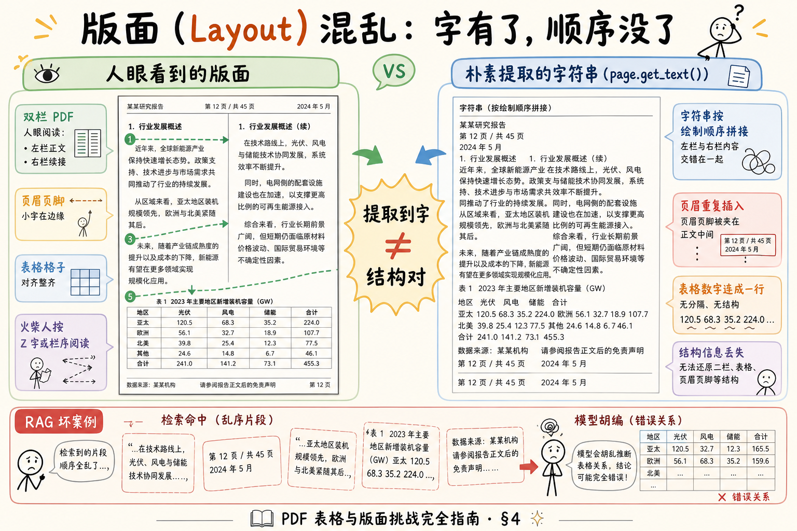
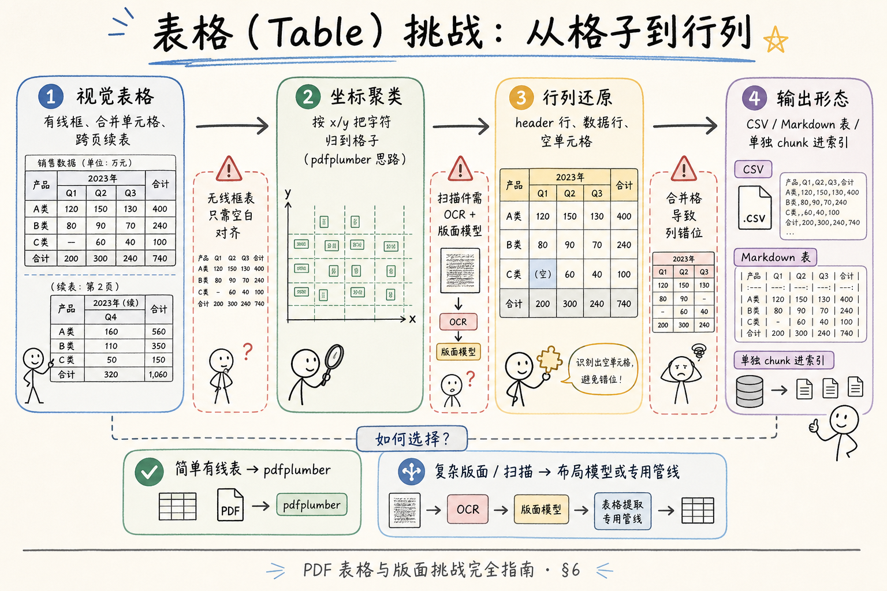
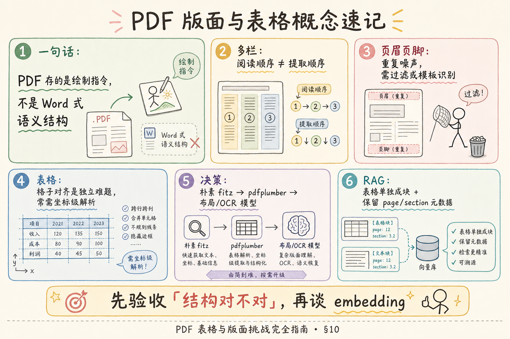

# RAG 数据采集与解析（一）：PDF 表格与版面（Layout）挑战完全指南

> 你已经知道企业知识库里大量文件是 PDF——制度手册、财报、标书、扫描合同。上一阶段若只学了「把字抠出来」，上线后很快会遇到第二类崩溃：**字都在，但顺序是乱的、表格变成一串数字、页眉插进正文中间**。用户问「华东区 Q3 销售额」，检索命中一段读起来像真的碎片，模型却拼不出行列关系。这篇是 [企业 RAG 路线图](ENTERPRISE_RAG_ROADMAP.md) **C 轨第一篇**（路线图第 **44** 条），讲清 **版面（Layout）** 与 **表格（Table）** 为何是独立难题、朴素提取何时够用、何时该上 **pdfplumber** 或 **布局模型**。前置：路线图 43（PDF 文本提取）、[28 上下文窗口](28.context-window-tutorial.md)。

---

## 目录

1. [前言：「有字」不等于「能答」](#1-前言有字不等于能答)
2. [本文边界与动手路径](#2-本文边界与动手路径)
3. [PDF 在底层存的是什么](#3-pdf-在底层存的是什么)
4. [版面混乱：多栏、页眉页脚、阅读顺序](#4-版面混乱多栏页眉页脚阅读顺序)
5. [为何「提取到字」≠「结构对」](#5-为何提取到字结构对)
6. [表格挑战：从格子到行列](#6-表格挑战从格子到行列)
7. [决策树：何时 pdfplumber、何时布局模型](#7-决策树何时-pdfplumber何时布局模型)
8. [最小实战：对比两种提取](#8-最小实战对比两种提取)
9. [和 RAG 分块、元数据怎么接](#9-和-rag-分块元数据怎么接)
10. [综合概念地图](#10-综合概念地图)
11. [常见陷阱与 FAQ](#11-常见陷阱与-faq)
12. [总结与系列下一步](#12-总结与系列下一步)

---

## 1. 前言：「有字」不等于「能答」

初学者做第一个 PDF 入库脚本，常见庆祝姿势是：

```text
共提取 48,392 个字符，入库成功！
```

一周后客服反馈：「机器人说报销上限 800 元，手册表格里明明是 500。」你打开原始 PDF——数字 500 确实被提取到了，但它和 **上一页页脚的电话号码**、**右栏另一张表的表头** 混在同一段文本里。Embedding 检索「报销上限」，命中了 **含 500 但语义错位** 的 chunk；生成模型再一润色，就变成了 800。

这不是模型「变笨了」，而是 **解析阶段丢了版面语义**。

**Layout**（版面 / 版面分析）：理解页面上 **块、栏、行、表** 的空间与阅读关系，而不只是把可见字符按某种顺序串起来。  
通俗说：**不光抠字，还要抠「字站在哪、该先读谁」**。

**读完本文，你应该能做到：**

1. 解释 PDF 为何没有 Word 式「段落对象」，朴素 `get_text()` 会乱序。  
2. 列举多栏、页眉页脚、表格三类典型翻车形态。  
3. 区分「字符提取成功」与「结构还原成功」的验收标准。  
4. 按文档类型选择：朴素 fitz、**pdfplumber**、或布局/OCR 管线。  
5. 说明表格块在 RAG 里宜 **单独成块** 并保留 `page` / `section` 元数据。

---

## 2. 本文边界与动手路径

**档位：地基篇（C1 数据采集）。**

**本文讲：** 版面与表格的直觉、失败形态、工具选型决策、最小对比代码、与分块的接口。  
**本文不讲：** 完整 OCR 训练、版面深度学习模型原理推导、复杂财报跨页合并格的全套工程、Unstructured.io 商业版全参数。

### 2.1 动手路径表

| 步骤 | 你做什么 | 验收 |
|------|----------|------|
| A | 读 §3～§5，能口述「绘制指令 vs 语义结构」 | 能画双栏乱序示意图 |
| B | 读 §6～§7，填一张你家 PDF 类型的选型表 | 至少三类文档有方案 |
| C | 跑 §8 对比脚本（或跟读输出） | 看见同页两种提取差异 |
| D | 读 §9，写表格 chunk 的元数据字段清单 | 含 page、table_id |

**环境：** Python 3.10+；`pip install pymupdf pdfplumber`。样例可用任意 **双栏或含表** 的 PDF；没有则用公司脱敏手册一页即可。

### 2.2 沿用前文

| 概念 | 来自 |
|------|------|
| Token 与窗口预算 | [27 Token 计数](27.token-counting-billing-tutorial.md)、[28 上下文窗口](28.context-window-tutorial.md) |
| 检索依赖 chunk 质量 | [25 Embedding](25.embedding-vector-tutorial.md) |
| 胡编与资料错位 | [33 幻觉](33.llm-hallucination-tutorial.md) |

---

## 3. PDF 在底层存的是什么

**PDF**（Portable Document Format）：一种以 **固定版面呈现** 为目标的文件格式；内部多为 **绘图指令**（文字放在坐标 (x,y)、画线、插图），而不是「第 3 段第 2 句」这类逻辑结构。  
通俗说：**像一张印刷好的纸的坐标清单**，不是可编辑的语义文档树。

因此：

| 人眼看到的 | 文件里实际存的 |
|------------|----------------|
| 双栏论文 | 两列文字流 + 绝对位置 |
| 三线表 | 若干文字片段 + 可能有的矩形线 |
| 页眉「公司内部」 | 每页重复绘制的小号文本 |

**文本提取**（Text Extraction）：从 PDF 对象里读出 Unicode 字符，并按库的规则 **排序拼接** 成字符串。  
通俗说：**把纸上的字抄下来**——抄法不同，顺序就不同。

常见库：

| 库 | 强项 | 弱项 |
|----|------|------|
| **PyMuPDF**（`fitz`） | 快、纯文本、图片页渲染 | 默认不还原复杂表 |
| **pdfplumber** | 基于坐标的表检测、线框表 | 扫描件无效（需 OCR） |
| **pdfminer.six** | 细粒度布局分析 | API 偏底层，初学曲线陡 |

路线图 43 若已学 `fitz` 抠字，本篇是在此之上补 **「结构」** 这一层。

### 3.1 坐标直觉：字符为何乱序

PDF 里每个字带 **bounding box**（边界框）：左下角 (x0,y0)、右上角 (x1,y1)。  
通俗说：**每个字在纸上的矩形框坐标**。

朴素 `get_text()` 常按 **从上到下、从左到右** 扫页面，但 **双栏** 时右栏顶端可能比左栏中段更「靠上」——排序算法就会把右栏句子 **插进** 左栏段落。

**聚类分栏**（Column Clustering）：按 x 坐标把字符分成若干列，列内再按 y 排序。  
通俗说：**先分左栏右栏，再在栏内从上往下读**。

pdfplumber 的 `page.extract_text(layout=True)` 会尝试保留空格与换行，对 **单栏** 有时更可读，但 **不能替代** 真正的多栏检测——复杂版式仍要专用布局。

### 3.2 页码与脚注

**脚注**（Footnote）：页面底部小字解释术语或引用来源。  
**页码**（Page Number）：装订定位用，每页重复。

二者常被误并入正文最后一段。处理：按 y 坐标裁掉页面底部 8% 区域；页码 **写入 `page` 元数据**，不要重复进 chunk 文本。

---

## 4. 版面混乱：多栏、页眉页脚、阅读顺序

读下图：左边是人眼阅读的版面，右边是朴素提取常得到的字符串——**字一样，顺序不同**。




对照上图，三类高频灾难：

### 4.1 多栏（Multi-column）

**多栏排版**：正文分成两列或多列，阅读顺序通常是 **先左栏自上而下，再右栏**，或 **跨栏通栏标题后再分栏**。  
通俗说：**报纸式排版**，不是从上到下一条线扫完。

朴素提取常按 **字符在页面上的绘制顺序**（有时近似从上到下、从左到右扫全页）拼接，结果变成：

```text
左栏第 3 行末尾… 右栏第 1 行开头… 左栏第 4 行…
```

对 RAG：chunk 里 **半句话接半句话**，语义断裂；问「第二节第二段」类问题几乎无解。

**缓解思路（了解级）：**

- 基于 **坐标聚类**：按 x 坐标把字符分成栏，再栏内排序；  
- 上 **布局分析模型**（如 detectron2 类、或云服务 Document AI）；  
- 若来源可控，要求供稿方给 **Word / Markdown** 而非复杂版 PDF。

### 4.2 页眉、页脚（Header / Footer）

**页眉页脚**：每页顶部/底部重复的公司名、章节名、页码。  
通俗说：**打印模板的「水印字」**。

提取时若不做过滤，它们会 **每隔一页插入正文**，造成：

- 检索「公司名称」时，页眉片段权重过高；  
- 同一政策正文被 **重复字符串** 污染，embedding 相似度失真。

**缓解：** 按 y 坐标去掉顶部/底部 5%～10% 区域；或用正则删固定模板句（脆弱但常用）。

### 4.3 阅读顺序（Reading Order）

**阅读顺序**：逻辑上应先读哪个块。双栏、绕图排版、侧边注释框都会让「几何顺序」≠「语义顺序」。  
通俗说：**眼睛走的路线** 和 **复印机扫过去的路线** 不是同一条路。

版面分析的核心任务之一，就是恢复 **Reading Order**——先块、再行、再词。  
朴素 `get_text()` 通常 **不做** 块级推理。

---

## 5. 为何「提取到字」≠「结构对」

初学者验收爱数 **字符数**；生产验收要问 **结构题**：

| 验收问题 | 只抠字 | 结构对 |
|----------|--------|--------|
| 双栏段落在 chunk 里是否连续可读？ | 可能断裂 | 是 |
| 表头「产品 / 单价 / 数量」是否与下面数据列对齐？ | 常变成一行乱码 | 行列可解析 |
| 页眉是否混进正文？ | 常混 | 已剔除或单独标记 |
| 跨页表格续表是否可关联？ | 常断开 | 有 table_id 或合并策略 |

**结构对**（Structurally Correct Extraction）：还原 **段落边界、标题层级、表格行列、阅读顺序** 等与人类理解一致的逻辑形态。  
通俗说：**抄出来的东西能重新排成原来的样子**。

RAG 链路里，解析质量是 **天花板**：

```text
乱序 chunk → 检索命中错位片段 → 再强的 rerank / 再低的 temperature 也救不回来
```

所以企业项目应设 **解析抽检**：每周随机 20 页，人工看「能否回答表格题」，而不是只看「入库率 100%」。

---

## 6. 表格挑战：从格子到行列

表格是版面子难题里的 **BOSS**：视觉上是一张网格，PDF 里可能只是 **若干独立文本 + 可选线条**。

读下图，看从「视觉格子」到「行列数据」要经过几步，哪步最容易塌。




对照上图，拆开讲：

### 6.1 有线表 vs 无线表

| 类型 | 特征 | 提取难度 |
|------|------|----------|
| **有线表**（ruled table） | 有横竖线画格 | 中等；pdfplumber 常能检测 |
| **无线表**（borderless） | 靠空白对齐 | 难；需启发式或 ML |
| **合并单元格** | 一格跨多行/列 | 难；行列索引易错位 |
| **跨页续表** | 表头重复、行续下一页 | 难；需表级 ID 与拼接策略 |

### 6.2 表格提取在 RAG 里要什么形态？

不要只存：

```text
产品A 1299 3 产品B 899 1 合计 4196
```

宜存 **可机器读的形态**，例如 Markdown 表或 CSV：

```text
| 产品 | 单价 | 数量 |
| 产品A | 1299 | 3 |
```

并打元数据：`chunk_type=table`、`page=7`、`table_id=p7_t2`。

**表格单独成块**（路线图 75）：避免把表拆进多个固定长度 chunk，导致 **半行数据** 无法被完整检索。  
通俗说：**一张表当一个整体塞进索引**，问数字时才拼得齐。

### 6.3 扫描件表格

扫描 PDF = 图片，没有可选文字层。要先 **OCR**（光学字符识别），再做版面检测——这已经超出 pdfplumber 舒适区，需要 **布局模型 + OCR**（如 PaddleOCR、Tesseract + layout、云 Document AI）。  
地基篇知道：**扫描件是另一条管线，字符数为零不代表没内容**。

### 6.4 从表到「能回答」还要一步

表格抽成 Markdown 后，建议加 **表头文字摘要** 进同一 chunk 顶部，例如：

```text
[表说明] 2024 年华东区各产品线销量（单位：万台）
| 产品 | Q1 | Q2 | ...
```

**表头摘要**（Caption / Summary）：用自然语言说明表主题，弥补 embedding 对纯数字表 **语义稀疏** 的问题。  
通俗说：**给表加一句人话标题**，问「华东销量」时才容易被向量检索到。

问答型 RAG 还可选：**表转自然语言句子**（「产品 A 在 Q1 销量为 3 万台」）作并行索引——存储成本换召回，按业务决定。

### 6.5 跨页与旋转（了解）

个别扫描件带 **页面旋转** 或 **横向表**，坐标系会整体偏转。pdfplumber 提供 `page.rotation` 等字段；处理前宜 **归一化旋转** 再抽表。跨页续表要在 **表级元数据** 里记 `table_id` 与 `page_range`，否则第二页数据行会变成「无主数字」漂在正文 chunk 里。

---

## 7. 决策树：何时 pdfplumber、何时布局模型

用决策表代替「哪个库最好」—— **没有银弹，只有匹配文档类型**。

| 文档特征 | 推荐起点 | 升级条件 |
|----------|----------|----------|
| 纯文字单栏 PDF | PyMuPDF `get_text()` | 出现页眉噪声再过滤 |
| 双栏论文、杂志 | 布局分析或云服务 | 朴素提取可读性抽检失败 |
| 有线框 Excel 导出 PDF | **pdfplumber** `.extract_tables()` | 合并格多 → 人工规则或专用解析 |
| 无线框对齐表 | pdfplumber + 调参，或 ML 布局 | 财务表等高风险 → 人工校验通道 |
| 扫描件、拍照 PDF | OCR + 布局模型 | 准确率要求极高 → 人机协同 |
| 供稿方可改 | 要 Word/MD 源文件 | 从根上消灭 PDF 版面问题 |

**pdfplumber**：基于 PDF 字符 **bounding box**（边界框）做聚类，擅长 **有明确坐标的表和线**。  
通俗说：**拿尺子按坐标把字归到格子里**。

**布局模型**（Layout Model）：用深度学习检测 Title、Text、Table、Figure 等区域，再对各区域 OCR 或解析。  
通俗说：**先让 AI 圈出「这是表、那是段」**，再分路处理。

**何时不值得上重型方案：**

- 库内 90% 是简单单栏制度 PDF，抽检结构 OK；  
- 表格问答不是核心场景，且可引导用户看原件链接。

**何时必须上：**

- 财报、报价单、监管报表等 **数字必须准**；  
- 双栏/多栏是主流版式；  
- 扫描合同占比高。

### 7.1 成本与准确度三角

| 方案 | 开发成本 | 表/栏准确度 | 运维 |
|------|----------|-------------|------|
| fitz 裸提取 | 最低 | 低 | 低 |
| fitz + 规则滤页眉 | 低 | 中 | 中 |
| pdfplumber 表页 | 中 | 有线表中高 | 中 |
| 云 Document AI | 按量付费 | 高 | 低代码 |
| 自建布局模型 | 最高 | 视数据 | 高 |

选型不是一次性的：先 **80% 文档用便宜方案**，把省下的精力投在 **20% 高风险 PDF** 的精抽与人工校验通道。面试时能讲清这个 **分层解析** 策略，比背库名更有区分度。

### 7.2 Unstructured 等统一入口（了解）

**Unstructured.io**：把 PDF/Word/HTML 等打成统一 **元素列表**（Title、Table、NarrativeText…）的框架，底层按文件类型路由不同模型。  
通俗说：**一个入口，后面自动换工具**。

地基阶段你 **不必** 立刻引入；当格式种类超过三种、团队不想维护三套脚本时，再评估。本篇的决策树仍是你 **看懂它日志里在干什么** 的基础。

---

## 8. 最小实战：对比两种提取

下面用同一页 PDF，对比 **朴素全文** 与 **pdfplumber 抽表**（表页才有明显差异；双栏页可肉眼对比 `get_text` 乱序）。

```python
# 需要: pip install pymupdf pdfplumber
from pathlib import Path
import fitz  # PyMuPDF
import pdfplumber

PDF_PATH = Path("sample_handbook.pdf")  # 换成你的样例


def extract_plain_text(path: Path) -> str:
    doc = fitz.open(path)
    pages = []
    for page in doc:
        pages.append(page.get_text("text"))
    doc.close()
    return "\n\n".join(pages)


def extract_tables_markdown(path: Path) -> list[dict]:
    results = []
    with pdfplumber.open(path) as pdf:
        for i, page in enumerate(pdf.pages):
            tables = page.extract_tables() or []
            for j, table in enumerate(tables):
                if not table:
                    continue
                header, *rows = table[0], table[1:]
                md_lines = [
                    "| " + " | ".join(cell or "" for cell in header) + " |",
                    "| " + " | ".join("---" for _ in header) + " |",
                ]
                for row in rows:
                    md_lines.append(
                        "| " + " | ".join(cell or "" for cell in row) + " |"
                    )
                results.append(
                    {
                        "page": i + 1,
                        "table_id": f"p{i + 1}_t{j + 1}",
                        "markdown": "\n".join(md_lines),
                    }
                )
    return results


if __name__ == "__main__":
    plain = extract_plain_text(PDF_PATH)
    print("=== 朴素全文（前 500 字）===")
    print(plain[:500])

    tables = extract_tables_markdown(PDF_PATH)
    print(f"\n=== pdfplumber 检测到 {len(tables)} 张表 ===")
    for t in tables[:2]:
        print(f"\n--- {t['table_id']} (page {t['page']}) ---")
        print(t["markdown"])
```

代码后解读：

1. `get_text` 适合 **快速看有没有字**，不适合作为 **表格题** 的唯一依据。  
2. `extract_tables` 返回 **二维数组**，你要自己转 Markdown/CSV 并 **单独入库**。  
3. 若 `tables` 为空，不一定是没表——可能是 **无线表** 或 **纯图扫描**；换决策树上的分支。  
4. 生产里加 **页眉过滤**：例如 pdfplumber 的 `page.crop((0, 80, width, height-60))` 去掉上下边距（数值按样例微调）。

### 8.2 双栏页肉眼验收法

对可疑双栏页：导出 PNG 人眼读，并排打印 `get_text()` 前 800 字并 **朗读**——若一句话中途跳主题，即栏序问题。记入 **layout_issue_pages**（版面高风险页码清单），批处理时对这些页走增强管线，别和简单页同一套裸提取。

### 8.3 结构验收小清单

- [ ] 随机抽 5 页，人工读提取文本是否 **读起来顺**  
- [ ] 找一页表，核对 **3 个单元格** 与原件一致  
- [ ] 搜页眉里的公司 slogan，不应出现在正文 chunk 检索前列  
- [ ] 双栏页：左栏末句与右栏首句 **不应** 粘在同一句

---

## 9. 和 RAG 分块、元数据怎么接

解析输出不是终点，要喂给 **分块（Chunking）** 与 **索引**。

### 9.0 真实坏案例复盘（双栏 + 表）

某公司把 300 页 **双栏员工手册 PDF** 用 `get_text()` 入库。第二周评测：

| 问题 | 期望 | 实际 |
|------|------|------|
| 华东住宿标准 | 500 元/晚（表第 3 行） | 答成 800（右栏广告示例数字被拼接） |
| 年假天数 | 10 天 | 命中页眉「第三章」附近碎片，答 15 天 |
| 引用溯源 | 第 7 页表 2 | 只显示「员工手册.pdf」无法定位 |

归因链：**栏序错乱** → chunk 语义断裂 → 检索 Top-3 含噪声数字 → 生成「润色」成更流畅的错数。  
修复：页眉裁剪 + 双栏页改 pdfplumber 布局参数 / 云版面 API；表页 **单独抽表**；chunk 加 `page` 与 `table_id`。重跑后同类题 **命中率先升**——证明问题在解析而非 embedding 模型。

这一案例说明：**评测要含「表格题、跨栏题」**，不能只做「摘要复述题」。

建议字段（与路线图 57～59 对齐）：

| 字段 | 示例 | 用途 |
|------|------|------|
| `doc_id` | `handbook_2024` | 文档级溯源 |
| `chunk_id` | `handbook_2024_p7_t2` | 块级唯一 |
| `source` | `员工手册.pdf` | 展示给用户 |
| `page` | `7` | 跳转原件 |
| `section` | `第三章 差旅报销` | 过滤检索 |
| `chunk_type` | `table` / `paragraph` | 表格题加权 |
| `layout_engine` | `pdfplumber_0.11` | 回归排查 |

**分块策略提示：**

- 正文：结构感知（按标题）优于纯固定长度（路线图 69，下篇 Markdown/HTML 会展开）；  
- 表格：**整表一块**，过大再按行拆但保留 **表头重复**（类似 SQL 导出）；  
- 双栏修复后的文本：先 **合并成逻辑段落** 再切 chunk，避免栏界切断。

### 9.3 与 OCR 扫描 PDF 的边界

本篇讲的是 **可选文字层** 的矢量 PDF。若 `get_text()` 近乎为空但肉眼有字，立即切换到 **OCR + 版面** 路线（路线图 62），不要强行调 pdfplumber 参数——那是在 **图片** 上找字，工具链不同。入库元数据标记 `source_type=scan` 便于统计哪批文档需要更高成本管线。

---

## 10. 综合概念地图




对照上图：**PDF 解析是 RAG 的隐形地基**——用户骂「AI 胡编」，有一半是 **表行列没进索引**。

### 10.1 速记表

| 概念 | 一句话 |
|------|--------|
| Layout | 字在哪、先读谁 |
| 多栏 | 几何顺序 ≠ 阅读顺序 |
| 页眉页脚 | 重复噪声，要滤 |
| 表格 | 坐标归格，宜单独 chunk |
| pdfplumber | 有线表坐标利器 |
| 布局模型 | 复杂版式 / 扫描 |

---

## 11. 常见陷阱与 FAQ

1. **字符数达标就上线** —— 必做结构抽检与表格核对。  
2. **把 Excel 当 PDF 表解析的万能解** —— 无线表、合并格仍会翻车。  
3. **表格拆进 512 token 固定块** —— 半行数字被检索到，答案必错。  
4. **忽略扫描件** —— 提取为空≠空文档，要走 OCR。  
5. **双栏用「人工换行符修一下」** —— 页数上千不可持续，要上自动化版面或源文件治理。

**Q：pdfplumber 和 PyMuPDF 能一起用吗？**  
A：常一起用——fitz 负责快扫全文或渲染预览，pdfplumber 负责 **表页** 精抽。

**Q：布局模型要自建吗？**  
A：地基阶段优先 **云服务 / 开源推理**（如 unstructured、layoutparser 生态）；自建标注成本高，表准场景再考虑。

**Q：跨页表怎么拼？**  
A：用连续 `table_id`、检测重复表头、或页尾「续表」字样；实在不行 **表级人工校验** 通道。

**Q：和后面 Markdown/HTML 解析什么关系？**  
A：能拿到 MD/HTML 源就 **优先源格式**；PDF 是 **交付终点** 时的无奈之选，才走本篇管线。

**Q：页眉写「第 3 章」，能当 section 元数据吗？**  
A：可作弱信号，但以 **正文标题检测** 为准；页眉章节名常与当前页不一致（双面打印错位）。

**Q：矢量 PDF 和扫描 PDF 怎么一眼区分？**  
A：用 fitz 选一页 `get_text()`——有大量可读文字多半是矢量；几乎空或乱码则当扫描走 OCR。也可看文字对象是否可选中。

**Q：财报 PDF 一年只更新四次，解析要实时吗？**  
A：入库可离线批处理；重点是 **版本号** 与 **表结构变更检测**，不是毫秒级延迟。变更后重跑表页精抽并 **增量 re-index** 即可。

**Q：同一页既有图又有表怎么办？**  
A：**分区域处理**：图走 caption/OCR（路线图 62～63），表走表格管线，正文走栏序修复；不要一次 `get_text` 混收。

### 11.1 工程自检表（上线前）

| 检查项 | 方法 | 通过标准 |
|--------|------|----------|
| 双栏可读性 | 抽 10 页人工朗读 | 无「半句接半句」 |
| 表格数字 | 核对 5 个单元格 | 与原件一致 |
| 页眉污染 | 搜公司 slogan | 正文 chunk 不出现 |
| 空提取 | 统计零字页比例 | 扫描件转 OCR 管线 |
| 性能 | 百页批处理耗时 | 满足 SLA；表页可异步精抽 |

### 11.2 与路线图工具条对照

| 路线图 | 本篇角色 |
|--------|----------|
| 43 PDF 文本提取 | 前置：先能抠字 |
| 44 版面与表 | 本篇主线 |
| 49 PyMuPDF | 快扫与渲染 |
| 50 pdfplumber | 有线表主力 |
| 51 Unstructured | 重型统一入口（了解） |
| 53 文本清洗 | 页眉正则、空白归一 |
| 75 表格单独成块 | §6、§9 落地 |

### 11.3 给产品经理的一句话

「PDF 能搜到字」只说明 **OCR/提取链路通了**；「能答对表格题」才说明 **版面链路通了**。对外演示请准备 **跨栏问答题 + 表格数字题**，别只演示「摘要这段讲什么」——后者掩盖版面问题，上线必翻车。

---

## 12. 总结与系列下一步

1. PDF 存的是 **坐标绘制**，不是 Word 式段落树。  
2. 多栏、页眉页脚让 **阅读顺序** 错乱；表格让 **行列关系** 丢失。  
3. **提取到字 ≠ 结构对**——RAG 验收要问结构题。  
4. 选型：**单栏 → fitz**；**有线表 → pdfplumber**；**复杂/扫描 → 布局+OCR**。  
5. 表格 **单独成块** + 完备元数据，比盲目 embedding 更重要。

### 12.1 系列下一步

| 目标 | 阅读 |
|------|------|
| Markdown 解析与按标题分块 | [38 Markdown 解析](38.markdown-parsing-tutorial.md) |
| HTML 正文抽取 | [39 HTML 正文抽取](39.html-content-extraction-tutorial.md) |
| 文本清洗 | 路线图 **53** |

### 12.2 学习目标自检

- [ ] 能画双栏乱序示意图  
- [ ] 能说出三类版面灾难及缓解方向  
- [ ] 能为自家文档填选型表  
- [ ] 能解释表格为何宜单独 chunk  

### 12.3 面试 30 秒版

「PDF 底层是绘制坐标，朴素抠字会双栏乱序、表变一串数；要先验收结构，再 embedding。单栏 fitz，有线表 pdfplumber，复杂扫描上布局 OCR；表单独 chunk，带 page 元数据。」

---

> **初学者可能仍困惑的点**  
> - 「我用的某某平台自动解析 PDF」——底层仍是这些规则，失败时你要会看是 **栏** 还是 **表** 问题。  
> - pdfplumber 不是魔法，**无线表** 仍可能空结果。  
> - 版面错了时，模型会像 **读乱码的实习生** 一样自信总结——错在输入，不在 temperature。  
> - 下一篇 Markdown：很多技术文档 **天生有结构**，解析会比 PDF 省心一截。
