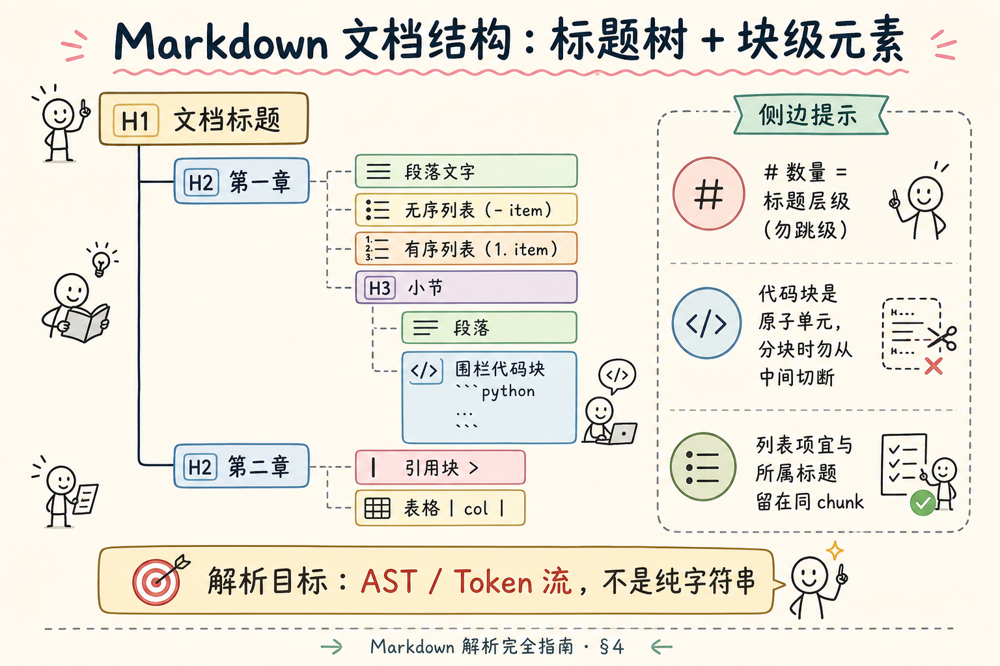
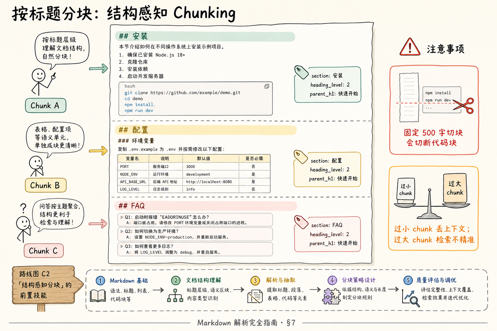

# RAG 数据采集与解析（二）：Markdown 解析完全指南

> 技术团队的知识库越来越常是 **Markdown**：README、内部 Wiki 导出、Obsidian/Notion 同步、文档站源码。它比 PDF 友好——标题用 `#` 就能分层，代码用围栏包起来。但若你把 `.md` 当纯文本 **按 500 字一刀切**，FAQ 的问题会掉进上一个 chunk 的尾巴，代码块从 `def` 中间断开，检索「安装命令」命中半行 shell。这篇是 [企业 RAG 路线图](ENTERPRISE_RAG_ROADMAP.md) **C 轨第二篇**（路线图第 **45** 条），讲清 **标题层级、代码块、列表** 的解析意义、对 **RAG 分块** 的指导，以及 Python 里 **mistune** / **markdown-it-py** 的最小上手。前置：[37 PDF 版面](37.pdf-layout-tables-tutorial.md)、路线图 69（结构感知分块）。

---

## 目录

1. [前言：Markdown 是「带结构的文本」](#1-前言markdown-是带结构的文本)
2. [本文边界与动手路径](#2-本文边界与动手路径)
3. [Markdown 在 RAG 链路中的位置](#3-markdown-在-rag-链路中的位置)
4. [文档结构：标题、段落、列表、代码块](#4-文档结构标题段落列表代码块)
5. [解析到底在做什么：AST 与 Token](#5-解析到底在做什么ast-与-token)
6. [标题层级：分块与导航的骨架](#6-标题层级分块与导航的骨架)
7. [对 RAG 分块的意义：结构感知 Chunking](#7-对-rag-分块的意义结构感知-chunking)
8. [最小实战：mistune 与 markdown-it-py](#8-最小实战mistune-与-markdown-it-py)
9. [元数据、代码块与特殊元素](#9-元数据代码块与特殊元素)
10. [综合概念地图](#10-综合概念地图)
11. [常见陷阱与 FAQ](#11-常见陷阱与-faq)
12. [总结与系列下一步](#12-总结与系列下一步)

---

## 1. 前言：Markdown 是「带结构的文本」

**Markdown**：一种轻量标记语言，用少量符号（`#`、`-`、`` ``` `` 等）在纯文本里表达 **标题、列表、强调、代码** 等结构。  
通俗说：**写字时顺手打标记，渲染后像排版好的网页**。

企业里常见来源：

| 来源 | 特点 |
|------|------|
| Git 仓库 README / docs | 标题清晰、代码多 |
| Wiki 导出 | 可能有扩展语法 |
| 静态站（MkDocs、Docusaurus） | 多文件 + 站内链接 |
| 人工维护的政策 MD | 列表、表格并存 |

若解析阶段只 `open().read()` 当字符串，你会 **浪费已有结构**——而结构正是 **低成本的高精度分块线索**。

**读完本文，你应该能做到：**

1. 说出标题、代码块、列表在 RAG 里各自的 **完整性约束**。  
2. 解释 **解析** 与 **去符号** 的区别，知道 AST 是什么。  
3. 描述「按 H2/H3 分块」策略及过长节的二次切分。  
4. 用 **mistune** 或 **markdown-it-py** 把 MD 拆成带类型节点并打印大纲。  
5. 为 chunk 设计 `section`、`heading_level` 等元数据字段。

---

## 2. 本文边界与动手路径

**档位：地基篇（C1 + 衔接 C2 分块）。**

**本文讲：** MD 结构要素、解析器角色、结构感知分块直觉、双库最小示例。  
**本文不讲：** 完整 CommonMark 规范逐条、自定义渲染主题、MDX/React 组件、Wiki 专有语法全家桶。

### 2.1 动手路径表

| 步骤 | 你做什么 | 验收 |
|------|----------|------|
| A | 读 §4～§6，给一篇样例 MD 手画标题树 | 标出代码块边界 |
| B | 读 §7，写你家文档的 chunk 规则（2 条） | 含「代码不切断」 |
| C | 跑 §8 任一脚本 | 控制台打出 heading 列表 |
| D | 把 §9 元数据表抄进设计笔记 | 含 section |

**环境：** `pip install mistune` 或 `pip install markdown-it-py`；样例 MD 可用仓库自带 README。

### 2.2 沿用前文

| 概念 | 来自 |
|------|------|
| PDF 结构难题对比 | [37 PDF 版面](37.pdf-layout-tables-tutorial.md) |
| 固定长度分块局限 | 路线图 **64～68** |
| 结构感知分块 | 路线图 **69～70** |
| Token 预算 | [28 上下文窗口](28.context-window-tutorial.md) |

---

## 3. Markdown 在 RAG 链路中的位置

典型入库路径：

```text
.md 文件 → 解析（AST/事件）→ 清洗 → 按结构分块 → Embedding → 向量库
```

Markdown 的优势：**结构在源文件里显式存在**，不必像 PDF 那样猜坐标。

| 阶段 | 无解析（当纯文本） | 有解析 |
|------|-------------------|--------|
| 分块 | 固定字符数 / 递归字符切 | 按标题、按块类型 |
| 代码问答 | 易切断函数体 | 整段 ` ``` ` 保留 |
| 溯源展示 | 只能报字符偏移 | 可报「第三章第二节」 |
| 过滤检索 | 难排除 front matter | 可跳过 YAML 头 |

**Front Matter**：文件开头 `---` 包裹的 YAML 元数据（title、tags、date）。  
通俗说：**文章标签纸**，常不应进正文 chunk，但宜进 **文档级元数据**。

### 3.1 为什么技术文档特别适合 MD 入库

| 特征 | 对 RAG 的好处 |
|------|----------------|
| 标题分层清晰 | 低成本结构感知分块 |
| 代码块 fenced | 配置/命令问答可整段引用 |
| 列表写步骤 | 操作类问题逐步命中 |
| 版本跟 Git | `commit` 做 `version` 元数据 |
| diff 可审 | 政策变更可增量重索引 |

相对 PDF，MD 省掉了 **栏序、页眉** 大坑（见 [37 篇](37.pdf-layout-tables-tutorial.md)），但 **扩展语法、多文件站点** 会带来新坑——本篇后半会讲。

### 3.2 与「渲染后 HTML」的分工

很多文档站是 **MD 源码 → 构建 → HTML**。入库优先级：

```text
有 MD 源 → 本篇解析
只有 HTML → 39 篇正文抽取
只有 PDF 打印件 → 37 篇版面
```

**不要** 默认「网页抓下来就行」——同一内容，MD 源文件的 **标题与代码边界** 通常更干净。

---

## 4. 文档结构：标题、段落、列表、代码块

读下图：一棵典型的 MD 标题树，以及挂在下面的块级元素。




对照上图，逐项说明。

### 4.1 标题层级（Heading Hierarchy）

语法：`#` 一级、`##` 二级……最多通常到 `######`。

**标题层级**：用 `#` 数量编码的大纲级别，形成 **树状目录**。  
通俗说：**章 → 节 → 小节** 的骨架。

规范习惯：

- 一篇文档 **只有一个 H1**（文题）；  
- **不要跳级**（H1 直接接 H3 会搞乱大纲）；  
- RAG 分块常 **以 H2 或 H3 为边界**——取决于段落长度。

### 4.2 段落（Paragraph）

空行分隔的连续文本。段落是 **自然语言检索** 的基本单元，但生产上很少「一段一块」，而是 **若干段落在同一标题下合并**。

### 4.3 列表（List）

两类常见：

| 类型 | 语法 | 注意 |
|------|------|------|
| **无序列表** | `-` / `*` / `+` | 嵌套靠缩进 |
| **有序列表** | `1.` `2.` | 编号可能不连续 |

**列表完整性**：一个政策下的 5 条 bullet，宜与所属 **标题** 在同一 chunk，避免「只检索到第 3 条」却丢了标题上下文。  
通俗说：**别让问题清单和「问题」标题分家**。

### 4.4 代码块（Fenced Code Block）

围栏写法：

````markdown
```python
def hello():
    print("hi")
```
````

**代码块**：围栏或缩进形成的 **原样保留** 代码区域，类型上是一个 **不可分割的原子块**。  
通俗说：**一整段命令/程序要完整入库**，从中间切开就无法执行或比对。

对 RAG：

- 问答「这段配置怎么写」需要 **整段代码** 进上下文；  
- Embedding 对代码有时一般，可额外存 `language` 元数据，或对代码路径走 **关键词检索**（路线图 76）。

### 4.5 其他常见块（了解）

| 元素 | RAG 提示 |
|------|----------|
| 引用 `>` | 常是注意事项，宜跟所属节 |
| 表格 | 同 PDF，宜完整成块 |
| 链接 | 保留 URL 文本供溯源 |
| 图片 `` | 仅有 alt 文本进索引；图内字需多模态或 OCR |

### 4.6 内联元素（了解）

**内联**（Inline）：粗体、斜体、行内代码、链接等 **不单独占段** 的标记。  
通俗说：**嵌在句子里的强调**，分块时随段落一起走。

解析器会把 `**重要**` 变成带 `emphasis` 节点的段落；入库 **抽纯文本** 即可，不必保留星号——但行内 `` `code` `` 建议保留反引号内容，便于搜配置项名。

### 4.7 常见扩展：GFM 表格与任务列表

**GFM**（GitHub Flavored Markdown）：GitHub 常用的 MD 扩展，含表格、任务列表、删除线等。  
通俗说：**程序员最熟的那套 Markdown 方言**。

```markdown
| 步骤 | 命令 |
|------|------|
| 安装 | `pip install x` |

- [x] 完成配置
- [ ] 待办：上线
```

任务列表 `- [ ]` 在政策文档少见，在 **项目 Wiki** 常见。解析时 **整块列表进同一 chunk**，避免只检索到「待办」二字却没有事项正文。

---

## 5. 解析到底在做什么：AST 与 Token

**解析**（Parsing）：把 Markdown **字符串** 变成 **带类型的结构表示**，供后续遍历、渲染或分块。  
通俗说：**认字之外，还要认「这是标题还是代码」**。

两种常见内部表示：

| 表示 | 说明 |
|------|------|
| **AST**（Abstract Syntax Tree，抽象语法树） | 树节点：heading、paragraph、code_block… |
| **Token 流** | 顺序事件：开始 heading → 文本 → 结束 heading |

**渲染**（Rendering）：把 AST 转成 HTML/PDF——RAG 入库 **不必须** 全渲染，但 **需要遍历结构**。

与「去掉 `#` 的纯文本」对比：

```markdown
## 安装
pip install foo
```

| 做法 | 结果 |
|------|------|
| 正则删 `##` | 丢失「安装是二级标题」 |
| 解析 | 得到 `heading level=2 text=安装` + `paragraph` |

---

## 6. 标题层级：分块与导航的骨架

标题在 RAG 里干三件事：

1. **分块边界**：新 H2 往往意味着新 chunk 开始；  
2. **面包屑**：`H1 > H2 > H3` 写入 `section` 元数据，检索时可过滤「只在安全规范章」；  
3. **用户溯源**：答案引用显示「员工手册 › 差旅 › 住宿标准」，比「字符 1204～1588」友好。

**跳级标题** 的害处：大纲树错乱，面包屑算法会误认父子关系。入库前可用 linter（如 `markdownlint`）抽检。

**过长章节**：单个 H2 下 8000 字，不能一块塞进窗口——在 **H3 或段落边界** 二次切，并 **重复父标题前缀**（overlap 思路，路线图 67）：

```text
[父] ## 安全规范 › ### 密码策略
（正文…）
```

---

## 7. 对 RAG 分块的意义：结构感知 Chunking

读下图：同一篇长文，按标题切 vs 按固定长度切，chunk 边界差异。



对照上图：

**结构感知分块**（Structure-aware Chunking）：利用标题、列表、代码块等 **文档固有结构** 决定切分点，而不是仅按字符数。  
通俗说：**沿章节接缝切蛋糕，不按固定厘米锯**。

与路线图对照：

| 路线图条 | 本文落点 |
|----------|----------|
| 69 结构感知 | 按 H2/H3 |
| 70 MD AST 分块 | §8 解析后遍历 |
| 76 代码块完整 | 代码不切断 |
| 77 列表处理 | 列表跟标题 |

### 7.1 和固定长度分块的 trade-off

| 策略 | 优点 | 缺点 |
|------|------|------|
| 固定长度 + overlap | 实现简单 | 断章、断代码 |
| 按标题 | 语义完整 | 块大小不均 |
| 混合 | 标题内超长再按段落切 | 实现稍复杂 |

**推荐默认：** MD 文档 **优先按标题**，标题内超 token 预算再 **递归字符切**（路线图 65），并保证 **代码块整体迁移** 到单独 chunk。

### 7.2 块大小与检索

过小 chunk：上下文不足，「它」指代不明。  
过大 chunk：embedding 模糊，**关键句** 淹没在噪声里。  
经验起点（需评测调）：技术文档 **512～1024 token** 量级，以 **不拆标题节** 为前提。

### 7.3 反例：固定长度切断代码的真实问法

用户问：「示例里的 `config.yaml` 端口字段怎么写？」

固定 400 字切块后，检索命中：

```text
... port: 8080
database:
  host: ...
```

——缺少上文 `server:` 键，模型可能 **猜** 成错误层级。  
按 H2「配置」整块入库时，检索段包含 **完整 YAML 片段**，答案可对齐复制。

这类题在 **运维/开发文档 RAG** 里占比极高，是结构感知分块的第一论据。

### 7.4 Parent 标题重复策略

**Parent 标题重复**：子 chunk 开头重复父级标题文本，弥补块变小后的上下文丢失。  
通俗说：**每个小块前贴一张「我在哪一章」的标签**。

示例：

```text
【快速开始 › 安装 › 系统要求】
本文档要求 Python 3.10+ ...
```

与路线图 **72 Parent-Document Retriever** 呼应：小块检索、大块（整节）生成时，父路径已写在元数据里。

---

## 8. 最小实战：mistune 与 markdown-it-py

两个库都支持 CommonMark 系语法；初学任选一个即可。

### 8.1 mistune：AST 直遍历

```python
# pip install mistune
import mistune

md = """
# 快速开始

## 安装

请先安装依赖：

```bash
pip install myrag
```

## 配置

- 复制 `.env.example`
- 填写 `API_KEY`
"""

markdown = mistune.create_markdown(renderer="ast")
doc = markdown(md)


def walk(nodes, depth=0):
    for node in nodes:
        t = node["type"]
        if t == "heading":
            level = node["attrs"]["level"]
            text = "".join(walk(node["children"]))
            print("  " * depth + f"H{level}: {text}")
        elif t == "block_code":
            lang = node["attrs"].get("info", "")
            print("  " * depth + f"code[{lang}]: {node['raw'][:40]}...")
        elif t == "list":
            print("  " * depth + "list:")
            walk(node["children"], depth + 1)
        elif t == "paragraph":
            text = "".join(walk(node["children"]))
            if text.strip():
                print("  " * depth + f"p: {text[:50]}")
        elif t == "text":
            return node["raw"]
        elif "children" in node:
            return "".join(walk(node["children"], depth))
    return ""


print("=== 文档大纲 ===")
walk(doc)
```

代码后解读：`create_markdown(renderer="ast")` 直接给 **字典树**，适合写 **分块器**——遇到 `heading` 就判断是否新开 chunk。

### 8.2 markdown-it-py：Token 流

```python
# pip install markdown-it-py
from markdown_it import MarkdownIt

md = MarkdownIt()
tokens = md.parse("""
## 安装

```bash
pip install myrag
```
""")

for tok in tokens:
    if tok.type in ("heading_open", "fence", "paragraph_open"):
        print(tok.type, tok.tag, tok.info or "", tok.map)
```

代码后解读：`markdown-it` 风格是 **开闭 token 成对**（`heading_open` / `heading_close`），适合流式处理大文件；`tok.map` 给出 **行号范围**，便于溯源到源 MD 行。

### 8.3 极简「按 H2 分块」伪逻辑

```python
def chunk_by_h2(ast_nodes):
    chunks, current = [], {"title": "前言", "blocks": []}
    for node in ast_nodes:
        if node["type"] == "heading" and node["attrs"]["level"] == 2:
            if current["blocks"]:
                chunks.append(current)
            title = extract_text(node)
            current = {"title": title, "blocks": []}
        else:
            current["blocks"].append(node)
    if current["blocks"]:
        chunks.append(current)
    return chunks
```

生产需补：front matter 剥离、代码块原子迁移、超长节二次切、token 计数。

### 8.4 跟读样例：打印 AST 长什么样

对 §8.1 的 `doc` 打印 `doc[2]`（第二个顶层节点），你会看到类似：

```python
{
    "type": "heading",
    "attrs": {"level": 2},
    "children": [{"type": "text", "raw": "安装"}],
}
```

**块级节点**（block-level）：独占一行的结构单元（标题、段落、列表、代码块）。  
通俗说：**排版上的「一行算一块」的大块**。

分块器编写建议：

1. 只遍历 **顶层 block**（mistune AST 已扁平一层）；  
2. 遇到 `block_code` **永不切开**；  
3. `heading` 的 `level` 决定 **是否新开 chunk**；  
4. 内联节点（`emphasis`、`link`）在段落内 **合并成纯文本** 再 embedding。

### 8.5 固定长度兜底：标题内超长怎么办

当单个 H2 下正文超过 token 预算（例如 1500 token）：

```text
1. 在该 H2 内按 H3 再切
2. 若无 H3，按段落（空行）切
3. 仍超长，才用递归字符切（路线图 65），且 overlap 100～200 字
4. 每个子 chunk 前缀重复「父标题面包屑」
```

**Overlap**（重叠窗口）：相邻 chunk 末尾与开头重复一段文字，避免语义在边界被切断。  
通俗说：**切块时让两边稍微叠一点**，检索时不容易「刚好缺半句」。

---

## 9. 元数据、代码块与特殊元素

建议 chunk 级元数据：

| 字段 | 示例 |
|------|------|
| `doc_id` | `docs_install_guide` |
| `chunk_id` | `docs_install_guide_h2_install` |
| `section` | `快速开始 › 安装` |
| `heading_level` | `2` |
| `heading_text` | `安装` |
| `source` | `docs/install.md` |
| `has_code` | `true` |
| `code_lang` | `bash` |

**Front Matter 处理**：用 `python-frontmatter` 或简单解析 `---` 块，字段进 **文档级** 索引，不重复进每个 chunk。

**扩展语法**：GitHub 表格、任务列表 `- [ ]`、脚注——不同解析器支持度不同；选型时对照你家 Wiki **实际导出格式** 做一次 **抽检矩阵**。

**安全**：MD 最终常渲染 HTML（路线图 23 XSS）；入库若存 HTML，要 **消毒**；纯文本入库风险低，但链接 URL 仍要防 `javascript:` 等。

### 9.1 多文件文档站：Docusaurus / MkDocs

静态站常结构：

```text
docs/
  index.md
  guide/install.md
  guide/config.md
  api/reference.md
```

入库时 **每文件一个 doc_id**，`section` 用路径面包屑：`guide › install`。站内链接 `/docs/guide/config` 在构建后变 HTML——**源 MD 优先于抓 HTML**（见 [39 篇](39.html-content-extraction-tutorial.md)）。

**sidebar 配置**（YAML）不要当正文 chunk；其中目录树可抽成 **导航元数据**，供前端「相关章节」展示，而非 embedding。

### 9.2 评测：结构分块好不好谁说了算

用 **10～20 个固定问答**（含代码、列表、跨节引用）做 **命中标注**：

| 指标 | 定义 |
|------|------|
| chunk 完整率 | 金标准段落是否完整落在一个 chunk |
| 首条命中率 | 正确 chunk 是否 Top-1 |
| 代码可执行率 | 抽出的命令复制能否跑（人工） |

结构感知分块的价值要用 **数字证明**，不是「感觉更合理」。半天就能在本地 MD 样例上跑一版——比直接上向量库再救火省一周。

### 9.3 反模式：把 MD 转 HTML 再 strip_tags

有人图省事：`pandoc` 转 HTML → BeautifulSoup `get_text`。这会 **丢掉标题层级信息**（只剩扁文本），又可能带进 HTML 模板噪声——**绕远路还更差**。正确路径：本篇 **直接解析 MD AST**；只有 **没有 MD 源** 时才去 [39 HTML 抽取](39.html-content-extraction-tutorial.md)。

### 9.4 与固定长度分块的混用公式（实用）

```text
外层：按 H2 切
内层：若 chunk token > 上限
  → 优先按 H3
  → 再按段落
  → 最后递归字符 + overlap
  → 代码块：若单块超限，整段独立成 chunk，不拦腰切
```

把这条写成伪代码放进你的 ingestion 服务注释里，新人接手时少踩 **「一刀切 500」** 的坑。

---

## 10. 综合概念地图


对照上图：Markdown 解析是 **低成本结构红利**——同样 5000 字，结构对了，检索命中率往往上一档。

### 10.1 速记表

| 概念 | 一句话 |
|------|--------|
| 解析 | 字符串 → 带类型结构 |
| 标题 | 分块边界 + 面包屑 |
| 代码块 | 原子，勿切断 |
| 列表 | 跟紧所属标题 |
| mistune / markdown-it | Python 常用解析器 |
| 结构感知分块 | 先沿标题切，再控 token |

---

## 11. 常见陷阱与 FAQ

1. **正则解析 Markdown** —— 代码块里的 `` ``` `` 会骗过简单规则，必用正规解析器。  
2. **忽略 front matter** —— `title: draft` 进索引会污染检索。  
3. **H1 切块过碎** —— 单文件文档常以 **H2** 为界，H1 作全书标题。  
4. **代码块当普通文本 embedding** —— 可存，但问答配置类建议加 **关键词或单独索引**。  
5. **Wiki 扩展语法当标准 MD** —— 换解析器或预处理宏。

**Q：解析后还要转 HTML 再抽文本吗？**  
A：RAG 入库 **可直接遍历 AST 抽纯文本**；HTML 是给人看的，多一步易引入标签噪声。

**Q：多文件 docs 站怎么入库？**  
A：每文件独立 `doc_id`，`section` 可含路径 `api/auth.md`；站内相对链接宜解析成绝对路径或存 `related_links`。

**Q：和 HTML 正文抽取谁先做？**  
A：有 `.md` 源 **优先 MD**；只有渲染后网页才走 [39 HTML](39.html-content-extraction-tutorial.md)。

**Q：mistune 和 markdown-it-py 怎么选？**  
A：要 **字典树** 选 mistune AST；习惯 **token 流** 或需 GFM 插件选 markdown-it-py。

**Q：标题下的表格很大怎么办？**  
A：同 PDF：**整表一块**，必要时 `chunk_type=table`，与路线图 75 一致。

**Q：同一仓库上千个 .md，要先合并吗？**  
A：**按文件分 doc_id** 即可；`section` 用文件路径 + 标题面包屑。合并成大文件反而丢 Git 粒度。

**Q：Obsidian / Notion 导出的 MD 有啥坑？**  
A: Obsidian 维基链接 `[[page]]`、Notion 导出 HTML 混杂——要 **实测解析器** 并做链接展开或预处理。

### 11.1 分块策略对照实验（概念）

同一篇 6000 字安装文档：

| 策略 | chunk 数 | 「安装命令」题命中率（示意） |
|------|----------|------------------------------|
| 固定 400 字 | 18 | 低（命令被切断） |
| 按 H2 | 6 | 高（命令完整在一节） |
| 按 H2 + 超长再切 | 8 | 高且单块 token 可控 |

实验不必上生产：**本地用 10 个固定问题** 做命中标注，就能在半天内验证结构分块是否值回开发成本。

### 11.2 与路线图 C2 衔接

| 路线图 | 本篇 |
|--------|------|
| 64 固定长度 | 标题内兜底 |
| 65 递归字符 | 超长节二次切 |
| 67 Overlap | §8.5 父标题前缀 |
| 69 结构感知 | §7 主线 |
| 70 MD AST 分块 | §8 代码 |
| 76 代码块完整 | §4.4、§8 |
| 77 列表处理 | §4.3 |

### 11.3 最小入库流水线（串联）

```text
glob("docs/**/*.md")
  → 读文件 + 剥离 front matter
  → mistune AST
  → chunk_by_h2（代码块原子）
  → 每 chunk 计 token，超长则 §8.5
  → 写 metadata: source, section, heading_text
  → embedding → upsert 向量库
```

初学者 **先实现到 chunk 打印** 再接入向量库，能少走「嵌进去才发现代码被切断」的弯路。

### 11.4 Wikilink 与相对链接

Obsidian 等导出含 `[[其他页面]]` **维基链接**（Wikilink）。可保留原文、展开为标题、或建链接图索引。相对链接 `[安装](install.md)` 宜解析为仓库内绝对路径，写入 `related_docs` 元数据。

### 11.5 从 AST 到纯文本

```python
def node_to_plain(node) -> str:
    t = node["type"]
    if t == "text":
        return node["raw"]
    if t == "block_code":
        return node["raw"]
    if t == "heading":
        inner = "".join(node_to_plain(c) for c in node["children"])
        return "\n\n" + inner + "\n\n"
    if "children" in node:
        return "".join(node_to_plain(c) for c in node["children"])
    return ""
```

embedding 前统一换行、去多余空行，但 **不要** 删掉代码块内换行——配置与命令对换行敏感。

### 11.6 CommonMark 与方言（了解）

**CommonMark**：Markdown 的规范基准；各解析器「差不多」但不完全一致。  
**方言**：GFM、Obsidian、Typora 等扩展。选型时用 **生产样例 MD** 跑一遍 AST，统计未知节点类型——比背规范更靠谱。

### 11.7 列表嵌套与缩进坑

四级嵌套列表在部分导出里缩进用 **Tab 与空格混用**，解析器可能断树。入库前可 `expandtabs(4)` 归一；分块时 **整棵子列表跟所属标题**，别把嵌套项拆到不同 chunk——否则问「第三步子步骤」时上下文丢失。

### 11.8 代码块语言标记的用处

围栏后的 `python`、`bash`、`yaml` 等 **info string** 应写入 `code_lang` 元数据。问答「给出 bash 安装命令」时可用 metadata filter `code_lang=bash` 缩小检索面；对 **纯配置类** 文档，还可与关键词检索并用，弥补 embedding 对符号不敏感的问题。

### 11.9 标题锚点与站内链

许多 MD 渲染器会为标题生成 `id`（如 `## 安装` → `#安装`）。入库时可预计算 **slug**，与静态站 URL 片段对齐，方便回答里给出 **可点击章节链接**——这是 Grounding 体验的一部分，数据源在解析阶段就能准备好。

---

## 12. 总结与系列下一步

1. Markdown 的价值在 **显式结构**，不是「另一种 txt」。  
2. **标题层级** 是分块与溯源骨架；**代码块、列表** 有完整性约束。  
3. 解析产出 **AST/Token**，不是删掉 `#` 的纯文本。  
4. RAG 默认 **结构感知分块**，固定长度作标题内兜底。  
5. mistune / markdown-it-py 足够完成 **大纲提取 + 分块原型**。

### 12.1 系列下一步

| 目标 | 阅读 |
|------|------|
| HTML 噪声与正文抽取 | [39 HTML 正文抽取](39.html-content-extraction-tutorial.md) |
| HTML DOM 分块 | 路线图 **71** |
| 递归字符分块 | 路线图 **65** |

### 12.2 学习目标自检

- [ ] 能画一篇 MD 的标题树  
- [ ] 能说明代码块为何不能拦腰切  
- [ ] 能跑通 §8 任一脚本  
- [ ] 能写出按 H2 分块的伪代码  

### 12.3 面试 30 秒版

「技术文档优先解析 MD AST，按 H2 结构分块，代码块和列表保持完整；mistune 或 markdown-it 遍历标题树，chunk 带 section 元数据；不要正则删井号，也不要 pandoc 转 HTML 再抽文本。」

### 12.4 与团队协作：谁维护解析器

| 角色 | 职责 |
|------|------|
| 后端 / 数据 | 解析、分块、入库流水线 |
| 技术写作 | 标题层级规范、front matter 模板 |
| 前端 | 渲染与 XSS，不直接改 chunk |
| 产品 | 用固定评测题验收「安装命令」类命中 |

当写作规范 **标题不跳级、代码用围栏** 时，解析与分块代码会简单一半——**源文档治理** 和 **解析器** 是同一枚硬币的两面。

### 12.5 动手作业（可选，30 分钟）

1. 选仓库里一篇 `README.md`，用 §8 mistune 脚本打印 H2 列表；  
2. 手写「按 H2 分块」会切成几块，每块是否含完整代码；  
3. 用 [27 Token](27.token-counting-billing-tutorial.md) 思路估每块 token，是否超 1024；  
4. 写下若超长，你会先切 H3 还是切段落——一句话理由。

做完这四步，你就比 **直接 `RecursiveCharacterTextSplitter(500)`** 的多数 demo 更贴近生产。

**延伸阅读**：仓库内多篇技术 README 就是最好的免费数据集——用自家文档做第一版 chunk 可视化，比下载陌生 PDF 更有代入感，也更容易说服写作同事配合改标题层级。结构对了，C2 分块调参才有意义。祝入库顺利，下篇 HTML 正文见。

---

> **初学者可能仍困惑的点**  
> - 「渲染好看的 MD」和「解析入库」是两条线——博客排版好看不等于 chunk 合理。  
> - 解析器不同，扩展语法支持不同；**用生产样例文件** 验，不要只验 CommonMark 教程。  
> - 结构感知不是「永远一块一整节」——太长还是要二次切，但要 **带着标题前缀**。  
> - 下一篇 HTML：网页是 **Markdown 的反面**——结构在标签里，噪声比正文还多。
