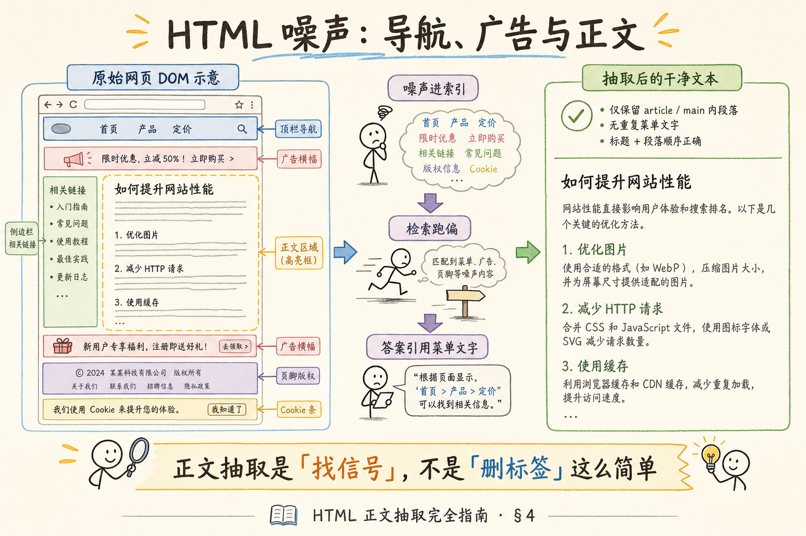
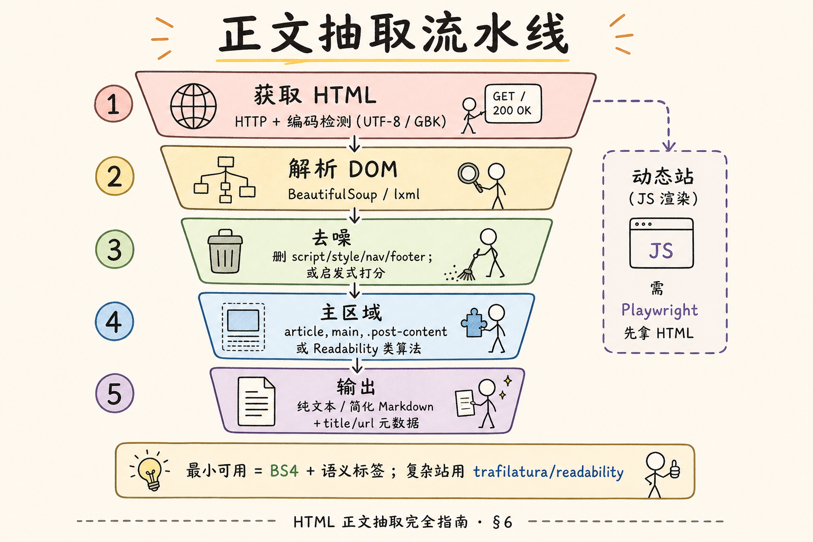

# RAG 数据采集与解析（三）：HTML 正文抽取完全指南

> 企业知识不只躺在 PDF 和 Git 里——产品帮助中心、博客、内部门户、抓取的行业资讯，大量是 **HTML 网页**。把整页 `innerText` 扔进向量库，检索会命中 **「首页」「登录」「Copyright 2024」** 比正文还多；用户问「如何重置密码」，引用来源却是顶栏导航里的三个字。这篇是 [企业 RAG 路线图](ENTERPRISE_RAG_ROADMAP.md) **C 轨第三篇**（路线图第 **46** 条），讲清 **噪声（导航/广告）** 与 **正文** 的直觉分界、**BeautifulSoup** 最小抽取、**编码** 提示，以及何时需要 **Readability** / **trafilatura** 等进阶。前置：[38 Markdown 解析](38.markdown-parsing-tutorial.md)、路线图 48（编码检测）。

---

## 目录

1. [前言：网页不是一整块正文](#1-前言网页不是一整块正文)
2. [本文边界与动手路径](#2-本文边界与动手路径)
3. [HTML 在 RAG 链路中的位置](#3-html-在-rag-链路中的位置)
4. [页面噪声：导航、广告、侧栏、页脚](#4-页面噪声导航广告侧栏页脚)
5. [正文抽取的直觉：信号在哪里](#5-正文抽取的直觉信号在哪里)
6. [抽取流水线：获取 → 解析 → 去噪 → 主区域](#6-抽取流水线获取--解析--去噪--主区域)
7. [最小实战：BeautifulSoup](#7-最小实战beautifulsoup)
8. [编码：UTF-8、GBK 与乱码](#8-编码utf-8gbk-与乱码)
9. [动态页面、进阶工具与元数据](#9-动态页面进阶工具与元数据)
10. [综合概念地图](#10-综合概念地图)
11. [常见陷阱与 FAQ](#11-常见陷阱与-faq)
12. [总结与系列下一步](#12-总结与系列下一步)

---

## 1. 前言：网页不是一整块正文

打开任意企业帮助中心页，**DOM 树** 大致长这样：

```text
html
├── head（meta、title、一堆 script/link）
├── body
│   ├── header.nav（Logo、菜单、搜索框）
│   ├── aside.sidebar（相关链接、广告）
│   ├── main / article（真正答案）
│   ├── footer（版权、备案、Cookie 提示）
│   └── div.popup（订阅弹窗）
```

**正文抽取**（Main Content Extraction）：从完整 HTML 中 **定位并输出** 承载核心信息的主体区域文本，剔除导航、装饰、广告等 **噪声**。  
通俗说：**从网页里只抠「文章部分」**，不是整页复印。

若不做抽取，RAG 会遇到：

| 现象 | 原因 |
|------|------|
| 答案引用了菜单文字 | 导航在每个页面重复，embedding 权重高 |
| 检索「价格」命中页脚 | 页脚也有「价格」链接文字 |
| 上下文充满 script 残留 | 未删 `<script>` 内容 |
| 中文变菱形乱码 | 编码猜错 |

**读完本文，你应该能做到：**

1. 列举至少四类 HTML 噪声及危害。  
2. 用「链接密度、文本块连续性」解释正文直觉。  
3. 写通 **BeautifulSoup** 最小抽取脚本（语义标签 + 去 script）。  
4. 说明 **UTF-8 / GBK** 检测与 `response.encoding` 常见坑。  
5. 知道何时升级到 **trafilatura** / **Playwright** 抓渲染后 HTML。

---

## 2. 本文边界与动手路径

**档位：地基篇（C1）。**

**本文讲：** 噪声分类、正文直觉、BS4 最小管线、编码要点、与 MD/PDF 的分工。  
**本文不讲：** 完整爬虫合规与反爬、浏览器指纹、大规模分布式抓取、CSS 选择器大全。

### 2.1 动手路径表

| 步骤 | 你做什么 | 验收 |
|------|----------|------|
| A | 读 §4～§5，打开一帮助页标 DOM 噪声 | 圈出 main/article |
| B | 读 §6～§7，跑 BS4 脚本 | 输出比整页短、可读 |
| C | 故意用错编码看乱码，再修正 | 中文正常 |
| D | 写 chunk 元数据：url、title | 可溯源 |

**环境：** `pip install beautifulsoup4 lxml requests`；准备一两个 **静态** 帮助文档 URL 或本地 `.html` 文件。

### 2.2 沿用前文

| 概念 | 来自 |
|------|------|
| Markdown 结构分块 | [38 Markdown 解析](38.markdown-parsing-tutorial.md) |
| PDF 版面噪声 | [37 PDF 版面](37.pdf-layout-tables-tutorial.md) |
| HTML DOM 分块 | 路线图 **71** |
| 编码检测 | 路线图 **48** |

---

## 3. HTML 在 RAG 链路中的位置

```text
URL / 爬虫 → 字节流 → 编码解码 → DOM 解析 → 正文抽取 → 清洗 → 分块 → 索引
```

与 Markdown 对比：

| 维度 | Markdown | HTML |
|------|----------|------|
| 结构 | `#` 显式 | `<h1>`～`<h6>`、嵌套 div |
| 噪声 | 少 | 多（模板、广告） |
| 来源 | 仓库文件 | 抓取 / 导出 |
| 解析目标 | AST | DOM 树 + 启发式找 main |

企业场景常见入口：

- **批量抓取** 公开文档站（遵守 robots.txt 与法务）；  
- **导出** CMS 静态 HTML；  
- **单页** 用户粘贴 URL 即时入库（需防 SSRF）。

### 3.1 三种入库来源对比

| 来源 | 典型质量 | 主要风险 |
|------|----------|----------|
| CMS 静态导出 HTML | 中上 | 模板噪声 |
| 实时抓取帮助中心 | 波动 | JS 渲染、反爬 |
| 用户粘贴单 URL | 不确定 | SSRF、恶意页 |

**SSRF**（Server-Side Request Forgery，服务端请求伪造）：攻击者让你方服务器去请求 **内网地址**（如 `http://127.0.0.1/admin`）。  
通俗说：**借你的爬虫之手掏内网**——用户 URL 入库必须做 **域名白名单 / IP 封锁**。

### 3.2 抽取质量如何影响下游

```text
噪声正文 → embedding 偏向「首页登录」→ 检索常错 → rerank 也救不了 → 用户骂 AI
干净正文 → 检索命中步骤段 → 低温生成即可答对 → 溯源 URL 可信
```

与 [33 幻觉](33.llm-hallucination-tutorial.md) 的关系：HTML 噪声 **不是幻觉**，但会让模型 **引用错误片段** 后看起来像胡编——归因时先查 **抽到了什么**。

---

## 4. 页面噪声：导航、广告、侧栏、页脚

读下图：左为完整页面组成，右为抽取后应留下的主体。




对照上图，噪声清单：

### 4.1 导航（Navigation）

**导航**：站点级菜单、面包屑、标签栏，**每页重复**，链向别的页面。  
通俗说：**全站通用门框**，不是单篇文章内容。

危害：重复文本导致 embedding **偏向高频菜单词**；问答「如何申请」可能检索到 **「申请」菜单项** 而非操作步骤。

### 4.2 广告与推广（Ads / Promo）

横幅、侧边「相关产品」、订阅条。语义与正文 **无关**，却常含 **促销关键词**，干扰商业类问答。

### 4.3 侧栏（Sidebar）

相关文章列表、目录折叠、社交分享按钮。部分 **目录** 有用——若与正文标题重复，宜 **去重** 后只留一份。

### 4.4 页脚（Footer）

版权、备案号、隐私政策链接。文字短但 **全站重复**，是检索污染重灾区。

### 4.5 非可见元素

| 标签 | 处理 |
|------|------|
| `<script>` `<style>` | 删除 |
| `<noscript>` | 通常删 |
| HTML 注释 | 删 |
| `display:none` 隐藏字 | 视情况：SEO 作弊页要警惕 |

### 4.6 模板重复与全站检索污染

企业帮助中心 **同一套 header/footer** 出现在上千 URL。若整页入库，向量空间里 **「登录」「首页」** 出现次数远超任何一篇正文句子——用户问业务问题时，Top-K 常被导航句 **占坑**。

**去模板**（Template Deduplication）：对多页 HTML 比较 DOM 公共子树，剥离相同 header/footer。  
通俗说：**上千页共用的门框只存一份，不要每页复制进索引**。

地基阶段可先用 **删 nav/footer 标签** 的粗规则；规模化后再考虑 DOM diff 自动找公共块。

---

## 5. 正文抽取的直觉：信号在哪里

没有统一标准答案，但人类编辑和 **Readability** 类算法共享一些 **启发式**（Heuristics）：

| 信号 | 正文倾向 | 噪声倾向 |
|------|----------|----------|
| **文本密度** | 连续长段落 | 短词碎片 |
| **链接密度** | 低（相对文字） | 高（一堆 `<a>`） |
| **标签语义** | `<article>` `<main>` | `<nav>` `<footer>` |
| **class/id 名** | `post-content`, `entry` | `sidebar`, `widget` |
| **DOM 深度** | 中等包裹 | 极浅或极深广告容器 |

**链接密度**（Link Density）：页面文字中 **锚文本字符占全文比例**；导航区往往 **链接多、说明少**。  
通俗说：**一行里十个蓝字链接，多半不是正文段落**。

**主内容区**（Main Content / Article Body）：承载 **单篇主题** 的最长连续文本块。  
通俗说：**像 Word 文档正文的那一团字**。

地基阶段：**语义 HTML5 标签**（`<main>`、`<article>`）能覆盖不少现代文档站；老站靠 **class 名猜测 + 去噪**。

### 5.1 Readability 算法在做什么（了解）

**Readability**（可读性正文算法）：Mozilla 开源的一套 **打分选块** 方法，核心步骤：

1. 去掉 script/style 等；  
2. 对候选 DOM 节点算 **文本长度、链接密度、class 名惩罚**；  
3. 选分数最高的节点作根；  
4. 再清理无关子节点。

**trafilatura**、**readability-lxml** 可视为该思路的 **工程实现**。你不必手写打分，但理解 **「长文本、少链接」** 就能解释它们为何常比整页好。

### 5.2 何时规则法够、何时上算法

| 场景 | 建议 |
|------|------|
| 自家帮助中心模板统一 | BS4 + `main` + 域名规则 |
| 抓取上千异构博客 | trafilatura 批量 |
| 新闻/公众号 HTML | Readability 系 |
| 强 JS 单页应用 | Playwright 后再抽 |

---

## 6. 抽取流水线：获取 → 解析 → 去噪 → 主区域

读下图漏斗：从原始 HTML 到可入库文本的五步。




对照上图：

1. **获取**：`requests.get` 或读本地文件；注意 **重定向、超时、User-Agent**。  
2. **编码**：见 §8；得到正确 **Unicode 字符串**。  
3. **解析 DOM**：BeautifulSoup + `lxml` 解析器。  
4. **去噪**：`decompose()` 掉 script/style/nav/footer 等。  
5. **主区域**：优先 `main` / `article`；找不到再用 **最大文本块启发式** 或 **trafilatura**。

输出形态：

- **纯文本**：入库简单；  
- **简化 Markdown**（保留 `h1`～`h3`、列表）：利于 [38 篇](38.markdown-parsing-tutorial.md) 同款结构分块。

---

## 7. 最小实战：BeautifulSoup

```python
# pip install beautifulsoup4 lxml requests
from __future__ import annotations

import re
from pathlib import Path

import requests
from bs4 import BeautifulSoup, Comment

# 本地文件或 URL 二选一
HTML_PATH = Path("sample_help.html")
URL = None  # 例如 "https://example.com/docs/reset-password"


def fetch_html() -> bytes:
    if URL:
        resp = requests.get(URL, timeout=15)
        resp.raise_for_status()
        # 编码见 §8：优先用 apparent_encoding 修正
        resp.encoding = resp.apparent_encoding or resp.encoding
        return resp.text.encode("utf-8")  # 统一 bytes 入口可省略
    return HTML_PATH.read_bytes()


def remove_noise(soup: BeautifulSoup) -> None:
    tags = ["script", "style", "noscript", "svg", "iframe"]
    for name in tags:
        for t in soup.find_all(name):
            t.decompose()
    for comment in soup.find_all(string=lambda t: isinstance(t, Comment)):
        comment.extract()
    for selector in ("nav", "footer", "header", "aside"):
        for t in soup.find_all(selector):
            t.decompose()


def pick_main_root(soup: BeautifulSoup):
    for sel in ("main", "article", "[role='main']"):
        node = soup.select_one(sel)
        if node:
            return node
    # 兜底：body（噪声已剔一部分）
    return soup.body or soup


def html_to_text(root) -> str:
    text = root.get_text(separator="\n", strip=True)
    text = re.sub(r"\n{3,}", "\n\n", text)
    return text


def extract(html_bytes: bytes) -> dict:
    soup = BeautifulSoup(html_bytes, "lxml")
    title = (soup.title.string or "").strip() if soup.title else ""
    remove_noise(soup)
    root = pick_main_root(soup)
    return {
        "title": title,
        "text": html_to_text(root),
        "root_tag": root.name,
    }


if __name__ == "__main__":
    raw = fetch_html()
    if isinstance(raw, str):
        raw = raw.encode("utf-8")
    result = extract(raw)
    print("title:", result["title"])
    print("root:", result["root_tag"])
    print("preview:\n", result["text"][:600])
```

代码后解读：

1. **先删 script/style**，否则 `get_text` 会带上 JS 字符串。  
2. `nav/footer/header/aside` 是 **粗粒度去噪**——个别站点正文误放在 `aside` 时要针对域名调规则。  
3. `select_one("main")` 命中则质量通常够用；`root_tag` 帮你 **监控兜底率**。  
4. `separator="\n"` 保留块级换行，利于后续按标题分块。  
5. 生产加：`url`、`fetched_at`、正文 **字符数阈值**（过短可能是抽取失败）。

### 7.1 和整页抽取对比

对同一 HTML 跑两次：不 `remove_noise` vs 完整 `extract`。你会看到字符数可能 **少一半**，但问答 **命中率更高**——这是正确方向。

### 7.2 可选：trafilatura 一行对比

```python
# pip install trafilatura
import trafilatura

downloaded = trafilatura.fetch_url("https://example.com/docs/page")
text = trafilatura.extract(downloaded, include_comments=False, include_tables=True)
print(text[:500] if text else "抽取失败")
```

与 BS4 脚本对比 **字符数、可读性、是否含导航**。trafilatura 在 **新闻/博客** 上常更省心；企业帮助中心若模板规整，**语义标签法** 有时更可解释、更好调试。

### 7.3 本地 HTML 文件调试

```python
from pathlib import Path
html = Path("export.html").read_bytes()
result = extract(html)
```

抓取不稳定时，先把目标页 **另存为 HTML**，在本地迭代选择器，再迁回 URL 抓取。

### 7.4 选择器调试技巧

在 Chrome DevTools 里对正文节点 **Copy → Copy selector**，粘贴到 `soup.select_one()` 试运行。注意选择器过长往往 **脆弱**——优先语义标签，class 选择器加 **域名白名单** 后再用。每次站点改版后，用 §12.4 冒烟清单回归，避免静默退化。维护 **域名 → 选择器** 映射表时，附上该站 **正文样例 URL** 与 **上次通过日期**，方便交接与审计。抽取层稳定后，再进入路线图 C2 做 chunk size 与 overlap 的系统调参。至此 C1 数据采集与解析三篇全部收束，可以开香槟了（开玩笑，先跑冒烟清单再庆祝即可。加油啦！）

---

## 8. 编码：UTF-8、GBK 与乱码

**字符编码**（Character Encoding）：字节流解释成字符的规则；中文站常见 **UTF-8** 与 **GBK/GB18030**。  
通俗说：**同一串字节，用错字典就变成菱形乱码**。

### 8.1 三层信号（优先级从高到低）

1. HTTP 头 `Content-Type: charset=...`  
2. HTML `<meta charset="utf-8">` 或 `http-equiv`  
3. **统计猜测**：`chardet` / `requests.apparent_encoding`

```python
resp = requests.get(url, timeout=15)
resp.encoding = resp.apparent_encoding  # 常见修正
html = resp.text
```

读本地文件：

```python
raw = path.read_bytes()
for enc in ("utf-8", "gb18030", "latin-1"):
    try:
        text = raw.decode(enc)
        break
    except UnicodeDecodeError:
        continue
```

**乱码验收**：正文应含 **正常中文标点与常用字**；若满屏 `` 或 ``，几乎必是编码错，不是模型问题。

### 8.2 与路线图 48 的关系

大规模抓取宜统一 **UTF-8 存储**；入库前 `normalize`（NFKC）与路线图 **53 文本清洗** 配合，去掉零宽字符、全角空格混用等。编码错在 **抓取瞬间** 就要修——事后向量库里的乱码只能重抓。

### 8.3 BOM 与零宽字符

**BOM**（Byte Order Mark，字节顺序标记）：部分编辑器在 UTF-8 文件头加 `EF BB BF`，可能导致 **首标题识别失败**。  
读本地 HTML 时：

```python
text = raw.decode("utf-8-sig")  # 自动去 BOM
```

**零宽字符**（Zero-width）：复制网页时夹带的不可见字符，影响分词与检索——入库前用 NFKC 归一（路线图 53 文本清洗）。

### 8.4 中文老站 GBK 坑

2000～2010 年代不少政企内网页是 **GBK** 编码。HTTP 头却写 `iso-8859-1` 时，`requests` 默认解码会 **全乱**。  
务必：

```python
resp.encoding = resp.apparent_encoding
# 或 chardet.detect(resp.content)["encoding"]
```

抽一份 **内网老 HTML 样例** 进回归集，防编码回归。

---

## 9. 动态页面、进阶工具与元数据

### 9.1 JavaScript 渲染

很多现代站 **首屏 HTML 几乎空**，内容由 JS 填充。`requests` 拿不到正文时：

| 手段 | 说明 |
|------|------|
| **Playwright** / Puppeteer | 真浏览器渲染后再抽 HTML |
| 官方 **API** / 导出 | 优先于爬网页 |
| 静态镜像 / MD 源 | 长期维护更稳 |

地基篇：**先识别是不是 JS 站**（查看源代码 vs 审查元素文本量差异）。

### 9.2 进阶抽取库

| 工具 | 特点 |
|------|------|
| **trafilatura** | 正文抽取专精，多语言，适合批量 |
| **readability-lxml** | Mozilla Readability 算法移植 |
| **newspaper3k** | 偏新闻页 |

升级时机：BS4 + `main` 标签 **兜底率 >30%** 或 **人力维护选择器成本过高**。

### 9.3 分块与元数据

| 字段 | 用途 |
|------|------|
| `url` | 溯源链接 |
| `title` | 页面标题 |
| `h1` | 文内主标题（有时≠title） |
| `fetched_at` | 缓存刷新 |
| `extractor` | `bs4_main_v1` / `trafilatura` |
| `section` | 由 h2 面包屑生成（衔接路线图 71） |

**HTML DOM 分块**：按 `h2`/`h3` 切 DOM 子树，比纯文本切更能 **保留列表与代码**（若帮助中心用 `<pre>`）。

### 9.4 合规与安全

- 遵守 **robots.txt** 与网站 ToS；  
- 企业内网抓取需 **权限**；  
- 用户提交 URL 要防 **SSRF**（内网 IP、file 协议）；  
- 入库前 **消毒** 若保留 HTML（路线图 23 XSS）。

### 9.8 批量抓取时的礼貌与稳定

| 实践 | 原因 |
|------|------|
| 遵守 `robots.txt` | 法务与封禁风险 |
| 限速（如 1 req/s） | 避免打挂源站 |
| 带合理 User-Agent | 部分站拒绝空 UA |
| 缓存 ETag / Last-Modified | 增量更新，少重复抽 |
| 失败重试指数退避 | 防雪崩 |

**增量更新**（Incremental Update）：只重抓 **变更页**，而非 nightly 全量重爬。  
通俗说：**只更新改过那几篇**，省带宽也省 re-embedding 成本（路线图 56）。

### 9.9 用户提交 URL 的最小安全闸

```python
from urllib.parse import urlparse

BLOCKED = ("localhost", "127.0.0.1", "0.0.0.0", "169.254.", "10.", "192.168.")

def is_safe_url(url: str) -> bool:
    p = urlparse(url)
    if p.scheme not in ("http", "https"):
        return False
    host = (p.hostname or "").lower()
    if any(host.startswith(b) for b in BLOCKED):
        return False
    return True
```

再加 **域名白名单**（只抓 `docs.yourcompany.com`）是更稳的企业默认。

### 9.10 正文长度与抽取质量启发式

| 信号 | 可能问题 |
|------|----------|
| 正文 < 100 字 | 抽取失败、JS 未渲染、或付费墙 |
| 正文 > 原 HTML 80% | 可能没去掉侧栏 |
| 链接文本占比 > 40% | 可能仍在 nav 区 |
| 标题为空 | 记得用 `<title>` 或首个 `h1` 兜底 |

入库流水线对异常样本 **打标进人工队列**，比默默 embedding **静默失败** 强一百倍。

### 9.11 与 Markdown 导出链路的配合

不少 CMS「导出 Markdown」比「抓 HTML」干净。若同时有两种来源：

```text
优先 MD（38 篇）>  HTML 正文抽取（本篇）>  PDF 打印件（37 篇）
```

同一篇文章 **只保留一条 canonical 源** 进索引，避免 URL 版与 MD 版 **重复 chunk** 互相稀释检索分数。

### 9.12 Playwright 最小示意（JS 站）

```python
# pip install playwright && playwright install chromium
from playwright.sync_api import sync_playwright

def fetch_rendered_html(url: str) -> str:
    with sync_playwright() as p:
        browser = p.chromium.launch(headless=True)
        page = browser.new_page()
        page.goto(url, wait_until="networkidle", timeout=30000)
        html = page.content()
        browser.close()
    return html
```

拿到 `html` 后 **仍走 §7 正文抽取**——渲染只解决「字在不在」，不解决「噪声多不多」。成本更高，只对 **确认是 SPA** 的域名开启。

### 9.13 抽取结果如何交给分块（衔接 C2）

HTML 正文 → 按 `h2` 切 DOM → 每块带 `url`、`section` → 再计 token。表格 `table` 与 `pre` 代码 **整块保留**（路线图 71、76）。本篇到 **干净正文** 为止；下一模块系统讲 chunk size 与 overlap 调参。

### 9.14 帮助页与博客页的差异

| 类型 | 噪声特点 | 抽取提示 |
|------|----------|----------|
| 帮助文档 | 侧栏目录重复 | 保留目录一份即可，勿进每 chunk |
| 营销博客 | 广告、推荐文 | trafilatura 常更稳 |
| 论坛帖 | 楼层回复 | 决定是否索引 `chunk_type=reply` |
| 登录墙 | 正文极短 | 检测后提示换 API 源 |

同一套 BS4 规则 **不要假设打天下**——按 `host` 维护 **小型 extractor 配置表** 是成熟团队的常态。

### 9.15 缓存与重抓策略

| 策略 | 适用 |
|------|------|
| 全文 hash 未变则跳过 | 稳定帮助中心 |
| 只重抽 `etag` 变的 URL | 大站增量 |
| 每周全量 | 小型站、合规归档 |

重抽后若正文变短超过 30%，打 **回归告警**——可能是改版导致选择器失效，而不是「网站删内容」。

### 9.16 表格与 `pre` 在 HTML 里的处理

帮助文档常把配置放在 `<pre><code>` 或 `<table>`。抽取时 **不要 flatten 成无换行一行**；保留换行与单元格边界，必要时转 Markdown 表再入库（衔接 [37 表块](37.pdf-layout-tables-tutorial.md) 思路）。问「端口默认值」类问题时，**行列结构** 就是答案本身。

---

## 10. 综合概念地图


对照上图：**抽取是检索的上游闸门**——噪声不进库，比事后 rerank 省钱。

### 10.1 速记表

| 概念 | 一句话 |
|------|--------|
| 正文抽取 | 只要文章主体 |
| 噪声 | 导航、广告、页脚重复 |
| 链接密度 | 高≈非正文 |
| BeautifulSoup | DOM 遍历地基 |
| 编码 | UTF-8/GBK 先对再抽 |
| 进阶 | trafilatura、Playwright |

### 10.2 C1 数据采集小结

三篇共同口诀：**先认格式、再保结构、后定 chunk**。PDF 怕栏与表，Markdown 怕拦腰切代码，HTML 怕导航重复。把这三类验收做进 CI，比换 embedding 模型更能提升首轮问答满意度。HTML 篇收尾后，建议用 **同一问题** 分别测 PDF、MD、HTML 三条链路的引用片段，亲眼对比 **噪声与结构** 差异。

---

## 11. 常见陷阱与 FAQ

1. **整页 innerText 入库** —— 检索污染，必做抽取。  
2. **只删 script 不删 nav** —— 菜单仍重复全站。  
3. **忽略编码** —— 中文库变「乱码库」。  
4. **用 CSS 选择器硬编码一家站** —— 换模板就崩；监控 `root_tag` 兜底率。  
5. **抓取即入库，不缓存原文** —— 无法回归调试抽取规则。

**Q：`<header>` 里有时是文章标题怎么办？**  
A: 区分 **站点 header** 与 **article 内 header**；优先在 `main/article` **内部** 找标题，再删外层 header。

**Q：评论区要进 RAG 吗？**  
A: 看产品——技术支持场景常 **不要**（噪声大）；社区 FAQ 可 **单独索引** `chunk_type=comment`。

**Q：和 Markdown 解析谁先？**  
A: 有 MD 源先 MD；只有 HTML 走本篇；PDF 走 [37](37.pdf-layout-tables-tutorial.md)。

**Q：trafilatura 和 BS4 能叠加吗？**  
A: 可以——trafilatura 抽正文，BS4 做 **定制化后处理**（如保留特定表格）。

**Q：抽取后字数骤降是失败吗？**  
A: 不一定——去掉重复导航后 **变短是正常现象**；若只剩几十字，才是抽取失败或 JS 未渲染。

**Q：图片里的文字怎么办？**  
A: 正文抽取 **拿不到图内字**；要 OCR 或多模态（路线图 62～63），或要求 CMS 提供 alt 文本。

**Q：多语言混合页面？**  
A: 编码仍用 UTF-8 为主；分块与 embedding 选 **多语言模型**（如 multilingual-e5，路线图 87）。

### 9.5 帮助中心典型 DOM 模式（备忘）

| 平台风格 | 正文选择器线索 |
|----------|----------------|
| 现代文档站 | `main`, `article`, `.markdown-body` |
| Bootstrap 老站 | `.container .col-md-9`, `#content` |
| WordPress | `.entry-content`, `.post-content` |
| 知识库 SaaS | `data-testid="article-body"` 等 |

**不要** 死记上表——用浏览器开发者工具 **看正文所在元素**，记入自家 `extractor` 配置的 **域名映射表**。

### 9.6 抽取后的分块建议

HTML 正文抽出后，推荐：

1. 用 **标题标签** `h1`～`h3` 切分（路线图 71 DOM 分块）；  
2. 保留 `url#heading-id` 作锚点溯源；  
3. `<pre><code>` 块 **整段保留**（同 MD 代码块）；  
4. `<table>` 转 Markdown 表或单独 chunk。

```python
# 极简：按 h2 切（示意）
for h2 in root.find_all("h2"):
    section_title = h2.get_text(strip=True)
    parts = []
    for sib in h2.find_next_siblings():
        if sib.name == "h2":
            break
        parts.append(sib.get_text("\n", strip=True))
    chunk_text = "\n".join(parts)
```

### 9.7 监控指标（生产）

| 指标 | 含义 |
|------|------|
| `extract_empty_rate` | 正文为空比例 |
| `fallback_body_rate` | 未命中 main/article 比例 |
| `avg_chars_per_doc` | 过短异常告警 |
| `encoding_fix_rate` | apparent_encoding 修正次数 |

### 11.3 C1 三格式收束对照

| 格式 | 核心难题 | 本篇/姊妹篇 |
|------|----------|-------------|
| PDF | 栏序、表 | 37 |
| Markdown | 结构利用 | 38 |
| HTML | 噪声、正文定位 | 39 |

三条管线汇合点：**结构清晰的文本块 + 元数据 + 再分块**——下一模块进入路线图 C2。

### 11.4 抽取失败时的降级

| 降级 | 做法 |
|------|------|
| 半自动 | 只索引标题+首段，链到原 URL |
| 人工 | 运营粘贴纯文本进 CMS |
| 换源 | 要 PDF/MD 供稿 |

**不要** 把失败页的空字符串 silent 入库——会制造「能搜到文档名但内容全空」的幽灵条目。

### 11.5 与 PDF、MD 的入库优先级（复习）

默认优先级：**Markdown 源 > HTML 正文 > PDF 扫描件**。同一主题只保留 **一条 canonical 索引**，避免三份重复 chunk 在向量空间里 **互相抢 Top-K**。实施时在产品需求文档里写清 **供稿格式**，比事后用 rerank 救火便宜一个数量级。C1 三篇读完，你应能独立设计 **多格式 ingestion 验收表**，并向上游内容团队说明 **为何供稿格式会影响 AI 答对率**。

---

## 12. 总结与系列下一步

1. 网页 = **壳 + 正文 + 噪声**；RAG 只要正文信号。  
2. 导航/广告/页脚 **全站重复**，是检索污染主因。  
3. 正文直觉：**低链接密度、语义 main/article、长连续文本**。  
4. **BeautifulSoup** 足够完成地基管线；编码务必先对。  
5. 动态站与复杂模板再升级 **trafilatura / Playwright**。

### 12.1 系列下一步

| 目标 | 阅读 |
|------|------|
| DOCX / Office 解析 | [40 DOCX 解析](40.docx-office-parsing-tutorial.md) |
| 文本清洗 | 路线图 **53** |
| HTML DOM 分块 | 路线图 **71** |
| 固定长度 vs 结构分块 | 路线图 **64～69** |

### 12.2 学习目标自检

- [ ] 能标出一页 HTML 的噪声区  
- [ ] 能解释链接密度直觉  
- [ ] 能跑通 §7 脚本并对比整页  
- [ ] 能处理一次 GBK/UTF-8 乱码  

### 12.3 面试 30 秒版

「网页入库不能整页 innerText；导航页脚全站重复会污染检索。BS4 删 script/nav，优先 main/article，编码用 apparent_encoding；动态站 Playwright 后再抽，批量博客可 trafilatura。」

### 12.4 从抓取到 RAG 的端到端自检

```text
1. 抽一篇帮助页 → 人读正文是否顺
2. 搜导航词「登录」→ 不应 Top-1
3. 问一个页面内事实 → 引用 url 可点开
4. 故意 GBK 页 → 无菱形乱码
5. 记录 extractor 版本 → 回归可复现
```

五分钟内能跑完的 **冒烟清单**，适合每次改选择器或换库后执行。

### 12.5 动手作业（可选，30 分钟）

1. 浏览器打开公司帮助中心任一页，F12 找到 `main` 或 `article` 节点；  
2. 把该页 **另存为 HTML**，跑 §7 脚本，对比整页 `get_text` 字符数；  
3. 在输出里搜索导航词「首页」，应为 0 次；  
4. 记录 `root_tag` 是 `main` 还是兜底 `body`——若是后者，记下域名准备加规则。

完成后再读 [38 Markdown](38.markdown-parsing-tutorial.md)：若同一内容有 MD 源，对比哪种入库更省心。把抽取前后字符数、root_tag、是否含导航词三项记入表格，方便周会展示 **抽取质量趋势**。

---

> **初学者可能仍困惑的点**  
> - 正文抽取不是 **机器学习必需**——规则 + 语义标签能覆盖很多文档站。  
> - 「抽取变短」不等于「丢内容」——丢的往往是 **每个页面都有的菜单**。  
> - 抓取合法性与频率限制是 **工程与法务题**，本篇只点醒，实施前问合规。  
> - C1 三格式（PDF / MD / HTML）都指向同一结论：**先结构、后分块、再 embedding**——C2 分块篇会系统展开。你已具备区分 **输入噪声** 与 **模型幻觉** 的归因起点。

---
